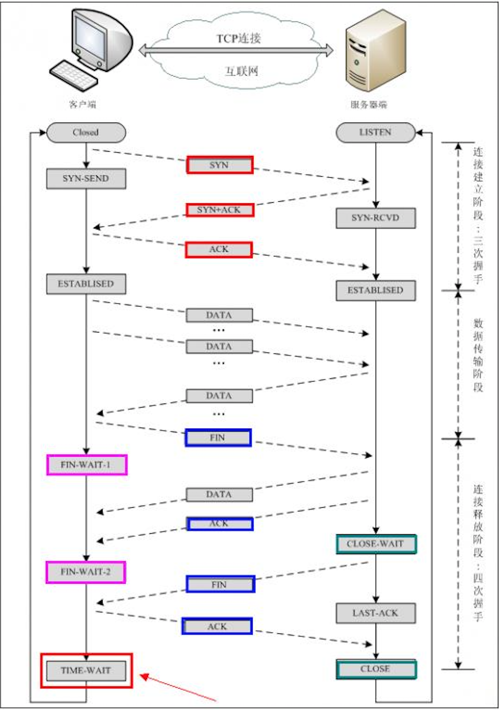
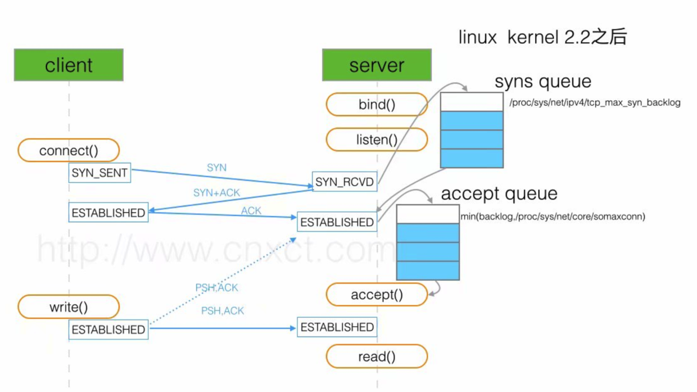

# 计算机网络

## 三次握手，四次挥手




1. 客户端发送SYN，指明客户端的初始序列号ISN(a)。
2. 服务端发送自己的SYN作为应答，同时指明之际的ISN(b)，为了确认客户端的SYN，将ISN(a)+1作为ACK确认。
3. 为了确认服务端的SYN，客户端发送ISN(b)+1作为ACK确认发送给服务端。


1. 客户端发送FIN，seq = K
2. 服务端ACK = K + 1，同时告诉上层应用程序另一端发起关闭。
3. 服务端发送FIN，seq = y
4. 客户端发送确认ACK = y + 1


## 为什么需要三次握手、四次挥手

三次握手建立连接的目的是确认客户端和服务端双方的通信能力，服务端收到客户端的SYN，表示服务端的接受能力和客户端的发送能力正常，客户端收到服务端的ACK，表示客户端的接受、发送能力和服务端的接受、发送能力正常，服务端收到客户端的ACK，表示服务端的发送能力和客户端的接受能力正常，从而双方的通讯正常。

四次挥手，当服务端给收到客户端的FIN，表示客户端终止连接，不再往服务器发送数据，但是服务端这边可能还有数据没有发送完，所以服务端只能先发送一个ACK确认FIN，当应用层决定断开连接之后，再发送FIN断开连接。

三次握手的ACK和SYN可以合在一起发送，四次挥手的FIN和ACK不能放到一起。


## connect、accept在三次握手的体现

- 客户端调用connect()发送SYN到服务器，客户端处于SYN_SEND状态
- 服务端accept()接受SYN之后，发送ACK和SYN，服务器处于SYN_RECV状态
- 客户端接受到SYN后发送ACK给服务端，connect()返回（期间处于阻塞状态），客户端处于ESTABLISHED状态
- 服务端接受到ACK后accept()返回，服务端处于ESTABLISHED状态


## 连接队列



对于服务端来说有两种状态SYN_RECV和ESTABLISHED，服务端维护两个队列，将SYN_RECV状态的连接放到半连接队列中，将ESTABLISHED状态还未被accept()的连接放到全连接队列。

### 半连接队列没有满，全连接队列满

服务端收到最后一个ACK，尝试将连接放到全连接队列，但是全连接队列没有位置，服务器不会改变连接的状态还是SEND_RECV，创建定时器像客户端重传SYN+ACK，如果到一定的重传阈值，则丢弃半连接队列中的syn分节。

### 半连接队列满，全连接队列满

服务端收到syn，半连接队列满了，而且没有重传过syn，丢弃syn。客户端重传syn，服务端的半连接队列满了，而且重传过，正常三次握手，然后判断全连接队列也满了，创建定时器，定时重传syn+ack，直到synack的重传阈值，然后丢弃。

## TCP的心跳机制

TCP默认的tcp keep alive的超时时间太长，默认是7200秒，2个小时。

- TCP提供一个keepalive机制，再网络空闲一段时间后发出报文，如果网络畅通，收到对方的回复报文，继续等待空闲一段时间再次发送；如果没有收到回复，每个一段时间发送报文，如果几次都没有收到，说明对方掉线，recv()返回0，关闭套接字。此方法来检测网络的通畅性。

- 应用层发送心跳包，每隔一段时间发送小的数据包，通知对方自己在线，并传输一些可能必要的数据（告诉服务器数据包为心跳包），定时检测对端返回的数据，如果连续几次没有收到回复，判断对方掉线，做下一步处理。适用于客户端处理，应用层开一个线程发送心跳包。

  

### keepalive的缺点

- keepalive的目的是检测连接是否存在，无法检测能不能发送数据，如果服务器由于负载大无法响应请求，应用层的原因导致无法传输，但是连接还是正常的。

- 如果本地断网，对方不知道，继续发送数据，因为发送数据的优先级大于keepalive，因此keepalive是无法发送出去的。
- keepalive遇到四层负载均衡的中继器，可能不会转发出去。
- 运营商可能过滤掉keepalive数据包。


## time_wait的原因

- last ACK丢失
- 串话

为了实现TCP全双工的可靠释放，如果最后发送的ACK丢失，服务端重新发送FIN，再FIN到达之前，客户端需要保持连接状态（ip、port），不能立即释放或者重新分配，重发ACK之后，如果在2msl时间没有收到服务端的FIN则可以释放资源。RFC 793中规定MSL为2分钟，实际应用中常用的是30秒，1分钟和2分钟等。

TCP连接进入TIME_WAIT状态，处于该状态下的TCP连接不能立即以同样的四元组建立新连接，即发起close的那方占用的local port在TIME_WAIT期间不能再被重新分配。由于TIME_WAIT状态持续时间为2MSL，这样保证了旧TCP连接双工链路中的旧数据包均因过期（超过MSL）而消失，此后，就可以用相同的四元组建立一条新连接而不会发生前后两次连接数据错乱的情况。

### 如何避免time_wait

服务器可以设置SO_REUSEADDR套接字选项来通知内核，如果端口忙，但TCP连接位于TIME_WAIT状态时可以重用端口。在一个非常有用的场景就是，如果你的服务器程序停止后想立即重启，而新的套接字依旧希望使用同一端口，此时SO_REUSEADDR选项就可以避免TIME_WAIT状态。


## TCP和UDP

TCP是面向连接的基于字节流的可靠传输控制协议，需要三次握手，确认重传等连接。有延迟、实时性差。TCP的报文开销大，首部有20字节。

UDP是面向不连接、不可靠的用户数据报协议。开销小，首部8字节，存在丢包，提供一对一、一对多、多对一、多对多的通信。

```c
struct TCP_HEADER 
{
 short m_sSourPort;        　　　　　　// 源端口号16bit
 short m_sDestPort;       　　　　　　 // 目的端口号16bit
 unsigned int m_uiSequNum;       　　// 序列号32bit
 unsigned int m_uiAcknowledgeNum;  // 确认号32bit
 short m_sHeaderLenAndFlag;      　　// 前4位：TCP头长度；中6位：保留；后6位：标志位
 short m_sWindowSize;       　　　　　// 窗口大小16bit
 short m_sCheckSum;        　　　　　 // 检验和16bit
 short m_surgentPointer;      　　　　 // 紧急数据偏移量16bit
}

struct UDP_HEADER 
{
 short m_sSourPort;        　　　　　　// 源端口号16bit
 short m_sDestPort;       　　　　　　 // 目的端口号16bit
 short m_size;						//长度16bit
 short m_sCheckSum;        　　　　　 // 检验和16bit
}
```


## 可靠传输的实现机制：

- **停止等待协议：** 每发完一个分组就停止发送，直到收到上一个分组的确认信息。若超过规定时间没有接收到确认信息，边认为是分组丢失，开始重传。
- **连续ARQ协议：**  发送方采用滑动窗口的形式，处于滑动窗口的分组可以直接发送出去；接收方一般采用累积确认的方式，也就是说接受方不必对接收到的每一个分组都进行确认，而是对按序到达的最后一个分组进行确认，而发送方每接收到一个确认，窗口就向前滑动一定距离。
- **流量控制：**协调发送方和接收方的收发速率，利用滑动窗口来协调，使用探测报文来探测当前应该发送的速率，采用[Nagle算法](http://baike.sogou.com/v10500918.htm?fromTitle=Nagle算法)
- **拥塞控制：**
  当网络中某一资源的需求超出了该资源所能提供的可用部分，这时网络的性能就要开始变坏，这种情况就叫做拥塞。而拥塞控制就是为了减少或者避免拥塞对网络性能的影响而做出的一种控制手段。
- **拥塞控制思路：**发送方维持一个叫做**拥塞窗口**的状态变量，拥塞窗口的大小取决于网络的拥塞程度，并且在动态的变化。发送方让自己的发送窗口等于拥塞窗口，如果在考虑接收方的接收能力，一般发送窗口还要小于拥塞窗口。
- **慢开始：**当主机开始发送数据的时候，由小到大的增大发送窗口，也就是由小到大的增大拥塞窗口。接收方接收到一个报文之后就回传一个确认报文，发送方每接收到一个确认报文，就将拥塞窗口*2，这样每经过一个传输轮次之后，拥塞窗口就增大一倍。
- **拥塞避免：**思路是让拥塞窗口缓慢的增大，即每经过一个往返时间RTT就把发送方的拥塞窗口加1，而不是加倍，这样拥塞窗口就是线性缓慢增加，比慢开始的增长速率缓慢的多。
- **慢开始门限：**为了防止拥塞窗口增长过大引起网络拥塞，还需要设置一个慢开始门限
  - 拥塞窗口<慢开始门限时，使用慢开始算法
  - 拥塞窗口>慢开始门限时，使用拥塞避免算法
  - 拥塞窗口=慢开始门限时，两种算法都可以
- **快重传：**要求收到方每收到一个时序的报文段之后就立即发出重复确认，而不要等到自己发送数据时才进行捎带确认。而发送方只要一连收到三个重复确认就应当立即重传对方尚未接受到的报文，而不必等待为报文设置的重传计时器到期。
- **快回复：**与快重传配合使用，当发送方连续收到三个重复确认的时候，就执行“乘法减小”算法，将慢开始门限减半。将拥塞窗口设置为慢开始门限减半之后的值，并开始指向拥塞避免算法。


## 常见端口：

- FTP（文件传输协议）：20，21------其中20端口用于传输数据，21端口用于命令控制
- Telnet（远程登录协议）：23
- DNS（域名解析服务）：53
- TFTP（简单文件传输协议）：69
- HTTP（超文本传输协议）：80
- HTTPS的端口是443