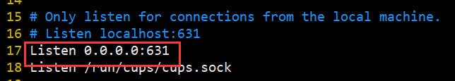
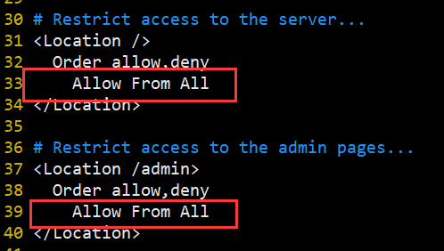

打印机: HP 1020


## 安装打印机驱动
```bash
# 下载安装打印机驱动
wget -O foo2zjs.tar.gz http://foo2zjs.rkkda.com/foo2zjs.tar.gz

tar -xzvf foo2zjs.tar.gz

cd foo2zjs

# 编译
make

# 安装驱动
sudo make install
make install-hotplug
```

## 配置CUPS

```bash
apt install cups

service cups start

# 修改配置文件
vim /etc/cups/cupsd.conf
```




浏览器访问: ip+631访问cups的配置页面
添加对应的打印机

http://192.168.31.241:631/printers/printername


## 可能出现的问题

- make foo2zjs的时候缺少库文件

  ```bash
  #
  # Dependencies...
  #
        ***
        *** Error: gs is not installed!
        ***
        *** Install ghostscript (gs) package
        ***
  make: *** [Makefile:410: all-test] Error 1
  
  # 安装对应软件包
  apt install ghostscript
  
  ```

  ```bash
  #
  # Dependencies...
  #
        ***
        *** Error: dc is not installed!
        ***
        *** Install dc package
        *** for Ubuntu: sudo apt-get install dc
        ***
  make: *** [Makefile:411: all-test] Error 1
  
  apt install dc
  ```

  