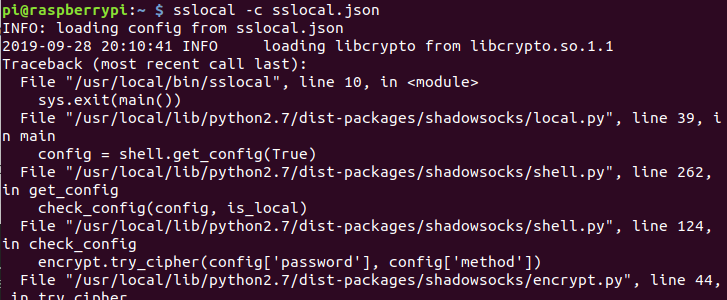
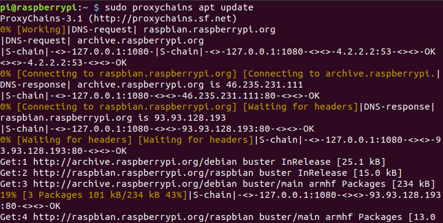

## 树莓派设置代理

1. 安装sslocal

   ```bash
   # sudo pip install shadowsocks
   sudo apt install shadowsocks
   ```

2. 编辑配置文件

   ```bash
   vim sslocal.json     
   ```
   ```bash
   {
       "server": "",
       "server_port": 8388,
       "local_address": "127.0.0.1",
       "local_port": 1080,
       "password": "",
       "timeout": 300,
       "method": "aes-256-cfb"
   }
   ```
   
3. 运行sslocal

   ```bash
   sslocal -c sslocal.json
   ```
   
   
   
   出现错误,需要修改两个文件
   
   ```bash
   sudo vim /usr/local/lib/python2.7/dist-packages/shadowsocks/crypto/openssl.py
   # 修改52行
   libcrypto.EVP_CIPHER_CTX_cleanup.argtypes = (c_void_p,) 
   libcrypto.EVP_CIPHER_CTX_reset.argtypes = (c_void_p,)
   # 修改111行
   libcrypto.EVP_CIPHER_CTX_cleanup(self._ctx) 
   libcrypto.EVP_CIPHER_CTX_reset(self._ctx)
   ```
   
   ```bash
   # 重新启动sslocal
   sslocal -c sslocal.json
   ```
   
4. 自启动+后台运行

   ```bash
    nohup sslocal -c sslocal.json > /dev/null 2>&1 &
    echo "nohup sslocal -c sslocal.json > /dev/null 2>&1 &" > /etc/rc.local
   ```

5. 安装proxychains

   ```bash
	sudo apt install proxychains
   ```

6. 配置proxychains

   ```bash
    sudo vim /etc/proxychains.conf 
    最后一行改为1080
    socks5    127.0.0.1 9050
    socks5    127.0.0.1 1080
   ```

7. 运行proxychains

   ```bash
   sudo proxychains apt update
   ```
   出现路径错误
   ```bash
   ERROR: ld.so: object 'libproxychains.so.3' from LD_PRELOAD cannot be preloaded (cannot open shared object file): ignored.
   ```

   找到绝对路径,并修改路径

   ```bash
   find /usr/ -name libproxychains.so.3 -print
   # /usr/lib/arm-linux-gnueabihf/libproxychains.so.3
   ```
   ```bash
   sudo vim /usr/bin/proxychains
	# export LD_PRELOAD=/usr/lib/arm-linux-gnueabihf/libproxychains.so.3
   ```
