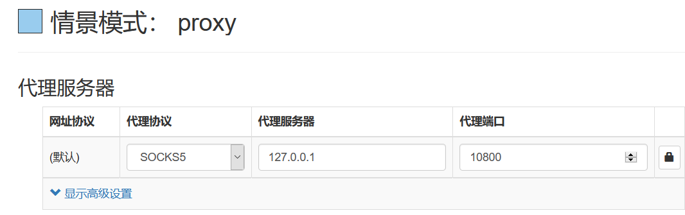
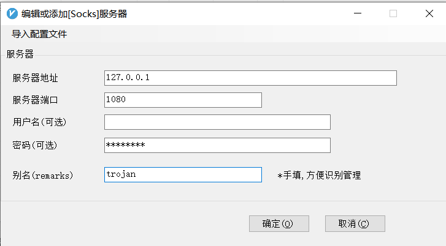

# Trojan

## 一键安装脚本

```shell
bash <(curl -s -L https://github.com/V2RaySSR/Trojan/raw/master/Trojan.sh)
```

## Windwos端
启动trojan-cli下的`start.bat`

### 方法一

如果浏览器中安装有SwitchyOmega插件，可以添加`socks5`代理服务器，地址是`127.0.0.1:1080`



### 方法二

在v2rayN中添加`Socks`服务器。

```shell
服务器地址: 127.0.0.1
端口: 1080
密码: your passwrod
别名: 自定义
```



添加成功之后，设置为活动服务器即可。


## Android端

[安装包下载地址](https://github.com/trojan-gfw/igniter/releases)

安装成功之后，添加配置即可。


<!--  -->
