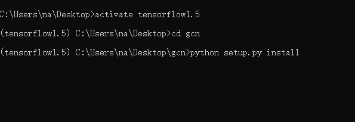
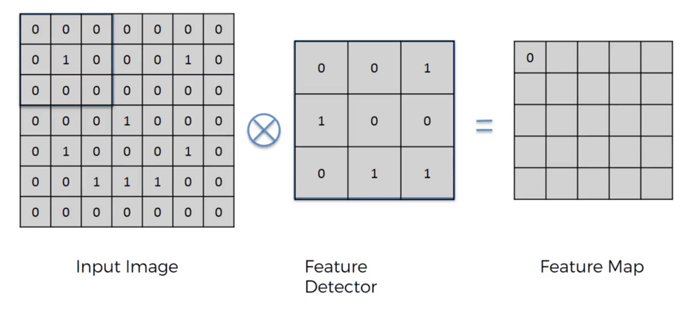
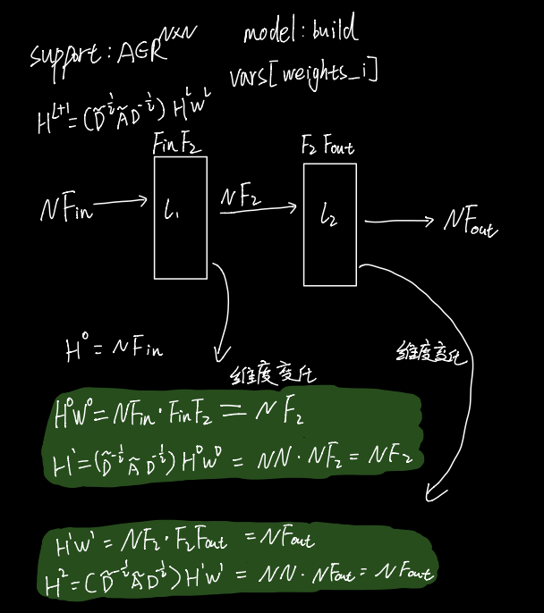

## 项目运行

```bash
# 克隆项目
git clone https://github.com/tkipf/gcn.git

# 新建python虚拟环境
conda create -n tensorflow1.5 python=3.7

# 激活虚拟环境
activate tensorflow1.5

# 安装项目依赖包
python setup.py install

# 运行项目
python train.py
```




## 原理分析

论文还没有看挖个坑。

论文地址：[Semi-Supervised Classification with Graph Convolutional Networks](https://arxiv.org/pdf/1609.02907)

作者的博客：[graph-convolutional-networks](http://tkipf.github.io/graph-convolutional-networks/)


GCN是图卷积网络，图结构一般是不规则的，在生活中图结构可以表示很多复杂的关系和模型，如何有效地对图进行embedding成为图处理的关键，作者参照图像处理中的卷积提出了一种图卷积的embedding方法。

图像处理的卷积例如CNN，通过一个卷积核对图像数据进行特征提取，而图卷积没有固定的卷积核。




首先定义一张图$G(V，E)$，输入为$X\in R^{N\times D}$，$N$表示节点数，$D$表示每个节点的特征数，临界矩阵$A\in R^{N \times N}$，通过卷积得到$Z\in R^{N \times F}$，$F$为输出的特征数。

对于$l$层的卷积可以表示为：$H^{l+1} = f(H^{l}, A)$，$H^0=X, H^l = Z$。

每次图卷积通过函数$f(当前的特征矩阵，邻接矩阵)$得到。

使用邻接矩阵可以考虑到其他点对当前节点的作用，但是却忽略了顶点自身的作用，所以一般在邻接矩阵的基础上$\pm$度矩阵$D$或单位矩阵$I$，另外还需要对这个矩阵进行归一化处理，减小hub节点的影响。

最终得到：$H^{l+1}=\sigma(\tilde{D}^{-\frac{1}{2}} \tilde{A} \tilde{D}^{-\frac{1}{2}} H^l W^l)$，$\tilde{A}=A+I_N$，$\tilde{D}_{ii}=\sum_j\tilde{A}_{ij}$。


## 代码分析

这里分析的是Tensorflow版本的代码，只分析模型关键部分。

项目地址：[github.com/tkipf/gcn](https://github.com/tkipf/gcn)。

tensorflow还没用过，不过不影响理解代码逻辑，有空再补...


> 代码结构

```bash
|--data/
    |--ind.cora.x
    |--ind.cora.y
    |--ind.cora.tx
    |--ind.cora.ty
    |--ind.cora.allx
    |--ind.cora.ally
    |--ind.cora.graph
|--inits.py 	# 矩阵的初始化函数
|--utils.py		# 加载数据、预处理特征和邻接矩阵
|--metrics.py # 模型评估
|--layers.py	# 卷积层
|--model.py		# 模型
|--train.py		# 训练
```


> layers.py

```python
# 基类
class Layer(object):
  # 变量初始化
	def __init__(self, **kwargs):
    ...
  
  # 卷积计算
  def _call(self, inputs):
    pass
  
  # _call适配器
  def __call__(self, inputs):
    outputs = self._call(inputs)
```

```python
# 卷积层
class GraphConvolution(Layer):
  def _call(self, inputs):
    x = inputs
    pre_sup = dot(x, self.vars['weights_' + str(i)])
    output = dot(self.support[i], pre_sup)
    return output
```


> model.py

```python
class Model(object):
  # 变量初始化
	def __init__(self, **kwargs):
    ...
    
  # 搭建神经网络
  def _build(self):
    pass
  
  # _build适配器
  def build(self):
    with tf.variable_scope(self.name):
      self._build()
      
    self._loss() # 损失函数计算
    self._accuracy() # 精度计算
    self.opt_op = self.optimizer.minimize(self.loss) # 优化目标

  # Build sequential layer model
  self.activations.append(self.inputs) # features
  for layer in self.layers:
    hidden = layer(self.activations[-1]) # 卷积计算
    self.activations.append(hidden)
  self.outputs = self.activations[-1]
```


```python
# 继承Model，实现_build函数，创建一个两层的卷积网络
class GCN(Model):
	def _build(self):
    self.layers.append(GraphConvolution(input_dim=self.input_dim, # 1433
                                        output_dim=FLAGS.hidden1, # 16
                                        placeholders=self.placeholders,
                                        act=tf.nn.relu,
                                        dropout=True,
                                        sparse_inputs=True,
                                        logging=self.logging))

    self.layers.append(GraphConvolution(input_dim=FLAGS.hidden1, # 16
                                        output_dim=self.output_dim, # 7
                                        placeholders=self.placeholders,
                                        act=lambda x: x,
                                        dropout=True,
                                        logging=self.logging))
```


> train.py

```python
for epoch in range(FLAGS.epochs):
	outs = sess.run([model.opt_op, model.loss, model.accuracy], feed_dict=feed_dict)

	# Validation
  cost, acc, duration = evaluate(features, support, y_val, val_mask, placeholders)
```

