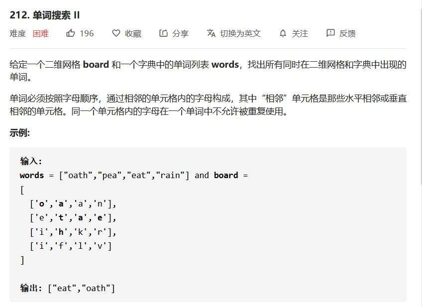

## Trie树

Trie (发音为 "try") 或前缀树是一种树数据结构，用于检索字符串数据集中的键。这一高效的数据结构有多种应用：
1. 自动补全

2. 拼写检查

3. IP 路由 (最长前缀匹配)

4. T9 (九宫格) 打字预测

5. 单词游戏

## 单词搜索II

[题目链接](https://leetcode-cn.com/problems/word-search-ii/)



将单词放到Trie上，然后DFS。

```cpp
class Solution {
public:
    struct Trie{
        vector<Trie*> nex;
        string word;
        Trie() {
            word.clear();
            nex.resize(26, nullptr);
        }
    };
    Trie *rt;
    vector<string> ret;
    int row, col;
    void insert(string words) {
        Trie *cur = rt;
        for (auto it : words) {
            if (!cur->nex[it-'a']) cur->nex[it-'a'] = new Trie();
            cur = cur->nex[it-'a'];
        }
        cur->word = words;
    }
    vector<string> findWords(vector<vector<char>>& board, vector<string>& words) {
        rt = new Trie();
        for (string &it : words) {
            insert(it);
        }
        row = board.size();
        col = board[0].size();
        for (int i = 0; i < row; ++i) {
            for (int j = 0; j < col; ++j) {
                dfs(board, i, j, rt);
            }
        }
        return vector<string>(ret.begin(), ret.end());
    }

    void dfs(vector<vector<char>>& board, int i, int j, Trie* rt) {
            char c = board[i][j];
            if (c == '@' || !rt->nex[c-'a']) return;
            rt = rt->nex[c - 'a'];
            if (!rt->word.empty()) {
                ret.push_back(rt->word);
                rt->word.clear();
            }

            board[i][j] = '@';
            if (i+1 < row)    dfs(board, i+1, j, rt);
            if (i-1 >= 0)   dfs(board, i-1, j, rt);
            if (j+1 < col)    dfs(board, i, j+1, rt);
            if (j-1 >= 0)   dfs(board, i, j-1, rt);
            board[i][j] = c;
        }
};
```

