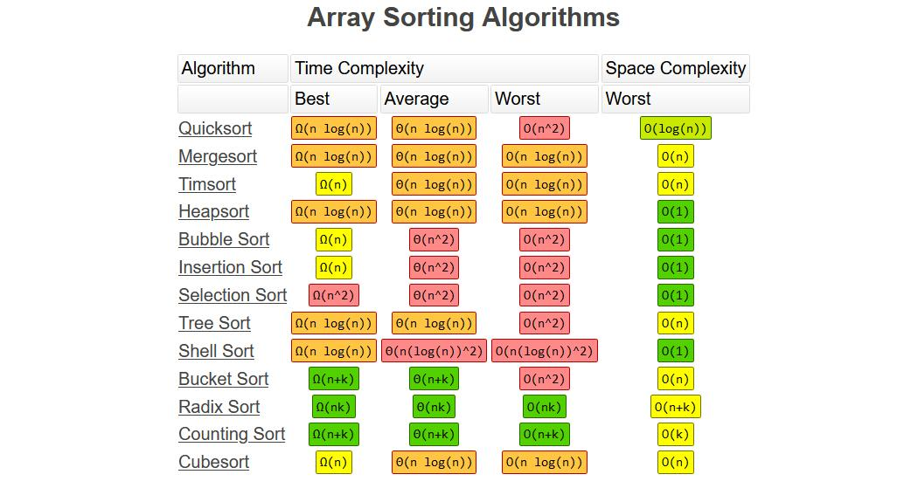

## 归并排序

将大的数组分成两个，然后对两个数组进行合并。

- 时间复杂度$O(nlog_2n)$
- 空间复杂度$O(n)$
- 稳定
- 非原地排序

```c
void merge(int *arr, int l, int mid, int r, int *tmp) {
	int i = l; 		// 左数组
	int j = mid+1;	// 右数组
	int t = l;		// 合并的数组
	while (i <= mid && j <= r) {
		if (arr[i] < arr[j]) {
			tmp[t++] = arr[i++];
		}else {
			tmp[t++] = arr[j++];
		}
	}
	while (i <= mid) tmp[t++] = arr[i++];
	while (j <= r) tmp[t++] = arr[j++];
	for (int i = l; i <= r; ++i) {
		arr[i] = tmp[i];
	}
}

// 递归版本
void mergeSort(int *arr, int l, int r, int *tmp) {
	if (l == r) return;
	int mid = (l + r) >> 1;
	mergeSort(arr, l, mid, tmp);
	mergeSort(arr, mid+1, r, tmp);
	merge(arr, l, mid, r, tmp);
}

// 非递归版本
void mergeSort(int *arr, int len, int *tmp) {
	for (int i = 1; i < len; i += i) {
		for (int j = 0; j <= len; j += i*2) {
			int l = j;
			int mid = min(j+i-1, len-1);
			int r = min(j+i*2-1, len-1);
			merge(arr, l, mid, r, tmp);
		}
	}
}
```


## 堆排序

将数组对应建一个完全二叉树，节点编号从0开始，从最后一个非叶子节点（len / 2 - 1），开始调整。

升序建立大顶堆，降序建小顶堆。

将堆顶和最后一个元素交换，这样就确定一个最大/小值，然后调整堆顶元素，重复操作。

- 时间复杂度$O(nlog_2n)$
- 空间复杂度$O(1))$
- 不稳定
- 原地排序

```c
void adjustHeap(int *arr, int i, int len) {
	int x = arr[i];
	// 从左孩子开始调整
	for (int k = i*2+1; k < len; k = k*2+1) {
		// k指向最大的孩子
		if (k+1 < len && arr[k] < arr[k+1]) k++;
		if (arr[k] > x) {
			arr[i] = arr[k];
			i = k;
		}else break;
	}
	arr[i] = x;
}

void heapSort(int *arr, int len) {
	// 构造大顶堆
	// 从第一个非叶子节点开始
	for (int i = len/2 - 1; i >= 0; --i) {
		adjustHeap(arr, i, len);
	}
	// 堆顶元素交换到最后
	for (int i = len-1; i >= 0; --i) {
		swap(arr[0], arr[i]);
		adjustHeap(arr, 0, i);
	}
}
```


## 快速排序

每次选择一个基准数x，从左到右找到第一个大于x的数，从右向左找到第一个大于x的数，交换两个数字。

这样每次可以确定一个x的位置，同时数字的左边都不大于x，右边的数不小于x。然后递归左右。

可能会退化为冒泡排序。

- 时间复杂度$O(nlog_2n)、O(n^2)$
- 空间复杂度$O(log_2n)、 O(n)$
- 不稳定
- 原地排序


**虽然堆排序比快排更加稳定，但是一般使用快排，首先快排是顺序访问，堆排是跳跃访问对cpu不友好；对于一个近乎有序的数组，堆排序会降低有序度。**

```c
void quickSort(int* arr, int l, int r) {
	if (l >= r) return;
	int x = arr[l];
	int i = l + 1;
	int j = r;
	while (i <= j) {
		// 右到左找到一个小于x的数
		while (i <= j && arr[j] >= x) --j;
		// 左到右找到一个大于x的数
		while (i <= j && arr[i] <= x) ++i;
		// 交换位置
		if (i <= j) swap(arr[i], arr[j]);
	}
	// 确定x的位置
	swap(arr[l], arr[j]);
	quickSort(arr, l, j - 1);
	quickSort(arr, j + 1, r);
}
```

