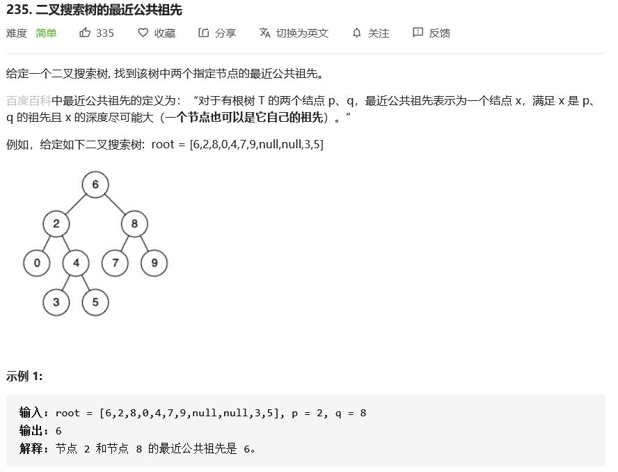

## 验证二叉搜索树

[题目链接](https://leetcode-cn.com/explore/interview/card/top-interview-questions-easy/7/trees/48/)


   - 为每个点设置上下界
   - 检查中序遍历结果

   ```c
class Solution {
public:
    bool isValidBST(TreeNode* root) {
        return judge(root, LLONG_MIN, LLONG_MAX);
    }
    
    bool judge(TreeNode*rt, long long l, long long r) {
        cout << l << " " << r << endl;
        if (rt == nullptr) return true;
        if (rt->val <= l || rt->val >= r) return false;
        return judge(rt->left, l, rt->val) && judge(rt->right, rt->val, r);
    }
};
   ```

   

## 二叉树的最近公共祖先

[题目链接](lowest-common-ancestor-of-a-binary-tree)


- 递归找p，q，返回分叉的点
- 记录路径，找最先重合的点

```cpp
/**
 * Definition for a binary tree node.
 * struct TreeNode {
 *     int val;
 *     TreeNode *left;
 *     TreeNode *right;
 *     TreeNode(int x) : val(x), left(NULL), right(NULL) {}
 * };
 */

class Solution {
public:
    TreeNode* lowestCommonAncestor(TreeNode* root, TreeNode* p, TreeNode* q) {
        if (root == nullptr || root == p || root == q) return root;
        TreeNode *left = lowestCommonAncestor(root->left, p, q);
        TreeNode *right = lowestCommonAncestor(root->right, p, q);
        return left == nullptr ? right : right == nullptr ? left : root;
    }
};
```

```cpp
class Solution {
private:
    unordered_map<TreeNode*, TreeNode*> fa;
    unordered_map<TreeNode*, bool> vis;

public:
    void dfs(TreeNode* rt) {
        if (rt == nullptr) return;
        if (rt->left) fa[rt->left] = rt;
        if (rt->right) fa[rt->right] = rt;
        dfs(rt->left);
        dfs(rt->right);
    }
    TreeNode* lowestCommonAncestor(TreeNode* root, TreeNode* p, TreeNode* q) {
        if (root == nullptr) return root;
        dfs(root);
        while (p != nullptr) {
            vis[p] = true;
            p = fa[p];
        }
        while (q != nullptr) {
            if (vis[q]) return q;
            q = fa[q];
        }
        return nullptr;
    }
};
```


## 二叉搜索树的最近公共祖先

[题目链接](https://leetcode-cn.com/problems/lowest-common-ancestor-of-a-binary-search-tree/)



- 可以按照一般的做法
  - 记录路径
  - 递归查找
- 利用BST的性质，比较元素确定，找到第一个分开的节点
  - 递归
  - 迭代

```cpp
/**
 * Definition for a binary tree node.
 * struct TreeNode {
 *     int val;
 *     TreeNode *left;
 *     TreeNode *right;
 *     TreeNode(int x) : val(x), left(NULL), right(NULL) {}
 * };
 */

class Solution {
public:
    TreeNode* lowestCommonAncestor(TreeNode* root, TreeNode* p, TreeNode* q) {
        if (root->val < p->val && root->val < q->val) 
            return lowestCommonAncestor(root->right, p, q);
        if (root->val > p->val && root->val > q->val)
            return lowestCommonAncestor(root->left, p, q);
        return root;
    }
};
```

```cpp
class Solution {
public:
    TreeNode* lowestCommonAncestor(TreeNode* root, TreeNode* p, TreeNode* q) {

        while (root) {
            if (root->val < p->val && root->val < q->val) root = root->right;
            else if (root->val > p->val && root->val > q->val) root = root->left;
            else break;
        }
        return root;
    }
};
```


## 二叉树的层序遍历

[题目链接](https://leetcode-cn.com/problems/binary-tree-level-order-traversal/)


- BFS
- DFS

```cpp
/**
 * Definition for a binary tree node.
 * struct TreeNode {
 *     int val;
 *     TreeNode *left;
 *     TreeNode *right;
 *     TreeNode(int x) : val(x), left(NULL), right(NULL) {}
 * };
 */
class Solution {
public:
    vector<vector<int>> levelOrder(TreeNode* root) {
        vector<vector<int>> ret;
        dfs(root, 1, ret);\
        return ret;
    }
    
    void dfs(TreeNode* root, int level, vector<vector<int>> &ret) {
        if (root == nullptr) return;
        if (ret.size() < level) ret.push_back(vector<int>{});
        ret[level-1].push_back(root->val);
        dfs(root->left, level+1, ret);
        dfs(root->right, level+1, ret);
    }
};
```


```cpp
class Solution {
public:
    vector<vector<int>> levelOrder(TreeNode* root) {
        vector<vector<int>> ret;
        if (root == nullptr) return ret;
        queue<TreeNode*> que;
        que.push(root);
        while (!que.empty()) {
            ret.push_back(vector<int>());
            int cnt = que.size();
            for (int i = 0; i < cnt; ++i) {
                auto front = que.front(); que.pop();
                ret.back().push_back(front->val);
                if (front->left) que.push(front->left);
                if (front->right) que.push(front->right);
            }
        }
        
        return ret;
    }
    
};
```

