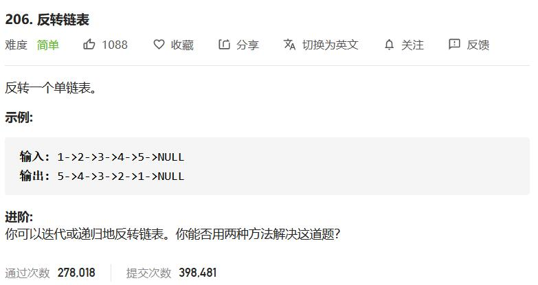

## 1. 反转链表

[题目链接](https://leetcode-cn.com/problems/reverse-linked-list/)



- 迭代
- 递归

```cpp
/**
 * Definition for singly-linked list.
 * struct ListNode {
 *     int val;
 *     ListNode *next;
 *     ListNode(int x) : val(x), next(NULL) {}
 * };
 */
class Solution {
public:
    ListNode* reverseList(ListNode* head) {
        ListNode *pre = nullptr;
        while (head) {
            ListNode *next = head->next;
            head->next = pre;
            pre = head;
            head = next;
        }
        return pre;
    }
};
```

```cpp
class Solution {
public:
    ListNode* reverseList(ListNode* head) {
        if (head == nullptr || head->next == nullptr) return head;
        ListNode *p = reverseList(head->next);
        head->next->next = head;
        head->next = nullptr;
        return p;
    }
};
```

```cpp
#include <bits/stdc++.h>
using namespace std;
struct Node{
    int val;
    Node* next;
    Node(int x) {
        val = x;
        next = nullptr;
    }
};

void insert(Node* link, int x) {
    Node *node = new Node(x);
    while (link->next) {
        link = link->next;
    }
    link->next = node;
}

void print(Node* link) {
    while (link) {
        cout << link->val << " ";
        link = link->next;
    }
    cout << endl;
}

Node* reverse(Node* head) {
    Node* pre = nullptr;
    while (head) {
        Node* next = head->next;
        head->next = pre;
        pre = head;
        // Node* node = new Node(head->val);
        // node->next = pre;
        // pre = node;
        head = next;
    }
    return pre;
}

int main() {

    Node *head = new Node(1);
    for (int i = 2; i < 6; ++i) {
        insert(head, i);
    }

    print(head);
    Node* r_head = reverse(head);
    print(r_head);
    print(head);

    return 0;
}
```


## 2. 两两交换链表节点

[题目链接](https://leetcode-cn.com/problems/swap-nodes-in-pairs/)


- 迭代，引入头结点方便统一操作

- 递归

```cpp
/**
 * Definition for singly-linked list.
 * struct ListNode {
 *     int val;
 *     ListNode *next;
 *     ListNode(int x) : val(x), next(NULL) {}
 * };
 */
class Solution {
public:
    ListNode* swapPairs(ListNode* head) {

        ListNode *dummy = new ListNode(-1);
        dummy->next = head;
        
        ListNode *pre = dummy;
        
        while (head && head->next) {
            // node
            ListNode *first = head;
            ListNode *second = head->next;

            // swap
            first->next = second->next;
            second->next = first;
            pre->next = second;
            
            // move on
            pre = first;
            head = first->next;
        }
        return dummy->next;
    }
};
```

```cpp
class Solution {
public:
    ListNode* swapPairs(ListNode* head) {
        if (!head || !head->next) return head;
        // node
        ListNode *first = head;
        ListNode *second  = head->next;
        
        // swap
        first->next = swapPairs(second->next);
        second->next = first;

        return second;
    }
};
```


## 3. 环形链表

[题目链接](https://leetcode-cn.com/problems/linked-list-cycle/)


- 哈希表
- 快慢指针

```cpp
class Solution {
public:
    bool hasCycle(ListNode *head) {
        
        unordered_set<ListNode*> st;
        
        while (head) {
            
            if (st.find(head) != st.end()) return true;
            else st.insert(head);

            head = head->next;
        }
        return false;
    }
};
```


```cpp
/**
 * Definition for singly-linked list.
 * struct ListNode {
 *     int val;
 *     ListNode *next;
 *     ListNode(int x) : val(x), next(NULL) {}
 * };
 */
class Solution {
public:
    bool hasCycle(ListNode *head) {
        ListNode *first = head;
        ListNode *second = head;
        while (second && second->next) {
            head = head->next;
            second = second->next->next;
            if (head == second) return true;
        }
        return false;
    }
};
```


## 4. 环形链表II

- 哈希表
- 快慢指针+floyd


```cpp
class Solution {
public:
    ListNode *detectCycle(ListNode *head) {
        unordered_set<ListNode*> st;
        
        while (head) {
            
            if (st.find(head) != st.end()) return *st.find(head);
            else st.insert(head);

            head = head->next;
        }
        return nullptr;
    }
};
```

```cpp
/**
 * Definition for singly-linked list.
 * struct ListNode {
 *     int val;
 *     ListNode *next;
 *     ListNode(int x) : val(x), next(NULL) {}
 * };
 */
class Solution {
public:
    ListNode *detectCycle(ListNode *head) {
        if (!head || !head->next) return nullptr;

        ListNode *fast = head;
        ListNode *slow = head;
        while (fast && fast->next) {
            slow = slow->next;
            fast = fast->next->next;
            if (fast == slow) break;
        }
        if (fast != slow) return nullptr;
        
        slow = head;
        while (slow != fast) {
            slow = slow->next;
            fast = fast->next;
        }
        return fast;
    }
};
```


## 5. K个一组反转链表

[题目链接](https://leetcode-cn.com/problems/reverse-nodes-in-k-group/)


- 递归模拟

```cpp
/**
 * Definition for singly-linked list.
 * struct ListNode {
 *     int val;
 *     ListNode *next;
 *     ListNode(int x) : val(x), next(NULL) {}
 * };
 */
class Solution {
public:
    ListNode* reverseKGroup(ListNode* head, int k) {
        ListNode *last = head;
        for (int i = 1; i < k && last; ++i) {
            last = last->next;
        }
        if (!last) return head;
        
        ListNode *next = last->next;
        
        // reverse linked
        last->next = nullptr;
        reverse(head);

        // continue next
        head->next = reverseKGroup(next, k);
        return last;
    }
    // reverse linked
    ListNode* reverse(ListNode *head) {
        ListNode* pre = nullptr;
        while (head) {
            ListNode *next = head->next;
            head->next = pre;
            pre = head;
            head = next;
        }
        return pre;
    }

};
```

