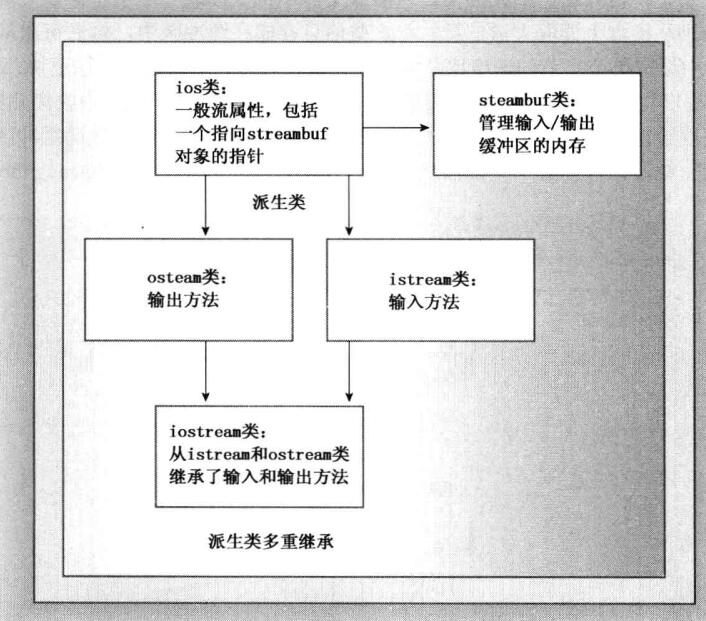

# C++ Pirmer Plus (第6版) 笔记

## 第2章 开始学习

- main()被启动代码调用，而启动代码有编译器添加到程序中，是程序和操作系统的桥梁。

- C++中函数的括号为空与在括号中使用void是等效的，在C中括号空着意味着对是否接受参数保持沉默。

- void main()，返回值为空，但不是当前标准的强制的一个选项，在一些系统不能工作。

- ANSI/ISO C++标准规定，如果编译器到达末尾时没有遇到返回语句，认为main()函数有 `return 0；`结尾。只适用于main函数。

- main()作为函数的入口，存在一些例外的情况，在Windows下，可以编写动态链接库（DLL）模块，这是其他程序可以使用的代码，由于DLL不是独立的程序，所以不需要main()。用与专用环境的程序，机器人中的控制芯片，可能不需要main()。

- C++的注释符为`//`，C的注释符为`/* */`，C++同时支持两种注释，C99标准也在C语言中添加了`//`注释，尽量使用C++注释，不实际到结尾符号与起始符号的正确配对。

- 老式C的头文件保留了`.h`扩展名（C++中仍可以使用），C++的头文件没有扩展名，有些C头文件被转换为C++头文件，这些文件进行重命名，去掉了`.h`后缀并在前面添加前缀c（表明来自C语言）。

- 命名空间可以解决，同名函数的问题。命名空间的使用方式一般为：

  - 将`using namespace std;`放在函数定义前，文件中所有函数都可以使用命名空间`std`中的元素。
  - 将`using namespace std;`放在特定的函数中，函数能使用名称空间std中的所有元素。
  - 特定的函数中使用类似`using std::cout`这样的编译指令，然函数能够使用指定的元素。
  - 不适用编译指令`using`，在需要使用命名空间`std`中的元素时，使用前缀`std::`。

- `endl`确保程序继续运行前刷新输出（将其立即显示到屏幕上），使用`\n`不能提供这样的保证。

- 标记：一行代码中不可分割的元素。通常使用空格、制表符、回车将两个标记分开，括号和逗号不需要使用空白分开的标记。

  空白：空格、制表符、回车。

  ```c
  return 0; 	// false
  return(0);	// true;
  ```

- `int a;`，指定了需要的内存、内存单元的名称。变量需要声明，一些语言支持使用时创建新的变量，而不是显示的进行声明，问题是如果错误的拼写变量名，将在不知情的情况下创建一个新的变量。

- 函数原型只描述函数接口，函数定义包含了函数的代码。C和C++将库函数的原型和定义分开了。库文件中包含了函数的编译代码，头文件中包含了原型。

  C++库函数存储在库文件中，编译器编译程序时，必须在库文件中搜索使用的函数，可能由于编译器不能自动搜索数学库提示错误，可以在编译时指定库文件`g++ main.cpp -lm`。

- 关键字是C++专用的，不能作为变量名。main不是关键字，可以作为变量名，但是可能会引发错误。


## 第3章 处理数据

   - C++内置的整型：unsigned long、long、unsigned int、int、unsigned short、short、char、unsigned char、signed char、bool、unsigned long long、long long。

     表示各种整型的系统限制的climits文件。

     ```c
     #include <iostream>
     #include <climits>
     using namespace std;

     int main() {

         cout << "char的位数:" << CHAR_BIT << endl;      // 8
         cout << "char的最大值:" << CHAR_MAX << endl;    // 127
         cout << "char的最小值:" << CHAR_MIN << endl;    // -128

         cout << "signed char的最大值:" << SCHAR_MAX << endl;    // 127
         cout << "signed char的最小值:" << SCHAR_MIN << endl;    // -128
         cout << "unsigned char的最大值:" << UCHAR_MAX << endl;  // 255

         cout << "short的最大值:" << SHRT_MAX << endl;           // 32767
         cout << "short的最小值:" << SHRT_MIN << endl;           // -32768
         cout << "unsigned short的最大值:" << USHRT_MAX << endl; //  65535

         cout << "int的最大值:" << INT_MAX << endl;          // 2147483647
         cout << "int的最小值:" << INT_MIN << endl;          // -2147483648
         cout << "unsigned int最大值:" << UINT_MAX << endl;  // 4294967295

         cout << "long的最大值:" << LONG_MAX << endl;                // 2147483647
         cout << "long的最小值:" << LONG_MIN << endl;                // -2147483648
         cout << "unsigned long的最大值:" << ULONG_MAX << endl;      // 4294967295
         cout << "long long的最大值:" << LLONG_MAX << endl;          // 9223372036854775807
         cout << "long long的最小值:" << LLONG_MIN << endl;          // -9223372036854775808
         cout << "unsigned long long的最小值:" << ULLONG_MAX << endl;// 18446744073709551615

         return 0;
     }
     ```

     C++内置的浮点型：float、double、long double。float最少32位，double最少64位，long double为80、96、128位。

     表示浮点类型的系统限制的cfloat或float.h文件中。

     ```c
     cout << "double的有效位:" << DBL_DIG << endl;        // 15
     cout << "float的有效位:" << FLT_DIG << endl;         // 6
     cout << "long double的有效位:" << LDBL_DIG << endl;  // 18

     // 在不损失精度的前提下, 基于基数FLT_RADIX的数的最大数字个数
     #define DBL_MANT_DIG    53
     #define FLT_MANT_DIG    24
     #define LDBL_MANT_DIG   64

     // 最大最小的指数位数
     #define DBL_MAX_10_EXP  +308
     #define FLT_MAX_10_EXP  +38
     #define LDBL_MAX_10_EXP  +4932

     #define DBL_MIN_10_EXP  -307
     #define FLT_MIN_10_EXP  -37
     #define LDBL_MIN_10_EXP  -4931
     ```

   - C++类型分为：基本类型（整数、浮点数）和复合类型（数组、字符串、指针、结构）。

   - 变量名的命名规则：

     - 名称中只能使用字母、数字、下划线。
     - 名称的第一个字符不能是数字。
     - 区分字母的大小写。
     - 不能将C++的关键字用作名称。
     - 以两个下划线或下划线加大写字母开头的保留使用（编译器及其使用的资源）。以一个下划线开头的名称保留给实现，用作全局标识符。
     - C++对名称的长度没有限制，有些平台有长度限制。

   - 字节的含义依赖于实现，一些系统中可能不是8位。

   - sizeof，对类型名（int）使用sizeof运算符时，应将类型名放到括号中，如果对变量名使用运算符，括号是可选的。

   - C++11有一种{}的初始化方式，适用于数组和结构，在C++98中也可以用于单值变量。

     ```c
     int a = {1};    // 1
     int b {2};      // 2
     int c {};       // 0
     ```

   - 整型字面值

     - 第一个数字为`1-9`表示十进制数

     - 第一位为`0`第二位为`1-7`表示八进制数

     - `0x`或`0X`开始的为16进制数

     ```c
     int hex = 0x10; // 16
     int oct = 010;  // 8
     int num = 10;   // 10
     ```

   - 编译器如何知道常量的类型？

     - 可以在数字后面加后缀来指明类型

       ```c
       l, L 表示long常量
       u, U 表示unsigned int常量
       ll, LL表示long long常量
       ull, ULL表示unsigned long long常量
       ```

     - 不带后缀的数字，通过数字大小来使用最小类型来表示。

   - 浮点数的存储，计算机将浮点数分为两部分：一部分表示值，另一部分表示缩放。

     书写的时候有两种方式：

     - 使用小数点的方式
     - 使用E表示法

     ```c
     double a = 0.015;
     double a = 1.5E-2;
     ```

   - C++有3中浮点类型：float、double、long double。

   - 强制类型转化

     ```c
     (typeName) value;
     typeName (value);
     ```

     另外C++还有四种强制类型转换运算符：

     ```c
     static_cast<>();
     dynamic_cast<>();
     const_cast<>();
     reinterpert_cast<>();
     ```

   - C++没有提供防止超出整型范围的情况，可以使用`climits`来确定限制。

   - 将long赋值给double，不会出现误差，long的最多10位而double的有效位有15。

     long long赋值给double，会出现误差，long long可以提供19位的数字。


## 第4章 复合类型

- 数组的初始化

  ```c
  int cars[4] = {1, 2, 3, 4}; // 只能在定义的时候初始化
  int cars[4] = {1, 2}; // 其他元素默认为0
  int cars[4] {1, 2, 3, 4}; // C++支持
  ```

  数组的初始化禁止缩窄转化

  ```c
  long plifs[] = {1, 2, 3.0}; // not allowed
  ```
  将浮点数转化为long是缩窄操作，不能通过编译。

- 字符常量和字符串常量
字符串常量和字符常量不能相互转化，`'a'`是字符常量，`"a"`是字符串常量，它是`'a'`和`'\0'`组成的字符串，`"a"`表示字符串所在的内存地址。

  ```c
  char c = "a"; // not allow，尝试将内存地址赋值给c
  ```

- 字符串拼接

  ```c
  cout << "hello " "world" << endl;
  cout << "hello world" << endl;
  ```

- cin读取字符串
cin读取字符串使用空白（空格、制表符、换行符）来确定字符串结束的位置。
  - getline
  通过回车输入的换行符来确定输入结尾，`cin.getline`又两个参数，一个是用来存储输入行的数组名，一个是读取的字符数，如果参数是是20，最多读取19个字符，最后一个字符用来存储空字符。
  `getline`在读取到指定数目的字符或遇到换行符时停止读取。

    ```c
    int main() {

        char s[10];
        cin.getline(s, 10);
        cout << s << endl;

        string t;
        getline(cin, t);
        cout << t << endl;
        return 0;
    }
    ```

  - get()

    get()和getline的参数解释相同，但是get()不会跨过换行符，如果连续读取字符串，需要手动读取换行符。

    ```c
    cin.get(s, 10);
    cin.get(); // 读取换行符
    cin.get(t, 10);
    ```

    还有一种使用get()的方式，将两个类成员函数拼接起来，应为cin.get()返回的是一个cin对象。

    ```c
    cin.get(s, 10).get();
    cin.getline(s, 10).getline(t, 10);
    ```

- 原始(raw)字符串

  在原始字符串中，字符表示机子，`\n`表示的就是字符`\n`，而不是换行。使用就是将字符串放到`R"(string)"`中。

  ```c
  int main() {

      cout << "\\n (hello) \\t" << endl;
      cout << R"(\n (hello) \t )" << endl;

      return 0;
  }
  ```

- 结构体的每个成员都有一个位字段。
  ```c
  struct T{
      int a : 4; // 4 bits
      char b : 8; // 8 bits
  };
  ```

- 共用体（union）

  union是一种数据结构，可以存储不同的数据类型，但是同时只能存储一种数据类型。union的空间大小是最大的成员空间。

  ```c
  union U{
      int a;
      long long b;
      double c;
  };

  U test;
  cout << sizeof(test) << endl; // 8
  cout << sizeof(test.a) << endl; // 4
  cout << sizeof(test.b) << endl; // 8
  cout << sizeof(test.c) << endl; // 8
  ```

  当数据使用多种格式，但不会同时使用的时候，可以节省空间。
  ```c
  struct Home{
      char tv[10];
      int type;
      union id{
          int id_num;
          char id_char[10];
      }id_val;
  };

  Home home;
  if (home.type == 1) {
      cin >> home.id_val.id_num;
  }else {
    cin >> home.id_val.id_char;
  }
  ```

  可以使用匿名共用体，简化操作。
  ```c
  struct Home{
      char tv[10];
      int type;
      union {
          int id_num;
          char id_char[10];
      };
  };

  Home home;
  if (home.type == 1) {
      cin >> home.id_num;
  }else {
    cin >> home.id_char;
  }
  ```

- 枚举

  C++的enum是另一种创建符号常量的方法，可以替换const，允许定义新的类型。

  ```cpp
  int main() {

    enum Day {Mon, Tue, Wed, Thu, Fri, Sta, Sun};
    enum {Mon, Tue, Wed, Thu, Fri, Sta, Sun}; // 如果不创建新的变量，可以省略名称
    Day day = Tue;
    Day day2 = (Day)10; // 默认只能用定义的变量来赋值，需要强转

    day++; // invalid, enum没有算术运算符

    cout << day << endl; // 1
    cout << day2 << endl; // 10

    return 0;
  }
  ```

  enum可以通过赋值运算来显式的设置枚举的值，也可以之定义部分的值，其他未初始化的枚举值比前面的枚举值大1.
  ```cpp
  int main() {

    enum Day {one = 1, two = 2, fout = 4, eight = 8};

    enum sep {first, second = 100, third};
    cout << first << endl;  // 0
    cout << second << endl; // 100
    cout << third << endl;  // 101

    return 0;
  }
  ```

- 指针和C++的基本原理

  面向对象编程与传统的过程性编程的区别在于，OOP强调的是在运行阶段而不是编译阶段进行决策。

  运行阶段决策提供了灵活性，例如分配数组空间时，可以使用new来动态申请需要的空间。

- 动态数组的申请和释放

  ```cpp
  int *arr = new int [10];
  delete[] arr;
  ```

- delete的使用规则

  - 不要使用delete释放不是new分配的内存。
  - 不要使用delete释放同一个内存块两次。
  - 如果使用new[]为数组分配内存，应使用delete[]来释放。
  - 对空指针使用delete是安全的。

- 数组也是用指针来是实现：arr[i] <==> *(arr+1)

  使用cout打印arr和&arr的结果是一样的，但是意义不同，arr是arr[0]的地址，&arr是整个arr的地址。可以用arr+1和&arr+1做验证。

  ```cpp
  int main() {
    int a[10];
    cout << a << endl;      // 0x61fee8
    cout << &a << endl;     // 0x61fee8

    cout << a+1 << endl;    // 0x61feec
    cout << &a + 1 << endl; // 0x61ff10
    return 0;
  }
  ```


- 自动存储、静态存储、动态存储

  - 自动存储：函数内部定义的变量使用自动存储空间，再所属函数被调用时自动产生，函数结素后消亡。

    自动变量是局部变量，它的作用域是包含它的代码块，代码块就是被包含在花括号中的一段代码。

    自动变量通常存储在栈中，执行代码块的时候，将变量依次加入到栈中，离开代码块的时候按照后进先出的顺序释放变量。

  - 静态存储：在整个程序执行期间都存在，声明静态变量的两种方式：一种是在函数外定义，一种是在声明变量的时候使用关键字static。

  - 动态存储：new和delete运算符提供了一种更加灵活的方法，它管理一个内存池，在C++中称为自由存储区或堆，声明周期不完全受程序或函数的生存时间控制。

    在栈中自动添加和删除机制使得占用的内存是连续的，但new和delete的相互影响可能导致占用的自由存储区不连续。


- 这句代码有效，打印的结果是字符串常量的地址。
  
  ```c
cout << (int*) "Hello world!" << endl;
  ```
  
  


## 第5章 循环和关系表达式

- 逗号运算符

  ```c
  cata = 17, 240; // 解释为 (cata = 17), 240; 240不起作用

  cata = (17, 240); // cata = 240;
  ```


- 使用clock()和头文件ctime来创建延迟循环。

  ```c
  #include <ctime>
  #include <iostream>
  using namespace std;

  int main() {

      cout << "Enter sec: ";
      float sec;
      cin >> sec;
      clock_t delay = sec * CLOCKS_PER_SEC;
      clock_t start = clock();

      while (clock() - start < delay);
      cout << "done" << endl;

      return 0;
  }
  ```

- 读取字符，直到EOF的输入循环的基本设计。

  ```cpp
  cin.get(ch);
  while (cin.fail() == false) {
    cout << ch;
    cin.get(ch);
  }

  while(cin >> ch) {
    cout << ch;
  }
  ```

- 入口条件循环：在程序运行前进行检查，如果条件满足则进入循环。例如：for，while。
  出口条件循环：在处理循环体之后进行检查，如果条件为false也会执行依次循环体。例如：do-while


## 第6章 分治语句和逻辑运算符

- 字符函数库
  | 函数名称 | 返回值 |
  | ---- | ---- |
  |isalnum() | 如果参数是字母数字，即字母或者数字，函数返回true|
  |isalpha() | 如果参数是字母，函数返回true|
  |iscntrl() | 如果参数是控制字符，函数返回true|
  |isdigit() | 如果参数是数字（0－9），函数返回true|
  |isgraph() | 如果参数】】是除空格之外的打印字符，函数返回true|
  |islower() | 如果参数是小写字母，函数返回true|
  |isprint() | 如果参数是打印字符（包括空格），函数返回true|
  |ispunct() | 如果参数是标点符号，函数返回true|
  |isspace() | 如果参数是标准空白字符，如空格、换行符、水平或垂直制表符，函数返回true|
  |isupper() | 如果参数是大写字母，函数返回true|
  |isxdigit()| 如果参数是十六进制数字，即0－9、a－f、A－F，函数返回true|
  |tolower()|  如果参数是大写字符，返回其小写，否则返回该参数|
  |toupper()|  如果参数是小写字符，返回其大写，否则返回该参数|

- 文件的读取

  ```cpp
  #include <fstream>
  #include <iostream>
  using namespace std;
  
  int main() {
  
      ifstream in;
      in.open("out.txt");
      int n, cnt = 0;
      if (in.is_open() == false) {
          cout << "文件打开失败" << endl;
          return -1;
      }
  
      while (in >> n) {
          cnt++;
      }
  
      if (in.eof()) { // EOF
          cout << "文件末尾\n";
      }else if (in.fail()) { // EOF或类型不匹配
          cout <<"数据类型不匹配\n";
      }else { // 未知错误
          cout << "未知错误\n";
      }
  
      cout << cnt << endl;
      in.close();
  
      return 0;
  }
  ```

  

- 文件的输出

  类似iostream，fstream定义了ofstream类，同时需要将ofstream和文件关联起来，方法是使用open来打开文件，完成后用close将其关闭。

  使用open打开已有的文件，默认将它其长度截断为0，原来的内容将丢失。

  ```cpp
  #include <fstream>
  #include <iostream>
  using namespace std;

  int main() {

    ofstream out; // 定义一个ofstream对象
    out.open("out.txt"); // 将out和文件out.txt关联起来

    int n;
    cin >> n;
    out << n; // 将n输出到文件中

    out.close();

    return 0;
  }
  ````
  
  

## 第7章 函数 C++的编程模块

- 为什么需要函数原型？

  函数原型描述了函数到编译器的接口，将函数返回值类型，以及参数的类型和数量告诉编译器，方便编译器的执行。使得编译器正确的处理函数的返回值，检查使用的参数数目、类型是否正确。

- 指针和const

  常量指针：指针指向一个常量对象，对象的值不可以修改，指针可以修改。

  指针常量：指针本身是一个常量，指针本身不能修改，指针指向的值可以修改。

  C++禁止将const地址赋值给非const指针，可以使用强制类型转换来突破这种限制。

- 函数和二维数组

  二维数组作为参数传递的时候，和一维数组一样也是传递的数组的地址。

  ```cpp
  int sum(int (*arr)[4], int size);

  int sum(int arr[][4], int size);

  int a[100][4];
  int ret = sum(a, 10);     // 前10行
  int ret = sum(a+10, 10);  // 接着后10行
  ```

- 函数指针

  函数的地址是存储其机器语言代码的内存的开始地址。

  函数名就是该函数的地址，一般区分出入的是函数地址还是函数的返回值。

  ```cpp
  solve(func);    // 传入函数的地址
  solve(func()); // 传入函数的返回值
  ```

  函数指针，需要声明函数的返回值类型和函数的参数列表。

  ```cpp
  double func(int);
  double (*p)(int); // p是一个返回值为double，参数为int的函数指针

  p = func;
  double ret = (*p)(5); // 通过函数指针调用函数
  double ret = p(5);    // c++调用函数指针的另一种方式

  ```
  ```cpp
  #include <iostream>
  using namespace std;

  double func(int x) {
    return x + 1.0;
  }

  int main() {

    double (*p)(int) = func;

    double x = func(1);
    double y = (*p)(2);
    double z = p(2);

    cout << "x = " << x << endl;
    cout << "y = " << y << endl;
    cout << "z = " << z << endl;

    return 0;
  }
  ```

  auto只能用与单值初始化，不能用于初始化列表。

  ```cpp
  const double *(*pa[3])(const double*, int) = {f1, f2, f3}; // 这里不能使用auto
  auto pb = pa; // 声明pa之后，再生命同样的数组就可以使用auto

  double *px = pa[0](av, 3);
  double *px = (*pa[0])(av, 3);

  double x = *pa[0](av, 3);
  double x = *(*pa[0])(av, 3);
  ```

  可以创建一个指向函数指针数组的指针，首先他也是一个指针，核心是(*p)[3]。

  ```cpp
  auto p = &pa; // 使用auto

  const double *(*(*pa)[3])(const double*, int); // 指向函数指针数组的指针
  ```

  (*pa)[0]; 表示函数指针，简单的调用方法时(*pa)[0](av, 3), 复杂的时(*(*pa)[0])(av, 3)，而*(*(*pa)[0])(av, 3)指向一个double值。

  使用typedef来简化。
  ```cpp
  typedef const double *(*p_fun)(cosnt double *, int); // p_fun现在是一个类型名

  p_func pa[3] = {f1, f2, f3}; // 创建函数指针数组
  ```
  
  

## 第8章 函数探幽

  - C++内联函数

    在执行函数调用时，程序将在函数调用后立即存储指令的内存空间，将函数参数复制到堆栈中，调转标记函数起点的内存单元，执行函数代码，有返回值的需要将返回值放在寄存器中，然后跳回到被保存的指令处。来回跳跃并记录跳跃位置需要一定的开销。

    C++的内联函数提供另一种方法，内联函数的代码和其他程序的代码内敛起来，内联函数的运行速度比常规函数稍快，但代价时需要占用更多的内存，如果有10处地方调用函数，那么这个函数就有10个副本。

    ```cpp
    inline add(int x, int y) {
      return x + y;
    }
    ```

- 引用

  引用是对变量起一个别名。声明引用时必须进行初始化，

  ```cpp
  #include <iostream>
  using namespace std;

  int main() {

    int a = 10;
    int &b = a;
    cout << b << endl;  // 10

    b += 10;
    cout << a << endl;  // 20

    return 0;
  }
  ```

  如果函数调用的参数不是左值或相应const引用参数的类型不匹配，则C++会创建类型正确的匿名变量，将函数调用的参数的值传递给匿名变量，并让参数来引用这个匿名变量。注意参数要使用const来修饰，匿名对象不能被修改。

  ```cpp
  #include <iostream>
  using namespace std;

  int func(const int &x) {
    return x * x;
  }

  int main() {

    long a = 2;
    cout << func(2) << endl;
    cout << func(a) << endl;

    return 0;
  }
  ```

- 应尽可能使用const

  - 使用const可以避免无意中修改数据的编程错误。
  - 使用const使函数能够处理const和非const实参，否则只能接受非const数据。
  - 使用const引用使函数能够正确生成并使用临时变量。

- 默认参数在设计类的时候，可以减少定义的析构函数、方法以及方法重载的数量。


### 函数模板

- 模板不会创建任何函数，只是告诉编译器如何定义函数。

  ```cpp
  #include <iostream>
  using namespace std;

  template <typename T>
  void Swap(T &x, T &y) {
    T temp = x;
    x = y;
    y = temp;
  }

  int main() {

    int a = 1, b = 2;
    double x = 1.1, y = 2.2;

    Swap(a, b);
    Swap(x, y);

    cout << a << " " << b << endl;
    cout << x << " " << y << endl;

    return 0;
  }
  ```

- 函数模板也可以重载。

  ```cpp
  #include <iostream>
  using namespace std;
  
  template <typename T>
  void Swap(T &x, T &y) {
    T temp = x;
    x = y;
    y = temp;
  }
  
  template <typename T>
  void Swap(T *a, T *b, int n) {
    for (int i = 0; i < n; ++i) {
      Swap(a[i], b[i]);
    }
  }
  
  template <typename T>
  void showArr(T *arr, int n) {
    for (int i = 0; i < n; ++i) {
      cout << arr[i] << " ";
    }
    cout << endl;
  }
  
  int main() {
  
    int a = 1, b = 2;
    int arr1[5] = {1, 2, 3, 4, 5};
    int arr2[5] = {5, 4, 3, 2, 1};
  
    Swap(a, b);
    Swap(arr1, arr2, 5);
    cout << a << " " << b << endl;
    showArr(arr1, 5);
    showArr(arr2, 5);
  
    return 0;
  }
  ```

#### 显式具体化

对于一些模板函数，不能完全满足自己的需求，例如交换两个结构体，只是想交换其中一些值，这可以用显式具体化来解决。

优先级关系时：非模板函数 > 显式具体化模板函数 > 模板函数

  ```cpp
// template <> void Swap<>(person &x, person &y)
template <>
void Swap<person>(person &x, person &y) {
    int temp = x.age;
    x.age = y.age;
    y.age = temp;
}
  ```

  ```cpp
#include <iostream>
#include <cstring>
using namespace std;

struct person{
    char name[10];
    int age;
};

void Swap(person& x, person &y) {
    char temp[10];
    strcpy(temp, x.name);
    strcpy(x.name, y.name);
    strcpy(y.name, temp);
}

template <typename T>
void Swap(T &x, T &y) {
    T temp = x;
    x = y;
    y = temp;
}

template <>
void Swap<person>(person &x, person &y) {
    int temp = x.age;
    x.age = y.age;
    y.age = temp;
}

void show(const person &x) {
    cout << "name: " << x.name << endl;
    cout << "age:  " << x.age << endl;
}

int main() {

    person a{"bob", 18};
    person b{"alice", 20};

    Swap(a, b);
    show(a);
    show(b);

    return 0;
}
  ```

#### 实例化和具体化

模板并非函数定义，最初编译器只能通过隐式实例化，C++允许显式实例化，可以直接命令编译器生成特定的实例。
  ```cpp
template void Swap<int>(int, int);
  ```

显式具体化需要在template后面加上<>。
  ```cpp
template <> void Swap<int>(int &, int &);
template <> void Swap<>(int &, int &);
  ```

在同一个文件中使用同一种类型的显式实例和显式具体化将出错。

还可以通过函数来创建显式实例化。

  ```cpp
#include <iostream>
#include <cstring>
using namespace std;

template <typename T>
T Add(T a, T b) {
    return a + b;
}

int main() {

    int a = 10;
    double b = 10.5;
    cout << Add<int>(a, b) << endl;     // 20
    cout << Add<double>(a, b) << endl;  // 20.5

    return 0;
}
  ```

虽然模板和函数调用不匹配，因为模板要求函数参数的类型相同，通过使用Add<int>(a, b)，可以强制为int类型实例化。

#### 编译器如何选择使用那个函数版本

  对于函数重载、函数模板和函数模板重载，c++需要一个定义良好的策略，来决定为函数调用使用那一个函数定义，这个过程称为重载解析。这个过程大致的流程是：

  - 创建候选函数列表，其中包含与被调用函数名称相同的函数和函数模板。

  - 使用候选函数列表创建可行函数列表，这些都是参数数目正确的函数，有一个隐式转换序列。

  - 确定是否有最佳的可行函数，如果有就使用，否则函数调用失败。

  对于函数may('B');首先寻找候选者，即命名为may()的函数和函数模板，然后寻找哪些可以用一个参数调用的函数。

  ```cpp
void may(int);                          // #1
float may(float, float = 3);            // #2
void may(char);                         // #3  
char* may(const char *);                // #4
char may(const char &);                 // #5
template <class T> void may(const T &); // #6
template <class T> void may(T *);       // #7
  ```

  只考虑参数，不考虑返回值，其中两个候选的函数（#4 #7）是不可行的，因为整型类型不能隐式转化为指针类型。剩下的函数模板（#6）可以用来生成具体化，T被替换为char。剩下五个可行的函数。

  接下来编译器必须确定那个可行函数是最佳的，首先查看为使桉树调用参数与可行的候选函数的参数匹配所需要进行的转换。

  1. 完全匹配。但常规函数优先于模板。
  2. 提升转化，例如：char和shorts自动转化为int，float自动转化为double。
  3. 标准转换。例如：cint转化为char，long转化为double。
  4. 用户自定义的转换，例如类声明中定义的转换。

  按照上面的优先级，#3、#5、#6 的优先级最高，因为他们都是完全匹配的，然后是#1、#2。其中#3和#5的优先级高于#6因为#6是模板函数。

#### 完全匹配和最佳匹配

通常有两个完全匹配是一种错误，但是也存在例外。

完全匹配允许的无关紧要的转化

|从实参  |到形参  |
|--|--|
| Type | Type& |
|Type&  | Type |
|Type[]  | *Type |
|Type(argument-list)  | Type(*) (argument-list)|
|Type  |const Type  |
|Type  | volatile Type |
|Type*  |const Type |
|Type*  | volatile Type* |

  假如有下面的函数：
  ```cpp
struct blot{
    int a;
    char b[10];
}
blot ink = {25, "spots"};
  ```

  在这种情况下，下面的原型都是完全匹配的：
  ```cpp
void func(blot);          // #1
void func(const blot);    // #2
void func(blot &);        // #3
void func(const blot &);  // #4
  ```
  这样就存在了多个完全匹配，编译器无法重载解析过程，如果没有最佳可行函数，编译器将生成一条错误，该消息可能会使用“ambiguous”二义性这样的词语。

  但是有些时候，仍然可以完成解析，执行cont数据的指针和引用优先于const指针和引用参数匹配。加入上面只定义了#3、#4，那么#3的优先级高于#4。const和非const之间的区别之适用于指针和引用指向的数据。如果自定义#1、#2就是出现二义性错误。
  ```cpp
#include <iostream>
#include <cstring>
using namespace std;

struct blot{
    int a;
    char b[10];
};

// void func(blot){
//   cout << "func(blot)\n";
// }
//
//
// void func(const blot){
//   cout << "func(const blot)\n";
// }

void func(blot&){
    cout << "func(blot&)\n";
}

void func(const blot&){
    cout << "func(const blot&)\n";
}

int main() {

    blot tmp;
    func(tmp);

    return 0;
}
  ```

  另一种情况就是，非模板函数优先级高于模板函数，如果同时模板函数，则较为具体的模板函数优先级高。也就是显式具体化的优先级高于模板隐式生成的具体化。

  最具体（most specialized）并不一定时显式具体化，而是指编译器推断使用那种类型执行的转化最少。例如：
  ```cpp
template <typename T> void func(T t);   // #1
template <typename T> void func(T* t);  // #2

struct blot{
    int a;
    char b[10];
};
blot tmp;
func(&tmp);

func<blot*>(blot* t); // #1
func<blot>(blot* t);  // #2
  ```
  对于func(&temp)来说上面两个函数模板都是匹配的，但是函数#2指明了参数是一个指针类型，而#1是将指针作为参数，对于编译器来说#2更加更加具体，转化的操作最少。

#### 自己选择使用那个函数

```cpp
#include <iostream>
#include <cstring>
using namespace std;

template <typename T>
T lesser(T a, T b) {    // # 1
  cout << "#1 template" << endl;
  return a < b ? a : b;
}

int lesser(int a, int b) {  // #2
  cout << "#2 not template" << endl;
  a = a < 0 ? -a : a;
  b = b < 0 ? -b : b;
  return a < b ? a : b;
}

int main(){
  int a = -10, b = 20;
  double x = 1.5, y = 2.5;
  cout << lesser(a, b) << endl; // #2，非模板函数优先级高
  cout << lesser<>(a, b) << endl; // #1，指定使用模板函数
  cout << lesser(x, y) << endl; // #1，与模板函数匹配
  cout << lesser<int>(x, y) << endl; // #1，显式实例化，将double强转为int

  return 0;
}
```


#### 如何确定类型

  ```cpp
template <typename T1, typename T2>
void ft(T1 x, T2 y) {
    ?type? xy = x + y;
}
  ```
  如何确定x+y的类型，是T1还是T2？

  C++11提供了关键字decltype关键字，来解决这个问题。
  ```cpp
int x;
decltype(x) y; // 使y和x具有相同的类型
  ```

  使用decltype解决xy的类型，有两种写法：
  ```cpp
decltype(x+y) xy;
xy = x + y;

decltype(x+y) xy = x + y; // 合并在一起

template <typename T1, typename T2>
void ft(T1 x, t2 y) {
    dectltype(x+y) xy = x + y;
}
  ```

 编译器为了实现decltype，必须编译一个核对表。
  对于decltype(expression) var;

1. 如果expression是一个没有用括号的表示符，则var的类型和该标识符的类型相同，包括const等类型的限定符。

     ```cpp
     #include <iostream>
     #include <typeinfo>
     using namespace std;
     
     int main(){
         double x = 5.5;
         double y = 2.5;
         double &rx = x;
         const double *pd;
     
         decltype(x) w;      // w是double类型
         decltype(rx) u = y; // u是double &类型
         decltype(pd) v;     // v是const double *类型
     
         cout << (typeid(w) == typeid(double)) << endl;
         cout << (typeid(u) == typeid(double&)) << endl;
         cout << (typeid(v) == typeid(const double *)) << endl;
     
         return 0;
     }
     ```

     可以使用typeid(type).name()打印变量的类型。

     

  2. 如果expression是一个函数调用，则var的类型与函数的返回类型相同。实际不会调用函数，编译器只是通过查看函数的原型确定返回类型。

     ```cpp
     #include <iostream>
     #include <typeinfo>
     using namespace std;
     
     long getSize(int x) {
         cout << "getSize(int)" << endl;
         return 1L;
     }
     
     int main(){
     
         decltype(getSize(2)) u ;      // u是long类型
         cout << (typeid(u) == typeid(long)) << endl;
     
         return 0;
     }
     ```

     

  3. 如果强两步都没有匹配，expression就是使用括号括起来的标识符。如果expression是左值，则var为指向其类型的引用。

     ```cpp
     #include <iostream>
     #include <typeinfo>
     using namespace std;
     
     int main(){
     
         double x = 1.5;
         decltype((x)) w = x;
         cout << (typeid(w) == typeid(double&)) << endl;
     
         w = 3.5;
         cout << x << endl;  // 3.5
     
         return 0;
     }
     
     decltype(x) w = x;  // w是double类型
     ```

     

  4. 如果前面条件都不满足，则var的类型与expression的类型相同。

     ```cpp
     #include <iostream>
     #include <typeinfo>
     using namespace std;
     
     int main(){
     
         int j = 3;
         int &k = j;
         int &n = j;
     
         decltype(j+6) x;    // x是int类型
         decltype(k + n) y;  // y是int类型，k+n不是引用
         decltype(100L) z;   // z是long类型
     
         cout << (typeid(x) == typeid(int)) << endl;
         cout << (typeid(y) == typeid(int)) << endl;
         cout << (typeid(z) == typeid(long)) << endl;
         return 0;
     }
     ```

     

       decltype可以和typedef一起使用。

       ```cpp
     template <typename T1, typename T2>
     void ft(T1 x, T2 y) {
         typedef decltype(x + y) xytype;
         xytype xy = x + y;
         xytype arr[10];
         xytype &rxy = arr[2];
     }
       ```

       只是用decltype不能解决所有的问题，例如：当函数的返回值类型不确定时：

       ```cpp
     template <typename T1, typename T2>
     ?type? get(T1 x, T2 y) {
         ...
         return x + y;
     }
       ```

      这是不能使用decltype(x+y)作为函数的返回值，因为此时还没有什声明参数x和y，他们不在作用域中，编译器看不到他们，无法使用，必须在声明之后使用decltype。C++为auto增添了一个特性来解决这个问题。

     ```cpp
     auto h(int x, int y) -> double;
     ```

     

      这将返回类型已到了参数声明后面，->double被称为后置返回类型，其中auto是一个占位符，表示后置返回类型提供的类型。这是C++11给auto新增的特性。这样就可以解决函数返回值类型不确定的情况。

     ```cpp
     template <typename T1, typename T2>
     auto get(T1 x, T2 y) -> decltype(x+y){
         ...
         return x + y;
     }
     ```
     


- 那种函数适合定义为内联函数？

  只有一行代码的小型、非递归函数适合作为内联函数。

  

### 编程练习

5. ```cpp
   #include <iostream>
   using namespace std;
   
   template <typename T>
   T max5(T arr[5]) {
     T tmp = arr[0];
     for (int i = 1; i < 5; ++i) {
       if (tmp < arr[i]) {
         tmp = arr[i];
       }
     }
     return tmp;
   }
   
   int main(){
   
     int arr1[5] = {1, 2, 3, 4, 5};
     double arr2[5] = {1.5, 2.5, 3.5, 4.5, 5.5};
   
     cout << max5(arr1) << endl;
     cout << max5(arr2) << endl;
   
     return 0;
   }
   ```

6. ```cpp
   #include <iostream>
   #include <cstring>
   using namespace std;
   
   template <typename T>
   T maxn(T arr[], int size) {
     T temp = arr[0];
     for (int i = 1; i < size; ++i) {
       if (temp < arr[i]) {
         temp = arr[i];
       }
     }
     return temp;
   }
   
   template <>
   const char* maxn (const char* arr[], int size) {
     const char *p = arr[0];
     for (int i = 1; i < size; ++i) {
       if (strlen(p) < strlen(arr[i])) {
         p = arr[i];
       }
     }
     return p;
   }
   
   int main(){
   
     int arr1[6] = {1, 2, 3, 4, 5, 6};
     double arr2[4] = {1.5, 2.5, 3.5, 4.5};
     const char* arr3[5] = {"hello", "world!", "nihao", "shijie", "sanzona"};
   
     cout << maxn(arr1, sizeof(arr1)/sizeof(arr1[0])) << endl;;
     cout << maxn(arr2, sizeof(arr2)/sizeof(arr2[0])) << endl;;
     cout << maxn(arr3, sizeof(arr3)/sizeof(arr3[0])) << endl;;
   
     return 0;
   }
   
   ```


## 第9章 内存模型和名称空间

### 单独编译

- 头文件常包含的内容：

  - 函数原型
  - 使用#define或const定义的符号常量
  - 结构声明
  - 类声明
  - 模板声明
  - 内联函数

- 在包含自己的头文件时使用“”包含，<>是标准头文件。

- 不要将头文件加入到项目列表中，也不要在源代码文件中使用#include包含其他的源文件代码。

- 防止头文件的重复包含，可能在同一个文件中定义同一个结构体两次，导致编译错误。

  ```cpp
  #ifndef XXX_H
  #define XXX_h
  ...
  #endif    
  ```

  这样并不能防止编辑器将头文件包含两次，而是让它忽略除第一次包含之外的所有内容。

- 多个库的链接问题

  C++标准允许每个编译器设计人员以它认为合适的方式实现名称装饰，因此有不同编译器创建的二进制模块很可能无法正确的链接，两个编译器将同一个函数生成不同的修饰名称。在连接编译模块时，要确保所用对象文件或库都是由同一个编译器生成的，如果有源代码，通常可以用自己的编译器重新编译源代码来消除链接问题。

  

### 存储持续性、作用域、链接性

- C++4种不同的存储数据的方案：

  - 自动存储：函数内部定义的变量使用自动存储空间，再所属函数被调用时自动产生，函数结素后消亡。

    自动变量是局部变量，它的作用域是包含它的代码块，代码块就是被包含在花括号中的一段带啊吗。

    自动变量通常存储在栈中，执行代码块的时候，将变量依次加入到栈中，离开代码块的时候按照后进先出的顺序释放变量。

  - 静态存储：在整个程序执行期间都存在，声明静态变量的两种方式：一种式在函数外面你定义，一种是在声明变量的时候使用关键字static。

  - 动态存储：new和delete运算符提供了一种更加灵活的方法，它管理一个内存池，在C++中称为自由存储区或堆，声明周期不完全受程序或函数的生存时间控制。

    在栈中自动添加和删除机制使得占用的内存是连续的，但new和delete的相互影响可能导致占用的自由存储区不连续。

  - 线程存储（C++11）：多喝处理器中，CPU同时处理多个执行任务，程序放在并行处理的多个线程中，使用thread_local声明的变量，则他的生命周期和所属的线程一样长。

- 单定义规则

  变量只能有一次定义，C++提供两种变量的声明，一种是定义声明，简称定义，他给变量分配存储空间，一种是引用声明，简称声明，使用关键字extern，不进行初始化。

  ```cpp
  // file1
  int err = 2;
  
  // file2
  static int err = 2;
  void func() {
      
      cout << err;
  }
  ```

  这样不违反单定义规则，因为关键字static指出标识符err的链接性为内部，因此并非要提供外部定义。    

  

  ```cpp
  void func() {
    static int n = 0;
    cout << n << endl;
    ++n;
  }
  ```

  静态存储持续性，无链接性。在代码块中使用static时，导致局部变量的存储特性变为静态，着意味值虽然该变量只能在该代码中使用，但是在该代码不处于活动状态时仍然存在，初始化了静态局部变量，程序只是在启动时初始化依次，再次调用不会像自动变量一样再次被初始化。

  

- extern的用法

    ```cpp
    // external.cpp
    #include <iostream>
    using namespace std;

    double warming = 0.3;

    void update(double dt);
    void local();

    int main() {

        cout << "Global warming is " << warming << " degree.\n";
        update(0.1);
        cout << "Global warming is " << warming << " degree.\n";
        local();
        cout << "Global warming is " << warming << " degree.\n";

        return 0;
    }

    // support.cpp
    #include <iostream>
    using namespace std;
    extern double warming;

    void update(double dt) {
        // extern double warming;
        warming += dt;
        cout << "Update global warming to " << warming;
        cout << " degrees.\n";
    }

    void local() {
        double warming = 0.8;
        cout << "Local warming = " << warming << " degrees.\n";
        cout << "But global warming = " << ::warming;
        cout << " degrees.\n";
    }
    ```
    
    在support可以使用在external种定义的变量warming，当修改warming时，在原文件中也相应的修改。如果在local中定义了与全局变量同名的局部变量，局部变量会隐藏全局变量。
    
    C++提供了作用域解析运算符（::），放在变量名前面， 表示使用变量的全局变量版本。


- 存储说明符

  - auto，C++11之前表示变量为自动变量，C++11之后用于自动类型推断。
  - register在C++11之前表示声明中的指示寄存器存储，在C++11之后显式的指出变量时自动的。
  - static用在作用域为整个文件中声明时，表示内部链接性；用作局部变量中，表示局部变量的存储为静态的。
  - extern表明式引用声明，声明引用在其他地方定义的变量。
  - thread_local指出变量的持续性与所属线程的持续性相同。thread_local变量之于线程，由于常规变量至于整个程序。
  - mutable的含义突破const的限制，永远处于可变的状态。

- cv-限定符

  cv限定符指的是const和volatile。

  默认情况全局变量式外部链接的，const修饰的全局变量为内部链接的，const定义的常量，使用预处理器将头文件的内容包含到每个源文件中，所有的源文件都将包含这个const常量定义。

  volatile表明，即使程序代码没有对内存进行修改，其值也可能发生变化，该关键字是为了改善编译器的优化能力，如果程序在几条语句中两次使用了某个变量的值，编译器可能不会让程序查找两次这个值，而是将这个值存在寄存器中。这种优化假设变量的值在两次使用之间不会变化，使用关键字volatile就是告诉编译器不要使用这种优化。

- C++在哪里查找函数？
  

如果文件中的函数原型指出函数是静态的，编译器只在该文件中查找函数定义，否则编译器将在所有程序文件中查找。如果找到两个定义，编译器发错错误信息，因为每个外部函数只能有一个函数定义。如果程序文件中没有找到，编译器将在库中搜索。有些编译器和链接器需要显式指出搜索哪些库。

- 语言链接性
  

C语言中一个名称对应一个函数，编译器可能将一个函数int func()翻译为_func的形式，称为C语言的链接性。在C++中函数存在重载，一个名称可能对应多个函数，对于int func()编译器可能翻译为\_func\_i的形式，称为C++的语言链接。可以使用函数原型来指明要使用的约定。

  ```cpp
  extern "C" void func(int);	// C语言链接
  extern void func(int);		// C++语言链接
  extern "C++" void func(int);	// C++语言链接
  ```

- 通常编译器使用三块独立的内存：分别用于静态变量，自动变量，动态存储。
  
- 程序结束时，有new分配的内存通常被释放，但也不是总是这样，在不健壮的操作系统中，在某些情况下，请求大型内存块将导致该代码块在程序结束不会被自动释放，最佳做法时使用delete手动释放。
  


### 定位new运算符

new负责在堆中找到一个满足要求的内存块，new运算符还有另一种变体称为定位new运算符，可以在指定要使用的内存位置。

```cpp
#include <new>
struct chaff{
    char dross[10];
    int slag;
};
char buf1[100];
char buf2[200];
int main() {
    chaff *p1, *p2;
    int *p3, *p4;
    p1 = new chaff;
    p3 = new int[20];
    
    // 使用buff数组作为new的内存空间
    p2 = new (buf1) chaff;
    p4 = new (buf2) int[20];
    
    return 0;
}
```

new定位运算符使用传递给它的地址，他不跟踪哪些内存单元已经被使用，也不查找未使用的内存块，可以指定内存偏移量`p = new (buf + N * sizeof(double)) double[N];`偏移量为N个double个字节。

new定位运算符时返回传递给他的地址，将其强制转换为void*类型，以便能赋值给任何指针类型。


### 名称空间

名称空间可以是全局，也可以位于另一个名称空间，但不能位于代码块中，因此在默认情况下在名称空间中声明的名称的链接性为外部的。可以使用作用域解析运算符(::)使用名称空间来限定该名称。

using声明和using编译指令，using声明使一个名称可用，using编译指令使所有名称可用。

```cpp
using Jill::fetch;		// using声明
using namespace Jill;	// using编译指令
```

using编译指令和using声明，增加了名称冲突的可能性，使用作用域运算符不会存在二义性。

名称空间声明可以嵌套：

```cpp
namespace element{
    namespace fire{
        int flame;
    }
    float water;
}
```

可以给名称空间创建别名：

```cpp
namespace mef = mython::elements::fire;
using mef::flame;
```


## 第10章 对象和类

面向对象是一种特殊的设计程序的概念性方法，C++通过一些特性改进了C语言，使引用这种方法更加容易。

- 抽象
- 封装和数据隐藏
- 多态
- 继承
- 代码的可重用性


### 过程性编程和面向对象编程

过程性编程注重编程的步骤，如何使用函数去实现对应的功能。

面向对象编程注重把相关的功能，包括函数和数据封装成一个对象，然后设计这个对象的接口函数。它强调封装、继承、多态，提高代码的复用和编程效率。


### 实现类的成员函数

- 定义成员函数时，要使用作用域解析运算符（::）来表示函数所属的类
- 类方法可以访问私有成员（private）


定义在类声明中的函数都将自动成为内联函数，当然也可以在定义的时候加上inline限定符来显式指定。

```cpp
class Test{
public:
    void add(int x) { n += x; } // 默认内联，在声明出定义
private:  
    int n;
};
```

```cpp
class Test{
public:
    void add(int x);
private:  
    int n;
};

inline void Test::add(int x) { n += x; } 
```

内联的特殊规则要求每个使用它的文件中都要对其进行定义，确保内联定义对多文件程序中的所有文件都是可用的，最简单的方法是将内联定义放在定义类的头文件中。

根据改写规则（rewrite rule），在类声明中定义的方法等同于用原型替换方法定义，然后在类声明的最后将定义改写为内联函数（上述第二个实现方法）。


### 方法使用的是哪个对象？

所创建的每个对象都有自己的存储空间，用于存储内部的变量名和类成员，但是同一个类的所有对象共享一个类方法，每个方法只存在一份。调用成员函数时，它将使用被用来调用他的对象的数据成员。


### 客户、服务器模型

OOP程序员常按照客户、服务器模型来进行程序设计。客户是使用类的程序，类声明和类方法构成了服务器，它是程序可以使用的资源。客户只能通过共有的接口来使用服务器，客户唯一的责任是了解接口，服务端的责任是确保接口的可靠并准确执行。服务端设计人员只能修改类的实现细节，不能修改接口。这样程序独立运行双方不会影响。


### 构造函数的使用

```cpp
Stock food = Stock("ice", 10, 20); // 显式构造
Stock food("ice", 10, 20); // 隐式构造
```

当程序没有定义任何的构造函数时，编译器才会提供默认构造函数。为类定义构造函数后，程序员必须为他提供默认构造函数，否则默认构造函数不存在，可能会出现错误。

设计类时，通常应提供对所有类成员做隐式初始化的默认构造函数。

定义默认构造函数可以：

```cpp
Stock(const string& co = "Error", int n = 0, double pt =1.0); // 所有参数提供默认值
Stock(); // 不提供参数
```

```cpp
Stock first; 				// 隐式调用默认构造
Stock first = Stock(); 		// 显式调用默认构造
Stock *first = new Stock(); // 隐式调用默认构造

Stock first("Concrete");	// 调用有参构造
Stock second();				// 声明函数
Stock third;				// 调用默认构造
```


### 析构函数

析构函数的调用时机：

- 静态存储的类对象，析构函数在程序结素后自动被调用。
- 自动存储的类对象，析构函数在完成代码时自动被调用。
- 通过new在堆上创建类对象，使用delete来释放内存时，自动被调用。
- 临时对象，在结束对象的时候时自动调用析构函数。


### const成员函数

```cpp
const Stock a;
a.show(); // 编译错误
```

常量对象只能调用常函数。show()代码不能保证调用的对象不被修改。所以show()要定义为常函数。

```cpp
void Stock::show() const;
```

只要类方法不修改调用对象，就应该声明为const。


### this指针

每个成员函数（包括构造函数和析构函数）都有一个this指针。this指针指向调用对象。如果方法需要引用整个调用对象，可以使用*this。如果函数括号后面使用const限定符将this限定为const，这样就不能使用this来修改对象的值。


### 对象数组

```cpp
Stock mystuff[10];		// 使用默认构造函数初始化

Stock stocks[10] = {	// 前三个显式调用构造函数，剩下7个调用默认构造函数
    Stock("hello", 1, 1);
    Stock();
    Stock("world", 2, 2);
};					
```

初始化对象数组，搜先使用默认构造函数创建数组元素，然后花括号中的构造函数将创建临时对象，然后将临时对象内容复制到相应元素中。因此要创建对象数组，这个类必须有默认构造函数。


最初的UNIX实现使用C++前端cfront将C++程序转化为C程序，处理方法就是把C++的作用域转化为函数参数，调用的时候传入对象地址。

```cpp
void Stock::show() const{
    cout << n << endl;
}

top.show();
```

```cpp
void show(const Stock* this) {
    cout << this->n << endl;
}

show(&top);
```


### 作用域为类的常量

```cpp
class Bakery{
private:
	const int Moths = 12;	// Fails
	double costs[Months];
};
```

这样是错误的，声明类知识描述对象的形式，没有创建对象，因此创建对象前，没有用于存储的空间。可以使用其他方式实现这个效果。

- 在类中声明枚举

    这种方式声明枚举并不会创建数据成员，所有对象中不包含枚举，Months知识一个符号名称，在作用域为整个类代码，编译器使用12来替换它。

	ios_base::fixed等标识符就是来自这里，fixed是ios_base类中定义的典型的枚举量。
    
    ```cpp
    class Bakery{
    private:
        enum {Months = 12};
        double costs[Months];
    };
    ```
    
- static关键字
	
	这样会创建一个Months的常量，该常量和其他静态变量存储在一起，而不是存储在对象中，只有一个Months常量，被所有Bakery对象共享。
	
	C++98中只能使用static声明整数或枚举的静态常量，不能存储double常量，C++11消除了这种限制。
	
    ```cpp
  class Bakery{
      private:
      static const int Months = 12;
      double costs[Months];
  };
    ```

    

### 作用域内枚举

传统的枚举存在一些问题，其中之一是两个枚举定义中的变量可能发生冲突。这样是无法通过编译的，egg和t_shirt处于相同的作用域，这样就发生了冲突。

```cpp
enum egg {Small, Medium, Large, Jumbo};
enum t_shirt {Small, Medium, Large, Xlarge};
```


C++11提供一种新的枚举方式，将枚举量的作用域设为类，这样可以解决冲突。

在枚举名前加上class或struct可以，在使用的时候需要加上作用域。

```cpp
enum egg {Small, Medium, Large, Jumbo};
enum class t_shirt {Small, Medium, Large, Xlarge};

int a = Small; // 0
int b = (int)t_shirt::Small; // 1
```


C++11提高了作用域内枚举的类型安全，在一些情况下常规枚举自动转化为整型，例如在赋值给int变量或用于比较表达式时，但作用域内枚举不能隐式的转换为整型，需要显式转化（int）。


枚举使用某种底层整型类型标识，在C++98中如何选择却决于实现，因此包含枚举的结构可能随系统而异，因此枚举的结构长度可能随系统而异。C++11消除了这种依赖，默认情况下，C++11作用域内的底层类型为int，另外也支持指定底层数据类型。

```cpp
enum class pizza :short  {Small, Medium, Large, Xlarge};
```


### 复习题

1. 什么是类？

   类是用户定义的数据类型，类声明指定了数据将如何存储，同时指定了用来访问和操纵这些数据的方法。

2. 类如何实现抽象、封装和数据隐藏？

   抽象：类标识人们可以使用类方法的公共接口对类对象执行的操作。

   数据隐藏：类的数据成员可以是私有的，这意味着只能通过成员函数来访问这些数据。

   封装：实现具体细节，如数据表示和方法的代码都是隐藏的。

3. 对象和类的关系是什么？

   类定义了一种类型，包括如何使用它，对象是一个变量或其他数据对象，并根据类定义被创建和使用。类和对象的关系与标准类型和变量之间的关系相同。

4. 默认构造函数的作用？

   默认构造函数没有参数或所有的参数都有默认值，拥有默认构造函数，可以声明对象而不初始化它，即使已经定义初始化构造函数，还可以声明对象数组。

5. this和*this

   this指针是类方法可以使用的指针，指向用于调用方法的对象，this是对象地址，*this是对象本身。


## 第11章 使用类

### 运算符重载

C++允许对已经存在的运算符进行重新定义，实现一些特定的需求。

```cpp
district2 = sid + sara;
district2 = sid.operator+(sara);
```

编译器发现，操作数是已经重载的对象，然后用重载运算符函数替换上述运算符，函数隐式使用了sid（因为它调用了方法），显式 的使用了sara对象（因为它被作为参数传递）。


不能重载的运算符：

- sizeof（sizeof运算符）
- .（成员运算符）
- ::（作用域运算符）
- ?:（条件运算符）
- typeid：（RTTI运算符）
- const_cast、dynamic_cast、reinterpret_cast、static_cast（强制类型转换运算符）


大多数运算符都可以通过成员函数和非成员函数进行重载，但是下面的运算符只能通过成员函数进行重载：

- =：赋值运算符
- ()：函数调用运算符
- []：下标运算符
- ->：通过指针访问类成员的运算符


### 友元

对于运算符重载中的不同类型之间的运算，限制了使用方式。

```cpp
class T{
  T operator * (double a) const;  
};
T T::operator * (double a) const{
    T tmp;
    tmp.n = n * a;
    return tmp;
}

A = B * 2.5; // 正确
A = 2.5 * b; // 错误
```

上述重载*运算符，使用了两种不同的类型，在调用的时候限制了使用方式，对象必须放在左边，左侧的操作数应该是调用对象。这样就限制了运算符使用的方式，其中一种解决方案是，使用非成员函数，通过显式调用传参来达到这种效果。

运算符左面的操作数对应运算符函数的第一个参数，运算符表达式右边的操作数对应运算符函数的第二个参数。

```cpp
Time operator * (double m, const Time &t);
```

这样就有一个问题，非成员函数无法访问类的私有成员，友元函数的出现解决了这个问题。


将函数原型放到类声明中，并在原型声明前加上关键字friend：

```cpp
// 创建友元函数
friend Time operator * (double m, const Time &t);

// 定义
Time Time::operator * (double m, const Time &t) {
    ...
}
```

虽然operator*()函数是在类中声明的，但它不是成员函数，因此不能使用成员运算符来调用。虽然不是成员函数但是和成员函数的访问权限相同。

友元函数的定义不需要使用Time::限定符，不要在定义中使用关键字friend。

```cpp
A = 2.5 * B;

// 转化为
A = operator * (2.5, B);
```


友元不能说违反了OOP数据隐藏的原则，虽然友元机制允许非成员函数访问私有成员，但是只有类声明可以决定哪一个函数是友元，因此类声明仍然控制了哪些函数可以访问私有数据。类方法和友元只是表达类接口的两种不同机制。


对<<的重载一般采用非成员函数的重载，如果使用成员函数，调用对象就应该出现在左边`trip << cout`，这样和平常使用的习惯不同，所以一般采用非成员函数的重载。

```cpp
class T{
friend ostream& operator << (ostream &out, const T &t);
private:
  int minus;
  int hours;
public:
  T(): minus(0), hours(0) {}
  T(int minus_, int hours_): minus(minus_), hours(hours_) {}
};

ostream& operator << (ostream &out, const T &t) {
  out << t.minus << " " << t.hours;
  return out;
}

cout << trip;
opertor<<(cout, trip);
```

返回一个ostream的引用对象，这样可以连着使用`cout << x << y;`。


### 类的自动转换和强制类型转换

C++中接受一个参数的构造函数为将类型与该参数值进行转换。

```cpp
class T{
private:
  int x;
public:
  T(): x(0) {}
  T(int x_): x(x_) {}
};

T a = 10;
```

隐式转换：程序使用构造函数T(int)来创建一个临时对象，然后赋值给a。

只有接受一个参数的构造函数才能作为转换函数。

可以使用explicit来避免这种隐式转换。

```cpp
class T{
private:
  int x;
public:
  T(): x(0) {}
  explicit T(int x_): x(x_) {}
};

T a = 10;		// 错误
T a = (T)10;	// 强制转换
T a = T(10);	// 显式转换
```


C++也支持相反的转换，例如将类转化为普通数据类型。构造函数只用于从某种类型到类类型的转化，要进行相反的转换，必须使用特殊的运算符函数：转换函数。

转换函数是用户自己定义的强制类型转换。

`operator typeName();`

- 转换函数必须是类方法。
- 转换函数不能指定返回类型。
- 转换函数不能有参数。

```cpp
class T{
private:
  int x;
public:
  T(): x(0) {}
  T(int x_): x(x_) {}

  operator int() const;
};

T::operator int() const{
  return x;
}
```


使用转换函数，也可能出现错误。例如不小心下方的代码：

```cpp
int arr[20];

Stock temp(14, 4);

int Temp = 1;
cout << arr[temp] << endl;
```

不小心将对象作为数组的索引，恰好类中定义了转换函数，这样隐式转换可能出先问题。

原则上最好shi用显式转换，避免隐式转换，在C++98中，关键字explicit不能用于转换函数，在C++11中已经消除这样的限制。

```cpp
class Stock{
  explicit operator int() const;  
};

Stock::operator int() const {
    return int(pounds+0.5);
}
```

另外也可以定义一个非转换函数替换转换函数，仅在显式调用时才会执行。

```cpp
int Stock::Stock_to_int() { return int(pounds + 0.5); }
```

应该谨慎使用隐式转换函数，最好选择仅在显示调用时才会执行的函数。


实现加法的选择

- 使用友元函数

  通过隐式转换为对象，定义的函数少，需要程序员完成的工作少。但是每次都需要调用构造函数，增加对内存和时间的消耗。

  ```cpp
  operator+(const Stock &, const Stock &);
  
  Stock a;
  double b;
  Stock c = a + b;
  Stock c = b + a;	
  ```

- 重载加法运算符

  显式的匹配类型的函数，需要定义的函数多，但是运行速度快。

  ```cpp
  Stock operator + (double x);
  friend Stock operator + (double x, Stock & s);
  
  Stock a;
  double b;
  Stock c = a + b;	// 匹配第一个重载
  Stock c = b + a;	// 匹配第二个重载
  ```


### 复习题

1. 友元函数和成员函数的区别？

   成员函数是类定义的一部分，通过特定的对象来调用。成员函数可以隐式访问调用对象的成员，无需使用成员运算符。

   友元函数不是类的组成部分，因此被称为直接函数调用，友元函数不能隐式访问类成员，而必须将成员运算符用于作为参数传递的对象。


## 第12章 类和动态内存分配


不要再类声明中初始化静态成员变量，因为类声明描述了如何分配内存，并不分配内存。静态成员可以在类声明之外使用单独语句进行初始化，因为静态成员是单独存在的，不是对象的组成部分，初始化语句指出了类型，并使用作用域运算符，不用包含static关键字。初始化是再方法文件中，而不是在类声明文件中进行的，这是因为类声明位于头文件中，程序可能将头文件包含在其他文件中，如果在头文件中进行初始化，将出现多个初始化语句的副本。

```cpp
// StringBad.h
class StringBad{
  static int num_strings;  
  ...
};

// StringBad.cpp
int StringBad::num_strings = 0;
```

如果静态成员是整型或枚举型const，则可以在类中声明。


使用new[]分配的内存，使用delete[]来释放。

```cpp
char *str = new char[len+1];

delete[] str;
```


### 特殊的成员函数

C++自动以下成员函数：

- 默认构造函数，如果没有定义构造函数。

  C++默认提供一个空的构造函数，如果定了构造函数，C++不会定义默认构造函数。

  ```cpp
  Klunk::klunk() {}	// implicit default constructor
  klunk::klunk() {	// explicit default constructor
      klunk_ct = 0;
      ...
  }
  ```

  默认构造函数可以有参数，前提是所有参数都有默认值。但是只能有一个默认构造函数，否则编译就有二义性。

  ```cpp
  Klunk(int n = 0) { klunk_ct = n; }
  ```

- 默认析构函数，如果没有定义。

  

- 拷贝构造函数，如果没有定义。

  拷贝构造函数用于将一个对象拷贝到新创建的对象中，用于初始化。新建一个对象并将其初始化为同类现有对象时，拷贝构造被调用。

  ```cpp
  StringBad (const StringBad &);
  // 以下四种调用拷贝构造的方式
  StringBad ditto(motto);
  StringBad ditto = motto;
  StringBad ditto = StringBad(motto);
  StringBad *pditto = new StringBad(motto);
  ```

  中间两种声明可能会使用拷贝构造函数直接创建ditto，亦可能使用拷贝构造生成一个临时对象，然后赋值给ditto。最后一种声明使用motto初始化一个匿名对象，将新对象的指针赋给pditto指针。

  当函数按值传递对象或函数返回对象时，都会使用拷贝构造函数，生成一个临时对象。

  默认的拷贝构造函数逐个复制非静态成员，成员的拷贝是浅拷贝，只是简单的赋值。

- 赋值运算符，如果没有有定义。

  C++允许类对象赋值，通过自动为类重载赋值运算符实现的。

  ```cpp
  StringBad& StringBad::operator = (const StringBad &);
  ```

  当将已有对象赋值给另一个对象时，使用重载的赋值运算符。

  ```cpp
  StringBad metoo = knot;
  ```

  metoo是一个新创建的对象，被初始化为knot，因此使用拷贝构造函数。实现时也可能分为两步：先是通过拷贝构造创建临时对象，然后通过赋值将临时对象的值复制到新的对象中。

  与拷贝构造函数相同，赋值运算符隐式实现也是队成员进行逐个复制，这样也会出现对象指向同一个内存的情况，在析构的时候就会去删除已经删除的内存。

  - 由于目标对象可能引用了之前分配的数据，所以函数应使用delete[]释放这些数据

  - 函数应该避免将对象赋给自己，否则赋值前，释放内存可能删除对象的内容。
  - 函数返回一个指向对象的引用，这样可以连续赋值。

  ```cpp
  StringBad& StringBad::operator=(const StringBad &st){
      if (this == &st) return *this;
      delete[] str;	// 释放之前的内存
      len = st.len;
      str = new char[len+1];
      std::strcpy(str, st.str);
      return *this;
  }
  ```

  ```cpp
  String name;
  char s[10] = "hello";
  name = "hello";
  ```

  对于上方的语句，首先使用构造函数创建一个临时变量，然后使用赋值运算符进行赋值。

  可以重新定义赋值运算符，使得可以直接使用常规字符串进行赋值操作。

  ```cpp
  String& String::operator = (const char *s) {
      delete[] str;
      len = std::strlen(s);
      str = new char[len+1];
  	std::strcpy(str, s);
      return *this;
  }
  ```

  

- 地址运算符，如果没有定义。

- 移动构造函数、移动赋值运算符（C++11）

```cpp
// 改进的String类
int length() const { return len; }
friend bool operator < (const String &st1, String &st2);
friend bool operator > (const String &st1, String &st2);
friend bool operator == (const String &st1, String &st2);
friend istream& operator >> (istream &is, String &st);
char& operator[](int i);
const char & operator[](int i) const;
static int HowMany();

bool operator < (const String &st1, const String &st2) {
    return (std::strcmp(str1.str, str2.str) < 0);
}

bool operator > (const String &st1, const String &st2) {
    return str2 < st21;
}

bool operator == (const String &st1, const String &st2) {
    return (std::strcmp(str1.str, str2.str) == 0);
}

istream& operator >> (istream &is, String &st) {
    char temp[String::CINLIM];
    is.get(temp, String::CINLIM);
    if (is) st = temp;
    while (is && is.get() != '\n') 
        continue;
    return is;
}

char& String::operator[] (int i) {
    return str[i];
}
// 为了某些常量
const char& String::operator[] (int i) const{
    return str[i];
}
```


### 构造函数中使用new的注意事项

- 在构造中使用new初始化指针成员，则应在析构函数中使用delete。

- new和delete相互兼容，new对应delete，new[]对应delete[]。

- 如果有多个构造函数，必须以相同的方式使用new，要么带括号，要么不带，因为析构函数只有一个。delete可以用于空指针。

  ```cpp
  str = new char[1]; // 而不是str = new char;
  ```

- 定义拷贝构造函数，通过深拷贝酱油给对象初始化为拎一个对象。

  ```cpp
  String::String(const String &st) {
      num_strings++;
      len = st.len;
      str = new char[len+1];
      std::strcpy(str, st.str);
  }
  ```

- 定义一个赋值运算符，通过深度复制，将一个对象复制给另一个对象。

  ```cpp
  String& String::operatro = (const String &st) {
      if (this == &st) return *this;
      delete[] str;
      len = st.len;
      str = new char[len+1];
      std::strcpy(str, st.str);
      return *this;
  }
  ```


### 函数的返回类型

如果方法或函数返回局部对象，应该返回对象而不是引用。这种情况将使用拷贝构造函数生成返回的对象。

如果方法或函数返回一个没有共有拷贝构造函数的类（ostream），必须返回一个指向对象的引用。

如果方法和函数可以返回对象也可以返回引用，应首选引用，因为效率高。


### 再谈new和delete

程序不使用对象时，使用delete删除它，对象是单个的，delete不用带括号，delete只是释放对象中的成员的空间，对于成员指针指向的内存由析构函数来释放。


如果对象是动态成员，在执行完定义对象的程序块，将调用对象的析构函数。

如果多项是静态成员，在程序结束时调用对象的析构函数。

对象时new创建的，只有显式的使用delete删除对象时，才会调用析构函数。


### 再谈定位new运算符

定位new运算符可以在分配内存时指定内存位置。将这种运算符用于对象的情况有所不同.

```cpp
class Test{
    ...
};

char *buffer = new char[BUF];
Test *p1, *p2;

p1 = new (buffer) Test;
p2 = new (buffer) Test;

delete[] buffer;
```

- 如上使用new定位运算符，可以在buffer内存中创建对象，在创建第二个对象时，定位new运算符使用一个新的对象覆盖了第一个对象的内存单元，如果类动态的为成员分配内存，这将引发问题。可以手动计算偏移量。

  ```cpp
  p1 = new (buffer) Test;
  p2 = new (buffer + sizeof(Test)) Test;
  ```

- 虽然使用delete释放了buffer的内存，但是并不会调用在buffer定义的对象的内存，可以显式的调用析构函数。

  ``` cpp
  p2->~Test();
  p1->~Test();
  delete[] buffer;
  ```

  需要注意的是要正确的删除顺序，对于使用定位new运算符创建的对象，应以创建顺序相反的顺序进行删除，玩创建的对象可能以来不早创建的对象，当所有对象销毁后，才能释放存储这些对象的缓冲区。


## 第13章 类继承

### 基类和派生类

创建派生类对象时，程序首先调用基类的构造函数，然后调用派生类的构造函数。基类构造函数负责初始化继承的数据成员，派生类构造函数主要用于初始化新增的数据成员。派生类的构造函数总是调用一个基类构造函数，可以指明使用的基类构造函数，否则使用默认的基类构造函数。

派生类对象过期时，程序搜先调用派生类析构函数，然后调用基类析构函数。

```cpp
class Base{
private:
  int age;
  string name;

public:

  Base() {
    age = 0;
    name = "default";
  }
  Base(int age_, const string &name_): age(age_), name(name_) {}

  void show() {
    cout << "age: " << age << " name: " << name << endl;
  }
};

class Child : public Base{
private:
  int height;

public:
  Child(int height_): height(height_) {} // 隐式调用默认构造函数

  Child(int height_, int age_, string &name_): Base(age_, name_)  // 显式调用构造函数
  {
    height = height_;
  }

  Child(int height_, Base &t): Base(t)  // 调用拷贝构造
  {
    height = height_;
  }
  void show() {
    cout << "height: " << height << endl;
  }
};
```


派生类对象可以使用基类的方法，条件是方法不是私有的。

基类指针可以在不进行显式类型转换的情况下指向派生类对象。

基类引用可以在不进行显式类型转换的情况下引用派生类对象。

这种指向是单向的，不能将基类对象和地址赋给派生类引用和指针。

```cpp
Child b = Child(195, 11, "alice");
Base &rt = b;
Base *pt = &b;

rt.show();
pt->show();
```


如果要在派生类种重新定义基类方法，通常将基类方法声明为虚的，这样程序将根据对象类型而不是引用或指针来选择方法版本，为基类声明一个虚析构函数也是惯例。


向上强制转换：将派生类引用或指针转为基类引用或指针。

向下强制转换：将基类指针或引用转换为派生类指针或引用。

如果不适用显式类型转换，向下强转是不被允许的。因为is-a关系是不可逆的。


### 虚函数

虚函数的开销：

- 每个对象都将增大，增大量为存储地址的空间。
- 编译器对每个类创建一个虚函数地址表（指针数组）
- 每个函数调用，都需要执行一项额外的操作，在表种找到地址。


虚函数的注意事项：

- 基类方法的声明使用virtual可使该方法在基类以及所有的派生类中是虚的。
- 如果使用指向对象的引用或指针来调用虚函数，程序就使用为对象类型定义的方法，而不是为引用或指针类型定义的方法。
- 如果定义的类是基类，需要将哪些要在派生类中刚重新定义的类声明为虚的。


构造函数不能是虚函数，创建派生类对象时，调用派生类的构造函数，而不是基类的构造函数，派生类构造函数将使用基类的构造函数，这种顺序不同于继承机制，派生类不继承子类的构造函数，所以构造函数声明为虚的没有意义。

析构函数应当是虚的，除非类不做基类。delete基类指针或引用，如果析构函数不是虚的，派生类的析构函数就不会被调用。给类定义虚析构函数没有错，即使类不作为基类，只是效率的问题。


友元不能是虚函数，因为友元不是类成员，只有成员才能使虚函数。


如果派生类没有重新定义函数，则使用基类的虚函数版本，如果处在派生链中，则使用罪行的虚函数版本。


如果在派生类中重新定义函数，不是使用相同的函数特征标覆盖基类声明，而是隐藏同名的基类方法，不管参数特征标如果。

有两种经验规则：

- 返回类型协变：重新定义继承方法，确保与原来的类型完全相同，但如果返回类型是基类引用或指针，则可以修改指向派生类的引用或指针。

  ```cpp
  class Base{
  public:    
      virtual Base& build(int n);
      ...
  };
  
  class Child: public Base{
  public:    
      virtual Child& build(int n);
      ...
  };
  ```

  

- 基类声明中包含虚函数的重载，如果需要重新定义，则要在派生类中重新定义所有的基类版本。

  ```cpp
  class Base{
  public:    
    virtual void show();
    virtual void show(int x);
  };
  
  class Child: public Base{
  public:    
    virtual void show();
    virtual void show(int x);
  };
  ```

  

### 类设计回顾

什么不能被继承？

  - 构造函数不能被继承，传概念派生类对象时，必须调用派生类的构造函数。派生类构造函数通常使用成员初始化列表语法来调用基类构造函数，以创建派生类中基类部分，如果派生类构造函数没有使用成员初始化列表显式基类构造函数，将使用基类的默认构造函数。C++新增了一种能继承构造函数的机制，但默认仍不继承构造函数。
  - 析构函数也不能继承，程序搜先调用派生类的析构函数，然后调用基类的构造函数，基类的析构函数往往设置为虚的。
  - 赋值运算符不能继承。
  - 友元函数不是类成员，不能被继承。

  

赋值运算符

因为基类的引用和指针可以指向派生类，所以可以将派生类对象赋值给基类对象，这是只会赋值基类的成员。

  ```cpp
  Brass blips;
  BrassPlus snips("Rafe Plosh", 123, 12.5);
  blips = snips;
  // blips.operator=(snips);
  ```

  

相反不能将基类的对象赋值给派生类，可以定义转换构造函数，先将基类转换为派生类对象，然后进行赋值；

或者定义一个将基类赋给派生类的赋值运算符。

  ```cpp
  Brass blips("Griff Hexbait", 10, 20);
  BrassPlus snips;
  snips = blips;	// not allow
  // snips.operator=(blips);
  
  // 转化构造函数
  BrassPlus(const Brass &);
  // 赋值运算符
  BrassPlus& BrassPlus::operator=(cosnt Brass &);
  ```


友元函数

友元函数不是类成员，不能被继承。如果派生类想用基类的友元函数，可以通过强制类型转换，转换为基类对象。

```cpp
ostream& operator << (ostream& os, const hasDMA& hs) {
    os << (const baseDMA) hs;
    os << "Style: " << hs.style << endl;
    return os;
}
```


## 第14章 C++中的代码重用


### 包含对象成员的类

- valarray类简介

  ```cpp
  #include <valarray>	// 头文件
  #include <iostream>
  using namespace std;
  
  int main() {
  
    int arr[8] = {1, 2, 3, 4, 5, 6, 7, 8};
    valarray<int> v2(arr, 4);
  
    for (auto it : v2) {
      cout << it << ' ';
    }cout << endl;
  
    cout << v2[3] << endl;      // 访问元素
    cout << v2.size() << endl;  // 元素的个数
    cout << v2.max() << endl;   // 最大的元素
    cout << v2.min() << endl;   // 最小的元素
    cout << v2.sum() << endl;   // 所有元素的和
  
    return 0;
  }	
  ```

- 使用explicit防止单参数构造函数的隐式转换，使用const限制方法修改数据。这样做的根本原因是编译出现的错误优于在运行阶段出现的错误。

- 初始化列表执行的顺序是变量声明的顺序。


### 私有继承

C++除了通过包含对象实现has-a关系，还可以通过私有继承来实现。通过私有继承基类的共有成员和保护成员都将称为派生类的私有成员。基类的方法不会成为派生对象共有接口的一部分，但可以在派生类的成员函数使用它们。

```cpp
class Student : private std::string, private std::valarray<double>
{
    ...
}
```


- 初始化基类组件：

  ```cpp
  // 包含类的初始化
  Student(const char *str, const double *pd, int n)
      : name(str), scores(pd, n) {}
  // 私有继承的初始化
  Student(const char *str, const double *pd, int n)
      : std::string(str), ArrayDb(pd, n) {}
  
  // typedef std::valarray<double> ArrayDb;
  ```

  

- 访问基类方法：

  ```cpp
  double Student::Average() const {
      if (scores.size() > 0) 
          return scores.sum() / scores.size();
      else 
          return 0;
  }
  // 私有继承可通过类名和作用域解析运算符调用基类
  double Student::Average() const {
      if (ArrayDb::sizes() > 0)
          return ArrayDb::sum() / ArrayDb::size();
      else 
          return 0;
  }
  ```


- 访问基类对象：

  包含类可以直接返回对象，私有继承需要使用强制类型转换返回基类对象。

  ```cpp
  const String& Student::Name() const{
      return (const string&) *this;
  }
  ```


- 访问基类的友元函数：

  使用类名来限定函数名不适合友元函数，这是因为友元不属于类。可以通过显式的转换为基类来调用正确的函数。

  ```cpp
  ostream & operator << (ostream &os, const Student &stu) {
      os << "Scores for " << (const string&) stu << endl; 
  }
  ```

  通过这样的方式显式的将stu转换为string对象，进而调用函数operator << (ostream&, const string &);

  引用stu不会自动转换为string引用，是因为在私有继承中，不进行显式类型转换情况下，不能将指向派生类的引用或指针赋给基类引用或指针。


- 使用包含还是私有继承？

  - 类声明中包含标识被包含类的显式命名对象，代码可以通过名称引用这些对象，使用继承将使关系更加抽象。

  - 包含可以包括多个子对象，如果类中需要string对象，可以使用声明包含3个独立的string成员，继承则只能使用一个这样的对象。（对象没有名称时，难以区分）
  - 私有继承提供的特性比包含多，对于保护成员，只有在派生类中是可用的，使用组合将类包含在另一个类中，后者不是派生类，而是位于继承结构之外的，不能访问保护成员。但是通过继承得到的是派生类，可以访问保护成员。
  - 需要重新定义虚函数要使用私有继承。派生类可以重新定义虚函数，包含类不能。

  通常使用包含建立has-a关系，如果心累需要访问原有类的保护成员，或需要重新定义虚函数，则应使用私有继承。


### 保护继承

保护继承是私有继承的变体。

```cpp
class Student : protected std::string, protected std::valarray<double>
{
    ...
}
```

使用保护继承时，基类的共有成员和保护成员都将成为派生类的保护成员，和私有继承一样，基类的接口在派生类也是可用的，但是在继承结构之外是不可用的。

当从派生类派生出另一个类时，私有继承和保护继承的区别就体现出来了。私有继承时第三代类将不能使用基类接口，这是因为基类的共有方法在派生类中变为私有方法；使用保护继承时，基类的共有方法在第二代中变为受到保护的，因此第三代派生类可以使用。	


### 多重继承

多继承通常会引发菱形继承的问题，这时就会出现二义性。

C++在引入多继承的同时引入了虚基类。虚基类使得从多个类（它们的基类相同）派生出的对象只继承一个基类对象。通过类声明中使用关键字virtual来实现。

```cpp
// public 和 virtual的位置没有要求
class Singer : virtual public Worker() { ... }
class Waiter : public virtual Worker() { ... }

class SingerWaiter : public Singer, public Waiter { ... }
```

SingerWaiter对象只包含Worker对象的一个副本，本质上Singer和Waiter对象共享一个Worker对象，而不是各自引入自己的Worker对象副本。


- 新的构造函数规则

  ```cpp
  class A{
      int a;
  public:
      A(int n = 0) : a(n) {}
      ...
  }
  
  class B : public A{
      int b;
  public:
      A(int m = 0, int n = 0) : A(n), b(m) {}
      ...
  }
  
  class C: public B{
      int c;
  public:
      A(int q = 0, int m = 0, int n = 0) : B(m, n), c(q) {}
      ...
  }
  ```

  C的构造函数只能调用B的构造函数，B的构造函数只能i调用A的构造函数。如果是虚基类的话，这种信息自动传递将不起作用。

  ```cpp
  SingerWaiter(const Worker& wk, int p = 0, int v = Singer::Other)
      : Waiter(wk, p), Singer(wk, v) {} // 错误
  ```

  因为自动传递信息时，通过2条不同途径将wk传递给Worker对象。为了避免这种冲突，C++在基类时虚的时，禁止通过中间类自动传递给基类。

  ```cpp
  SingerWaiter(const Worker& wk, int p = 0, int v = Singer::Other)
      : Worker(wk), Waiter(wk, p), Singer(wk, v) {}
  ```

  通过显式调用构造函数Worker(const Worker&)（也可使用默认的构造函数），对于虚基类必须这样做，对于非虚基类是非法的。

- 使用那个方法？

  多继承可导致函数调用的二义性，可以使用作用域解析运算符来指明。

  ```cpp
  SingerWaiter newhire("sanzo", 2005, 6, soprano);
  newhire.Singer::Show();
  ```

  更好的方法是重新定义Show方法：

  ```cpp
  void SingerWaiter::Show() {
      Singer::show();
  }
  ```

  

  在单继承中，派生类可以调用基类的方法。

  ```cpp
  void Worker::Show() const{
      cout << "Name " << fullname << endl;
      cout << "Employee ID: " << id << endl;
  }
  
  void Waiter::Show() const {
      Worker::Show();
      cout << "Panache rating: " << panache << "\n";
  }
  
  void HeadWaiter::Show() const{ // HeadWaiter继承Waiter
      Waiter::show();
      cout << "Presence rating: " << presence << endl;
  }
  ```

  这递增的方式对SingerWaiter无效，因为它忽略了Waiter组件。

  

  ```cpp
  void SingerWaiter::Show() {
      Singer::Show();
      Waiter::Show();
  }
  ```

  如果同时调用两个，这样会打印姓名和ID两次。

  可以使用模块化方式解决。提供一个只显示Worker和只显示Waiter或Singer的组件。

  ```cpp
  void Worker::Data() const {
      cout << "Name " << fullname << endl;
      cout << "Employee ID: " << id << endl;
  }
  
  void Waiter::Data() const{
      cout << "Panache rating: " << panache << endl;
  }
  
  void Singer::Data() const{
      cout << "Vocal rating: " << panache << endl;
  }
  
  
  void SingerWaiter::Data() const{
      Singer::Data();
      Waiter::Data();
  }
  
  void SingerWaiter::Show() const{
      cout << "Category: singing waiter\n";
      Worker::Data();
      Data();
  }
  ```


混合使用虚基类和非虚基类：

类B用作C、D的虚基类，同时用作类X、Y的非虚基类。类M是从C、D、X、Y中派生出来的，类M从虚基类共继承一个B类对象，从非虚基类中分别继承一个B类子对象。因此包含三个B类子对象。


### 类模板

C++类模板为生成通用的类声明提供了一种更好的方法。

```cpp
template <class T>
class Stack
{
    ...
};

template <class T>
bool Stack<T>::push(const T& item)
{
	...
}
```


使用模板参数来提供常规数组的大小。

```cpp
template <typename T, int n>
class ArrayTP
{
    ...
}

template <typename T, int n>
ArrayTP<T,n>::ArrayTP(const T& v)
{
    for (int i = 0; i < n; ++i) {
        arr[i] = v;
    }
}

// 定义名为ArrayTP<double, 12>的类，并创建egg对象。
ArrayTP<double, 12> egg;
```

表达式参数可以是整型、枚举、引用、指针，double n是不合法的，但是double *n是合法的。

模板代码不能修改参数的值，也不能使用参数的地址。不能使用n++和&n等表达式。

表达式参数方法的主要缺点是，每种数组大小都将生成自己的模板，下面声明将生成两个独立的类声明。

```cpp
ArrayTP<double, 12> eggweights;
ArrayTP<double, 13> donuts;
```

下面的声明只生成一个类声明，将数组大小信息传给构造函数：

```cpp
Stack<int> egg(12);
Stack<int> dunkers(13);
```


递归使用模板

```cpp
// dog是一个包含10个元素的数组，每个元素是一个包含5个int元素的数组
ArrayTP<ArrayTP<int, 5>, 10> dog;

int dog[10][5];
```

模板语法中，维的顺序与等价的二维数组相反。


使用多个函数类型

```cpp
template<class T1, class T2>
class Pair
{
private:
    T1 a;
    T2 b;
	...    
}; 
```


默认类型模板参数

```cpp
template <class T1, class T2 = int>
class Topo
{
  ...  
}; 

Topo<double, double> m1; // T1 is double, T2 is double
Topo<double> m2;	// T1 is double, T2 is int
```


模板的具体化

- 隐式实例化

  ```cpp
  ArrayTP<int, 100> stuff;
  
  ArrayTP<double, 30> *p;			// 未创建对象
  pt = new ArrayTP<double, 30>;	// 创建对象
  ```

  编译器在需要对象之前，不会生成类的隐式实例化。

- 显式实例化

  使用template指出所需类型来声明类是，编译器将生成类声明的显式实例化。

  ```cpp
  template class ArrayTP<string, 100>; // 生成ArrayTP<string, 100> class
  ```

  这种情况下虽然没有创建类对象，编译器将生成类声明，和隐式实例化一样，根据通用模板来生成具体化。

- 显示具体化

  用于替换模板中的泛型定义，对模板进行修改，使其行为不同。

  对于排序的模板函数:

  ```cpp
  template <typename T>
  class SortArray
  {
      ...
  };    
  ```

  对于const char*类型数据的排序，需要自定义使用strcmp来进行，所以可以使用显示具体化。

  ```cpp
  template<> class SortArray<const char*>
  {
      ...
  };   
  
  SrotArray<const char*> dates; // 使用特殊的定义
  ```


成员模板

```cpp
template <typename T>
class beta
{
private:
  template <typename V> // 声明 成员模板
  class hold;

  hold<T> q;
  hold<int> n;
public:
  beta(T t, int i): q(t), n(i) {}
  template<typename U> // 声明 成员模板函数
  U blab(U u, T t);
};

template<typename T>
  template<typename V>
  class beta<T>::hold
  {
    ...
  };

template<typename T>
  template<typename U>
  U beta<T>::blab(U u, T t)
  {
    ...
  };  
```


### 模板别名（c++11）

使用typedef为模板具体化指定别名。

```cpp
typedef std::array<double, 12> arrd;
typedef std::arrray<int, 12> arri;
typedef std::array<std::string, 12> arrst;

arrd gallons;
arri days;
arrst months;
```

使用using。

```cpp
template <typename T>
using arrtype = std::array<T, 12>;
```


C++11可以使用using=用于非模板函数。

```cpp
typedef const char* pc1;
using pc2 = const char*;

typedef const int *(*pa1)[10];
using pa2 = const int *(*)[10];
```


## 第15章 友元、异常和其他

### 友元

- 友元类

  假设有两个类：电视类和遥控器类，遥控器是电视的友元类。

  ```cpp
  class Tv
  {
  public:
    friend class Remote;
    enum {OFF, ON};
    Tv(int s = OFF, int mc = 125): state(s), maxchannel(mc), channel(0){}
    void chanup();
    void chandown();
    
  private:
    int state;
    int maxchannel;
    int channel;
  };
  
  class Remote
  {
  private:
    int mode;
  public:
    Remote(int m): mode(m) {}
    void chanup(Tv &t) { t.chanup(); }
    void chandown(Tv &t) { t.chandown(); }
    void set_chan(Tv &t, int c) { t.channel = c; }
  };
  ```

  可以看出Remote中只有set_chan直接的使用了Tv的私有成员，其他函数都是通过Tv的接口间接访问私有成员。

  可以将set_chan单独作为Tv的友元函数。

- 友元成员函数

  友元成员函数要小心的排列各种声明和定义的顺序。

  ```cpp
  class Tv
  {
    friend void Remote::set_chan(Tv &t, int c);  
  };
  ```

  正确的排列方式是：

  ```cpp
  class Tv;	// 前向声明
  class Remote { ... };
  class Tv { ... };
  ```

  错误的排列方式：

  ```cpp
  class Remote; // 前向声明
  class Tv { ... };
  class Remote { ... };
  ```

  编译器在Tv中看到Remote的一个方法声明为Tv友元之前，要先看到Remote的声明和set_chan()方法的声明。

  另外，因为Remote中包含有内联函数。

  ```cpp
  void onoff(Tv &t) { t.onoff(); }
  ```

  由于调用了Tv的方法，所以编译器此时必须已经看到Tv的声明，这样才知道Tv有哪些方法。

- 共同的友元

  ```cpp
  class Analyzer;
  
  class Probe
  {
  	friend void sync(Analyzer &a, const Probe &p);
  	friend void sync(Probe &p, const Analyzer &a); 
  	...
  };
  
  class Analyzer
  {
  	friend void sync(Analyzer &a, const Probe &p);
  	friend void sync(Probe &p, const Analyzer &a); 
      ...
  };
  
  inline void sync(Analyzer &a, const Probe &p) 
  {
  	...    
  }
  
  inline void sync(Probe &p, const Analyzer &a)
  {
  	...    
  }
  ```

  前向声明使编译器看到Probe类声明中的友元声明时，直到Analyzer是一种类型。


### 嵌套类

嵌套类的访问权限和普通类的访问权限类似，分为嵌套类放在共有、私有、保护三种不同的状态，当嵌套类在类外定义时，要使用嵌套的类说明。类声明位置决定了类的作用域和可见性。


### 异常

```cpp
thorw "error";

try{
    ...
}catch (...) {
    ...
}


```


```cpp
#include <iostream>
using namespace std;

double func(double a, double b) {
  if (a == -b) {
    throw "bad arguments: a = -b";
  }
  return (a - b) / (a + b);
}


int main() {

  double x, y, z;
  cout << "Enter tow numbers:";
  while (cin >> x >> y) {
    try{
      z = func(x, y);
    }catch (const char *s) {
      cout << s << endl;
      cout << "Enter tow numbers:";
      continue;
    }

    cout << "ans: " << z << endl;
    cout << "Enter next set of numbers <q to quit>: ";
  }

  cout << "bye!" << endl;
  return 0;
}
```


将对象用作异常类型

```cpp
class bad_func
{
private:
  double v1, v2;
public:
  bad_func(int a = 0, int b = 0): v1(a), v2(b) {}
  void mesg();
};

void bad_func::mesg() {
  cout << "func(" << v1 << ", " << v2 << "): invalid arguments a = -b" << endl;
}

try{
    ...
    throw bad_func(a, b);
}catch (bad_func &t) {
    t.mesg();
    ...
}
```


关键字noexcept指出函数不会引发异常。

```cpp
double marm() noexcept;

double harm(double a) throw (bad_thing); // may throw bad_thing exception
```


引发异常时编译器总是创建一个临时拷贝，即使异常规范和catch块中指定的是引用。

```cpp
void super() trhow(problem)
{
    if (oh_no) {
        problem oops;
        throw oops;
    }
};

try{
    super();
}catch (problem &p) {
    ...
}
```

p指向的是oops的副本，而不是oops本身。这是件好事，因为supper执行完之后，oops不再存在了。

既然返回的是副本，为什么catch里还要使用引用类型，这样可以使用基类引用去与派生类匹配。

如果有一个异常类继承层次结构，应将层次结构中最下层的捕获放到前面，然后是基类的捕获。


exception类

可以将exception类作为其他异常类的基类，也可以将exception类作为基类。

exception中有一个what()的虚成员函数，返回一个字符串，派生类可以对这个方法重新定义。

```cpp
#include <exception>
class bad_func : public std::exception
{
public:
    const char* what() { return "bad arguments to func()"; }
};

try{
    ...
}catch (std::exception &e) {
    cout << e.what() << endl;
}
```


new在申请空间失败时，会抛出bad_alloc异常。

```cpp
try{
    int *pb = new int;
}catch (bad_alloc &ba) {
    ...
}
```

C++提供了一种在失败返回空指针的new。

```cpp
int *p = new(std::nothrow) int[100];
if (p == 0) {
    ...
}
```


异常何时会迷失方向？

- 异常在带有异常规范中引发，必须与规范列表中的某种异常匹配，否则为意外异常。

- 如果异常不是在函数中引发，必须捕获它，如果没有捕获它，则为未捕获异常。

  未捕获异常一般会通过terminate()来调用abort()函数终止程序。我们可以通过set_terminate()函数来设置指定的行为。

  ```cpp
  #include <exception>
  using namespace std;
  void myQuit() {
      cout << "Terminating due to uncaught exception\n";
      exit(5); // 退出状态设置为5
  }
  
  set_terminate(myQuit); //参数为指向没有参数和返回值的函数指针
  ```


### RTTI

RTTI是运行阶段类型识别。

只能将RTTI用于包含虚函数类层次结构中，原因是只有对于这种类层次结构，才应该将派生对象的地址赋给基类指针。

C++有三个支持RTTI的元素：

- dynamic_cast运算符使用一个指向基类的指针申城指向派生类的指针，肉则返回0（空指针）

  它能够解决“是否可以安全的将对象的地址赋给特定类型的指针”这一问题。

  ```cpp
  class Grand { // has virtual methods };
  class Superb : public Grand { ... };    
  class Magnificent : public Superb { ... };    
      
  Grand *pg = new Grand;		
  Grand *ps = new Superb;		
  Grand *pm = new Magnificent;
      
  Magnificent *p1 = (Magnificent *) pm;	// 安全
  Magnificent *p2 = (Magnificent *) pg;	// 不安全，向下转化
  Superb *p3 		= (Magnificent *) pm;   // 安全，向上转换
      
  Superb *pm     = dynamic_cast<Superb *> (pg);
  if (pm == 0) {
      cout << "not allowed!\n";
  }    
  ```

  dynamic_cast也可以用于引用，没有空指针对应的引用值，因此无法使用特殊的引用值表示失败，当请求不正确时，dynamic_cast将引发类型为bad_cast的异常。

  ```cpp
  try{
      Superb &rs = dynamic_cast<Superb &>(rg);
  }catch (bad_cast &) {
      ...
  }
  ```

  

- typeid运算符返回一个指向对象的类型值。

  typeid可以接受两种参数：类名、结果为对象的表达式。

  返回一个对type_info的引用，type_info重载了==和!=运算符，以便可以使用这种运算符来对类型进行比较。

  ```cpp
  typeid(Magnificent) == typeid(*pg)
  ```

  如果pg是个空指针，程序引发bad_typeid异常。

  

- type_info结构存储了有关特定类型的信息。

  type_info中包含一个name()的成员，返回一个随实现而异的字符串，通常是类的名称。


```cpp
class Grand
{
	virtual Speak() const { coust << "Grand\n"; }
};

class Superb : public Grand
{
	virtual Speak() const { coust << "Superb\n"; }
    virtual Say() const { cout << "I'm Superb\n"; }
};

class Magnificent : public : Superb
{
	virtual Speak() const { coust << "Magnificent\n"; }
    virtual Say() const { cout << "I'm Magnificent\n"; }
};

Grand *pg;
Super* ps;

pg = GetOne(); // 随机获取三个对象之一
pg->Speak(); // 共有的方法
if(ps = dynamic_cast<Superb *>(pg)) {
    ps->Say(); // Superb和Magnificent共有的方法
}

if (typeid(Magnificent) == typeid(*pg)) {
    cout << "you are Magnificent\n";
}
```

如果放弃使用dynamic_cast和虚函数，而是使用typeid，可以这样写:

```cpp
Grand *pg;
Super *ps;
Magnificent *pm;
pg = GetOnd();
if (typeid(Magnificnet) == typeid(*pg)) {
    pm = (Magnificent*) pg;
    pm->Speak();
    pm->Say();
}else if(typeid(Superb) == typeid(*pg)) {
    ps = (Superb*) pg;
    ps->Speak();
    ps->Say();
}else {
    pg->Speak();
}
```

对比发现使用typeid更加复杂写，而且如果扩展新的类，需要添加或修改if-else结构。


### 类型转换运算符

C++包含四种类型转换运算符：

- dynamic_cast

  当Low类是High类的基类时，才可以将High\*赋值为Low\*.

  ```cpp
  dynamic_cast <type-name> (expression)
  ```

  

- const_cast

  只能用于const和volatile的转换。除了const或volatile特征可以不同，type-name和expression的类型必须相同。

  ```cpp
  const_cast <type-name> (expression)
  ```

  ```cpp
  int main() {
  
    int a = 10;
    const int *p = &a;
  
    int *q = const_cast<int *> (p);
    *q = 15;
  
    cout << a << endl; // 15
  
    return 0;
  }
  ```

  const_cast可以修改指向一个值的指针，如果修改const的值结果不确定。

  ```cpp
  int main() {
  
    const int a = 10; // const类型的变量
    const int *p = &a;
  
    int *q = const_cast<int *> (p);
    *q = 15;
  
    cout << a << endl; // 10
  
    return 0;
  }
  ```

  

- static_cast

  仅当type_name可以被隐式转换为expression所属类型或expression可以隐式转换为type_name所属类型时才是合法的。

  ```cpp
  static_cast <type-name> (expression)
  ```

  

- reinterpret_cast

  ```cpp
  reinterpret_cast <type-name> (expression)
  ```

  ```cpp
  struct dat {
      short a;
      short b;
  };
  long value = 0xA223B112;
  dat *p = reinterpret_cast<dat*> (&value);
  cout << hex << p->a;	// 打印前两个字节 B112
  ```

  


## 第16章 string类和标准模板库

string库实际上时基于一个模板类的：

```cpp
template <class charT, class traits = char _traits<charT>, 
	class Allocator = allocator<charT> >
basic_string {...};        
```

模板basic_string有4个具体化，每个具体化都有一个typedef名称：

```cpp
typedef basic_string<char> string;
typedef basic_string<wchar_t> wstring;
typedef basic_string<char16_t> u16string;
typedef basic_string<char32_t> u32string;
```


### 智能指针模板类

```cpp
void func(std::string &str) {
    std::string *ps = new std::string(str);
    ...
    str = ps;
    return;
}
```

上面代码存在缺陷，每次调用时函数分配内存，但不收回，大致内存泄漏。当然你可以添加delete手动管理，但是仍然有一些情况，不能执行delete，例如中间发生了异常，后面的代码也不能执行。

```cpp
void func(std::string &str) {
    std::string *ps = new std::string(str);
    ...
        
    if (weird_thing()) {
        throw exception();
    }
        
    str = ps;
    delete ps;
    return;
}
```


如果本地变量从栈内存中删除，它指向的内存也被释放，就可以解决这样的问题。普通的指针没有析构函数，所以引入智能指针概念。

四种智能指针：

- auto_ptr

  auto_ptr现在几乎不再使用(使用g++编译提示deprecated)，如果存在多个指针指向同一个内存，这是不能接受的，这样会重复删除对象两次，从而造成程序的崩溃，auto_ptr并没有对这种行为做出判断。

  ```cpp
  auto_ptr<string> ps(new string("Hello"));
  auto_ptr<string> vocation;
  vacation = ps;
  ```

  如果避免这种情况呢？

  - 定义赋值运算符，使之执行深复制，这样两个指针将指向不同的对象，其中一个对象是另一个对象的副本。

  - 建立所有权概念，对于特定的对象，智能有一个智能指针可以拥有它，这样只有拥有对象的智能指针的构造函数会删除对象，然后让赋值操作转让所有权。这就是用于auto_ptr和unique_ptr的策略，但unique_ptr的策略更加严格。

    ```cpp
    auto_ptr<string> ps(new string("Hello"));
    auto_ptr<string> vocation;
    vacation = ps;
    cout << *ps << endl; // Segmentation fault (core dumped)
    cout << *vacation << endl;
    ```

  - 创建更高智能的指针，跟踪引用特定对象的智能指针数，这称为引用计数。当最后一个指针过期时，才调用delete，这就是shared_ptr采用的策略。

    

- unique_ptr

  ```cpp
  unique_ptr<string> demo(const char* s) {
      unique_ptr<string> temp(new string(s));
      return temp;
  }
  
  unique_ptr<string> ps;
  ps = demo("Hello");
  ```

  demo返回一个临时的unique_ptr，然后ps接管了这个对象，返回的临时对象被销毁。这种赋值是允许的。

  程序试图将一个unique_ptr赋给另一个时，如果源unique_ptr是一个临时右值，编译器允许。如果源unique_ptr将存在一段时间，编译器将禁止这样做。

  ```cpp
  unique_ptr<string> pu1(new string("Hello"));
  unique_ptr<string> pu2;
  pu2 = pu1;	// not allowed
  unique_ptr<string> pu3;
  pu3 = unique_ptr<string>(new string ("World"));  // 临时对象
  ```

  可以使用move转为右值引用。

  ```cpp
  pu2 = std::move(pu1);
  ```

  

  相对于auto_ptr，unique_ptr还有一个优点，它有一个可用于数组的变体。delete和new配对，将delete[]和new[]配对使用。模板auto_ptr使用delete而不是delete[]，因此只能与new一起使用。

  ```cpp
  std::unique_ptr<double[]> pad(new double[5]);
  ```

  使用new分配内存时，才能使用auto_ptr和shared_ptr，使用new[]分配内存时，不能使用他们。

  不使用new分配内存时，不能使用auto_ptr或shared_ptr。

  不使用new或new[]分配内存时，不能使用unique_ptr。

- shared_ptr
- weak_ptr

所有智能指针类都有一个explicit构造函数，该构造函数将指针作为参数，不需要自动将指针转换为指针对象。


### STL函数

- for_each()

  for_each()函数将被指向的函数应用于容器区间中的各个元素，被指向的函数不能修改容器元素的值。

  ```cpp
  for_each(books.begin(), books.end(), Show);
  ```

  

- random_shuffle()

  随机排列区间中的元素，该函数要求容器类允许随机访问，vector可以做到这一点。

  ```cpp
  random_shuffle(books.begin(), books.end());
  ```

  

- sort()

  ```cpp
  vector<int> coolstuff;
  sort(coolstuff.begin(), coolstuff.end());
  ```

  

基于范围i的for循环时为用于STL而设计的，循环体使用指定的变量一次访问容器的每个元素。

```cpp
for (double x : prices)
    cout << x << endl;
```


### 泛型编程

面向对象编程关注的是编程的数据方面，泛型编程关注的是算法，他们的共同点是抽象和创建可重用的代码。


为了区分++运算符的前缀和后缀版本，C++将operator++作为后缀，将operator++(int)作为前缀，参数不会使用，所以不用指定名称。

```cpp
iterator& operator++() // ++it
{
	pt = pt->p_next;
    return *this;
}

iterator& operator++(int) // it++
{
	iterator tmp = *this;
    pt = pt->p_next;
    return tmp;
}
```


迭代器的种类：

- 输入迭代器
- 输出迭代器
- 正向迭代器
- 双向迭代器
- 随机迭代器


STL将算法库分为4组：

- 非修改式序列操作
- 修改式序列操作
- 排序和相关操作
- 通用数字运算


## 第17章 输入、输出和文件

### 流和缓冲区

C++程序把输入和输出看作字节流，输入的时候从输入流中抽取字节，输出的时候将字节插入到输出流中。C++程序在使用输入输出时，并不需要知道流的来源和去向，因此管理输入包括两步：

- 将流和输入去向的程序关联起来
- 将流和文件连接起来

从磁盘文件中读取字符需要大量的硬件活动，速度非常慢，缓冲的方法就是从磁盘中读取大量的信息，将这些信息存放在缓冲区中，然后每次从缓冲区中读取字节，输出也是同样的道理。

```cpp
// 刷新缓冲区
cout << "hello" << flush;
flush(cout);
```



streambuf类为缓冲区提供了内存，提供用于填充缓冲区、访问缓冲区、刷新缓冲区、管理缓冲区的方法。

ios_base类表示流的特征，包括是否可读写，二进制、文本等。

ios类基于ios_base，其中包括了一个指向streambuf对象的指针成员。

ostream类是从ios类中派生出来的，提供输出的方法。

istream类是从ios类中派生出来，提供输入的方法。

iostream类是基于istream和ostream类的，因此继承了输入方法和输出方法。

### C++11新特性

#### 统一的初始化

使用大括号进行初始化。

```cpp
int x = {5};
double y = {2.3};
int arr[3] = {1, 2, 3};
int *arr = new int[4] {1, 2, 3, 4};
```


#### auto

auto实现自动类型推断。

```cpp
auto a = 12;
auto p = &a;
double func(int a, int b);
auto pf = func;
```


#### decltype

decltype将变量的类型声明为表达式指定的类型。

```cpp
decltype(x) y;

double x;
int n;
decltype(x*n) q; // q same type as x*n is double

// 模板实例化时确定类型
template<typename T, typename U>
void ef(T t, U u) {
    decltype(T*U) tu;
}
```


#### 返回类型后置

可以使用decltype指定模板函数的返回类型。

```cpp
double func(double, int);

auto func(double, int) -> double;

template<typename T, typename U>
auto func(T t, U u) ->decltype(T*U)
{
    ...
}
```


#### nullptr

使用nullptr表示空指针，防止将nullptr赋值给整型变量。


#### 智能指针

使用unique_ptr、shared_ptr、weak_ptr管理内存。


#### 移动语义和右值

使用移动语义，减少不必要的拷贝。

```cpp
class Useless{
public:
    Useless();
    Useless(Useless &&f);
    Useless operator+(const Useless &f) const;
    
private:
    int n;
    char *pc;
};
// 移动构造
Useless::Useless(Useless &&f) : n(f.n)
{
    pc = f.pc;
    f.pc = nullptr;
    f.n = 0;
}

Useless four(one + three);
```


```cpp
// 普通赋值
Useless& Useless::operator=(const Useless &f)
{
    if (this == &f) return *this;
    delete [] pc;
    n = f.n;
    pc = new char[n];
    for (int i = 0; i < n; ++i)
        pc[i] = f.pc[i];
    return *this;
}

// 移动赋值
Useless& Useless::operator=(Useless &&f)
{
    if (this == &f) return *this;
    delete[] pc;
    pc = f.pc;
    n = f.n;
    pc = nullptr;
    n = 0;
    return *this;
}
```


如果想对左值进行右值操作，除了可以使用static_cast<>将对象类型强制转换为Useless&&，亦可以使用std::move进行。


#### 默认的方法和禁用的方法

如果提供析构函数、复制构造、赋值运算符，编译器不会自动提供移动构造和移动赋值运算符。

如果提供移动构造和移动赋值运算符，编译器不会自动提供复制构造和赋值运算符。

使用default显示声明这些方法的默认版本。

```cpp
class Someclass
{
public:
    Someclass(Someclass &&);
    Someclass() = default;
    Someclass(const Someclass &) = default;
    Someclass & operator=(const Someclass &) = default;
};
```


使用delete禁止编译器使用特定的方法。

```cpp
class Someclass
{
public:
    Someclass() = default;
    Someclass(const Useless &) = delete;
    Someclass& operator=(const Someclass &) = delete;
    
	Someclass(Someclass &&) = default;
};

Someclass one;
Someclass two;
Someclass three(one); 		// not allow;
Someclass four(ont + two); 	// allowed;
```


#### lambda

lambda表达式的好处：距离、简洁、效率、功能。

[]可以指定访问的变量：

- [z]按值访问变量
- [&z]按引用访问动态变量
- [=]按值访问所有动态变量
- [&]按引用访问所有动态变量
- [&, z]按值访问z，按引用访问其他变量

```cpp
auto f3 = [](int x) {
    return x % 3 == 0;
};

int cnt = count_if(num.begin(), num.end(), f3);
```


