## 第六章：数组、指针和字符串

### 函数指针

函数指针一般用于回调函数。

```cpp
#include <iostream>
using namespace std;

int compute(int a, int b, int (*func)(int, int)) {
    return func(a, b);
}

int max(int a, int b) {
    return a > b ? a : b;
}

int min(int a, int b) {
    return a < b ? a : b;
}

int sum(int a, int b) {
    return a + b;
}

int main() {

    int a= 5, b = 10, res;
    res = compute(a, b, &max);
    cout << "max: " << res << endl;

    res = compute(a, b, &min);
    cout << "min: " << res << endl;

    res = compute(a, b, &sum);
    cout << "sum: " << res << endl;

    return 0;
}
```


### this指针

this指针隐含于类的每一个非静态成员函数中，指出成员函数所操作的对象。

当通过一个对象调用成员函数时，系统先将该对象的地址赋给this指针，然后调用成员函数，成员函数对对象的数据成员进行操作时，就隐含使用了this指针。

```cpp
return x;
return this->x;
```


### 前向声明

```cpp
class Fred;

class Barney{
	Fred x; // 错误：类Fred的声明尚未完善，不能创建对象
};

class Fred{
	Barney y;
};
```

可以使用对象指针，来解决这样的问题。

```cpp
class Fred;

class Barney{
	Fred *x;
};

class Fred{
	Barney y;
};
```


### 动态创建多维数组

```cpp
char (*fp)[3] = new char[2][3];
```

fp是一个指向数组的指针，他只想二维数组中第一个一维数组，对fp做自增运算会跨越整个一维数组。


### 数组指针和指针数组

数组指针和指针数组组指针本身是一个指针，指向一个数组。

指针数组本身是一个数组，里面元素是指针。

```
// 数组指针
char (*fp)[3] = new char[2][3];
// 指针数组
char *a[10];
```


### 智能指针

- unique_ptr

  不允许多个指针共享资源，可以使用标准库中的move函数转移指针

- shared_ptr

  多个指针共享资源

- weak_ptr

  可复制shared_ptr，但构造或释放对资源不产生影响


### 移动构造

适应MinGw和visual stdio的结果不同。

使用移动构造，在函数返回局部对象时，减少临时变量的创建。

```cpp
#include <iostream>
using namespace std;

class IntNum {
public:
    IntNum(int x = 0) : ptr(new int(x)) {
        cout << "Calling constructor..." << endl;
    }
    IntNum(const IntNum& t) : ptr(new int(*t.ptr)) {
        cout << "Calling copy constructor..." << endl;
    }
     IntNum(IntNum &&t): ptr(t.ptr) { // 移动构造
         t.ptr = nullptr;
         cout << "Calling move constructor..." << endl;
     }
    int getInt() {
        return *ptr;
    }
    ~IntNum() {
        delete ptr;
        cout << "Destruting..." << endl;
    }

private:
    int* ptr;
};


IntNum getNum() { // 返回一个临时变量
    IntNum a;
    return a;
}

int main() {


    IntNum ret = getNum();

    cout << ret.getInt() << endl;

    return 0;
}
```


## 第七章：继承与派生

默认情况下，派生类包含了全部基类中除构造函数和析构函数之外的所有成员。

C++11规定可以使用using语句继承基类构造函数。

### 继承方式

- 公有继承public 

  基类的public和protected成员，访问属性在派生类中保持不变

  基类的private成员，不可直接访问，可以通过基类的共有接口访问。

  派生类中成员函数，可以直接访问基类的public和protected成员，但不能直接访问基类的private成员。

  通过派生类对象只能访问public成员。

- 私有继承 private

  基类的public和protected成员，都以private身份出现在派生类中。

  基类的private成员，不可以直接访问。

  派生类的成员函数，可以直接访问基类中的public和protected成员，但不能直接访问基类的private成员。

  通过派生类的对象，不能直接访问从基类继承的任何成员。

- 保护继承 protected

  基类的public和protected成员，都以protected身份出现在派生类中。

  基类的private成员，不可直接访问。

  派生类中的成员函数，可以直接访问基类中的public和protected成员，但不能直接访问基类的private成员。

  通过派生类对象，不能直接访问从基类继承的任何成员。

  对建立所在的类对象的模块来说，它于private成员的性质相同，对于派生类来说，它与public成员性质相同，即实现了对数据隐藏，又方便继承，实现代码重用。


### 类型转换

共有派生类对象可以当作基类对象使用，反之不行。

派生类的对象可以隐含转换为基类对象。

派生类对象可以初始化基类引用。

派生类的指针可以隐含转化为基类指针。

通过基类对象名、指针只能使用从基类继承的成员。

**不要重新定义继承而来的非虚函数**，编译期间绑定，由编译器确定执行函数调用。

```cpp
#include <iostream>
using namespace std;

class Base1{
public:
    void display() const {
        cout << "Base1::display()" << endl;
    }
};

class Base2: public Base1{
public:
    void display() const {
        cout << "Base2::display()" << endl;
    }
};

class Derived: public Base2{
public:
    void display() const {
        cout << "Derived::display()" << endl;
    }
};

void func(Base1 *p) {
    p->display();
}

int main() {
    Base1 base1;
    Base2 base2;
    Derived derived;

    func(&base1);
    func(&base2);
    func(&derived);

    return 0;
}
/*
    Base1::display()
    Base1::display()
    Base1::display()
*/
```


### 派生类的构造函数

派生类的指针可以隐含转化为基类指针。

通过基类对象名、指针只能使用从基类继承的成员。

若不继承基类的构造函数：

- 派生类新增成员，派生类定义构造函数初始化。
- 派生来的成员，自动调用基类构造函数进行初始化。
- 派生类的构造函数需要给基类的构造函数传递参数。


构造函数的执行顺序：

1. 调用基类的构造函数

   顺序按照他们被继承时声明的顺序，从左到右。

2. 对初始化列表中的成员进行初始化

   顺序按照他们在类中定义的顺序

   对象成员初始化时自动调用其所属类的构造函数，由初始化列表提供参数

3. 执行派生类的构造函数体中的内容

```cpp
#include <iostream>
using namespace std;

class A{
public:
    A();
    A(int i);
    ~A();
    void print() const;
private:
    int a;
};

A::A() {
    a = 0;
    cout << "A's default constructor called" << endl;
}

A::A(int i) {
    a = i;
    cout << "A's constructor called" << endl;
}

A::~A() {
    cout << "A's destructor called" << endl;
}

void A::print() const {
    cout << a << endl;
}

class B: public A{
public:
    B();
    B(int i, int j);
    ~B();
    void print() const;
private:
    int b;
};

B::B() {
    b = 0;
    cout << "B's default constructor called" << endl;
}

B::B(int i, int j): A(i), b(j) {
    cout << "B's constructor called" << endl;
}

B::~B() {
    cout << "B's destructor called" << endl;
}

void B::print() const {
    cout << b << endl;
}

int main() {

    B obj(4, 5);
    obj.print();

    return 0;
}

/*
	A's constructor called
    B's constructor called
    5
    B's destructor called
    A's destructor called
*/
```


### 派生类的复制构造函数

若派生类没有声明复制构造函数，编译器会在需要时生成一个隐含的复制构造函数，先调用基类的复制构造函数，再为新增的成员执行复制。

如果派生类定义废止构造函数，一般都要为基类的复制构造函数传递参数，复制构造函数只能接受一个参数，及用来初始化派生类定义的成员，也将被传递给基类的复制构造函数。基类的复制构造函数形参列表时基类对象的引用，实参可以时派生类对象的引用。

```cpp
B::B(const B &b1) : A(b1) {
	...
}
```


### 派生类的析构函数

析构函数不被继承，派生类如果需要，要自行声明析构函数。声明方法与无继承关系时类的析构函数相同，不需要显示的调用析构函数，系统会自动隐式调用。限制性派生类的析构函数的函数体，再调用基类的析构函数。


### 访问从基类继承的成员

若未特别限定，则通过派生类对象使用的是派生类中的同名成员。如要通过派生类对象访问基类中被隐藏的同名成员，应使用基类名和作用域操作符（::）来限定。

菱形继承，多继承中的二义性和冗余问题，也可以使用作用域来指定调用具体类的函数，但是这会造成内存的浪费，同时变量的值将是不确定的，应尽量避免这种多重继承的问题，可以使用虚基类解决这个问题。


### 虚基类

当派生类从多个基类中派生，而这些基类又有共同的基类，则再访问此共同基类中的成员时，将产生冗余，并可能因冗余带来不一致性。

虚基类主要用来解决多继承时可能发生的对同一基类继承多次而产生二义性的问题。

为最远的派生类提供唯一的基类成员，而不重复产生多次复制。


虚基类及派生类构造函数：

建立对象时所指定的类称为最远派生类，虚基类的成员由最远派生类的构造函数通过调用虚基类的构造函数进行初始化。

在整个继承结构中，直接或间接继承基类的所有派生类，都必须在构造函数的成员初始化表中为虚基类的构造函数列出参数，如果未列出，则表示调用该虚基类的默认构造函数。

在建立对象时，只有最远的派生类的构造函数调用虚基类的构造函数，其他类对虚基类构造函数的调用被忽略。

```cpp
#include <iostream>
using namespace std;

class Base{
public:
    Base(int x): var0(x){}
    void func0() {
        cout << "member of Base()" << endl;
    }
    int var0;
};

class Base1: virtual public Base{
public:
    Base1(int x): Base(x){}
    int var1;
};

class Base2: virtual public Base{
public:
    Base2(int x): Base(x){}
    int var2;
};

class Derived: public Base1, public Base2{
public:
    Derived(int x): Base(x), Base1(x), Base2(x) {}
    int var;
    void func() {
        cout << "member of Derived" << endl;
    }
};

int main() {

    Derived d(1);
    d.var0 = 2;
    d.func0();

    return 0;
}
```


## 第八章：多态性

### 运算符重载

C++几乎可以重载全部的运算符，而且只能重载C++中已经有的，不能重载的运算符`.`、`.*`、`::`、`?:`。

重载之后运算符的优先级和结合性不会发生改变。

运算符重载是针对新类型数据的实际需要，对原运算符进行适当的改造。

有两种重载的方式：

- 重载为类的非静态成员函数

  左操作数必须是类的对象。

  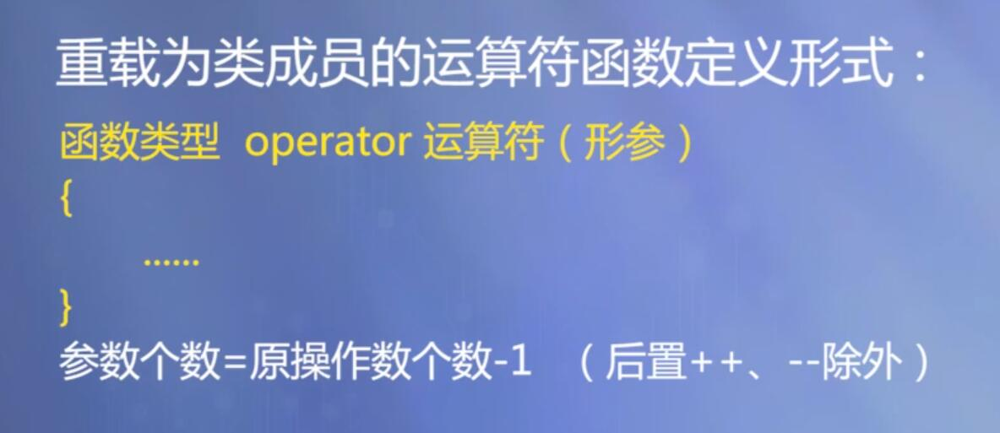

  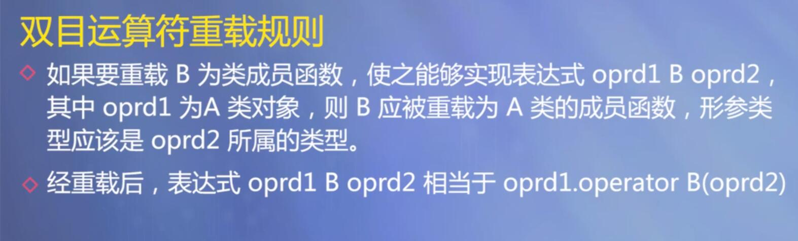

  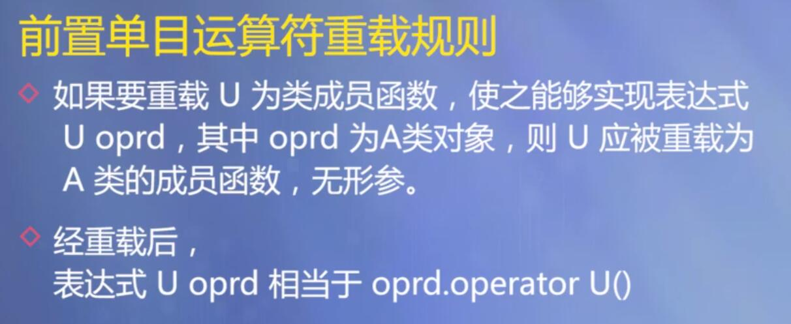

  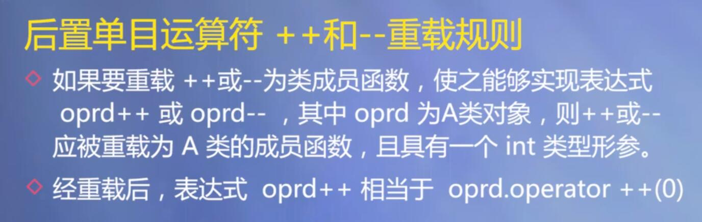

  ```cpp
  // 双目运算符重载
  #include <iostream>
  using namespace std;
  
  class Complex{
  public:
      Complex(double r = 0.0, double i = 0.0) : real(r), imag(i) {}
      Complex operator + (const Complex &c2) const;
      Complex operator - (const Complex &c2) const;
      void display() const;
  private:
      double real;
      double imag;
  };
  
  Complex Complex::operator + (const Complex &c2) const{
      return Complex(real+c2.real, imag+c2.imag);
  }
  
  Complex Complex::operator - (const Complex &c2) const{
      return Complex(real-c2.real, imag-c2.imag);
  }
  
  void Complex::display() const {
      cout << "(" << real << ", " << imag << ")" << endl;
  }
  
  int main() {
  
      Complex a(5, 4);
      Complex b(2, 10);
      Complex c;
      cout << "a = "; a.display();
      cout << "b = "; b.display();
  
      c = a - b;
      cout << "c = "; c.display();
  
      c = a + b;
      cout << "c = "; c.display();
  
      return 0;
  }
  
  /*
      a = (5, 4)
      b = (2, 10)
      c = (3, -6)
      c = (7, 14)
  */
  ```

  ```cpp
  // 单目运算符
  #include <iostream>
  using namespace std;
  
  class Clock{
  public:
      Clock(int hour = 0, int minute = 0, int second = 0);
      void showTime() const;
      Clock& operator ++ ();      // 前置
      Clock operator ++ (int);   // 后置
  
  private:
      int hour, minute, second;
  };
  
  Clock::Clock(int hour, int minute, int second) {
      if (hour < 0 || hour >= 24 || minute < 0 || minute >= 60 || second < 0 || second >= 60)
          cout << "Time error!" << endl;
      else {
          this->hour = hour;
          this->minute = minute;
          this->second = second;
      }
  }
  
  void Clock::showTime() const {
      cout << hour << ":" << minute << ":" << second;
  }
  
  Clock& Clock::operator ++ () {
      second++;
      if (second >= 60) {
          second = 0;
          minute++;
          if (minute >= 60) {
              minute = 0;
              hour = (hour + 1) % 24;
          }
      }
      return *this;
  }
  
  Clock Clock::operator ++ (int) {
      Clock old = *this;
      ++(*this);  // 调用前置++
      return old;
  }
  
  int main() {
  
      Clock myClock(23, 59, 59);
      cout << "First time:";
      myClock.showTime();
      cout << endl;
  
      cout << "Show myClock++:";
      (myClock++).showTime();
      cout << endl;
  
      cout << "Show ++myClock:";
      (++myClock).showTime();
      cout << endl;
  
      return 0;
  }
  
  /*
      First time:23:59:59
      Show myClock++:23:59:59
      Show ++myClock:0:0:1
  */
  ```

  

- 重载为非成员函数

  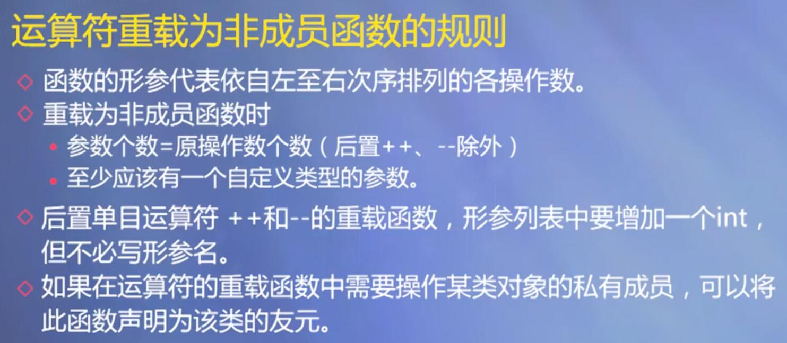

  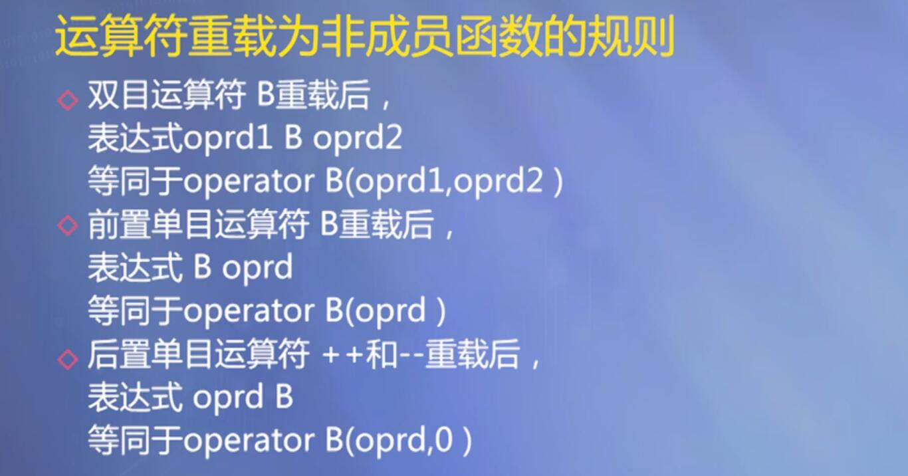

  ```cpp
  // 双目运算符重载
  #include <iostream>
  using namespace std;
  
  class Complex{
  public:
      Complex(double r = 0.0, double i = 0.0) : real(r), imag(i) {}
      friend Complex operator + (const Complex &c1, const Complex &c2);
      friend Complex operator - (const Complex &c1, const Complex &c2);
      friend ostream& operator << (ostream &out, const Complex &c);
      void display() const;
  private:
      double real;
      double imag;
  };
  
  Complex operator + (const Complex &c1, const Complex &c2) {
      return Complex(c1.real+c2.real, c1.imag+c2.imag);
  }
  
  Complex operator - (const Complex &c1, const Complex &c2) {
      return Complex(c1.real-c2.real, c1.imag-c2.imag);
  }
  
  ostream& operator << (ostream &out, const Complex &c) {
      out << "(" << c.real << ", " << c.imag << ")";
      return out;
  }
  
  int main() {
  
      Complex a(5, 4);
      Complex b(2, 10);
      Complex c;
      cout << "a = " << a << endl;
      cout << "b = " << b << endl;
  
      c = a - b;
      cout << "c = " << c << endl;
  
      c = a + b;
      cout << "c = " << c << endl;
  
      return 0;
  }
  
  /*
      a = (5, 4)
      b = (2, 10)
      c = (3, -6)
      c = (7, 14)
  */
  ```

  

### 虚函数

使用`virtual`修饰函数，将函数的定义写在类外，因为在运行期间确定函数的执行动作，不需要内联。

用virtual关键字修饰的函数为虚函数，虚函数是实现运行时多态性基础，C++中的虚函数是动态绑定的函数。

虚函数必须是非静态的成员函数，虚函数经过派生之后，就可以实现运行过程的多态。

一般成员函数可以是虚函数，构造函数不能是虚函数，析构函数可以是虚函数。

虚函数的声明只能出现在类定义中的函数原型声明中，而不能在成员函数实现的时候。

在派生类中可以对基类的成员函数进行覆盖，虚函数一般不声明为内联函数，因为对虚函数的调用时动态绑定的，而对内联函数的处理时静态的。

```cpp
#include <iostream>
using namespace std;

class Base1{
public:
    virtual void display() const; // 不需要写成内联形式
};

class Base2: public Base1{
public:
    virtual void display() const;
};

class Derived: public Base2{
public:
    virtual void display() const;
};

void Base1::display() const{
    cout << "Base1::display()" << endl;
}

void Base2::display() const{
    cout << "Base2::display()" << endl;
}

void Derived::display() const{
    cout << "Derived::display()" << endl;
}

void func(Base1 *p) {
    p->display();
}

int main() {
    Base1 base1;
    Base2 base2;
    Derived derived;

    func(&base1);
    func(&base2);
    func(&derived);

    return 0;
}
/*
    Base1::display()
    Base2::display()
    Derived::display()
*/
```


### 虚析构函数

如果打算其他人通过基类指针调用对象的析构函数，通过delete这样做是很正常的，就需要让基类的析构函数成为虚函数，否则执行delete的结果将是不确定的。

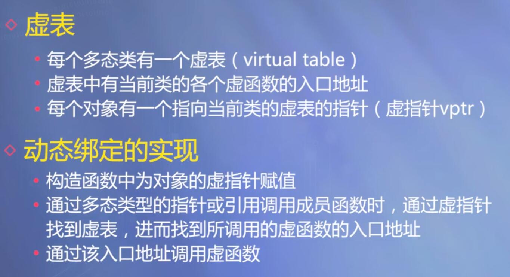

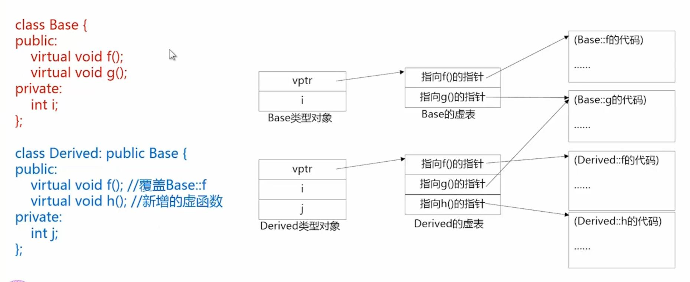


### 抽象类

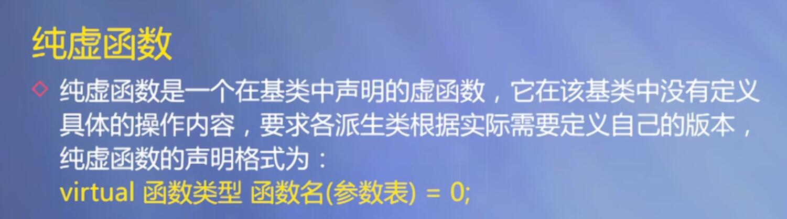

抽象类的作用：

- 将有关的数据和行为组织在一个继承层次结构中，保证派生类具有要求的行为。
- 对于暂时无法实现的函数，可以声明为纯虚函数，留给派生类实现。

抽象类只能作为基类使用，不能定义抽象类的对象。


### override和final

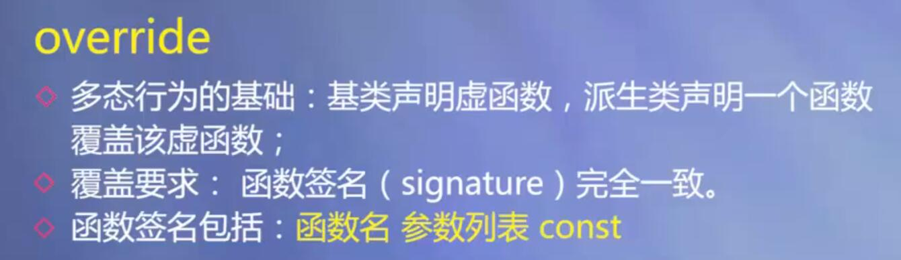

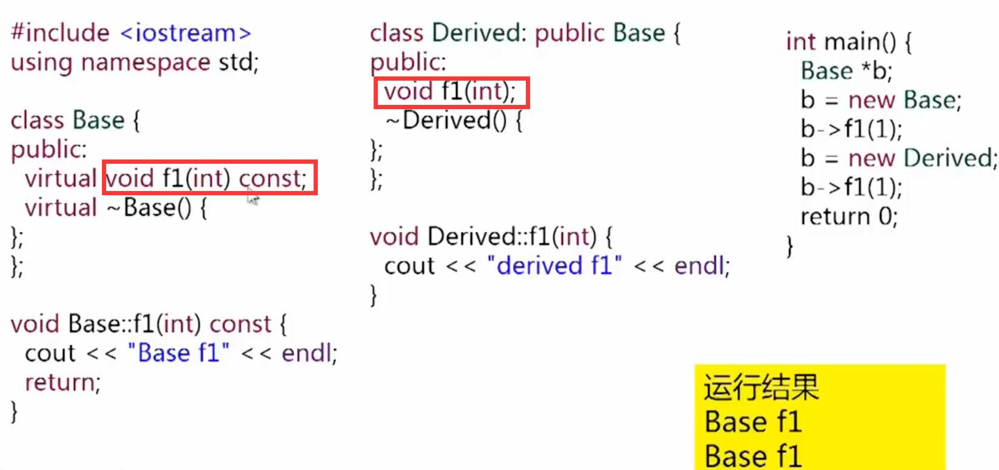

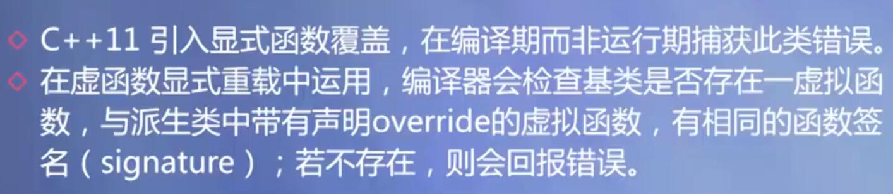

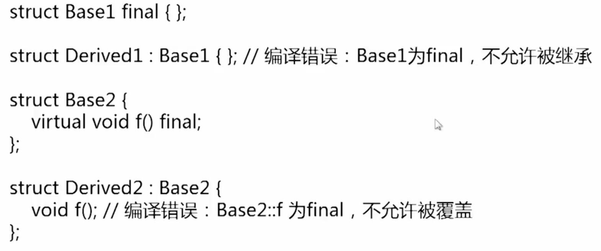


## 第九章：模板与群体数据

### 函数模板

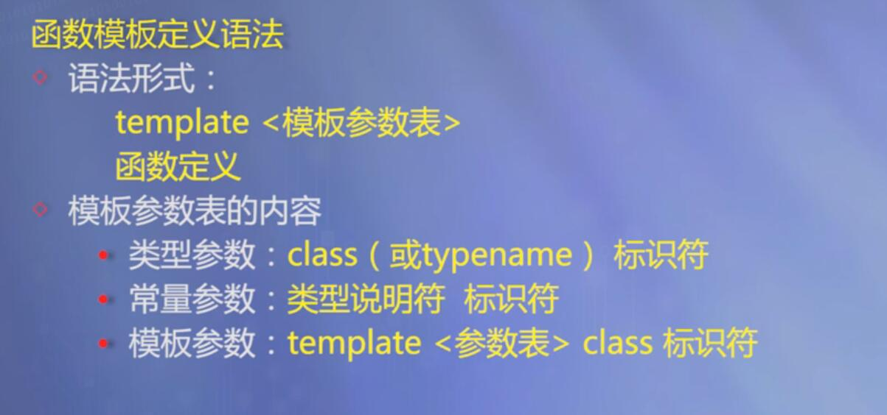

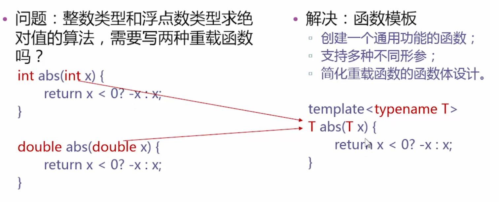

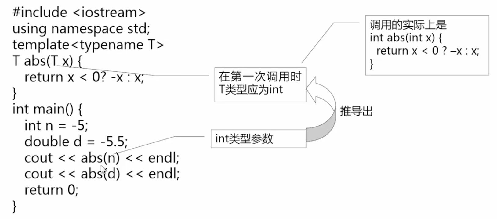

一个函数模板并非自动可以处理所有类型的数据，只有能够进行函数模板中运算的类型，才可以作为类型的实参。自定义的类，需要重载模板中的运算符，才能作为类型实参。

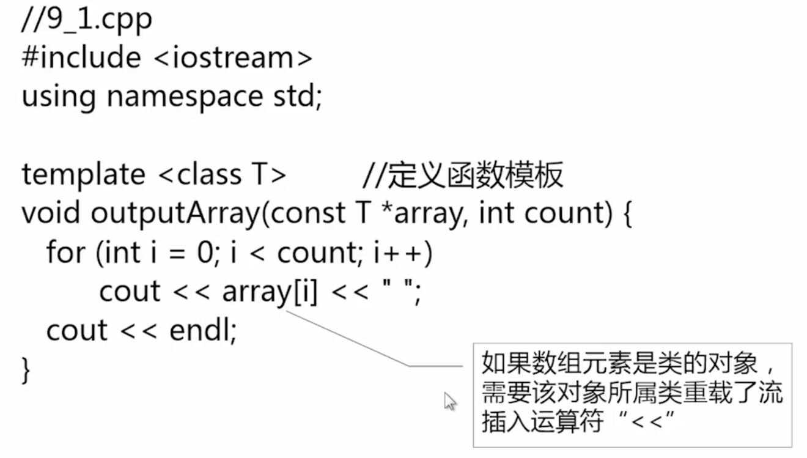


### 类模板

使用类模板使用户可以为类声明一种模式，使得类中的某些数据成员，某些成员函数的参数，某些成员函数的返回值，能取任意类型（包括基本类型和用户自定义类型）。

模板类的函数声明和实现要放到同一个文件中。

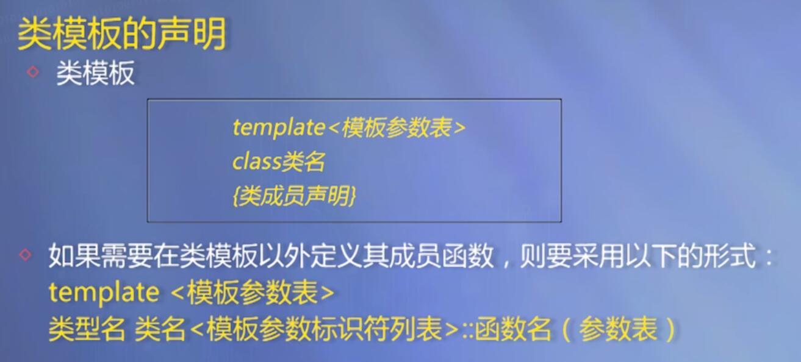

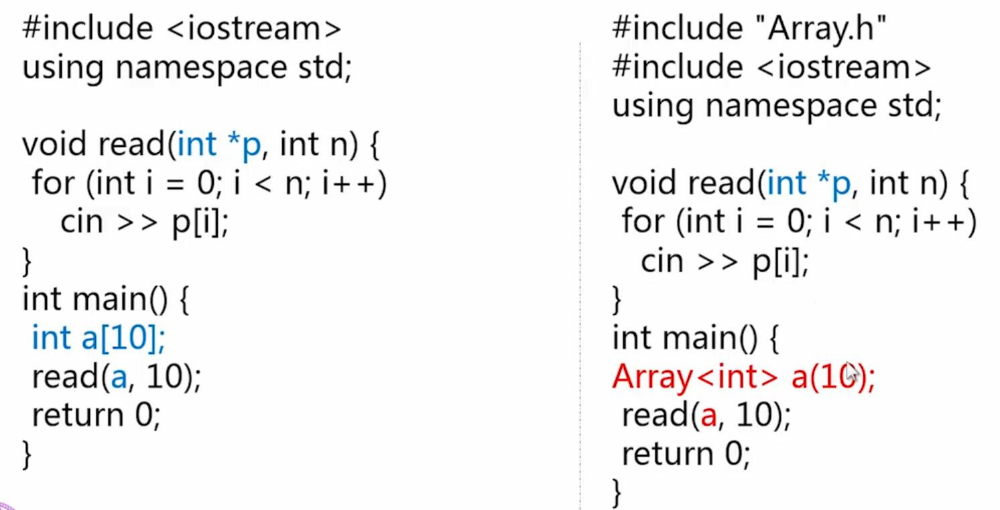


```cpp
#include <iostream>
using namespace std;

template <class T>
class Store{
private:
    T item;
    bool haveValue;
public:
    Store();
    T &getElem();
    void putElem(const T &x);
};

template <class T>
Store<T>::Store(): haveValue(false) {}

template <class T>
T &Store<T>::getElem() {
    if (!haveValue) {
        cout << "No item present!" << endl;
        exit(1);
    }
    return item;
}

template <class T>
void Store<T>::putElem(const T &x){
    haveValue = true;
    item = x;
}

struct Student{
    int id;
    float gpa;
};

int main() {

    Store<int> s1, s2;
    s1.putElem(3);
    s2.putElem(-7);
    cout << s1.getElem() << " " << s2.getElem() << endl;

    Student g = {100, 90};
    Store<Student> s3;
    s3.putElem(g);
    cout << "The student id is " << s3.getElem().id << endl;

    return 0;
}
/*
    3 -7
    The student id is 100
*/
```


### 动态数组类模板

```cpp
#include <iostream>
#include <cassert>
using namespace std;

template<class T>
class Array{
private:
    T* list;
    int size;

public:
    Array(int sz = 50);         // 构造
    Array(const Array<T> &a);   // 复制构造
    ~Array();                   // 析构
    Array<T>& operator = (const Array<T> &rhs); // 重载 =
    T& operator[] (int i);                      // 重载[]
    const T& operator[] (int i) const;
    operator T*();                              // 重载到T*类型转换
    operator T*() const;
    int getSize() const;
    void resize(int sz);
};

template <class T> Array<T>::Array(int sz) {
    assert(sz >= 0);
    size = sz;
    list = new T[size];
}

template <class T> Array<T>::~Array() {
    delete[] list;
}

template <class T> Array<T>::Array(const Array<T> &a) {
    size = a.size;
    list = new T[size];
    for (int i = 0; i < size; ++i) {
        list[i] = a.list[i];
    }
}

template<class T> Array<T>& Array<T>::operator = (const Array<T> &rhs) {
    if (&rhs == this) return *this;
    if (size < rhs.size()) {
        size = rhs.size();
        delete[] list;
        list = new T[size];
    }
    for (int i = 0; i < size; ++i) {
        list[i] = rhs[i];
    }
    return *this;
}

template<class T> T& Array<T>::operator[] (int i) {
    assert(i >= 0 && i < size);
    return list[i];
}

template<class T> const T& Array<T>::operator[] (int i) const {
    assert(i >= 0 && i < size);
    return list[i];
}

template<class T> Array<T>::operator T*() {
    return list;
}

template<class T> Array<T>::operator T*() const{
    return list;
}

template<class T> int Array<T>::getSize() const{
    return size;
}

template<class T> void Array<T>::resize(int sz) {
    assert(sz >= 0);
    if (sz == size) return;

    T* newList = new T[sz];
    for (int i = 0; i < min(sz, size); ++i) {
        newList[i] = list[i];
    }
    delete[] list;
    list = newList;
    size = sz;
}
```


## 第十章：泛型程序设计与STL标准模板库

泛型编程是编写不依赖于具体的数据类型的程序，将算法从特定的数据类型中抽象出来成为通用的，C++模板为泛型程序设计奠定了关键的基础。

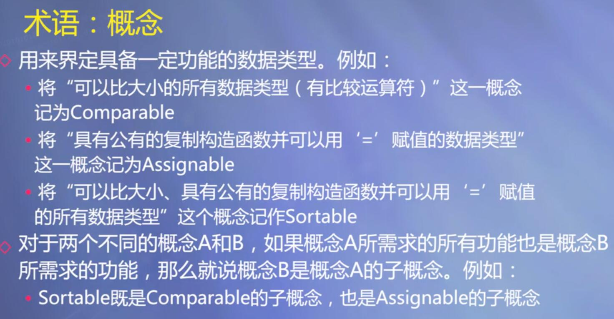

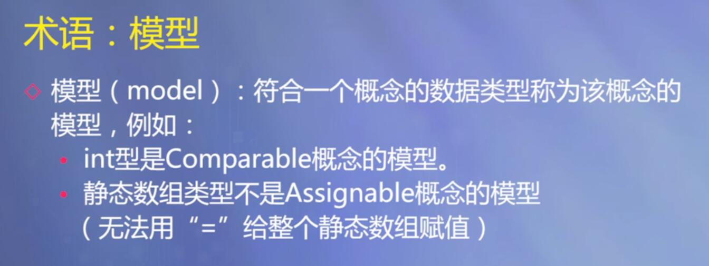

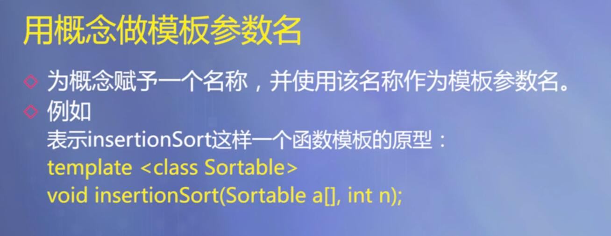


### STL

STL的基本组件

- 容器 container

  - 顺序容器

    array、vector、deque、forward_list、list

  - 有序关联容器

    set、multiset、map、multimap

  - 无序关联容器

    unordered_set、unordered_multiset、unordered_map、unordered_multimap

- 迭代器 iterator

- 函数对象 function object

  函数对象是泛化的函数，任何普通的函数和任何重载了()运算符的类的对象都可以作为函数对象使用。

- algorithms

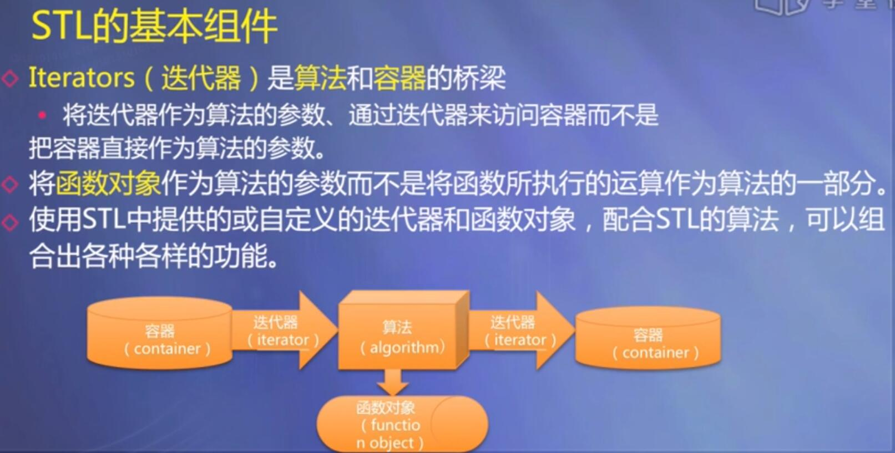

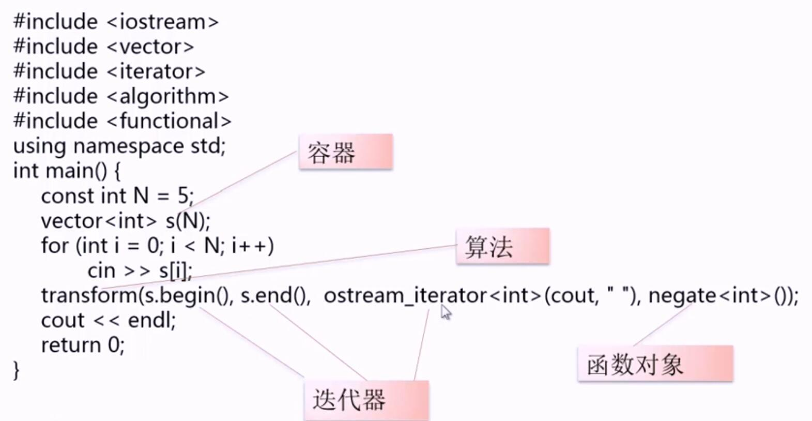


## 第十一章：流类库与输入输出

### 输出流对象


输出流：

- ostream
- ofstream
- ostringstream

输出流对象：

- cout，标准输出。
- cerr，标准错误输出，没有缓冲，发送给它的内容立即被输出。
- clog，类似cerr，但有缓冲，缓冲满时再输出。

```cpp
// 标准输出重定向
#include <iostream>
#include <ostream>
#include <streambuf>
#include <fstream>
using namespace std;

int main() {


    ofstream fout("b.out");
    streambuf* pOld = cout.rdbuf(fout.rdbuf());
    
    for (int i = 1; i < 5; ++i) {
        cout << i << endl;
    }

    cout.rdbuf(pOld);
    return 0;
}
```


构造输出流对象:

```cpp
ofstream myFile("filename");

ofstream myFile;
myFile.open("filename");

myFile.open("filename", ios_base::out|ios_base::binary);
```


```cpp
#include <iostream>
#include <iomanip>
#include <vector>
using namespace std;

int main() {

    vector<double> arr{1.0, 2.01, 2.0323};

    for (int i = 0; i < arr.size(); ++i) {
        cout << setw(7) << arr[i] << endl;
    }

    return 0;
}
```

```cpp
#include <iostream>
#include <iomanip>
#include <vector>
using namespace std;

int main() {

    vector<double> arr{1.0, 2.01, 2.0323};

    for (int i = 0; i < arr.size(); ++i) {
        cout.width(7);
        cout << arr[i] << endl;
    }

    return 0;
}
```


```cpp
#include <iostream>
#include <iomanip>
#include <vector>
using namespace std;

int main() {

    vector<double> arr{1.0, 2.01, 2.0323};
    string names[] = {"bob", "Alice", "AI"};

    for (int i = 0; i < arr.size(); ++i) {
        cout << setiosflags(ios_base::left) // 左对齐
             << setw(7) << names[i]
             << resetiosflags(ios_base::left) // 重置
             << setw(10) << arr[i] << endl;
    }
    return 0;
}
```


```cpp
#include <iostream>
#include <iomanip>
#include <vector>
using namespace std;

int main() {

    vector<double> arr{1.0, 2.01, 2.0323};
    string names[] = {"bob", "Alice", "AI"};

    cout << setiosflags(ios_base::fixed);
    for (int i = 0; i < arr.size(); ++i) {
        cout << setiosflags(ios_base::left) // 左对齐
             << setw(7) << names[i]
             << resetiosflags(ios_base::left)
             << setw(10) << setprecision(1) << arr[i] << endl;
    }
    return 0;
}
```


### 向文本输出

```cpp
#include <iostream>
#include <fstream>
using namespace std;

struct Date{
    int mon, day, year;
};

int main() {
    Date dt = {7, 21, 2020};

    ofstream file("data.txt", ios_base::binary);
    file.write(reinterpret_cast<char*>(&dt), sizeof(dt));
    file.close();

    return 0;
}
```


### 向字符串输出

```cpp
#include <iostream>
#include <sstream>
using namespace std;

template <class T>
inline string toString(const T &v) {
    ostringstream os;
    os << v;
    return os.str();
}

int main() {

        string s = toString(5);
        string t = toString(1.2);
        cout << s << " " << t << endl;

    return 0;
}
```

```cpp
#include <iostream>
#include <sstream>
using namespace std;

int main() {

        string s = to_string(5);
        string t = to_string(1.2);
        cout << s << " " << t << endl;

    return 0;
}
```


### 输入流对象

```cpp
ifstream myFile("filename");

ifstream myFile;
myFile.open("filename");

myFile.open("filename", ios_base::in | ios_base::binary);
```


```cpp
#include <iostream>
using namespace std;

int main() {
    char ch;
    while ((ch = cin.get()) != EOF) {
        cout.put(ch);
    }
    return 0;
}
```


### 从文本中读入

```cpp
#include <iostream>
#include <fstream>
using namespace std;

struct Date{
    int mon, day, year;
};

int main() {

    Date dt;
    ifstream file("data.txt", ios_base::binary);
    file.read(reinterpret_cast<char*>(&dt), sizeof(dt));
    file.close();
    cout << dt.mon << " " << dt.day << " " << dt.year << endl;

    return 0;
}
```

**设置文件的偏移量**


**寻找0的位置**


### 从字符串输入

```cpp
#include <iostream>
#include <sstream>
using namespace std;

template <class T>
inline T fromString(const string &str) {
    istringstream is(str);
    T v;
    is >> v;
    return v;
}

int main() {

    int v1 = fromString<int>("5");
    double v2 = fromString<double>("1.2");
    cout << v1 << " " << v2 << endl;

    return 0;
}
```


## 第十二章：异常处理


### 构造和析构


### 标准异常类


```cpp
#include <iostream>
#include <cmath>
#include <stdexcept>
using namespace std;

double area(double a, double b, double c) throw(invalid_argument)
{
    if (a <= 0 || b <= 0 || c <= 0)
        throw invalid_argument("the side length should be positive");
    if (a + b <= c || a + c <= b || c + b <= a)
        throw invalid_argument("the side length should fit the triangle inequation");
    double s = (a + b + c) /2;
    return sqrt(s * (s-a)*(s-b)*(s-c));
}

int main() {

    double a, b, c;
    cin >> a >> b >> c;
    try{
        double s = area(a, b, c);
        cout << "Area:" << s << endl;
    }catch(exception &e) {
        cout << "Error: " << e.what() << endl;
    }

    return 0;
}
```

