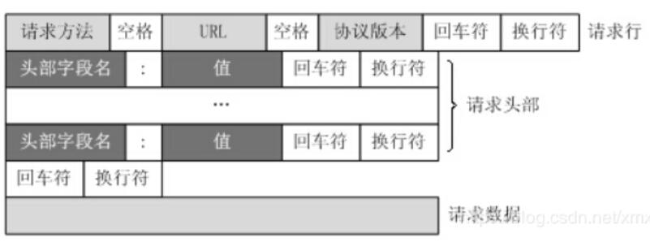
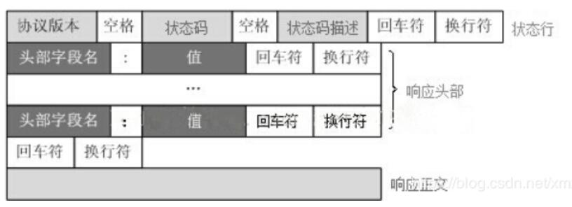

## HTTP基本概念

http是超文本传输协议，计算机在两点之间传输数据的约定和规范。

- 超文本，包含文本、图片、视频、压缩包，超越了普通文本的文本，它是文字、图片、视频的混合体，有超链接可以从一个超文本跳到另一个超文本。HTML就是最常见的超文本，它本身只是纯文字，内部包含很多标签定义了图片、视频等链接，在经过浏览器的解释，呈现一个有文字和画面的网页。

- 状态码

  - 1xx，属于提示信息，是协议的一种中间状态，实际用的少。

  - 2xx，表示服务器成功处理了客户的请求，也是我们最愿意看到的状态。

    - [200 ok]最常见的成功状态码，如果是非HEAD请求，服务器返回的响应头会有body数据。
    - [204 No Content]，与200 Ok基本相同，但是响应头没有body数据。
    - [206 Partial Content]，是应用与HTTP分块下载或断电续传，表示响应返回的body数据并不是资源的全部，而是一部分。

  - 3xx，表示客户端请求的资源发生变动，需要客户端用新的URL重新发送请求获取资源，也就是重定向。

    - [301 Moved Permanently] 表示永久重定向，说明请求的资源已经不存在了，需改用新的URL再次访问。
    - [302 Moved Temporarily] 表示临时重定向，说明请求的资源还在，但是暂时要一个新的URL来访问。

      301和302都会在响应头中使用Location，指明后续需要跳转的URL，浏览器自动重定向新的URL。

    - [304 Not Modified] 不具有跳转的含义，表示资源未修改，重定向已存在的缓冲文件，也称缓存重定向，用于缓存控制。

  - 4xx，表示客户端发送的报文有问题，服务器无法处理。

    - [400 Bad Request] 表示客户端请求的报文有错误，但是笼统的错误。
    - [403 Forbidden] 表示服务器禁止访问资源，并不是客户端的请求出错。
    - [404 Not Found] 表示请求的资源在服务器上不存在或未找到。

  - 5xx，表示客户端请求报文正确，但是服务器处理时内部发生错误，属于服务器端的错误。

    - [500 Internal Server Error] 与400类型是一个笼统错误，具体发生什么错误不知道。
    - [501 Not Implemented] 客户端的请求功能还不支持。
    - [502 Bad Gateway] 服务器作为网关或代理时返回错误码，表示服务器本身正常，访问后端服务器发生错误。
    - [503 Service Unavailable] 服务器正忙，暂时无法响应服务器。
    - [504 Gateway timeout] 网关超时 ，是指服务器作为网关或代理，但是没有及时从上游服务器收到请求。

- 常用字段

  - Host指定服务器的域名。
  - Content-Length，表示返回数据的长度
  - Connection，常用于客户端服务器使用TCP持久连接，以便其他请求复用。
  - Content-Type，服务端回应时，告诉客户端数据的格式。
  - Content-Encoding，说明数据的压缩方式。

- 客户端请求一个基本的HTML文件，耗时2RTT（round trip time）

  - 三次握手时，客户端发送连接请求并携带消息，服务端发送响应消息。
  - 三次握手时，客户端向服务端发送确认并携带消息，服务端发送响应消息。

- HTTP/1.0采用非持久连接，HTTP/1.1默认采用持久连接，非持久连接是每个连接处理一个请求响应，持久连接的每个连接可以处理多个请求响应，可以分为串行TCP链接和并行TCP连接。

  非持久连接的过程：

  - HTTP客户端和HTTP服务器建立TCP连接。
  - HTTP客户端发送HTTP请求消息。
  - HTTP服务端接受请求，处理请求发送响应报文。
  - HTTP服务端关闭这个TCP连接（等到客户端响应消息之后，真正的断开连接）。
  - HTTP客户收到响应消息，TCP连接终止，如果有多个请求，继续重复上次操作。

- 不带流水线：客户收到前一个请求的和响应后，再发送新的请求。

  带流水线：客户端不等待响应，直接发送请求。

## HTTP特性

HTTP基本的报文格式是header+body，头部信息是key-value简单文本形式，HTTP工作在OSI第7层应层，HTTPS是在HTTP与TCP层之间增加了SSL/TLS安全传输层，HTTP/3把TCP层换成了基于UDP的QUIC。

HTTP优缺点是无状态、明文传输、不安全。无状态的好处是服务器不用记录HTTP的状态，不需要额外的资源记录状态信息，减轻服务端的负担。无状态的坏处就是服务器没有记忆力，在涉及到关联性的操作就会非常麻烦，解决方案有Cookie技术，Cookie通过在请求和响应的报文中写入Cookie信息来记录客户端的状态，客户端第一次请求后，服务器生成Cookie记录客户端，并把Cookie发给客户端，后续客户端请求服务器的时候带上Cookie，这样服务端就能认识客户端。

- 使用明文不加密，信息容易被窃听，账号丢失。
- 不验证通讯双方，可能被伪装，钱没了。
- 无法验证报文的完整性，可能被篡改，网页植入垃圾广告。

## GET与POST

GET请求从服务器获取资源，资源包括文字、页面、图片、视频等。

POST是向指定URL提交数据，数据放在body中。

HTTP协议的安全是指：请求方法不会破坏服务器上的资源。幂等是指多次执行相同的操作结果是相同的。

安全、幂等：get

不安全、不幂等：post

不安全、幂等：put、delete

## PUT和POST

PUT和POS都有更改指定URI的语义.但PUT被定义为幂等的方法

PUT请求：如果两个请求相同，后一个请求会把第一个请求覆盖掉。（所以PUT用来改资源）

Post请求：后一个请求不会把第一个请求覆盖掉。（所以Post用来增资源）

  

## HTTP/1.1、HTTP/2、HTTP/3演变

HTTP/1.1采用长连接，在同一个TCP连接中，客户端可以发送多个请求，只要第一个请求发送出去，不必等待响应，可以直接发送下一个报文，但是在服务端还是会按照顺序，对请求进行处理，这样就会导致队头阻塞的问题。HTTP/2和HTTP/3就是对HTTP性能的优化。

**HTTP/1.1还存在一些瓶颈：**

- 请求/响应头部，未经过压缩就发送，首部信息越多延迟越大，只能压缩body数据
- 服务器按照请求顺序进行响应，如果响应慢造成队头阻塞
- 没有请求优先级
- 只能从客户端开始，服务端只能被动响应

**HTTP/2在性能上的改进：**

- 头部压缩，客户端和服务端同时维护一张头信息表，所有字段都会存入这个表中，生成一个索引号，发送相同字段，只发送索引号就行。
- HTTP/2采用二进制格式，头信息和数据体都是二进制，统称为帧，头信息帧和数据帧，服务端收到报文就不用转为二进制，增加了数据传输效率。
- 数据流，每个请求或回应的所有数据包，称为一个数据流，每个数据流都标记着一个独一无二的编号，规定客户端发送的数据流编号为奇数，服务端发送的为偶数，客户端还可以指定数据流的优先级，优先级高的请求，服务端就先响应该请求。
- 多路复用，服务端不用按照顺序一一对应，移除了HTTP/1.1的串行请求，不需要排队等待，提高的连接的利用率。
- 服务器推送，服务端不再是被动响应，可以主动向客户端发送消息

**HTTP/2有哪些缺陷：**

- 多个HTTP请求复用一个TCP连接，TCP不知道有多少个HTTP请求，如果发生丢包，触发TCP重传机制，这样一个TCP连接中的所有的HTTP请求都要等待这个丢包重传回来。

HTTP/3把HTTP下层的TCP协议改成了UDP，UDP不管顺序、丢包，不会出现HTTP/1.1和HTTP/2的队头阻塞和丢包的问题，UDP是不可靠传输，但是google基于UDP开发了QUIC协议，可以实现TCP的可靠传输，QUIC是UDP上一个伪TCP+TLS+HTTP/2的多路复用的协议。

## Cookie、Session、Token

Cookie和Session都是记录用户登录状态的一种机制。

Cookie是由服务端生成并发送给客户端的一种凭证，客户端每次发出请求带上这个Cookie，服务端就可以识别出对应的客户端。

**会话cookie**是存放在客户端浏览器的内存中，他的生命周期和浏览器是一致的，当浏览器关闭会话cookie也就消失了。

**持久化cookie**是存放在客户端硬盘中，持久化cookie的生命周期是我们在设置cookie时候设置的那个保存时间，session的信息是通过sessionid获取的。

Session是服务端为每个请求的客户端生成的一种认证信息，它存放再服务端，在客户端中保存一个session-id值，每次请求带上这个id，服务端就可以查找得到对应的状态。session-id是由cookie保存的，用户提交信息时，会发送这个id值。

Session-id是随机分配的，一般不会重复，但是短时间如果由大量的并发连接，可能会发生重复。

Session是在服务端保存的一个数据结构，用来跟踪用户的状态，这个数据可以保存在集群、数据库、文件中；
Cookie是客户端保存用户信息的一种机制，用来记录用户的一些信息，也是实现Session的一种方式。

session有一个缺陷：如果web服务器做了负载均衡，那么下一个操作请求到了另一台服务器的时候session会丢失。

在大多数使用Web API的互联网公司中，tokens 是多用户下处理认证的最佳方式。

基于Token的身份验证的过程如下:

1. 用户通过用户名和密码发送请求。
2. 服务端验证并返回一个签名的token 给客户端。
3. 客户端储存token,并且用于每次发送请求。
4. 服务端验证token并返回数据。

## HTTPS

HTTP的端口是80，HTTPS的端口是443。

HTTPS需要向CA申请数字证书，保证身份的可靠性。

HTTPS可以解决HTTP的安全问题，HTTPS通过引入SSL/TLS层。

- 混合加密的方式保证信息的机密性

  采用非对称加密交换对称加密的密钥，后续通讯使用对称加密的方式加密明文信息。

- 摘要算法的方式保证信息的完整性

  客户端计算明文的摘要，然后将明文和摘要加密之后发送给服务端，服务端解密之后，计算明文的摘要，看摘要是否一致。

- 将服务器的公钥放到数字签名中，解决的冒充的风险

  - 客户端向服务器索要并验证服务器的公钥
  - 双方协商会话密钥
  - 利用密钥加密通信

HTTPS的请求过程：

首先是客户端的公钥获取：

1. 客户端请求公钥
2. ca用自己的私钥将加密的公钥发送给服务端（证书）
3. 服务端将证书发送给客户端
4. 客户端验证证书，ca的公钥在自己电脑里。

具体密钥的交换过程：

1. 客户端发送，自己支持的ssl版本号、非对称算法、随机数1
2. 服务端发送，ssl的版本号、对称算法、随机数2、证书
3. 客户端验证证书是否合法
4. 客户端发送，随机数3，前两个随机数的hash值
5. 服务端验证hash值是否正确，通过3个随机数计算密钥k
6. 服务端发送，3个随机数的hash
7. 客户端验证hash值，同样计算出密钥k