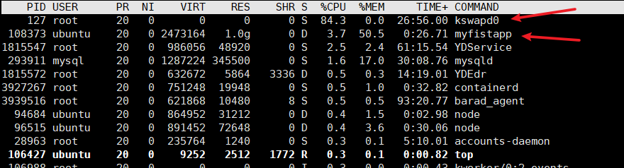

## kswapd0

最近在跑程序的时候总是死机，以为是程序的bug，后来看了下进程的运行情况，出现`kswapd0`把cpu占完了。



`kswapd0`是在物理内存不足(阈值判断)的情况下，通过swap分区进行页面交换缓解内存压力。

swap是linux的交换分区，在内存不足的情况下，将一些不常用的程序放到swap分区中，从而解决物理内存不足的情况。

而我这台服务器没有配置交换分区，应该是这个原因卡死了。


## 创建swap分区

```bash
# 创建一个2G的空文件
sudo dd if=/dev/zero of=/etc/swapfile bs=1024 count=2048000

# swap文件
sudo mkswap /etc/swapfile

# 开启swap
sudo swapon /etc/swapfile

# 查看swap
swapon -s

# 自动挂载 /etc/fstab
sudo vim /etc/fstab
/etc/swapfile swap    swap    defaults      0    0
```


再次运行程序swap就发挥作用了。


## 删除swap分区

```bash
# 停止swap分区
sudo swapoff /etc/swapfile

# 删除swap分区文件
sudo rm -rf /etc/swapfile

# 修改/etc/fstab中的自动挂载
/etc/swapfile swap    swap    defaults      0    0
```


