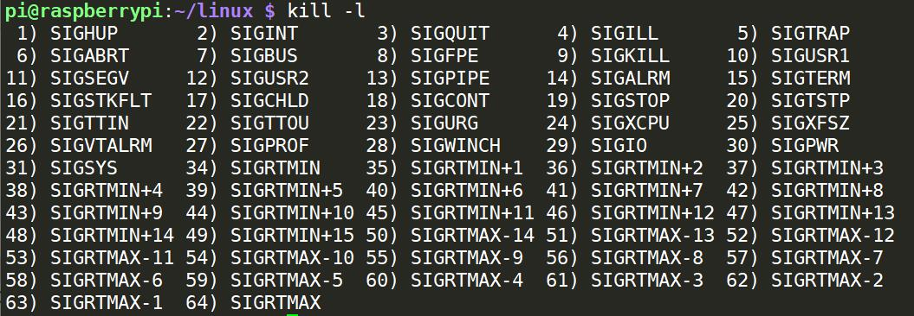

## 进程间通信 IPC

Linux环境下，进程地址空间相互独立，每个进程各自有不同的用户地址空间。任何一个进程的全局变量在另一个进程中都看不到，所以进程和进程之间不能相互访问，要交换数据必须通过内核，在内核中开辟一块缓冲区，进程1把数据从用户空间拷到内核缓冲区，进程2再从内核缓冲区把数据读走，内核提供的这种机制称为进程间通信（IPC，Inter Process Communication）。

在进程间完成数据传递需要借助操作系统提供特殊的方法，如：文件、管道、信号、共享内存、消息队列、套接字、命名管道等。随着计算机的蓬勃发展，一些方法由于自身设计缺陷被淘汰或者弃用。现今常用的进程间通信方式有：

- 管道 (使用最简单)
- 信号 (开销最小)
- 共享映射区 (无血缘关系)
- 本地套接字 (最稳定)

## 1. 管道

```cpp
#include <unistd.h>

int pipe(int pipefd[2]);
```

```
-1	失败，并设置errno
0	成功
```

管道是一种最基本的IPC机制，作用于**有血缘关系**的进程之间，完成数据传递。调用pipe系统函数即可创建一个管道。有如下特质：

- 其本质是一个**伪文件**(实为内核缓冲区) 
- 由两个文件描述符引用，一个表示读端，一个表示写端。
- 规定数据从管道的写端流入，从读端流出。

管道的原理: 管道实为内核使用**环形队列**机制，借助内核缓冲区(4k)实现，512B是扇区的大小。

```
pipe size            (512 bytes, -p) 8
```

**管道的局限性**：

- 数据自己读不能自己写。
- 数据一旦被读走，便不在管道中存在，不可反复读取。
- 由于管道采用半双工通信方式。因此，数据只能在一个方向上流动。
- 只能在有公共祖先的进程间使用管道。

常见的通信方式有，单工通信、半双工通信、全双工通信。

读管道再读取数据时：

- 管道中有数据，read返回实际读取的字节数。

- 管道中无数据

  如果写端全关闭，read返回0。

  如果仍有写端打开，阻塞等待。

写管道在写数据时：

- 读端全关闭，进程异常终止（SIGPIPE信号）。
- 有读端打开
  - 管道未满，写数据，返回写入的字节数
  - 管道已满，阻塞（少见）

```c
#include <unistd.h>
#include <string.h>
#include <stdlib.h>
#include <stdio.h>
#include <sys/wait.h>

void sys_err(const char *str)
{
    perror(str);
    exit(1);
}

int main(void)
{
    pid_t pid;
    char buf[1024];
    int fd[2];
    char *p = "test for pipe\n";
    
   if (pipe(fd) == -1) 
       sys_err("pipe");

   pid = fork();
   if (pid < 0) {
       sys_err("fork err");
   } else if (pid == 0) { // 子进程读，关闭写端
        close(fd[1]);
        int len = read(fd[0], buf, sizeof(buf));
        write(STDOUT_FILENO, buf, len);
        close(fd[0]);
   } else { // 父进程写，关闭读端
       close(fd[0]);
       write(fd[1], p, strlen(p));
       wait(NULL);
       close(fd[1]);
   }
    
    return 0;
}
```


## 2. fifo 有名管道

fifo用于非血缘关系的进程间通信。

```cpp
#include <sys/types.h>
#include <sys/stat.h>

int mkfifo(const char *pathname, mode_t mode);
```

```
-1	失败，并设置errno
0	成功
```

创建fifo文件。

```cpp
if (mkfifo("tmp", 0666) < 0 && errno != EEXIST) {
    perror("mkfifo");
    exit(1);
}
```

```bash
mkfifo tmp
```


## 3. mmap 共享内存

存储映射I/O (Memory-mapped I/O) 使一个磁盘文件与存储空间中的一个缓冲区相映射。于是当从缓冲区中取数据，就相当于读文件中的相应字节。于此类似，将数据存入缓冲区，则相应的字节就自动写入文件。这样，就可在不适用read和write函数的情况下，使用地址（指针）完成I/O操作。

使用这种方法，首先应通知内核，将一个指定文件映射到存储区域中。这个映射工作可以通过mmap函数来实现。

```cpp
#include <sys/mman.h>

void *mmap(void *addr, size_t length, int prot, int flags,
int fd, off_t offset);
int munmap(void *addr, size_t length);
```

```
MAP_FAILED		失败，并设置errno（void*）-1
void*指针		   成功，指向mapped area
```

|        |                                                              |
| ------ | ------------------------------------------------------------ |
| addr   | 建立映射区的首地址，由Linux内核指定。使用时，直接传递NULL    |
| length | 欲创建映射区的大小                                           |
| prot   | 映射区权限PROT_READ、PROT_WRITE、PROT_READ\|PROT_WRITE       |
| flags  | 标志位参数(常用于设定更新物理区域、设置共享、创建匿名映射区)                                           MAP_SHARED:  会将映射区所做的操作反映到物理设备（磁盘）上                                        MAP_PRIVATE: 映射区所做的修改不会反映到物理设备                                                         MAP_ANON匿名映射 |
| fd     | 用来建立映射区的文件描述符                                   |
| offset | 映射文件的偏移(4k的整数倍)                                   |

**mmap注意事项**

- mmap不能创建0字节的映射区，必须要有大小，新创建的文件文件大小为0，不能作为映射区。
- 文件是只读方式打开，映射区如果设置读写权限，会提示权限不足，如果映射区的flag设置为PRIVATE，会提示总线错误，主要是硬件错误，更文件大小和权限有关。
- 当MAP_SHARED时，创建映射区的权限 $\le$ 打开文件的权限
- 映射的创建隐含对文件的读操作
- offset, 映射文件的偏移必须是4k的倍数, mmu内存映射最小为4k
- 映射区的释放与文件关闭无关
- munmap传入的地址一定时mmap的返回地址，不能++、--操作


### 父子间通信

```c
// fork_mmap.c 
#include <stdlib.h>
#include <unistd.h>
#include <fcntl.h>
#include <sys/mman.h>
#include <sys/wait.h>

int var = 100;

int main(void)
{
    int *p;
    pid_t pid;

    int fd;
    fd = open("temp", O_RDWR|O_CREAT|O_TRUNC, 0644);
    if(fd < 0){
        perror("open error");
        exit(1);
    }
    unlink("temp");				//删除临时文件目录项,使之具备被释放条件.
    ftruncate(fd, 4);

    p = (int *)mmap(NULL, 4, PROT_READ|PROT_WRITE, MAP_SHARED, fd, 0);
    // p = (int *)mmap(NULL, 4, PROT_READ|PROT_WRITE, MAP_PRIVATE, fd, 0);
    if(p == MAP_FAILED){		//注意:不是p == NULL
        perror("mmap error");
        exit(1);
    }
    close(fd);					//映射区建立完毕,即可关闭文件

    pid = fork();				//创建子进程
    if(pid == 0){
        *p = 2000;
        var = 1000;
        printf("child, *p = %d, var = %d\n", *p, var);
    } else {
        sleep(1);
        printf("parent, *p = %d, var = %d\n", *p, var);
        wait(NULL);

        int ret = munmap(p, 4);				//释放映射区
        if (ret == -1) {
            perror("munmap error");
            exit(1);
        }
    }

    return 0;
}

```


### 匿名映射

mmap支持匿名映射，这样就不需要创建一个临时的文件。

匿名映射可以使用linux特定的宏MAP_ANON，或者使用**/dev/zero**文件。

```c
// 进程通信 - 匿名映射1
// MAP_ANON匿名映射, 只在linux可以使用
p = (int*) mmap(NULL, 4, PROT_READ|PROT_WRITE, MAP_SHARED|MAP_ANON, -1, 0); 
int ret = munmap(p, 4);
```

```c
// 进程通信 - 匿名映射2
int fd = open("/dev/zero", O_RDWR);
p = (int*) mmap(NULL, 4, PROT_READ|PROT_WRITE, MAP_SHARED, fd, 0); // 使用字符文件
int ret = munmap(p, 4);
```


### 非血缘关系进程通信

非血缘关系的进程通信，类似fifo通过相同的文件创建映射区。

```c
// mmap_read.c
struct STU{
    int id;
    char name[20];
    char sex;
};

void sys_err(char *str) {
    perror(str);
    exit(1);
}

int main(int argc, char *argv[]) {
    int fd;
    struct STU student;
    struct STU *p;
    if (argc < 2) {
        printf("./mmap_read file_share_path");
        exit(1);
    }
    fd = open(argv[1], O_RDONLY);
    if (fd == -1) {
        sys_err("open");
    }
    p = mmap(NULL, sizeof(student), PROT_READ, MAP_SHARED, fd, 0);
    if (p == MAP_FAILED) {
        sys_err("mmap");
    }
    close(fd);

    while (1) {
        printf("id = %d, name = %s, sex = %c\n", p->id, p->name, p->sex);
        sleep(2);
    }
    munmap(p, sizeof(student));
    return 0;
}
```

```c
// mmap.write
struct STU{
    int id;
    char name[20];
    char sex;
};

void sys_err(char *str) {
    perror(str);
    exit(1);
}

int main(int argc, char *argv[]) {
    int fd;
    struct STU student = {10, "sanzo", 'M'};
    struct STU *p;

    if (argc < 2) {
        printf("./a.out file_shared_path\n");
        exit(1);
    }
    fd = open(argv[1], O_RDWR|O_CREAT, 0644);
    ftruncate(fd, sizeof(student));
    p = mmap(NULL, sizeof(student), PROT_READ|PROT_WRITE, MAP_SHARED, fd, 0);
    if (p == MAP_FAILED) {
        sys_err("mmap");
    }
    close(fd);
    while (1) {
        memcpy(p, &student, sizeof(student));
        student.id++;
        sleep(1);
    }
    munmap(p, sizeof(student));
    return 0;
}
```


## 4. 信号

信号的特点：

- 简单 
- 不能携带大量信息
- 满足某个特设条件才发送

A给B发送信号，B收到信号之前执行自己的代码，收到信号后，不管执行到程序的什么位置，都要暂停运行，去处理信号，处理完毕再继续执行。与硬件中断类似——异步模式。但信号是软件层面上实现的中断，早期常被称为“软中断”。

信号的特质：由于信号是通过软件方法实现，其实现手段导致信号有很强的延时性。但对于用户来说，这个延迟时间非常短，不易察觉。

每个进程收到的所有信号，都是由内核负责发送的，内核处理。

**产生信号的方法**：

1. 按键产生，Ctrl+c（2 SIGINT）、Ctrl+z（20 SIGTSTP）、Ctrl+\（3 SIGQUIT）

2. 系统调用产生，kill、raise、abort
3. 软件条件产生，定时器alarm
4. 硬件异常产生，非法访问内存(段错误)、除0(浮点数例外)、内存对齐出错(总线错误)
5. 命令产生，kill命令

**递达**：递送并且到达进程。

**未决**：产生和递达之间的状态。主要由于阻塞(屏蔽)导致该状态。 

**信号的处理方式**:

1. 执行默认动作 

2. 忽略(丢弃) ，处理方式是丢弃，不是没有被处理。

3. 捕捉（调用户处理函数）

Linux内核的进程控制块PCB是一个结构体，task_struct, 除了包含进程id，状态，工作目录，用户id，组id，文件描述符表，还包含了信号相关的信息，主要指阻塞信号集(信号屏蔽字)和未决信号集。

**阻塞信号集(信号屏蔽字)**： 将某些信号加入集合，对他们设置屏蔽，当屏蔽x信号后，再收到该信号，该信号的处理将推后(解除屏蔽后)

**未决信号集**：

1. 信号产生，未决信号集中描述该信号的位立刻翻转为1，表信号处于未决状态。当信号被处理对应位翻转回为0。这一时刻往往非常短暂。 

2. 信号产生后由于某些原因(主要是阻塞)不能抵达。这类信号的集合称之为未决信号集。在屏蔽解除前，信号一直处于未决状态。   

信号的四要素：

1. 编号
2. 名称
3. 事件
4. 默认处理动作
   - erm：终止进程
   - Ign： 忽略信号 (默认即时对该种信号忽略操作)
   - Core：终止进程，生成Core文件。(查验进程死亡原因， 用于gdb调试)
   - Stop：停止（暂停）进程
   - Cont：继续运行进程



不存在编号为0的信号。其中1-31号信号称之为常规信号（也叫普通信号或标准信号），34-64称之为实时信号，驱动编程与硬件相关。名字上区别不大。而前32个名字各不相同。


### kill

kill给指定进程发送信号。

```cpp
#include <sys/types.h>
#include <signal.h>

int kill(pid_t pid, int sig);
```

```
-1	失败，并设置errno
0	成功
```


### raise

raise给指定自己发送信号。

```cpp
#include <signal.h>

int raise(int sig);
```

```
非0		失败
0		 成功
```


### abort

abort给自己发送异常终止的信号，SIGABRT，并产生core文件。

```cpp
#include <stdlib.h>

void abort(void);
```


### alarm

alarm定时，时间和进程的状态无关，运行、阻塞、挂起、僵尸都会按时发送。

每个进程只有一个定时器。alarm(0)可以取消之前的闹钟，立即发送信号。

```cpp
#include <unistd.h>

unsigned int alarm(unsigned int seconds);
```

返回上次闹钟剩余的时间，如果之前没有闹钟返回0.

```c
#include <stdio.h>
#include <unistd.h>

int main() {
    alarm(1);
    for (int i = 0; ; ++i) {
        printf("%d\n", i);
    }
    return 0;
}
```


### setitimer

```cpp
#include <sys/time.h>

int getitimer(int which, struct itimerval *curr_value);
int setitimer(int which, const struct itimerval *new_value, struct itimerval *old_value);
```

```
-1	失败，并设置errno
0	成功
```

| which          |                                                              |
| -------------- | ------------------------------------------------------------ |
| ITIMER_REAL    | 自然定时，计算自然事件，SIGLARM                              |
| ITIMER_VIRTUAL | 虚拟空间计时（用户空间）， 只计算占用CPU的时间，SIGVTALRM    |
| ITIMER_PROF    | 运行时计时（用户+内核），计算占用CPU和执行系统调用的时间，SIGPROF |


```cpp
struct itimerval {
    struct timeval it_interval; /* Interval for periodic timer */
	struct timeval it_value;    /* Time until next expiration */
};

struct timeval {
    time_t      tv_sec;         /* seconds */
    suseconds_t tv_usec;        /* microseconds */
};
```


### signal

signal注册信号的捕捉函数。

```cpp
#include <signal.h>

typedef void (*sighandler_t)(int);
sighandler_t signal(int signum, sighandler_t handler);
```


```c
// setitimer1.c
#include <stdio.h>
#include <sys/time.h>
#include <signal.h>
#include <stdlib.h>
#include <unistd.h>

void myfunc(int signo) {
    printf("hello sanzo!\n");
}

int main() {
    struct itimerval it, oldit;
    signal(SIGALRM, myfunc); // 注册SIGALRM信号的捕捉处理函数
    it.it_value.tv_sec = 5;
    it.it_value.tv_usec = 0;

    it.it_interval.tv_sec = 3;
    it.it_interval.tv_usec = 0;

    int ret = setitimer(ITIMER_REAL, &it, &oldit);
    if (ret == -1) {
        perror("setitimer error");
        exit(1);
    }

    while (1);
    return 0;
}
```


### 信号集

```cpp
#include <signal.h>

int sigemptyset(sigset_t *set);	// 置空
int sigfillset(sigset_t *set);	// 置1
int sigaddset(sigset_t *set, int signum);	// 添加
int sigdelset(sigset_t *set, int signum);	// 删除
int sigismember(const sigset_t *set, int signum);	// 是否存在
```

```
-1 失败，并设置errno
0	成功，signum不是sigismember成员
1 	signum是sigismember成员
```

### sigprocmask

改变当前的阻塞信号集。

```cpp
/* Prototype for the glibc wrapper function */
int sigprocmask(int how, const sigset_t *set, sigset_t *oldset);

/* Prototype for the underlying system call */
int rt_sigprocmask(int how, const kernel_sigset_t *set, kernel_sigset_t *oldset, size_t sigsetsize);

/* Prototype for the legacy system call (deprecated) */
int sigprocmask(int how, const old_kernel_sigset_t *set, old_kernel_sigset_t *oldset);
```

```
-1	失败，并设置errno
0 	成功
```

| how         | 假设当前的信号屏蔽字为mask                                   |
| ----------- | ------------------------------------------------------------ |
| SIG_BLOCK   | set表示需要屏蔽的信号。相当于 mask \|= set                   |
| SIG_UNBLOCK | set表示需要解除屏蔽的信号。相当于 mask &= ~set               |
| SIG_SETMASK | set表示用于替代原始屏蔽及的新屏蔽集。相当于 mask = set，若调用sigprocmask解除了对当前若干个信号的阻塞，则在sigprocmask返回前，至少将其中一个信号递达。 |

自定义信号集影响阻塞信号集, 阻塞信号集影响未决信号集。


### sigpending

sigpending获取未决信号集。

```cpp
#include <signal.h>

int sigpending(sigset_t *set);
```

```
-1	失败，并设置errno
0 	成功
```


```c
// print_sigpending.c
include <stdio.h>
#include <signal.h>
#include <unistd.h>
void print_ped(sigset_t *ped) {
    for (int i = 1; i < 32; ++i) {
        if (sigismember(ped, i) == 1) { // 判断信号是否在集合中
            putchar('1');
        }else {
            putchar('0');
        }
    }
    printf("\n");
}
int main() {
    sigset_t myset, oldset, ped;
    sigemptyset(&myset); // 置空信号集
    sigaddset(&myset, SIGQUIT); // 添加对应信号置1
    sigaddset(&myset, SIGINT);
    sigaddset(&myset, SIGTSTP);

    sigprocmask(SIG_BLOCK, &myset, &oldset); // 修改阻塞信号集
    
    while (1) {
        sigpending(&ped); // 获取未决信号集
        print_ped(&ped);
        sleep(1);
    } 
    return 0;
}
```


### sigaction

sigaction注册捕捉函数，类似signal函数。

```cpp
#include <signal.h>

int sigaction(int signum, const struct sigaction *act, struct sigaction *oldact);

struct sigaction {
     void     (*sa_handler)(int); // 捕捉处理函数
     void     (*sa_sigaction)(int, siginfo_t *, void *);
     sigset_t   sa_mask; // 捕捉期间，屏蔽的信号
     int        sa_flags; // 0，信号捕捉执行期间, 自动屏蔽本信号
     void     (*sa_restorer)(void); // 弃用
};
```


信号捕捉期间阻塞的信号产生多次只记录一次.


内核捕捉信号的过程:

1. 在用户空间执行代码
2. 接收到信号进入内核空间
3. 内核空间调用捕捉函数
4. 在用户空间执行捕捉函数
5. 捕捉函数执行完毕, 执行特殊的系统调用sigreturn回到调用函数的内核空间
6. 到用户空间接着执行代码

```c
// sigaction.c
#include <stdio.h>
#include <stdlib.h>
#include <signal.h>
#include <unistd.h>

void docatch(int signo) {
    printf("%d signal is catched\n", signo);
    sleep(5);
    printf("catch is done\n");
}

int main() {
    struct sigaction act;
    act.sa_handler = docatch;
    
    sigemptyset(&act.sa_mask);
    sigaddset(&act.sa_mask, SIGQUIT); // 设置捕捉期间的屏蔽
    
    act.sa_flags = 0; // 默认属性, 信号捕捉执行期间, 自动屏蔽本信号

    int ret = sigaction(SIGINT, &act, NULL);
    if (ret < 0) {
        perror("sigaction error");
        exit(1);
    }
    
    while (1);
    return 0;
}
```


### sigqueue

sigqueue对应kill函数，但可在向指定进程发送信号的同时携带参数。

向指定进程发送指定信号的同时，携带数据。但，如传地址，需注意，不同进程之间虚拟地址空间各自独立，将当前进程地址传递给另一进程没有实际意义，一般用于向本进程发送地址。

当注册信号捕捉函数，希望获取更多信号相关信息，不应使用sa_handler而应该使用sa_sigaction。但此时的sa_flags必须指定为SA_SIGINFO。siginfo_t是一个成员十分丰富的结构体类型，可以携带各种与信号相关的数据。

```cpp
#include <signal.h>

int sigqueue(pid_t pid, int sig, const union sigval value);

union sigval {
    int   sival_int;
    void *sival_ptr;
};
```

```
-1	失败，并设置errno
0	成功
```


### SIGCHLD信号

SIGCHLD产生的条件：

- 子进程终止时
- 子进程接收到SIGSTOP信号停止时
- 子进程处在停止态，接受到SIGCONT后唤醒时

在子进程状态发生改变时，会发送SIGCHLD信号给父进程，可以使用SIGCHLD回收子进程。

对于`ls | wc -l`，当父进程使用execl执行ls命令时，就不会再返回，不能对子进程回收。

```c
#include <stdio.h>
#include <stdlib.h>
#include <unistd.h>
#include <errno.h>
#include <sys/types.h>
#include <sys/wait.h>
#include <signal.h>

void sys_err(char *str)
{
    perror(str);
    exit(1);
}

void do_sig_child(int signo)
{
    int status;
    pid_t pid;

    // if ((pid = waitpid(0, &status, WNOHANG)) > 0) {
    // 这里不能时if，在回收期间有可能有SIGCHLD信号发送过来，默认他们被屏蔽，如果使用if就不能对他们进行处理
    while ((pid = waitpid(0, &status, WNOHANG)) > 0) { 
        if (WIFEXITED(status))
            printf("------------child %d exit %d\n", pid, WEXITSTATUS(status));
        else if (WIFSIGNALED(status))
            printf("child %d cancel signal %d\n", pid, WTERMSIG(status));
    }
}

int main(void)
{
    pid_t pid;
    int i;
    //阻塞SIGCHLD
    for (i = 0; i < 10; i++) {
        if ((pid = fork()) == 0) break;
        else if (pid < 0) sys_err("fork");
    }

    if (pid == 0) {     //10个子进程

        int n = 1;
        while (n--) {
            printf("child ID %d\n", getpid());
            sleep(1);
        }
        return i+1;

    } else if (pid > 0) {
        //SIGCHLD阻塞

        struct sigaction act;

        act.sa_handler = do_sig_child; //注册捕捉函数
        sigemptyset(&act.sa_mask);
        act.sa_flags = 0;
        sigaction(SIGCHLD, &act, NULL);

        //解除对SIGCHLD的阻塞
        
        while (1) {
            printf("Parent ID %d\n", getpid());
            sleep(1);
        }
    }

    return 0;
}
```


## 5. 本地套接字（domain）

IPC四种通信方式

1. pipe fifo	实现简单
2. mmap			进程间非血缘关系
3. signal		开销小
4. domain		稳定性好

```c
size_t offsetof(type, member);

((int) &( (type*)0 )->member)
    
struct sockaddr_un {
    __kernel_sa_family_t sun_family; /* AF_UNIX */
    char sun_path[UNIX_PATH_MAX];	/* pathname */
};
```


```c
// server.c
#include <stdio.h>
#include <unistd.h>
#include <sys/socket.h>
#include <string.h>
#include <ctype.h>
#include <strings.h>
#include <arpa/inet.h>
#include <sys/un.h>
#include <stddef.h>

#include "wrap.h"

#define SERV_ADDR "serv.socket"

int main() {
	int lfd, cfd, len, size, i;
	struct sockaddr_un servaddr, cliaddr;
	char buf[BUFSIZ];
	
	lfd = Socket(AF_UNIX, SOCK_STREAM, 0);
	bzero(&servaddr, sizeof(servaddr));
	servaddr.sun_family = AF_UNIX;
	strcpy(servaddr.sun_path, SERV_ADDR);
	
    // 结构体实际长度
	len = offsetof(struct sockaddr_un, sun_path) + strlen(servaddr.sun_path);
	
	// 确保Bind之前不存在文件, Bind会新建文件
	unlink(SERV_ADDR);
	// 参数3不是sizeof(servaddr)
	Bind(lfd, (struct sockaddr *)&servaddr, len);
	
	Listen(lfd, 20);

	printf("Accept ...\n");
	while (1) {
		len = sizeof(cliaddr);
        // len传入传出参数
		cfd = Accept(lfd, (struct sockaddr *)&cliaddr, (socklen_t *)&len);
		
		// 获取客户端socket文件名的长度
		len -= offsetof(struct sockaddr_un, sun_path);
		cliaddr.sun_path[len] = '\0';

		printf("client bind filename %s\n", cliaddr.sun_path);

		while ((size = read(cfd, buf, sizeof(buf))) > 0) {
			for (i = 0; i < size; ++i) {
				buf[i] = toupper(buf[i]);
			}
			write(cfd, buf, size);
		}
		close(cfd);
	}
	return 0;
}
```

```c
//client.c
#include <stdio.h>
#include <stdlib.h>
#include <sys/types.h>
#include <sys/socket.h>
#include <string.h>
#include <strings.h>
#include <unistd.h>
#include <ctype.h>
#include <arpa/inet.h>
#include <sys/un.h>
#include <stddef.h>
#include "wrap.h"

#define SERV_ADDR "serv.socket"
#define CLIE_ADDR "clie.socket"

int main () {
	int cfd, len;
	struct sockaddr_un servaddr, cliaddr;
	char buf[4096];

	cfd = Socket(AF_UNIX, SOCK_STREAM, 0);

	bzero(&cliaddr, sizeof(cliaddr));
	cliaddr.sun_family = AF_UNIX;
	strcpy(cliaddr.sun_path, CLIE_ADDR);

	// 地址结构的有效长度
	len = offsetof(struct sockaddr_un, sun_path) + strlen(cliaddr.sun_path);

	unlink(CLIE_ADDR);
	// 客户端也要bind, 不能依赖自动绑定
	Bind(cfd, (struct sockaddr *)&cliaddr, len);

	bzero(&servaddr, sizeof(servaddr));
	servaddr.sun_family = AF_UNIX;
	strcpy(servaddr.sun_path, SERV_ADDR);

	// 服务端地址结构的长度
	len = offsetof(struct sockaddr_un, sun_path) + strlen(servaddr.sun_path);

	Connect(cfd, (struct sockaddr *)&servaddr, len);

	while(fgets(buf, sizeof(buf), stdin) != NULL) {
		write(cfd, buf, strlen(buf));
		len = read(cfd, buf, sizeof(buf));
		write(STDOUT_FILENO, buf, len);
	}
	close(cfd);

	return 0;
}
```
