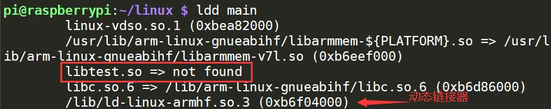

## 静态库

### 创建静态库

```cpp
// include/head.h 
#ifndef HEAD_H
#define HEAD_H

int sum(int, int);
int mul(int, int);

#endif
```

```cpp
// ./sum.c
#include "head.h"

int sum(int a, int b) {
	return a + b;
}

// ./mul.c
#include "head.h"

int mul(int a, int b) {
	return a * b;
}
```

生成.o文件

```
gcc -c *.c -I include
```

打包静态库

```
ar rcs lib/libtest.a *.o
```


### 使用静态库

```cpp
// ./main.c
#include "head.h"
#include "stdio.h"

int main()
{
	int a = sum(2, 4);
	int b = mul(2, 4);
	printf("%d %d\n", a, b);

	return 0;
}
```

使用静态库编译文件

```bash
gcc main.c lib/libtest.a -I include -o main
gcc main.c -I include -L lib -l test -o main
```

查看查看文件中符号

```
nm main
```

### 优缺点

静态库在使用的时候，会根据程序中用的到函数，将对应函数所在的.o打包到程序中。

- 发布程序的时候，不需要提供对应的库。
- 加载库的速度快

将这些库打包到可执行文件中同时也会造成：

- 可执行程序的体积大
- 库发生改变，需要重新编译程序


## 动态库

### 创建动态库

生成与位置无关的目标文件

```
gcc -fPIC -c *.c -I include
```

打包动态库**.so**

```
gcc -shared -o lib/libtest.so *.o -I include
```


### 使用动态库

```bash
gcc main.c lib/libtest.so -I include -o main
gcc main.c -L lib -l test -I include -o main
```

在使用第二种方法，执行可执行文件时，会出现找不到路径的问题，这是因为动态库在加载的时候，需要动态链接器进行加载，可以适应**ldd**命令查看可执行程序需要的动态库。



动态链接器在加载库的时候，根据环境变量中的目录惊进行查找，可以添加自己的目录到环境变量中。

**动态库的搜索路径的顺序**

1. 编译目标代码时指定的动态库搜索路径
2. 环境变量`LD_LIBRARY_PATH`指定的动态库搜索路径
3. 配置文件/etc/ld.so.conf中指定的动态库搜索路径
4. 默认的动态库搜索路径/lib和/usr/lib

添加到LD_LIBRARY_PATH，这种方法是临时的。

```bash
export LD_LIBRARY_PATH=./lib:$LD_LIBRARY_PATH
```

可以将命令写到bash配置文件里面，这样每次加载shell之前，都会配置目录。

```bash
vim ~/.bashrc
export LD_LIBRARY_PATH=./lib:$LD_LIBRARY_PATH
```

另外也可以配置**ld.so.conf**。

```bash
sudo vim /etc/ld.so.conf
/home/user/linux/lib
sudo ldconfig -v
```


查看可执行文件依赖的动态库

```bash
ldd app
```


### 优缺点

动态库只是在内存地址的共享库中标记，在程序运行时才加载。

- 可执行程序体积小
- 动态库更新，不需要重新编译
- 发布程序需要将库提供给用户
- 动态库没有打包应用程序中，加载速度相对慢