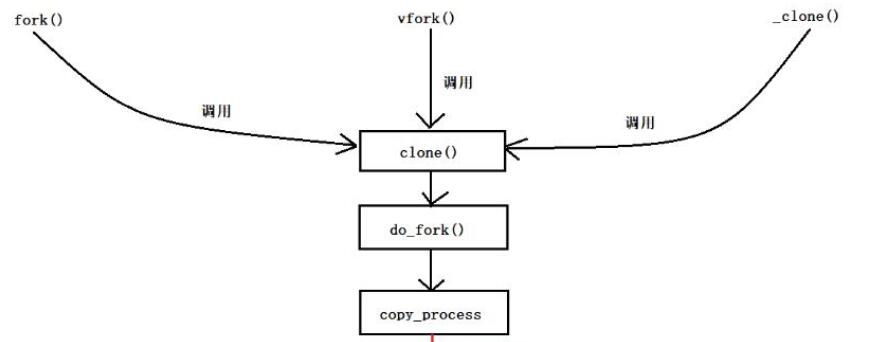

## 用户空间和内核空间

操作系统的核心是内核, 独立于普通的应用程序, 可以访问受保护的内存空间, 拥有访问底层硬件设备的所有权限. 为了保证用户进程不能直接操作内核, 保证内核安全, 操作系统将虚拟空间分为两部分, 内核空间和用户空间.
其中最高的1G字节(虚拟地址: 0xC0000000 到 0xFFFFFFFF)为内核区域, 低位的3G(虚拟地址: 0x00000000 到 0xBFFFFFFF)为用户空间.


## 进程的状态

- 就绪状态

  进程分配到除cpu以外的其他资源，只要获取cpu就能运行。

- 执行状态

  当进程获取cpu，程序在cpu上执行。

- 阻塞状态

  正在执行的进程，等待某个事件的到来，而进入阻塞状态。IO请求、等待信号等。

进程状态的转化：

- 执行->就绪：时间片用完

- 就绪->执行：被调度

- 执行->阻塞：IO请求

- 阻塞->就绪：IO完成

  

## 进程切换

内核挂起CPU上运行的进程, 恢复以前挂起的某个进程的执行.
从一个进程的运行到另一个进程的运行, 经历以下变化

1. 保存处理机上下文, 包括程序计数器和其他寄存器
2. 更新PCB信息
3. 把进程的PCB移入相应的队列, 就绪、阻塞等队列
4. 选择另一个进程执行, 更新PCB
5. 更新内存管理的数据结构
6. 恢复处理机上下文


## IO

同步: 调用一个功能, 功能没有结束，一直等待结果
异步: 调用一个功能, 不需要知道功能结果，有结果通过回调通知
阻塞: 调用函数，函数没有接受完数据或没有结果之前不返回
非阻塞: 调用函数, 函数立即返回, 通过select通知调用者
同步IO和异步IO的区别: 数据拷贝时进程是否阻塞
阻塞IO和非阻塞IO的区别: 应用程序的调用是否立即返回


## 链接的追踪


## 交换空间


## 常用命令

查找结构体所在文件

```bash
grep -r "task_struct {" /usr/include
```


查看资源限制

```bash
ulimit -a
```

查看信号

```bash
kil -l
```

追踪程序执行的系统调用

```bash
strace ./a.out
```

查看程序运行时间

执行时间 = 系统时间 + 用户时间 + 等待时间

```
time ./a.out
```

安装线程man page

```
sudo apt-get install manpages-posix-dev
man-k pthread
```

查看服务对应的端口号

```bash
vim /etc/services
```


查看打开的套接字

```bash
# summary 显示套接字（socket）使用概况
ss -s

# 显示所有的tcp
ss -t -a
```

sockets: used：已使用的所有协议套接字总量
TCP: inuse：正在使用（正在侦听）的TCP套接字数量。其值≤ netstat –lnt | grep ^tcp | wc –l
TCP: orphan：无主（不属于任何进程）的TCP连接数（无用、待销毁的TCP socket数）
TCP: tw：等待关闭的TCP连接数。其值等于netstat –ant | grep TIME_WAIT | wc –l
TCP：alloc(allocated)：已分配（已建立、已申请到sk_buff）的TCP套接字数量。其值等于netstat –ant | grep ^tcp | wc –l
TCP：mem：套接字缓冲区使用量（单位不详。用scp实测，速度在4803.9kB/s时：其值=11，netstat –ant 中相应的22端口的Recv-Q＝0，Send-Q≈400）
UDP：inuse：正在使用的UDP套接字数量
RAW：
FRAG：使用的IP段数量


统计当前socket的状态

```bash
netstat -n | awk '/^tcp/ {++S[$NF]} END {for(a in S) print a, S[a]}' 
```


## 文件类型

| 符号 | 文件类型 |
| ---- | -------- |
| -    | 文件     |
| d    | 目录     |
| l    | 符号链接 |
| s    | 套接字   |
| p    | 管道     |
| b    | 块设备   |
| c    | 字符设备 |

前三种占磁盘存储空间，后四种是伪文件，不占用磁盘空间。


## 磁盘文件

文件存储包括**目录项**和**索引节点**。

**目录项**主要包括了文件名和索引节点号，索引节点号是指向索引节点表( system inode table )中对应的索引节点。

硬链接创建的就是目录项，unlink释放的也是目录项。

**索引节点：**文件的所有信息都存放在索引节点的数据结构中。主要就是**文件的属性**，包括链接数、文件所有者、文件建立和修改的时间，文件在磁盘的位置，文件大小、使用权限等等。

查找文件时首先通过目录项找到索引节点，然后通过索引节点中的文件属性拿到文件在磁盘中存放的指针，通指针访问文件。

注：内核后来的版本采用ext文件系统时，目录项中就不是存放索引节点号，而是文件名和指向索引节点表的指针，通过指针找到索引节点。


## 三级映射


## 虚拟地址空间

32为操作系统，在程序启动后，系统分配一个4G的虚拟地址空间。


### 为什么需要虚拟地址空间？

虚拟地址空间和物理地址空间的映射可以解决：

- 方便编译器和操作系统安排程序的地址分布

  程序可以使用一系列相邻的虚拟地址空间来访问物理内存中不相邻的大内存缓冲区。

- 方便进程间隔离

  不同进程使用的虚拟地址彼此隔离，一个进程中的代码无法更改正在另一个进程中使用的物理内存。

- 方便OS使用可怜的内存

  程序可以使用一系列虚拟地址来访问大于可用物理内存的内存缓冲区，当物理内存的供应量变小时，内存管理器会将物理内存页（通常为4KB）保存到磁盘中，数据或代码页会根据需要在物理内存与磁盘之间移动。


### 受保护地址

范围是[0，4k]，不允许用户访问，通常定义的NULL的地址在这一段。

### ELF

在linux中可执行文件**a.out**的格式是ELF文件，可以通过**file**命令进行查看。

```
file a.out
a.out: ELF 32-bit LSB executable
```

ELF中主要包含三段：

- .test，代码段存放二进制机器指令
- .data，已初始化的全局变量
- .bss，未初始化的全局变量

另外还包含一些其他的段：

- 只读数据段
- 符号段

静态库存放在代码段，绝对地址位置不变。


### 堆区

存放动态申请的内存地址，向上增长，内存大。


### 共享库

加载程序运行需要的库，只在程序运行时加载，相对地址位置不固定。


### 栈区

存放局部变量，向下增长，内存小。


## 进程和线程的区别

- 根本区别

  进程是资源分配的最小单位，线程是程序执行的最小单位。

  计算机在执行程序时，为程序创建相应的进程，进行资源分配时，是以进程为单位进行相应的分配。每个进程都有相应的线程，执行程序时，实际上是执行相应的线程。

- 地址空间

  进程有自己独立的地址空间，每启动一个进程，系统为其分配地址空间，建立数据表来维护代码段、堆栈段和数据段；线程没有独立的地址空间，同一进程中的线程共享本进程的地址空间。

- 资源共享

  进程之间的资源是独立的，同一进程中的线程共享本进程的资源。

- 执行过程

  每个独立的进程有一个程序运行的入口，顺序执行序列和程序入口，但是线程不能独立执行，必须存在应用程序中，由程序控制执行。

  进程相互不会影响，线程挂掉可能导致整个进程挂掉。

- 系统开销

  进程的开销大，线程的开销小。


## fork函数

[fork底层实现](https://www.cnblogs.com/tp-16b/p/9005079.html)

fork()系统调用会通过复制一个现有进程来创建一个子进程。进程存放在一个任务队列的双向链表中。链表当中的每一项都是**task_struct**结构体，PCB进程控制块。

内核通过PID来标识每一个进程，默认最大值为32768（short的最大值）。

fork()创建子进程之后，父子进程同时从fork()后的代码开始运行。父子进程的执行顺序不确定，取决于内核使用的调度算法。

进程调用fork，内核会做4件事：

- 分配新的内存块和内核数据结构给子进程
- 将父进程部分数据结构内容（数据空间、堆栈等）拷贝到子进程
- 添加子进程到系统进程列表
- fork返回，开始调度器调度




copy_process执行的操作：

1. 调用dup_task_struct()为新进程创建一个内核栈，thread_info和task_struct和父进程相同，此时父子进程的描述符完全相同。
2. 检查新创建的子进程，当前拥有进程数目是否超过资源限制。
3. 区分父子进程描述符。
4. 子进程状态设置为TASK_UNINTERRUPTIBLE（不可中断）保证他不会被运行。
5. copy_process()调用copy_flags()已更新task_struct的flags成员，进程是否拥有超级用户权限PF_SUPERPRIV标志清零，进程还没有调用exec函数。
6. 调用get_pid为新进程获取一个有效pid。
7. 根据clone()参数，copy_process()拷贝或共享打开的文件，进程地址空间等。
8. copy_process()扫尾并返回执行子进程的指针


### 为什么fork调用返回两个值？

fork复制了父进程的堆栈，所以两个进程都停留在fork函数中等待返回。

父进程返回子进程的pid，这是因为进程可以有多个子进程，但是没有函数去获取子进程的pid。

子进程返回0，这是因为子进程可以通过getppid获取父进程的进程id，这个进程id不可能为0，返回0表示正常返回。

fork()之后的代码父子共享，父子进程都要主从这段代码开始执行，虽然子进程获得父进程的数据空间、堆栈的副本，但是父子进程不共享这些存储空间。现在很多实现不是对父进程的数据段、堆栈的完全复制，采用写时拷贝技术，父子进程共享，内核设置访问权限为只读，如果父子进程中任一试图修改这些区域，内核为对应内存创建副本。

父子进程相同：全局变量、.data、.text、堆、栈、环境变量、用户ID、宿主目录、进程工作目录、信号处理方式。

父子进程不同：for返回值、进程ID、父进程ID、进程运行时间、定时器、未决信号集。

父子进程共享：文件描述符、mmap建立的映射区。


### 父子进程共享文件的问题

```c
#include <unistd.h>
#include <fcntl.h>
#include <stdlib.h>

int num = 0;
int main() {
	printf("hello world!\n");
	
	pid_t pid = fork();
	if (pid < 0) exit(1);

	if (pid == 0) { // 子进程
		printf("son pid = %d, num = %d\n", getpid(), ++num);

	}else { // 父进程
		sleep(1);
		printf("parent pid = %d, num = %d\n", getpid(), num);
	
	}

	return 0;
}
```

```c
pi@raspberrypi:~ $ ./a.out 
hello world!
son pid = 4868, num = 1
parent pid = 4867, num = 0
```

```c
// 将标准输出重定向到文件中
pi@raspberrypi:~ $ ./a.out > tmp
pi@raspberrypi:~ $ cat tmp
hello world!
son pid = 4870, num = 1
hello world!
parent pid = 4869, num = 0
```

使用标准IO库带有缓冲区，printf是行缓冲，如果执行了重定向操作，将标准输出到文件中，行缓冲就会变成全缓冲。fork()之前printf的数据会保存到缓冲区中，fork之后父进程的数据空间复制到子进程中，缓冲区的数据就被复制过去，在进程结束后都会打印输出。

**父子进程共享文件描述符关联的内核文件表项 struct file结构体**，父进程重定向，同时子进程也会重定向，父进程等待子进程结束时，子进程更新了共享文件的偏移量，所以父进程追加到子进程所写数据的后面。

### fork与vfork

vfork的实现是父子进程完全共享资源，修改内容main()函数退出都不会开辟空间。子进程没有使用exit()退出，程序就会出现段错误，原因是main函数被子进程释放，父进程访问不到。

- fork父子进程交替执行，vfork保证子进程先运行，父进程阻塞（或子进程调用exec或exit）
- fork实现写时拷贝，vfork直接让父子进程共享公共资源，避免开辟空间拷贝。
- vfork必须使用exit或excl退出


## 进程通信

### 无名管道

无名管道，多用于父子进程的通信。

- 半双工通信(数据只能在一个方向上流动)，有固定的读端和写端。
- 只能用于具有亲缘关系的进程之间的通信（父子进程、兄弟进程）。
- 可以看作特殊的文件使用read、write读写，但不是普通文件不属于文件系统，只存在内存中。

```c
#include <unistd.h>
int pipe(int fd[2]);    // 返回值：若成功返回0，失败返回-1
```

pipe创建2个文件描述符fd[0]为读端，fd[1]为写端。

fork()之后，对应关闭不使用的文件描述符。

如果写端计数不为零，读端读取完数据之后会阻塞等待，否则read返回0结束。


### FIFO

用于不同进程间的通信，也可以用作客户端和服务器的通信。

FIFO通信方式类似通过文件来传输数据，FIFO类型文件同时具有管道的特性，在数据读出时，FIFO管道中同时清除数据，而且是“先进先出”

```c
#include <sys/stat.h>
// 返回值：成功返回0，出错返回-1
int mkfifo(const char *pathname, mode_t mode);
```


### 共享内存

指两个或多个进程共享一个给定的存储区

- 最快的一种IPC，进程对内存直接存取。
- 存在多个进程同时操作，需要进行同步。
- 信号量+共享内存通常结合在一起，信号量用来同步对共享内存的访问。


### 信号

信号的特点：

- 简单 
- 不能携带大量信息
- 满足某个特设条件才发送

A给B发送信号，B收到信号之前执行自己的代码，收到信号后，不管执行到程序的什么位置，都要暂停运行，去处理信号，处理完毕再继续执行。与硬件中断类似——异步模式。但信号是软件层面上实现的中断，早期常被称为“软中断”。

信号的特质：由于信号是通过软件方法实现，其实现手段导致信号有很强的延时性。但对于用户来说，这个延迟时间非常短，不易察觉。

每个进程收到的所有信号，都是由内核负责发送的，内核处理。


### 本地套接字

稳定性好。


### 5种通讯方式总结

1. 管道：速度慢，容量有限，只有父子进程能通讯   

2. FIFO：任何进程间都能通讯，但速度慢   

3. 共享内存区：能够很容易控制容量，速度快，但要保持同步，比如一个进程在写的时候，另一个进程要注意读写的问题，相当于线程中的线程安全，当然，共享内存区同样可以用作线程间通讯，不过没这个必要，线程间本来就已经共享了同一进程内的一块内存

4. 信号：不能传递复杂消息，有一定延迟   


## IO模型

应用层利用TCP缓冲区来收发数据，TCP发送的消息是间断的。

### 阻塞IO

当应用请求读取数据时，内核还没有准备好，应用程序就处于等待数据的状态，等到内核将数据准备好，交给应用才结束。

### 非阻塞IO

应用请求读取数据时，内核没有准备好，立即返回（EWOULDBLOCK）。后面需要不断调用recvfrom，直到读取到需要的数据为止。

### 同步

在IO模型中，需要请求方从发送请求到收到数据，到最后完成，需要自己参与，这样叫做同步IO。

### 异步

应用程序发送指令之后不再参与，只需要等待最终完成结果通知，这种属于异步。

### IO复用

多个应用程序请求读数据，如果每一个线程都去调用recvfrom，会造成资源的浪费。IO复用就是通过select、poll、epoll来监控多个fd，而不是为每个线程创建一个监控线程，减少线程资源的浪费。


### select、poll、epoll

**select**将需要的监控的fd存储到fd_set中，通过调用select从用户态拷贝到内核态，内核对数组遍历，检查是否有可读写事件，如果没有读写事件，就删除对应的fd，返回fd_set数组，内核态向用户态拷贝。复杂度$O(n)$

fd_set是集合类型的数据结构，32为操作系统最大为1024，64为操作系统为2048，限制了select最多同时监控的连接数量。

**poll**通过链表来保存文件fd信息，没有最大连接数量限制，也是将用户传入的数组拷贝到内核态，复杂度$O(n)$

**epoll**在内核创建一个事件监听表，epoll_ctl来添加需要监听的读写事件，避免用户态到内核态的拷贝，对每个fd创建回调函数，事件激活后调用回调函数，加到活跃队列中，通过epoll_wait返回，复杂度$O(1)$

select、poll、epoll本质都是同步IO，当发生可读写事件，自己负责进行读写，这个读写过程是阻塞的。

epoll是linux特有的，select是操作系统都有的。

epoll有LT和ET两种触发模式，LT水平触发是默认模式，ET是边沿触发。水平触发，在没有处理的情况下，下次poll的时候会再次报告这个fd；边沿触发之后提示一次，直到下次再有数据之前不会再提示，所以每次read要把buffer读完。如果系统中有大量不需要读写的就绪fd，调用epoll_wait通知程序读写，会影响性能。边沿触发效率高，系统不会充斥大量不关心的fd。

epoll_event结构体

epoll优点：

- 没有最大连接限制
- 效率提高，只有活跃的fd才会通过回调函数，通知程序。
- 利用mmap内存映射来完成文件和内核空间的消息传递，减少复制的开销。


总结：

- select，poll实现需要自己不断轮询所有fd集合，直到fd就绪，期间可能要睡眠和唤醒多次交替。而epoll需要调用epoll_wait不断轮询就绪链表，期间也可能多次睡眠和唤醒交替，但是它是设备就绪时，调用回调函数，把就绪fd放入就绪链表中，并唤醒在epoll_wait中进入睡眠的进程。虽然都要睡眠和交替，但是select和poll在“醒着”的时候要遍历整个fd集合，而epoll在“醒着”的时候只要判断一下就绪链表是否为空就行了，这节省了大量的CPU时间。这就是回调机制带来的性能提升。

- select，poll每次调用都要把fd集合从用户态往内核态拷贝一次，而epoll只要一次拷贝，这也能节省不少的开销。 


## 产生死锁的条件

1. 线程对同一个互斥量加锁两次

2. 线程1拥有A锁，请求B锁；线程2拥有B锁，请求A锁

3. 哲学家吃饭问题的振荡，同时请求资源，同时释放


- 互斥：资源在同一时间，只能被一个任务使用。
- 请求和占有：拥有资源的进程可以请求另一个资源。
- 不可抢占：已经分配的资源，不能强制的被抢占，只能等待释放资源。
- 环路等待：有两个以上的进程，等待下一个进程所占有的资源。

## read、fread的区别

fread返回一个FILE的结构体指针，read返回读取的字节数。

fread带缓冲区是read的衍生，fread底层调用read。

fread自带缓冲区，减少调用次数。


## 缓存算法

- LRU（Least recently used）最近最少使用，如果数据最近被访问过，那么将来被访问的几率也更高。

  - 新数据插入到链表头部。
  - 每当缓存命中，将数据移动到链表头部。
  - 链表满，将链表尾部数据丢弃。

  可以使用哈希表来记录数据是否存在链表中。

- LFU（Least frequently used）最近不经常使用，如果一个数据在最近一段时间内使用的次数最少，那么在将来一段时间内被使用的可能性也小。

  主要看在一个时间段中页面使用的频率。

- FIFO（Fist in first out）先进先出，如果一个数据最先进入缓冲中，则应该最早淘汰掉。


## 自旋锁和互斥锁

互斥锁属于sleep-waiting类型的锁

自旋锁属于busy-waiting类型的锁


### 自旋锁

自旋锁不会引起调用者睡眠，如果自旋锁已经被别的执行单元保持，调用者就一直循环在那里看是  否该自旋锁的保持者已经释放了锁，"自旋"一词就是因此而得名。其作用是为了解决某项资源的互斥使用。因为自旋锁不会引起调用者睡眠，所以自旋锁的效率远 高于互斥锁。虽然它的效率比互斥锁高，但是它也有些不足之处：

1. 自旋锁一直占用CPU，他在未获得锁的情况下，一直运行如果不能在很短的时间内获得锁，这无疑会使CPU效率降低。
2. 在用自旋锁时有可能造成死锁，当递归调用时有可能造成死锁，调用有些其他函数也可能造成死锁，如 copy_to_user()、copy_from_user()、kmalloc()等。

因此我们要慎重使用自旋锁，自旋锁只有在内核可抢占式或SMP的情况下才真正需要，在单CPU且不可抢占式的内核下，自旋锁的操作为空操作。自旋锁适用于锁使用者保持锁时间比较短的情况下。


### 加锁原理

互斥锁：线程会从sleep（加锁）——>running（解锁），过程中有上下文的切换，cpu的抢占，信号的发送等开销。

自旋锁：线程一直是running(加锁——>解锁)，死循环检测锁的标志位，机制不复杂。


### 两种锁的区别

互斥锁的起始原始开销要高于自旋锁，但是基本是一劳永逸，临界区持锁时间的大小并不会对互斥锁的开销造成影响，而自旋锁是死循环检测，加锁全程消耗cpu，起始开销虽然低于互斥锁，但是随着持锁时间，加锁的开销是线性增长。


### 两种锁的应用

互斥锁用于临界区持锁时间比较长的操作：

- 临界区有IO操作
- 临界区代码复杂或者循环量大
- 临界区竞争非常激烈
- 单核处理器

自旋锁就主要用在临界区持锁时间非常短，且CPU资源不紧张的情况下，一般用于多核的服务器。


## epoll的触发方式

epoll有两种触发方式：边沿触发(ET)、水平出发(LT)。

水平触发(默认)：当发生读事件，epoll返回，如果没有把缓冲区的数据读取完，下次epoll会立即返回，直到读取完缓冲区的数据为止。

边沿触发：当发生读事件，epoll返回，如果没有把缓冲区的数据读取完，下次不会返回，直到有新的读事件再返回。

一般使用ET模式，常常有大量的连接，此时ET/LT返回，服务端通过头部数据进行判断要不要接受后续的数据，如果不接受，LT模式需要手动的清楚所有的数据，ET只需要交给一个定时的线程处理，自己立刻返回。


## 服务器架构

### epoll + ET + 非阻塞IO

一般不会直接使用read函数读数据，而是封装为readn这样的含有用户缓冲和内核缓冲的方式，假如readn设置200B返回，此时缓冲区只有100B，那个readn阻塞的等待，此时cfd就不能通过epoll_wait及时出发，造成死锁。所以一般采用阻塞IO的形式。

```
// ET
listen_ep_event.events  = EPOLLIN | EPOLLET;   

// 非阻塞
flag  = fcntl(cfd, F_GETFL);
flag |= O_NONBLOCK;
fcntl(connect_fd, F_SETFL, flag); 
```


### epoll反应堆模型

**epoll+ET+非阻塞+自定义结构体**

每个epoll文件描述符都有这样的结构

```c
struct epoll_event {
    __uint32_t events; /* Epoll events */
    epoll_data_t data; /* User data variable */
};

typedef union epoll_data {
    void *ptr;
    int fd;
    uint32_t u32;
    uint64_t u64;
} epoll_data_t;
```

因此我们可以在epoll_ctl添加fd的时候，设置每个efd的回调函数，在出发之后，直接执行他的回调函数。

**具体的过程为：**

监听可读事件(ET) 

数据到来，触发事件，epoll_wait()返回 

读数据(可读事件回调函数内) 

将该节点从红黑树上摘下(可读事件回调函数内) 

设置可写事件和对应可写回调函数(可读事件回调函数内) 

挂上树(可读事件回调函数内) ，处理数据(可读事件回调函数内)  

监听可写事件(ET) ，对方可读，触发事件 ⇒ epoll_wait()返回 

写完数据(可写事件回调函数内) 

将该节点从红黑树上摘下(可写事件回调函数内) 

设置可读事件和对应可读回调函数(可写读事件回调函数内)  

挂上树(可写事件回调函数内)  

处理收尾工作(可写事件回调函数内)  

直到程序停止前一直这么交替循环 


**为什么要可读以后设置可写，然后一直交替？**

服务器的基本工作无非数据的收发，epoll反应堆模型准从TCP模式，一问一答。服务器收到了数据，再给与回复，是目前绝大多数服务器的情况。 
**服务器能收到数据并不是一定能写数据** 

- 服务器接收到客户端数据，刚好此时客户端的接收滑动窗口满，我们假设不进行可写事件设置，并且客户端是有意让自己的接收滑动窗口满的情况(黑客)。那么当前服务器将随客户端的状态一直阻塞在可写事件，除非你自己在写数据时设置非阻塞+错误处理 
- 客户端在发送完数据后突然由于异常原因停止，这将导致一个FIN发送至服务器，如果服务器不设置可写事件监听，那么在接收数据后写入数据会引发异常SIGPIPE，最终服务器进程终止。 
  细节部分可以看看我的这篇关于SIGPIPE信号的博客 


## nginx的惊群

当有新的连接请求时，同时唤醒多个进程进行accept的现象。内核对进程频繁的做无效的调度、上下文切换，使得大部分时间发在cpu的调度，而不是工作上。为了确保只有一个进程获取资源，需要使用锁的机制，加大了系统的开销。

**Accept解决方案：**

设置标志位，第一个调度的进程将标志位设置为0，然后进行处理，之后的进程判断标志位，直接退出即可。

**Epoll解决方案：**

根据epoll_wait在fork前后分为两种，如果epoll_wait在fork之前，多个进程共享一个红黑树，在处理的时候类似Accept的方式。

epoll_wait返回的时候不一定是新连接，还可能是旧连接的读写事件、定时事件、信号等，此时就需要对应的epoll去处理，如果进程错误调度，就不能正确的处理事件，所以一般每个进程里面会创建自己的红黑树。这时就出现惊群现象，可以通过加锁的方式，拥有锁的进程accept新连接，其他进程删除listenfd，避免accept。


## SIGPIPE

在tcp连接中，如果客户端异常退出，向服务端发送fin之后退出，此时服务端向客户端发送数据，就会收到一个rst，在服务端会触发sigpipe信号，sigpipe的默认处理动作是终止程序，所以会导致服务端异常退出。

可以自定义SIGPIPE的处理动作。