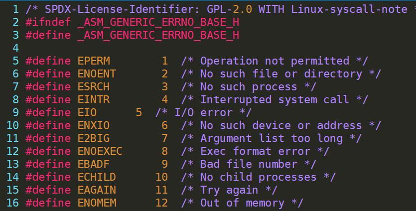

## errno

头文件

```cpp
#include <errno.h>
```

errno定义在头文件`/usr/include/errno.h`中，它是一个全局变量，任何标准C库函数都可以进行修改。


errno是错误宏定义，在函数运行出错的时候，由内核设置错误信息。

第1-34个错误定义在`/usr/include/asm-generic/errno-base.h`。

第35-133个错误定义在`/usr/include/asm-generic/errno.h`。




## open

头文件

```cpp
#include <sys/types.h>
#include <sys/stat.h>
#include <fcntl.h>

int open(const char *pathname, int flags);
int open(const char *pathname, int flags, mode_t mode);
```

返回值

```cpp
-1	打开失败，同时设置errno
>0	文件描述符    
```

```bash
# 创建文件
int fd = open("filename", O_RDWR | O_CREAT, 0777);

# 判断文件是否存在
int fd = open("filename", O_RDWR | O_CREAT | O_EXCL, 0777);
errno == EEXIST

# 文件截断为0
int fd = open("filename", O_RDWR | O_TRUNC);

# 关闭文件
int ret = close(fd);
```

创建文件的实际权限为给定权限&本地掩码(取反)。

```
# 查看掩码
umask
```


## close

头文件

```cpp
#include <unistd.h>

int close(int fd);
```

返回值

```cpp
-1	关闭失败，同时设置errno
0	关闭正常
```


## exit

头文件

```cpp
#include <stdlib.h>

void exit(int status);
```


## perror

输出错误信息，参数表示首先需要输出的字符串。

```cpp
#include <stdio.h>

void perror(const char *s);
```


```cpp
#include <sys/types.h>
#include <sys/stat.h>
#include <fcntl.h>
#include <unistd.h>
#include <stdlib.h>
#include <stdio.h>

int main() {
    
	// 打开文件
	int fd = open("hello", O_RDWR);
    
	// 判断是否成功
	if (fd == -1) {
        perror("open");
        exit(1);
    }


    // 创建新的文件
	int newfd = open("myhello", O_RDWR | O_CREAT, 0666);
    
	printf("fd = %d\n", newfd); 
    
	// 关闭文件
	int ret = close(newfd);

	if (ret == -1) perror("close失败");
}
```


## read

头文件

```cpp
#include <unistd.h>

ssize_t read(int fd, void *buf, size_t count);
```

返回值

```cpp
-1	读取失败并设置errno
0 	文件末尾
>0	读取的字节数
```


## write

头文件

```cpp
#include <unistd.h>

ssize_t write(int fd, const void *buf, size_t count);
```

返回值

```
-1	写入失败并设置errno
0	没有东西可写
>0	写入的字节数
```


```bash
#include <sys/types.h>
#include <sys/stat.h>
#include <fcntl.h>
#include <unistd.h>
#include <stdio.h>

int main() {

	int src = open("english.txt", O_RDWR);
	int dst = open("copy_enlish.txt", O_RDWR | O_CREAT, 0644);

	if (src == -1 | dst == -1) {
		perror("open");
	}

	char buf[1024];

	// 将文件从src读到dst中
	int rd = 0;
	while ((rd = read(src, buf, sizeof(buf))) > 0) {
		write(dst, buf, rd);
	}

	close(src);
	close(dst);

	return 0;
}

```


## lseek

头文件

```cpp
#include <sys/types.h>
#include <unistd.h>

off_t lseek(int fd, off_t offset, int whence);
```

返回值

```cpp
-1 	定位失败并设置errno
>0 	距离开始的位置
```

| whence   |          |
| -------- | -------- |
| SEEK_SET | 文件开头 |
| SEEK_CUR | 当前位置 |
| SEEK_END | 文件末尾 |


```c
#include <sys/types.h>
#include <sys/stat.h>
#include <fcntl.h>
#include <unistd.h>
#include <stdio.h>

int main() 
{
	int fd = open("english.txt", O_RDWR);
	if (fd == -1) perror("open");

	// 获取文件大小
	int len = lseek(fd, 0, SEEK_END);
	printf("english.txt length is %d\n", len);

	// 扩展文件大小
	len = lseek(fd, 10, SEEK_END);
	printf("english.txt length is %d\n", len);

	write(fd, "add", 3);

	close(fd);

	return 0;
}
```

文件指针的位置可以超过文件末尾，但是并不会改变文件的大小，需要进行写操作，才会改变文件的大小。


## stat

头文件

```cpp
#include <sys/types.h>
#include <sys/stat.h>
#include <unistd.h>

int stat(const char *pathname, struct stat *statbuf);
int fstat(int fd, struct stat *statbuf);
int lstat(const char *pathname, struct stat *statbuf)
```

stat穿透函数，软连接文件链接的大小。(vim)

lstat不穿透函数，软连接的文件大小。(ls、rm)


返回值

```
-1 	失败，并设置errno
0	成功
```

```cpp
 struct stat {
     dev_t     st_dev;         /* ID of device containing file */
     ino_t     st_ino;         /* Inode number */
     mode_t    st_mode;        /* File type and mode */
     nlink_t   st_nlink;       /* Number of hard links */
     uid_t     st_uid;         /* User ID of owner */
     gid_t     st_gid;         /* Group ID of owner */
     dev_t     st_rdev;        /* Device ID (if special file)
     */
     off_t     st_size;        /* Total size, in bytes */
     blksize_t st_blksize;     /* Block size for filesystem I/O */
     blkcnt_t  st_blocks;      /* Number of 512B blocks allocated */

    struct timespec st_atim;  /* Time of last access */
    struct timespec st_mtim;  /* Time of last modification */
    struct timespec st_ctim;  /* Time of last status change */

    #define st_atime st_atim.tv_sec      /* Backward compatibility */
    #define st_mtime st_mtim.tv_sec
    #define st_ctime st_ctim.tv_sec
};

```


```cpp
# 实现ls命令
#include <stdio.h>
#include <stdlib.h>
#include <sys/types.h>
#include <sys/stat.h>
#include <unistd.h>
#include <string.h>
#include <time.h>
#include <pwd.h>
#include <grp.h>

int main(int argc, char* argv[]) {
    if (argc < 2) { 
        printf("./a.out filename\n");
        exit(1);
    }
    struct stat st;
    int ret = stat(argv[1], &st);
    if (ret == -1) {
        perror("stat");
        exit(1);
    }
    // 存放文件类型和访问权限
    char perms[11] = {0};
    
    // 判断文件类型
    switch (st.st_mode & S_IFMT) {
        case S_IFLNK:
            perms[0] = 'l';
            break;
        case S_IFDIR:
            perms[0] = 'd';
            break;
        case S_IFREG:
            perms[0] = '-';
            break;
        case S_IFBLK:
            perms[0] = 'b';
            break;
        case S_IFCHR:
            perms[0] = 'c';
            break;
        case S_IFSOCK:
            perms[0] = 's';
            break;
        case S_IFIFO:
            perms[0] = 'p';
            break;
        default:
            perms[0] = '?';
            break;
    }

    // 判断文件访问权限
    // owner
    perms[1] = (st.st_mode & S_IRUSR) ? 'r' : '-';
    perms[2] = (st.st_mode & S_IWUSR) ? 'w' : '-';
    perms[3] = (st.st_mode & S_IXUSR) ? 'x' : '-';
    // group
    perms[4] = (st.st_mode & S_IRGRP) ? 'r' : '-';
    perms[5] = (st.st_mode & S_IWGRP) ? 'w' : '-';
    perms[6] = (st.st_mode & S_IXGRP) ? 'x' : '-';
    // others
    perms[7] = (st.st_mode & S_IROTH) ? 'r' : '-';
    perms[8] = (st.st_mode & S_IWOTH) ? 'w' : '-';
    perms[9] = (st.st_mode & S_IXOTH) ? 'x' : '-';
    // 硬链接数
    int linkNum = st.st_nlink;
    // 所有者
    char *fileOwner = getpwuid(st.st_uid)->pw_name;
    // 所属组
    char *fileGrp = getgrgid(st.st_gid)->gr_name;
    // 大小
    int fileSize = (int)st.st_size;
    // 修改时间
    char *time = ctime(&st.st_mtime);
    char mtime[512] = {0};
    strncpy(mtime, time, strlen(time) - 1);
    char buf[1024];
    sprintf(buf, "%s %d %s %s %d %s %s", perms, linkNum, fileOwner, fileGrp, fileSize, mtime, argv[1]);
    printf("%s\n", buf);
}
```


## access

头文件

```cpp
#include <unistd.h>

int access(const char *pathname, int mode);
```

返回值

```cpp
-1	失败，文件不存在或不具有权限，并设置errno
0 	成功
```


| mode |            |
| ---- | ---------- |
| R_OK | 是否可读   |
| W_OK | 是否可写   |
| X_OK | 是否可执行 |
| F_OK | 是否存在   |


```c
int ret = access(argv[1], W_OK | R_OK | X_OK | F_OK);
```


## strtol

将字符串转化为指定进制的数。

头文件

```cpp
 #include <stdlib.h>

long int strtol(const char *nptr, char **endptr, int base);
long long int strtoll(const char *nptr, char **endptr, int base);
```

base表示进制，位于2-36。


## chmod

头文件

```cpp
#include <sys/stat.h>

int chmod(const char *pathname, mode_t mode);
int fchmod(int fd, mode_t mode);
```

返回值

```
-1	失败，并设置errno
0 	成功
```


```c
int main(int argc, char* argv[]) {
    if (argc < 3) {
        printf("./a.out filename 0644\n");
        exit(1);
    }

    int val = strtol(argv[2], NULL, 8); // 字符串转数字
    printf("%s %d\n", argv[2], val);
    int ret = chmod(argv[1], val);
    if (ret == -1) {
        perror("chmod");
        exit(1);
    }
}
```


## chown

修改文件所属。

头文件

```cpp
#include <unistd.h>

int chown(const char *pathname, uid_t owner, gid_t group);
int fchown(int fd, uid_t owner, gid_t group);
int lchown(const char *pathname, uid_t owner, gid_t group); // 不穿透
```

返回值

```
-1	失败，并设置errno
0 	成功
```


```c
# 修改用户和组id
int main(int argc, char *argv[]) {
    if (argc < 4) {
        printf("./a.out filename uid gid\n");
        exit(1);
    }
    
    int uid = strtol(argv[2], NULL, 10);
    int gid = strtol(argv[3], NULL, 10);
    
    printf("uid = %d\n gid = %d\n", uid, gid);
    
    int ret = chown(argv[1], uid, gid);
    if (ret == -1) {
        perror("chown");
        exit(1);
    }
}
```


## truncate

truncate用于修改文件大小，根据length指定文件的大小，再扩展文件时不需要进行多余的写操作。

头文件

```cpp
#include <unistd.h>
#include <sys/types.h>

int truncate(const char *path, off_t length);
int ftruncate(int fd, off_t length);
```

返回值

```
-1	失败，并设置errno
0 	成功
```


```c
int main(int argc ,char *argv[]) {
    if (argc < 3) {
        printf("./a.out filename size\n");
        exit(1);
    }
    
    int len = strtol(argv[2], NULL, 10);
    
    int ret = truncate(argv[1], len);
    if (ret == -1) {
        perror("truncate");
        exit(1);
    }
}
```


## link

link()创建硬链接。

头文件

```cpp
#include <unistd.h>

int link(const char *oldpath, const char *newpath);
```

返回值

```
-1	失败，并设置errno
0 	成功
```


## symlink

link()创建软链接。

头文件

```cpp
#include <unistd.h>

int symlink(const char *target, const char *linkpath);
```

返回值

```
-1	失败，并设置errno
0 	成功
```


## readlink

读取软链接文件，不会在buf后面添加null，内容超过bufsiz的部分会被截断。

头文件

```cpp
#include <unistd.h>

ssize_t readlink(const char *pathname, char *buf, size_t bufsiz);
```

返回值

```
-1		失败，并设置errno
>=0 	成功，读取的字节数
```


```c
#include <stdio.h>
#include <stdlib.h>
#include <unistd.h>

int main(int argc, char *argv[]) {
    if (argc < 2) {
        printf("./a.out softlink\n");
        exit(1);
    }
    
    char buf[1024];
	
    int ret = readlink(argv[1], buf, sizeof(buf));
    if (ret == -1) {
        perror("readlink");
        exit(1);
    }
    
	write(1, buf, ret);
	write(1, "\n", 1);
}
```


## unlink

删除文件的目标项并减少它的链接数，删除文件要有这个文件的所属目录的写和执行权限。

如果硬链接数为0，但由进程打开该文件，并持有文件描述符，则等到进程关闭该文件时，内核才真正删除该文件。

可以使用unlink()创建临时文件，在进程关闭fd之后自动删除。

头文件

```cpp
#include <unistd.h>

int unlink(const char *pathname);
```

返回值

```
-1		失败，并设置errno
>=0 	成功
```


```c
#include <stdlib.h>
#include <stdio.h>
#include <sys/types.h>
#include <unistd.h>
#include <fcntl.h>

int main(int argc, char *argv[]) {
    int fd = open("tmpfile", O_CREAT | O_RDWR, 0644);
    if (fd == -1) {
        perror("open");
        exit(1);
    }
    // 删除临时文件, 等到fd关闭才真正删除
    int ret = unlink("tmpfile");
    
    // 写文件
    write(fd, "hello\n", 6);
    lseek(fd, 0, SEEK_SET);

    // 读文件
    char buf[1024] = {0};
    int len = read(fd, buf, sizeof(buf));
	
    // 输出到屏幕
    write(1, buf, len);

    close(fd);
    return 0;
}
```

## rename

头文件

```cpp
#include <stdio.h>

int rename(const char *oldpath, const char *newpath);
```

返回值

```
-1		失败，并设置errno
>=0 	成功
```


## chdir

chdir修改进程的路径。

头文件

```cpp
#include <unistd.h>

int chdir(const char *path);
int fchdir(int fd);
```

返回值

```
-1		失败，并设置errno
>=0 	成功
```


## getcwd

头文件

```cpp
#include <unistd.h>

char *getcwd(char *buf, size_t size);
char *getwd(char *buf);
char *get_current_dir_name(void);
```

返回值

```
NULL	失败，并设置errno
指针	   成功
```


## mkdir


头文件

```cpp
#include <sys/stat.h>
#include <sys/types.h>

int mkdir(const char *pathname, mode_t mode);
```

返回值

```
-1		失败，并设置errno
>=0 	成功
```


## rmdir

rmdir只能删除空目录。

头文件

```cpp
#include <unistd.h>

int rmdir(const char *pathname);
```

返回值

```
-1		失败，并设置errno
>=0 	成功
```


## opendir

头文件

```cpp
#include <sys/types.h>
#include <dirent.h>

DIR *opendir(const char *name);
DIR *fdopendir(int fd);
```

返回值

```
NULL	 失败，并设置errno
指针		结构指针DIR
```


## readdir

头文件

```cpp
#include <dirent.h>

struct dirent *readdir(DIR *dirp);
```

返回值

```
NULL	 读到末尾或失败并设置errno
指针		结构指针dirent
```


```cpp
struct dirent {
    ino_t          d_ino;       /* Inode number */
    off_t          d_off;       /* Not an offset; see below */
    unsigned short d_reclen;    /* Length of this record */
    unsigned char  d_type;      /* Type of file; not supported
    by all filesystem types */
    char           d_name[256]; /* Null-terminated filename */
};

DT_BLK      This is a block device.
DT_CHR      This is a character device.
DT_DIR      This is a directory.
DT_FIFO     This is a named pipe (FIFO).
DT_LNK      This is a symbolic link.
DT_REG      This is a regular file.
DT_SOCK     This is a UNIX domain socket.
DT_UNKNOWN  The file type could not be determined.
```


## closedir

头文件

```cpp
#include <sys/types.h>
#include <dirent.h>

int closedir(DIR *dirp);
```

返回值

```
-1		失败，并设置errno
>=0 	成功
```


递归读目录的文件数

```c
#include <stdio.h>
#include <stdlib.h>
#include <sys/types.h>
#include <dirent.h>
#include <string.h>

int getFileNum(char *root) {
    // 打开目录
    DIR *dir = NULL;
    dir = opendir(root);
    if (dir == NULL) {
        perror("opendir");
        exit(1);
    }

	// 遍历当前目录
    int cnt = 0;
    char buf[1024] = {0};
    struct dirent *ptr = NULL;

    while((ptr = readdir(dir)) != NULL) {
        if(strcmp(ptr->d_name, ".") == 0 || strcmp(ptr->d_name, "..") == 0) continue;
        if (ptr->d_type == DT_DIR) { // 目录文件

            sprintf(buf, "%s/%s", root, ptr->d_name);
            cnt += getFileNum(buf); // 递归读取

        }else if (ptr->d_type == DT_REG) cnt++; // 普通文件
    }

    // 关闭目录
    closedir(dir);
    return cnt;
}

int main(int argc, char *argv[]) {
    if (argc < 2) {
        printf("./fileNum dir\n");
        exit(1);
    }

    int cnt = 0;
    cnt = getFileNum(argv[1]);
    printf("%s %d\n", argv[1], cnt);
    
	return 0;
}
```


## dup

dup用于文件重定向，复制文件描述符。

头文件

```cpp
#include <unistd.h>

int dup(int oldfd);
int dup2(int oldfd, int newfd);
```

返回值

```
-1		 失败，并设置errno
新的fd	成功
```

dup，复制oldfd描述符，返回文件描述符表中最小的文件描述符。

dup2，把oldfd复制给newfd，如果newfd是一个打开的fd，则先关闭之前的；如果newfd等于oldfd，直接返回old。

dup两个fd的文件指针同步。


## fcntl

fcntl修改打开文件属性。

头文件

```cpp
#include <unistd.h>
#include <fcntl.h>

int fcntl(int fd, int cmd, long arg);

F_SETLK (struct flock *)	// 非阻塞
F_SETLKW (struct flock *)	// 阻塞
F_GETLK (struct flock *)	


struct flock {
    ...
    short l_type;    	锁的类型：F_RDLCK 、F_WRLCK 、F_UNLCK
    short l_whence;  	偏移位置：SEEK_SET、SEEK_CUR、SEEK_END 
    off_t l_start;   	起始偏移：1000
    off_t l_len;     	长度：0表示整个文件加锁
    pid_t l_pid;     	持有该锁的进程ID：(F_GETLK only)
    ...
};

struct flock lock;
lock.type = F_RDLOCK; 		
fcntl(fd, F_SETLKW, &lock); // 加锁
lock.type = F_UNLOCK; 		
fcntl(fd, F_SETLKW, &lock); // 解锁
```

返回值

```
-1		   失败，并设置errno
状态标记	成功
```


| cmd      |                    |
| -------- | ------------------ |
| F_DUPFD  | 复制文件描述符     |
| F_GETFD  | 获取文件描述符标记 |
| F_SETFD  | 设置文件描述符标记 |
| F_SETLK  | 设置锁（立即返回） |
| F_SETLKW | 设置锁（等待）     |
| F_GETLK  | 获取锁             |
| F_GETOWN | 获取异步I/O所有权  |
| F_SETOWN | 设置异步I/O所有权  |

   

获取设置文件描述符状态

| F_GETFL（获取文件状态标记） | F_SETFL（设置文件状态标记） |
| --------------------------- | --------------------------- |
| O_RDONLY                    | O_APPEND                    |
| O_WRONLY                    | O_NONBLOCK                  |
| O_RDWR                      |                             |
| O_EXEC                      |                             |
| O_SEARCH                    |                             |
| O_APPEND                    |                             |
| O_NONBLOCK                  |                             |


```c
flag = fcntl(fd, F_GETFL, 0);
if (flag == -1) {
    perror("fcntl");
    exit(1);
}
// 添加文件状态: 追加
flag |= O_APPEND;
if (fcntl(fd, F_SETFL, flag) == -1) {
    perror("fcntl -- append write");
    exit(1);
}    
```

```
#include <stdio.h>
#include <sys/types.h>
#include <sys/stat.h>
#include <fcntl.h>
#include <unistd.h>
#include <stdlib.h>

void sys_err(char *str)
{
    perror(str);
    exit(1);
}

int main(int argc, char *argv[])
{
    int fd;
    struct flock f_lock;

    if (argc < 2) {
        printf("./a.out filename\n");
        exit(1);
    }

    if ((fd = open(argv[1], O_RDWR)) < 0)
        sys_err("open");

    f_lock.l_type = F_WRLCK;        /*选用写琐*/
//    f_lock.l_type = F_RDLCK;      /*选用读琐*/ 

    f_lock.l_whence = SEEK_SET;
    f_lock.l_start = 0;
    f_lock.l_len = 0;               /* 0表示整个文件加锁 */

    fcntl(fd, F_SETLKW, &f_lock);
    printf("get flock\n");

    sleep(10);

    f_lock.l_type = F_UNLCK;
    fcntl(fd, F_SETLKW, &f_lock);
    printf("un flock\n");

    close(fd);

    return 0;
}
```

