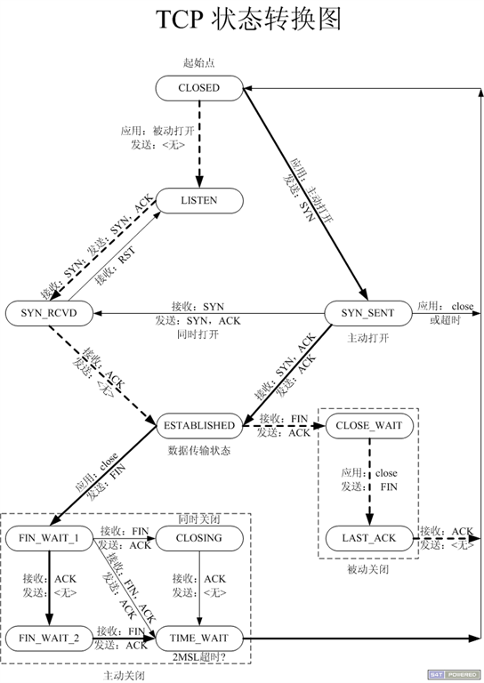
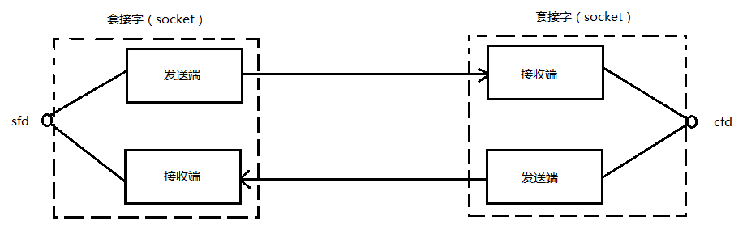
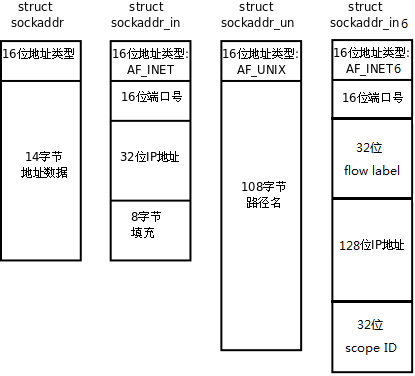
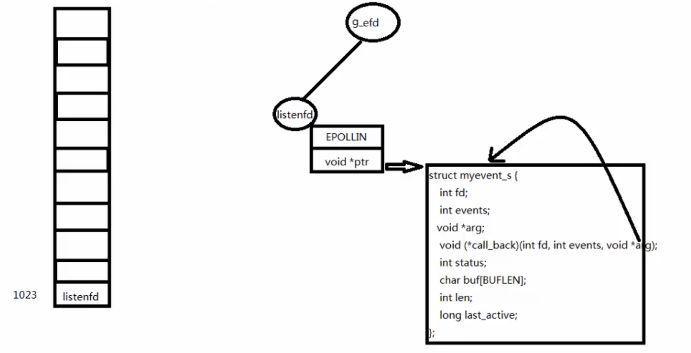

## 1. 基本概念

man 7 ip
nc localhost 6666 测试连接

### B/S、C/S

C/S优点：协议选择灵活、缓冲数据

C/S缺点：对用户安全构成威胁、开发工作量大

B/S优点：开发工作量小、可移植

B/S缺点：网络应用支持受限、缓存数据差、协议不灵活


### TCP通讯时序


**三次握手**

1. 客户端发送一个带SYN标志的TCP报文到服务器。这是三次握手过程中的段1。

   客户端发出段1，SYN位表示连接请求。序号是1000，这个序号在网络通讯中用作临时的地址，每发一个数据字节，这个序号要加1，这样在接收端可以根据序号排出数据包的正确顺序，也可以发现丢包的情况，另外，规定SYN位和FIN位也要占一个序号，这次虽然没发数据，但是由于发了SYN位，因此下次再发送应该用序号1001。mss表示最大段尺寸，如果一个段太大，封装成帧后超过了链路层的最大帧长度，就必须在IP层分片，为了避免这种情况，客户端声明自己的最大段尺寸，建议服务器端发来的段不要超过这个长度。

2. 服务器端回应客户端，是三次握手中的第2个报文段，同时带ACK标志和SYN标志。它表示对刚才客户端SYN的回应；同时又发送SYN给客户端，询问客户端是否准备好进行数据通讯。

   服务器发出段2，也带有SYN位，同时置ACK位表示确认，确认序号是1001，表示“我接收到序号1000及其以前所有的段，请你下次发送序号为1001的段”，也就是应答了客户端的连接请求，同时也给客户端发出一个连接请求，同时声明最大尺寸为1024。

3. 客户必须再次回应服务器端一个ACK报文，这是报文段3。

   客户端发出段3，对服务器的连接请求进行应答，确认序号是8001。在这个过程中，客户端和服务器分别给对方发了连接请求，也应答了对方的连接请求，其中服务器的请求和应答在一个段中发出，因此一共有三个段用于建立连接，称为“三方握手（three-way-handshake）”。在建立连接的同时，双方协商了一些信息，例如双方发送序号的初始值、最大段尺寸等。

在TCP通讯中，如果一方收到另一方发来的段，读出其中的目的端口号，发现本机并没有任何进程使用这个端口，就会应答一个包含RST位的段给另一方。例如，服务器并没有任何进程使用8080端口，我们却用telnet客户端去连接它，服务器收到客户端发来的SYN段就会应答一个RST段，客户端的telnet程序收到RST段后报告错误Connection refused。


**数据传输**

1. 客户端发出段4，包含从序号1001开始的20个字节数据。

2. 服务器发出段5，确认序号为1021，对序号为1001-1020的数据表示确认收到，同时请求发送序号1021开始的数据，服务器在应答的同时也向客户端发送从序号8001开始的10个字节数据，这称为piggyback。

3. 客户端发出段6，对服务器发来的序号为8001-8010的数据表示确认收到，请求发送序号8011开始的数据。

在数据传输过程中，ACK和确认序号是非常重要的，应用程序交给TCP协议发送的数据会暂存在TCP层的发送缓冲区中，发出数据包给对方之后，只有收到对方应答的ACK段才知道该数据包确实发到了对方，可以从发送缓冲区中释放掉了，如果因为网络故障丢失了数据包或者丢失了对方发回的ACK段，经过等待超时后TCP协议自动将发送缓冲区中的数据包重发。


**四次挥手**

由于TCP连接是全双工的，因此每个方向都必须单独进行关闭。这原则是当一方完成它的数据发送任务后就能发送一个FIN来终止这个方向的连接。收到一个 FIN只意味着这一方向上没有数据流动，一个TCP连接在收到一个FIN后仍能发送数据。首先进行关闭的一方将执行主动关闭，而另一方执行被动关闭。

1. 客户端发出段7，FIN位表示关闭连接的请求。

2. 服务器发出段8，应答客户端的关闭连接请求。

3. 服务器发出段9，其中也包含FIN位，向客户端发送关闭连接请求。

4. 客户端发出段10，应答服务器的关闭连接请求。

建立连接的过程是三方握手，而关闭连接通常需要4个段，服务器的应答和关闭连接请求通常不合并在一个段中，因为有连接半关闭的情况，这种情况下客户端关闭连接之后就不能再发送数据给服务器了，但是服务器还可以发送数据给客户端，直到服务器也关闭连接为止。


### TCP状态转换图

粗线是主动发起的动作，虚线是被动处理的动作，细线是同时进行的动作。




**CLOSED**：表示初始状态。
**LISTEN**：该状态表示服务器端的某个SOCKET处于监听状态，可以接受连接。
**SYN_SENT**：这个状态与SYN_RCVD遥相呼应，当客户端SOCKET执行CONNECT连接时，它首先发送SYN报文，随即进入到了SYN_SENT状态，并等待服务端的发送三次握手中的第2个报文。SYN_SENT状态表示客户端已发送SYN报文。
**SYN_RCVD**: 该状态表示接收到SYN报文，在正常情况下，这个状态是服务器端的SOCKET在建立TCP连接时的三次握手会话过程中的一个中间状态，很短暂。此种状态时，当收到客户端的ACK报文后，会进入到ESTABLISHED状态。
**ESTABLISHED**：表示连接已经建立。
**FIN_WAIT_1**:  FIN_WAIT_1和FIN_WAIT_2状态的真正含义都是表示等待对方的FIN报文。区别是：
**FIN_WAIT_1**状态是当socket在ESTABLISHED状态时，想主动关闭连接，向对方发送了FIN报文，此时该socket进入到FIN_WAIT_1状态。
**FIN_WAIT_2**状态是当对方回应ACK后，该socket进入到FIN_WAIT_2状态，正常情况下，对方应马上回应ACK报文，所以FIN_WAIT_1状态一般较难见到，而FIN_WAIT_2状态可用netstat看到。
**FIN_WAIT_2**：主动关闭链接的一方，发出FIN收到ACK以后进入该状态。称之为半连接或半关闭状态。该状态下的socket只能接收数据，不能发。
**TIME_WAIT**: 表示收到了对方的FIN报文，并发送出了ACK报文，等2MSL后即可回到CLOSED可用状态。如果**FIN_WAIT_1**状态下，收到对方同时带 FIN标志和ACK标志的报文时，可以直接进入到TIME_WAIT状态，而无须经过FIN_WAIT_2状态。
**CLOSING**: 这种状态较特殊，属于一种较罕见的状态。正常情况下，当你发送FIN报文后，按理来说是应该先收到（或同时收到）对方的 ACK报文，再收到对方的FIN报文。但是CLOSING状态表示你发送FIN报文后，并没有收到对方的ACK报文，反而却也收到了对方的FIN报文。什么情况下会出现此种情况呢？如果双方几乎在同时close一个SOCKET的话，那么就出现了双方同时发送FIN报文的情况，也即会出现CLOSING状态，表示双方都正在关闭SOCKET连接。
**CLOSE_WAIT**: 此种状态表示在等待关闭。当对方关闭一个SOCKET后发送FIN报文给自己，系统会回应一个ACK报文给对方，此时则进入到CLOSE_WAIT状态。接下来呢，察看是否还有数据发送给对方，如果没有可以 close这个SOCKET，发送FIN报文给对方，即关闭连接。所以在CLOSE_WAIT状态下，需要关闭连接。
LAST_ACK: 该状态是被动关闭一方在发送FIN报文后，最后等待对方的ACK报文。当收到ACK报文后，即可以进入到CLOSED可用状态。


### 半关闭

当TCP链接中A发送FIN请求关闭，B端回应ACK后（A端进入FIN_WAIT_2状态），B没有立即发送FIN给A时，A方处在半链接状态，此时A可以接收B发送的数据，但是A已不能再向B发送数据。

从程序的角度，可以使用API来控制实现半连接状态。

```c
#include <sys/socket.h>
int shutdown(int sockfd, int how);
sockfd: 需要关闭的socket的描述符
how:	允许为shutdown操作选择以下几种方式:
SHUT_RD(0):		关闭sockfd上的读功能，此选项将不允许sockfd进行读操作。该套接字不再接受数据，任何当前在套接字接受缓冲区的数据将被无声的丢弃掉。
SHUT_WR(1):		关闭sockfd的写功能，此选项将不允许sockfd进行写操作。进程不能在对此套接字发出写操作。
SHUT_RDWR(2):	关闭sockfd的读写功能。相当于调用shutdown两次：首先是以SHUT_RD,然后以SHUT_WR。
```

使用close中止一个连接，但它只是减少描述符的引用计数，并不直接关闭连接，只有当描述符的引用计数为0时才关闭连接。
shutdown不考虑描述符的引用计数，直接关闭描述符。也可选择中止一个方向的连接，只中止读或只中止写。
注意:
如果有多个进程共享一个套接字，close每被调用一次，计数减1，直到计数为0时，也就是所用进程都调用了close，套接字将被释放。 
在多进程中如果一个进程调用了shutdown(sfd, SHUT_RDWR)后，其它的进程将无法进行通信。但，如果一个进程close(sfd)将不会影响到其它进程。


### NAT映射

实现局域网ip到公网ip的转换。NAT不仅能解决IP地址不足的问题，而且还能够有效地避免来自网络外部的攻击，隐藏并保护网络内部的计算机。


### 打洞

内网ip和内网ip通信，路由器会过滤掉陌生的ip，所以直接通过nat映射后的公网ip无法进行通讯，这时需要借助第三方的服务器，由服务器建立一条通路，进行通讯。例如腾讯的服务器，用户之间发起视频聊天时，首先每个用户所在的路由对腾讯的服务器都不陌生，腾讯的服务器负责打洞，为用户创造一个通路进行视频数据的传输。


### 心跳包和乒乓包

测试服务端和客户端是否保持连接，另外还有设置TCP属性，


## 2. Socket编程

### 套接字

Socket本身有“插座”的意思，在Linux环境下，用于表示进程间网络通信的特殊文件类型。本质为内核借助缓冲区形成的伪文件。

既然是文件，那么理所当然的，我们可以使用文件描述符引用套接字。与管道类似的，Linux系统将其封装成文件的目的是为了统一接口，使得读写套接字和读写文件的操作一致。区别是管道主要应用于本地进程间通信，而套接字多应用于网络进程间数据的传递。

套接字的内核实现较为复杂，不宜在学习初期深入学习。

在TCP/IP协议中，“IP地址+TCP或UDP端口号”唯一标识网络通讯中的一个进程。“IP地址+端口号”就对应一个socket。欲建立连接的两个进程各自有一个socket来标识，那么这两个socket组成的socket pair就唯一标识一个连接。因此可以用Socket来描述网络连接的一对一关系。




### 网络字节序

```cpp
#include <arpa/inet.h>

uint32_t htonl(uint32_t hostlong);
uint16_t htons(uint16_t hostshort);
uint32_t ntohl(uint32_t netlong);
uint16_t ntohs(uint16_t netshort);
```

如果主机是小端字节序，这些函数将参数做相应的大小端转换然后返回，如果主机是大端字节序，这些函数不做转换，将参数原封不动地返回。


### ip地址转换

```c
#include <arpa/inet.h>
// ip —> 网络字节序
int inet_pton(int af, const char *src, void *dst); 
// 网络字节序 -> ip
const char *inet_ntop(int af, const void *src, char *dst, socklen_t size); 
```


### sockaddr数据结构

strcut sockaddr 很多网络编程函数诞生早于IPv4协议，那时候都使用的是sockaddr结构体,为了向前兼容，现在sockaddr退化成了（void *）的作用，传递一个地址给函数，至于这个函数是sockaddr_in还是sockaddr_in6，由地址族确定，然后函数内部再**强制类型转化**为所需的地址类型。



```c
struct sockaddr_in servaddr;
bind(listen_fd, (struct sockaddr *)&servaddr, sizeof(servaddr));
accept();
connect();
```

```c
struct sockaddr {
    sa_family_t sa_family;
    char        sa_data[14];
}

struct sockaddr_in {
    sa_family_t    sin_family; /* address family: AF_INET */
    in_port_t      sin_port;   /* port in network byte order */
    struct in_addr sin_addr;   /* internet address */
};

/* Internet address. */
struct in_addr {
	uint32_t       s_addr;     /* address in network byte order */
};
```


### socket

```c
#include <sys/types.h>          
#include <sys/socket.h>

int socket(int domain, int type, int protocol);
```

| domain   |          | type        |      | protocol |          |
| -------- | -------- | ----------- | ---- | -------- | -------- |
| AF_INET  | IPv4     | SOCK_STREAM | TCP  | 0        | 默认协议 |
| AF_INET6 | IPv6     | SOCK_DGRAM  | UDP  |          |          |
| AF_UNIX  | 本地协议 |             |      |          |          |

成功返回指向新创建的socket的文件描述符，失败返回-1，并设置errno。

常见的错误码：

```cpp
#define	EACCES		13	/* Permission denied */
#define	EINVAL		22	/* Invalid argument */
#define	EMFILE		24	/* Too many open files */
#define	ENFILE		23	/* File table overflow */
#define	ENOBUFS		105	/* No buffer space available */ 
#define	EPROTONOSUPPORT	93	/* Protocol not supported */
#define	EAGAIN		11	/* Try again */ 
```


### bind

bind绑定本地ip和端口。

```c
#include <sys/types.h>          
#include <sys/socket.h>

int bind(int sockfd, const struct sockaddr *addr, socklen_t addrlen);
```

成功返回0，失败返回-1，并设置errno。


### listen

listen监听端口，最多有backlog个客户端处于待连接状态，其他的等待。

```c
#include <sys/types.h>       
#include <sys/socket.h>

int listen(int sockfd, int backlog);
```

成功返回0，失败返回-1，并设置errno。


### accept

accept阻塞等待连接，addr传出客户端的sockaddr信息，addrlen是传入传出参数，返回addr的长度。

```c
#include <sys/types.h>    
#include <sys/socket.h>

int accept(int sockfd, struct sockaddr *addr, socklen_t *addrlen);
```

成功返回服务器创建的套接字，失败返回-1，并设置errno。


### connect

connect连接一个套接字。

```c
#include <sys/types.h>          /* See NOTES */
#include <sys/socket.h>

int connect(int sockfd, const struct sockaddr *addr, socklen_t addrlen);
```

成功返回0，失败返回-1，并设置errno。


### shutdown

如果有多个文件描述符指向同一个socket，close只会关闭指定的那个fd，shutdown会关闭所有的。

```c
#include <sys/socket.h>

int shutdown(int sockfd, int how);
```

| how          |                          |
| ------------ | ------------------------ |
| SHUT_RD(0)   | 关闭读功能               |
| SHUT_WR(1)   | 关闭写功能               |
| SHUT_RDWR(2) | 关闭读写功能（两次调用） |


### 客户端服务器

服务器等待连接，将字符串转为大写发送给客户端。

```c
#include <stdio.h>
#include <stdlib.h>
#include <unistd.h>
#include <ctype.h>
#include <sys/socket.h>
#include <arpa/inet.h>
#include <strings.h>
#define SERV_PORT 6666
int main() {

	int lfd, cfd, ret;
	struct sockaddr_in serv_addr, clie_addr;
	socklen_t clie_addr_len;
	char buf[BUFSIZ], clie_IP[BUFSIZ];
	int n, i;
	// 创建套接字
	lfd = socket(AF_INET, SOCK_STREAM, 0);
	if (lfd == -1) {
		perror("socket error");
		exit(1);
	}

	// 端口复用
	int opt = 1;
	setsockopt(lfd, SOCK_STREAM, SO_REUSEADDR, &opt, sizeof(opt));

	// 设置协议，ip和端口
	bzero(&serv_addr, sizeof(serv_addr));
	serv_addr.sin_family = AF_INET;
	serv_addr.sin_port = htons(SERV_PORT);
	serv_addr.sin_addr.s_addr = htonl(INADDR_ANY);
	// 绑定端口
	ret = bind(lfd, (struct sockaddr *)&serv_addr, sizeof(serv_addr));
	if (ret == -1) {
		perror("bind error");
		exit(1);
	}
	// 设置同时连接的数量
	ret = listen(lfd, 128);
	if (ret == -1) {
		perror("listen error");
		exit(1);
	}
	
	clie_addr_len = sizeof(clie_addr);
	// 阻塞等待客户端连接
	cfd = accept(lfd, (struct sockaddr *)&clie_addr, &clie_addr_len);
	if (cfd == -1) {
		perror("accept error");
		exit(1);
	}
	// 输出连接客户端的信息
	inet_ntop(AF_INET, &clie_addr.sin_addr.s_addr, clie_IP, sizeof(clie_IP));

	printf("client ip: %s, client port: %d\n", clie_IP, ntohs(clie_addr.sin_port));	
	while (1) {
		n = read(cfd, buf, sizeof(buf));
		for (i = 0; i < n; ++i) {
			buf[i] = toupper(buf[i]);
		}
		write(cfd, buf, n);
	}
	
	close(lfd);

	return 0;
}
```

客户端向服务器发送字符串, 接受服务端发送来的字符串
```c
#include <stdio.h>
#include <unistd.h>
#include <sys/socket.h>
#include <arpa/inet.h>
#include <stdlib.h>
#include <string.h>
#define SERV_PORT 6666
#define SERV_IP "127.0.0.1"

int main() {
	int cfd, n;
	struct sockaddr_in serv_addr;
	socklen_t serv_addr_len;
	serv_addr_len = sizeof(serv_addr);
	// 创建socket
	cfd = socket(AF_INET, SOCK_STREAM, 0);
		
	memset(&serv_addr, 0, sizeof(serv_addr));
	serv_addr.sin_family = AF_INET;
	serv_addr.sin_port = htons(SERV_PORT);
	inet_pton(AF_INET, SERV_IP, &serv_addr.sin_addr.s_addr);
	// 连接服务器	
	connect(cfd, (struct sockaddr *)&serv_addr, serv_addr_len);

	char buf[BUFSIZ];
	while (1) {
		fgets(buf, sizeof(buf), stdin);
		// 向服务端发送信息
		write(cfd, buf, strlen(buf));
		// 读取服务端发送的消息
		n = read(cfd, buf, sizeof(buf));
		write(STDOUT_FILENO, buf, n);
	}

	close(cfd);
	return 0;
}
```


### 错误处理

**read的返回值**：

1. \> 0

   - 字节数读满buf
   - 字节数小于buf

2. = 0

   - 文件数据读到末尾

   - 管道写端关闭
   - socket对端关闭

3. -1，异常

   - errno = EINTR，信号中断
   - errno = EAGAIN（EWOULDBLOCK）非阻塞读，没有数据可读。
   - 其他错误。


将系统调用封装起来，并封装Readn、Writen、my_read、readline。

```c
// wrap.h

#ifndef __WRAP_H_
#define __WRAP_H_

void perr_exit(const char *s);
int Accept(int fd, struct sockaddr *sa, socklen_t *salenptr);
int Bind(int fd, const struct sockaddr *sa, socklen_t salen);
int Connect(int fd, const struct sockaddr *sa, socklen_t salen);
int Listen(int fd, int backlog);
int Socket(int family, int type, int protocol);
ssize_t Read(int fd, void *ptr, size_t nbytes);
ssize_t Write(int fd, const void *ptr, size_t nbytes);
int Close(int fd);
ssize_t Readn(int fd, void *vptr, size_t n);
ssize_t Writen(int fd, const void *vptr, size_t n);
ssize_t my_read(int fd, char *ptr);
ssize_t Readline(int fd, void *vptr, size_t maxlen);

#endif
```


```c
// wrap.c

#include <stdlib.h>
#include <stdio.h>
#include <unistd.h>
#include <errno.h>
#include <sys/socket.h>

void perr_exit(const char *s)
{
	perror(s);
	exit(-1);
}

int Accept(int fd, struct sockaddr *sa, socklen_t *salenptr)
{
	int n;

again:
	if ((n = accept(fd, sa, salenptr)) < 0) {
		// accept慢速系统调用，可能被信号中断
		if ((errno == ECONNABORTED) || (errno == EINTR))
			goto again;
		else
			perr_exit("accept error");
	}
	return n;
}

int Bind(int fd, const struct sockaddr *sa, socklen_t salen)
{
    int n;

	if ((n = bind(fd, sa, salen)) < 0)
		perr_exit("bind error");

    return n;
}

int Connect(int fd, const struct sockaddr *sa, socklen_t salen)
{
    int n;
    n = connect(fd, sa, salen);
	if (n < 0) {
		perr_exit("connect error");
    }

    return n;
}

int Listen(int fd, int backlog)
{
    int n;

	if ((n = listen(fd, backlog)) < 0)
		perr_exit("listen error");

    return n;
}

int Socket(int family, int type, int protocol)
{
	int n;

	if ((n = socket(family, type, protocol)) < 0)
		perr_exit("socket error");

	return n;
}

ssize_t Read(int fd, void *ptr, size_t nbytes)
{
	ssize_t n;

again:
	if ( (n = read(fd, ptr, nbytes)) == -1) {
		if (errno == EINTR)
			goto again;
		else
			return -1;
	}

	return n;
}

ssize_t Write(int fd, const void *ptr, size_t nbytes)
{
	ssize_t n;

again:
	if ((n = write(fd, ptr, nbytes)) == -1) {
		if (errno == EINTR)
			goto again;
		else
			return -1;
	}
	return n;
}

int Close(int fd)
{
    int n;
	if ((n = close(fd)) == -1)
		perr_exit("close error");

    return n;
}

/*参三: 应该读取的字节数*/                          //socket 4096  readn(cfd, buf, 4096)   nleft = 4096-1500
ssize_t Readn(int fd, void *vptr, size_t n)
{
	size_t  nleft;              //usigned int 剩余未读取的字节数
	ssize_t nread;              //int 实际读到的字节数
	char   *ptr;

	ptr = vptr;
	nleft = n;                  //n 未读取字节数

	while (nleft > 0) {
		if ((nread = read(fd, ptr, nleft)) < 0) {
			if (errno == EINTR)
				nread = 0;
			else
				return -1;
		} else if (nread == 0)
			break;

		nleft -= nread;   //nleft = nleft - nread 
		ptr += nread;
	}
	return n - nleft;
}

ssize_t Writen(int fd, const void *vptr, size_t n)
{
	size_t nleft;
	ssize_t nwritten;
	const char *ptr;

	ptr = vptr;
	nleft = n;
	while (nleft > 0) {
		if ( (nwritten = write(fd, ptr, nleft)) <= 0) {
			if (nwritten < 0 && errno == EINTR)
				nwritten = 0;
			else
				return -1;
		}
		nleft -= nwritten;
		ptr += nwritten;
	}
	return n;
}

static ssize_t my_read(int fd, char *ptr)
{
	static int read_cnt;
	static char *read_ptr;
	static char read_buf[100];

	if (read_cnt <= 0) {
again:
		if ( (read_cnt = read(fd, read_buf, sizeof(read_buf))) < 0) {   //"hello\n"
			if (errno == EINTR)
				goto again;
			return -1;
		} else if (read_cnt == 0)
			return 0;

		read_ptr = read_buf;
	}
	read_cnt--;
	*ptr = *read_ptr++;

	return 1;
}

/*readline --- fgets*/    
//传出参数 vptr
ssize_t Readline(int fd, void *vptr, size_t maxlen)
{
	ssize_t n, rc;
	char    c, *ptr;
	ptr = vptr;

	for (n = 1; n < maxlen; n++) {
		if ((rc = my_read(fd, &c)) == 1) {   //ptr[] = hello\n
			*ptr++ = c;
			if (c == '\n')
				break;
		} else if (rc == 0) {
			*ptr = 0;
			return n-1;
		} else
			return -1;
	}
	*ptr = 0;

	return n;
}
```


## 3. 高并发服务器

### 多进程并发

每次新连接，创建一个子进程处理后续请求。

当子进程任务完成之后，需要对子进程进行收尸

- 创建子进程负责接受新连接，父进程负责回收子进程
- 父进程注册信号捕捉函数，利用信号来回收子进程

```c
#include <stdio.h>
#include <unistd.h>
#include <stdlib.h>
#include <arpa/inet.h>
#include <strings.h>
#include <ctype.h>
#include "wrap.h"
#include <sys/wait.h>
#define SERV_PORT 8888

void wait_child(int signo) {
	while (waitpid(0, NULL, WNOHANG) > 0);
}

int main() {

	int lfd, cfd;
	struct sockaddr_in serv_addr, clie_addr;
	socklen_t clie_addr_len;
	pid_t pid;
	char buf[BUFSIZ], clie_IP[BUFSIZ];
	int n, i;
	lfd = Socket(AF_INET, SOCK_STREAM, 0);

	bzero(&serv_addr, sizeof(serv_addr));
	serv_addr.sin_family = AF_INET;
	serv_addr.sin_port = htons(SERV_PORT);
	serv_addr.sin_addr.s_addr = htonl(INADDR_ANY);
	// inet_pton(AF_INET, "192.168.1.101", &serv_addr.sin_addr.s_addr);
	Bind(lfd, (struct scockaddr *)&serv_addr, sizeof(serv_addr));

	Listen(lfd, 128);

	while (1) {
		clie_addr_len = sizeof(clie_addr);
		cfd = Accept(lfd, (struct sockaddr *)&clie_addr, &clie_addr_len);
		
		printf("client IP: %s, client port: %d\n", 
		inet_ntop(AF_INET, &clie_addr.sin_addr.s_addr, clie_IP, sizeof(clie_IP)),
		ntohs(clie_addr.sin_port));
		pid = fork();
		if (pid < 0) {
			perror("fork error");
			exit(1);
		}else if (pid == 0) { // 子进程
			close(lfd);
			break;
		}else {
			close(cfd);	
			signal(SIGCHLD, wait_child);
		}
	}
	if (pid == 0) {
		while (1) {
			n = Read(cfd, buf, sizeof(buf));
			if (n == 0) {
				return 0;
			}else if(n < 0) {
				perror("read error");
				exit(1);
			}else {
				for (i = 0; i < n; ++i) {
					buf[i] = toupper(buf[i]);
				}
				write(cfd, buf, n);
			}
		}
	}

	return 0;
}
```

### 多线程并发

```c
#include <stdio.h>
#include <unistd.h>
#include <stdlib.h>
#include <arpa/inet.h>
#include <strings.h>
#include <ctype.h>
#include "wrap.h"
#include <sys/wait.h>
#include <pthread.h>
#define SERV_PORT 8888

struct s_info{
	struct sockaddr_in addr;
	int cfd;
};

void *do_work(void *arg) {
	int n, i;
	struct s_info *ts = (struct s_info*) arg;
	char buf[BUFSIZ], clie_IP[BUFSIZ];
	while (1) {
		n = Read((*ts).cfd, buf, sizeof(buf));
		if (n == 0) {
			return 0;
		}else if(n < 0) {
			perror("read error");
			exit(1);
		}else {
			for (i = 0; i < n; ++i) {
				buf[i] = toupper(buf[i]);
			}
			printf("client IP: %s, client port: %d\n", 
			inet_ntop(AF_INET, &(*ts).addr.sin_addr.s_addr, clie_IP, sizeof(clie_IP)),
			ntohs((*ts).addr.sin_port));
			
			write(STDOUT_FILENO, buf, n);
			write((*ts).cfd, buf, n);
		}
	}
}

int main() {
	int lfd, cfd;
	struct sockaddr_in serv_addr, clie_addr;
	socklen_t clie_addr_len;
	lfd = Socket(AF_INET, SOCK_STREAM, 0);
	pthread_t tid;
	struct s_info ts[256];
	int i = 0;

	bzero(&serv_addr, sizeof(serv_addr));
	serv_addr.sin_family = AF_INET;
	serv_addr.sin_port = htons(SERV_PORT);
	serv_addr.sin_addr.s_addr = htonl(INADDR_ANY);
	// inet_pton(AF_INET, "192.168.1.101", &serv_addr.sin_addr.s_addr);
	Bind(lfd, (struct scockaddr *)&serv_addr, sizeof(serv_addr));

	Listen(lfd, 128);
	
	while (1) {
		clie_addr_len = sizeof(clie_addr);
		cfd = Accept(lfd, (struct sockaddr *)&clie_addr, &clie_addr_len);
		ts[i].addr = clie_addr;
		ts[i].cfd = cfd;
		
		pthread_create(&tid, NULL, do_work, (void*)&ts[i]);
		pthread_detach(tid);
		++i;
	}
	return 0;
}
```


## 4. IO多路复用

由内核负责监听连接、socket的读写时间。

### select

1. select能监听的文件描述符个数受限于FD_SETSIZE,一般为1024，单纯改变进程打开的文件描述符个数并不能改变select监听文件个数

2. 解决1024以下客户端时使用select是很合适的，但如果链接客户端过多，select采用的是轮询模型，会大大降低服务器响应效率，不应在select上投入更多精力

```c
#include <sys/select.h>
/* According to earlier standards */
#include <sys/time.h>
#include <sys/types.h>
#include <unistd.h>

int select(int nfds, fd_set *readfds, fd_set *writefds, fd_set *exceptfds, struct timeval *timeout);
nfds:		监控的文件描述符集里最大文件描述符加1，因为此参数会告诉内核检测前多少个文件描述符的状态
readfds：	监控有读数据到达文件描述符集合，传入传出参数
writefds：	监控写数据到达文件描述符集合，传入传出参数
exceptfds：	监控异常发生达文件描述符集合,如带外数据到达异常，传入传出参数
timeout：	定时阻塞监控时间，3种情况
    1.NULL，永远等下去
    2.设置timeval，等待固定时间
    3.设置timeval里时间均为0，检查描述字后立即返回，轮询
struct timeval {
    long tv_sec; /* seconds */
    long tv_usec; /* microseconds */
};

int  FD_ISSET(int fd, fd_set *set); // 1
void FD_CLR(int fd, fd_set *set);
void FD_SET(int fd, fd_set *set);
void FD_ZERO(fd_set *set);
```

成功返回所监听集合中，满足条件的总数。

返回0表示，超时没有发生任何时间。

错误返回-1，并设置errno。


```c
#include <stdio.h>
#include <stdlib.h>
#include <unistd.h>
#include <string.h>
#include <arpa/inet.h>
#include <ctype.h>
#include "wrap.h"

#define SERV_PORT 6666

int main() {
	int i, j, n, maxi;
	// 自定义数组client，防止遍历1024个文件描述符
	int nread, client[FD_SETSIZE];
	int maxfd, listenfd, connfd, sockfd;
	// define INET_ADDRSTRLEN 16, IPV4在char表示的最大的长度
	char buf[BUFSIZ], str[INET_ADDRSTRLEN];
	struct sockaddr_in clie_addr, serv_addr;
	socklen_t clie_addr_len;
	fd_set rset, allset;

	listenfd = Socket(AF_INET, SOCK_STREAM, 0);

	bzero(&serv_addr, sizeof(serv_addr));
	serv_addr.sin_family = AF_INET;
	serv_addr.sin_addr.s_addr = htonl(INADDR_ANY);
	serv_addr.sin_port = htons(SERV_PORT);

	Bind(listenfd, (struct sockaddr *)&serv_addr, sizeof(serv_addr));
	Listen(listenfd, 128);

	maxfd = listenfd;

	maxi = -1;
	for (i = 0; i < FD_SETSIZE; ++i) {
		client[i] = -1;
	}
	FD_ZERO(&allset);
	FD_SET(listenfd, &allset);

	while (1) {
		rset = allset;
		// 最大文件描述符+1，读文件描述符，写文件描述符， 异常文件描述符，等待时间
		nread = select(maxfd+1, &rset, NULL, NULL, NULL);
		if (nread < 0) {
			perror("select error");
			exit(1);
		}
		// 新的连接
		if (FD_ISSET(listenfd, &rset)) {
			clie_addr_len = sizeof(clie_addr);
			// Accept 不会阻塞
			connfd = Accept(listenfd, (struct sockaddr *)&clie_addr, &clie_addr_len);
			printf("receive from %s at port %d\n", 
					inet_ntop(AF_INET, &clie_addr.sin_addr, str, sizeof(str)),
					ntohs(clie_addr.sin_port));
			// 把Accept返回的文件描述符保存到clientp[]中
			for (i = 0; i < FD_SETSIZE; ++i) {
				if (client[i] < 0) {
					client[i] = connfd;
					break;
				}
			}
			if (i == FD_SETSIZE) {
				fputs("too many clients\n", stderr);
				exit(1);
			}
			FD_SET(connfd, &allset);
			if (connfd > maxfd) maxfd = connfd;
			if (i > maxi) maxi = i;
			if (--nread == 0) continue;
		}
		for (i = 0; i <= maxi; ++i) {
			if ((sockfd = client[i]) < 0) continue;
			if (FD_ISSET(sockfd, &rset)) {
				if ((n = Read(sockfd, buf, sizeof(buf))) == 0) { // 客户端关闭
					close(sockfd);
					FD_CLR(sockfd, &allset);
					client[i] = -1;
				}else if (n > 0) {
					for (j = 0; j < n; ++j) {
						buf[j] = toupper(buf[j]);
					}
					// sleep(5);
					Writen(sockfd, buf, n);
				}
				if (--nread == 0) break;
			}
		}
	}
	Close(listenfd);
	return 0;
}
```
### poll

```bash
# 查看进程可以打开socket描述符的上限
cat /proc/sys/fs/file-max 
# 修改上限值
vim /etc/security/limits.conf 
# 尾部添加soft软限制，hard硬限制
* soft nofile 65536
* hard nofile 100000
```

如果不再监控某个文件描述符时，可以把pollfd中，fd设置为-1，poll不再监控此pollfd，下次返回时，把revents设置为0。

```c
#include <poll.h>

int poll(struct pollfd *fds, nfds_t nfds, int timeout);

struct pollfd {
    int   fd;         /* file descriptor */
    short events;     /* requested events */
    short revents;    /* returned events */
};

POLLIN				普通或带外优先数据可读,即POLLRDNORM | POLLRDBAND
	POLLRDNORM		数据可读
	POLLRDBAND		优先级带数据可读
	POLLPRI 		高优先级可读数据
    
POLLOUT				普通或带外数据可写
	POLLWRNORM		数据可写
	POLLWRBAND		优先级带数据可写
    
POLLERR 			发生错误
	POLLHUP 		发生挂起
	POLLNVAL 		描述字不是一个打开的文件
    
    
nfds 			监控数组中有多少文件描述符需要被监控

timeout 		毫秒级等待
    -1：阻塞等，	#define INFTIM -1 				Linux中没有定义此宏
    0：立即返回，不阻塞进程
    >0：等待指定毫秒数，如当前系统时间精度不够毫秒，向上取值
```

返回0，超时没有发生事件。

失败返回-1，并设置errno。

成功返回


```c
#include <stdio.h>
#include <stdlib.h>
#include <unistd.h>
#include <arpa/inet.h>
#include <ctype.h>
#include <sys/socket.h>
#include <sys/types.h>
#include <poll.h>
#include <string.h>
#include <netinet/in.h>
#include <errno.h>
#include "wrap.h"
#define SERV_PORT 6666
#define MAXLINE 80
#define OPEN_MAX 1024
int main() {
	int i, j, maxi, listenfd, connfd, sockfd;
	int nready;
	ssize_t n;
	
	char buf[BUFSIZ], str[INET_ADDRSTRLEN];
	socklen_t clien;
	struct pollfd client[OPEN_MAX];
	struct sockaddr_in servaddr, clieaddr;

	listenfd = Socket(AF_INET, SOCK_STREAM, 0);
	// 设置端口复用
	int opt = 1;
	setsockopt(listenfd, SOL_SOCKET, SO_REUSEADDR, &opt, sizeof(opt));

	bzero(&servaddr, sizeof(servaddr));
	servaddr.sin_family = AF_INET;
	servaddr.sin_addr.s_addr = htonl(INADDR_ANY);
	servaddr.sin_port = htons(SERV_PORT);

	Bind(listenfd, (struct sockaddr *)&servaddr, sizeof(servaddr));
	Listen(listenfd, 128);

	client[0].fd = listenfd;
	client[0].events = POLLIN;
	for (i = 1; i < OPEN_MAX; ++i) {
		client[i].fd = -1;
	}
	maxi = 0;
	while (1) {
		// 阻塞监听是否有新的链接请求
		nready = poll(client, maxi+1, -1);
		if (client[0].revents & POLLIN) { // 连接请求
			clien = sizeof(clieaddr);
			connfd = Accept(listenfd, (struct sockaddr *)&clieaddr, &clien);
			printf("received from %s at PORT %d\n",
					inet_ntop(AF_INET, &clieaddr.sin_addr, str, sizeof(str)),
					ntohs(clieaddr.sin_port));
			// 把Accept返回的connfd，放到client[]中
			for (i = 1; i < OPEN_MAX; ++i) {
				if (client[i].fd < 0) {
					client[i].fd = connfd;
					break;
				}
			}
			
			if (i == OPEN_MAX) {
				perror("too many clients");
				exit(1);
			}
			// 监听新连接的客户端的读事件
			client[i].events = POLLIN;
			// 更新client[]中的最大下标
			if (i > maxi) maxi = i;
			// 判断是否有其他事件
			if (--nready == 0) continue;
		}

		// 找到对应的客户端，处理请求
		for (i = 1; i <= maxi; ++i) {
			if ((sockfd = client[i].fd) < 0) continue;
			if (client[i].revents & POLLIN) { // 读事件
				if ((n = Read(sockfd, buf, MAXLINE)) < 0) {
					if (errno == ECONNRESET) { // 重置连接
						printf("client[%d] aborted connection\n", i);
						Close(sockfd);
						client[i].fd = -1;
					}else {
						perror("read error");
						exit(1);
					}
				}else if (n == 0) {
					printf("client[%d] closed connection\n", i);
					Close(sockfd);
					client[i].fd = -1;
				}else {
					for (j = 0; j < n; ++j) {
						buf[j] = toupper(buf[j]);
					}
					Writen(sockfd, buf, n);
				}
				if (--nready == 0) break;
			}
		}
	}
	return 0;
}
```
### epoll

```c
#include <sys/epoll.h>

int epoll_create(int size); // 返回一个文件描述符，指向一个红黑树的树根。
```

```c
#include <sys/epoll.h>

int epoll_ctl(int epfd, int op, int fd, struct epoll_event *event);
op:
	EPOLL_CTL_ADD (注册新的fd到epfd)，
    EPOLL_CTL_MOD (修改已经注册的fd的监听事件)，
    EPOLL_CTL_DEL (从epfd删除一个fd)；
        
typedef union epoll_data {
    void        *ptr;
    int          fd;
    uint32_t     u32;
    uint64_t     u64;
} epoll_data_t;
        
struct epoll_event {
	__uint32_t events; /* Epoll events */
    epoll_data_t data; /* User data variable */
};     

EPOLLIN ：	表示对应的文件描述符可以读（包括对端SOCKET正常关闭）
EPOLLOUT：	表示对应的文件描述符可以写
EPOLLPRI：	表示对应的文件描述符有紧急的数据可读（这里应该表示有带外数据到来）
EPOLLERR：	表示对应的文件描述符发生错误
EPOLLHUP：	表示对应的文件描述符被挂断；
EPOLLET： 	将EPOLL设为边缘触发(Edge Triggered)模式，这是相对于水平触发(Level Triggered)而言的
EPOLLONESHOT：只监听一次事件，当监听完这次事件之后，如果还需要继续监听这个socket的话，需要再次把这个socket加入到EPOLL队列里
```

```c
#include <sys/epoll.h>

int epoll_wait(int epfd, struct epoll_event *events, int maxevents, int timeout);
events：		用来存内核得到事件的集合，
maxevents：	告之内核这个events有多大，这个maxevents的值不能大于创建epoll_create()时的size，
timeout：	是超时时间
-1：	阻塞
0：	立即返回，非阻塞
>0：	指定毫秒
返回值：	成功返回有多少文件描述符就绪，时间到返回0，出错返回-1
```


```c
#include <stdio.h>
#include <stdlib.h>
#include <unistd.h>
#include <arpa/inet.h>
#include <ctype.h>
#include <sys/epoll.h>
#include <string.h>
#include <netinet/in.h>
#include <errno.h>
#include "wrap.h"
#define SERV_PORT 6666
#define MAXLINE 8000
#define OPEN_MAX 5000
int main() {
	int i, j, listenfd, connfd, sockfd;
	int n;
	ssize_t nready, efd, res;
	char buf[MAXLINE], str[INET_ADDRSTRLEN];
	socklen_t clilen;
	struct sockaddr_in cliaddr, servaddr;
	struct epoll_event tep, ep[OPEN_MAX];

	listenfd = Socket(AF_INET, SOCK_STREAM, 0);
	int opt = 1;
	setsockopt(listenfd, SOL_SOCKET, SO_REUSEADDR, &opt, sizeof(opt));

	bzero(&servaddr, sizeof(servaddr));
	servaddr.sin_family = AF_INET;
	servaddr.sin_addr.s_addr = htonl(INADDR_ANY);
	servaddr.sin_port = htons(SERV_PORT);

	Bind(listenfd, (struct sockaddr *)&servaddr, sizeof(servaddr));
	Listen(listenfd, 128);
	// 创建epoll模型，edf指向红黑树的根节点
	efd = epoll_create(OPEN_MAX);
	if (efd == -1) {
		perror("epoll create");
		exit(1);
	}
	
    // listenfd为监听的读事件
	tep.events = EPOLLIN;
	tep.data.fd = listenfd;
    
	// 将listenfd插到epoll树上
	res = epoll_ctl(efd, EPOLL_CTL_ADD, listenfd, &tep);
	if (res == -1) {
		perror("epoll_ctl error");
		exit(1);
	}
	
    while (1) {
		nready = epoll_wait(efd, ep, OPEN_MAX, -1);
		if (nready == -1) {
			perror("epoll_wait error");
			exit(1);
		}
		for (i = 0; i < nready; ++i) {
			if (!(ep[i].events & EPOLLIN)) continue;
			if (ep[i].data.fd == listenfd) { // 新连接
				clilen = sizeof(cliaddr);
				connfd = Accept(listenfd, (struct sockaddr *)&cliaddr, &clilen);
				printf("reveived from %s at port %d\n", 
						inet_ntop(AF_INET, &cliaddr.sin_addr, str, sizeof(str)),
						ntohs(cliaddr.sin_port));
				tep.events = EPOLLIN;
				tep.data.fd = connfd;
				res = epoll_ctl(efd, EPOLL_CTL_ADD, connfd, &tep);
				if (res == -1) {
					perror("epoll_ctl error");
					exit(1);
				}
			}else { // 其他读事件
				sockfd = ep[i].data.fd;
				n = Read(sockfd, buf, MAXLINE);
				if (n == 0) { // 对端关闭
					res = epoll_ctl(efd, EPOLL_CTL_DEL, sockfd, NULL);
					if (res == -1) {
						perror("epoll_ctl error");
						exit(1);
					} 
					printf("client[%d] close connection\n", sockfd);
					Close(sockfd);
				} else if (n > 0) {
					for (j = 0; j < n; ++j) {
						buf[j] = toupper(buf[j]);
					}
					Writen(sockfd, buf, n);
					Writen(STDOUT_FILENO, buf, n);
				}else if (n < 0) {
					perror("read error");
					res = epoll_ctl(efd, EPOLL_CTL_DEL, sockfd, NULL);
					if (res == -1) {
						perror("epoll_ctl DEL error");
						exit(1);
					}
					Close(sockfd);
				}
			}
		}
	}

	return 0;
}
```
### epoll LT/ET

Edge Triggered (ET) 边缘触发只有数据到来才触发，不管缓存区中是否还有数据。

Level Triggered (LT) 水平触发只要有数据都会触发。

epoll适用于各种文件，这里使用管道进行举例。

```c
#include <stdio.h>
#include <stdlib.h>
#include <sys/epoll.h>
#include <errno.h>
#include <unistd.h>
#define MAXLINE 10

int main() {
	
	int efd, i;
	int pfd[2];
	pid_t pid;
	char buf[MAXLINE], ch = 'a';

	pipe(pfd);
	pid = fork();
	// 子写，父读
	if (pid == 0) {
		close(pfd[0]);
		while (1) {
			for (i = 0; i < MAXLINE/2; ++i) {
				buf[i] = ch;
			}
			buf[i-1] = '\n';
			ch++;
			for (; i < MAXLINE; ++i) {
				buf[i] = ch; 
			}
			buf[i-1] = '\n';
			ch++;
			write(pfd[1], buf, sizeof(buf));
			sleep(3);
		}
		close(pfd[1]);
	} else if(pid > 0) {
		struct epoll_event event;
		struct epoll_event resevent[10];
		int res, len;

		close(pfd[1]);
		efd = epoll_create(10);

		event.events = EPOLLIN | EPOLLET; // ET边沿触发
		// event.events = EPOLLIN; // LT水平触发(默认)
		event.data.fd = pfd[0];
		res = epoll_ctl(efd, EPOLL_CTL_ADD, pfd[0], &event);
		if (res == -1) {
			perror("epoll_ctl error");
			exit(1);
		}

		while (1) {
			res = epoll_wait(efd, resevent, 10, -1);
			printf("res %d\n", res);
			if (resevent[0].data.fd == pfd[0]) {
				len = read(pfd[0], buf, MAXLINE/2);
				write(STDOUT_FILENO, buf, len);
			}
		}
	}
	
	return 0;
}
```

### epoll 非阻塞IO

如果需要一次读取所需的字节数，但是缓冲区里没有足够的，那么read就会阻塞，所以需要将socket设置为非阻塞读。可以通过open、fcntl设置文件的非阻塞方式，socket已经打开了，所以只能用fcntl。

```c
#include <stdio.h>
#include <stdlib.h>
#include <arpa/inet.h>
#include <sys/epoll.h>
#include <sys/types.h>
#include <fcntl.h>
#include <unistd.h>
#include <sys/socket.h>
#include <string.h>

#define MAXLINE 10
#define SERV_PORT 6666
#define SERV_IP "127.0.0.1"

int main() {
	struct sockaddr_in servaddr, cliaddr;
	socklen_t cliaddr_len;
	int listenfd, connfd;
	char buf[BUFSIZ];
	char str[INET_ADDRSTRLEN];
	int efd, flag;
	
	listenfd = socket(AF_INET, SOCK_STREAM, 0);

	bzero(&servaddr, sizeof(servaddr));
	servaddr.sin_family = AF_INET;
	inet_pton(AF_INET, SERV_IP, &servaddr.sin_addr.s_addr);
	// servaddr.sin_addr.s_addr = htonl(INADDR_ANY);
	servaddr.sin_port = htons(SERV_PORT);
	
	bind(listenfd, (struct sockaddr *)&servaddr, sizeof(servaddr));

	listen(listenfd, 20);

	cliaddr_len = sizeof(cliaddr);
	connfd = accept(listenfd, (struct sockaddr *)&cliaddr, &cliaddr_len);
	printf("receive from %s port %d\n", inet_ntop(AF_INET, &cliaddr.sin_family, str, sizeof(str)),
			ntohs(cliaddr.sin_port));

	// 修改connfd为非阻塞读
	flag = fcntl(connfd, F_GETFL);
	flag |= O_NONBLOCK;
	fcntl(connfd, F_SETFL, flag);

	struct epoll_event event;
	struct epoll_event resevent[10];
	int res, len;
	
    // 修改为非阻塞
	efd = epoll_create(10);
	event.events = EPOLLIN | EPOLLET;
	event.data.fd = connfd;

	epoll_ctl(efd, EPOLL_CTL_ADD, connfd, &event);
	while (1) {
		printf("epoll_wait...\n");
		res = epoll_wait(efd, resevent, 10, -1);
		printf("epoll_wait end res %d\n", res);

		if (resevent[0].data.fd == connfd) {
            // 循环读缓冲区
			while ((len = read(connfd, buf, MAXLINE/2)) > 0) {
				write(STDOUT_FILENO, buf, len);
			}
		}
	}

	return 0;
}
```


### epoll 反应堆模型

基于非阻塞I/O事件驱动（libevent的核心思想），epoll是在epoll_wait返回，处理完数据之后，直接写回客户端，但是客户端此时可能不能正常接收（滑动窗口机制），epoll反应堆就是在epoll_wait返回之后，read读完数据，将之前的节点删除，然后重新设置为监听cfd的可写事件，当处理完数据之后，同时epoll_wait的可写事件返回，再将数据写回客户端，这样就避免了一次write阻塞。

另外evt[i].data不再只传入一个fd，而是包括回调函数等，通过注册回调函数来处理epoll_wait返回的数据。

```c
struct myevent_s{
	int fd;
	int events;
	void *arg;											// 泛型指针
	void (*call_back)(int fd, int events, void *arg);	// 回调函数
	int status;											// 是否在监听 1->在红黑树上, 0->不在红黑树上
	char buf[BUFLEN];
	int len;
	long last_active;									// 记录每次加入红黑树上 g_efd 的时间值
};
```




```c
// epoll_loop.c
#include <stdio.h>
#include <stdlib.h>
#include <unistd.h>
#include <sys/socket.h>
#include <sys/epoll.h>
#include <arpa/inet.h>
#include <fcntl.h>
#include <errno.h>
#include <string.h>
#include <time.h>

#define MAX_EVENTS 1024
#define BUFLEN 4096
#define SERV_PORT 6666

void recvdata(int fd, int events, void *arg);
void senddata(int fd, int events, void *arg);

// 描述就绪文件描述符相关信息
struct myevent_s{
	int fd;
	int events;
	void *arg;											// 泛型指针
	void (*call_back)(int fd, int events, void *arg);	// 回调函数
	int status;											// 是否在监听 1->在红黑树上, 0->不在红黑树上
	char buf[BUFLEN];
	int len;
	long last_active;									// 记录每次加入红黑树上 g_efd 的时间值
};

int g_efd;											// 保存epoll_create返回的文件描述符
struct myevent_s g_events[MAX_EVENTS+1];			// 自定义结构体类型数组, 最后放listenfd

// 初始化myevent_s 成员变量
void eventset(struct myevent_s *ev, int fd, void (*call_back)(int, int, void *), void *arg) {
	ev->fd = fd;
	ev->call_back = call_back;
	ev->events = 0;
	ev->arg = arg;
	ev->status = 0;
	// memset(ev->buf, 0, sizeof(ev->buf));
	// ev->len = 0;
	ev->last_active = time(NULL);
	return;
}

// 向epoll监听的红黑树插入文件描述符
void eventadd(int efd, int events, struct myevent_s *ev) {
	struct epoll_event epv = {0, {0}};
	int op;
	epv.data.ptr = ev;
	epv.events = ev->events = events;

	if (ev->status == 1) {
		op = EPOLL_CTL_MOD;
	}else {
		op = EPOLL_CTL_ADD;
		ev->status = 1;
	}

	if (epoll_ctl(efd, op, ev->fd, &epv) < 0) {
		printf("event add faild [fd=%d], events[%d]\n", ev->fd, events);
	}else {
		printf("event add OK [fd=%d], op = %d, events[%0X]\n", ev->fd, op, events);
	}
	return;
}

// 从epoll监听的红黑树删除文件描述符
void eventdel(int efd, struct myevent_s *ev) {
	struct epoll_event epv = {0, {0}};
	if (ev->status != 1) return;
	epv.data.ptr = ev;
	ev->status = 0;
	epoll_ctl(efd, EPOLL_CTL_DEL, ev->fd, &epv);
	return;
}

// 当文件描述符就绪, epoll返回, 调用函数与客户端建立连接
void acceptconn(int lfd, int events, void *arg) {
	struct sockaddr_in cin;
	socklen_t len = sizeof(cin);
	int cfd, i;

	if ((cfd = accept(lfd, (struct sockaddr *)&cin, &len)) == -1) {
		if (errno != EAGAIN && errno != EINTR) {
			// 出错处理
		}
		printf("%s: accept, %s\n", __func__, strerror(errno));
		return;
	}

	do{
		// 在g_events中为cfd找个位置存
		for (i = 0; i < MAX_EVENTS; ++i) {
			if(g_events[i].status == 0) break;
			if (i == MAX_EVENTS) {
				printf("%s: max connect limit[%d]\n", __func__, MAX_EVENTS);
				break;
			}
		}
        
        // 查看是否为非阻塞读
		int flag = 0;
		if ((flag = fcntl(cfd, F_SETFL, O_NONBLOCK)) < 0) {
			printf("%s: fcntl nonblocking failed, %s\n", __func__, strerror(errno));
			break;
		}
        
		// 给cfd设置一个myevent_s的结构体, 回调函数设置为recvdata
		eventset(&g_events[i], cfd, recvdata, &g_events[i]);
		eventadd(g_efd, EPOLLIN, &g_events[i]);
	}while (0);
	
	printf("new connect [%s:%d][time:%ld], pos[%d]\n",
		inet_ntoa(cin.sin_addr), ntohs(cin.sin_port), g_events[i].last_active, i);
	return;
}

void recvdata(int fd, int events, void *arg) {
	struct myevent_s *ev = (struct myevent_s *) arg;
	int len;
	len = recv(fd, ev->buf, sizeof(ev->buf), 0);

	eventdel(g_efd, ev);				// 删除fd

	if (len > 0) {
		ev->len = len;
		ev->buf[len] = '\0';
		printf("C[%d]:%s\n", fd, ev->buf);

		// printf("send before set len = %d %s\n", ev->len, ev->buf);
		eventset(ev, fd, senddata, ev);	// 设置fd的回调函数为senddata
		// printf("send before add len = %d %s\n", ev->len, ev->buf);
		eventadd(g_efd, EPOLLOUT, ev);	// 将fd加到红黑树上, 监听写事件
	}else if(len == 0) {
		close(ev->fd);
		eventdel(g_efd, ev);
		printf("[fd=%d] pos[%ld] closed\n", fd, ev - g_events);
	}else {
		close(ev->fd);
		eventdel(g_efd, ev);
		printf("recv[fd=%d] error[%d]:%s\n", fd, errno, strerror(errno));
	}
	return;
}

void senddata(int fd, int events, void *arg) {
	struct myevent_s *ev = (struct myevent_s *) arg;
	int len;
	// printf("send len ======= %d, %s\n", ev->len, ev->buf);
	len = send(fd, ev->buf, ev->len, 0); // 将数据写回客户端
	if (len > 0) {
		printf("send[fd=%d], [%d]%s\n", fd, len, ev->buf);
		eventdel(g_efd, ev);			// 删除fd
		eventset(ev, fd, recvdata, ev);	// 修改fd为读事件
		eventadd(g_efd, EPOLLIN, ev);	// 向红黑树上插入fd的读事件
	}else {
		close(ev->fd);
		eventdel(g_efd, ev);
		printf("send[fd=%d] error %s\n", fd, strerror(errno));
	}
	return;
}

// 创建socket, 初始化lfd
void initlistensocket(int efd, short port) {
	int lfd = socket(AF_INET, SOCK_STREAM, 0);
	fcntl(lfd, F_SETFL, O_NONBLOCK); // 设置socket为非阻塞
	eventset(&g_events[MAX_EVENTS], lfd, acceptconn, &g_events[MAX_EVENTS]);
	eventadd(efd, EPOLLIN, &g_events[MAX_EVENTS]);

	struct sockaddr_in sin;
	memset(&sin, 0, sizeof(sin));
	sin.sin_family = AF_INET;
	sin.sin_addr.s_addr = INADDR_ANY;
	sin.sin_port = htons(port);
	bind(lfd, (struct sockaddr *)&sin, sizeof(sin));
	listen(lfd, 20);
	return;
}

int main(int argc, char *argv[]) {
	unsigned short port = SERV_PORT;
	if (argc == 2) {
		port = atoi(argv[1]);
	}
	g_efd = epoll_create(MAX_EVENTS+1);	// 创建红黑树, g_efd
	if (g_efd <= 0) printf("create efd in %s err %s\n", __func__, strerror(errno));
	initlistensocket(g_efd, port);		// 初始化监听socket
	struct epoll_event events[MAX_EVENTS+1];	// 保存满足条件的就绪事件的文件描述符集合
	printf("server running:port[%d]\n", port);

	int checkpos = 0, i;
	while (1) {
		// 超时验证, 每次检查100个链接, 跳过listenfd.
		// 当客户端在60秒内没有和服务器通信, 关闭客户端的链接
		long now = time(NULL);
		for (i = 0; i < 100; ++i, ++checkpos) {
			if (checkpos == MAX_EVENTS) checkpos = 0;
			if (g_events[checkpos].status == 0) continue;

			long duration = now - g_events[checkpos].last_active; // 计算客户不活跃的时间
			if (duration >= 60) {
				close(g_events[checkpos].fd);					  // 关闭客户端的连接
				eventdel(g_efd, &g_events[checkpos]);			  // 将对应的文件描述符从红黑树上删除
				printf("[fd=%d] timeout\n", g_events[checkpos].fd);
			}
		}

		// 监听红黑树, 将满足的事件的文件描述符加到events数组中, 1秒没有事件满足返回0
		int nfd = epoll_wait(g_efd, events, MAX_EVENTS+1, 1000);
		if (nfd < 0) {
			printf("epoll wait error, exit\n");
			break;
		}

		for (i = 0; i < nfd; ++i) {
			struct myevent_s *ev = (struct myevent_s *)events[i].data.ptr;
			if ((events[i].events & EPOLLIN) && (ev->events & EPOLLIN)) { // 读事件
				ev->call_back(ev->fd, events[i].events, ev->arg);
			}
			if ((events[i].events & EPOLLOUT) && (ev->events & EPOLLOUT)) { // 写事件
				ev->call_back(ev->fd, events[i].events, ev->arg);
			}
		}
	}
	return 0;
}
```


### 线程池


设置线程池的最小值和最大值, 开始默认创建最小值个线程, 阻塞等待条件变量任务队列不为空.
维护任务队列, 将客户端的连接加到任务队列中, 同时唤醒等待的线程。线程唤醒之后任务队列中的任务, 并发出任务队列不为满的信号, 让阻塞的客户端继续放任务。管理者线程每隔一段时间, 对当前线程进行管理

 - 当任务队列中的任务数量 > 最小的线程数 且 存活的线程数 < 最小线程数 时按照步长创建新的线程
 - 当忙线程的数量 * 2 < 存活的线程数 且 存活的线程数 > 最小线程数 时按照步长销毁线程

```c
#include <stdio.h>
#include <stdlib.h>
#include <pthread.h>
#include <unistd.h>
#include <assert.h>
#include <string.h>
#include <signal.h>
#include <errno.h>
#include "threadpool.h"

#define DEFAULT_TIME 10					// 10s检测一次
#define MIN_WAIT_TASK_NUM 10			// 如果queue_size > MIN_WAIT_TASK_NUM 添加新的线程到线程池
#define DEFAULT_THREAD_VARY 10				// 每次创建和销毁线程的个数
#define true 1
#define false 0
typedef struct{
	void *(*function)(void *);			// 函数指针, 回调函数
	void *arg;							// 函数的参数
}threadpool_task_t;						// 子线程的任务结构体

// 描述线程的相关信息
struct threadpool_t{
	pthread_mutex_t lock;				// 用于锁住结构体
	pthread_mutex_t thread_counter;		// 记录忙状态线程的个数的锁
	pthread_cond_t queue_not_full;		// 当任务队列为满, 添加任务的线程阻塞, 等待此条件变量
	pthread_cond_t queue_not_empty;		// 任务队队列不为空是, 通知等待任务的线程

	pthread_t *threads;					// 存放线程池中的每个线程的tid
	pthread_t adjust_tid;				// 管理者线程
	threadpool_task_t *task_queue;		// 任务队列

	int min_thr_num;					// 线程池最小线程数
	int max_thr_num;					// 线程池最大线程数
	int live_thr_num;					// 当前存活的线程数
	int busy_thr_num;					// 忙线程的个数
	int wait_exit_thr_num;				// 要销毁线程的个数

	int queue_front;					// 任务队列的队首
	int queue_rear;						// 任务队列的对位
	int queue_size;						// 任务队列中的实际任务数量
	int queue_max_size;					// 任务队列可容纳的最大任务数
	
	int shutdown;						// 标志位, 线程池的使用状态
};

void *threadpool_thread(void *threadpool);
void *adjust_thread(void *threadpool);
int is_thread_alive(pthread_t tid);
int threadpool_free(threadpool_t *pool);

threadpool_t *threadpool_create(int min_thr_num, int max_thr_num, int queue_max_size) 
{
	int i;
	threadpool_t *pool = NULL;
	do{
		if ((pool = (threadpool_t *)malloc(sizeof(threadpool_t))) == NULL) {
			printf("malloc threadpool fail\n");
			break;
		}

		pool->min_thr_num = min_thr_num;
		pool->max_thr_num = max_thr_num;
		pool->busy_thr_num = 0;
		pool->live_thr_num = min_thr_num;
		pool->queue_size = 0;
		pool->queue_max_size = queue_max_size;
		pool->queue_front = 0;
		pool->queue_rear = 0;
		pool->shutdown = false;

		// 根据最大线程上限数, 创建工作线程数组并清零
		pool->threads = (pthread_t*) malloc(sizeof(pthread_t) * max_thr_num);
		if (pool->threads == NULL) {
			printf("malloc threads fail\n");
			break;
		}
		memset(pool->threads, 0, sizeof(pthread_t) * max_thr_num);

		// 为任务队列开辟空间
		pool->task_queue = (threadpool_task_t *) malloc(sizeof(threadpool_task_t) * queue_max_size);
		if (pool->task_queue == NULL) {
			printf("malloc task_queue fail\n");
			break;
		}

		// 初始化互斥锁, 条件变量
		if (pthread_mutex_init(&(pool->lock), NULL) != 0 ||
			pthread_mutex_init(&(pool->thread_counter), NULL) != 0 ||
			pthread_cond_init(&(pool->queue_not_full), NULL) != 0 ||
			pthread_cond_init(&(pool->queue_not_empty), NULL) != 0)
		{
			printf("init the lock or cond fail\n");
			break;
		}

		// 创建待命的线程
		for (i = 0; i < min_thr_num; ++i) {
			pthread_create(&(pool->threads[i]), NULL, threadpool_thread, (void *)pool);
			printf("start thread 0x%x...\n", (unsigned int)pool->threads[i]);
		}
		// 创建管理者线程
		pthread_create(&(pool->adjust_tid), NULL, adjust_thread, (void *)pool);

		return pool;
	}while(0);

	threadpool_free(pool);
	return NULL;
}


// 向线程池中添加一个任务
int threadpool_add(threadpool_t *pool, void *(*function)(void *arg), void *arg) 
{
	pthread_mutex_lock(&(pool->lock));
	// 队列已满, wait阻塞
	while ((pool->queue_size == pool->queue_max_size) && (!pool->shutdown)) {
		pthread_cond_wait(&(pool->queue_not_full), &(pool->lock));
	}
	if (pool->shutdown) {
		pthread_mutex_unlock(&(pool->lock));
	}

	// 清空工作线程, 调用回调函数
	if (pool->task_queue[pool->queue_rear].arg != NULL) {
		free(pool->task_queue[pool->queue_rear].arg);
		pool->task_queue[pool->queue_rear].arg = NULL;
	}

	// 添加任务到任务队列中
	pool->task_queue[pool->queue_rear].function = function;
	pool->task_queue[pool->queue_rear].arg = arg;
	pool->queue_rear = (pool->queue_rear + 1) % pool->queue_max_size;
	pool->queue_size++;

	// 添加任务后队列不为空, 唤醒线程池中等待的线程
	pthread_cond_signal(&(pool->queue_not_empty));
	pthread_mutex_unlock(&(pool->lock));
	return 0;
}

// 线程池中工作的线程
void *threadpool_thread(void *threadpool) 
{
	threadpool_t *pool = (threadpool_t *)threadpool;
	threadpool_task_t task;

	while (true) {
		pthread_mutex_lock(&(pool->lock));
		
		// 刚创建的线程阻塞等待任务队列有任务在唤醒处理任务
		while((pool->queue_size == 0) && (!pool->shutdown)) {
			printf("thread 0x%x is waitting\n", (unsigned int)pthread_self());
			pthread_cond_wait(&(pool->queue_not_empty), &(pool->lock));
			// 清除指定数目的空闲线程, 如果结束的线程个数大于0, 结束线程
			if (pool->wait_exit_thr_num > 0) {
				pool->wait_exit_thr_num--;
				if (pool->live_thr_num > pool->min_thr_num) {
					printf("thread 0x%x is exiting\n", (unsigned int)pthread_self());
					pool->live_thr_num--;
					pthread_mutex_unlock(&(pool->lock));
					pthread_exit(NULL);
				}
			}
		}
		
		// 关闭线程池
		if (pool->shutdown) {
			pthread_mutex_unlock(&(pool->lock));
			printf("thread 0x%x is exiting\n", (unsigned int)pthread_self());
			pthread_exit(NULL);
		}

		// 从任务队列中获取任务, 出队
		task.function = pool->task_queue[pool->queue_front].function;
		task.arg = pool->task_queue[pool->queue_front].arg;
		pool->queue_front = (pool->queue_front + 1) % pool->queue_max_size;
		pool->queue_size--;
		
		// 通知可以有新的任务进来
		pthread_cond_broadcast(&(pool->queue_not_full));
		
		// 取出任务之后, 释放线程锁
		pthread_mutex_unlock(&(pool->lock));

		// 执行任务
		printf("thread 0x%x start working\n", (unsigned int)pthread_self());
		pthread_mutex_lock(&(pool->thread_counter));
		pool->busy_thr_num++;
		pthread_mutex_unlock(&(pool->thread_counter));
		// 执行回调函数
		(*(task.function))(task.arg);
		
		printf("thread 0x%x end working\n", (unsigned int)pthread_self());
		pthread_mutex_lock(&(pool->thread_counter));
		pool->busy_thr_num--;
		pthread_mutex_unlock(&(pool->thread_counter));
	}
	pthread_exit(NULL);
}

// 管理线程
void *adjust_thread(void *threadpool) 
{
	int i;
	threadpool_t *pool = (threadpool_t*) threadpool;
	while (!pool->shutdown) {
		sleep(DEFAULT_TIME); 	// 定时对线程池进行管理

		pthread_mutex_lock(&(pool->lock));
		int queue_size = pool->queue_size;
		int live_thr_num = pool->live_thr_num;
		pthread_mutex_unlock(&(pool->lock));

		pthread_mutex_lock(&(pool->thread_counter));
		int busy_thr_num = pool->busy_thr_num;
		pthread_mutex_unlock(&(pool->thread_counter));

		// 创建新线程
		// 当任务数 > 最小线程个数 && 存活的线程数 < 最大线程个数
		if (queue_size >= MIN_WAIT_TASK_NUM &&  live_thr_num < pool->max_thr_num) {
			pthread_mutex_lock(&(pool->lock));
			int add = 0;
			
			// 每次增加DEFAULT_THREAD个线程
			for (i = 0; i < pool->max_thr_num && add < DEFAULT_THREAD_VARY && live_thr_num < pool->max_thr_num; ++i) {
				if (pool->threads[i] == 0 || !is_thread_alive(pool->threads[i])) {
					pthread_create(&(pool->threads[i]), NULL, threadpool_thread, (void*)pool);
					add++;
					pool->live_thr_num++;
				}
			}
			
			pthread_mutex_unlock(&(pool->lock));
		}

		// 清理线程
		// 忙线程 * 2 < 存活的线程 && 存活线程数 > 最小线程数
		if ((busy_thr_num * 2) < live_thr_num && live_thr_num > pool->min_thr_num) {
			pthread_mutex_lock(&(pool->lock));
			pool->wait_exit_thr_num = DEFAULT_THREAD_VARY;
			pthread_mutex_unlock(&(pool->lock));
			for (i = 0; i < DEFAULT_THREAD_VARY; ++i) {
				// 唤醒空闲的线程, 让他们自杀...
				pthread_cond_signal(&(pool->queue_not_empty));
			}
		}
	}
	return NULL;
}

int threadpool_destroy(threadpool_t *pool) 
{
	int i;
	if (pool == NULL) {
		return -1;
	}
	pool->shutdown = true;

	// 销毁管理线程
	pthread_join(pool->adjust_tid, NULL);
	
	for (i = 0; i < pool->live_thr_num; ++i) {
		pthread_cond_broadcast(&(pool->queue_not_empty));
	}
	for (i = 0; i < pool->live_thr_num; ++i) {
		pthread_join(pool->threads[i], NULL);
	}
	threadpool_free(pool);
	return 0;
}

int threadpool_free(threadpool_t *pool) 
{
	if (pool == NULL) {
		return -1;
	}
	if (pool->task_queue) {
		free(pool->task_queue);
	}
	if (pool->threads) {
		free(pool->threads);
		pthread_mutex_lock(&(pool->lock));
		pthread_mutex_destroy(&(pool->lock));
		pthread_mutex_lock(&(pool->thread_counter));
		pthread_mutex_destroy(&(pool->thread_counter));
		pthread_cond_destroy(&(pool->queue_not_empty));
		pthread_cond_destroy(&(pool->queue_not_full));
	}
	free(pool);
	pool = NULL;
	return 0;
}

int threadpool_all_threadnum(threadpool_t *pool) 
{
	int all_threadnum = -1;
	pthread_mutex_lock(&(pool->lock));
	all_threadnum = pool->live_thr_num;
	pthread_mutex_unlock(&(pool->lock));
	return all_threadnum;
}

int threadpool_busy_threadnum(threadpool_t *pool) 
{
	int busy_threadnum = -1;
	pthread_mutex_lock(&(pool->thread_counter));
	busy_threadnum = pool->busy_thr_num;
	pthread_mutex_unlock(&(pool->thread_counter));
	return busy_threadnum;
}

int is_thread_alive(pthread_t tid) 
{
	// 发送0信号, 测试线程是否存活
	int kill_rc = pthread_kill(tid, 0);
	if (kill_rc == ESRCH) return false;
	return true;
}

// 测试

#if 1

void *process(void *arg) 
{
	printf("thread 0x%x working on task %d\n", (unsigned int)pthread_self(), *(int*)arg);
	sleep(1);
	printf("task %d is end\n", *(int*)arg);
	return NULL;
}

int main() {

	threadpool_t *thp = threadpool_create(3, 100, 100);
	printf("pool inited\n");
	sleep(3);

	int num[20], i;
	for (i = 0; i < 20; ++i) {
		num[i] = i;
		printf("add task %d\n", i);
		// 向线程池添加任务
		threadpool_add(thp, process, (void*)&num[i]);
	}

	sleep(10);
	threadpool_destroy(thp);
	return 0;
}

#endif
```

## 5. UDP

与TCP类似的，UDP也有可能出现缓冲区被填满后，再接收数据时丢包的现象。由于它没有TCP滑动窗口的机制，通常采用如下两种方法解决：

1. 服务器应用层设计流量控制，控制发送数据速度。

2. 借助setsockopt函数改变接收缓冲区大小。如：

   ```c
   #include <sys/socket.h>
   
   int setsockopt(int sockfd, int level, int optname, const void *optval, socklen_t optlen);
   
   int n = 220x1024
   setsockopt(sockfd, SOL_SOCKET, SO_RCVBUF, &n, sizeof(n));
   ```


### recvfrom

```c
#include <sys/types.h>
#include <sys/socket.h>

ssize_t recvfrom(int sockfd, void *buf, size_t len, int flags, struct sockaddr *src_addr, socklen_t *addrlen);
```
成功返回收到的字节数，失败返回-1，并设置errno。

### sendto

```c
#include <sys/types.h>
#include <sys/socket.h>


ssize_t sendto(int sockfd, const void *buf, size_t len, int flags, const struct sockaddr *dest_addr, socklen_t addrlen);
```

成功返回发送的字节数，失败返回-1，并设置errno。

### C/S模型


```c
// server.c
#include <string.h>
#include <stdio.h>
#include <stdlib.h>
#include <unistd.h>
#include <arpa/inet.h>
#include <ctype.h>

#define SERV_PORT 6666

int main() {
	
	struct sockaddr_in serv_addr, clie_addr;
	socklen_t clie_addr_len;
	int sockfd;
	char buf[BUFSIZ];
	char str[INET_ADDRSTRLEN];
	int i, n;

	sockfd = socket(AF_INET, SOCK_DGRAM, 0);

	bzero(&serv_addr, sizeof(serv_addr));
	serv_addr.sin_family = AF_INET;
	serv_addr.sin_addr.s_addr = htonl(INADDR_ANY);
	serv_addr.sin_port = htons(SERV_PORT);
	
	bind(sockfd, (struct sockaddr *)&serv_addr, sizeof(serv_addr));

	printf("Accepting connections ...\n");

	while (1) {
		clie_addr_len = sizeof(clie_addr);
		n = recvfrom(sockfd, buf, BUFSIZ, 0, (struct sockaddr *)&clie_addr, &clie_addr_len);
		if (n == -1) {
			perror("recvfrom error");
			exit(1);
		}

		printf("received from %s at port %d\n",
				inet_ntop(AF_INET, &clie_addr, str, sizeof(str)),
				ntohs(clie_addr.sin_port));

		for (i = 0; i < n; ++i) {
			buf[i] = toupper(buf[i]);
		}

		n = sendto(sockfd, buf, n, 0, (struct sockaddr *)&clie_addr, sizeof(clie_addr));
		if (n == -1) {
			perror("sendto error");
			exit(1);
		}
	}
	close(sockfd);

	return 0;
}
```

```c
// client.c
#include <stdio.h>
#include <stdlib.h>
#include <unistd.h>
#include <arpa/inet.h>
#include <string.h>
#include <ctype.h>

#define SERV_PORT 6666

int main() {
	struct sockaddr_in servaddr;
	int sockfd, n;
	char buf[BUFSIZ];

	sockfd = socket(AF_INET, SOCK_DGRAM, 0);

	bzero(&servaddr, sizeof(servaddr));
	servaddr.sin_family = AF_INET;
	inet_pton(AF_INET, "127.0.0.1", &servaddr.sin_addr);
	servaddr.sin_port = htons(SERV_PORT);

	while (fgets(buf, BUFSIZ, stdin) != NULL) {
		n = sendto(sockfd, buf, strlen(buf), 0, (struct sockaddr *)&servaddr, sizeof(servaddr));
		if (n == -1) {
			perror("sendto error");
		}

		n = recvfrom(sockfd, buf, BUFSIZ, 0, NULL, 0);	// NULL 不关心对端信息
		if (n == -1) {
			perror("recvfrom error");
		}

		write(STDOUT_FILENO, buf, n);
	}
	return 0;
}
```

### 广播

```c
//server.c
#include <stdio.h>
#include <arpa/inet.h>
#include <stdlib.h>
#include <string.h>
#include <unistd.h>

#define SERVER_PORT 6666
#define MAXLINE 1500
#define BROADCAST_IP "192.168.154.255"
#define CLIENT_PORT 7777

int main() {
	int sockfd;
	struct sockaddr_in serveraddr, clientaddr;
	char buf[BUFSIZ];

	// 构造UDP的套接字
	sockfd = socket(AF_INET, SOCK_DGRAM, 0);
	bzero(&serveraddr, sizeof(serveraddr));
	serveraddr.sin_family = AF_INET;
	serveraddr.sin_addr.s_addr = htonl(INADDR_ANY);
	serveraddr.sin_port = htons(SERVER_PORT);
	
	bind(sockfd, (struct sockaddr *)&serveraddr, sizeof(serveraddr));

	int flag = 1;
	// 设置套接字广播权限
	setsockopt(sockfd, SOL_SOCKET, SO_BROADCAST, &flag, sizeof(flag));
	
	//设置client地址, IP+port 192.168.154.255+7777
	bzero(&clientaddr, sizeof(clientaddr));
	clientaddr.sin_family = AF_INET;
	inet_pton(AF_INET, BROADCAST_IP, &clientaddr.sin_addr.s_addr);
	clientaddr.sin_port = htons(CLIENT_PORT);

	int i = 0;
	while (1) {
		sprintf(buf, "Drink %d glasses of water\n", ++i);
		// fgets(buf, sizeof(buf), stdin);
		int ret = sendto(sockfd, buf, strlen(buf), 0, (struct sockaddr *)&clientaddr, sizeof(clientaddr));
		if (ret == -1) {
			perror("sendto error");
			exit(1);
		}
		sleep(1);
	}

	close(sockfd);

	return 0;
}
```

```c
//client.c
#include <stdio.h>
#include <unistd.h>
#include <arpa/inet.h>
#include <string.h>

#define SERVER_PORT 6666
#define MAXLINE 4096
#define CLIENT_PORT 7777

int main() {
	struct sockaddr_in localaddr;
	int confd;
	ssize_t len;
	char buf[MAXLINE];

	confd = socket(AF_INET, SOCK_DGRAM, 0);
	bzero(&localaddr, sizeof(localaddr));
	localaddr.sin_family = AF_INET;
	inet_pton(AF_INET, "0.0.0.0", &localaddr.sin_addr.s_addr);
	localaddr.sin_port = htons(CLIENT_PORT);

	int ret = bind(confd, (struct sockaddr *)&localaddr, sizeof(localaddr));
	if (ret == 0) {
		printf("..bind ok ...\n");
	}
	while (1) {
		len = recvfrom(confd, buf, sizeof(buf), 0, NULL, 0);
		write(STDOUT_FILENO, buf, len);
	}
	
	close(confd);
	return 0;
}
```

### 组播

```bash
224.0.0.0～224.0.0.255		为预留的组播地址（永久组地址），地址224.0.0.0保留不做分配，其它地址供路由协议使用；
224.0.1.0～224.0.1.255		是公用组播地址，可以用于Internet；欲使用需申请。
224.0.2.0～238.255.255.255	为用户可用的组播地址（临时组地址），全网范围内有效；
239.0.0.0～239.255.255.255	为本地管理组播地址，仅在特定的本地范围内有效。
```


```c
# 查看网卡编号
ip ad
    
#include <net/if.h>

unsigned int if_nametoindex(const char *ifname);
```
成功返回网卡编号，失败返回0，并设置errno。


```c
//server.c
#include <stdio.h>
#include <string.h>
#include <stdlib.h>
#include <unistd.h>
#include <arpa/inet.h>
#include <net/if.h>

#define SERVER_PORT 6666
#define CLIENT_PORT 7777
#define MAXLINE 1500
#define GROUP "239.0.0.2"

int main() {
	int sockfd;
	struct sockaddr_in serveraddr, clientaddr;
	char buf[MAXLINE] = "kali@root\n";
	struct ip_mreqn group;
	
	sockfd = socket(AF_INET, SOCK_DGRAM, 0);

	bzero(&serveraddr, sizeof(serveraddr));
	serveraddr.sin_family = AF_INET;
	serveraddr.sin_addr.s_addr = htonl(INADDR_ANY);
	serveraddr.sin_port = htons(SERVER_PORT);

	bind(sockfd, (struct sockaddr *)&serveraddr, sizeof(serveraddr));
	// 设置组地址
	inet_pton(AF_INET, GROUP, &group.imr_multiaddr);
	// 指定本机地址
	inet_pton(AF_INET, "0.0.0.0", &group.imr_address);
	// 获取eth0对应网卡的编号
	group.imr_ifindex = if_nametoindex("eth0");

	// 组播权限
	setsockopt(sockfd, IPPROTO_IP, IP_MULTICAST_IF, &group, sizeof(group));

	bzero(&clientaddr, sizeof(clientaddr));
	clientaddr.sin_family = AF_INET;
	inet_pton(AF_INET, GROUP, &clientaddr.sin_addr.s_addr);
	clientaddr.sin_port = htons(CLIENT_PORT);

	int i = 0;
	while (1) {
		sprintf(buf, "kali@root %d\n", ++i);
		sendto(sockfd, buf, strlen(buf), 0, (struct sockaddr *)&clientaddr, sizeof(clientaddr));
		sleep(1);
	}
	
	close(sockfd);
	return 0;
}
```

```c
//client.c
#include <stdio.h>
#include <stdlib.h>
#include <string.h>
#include <arpa/inet.h>
#include <unistd.h>
#include <net/if.h>

#define SERVER_PORT 6666
#define CLIENT_PORT 7777
#define GROUP "239.0.0.2"

int main() {
	struct sockaddr_in localaddr;
	int confd;
	ssize_t len;
	char buf[BUFSIZ];

	struct ip_mreqn group;

	confd = socket(AF_INET, SOCK_DGRAM, 0);
	
	bzero(&localaddr, sizeof(localaddr));
	localaddr.sin_family = AF_INET;
	inet_pton(AF_INET, "0.0.0.0", &localaddr.sin_addr.s_addr);
	localaddr.sin_port = htons(CLIENT_PORT);
	
	bind(confd, (struct sockaddr *)&localaddr, sizeof(localaddr));

	// 设置组播地址
	inet_pton(AF_INET, GROUP, &group.imr_multiaddr);
	// 将本地IP添加到组播组中
	inet_pton(AF_INET, "0.0.0.0", &group.imr_address);
	// 获取网卡编号
	group.imr_ifindex = if_nametoindex("eth0");

	// 设置权限
	setsockopt(confd, IPPROTO_IP, IP_ADD_MEMBERSHIP, &group, sizeof(group));

	while (1) {
		len = recvfrom(confd, buf, sizeof(buf), 0, NULL, 0);
		write(STDOUT_FILENO, buf, len);
	}
	close(confd);

	return 0;
}
```


