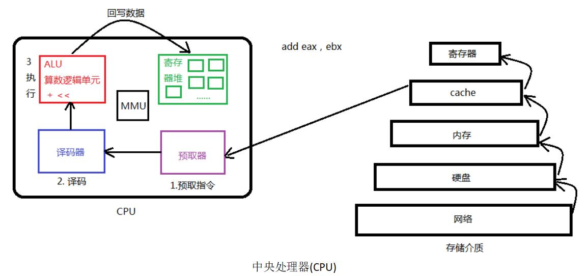
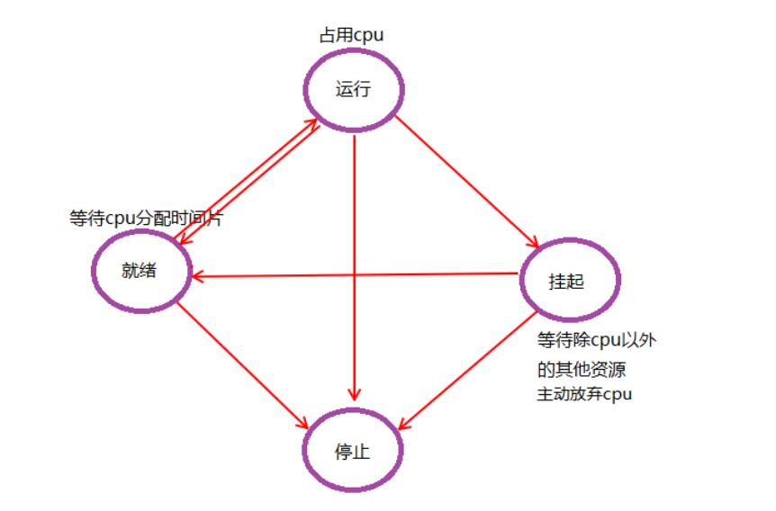

## 基本概念


**程序**，指编译好的二进制文件，存在磁盘上，不占用系统资源（cpu、内存、打开的文件、设备、锁...）。

**进程**，是一个抽象概念，与操作系统相关，进程时活跃的程序，占用系统资源，在内存中运行。程序运行起来产生一个进程。

同一个程序加载成不同的进程，彼此互不影响。

**并发**

并发，在操作系统中，一个时间段中有多个进程都处于已启动运行到运行完毕之间的状态。但，任一个时刻点上仍只有一个进程在运行

**单道程序设计**

所有进程一个一个排对执行。若A阻塞，B只能等待，即使CPU处于空闲状态。而在人机交互时阻塞的出现时必然的。所有这种模型在系统资源利用上及其不合理，在计算机发展历史上存在不久，大部分便被淘汰了。


**多道程序设计**

在计算机内存中同时存放几道相互独立的程序，它们在管理程序控制之下，相互穿插的运行。多道程序设计必须有硬件基础作为保证。

时钟中断即为多道程序设计模型的理论基础。 并发时，任意进程在执行期间都不希望放弃cpu。因此系统需要一种强制让进程让出cpu资源的手段。时钟中断有硬件基础作为保障，对进程而言不可抗拒。 操作系统中的中断处理函数，来负责调度程序执行。

在多道程序设计模型中，多个进程轮流使用CPU (分时复用CPU资源)。而当下常见CPU为纳秒级，1秒可以执行大约10亿条指令。由于人眼的反应速度是毫秒级，所以看似同时在运行。

1s = 1000ms, 1ms = 1000us, 1us = 1000ns   1000000000 

实质上，并发是宏观并行，微观串行！			-----推动了计算机蓬勃发展，将人类引入了多媒体时代。

**cpu和mmu**



代码通过预处理、编译、汇编、链接之后生成程序，cpu中的预取器每次取一条指令，然后译码器分析做处理。


虚拟地址空间是可用的地址空间（4G）

MMU的作用

- 虚拟地址和物理内存的映射

- 设置内存访问级别

  CPU分为4种访问级别，linux实际用到两种0和3，分别对应内核区和用户区。

MMU划分内存的最小单元是一个页面4K.

不同进程的PCB位于同一个物理内存中，但是他们的PCB不相同。


**进程控制块 PCB**

每个进程在内核中都有一个进程控制块（PCB）来维护进程相关的信息，Linux内核的进程控制块是task_struct结构体。

/usr/src/linux-headers-3.16.0-30/include/linux/sched.h文件中可以查看struct task_struct 结构体定义。其内部成员有很多，我们重点掌握以下部分即可：

- 进程id。系统中每个进程有唯一的id，在C语言中用pid_t类型表示，其实就是一个非负整数。

- 进程的状态，有就绪、运行、挂起、停止等状态。

- 进程切换时需要保存和恢复的一些CPU寄存器信息。

- 描述虚拟地址空间的信息。

- 描述控制终端的信息。

- 当前工作目录。

- umask掩码。

* 文件描述符表，包含很多指向file结构体的指针。

- 和信号相关的信息。

- 用户id和组id。
- 会话（Session）和进程组。
- 进程可以使用的资源上限（Resource Limit）。

**进程状态**

进程基本的状态有5种。分别为**初始态，就绪态，运行态，挂起态**与**终止态**。其中初始态为进程准备阶段，常与就绪态结合来看。




## 环境变量

linux是多用户多任务的开源操作系统，多任务是并发，多用户是支持多个用户同时登录系统，每个用户就对应一个环境变量，保存用户的一些习惯。

环境变量，是指在操作系统中用来指定操作系统运行环境的一些参数。通常具备以下特征：

- 字符串(本质) 
- 有统一的格式：名=值[:值] 
-  值用来描述进程环境信息

存储形式：与命令行参数类似。char *[]数组，数组名environ，内部存储字符串，NULL作为哨兵结尾。

使用形式：与命令行参数类似。

加载位置：与命令行参数类似。位于用户区，高于stack的起始位置。

引入环境变量表：须声明环境变量。extern char ** environ;		

​	

**PATH**

可执行文件的搜索路径。ls命令也是一个程序，执行它不需要提供完整的路径名/bin/ls，然而通常我们执行当前目录下的程序a.out却需要提供完整的路径名./a.out，这是因为PATH环境变量的值里面包含了ls命令所在的目录/bin，却不包含a.out所在的目录。PATH环境变量的值可以包含多个目录，用:号隔开。

查看环境变量的值：

```bash
echo $PATH
```


**SHELL**

当前Shell，它的值通常是/bin/bash。


**TERM**

当前终端类型，在图形界面终端下它的值通常是xterm，终端类型决定了一些程序的输出显示方式，比如图形界面终端可以显示汉字，而字符终端一般不行。


**LANG**

语言和locale，决定了字符编码以及时间、货币等信息的显示格式。


**HOME**

当前用户主目录的路径，很多程序需要在主目录下保存配置文件，使得每个用户在运行该程序时都有自己的一套配置。


### environ

引入环境变量表：须声明环境变量。extern char ** environ;		

存储形式：与命令行参数类似。char *[]数组，数组名environ，内部存储字符串，NULL作为哨兵结尾。

```c
extern char **environ;

for (int i = 0; environ[i]; ++i) {
    printf("%s\n", environ[i]);
}
```

### getenv

getenv获取环境变量

```cpp
#include <stdlib.h>

char *getenv(const char *name);
```

返回值

```
NULL	不匹配
指针	   成功，返回对应的value
```


### setenv/unsetenv

setenv设置环境变量，unsetenv取消设置。

```cpp
#include <stdlib.h>

int setenv(const char *name, const char *value, int overwrite);
int unsetenv(const char *name);
```

返回值

```
-1	失败，并设置errno
0	成功
```

setenv当环境变量存在，如果overwrite非0则覆盖，否则不覆盖。

unsetenv删除一个不存在的环境变量不会报错，但是如果格式不对会报错（XXX=）。

```c
#include <stdio.h>
#include <stdlib.h>
#include <string.h>
#include <stdio.h>

int main(void)
{
	char *val;
	const char *name = "ABD";

	val = getenv(name);
	printf("1, %s = %s\n", name, val);

	setenv(name, "haha-day-and-night", 1);

	val = getenv(name);
	printf("2, %s = %s\n", name, val);

#if 1
	int ret = unsetenv("ABD=");
    printf("ret = %d\n", ret);
	perror("unsetenv");

	val = getenv(name);
	printf("3, %s = %s\n", name, val);

#else
	int ret = unsetenv("ABD");  //name=value:value
	printf("ret = %d\n", ret);

	val = getenv(name);
	printf("3, %s = %s\n", name, val);

#endif

	return 0;
}
```


## 进程控制原语

### fork

```cpp
#include <sys/types.h>
#include <unistd.h>
       
pid_t fork(void);
```

fork有两个返回值，分别对应父进程和子进程。

```
-1		失败，并设置errno
>0 		父进程返回子进程的PID
0		子进程返回0
```

父子进程顺序由内核调度算法决定。

父子进程相同：全局变量、.data、.text、堆、栈、环境变量、用户ID、宿主目录、进程工作目录、信号处理方式。

父子进程不同：进程ID、for返回值、父进程ID、进程运行时间、定时器、未决信号集。

看似是子进程复制了父进程0-3G的用户空间的内容，以及父进程的PCB，但pdi不同。实际上fork一个子进程并不是将0-3G地址空间完全拷贝一份，然后映射到物理内存，而是采用**读时共享, 写时复制**的原则，这样可以节省内存的开销。

父子进程共享：文件描述符、mmap建立的映射区。


```c
// 创建多个进程
#include <stdio.h>
#include <unistd.h>
#include <stdlib.h>

int main(int argc, char *argv[])
{
	int n = 5, i;				//默认创建5个子进程

	if(argc == 2){	
		n = atoi(argv[1]);
	}

	for(i = 0; i < n; i++)	//出口1,父进程专用出口
		if (fork() == 0)
			break;			//出口2,子进程出口,i不自增
        if (n == i){
            sleep(n);
            printf("I am parent, pid = %d\n", getpid());
        }else {
            sleep(i);
            printf("I'm %dth child, pid = %d\n", i+1, getpid());
        }

	return 0;
}
```

### getpid/getppid

获取进程PID和父进程的PID

```cpp
#include <sys/types.h>
#include <unistd.h>

pid_t getpid(void);
pid_t getppid(void);
```

### getuid

获取用户ID。

```cpp
#include <unistd.h>
#include <sys/types.h>

uid_t getuid(void);
```


### getgid

获取用户组ID。

```cpp
#include <unistd.h>
#include <sys/types.h>

gid_t getgid(void);
```


### exec

fork创建子进程，在调用exec函数之后，子进程的PID不变，子进程会执行调用的程序。

|                 |                        |
| --------------- | ---------------------- |
| l（list）       | 命令行参数             |
| p（path）       | 搜索file时使用path变量 |
| v（vector）     | 使用命令行参数数组     |
| e（environment) | 使用环境变量数组       |


```
#include <unistd.h>
extern char **environ;

int execl(const char *path, const char *arg, .../* (char  *) NULL */);
int execlp(const char *file, const char *arg, .../* (char  *) NULL */);
int execle(const char *path, const char *arg, .../*, (char *) NULL, char * const envp[] */);
int execv(const char *path, char *const argv[]);
int execvp(const char *file, char *const argv[]);
int execvpe(const char *file, char *const argv[],
char *const envp[]);

```

```
exec函数只会在出错时返回-1，并设置error
```


- execlp, 借助PATH环境变量加载新程序。
- execl, 通过路径+程序名加载进程

```c
#include <stdio.h>
#include <unistd.h>

int main() {
    pid_t pid;
    pid = fork();

    if (pid == -1) {
        perror("fork");
        exit(1);
    }else if (pid > 0) {
        sleep(2); 
        printf("I am father\n");
    }else {
        // execlp("ls", "ls", "-l", "-a", NULL);
        // execl("/bin/ls", "ls", "-l", "-a", NULL);
        char *argv[] = {"ls", "-l", "-a", NULL};
        execv("/bin/ls", argv);
    }
    return 0;
}
```

```cpp
// 利用dup2实现exec输出到文件中
#include <stdio.h>
#include <unistd.h>
#include <fcntl.h>
#include <stdlib.h>

int main() {
    int fd;
    fd = open("ps.log", O_CREAT | O_WRONLY | O_TRUNC, 06444);
    if (fd < 0) {
        perror("open");
        exit(1);
    }

    pid_t pid = fork();
    if (pid == -1) {
        perror("fork");
        exit(1);
    }else if (pid > 0) {
        sleep(1);
        printf("I am father\n");
    }else {
        dup2(fd, 1);
        execlp("ps", "ps", "-aux", NULL);
    }

    return 0;
}
```


### 孤儿/僵尸进程

**孤儿进程**：父进程先于子进程结束，则子进程称为孤儿进程，子进程的父进程成为init进程，init进程领养孤儿进程。

**僵尸进程**：进程终止，父进程尚未回收，子进程残留资源（PCB）存放在内核中，方便父进程收尸，如果父进程不回收就变成了僵尸进程。


### wait

```cpp
#include <sys/types.h>
#include <sys/wait.h>

pid_t wait(int *wstatus);
```

```
>0	成功，子进程PID
-1	失败
```

父进程调用wait函数可以回收子进程终止信息：

- 阻塞等待子进程退出
- 回收子进程残留资源
- 获取子进程退出状态（退出原因）

多个子进程, 只能回收一个。

```c
// 正常退出
pid_t pid, wpid;
int status;

wpid = wait(&status);
printf("wpid = %d\n", wpid);
if (wpid == -1) {
    perror("wait");
    exit(1);
}

if (WIFEXITED(status)) { // 正常退出
    // 获取退出值，对应子进程exit退出的值
    printf("child exit with %d\n", WEXITSTATUS(status));
}

if (WIFSIGNALED(status)) { // 非正常退出
    // 获取异常退出的信号
    printf("child killed by %d\n", WTERMSIG(status));
}
```


### waitpid

为指定进程收尸。

```cpp
#include <sys/types.h>
#include <sys/wait.h>

pid_t waitpid(pid_t pid, int *wstatus, int options);
```

```
-1	失败
>0 	成功，子进程的PID
0	非阻塞回收失败返回0
```

| pid  |                            |
| ---- | -------------------------- |
| > 0  | 回收指定pid的子进程        |
| -1   | 回收任意子进程（wait）     |
| 0    | 回收本组任意子进程         |
| < -1 | 回收指定进程组的任意子进程 |

| options |        |
| ------- | ------ |
| 0       | 阻塞   |
| WHOHANG | 非阻塞 |


```c
// 阻塞回收所有进程
while ((wpid = waitpid(-1, NULL, 0)) > 0) { // 等价于 wait(NULL)
    printf("child pid = %d exit\n", wpid);
}
        
// 轮训回收所有的子进程
int cnt = 0;
do {
    wpid = waitpid(-1, NULL, WNOHANG);
    if (wpid > 0) {
        printf("child pid = %d exit\n", wpid);
        cnt++;
    }
    // 参数为WNOHANG且子进程没有退出, 返回0
    sleep(1);
}while (cnt != 3);
```


## 进程间通信 IPC

Linux环境下，进程地址空间相互独立，每个进程各自有不同的用户地址空间。任何一个进程的全局变量在另一个进程中都看不到，所以进程和进程之间不能相互访问，要交换数据必须通过内核，在内核中开辟一块缓冲区，进程1把数据从用户空间拷到内核缓冲区，进程2再从内核缓冲区把数据读走，内核提供的这种机制称为进程间通信（IPC，Inter Process Communication）。

在进程间完成数据传递需要借助操作系统提供特殊的方法，如：文件、管道、信号、共享内存、消息队列、套接字、命名管道等。随着计算机的蓬勃发展，一些方法由于自身设计缺陷被淘汰或者弃用。现今常用的进程间通信方式有：

- 管道 (使用最简单)
- 信号 (开销最小)
- 共享映射区 (无血缘关系)
- 本地套接字 (最稳定)

### 管道

```cpp
#include <unistd.h>

int pipe(int pipefd[2]);
```

```
-1	失败，并设置errno
0	成功
```

管道是一种最基本的IPC机制，作用于**有血缘关系**的进程之间，完成数据传递。调用pipe系统函数即可创建一个管道。有如下特质：

- 其本质是一个**伪文件**(实为内核缓冲区) 
- 由两个文件描述符引用，一个表示读端，一个表示写端。
- 规定数据从管道的写端流入，从读端流出。

管道的原理: 管道实为内核使用**环形队列**机制，借助内核缓冲区(4k)实现，512B是扇区的大小。

```
pipe size            (512 bytes, -p) 8
```

**管道的局限性**：

- 数据自己读不能自己写。
- 数据一旦被读走，便不在管道中存在，不可反复读取。
- 由于管道采用半双工通信方式。因此，数据只能在一个方向上流动。
- 只能在有公共祖先的进程间使用管道。

常见的通信方式有，单工通信、半双工通信、全双工通信。

读管道再读取数据时：

- 管道中有数据，read返回实际读取的字节数。

- 管道中无数据

  如果写端全关闭，read返回0。

  如果仍有写端打开，阻塞等待。

写管道在写数据时：

- 读端全关闭，进程异常终止（SIGPIPE信号）。
- 有读端打开
  - 管道未满，写数据，返回写入的字节数
  - 管道已满，阻塞（少见）

```c
#include <unistd.h>
#include <string.h>
#include <stdlib.h>
#include <stdio.h>
#include <sys/wait.h>

void sys_err(const char *str)
{
    perror(str);
    exit(1);
}

int main(void)
{
    pid_t pid;
    char buf[1024];
    int fd[2];
    char *p = "test for pipe\n";
    
   if (pipe(fd) == -1) 
       sys_err("pipe");

   pid = fork();
   if (pid < 0) {
       sys_err("fork err");
   } else if (pid == 0) { // 子进程读，关闭写端
        close(fd[1]);
        int len = read(fd[0], buf, sizeof(buf));
        write(STDOUT_FILENO, buf, len);
        close(fd[0]);
   } else { // 父进程写，关闭读端
       close(fd[0]);
       write(fd[1], p, strlen(p));
       wait(NULL);
       close(fd[1]);
   }
    
    return 0;
}
```


### fifo 有名管道

fifo用于非血缘关系的进程间通信。

```cpp
#include <sys/types.h>
#include <sys/stat.h>

int mkfifo(const char *pathname, mode_t mode);
```

```
-1	失败，并设置errno
0	成功
```

创建fifo文件。

```cpp
if (mkfifo("tmp", 0666) < 0 && errno != EEXIST) {
    perror("mkfifo");
    exit(1);
}
```

```bash
mkfifo tmp
```


### mmap 共享内存

存储映射I/O (Memory-mapped I/O) 使一个磁盘文件与存储空间中的一个缓冲区相映射。于是当从缓冲区中取数据，就相当于读文件中的相应字节。于此类似，将数据存入缓冲区，则相应的字节就自动写入文件。这样，就可在不适用read和write函数的情况下，使用地址（指针）完成I/O操作。

使用这种方法，首先应通知内核，将一个指定文件映射到存储区域中。这个映射工作可以通过mmap函数来实现。

```cpp
#include <sys/mman.h>

void *mmap(void *addr, size_t length, int prot, int flags,
int fd, off_t offset);
int munmap(void *addr, size_t length);
```

```
MAP_FAILED		失败，并设置errno（void*）-1
void*指针		   成功，指向mapped area
```

|        |                                                              |
| ------ | ------------------------------------------------------------ |
| addr   | 建立映射区的首地址，由Linux内核指定。使用时，直接传递NULL    |
| length | 欲创建映射区的大小                                           |
| prot   | 映射区权限PROT_READ、PROT_WRITE、PROT_READ\|PROT_WRITE       |
| flags  | 标志位参数(常用于设定更新物理区域、设置共享、创建匿名映射区)                                           MAP_SHARED:  会将映射区所做的操作反映到物理设备（磁盘）上。                                         MAP_PRIVATE: 映射区所做的修改不会反映到物理设备。 |
| fd     | 用来建立映射区的文件描述符                                   |
| offset | 映射文件的偏移(4k的整数倍)                                   |

**mmap注意事项**

- mmap不能创建0字节的映射区，必须要有大小，新创建的文件文件大小为0，不能作为映射区。
- 文件是只读方式打开，映射区如果设置读写权限，会提示权限不足，如果映射区的flag设置为PRIVATE，会提示总线错误，主要是硬件错误，更文件大小和权限有关。
- 当MAP_SHARED时，创建映射区的权限 $\le$ 打开文件的权限
- 映射的创建隐含对文件的读操作
- offset, 映射文件的偏移必须是4k的倍数, mmu内存映射最小为4k
- 映射区的释放与文件关闭无关
- munmap传入的地址一定时mmap的返回地址，不能++、--操作

```c
// mmap_test.c mmap简单使用
#include <stdio.h>
#include <sys/stat.h>
#include <unistd.h>
#include <stdlib.h>
#include <fcntl.h>
#include <string.h>
#include <sys/mman.h>

int main(void)
{
    int fd = open("./test.txt", O_RDWR);
    char *p;
    int i;

    struct stat sbuf;
    stat("./test.txt", &sbuf);
    int len = sbuf.st_size;
    printf("len = %d\n", len);
    
    p = mmap(NULL, len, PROT_READ|PROT_WRITE, MAP_PRIVATE, fd, 0);
    if (p == MAP_FAILED) {
        perror("mmap error");
        exit(1);
    }

    strcpy(p, "hehehe");  
    for (i = 0; i < len; i++) {
        printf("%c", p[i]);
    }
    printf("\n");

    munmap(p, len);
    close(fd);

    return 0;
}
```


```c
// 进程通信 - 匿名映射1
int var = 100;
int main() {
    int *p = NULL;
    pid_t pid;
    p = (int*) mmap(NULL, 4, PROT_READ|PROT_WRITE, MAP_SHARED|MAP_ANON, -1, 0); // MAP_ANON匿名映射, 只在linux可以使用
    if (p == MAP_FAILED) {
        perror("mmap");
        exit(1);
    }

    pid = fork();
    if (pid == -1) {
        perror("fork");
        exit(1);
    }else if (pid == 0) {
        *p = 1000;
        var = 200;
        printf("child, *p = %d, var = %d\n", *p, var);
        exit(1);
    }else {
        sleep(1);
        printf("father, *p = %d, var = %d\n", *p, var);
        wait(NULL);
        int ret = munmap(p, 4);
        if (ret == -1) {
            perror("munmap");
            exit(1);
        }
    }
    return 0;
}
```

```c
// 进程通信 - 匿名映射2
int var = 100;
int main() {
    int *p = NULL;
    pid_t pid;
    int fd = open("/dev/zero", O_RDWR);
    p = (int*) mmap(NULL, 4, PROT_READ|PROT_WRITE, MAP_SHARED, fd, 0); // 使用字符文件
    if (p == MAP_FAILED) {
        perror("mmap");
        exit(1);
    }

    pid = fork();
    if (pid == -1) {
        perror("fork");
        exit(1);
    }else if (pid == 0) {
        *p = 1000;
        var = 200;
        printf("child, *p = %d, var = %d\n", *p, var);
        exit(1);
    }else {
        sleep(1);
        printf("father, *p = %d, var = %d\n", *p, var);
        wait(NULL);
        int ret = munmap(p, 4);
        if (ret == -1) {
            perror("munmap");
            exit(1);
        }
    }

    return 0;
}
```

```c
// 非血缘关系的进程通信
// mmap_read.c
struct STU{
    int id;
    char name[20];
    char sex;
};

void sys_err(char *str) {
    perror(str);
    exit(1);
}

int main(int argc, char *argv[]) {
    int fd;
    struct STU student;
    struct STU *p;
    if (argc < 2) {
        printf("./mmap_read file_share_path");
        exit(1);
    }
    fd = open(argv[1], O_RDONLY);
    if (fd == -1) {
        sys_err("open");
    }
    p = mmap(NULL, sizeof(student), PROT_READ, MAP_SHARED, fd, 0);
    if (p == MAP_FAILED) {
        sys_err("mmap");
    }
    close(fd);

    while (1) {
        printf("id = %d, name = %s, sex = %c\n", p->id, p->name, p->sex);
        sleep(2);
    }
    munmap(p, sizeof(student));
    return 0;
}
```

```c
// mmap.write
struct STU{
    int id;
    char name[20];
    char sex;
};

void sys_err(char *str) {
    perror(str);
    exit(1);
}

int main(int argc, char *argv[]) {
    int fd;
    struct STU student = {10, "sanzo", 'M'};
    struct STU *p;

    if (argc < 2) {
        printf("./a.out file_shared_path\n");
        exit(1);
    }
    fd = open(argv[1], O_RDWR|O_CREAT, 0644);
    ftruncate(fd, sizeof(student));
    p = mmap(NULL, sizeof(student), PROT_READ|PROT_WRITE, MAP_SHARED, fd, 0);
    if (p == MAP_FAILED) {
        sys_err("mmap");
    }
    close(fd);
    while (1) {
        memcpy(p, &student, sizeof(student));
        student.id++;
        sleep(1);
    }
    munmap(p, sizeof(student));
    return 0;
}
```


### 信号

### alarm

```c
#include <stdio.h>
#include <unistd.h>

int main() {
    alarm(1);
    for (int i = 0; ; ++i) {
        printf("%d\n", i);
    }
    return 0;
}
```

### setitimer

```c
#include <stdio.h>
#include <stdlib.h>
#include <sys/time.h>

unsigned int my_alarm(unsigned int sec) {
    struct itimerval it, oldit;
    it.it_value.tv_sec = sec;
    it.it_value.tv_usec = 0;
    it.it_interval.tv_sec = 0;
    it.it_interval.tv_usec = 0;

    int ret = setitimer(ITIMER_REAL, &it, &oldit);
    if (ret == -1) {
        perror("setitimer");
        exit(1);
    } 
    return oldit.it_value.tv_sec;
}

int main() {
    my_alarm(1);
    for (int i = 0; ; ++i) {
        printf("%d\n", i);
    }
    return 0;
}
```

### signal

```c
// signal.c
#include <stdio.h>
#include <sys/time.h>
#include <signal.h>
#include <stdlib.h>
#include <unistd.h>

void myfunc(int signo) {
    printf("hello sanzo!\n");
}

int main() {
    struct itimerval it, oldit;
    signal(SIGALRM, myfunc); // 注册SIGALRM信号的捕捉处理函数
    it.it_value.tv_sec = 5;
    it.it_value.tv_usec = 0;

    it.it_interval.tv_sec = 3;
    it.it_interval.tv_usec = 0;

    int ret = setitimer(ITIMER_REAL, &it, &oldit);
    if (ret == -1) {
        perror("setitimer error");
        exit(1);
    }

    while (1);
    return 0;
}
```


### 信号集

自定义信号集影响阻塞信号集, 阻塞信号集影响未决信号集

```c
// print_sigpending.c
include <stdio.h>
#include <signal.h>
#include <unistd.h>
void print_ped(sigset_t *ped) {
    for (int i = 0; i < 32; ++i) {
        if (sigismember(ped, i) == 1) { // 判断信号是否在集合中
            putchar('1');
        }else {
            putchar('0');
        }
    }
    printf("\n");
}
int main() {
    sigset_t myset, oldset, ped;
    sigemptyset(&myset); // 置空信号集
    sigaddset(&myset, SIGQUIT); // 添加对应信号置1
    sigaddset(&myset, SIGINT);
    sigaddset(&myset, SIGTSTP);

    sigprocmask(SIG_BLOCK, &myset, &oldset); // 修改阻塞信号集
    
    while (1) {
        sigpending(&ped); // 获取未决信号集
        print_ped(&ped);
        sleep(1);
    } 
    return 0;
}
```


### sigaction

信号捕捉期间阻塞的信号产生多次只记录一次.

内核捕捉信号的过程:

1. 在用户空间执行代码
2. 接收到信号进入内核空间
3. 内核空间调用捕捉函数
4. 在用户空间执行捕捉函数
5. 捕捉函数执行完毕, 执行特殊的系统调用sigreturn回到调用函数的内核空间
6. 到用户空间接着执行代码

```c
// sigaction.c
#include <stdio.h>
#include <stdlib.h>
#include <signal.h>
#include <unistd.h>

void docatch(int signo) {
    printf("%d signal is catch\n", signo);
    sleep(5);
    printf("catch is done\n");
}

int main() {
    struct sigaction act;
    act.sa_handler = docatch;
    sigemptyset(&act.sa_mask);
    sigaddset(&act.sa_mask, SIGQUIT); // 设置捕捉期间的屏蔽
    act.sa_flags = 0; // 默认属性, 信号捕捉执行期间, 自动屏蔽本信号

    int ret = sigaction(SIGINT, &act, NULL);
    if (ret < 0) {
        perror("sigaction error");
        exit(1);
    }
    while (1);
    return 0;
}
```


### 时序竞态

pause可以造成进程主动挂起, 等待信号唤醒, 当信号捕捉而且捕捉函数返回pause会返回-1,同时errno设置为EINTR

```c
/* 	
 	pause.c
	alarm + pause 实现sleep, 存在时序竞态的问题
	如果程序在alarm之后失去cpu, alarm的计时不会停止, 当进程重新获取cpu之后,
	进程首先会处理到时间触发的alarm信号, 之后的pause就不能被唤醒
*/
#include <stdio.h>
#include <stdio.h>
#include <unistd.h>
#include <signal.h>
#include <errno.h>

void docatch(int signo) {
    return;
}

unsigned int mysleep(unsigned int seconds) {
    struct sigaction act, oldact;
    act.sa_handler = docatch;
    sigemptyset(&act.sa_mask);
    act.sa_flags = 0;

    sigaction(SIGALRM, &act, &oldact);
    alarm(seconds);
    int ret = pause(); // 主动挂起 等待信号
    if (ret == -1 && errno == EINTR) {
        printf("pause sucess\n");
    }
    
    ret = alarm(0);
    sigaction(SIGALRM, &oldact, NULL); // 恢复SIGALRM的默认处理方式

    return ret;
}
int main() {
    while (1) {
        mysleep(2);
        printf("----------------\n");
    }
    return 0;
}
```

```c
/*
	sigsuspend.c
	为了解决时序竞态问题, 可以在alarm之后对SIGALRM进行屏蔽, 然后使用原子操作的sigsuspend, 在pause的同时使用临时的阻塞信号集, 取消之前的屏蔽.
*/
#include <stdio.h>
#include <stdio.h>
#include <unistd.h>
#include <signal.h>
#include <errno.h>

void docatch(int signo) {
    return;
}

unsigned int mysleep(unsigned int seconds) {
    sigset_t newmask, oldmask, suspmask;
    struct sigaction act, oldact;
    unsigned int unslept;

    // 为SIGALRM设置捕捉函数
    act.sa_handler = docatch;
    sigemptyset(&act.sa_mask);
    act.sa_flags = 0;
    sigaction(SIGALRM, &act, &oldact);

    // 设置阻塞信号集, 阻塞SIGALRM
    sigemptyset(&newmask);
    sigaddset(&newmask, SIGALRM);
    sigprocmask(SIG_BLOCK, &newmask, &oldmask);

    // 定时
    alarm(seconds);

    // 调用sigsuspend, 使用临时有效的阻塞信号集
    // 在临时阻塞集合中解除SIGALRM信号的阻塞
    // sigsuspend完成之后, 恢复之前的阻塞信号集
    suspmask = oldmask;
    sigdelset(&suspmask, SIGALRM);
    sigsuspend(&suspmask); // 原子操作

    unslept = alarm(0);
    // 恢复SIGALRM原有的处理动作
    sigaction(SIGALRM, &oldact, NULL);

    // 解除对SIGALRM的阻塞, 恢复之前的阻塞信号集
    sigprocmask(SIG_SETMASK, &oldmask, NULL);
    return unslept;
}
int main() {
    while (1) {
        mysleep(2);
        printf("----------------\n");
    }
    return 0;
}
```

### 全局变量的异步IO

```c
/*
	sync_process.c
*/
#include <stdio.h>
#include <stdlib.h>
#include <unistd.h>
#include <signal.h>

int n = 0, flag = 0;

void sys_err(char *str) {
    perror(str);
    exit(1);
}

void do_sigchild(int signo) {
    printf("I am child %d\t%d\n", getpid(), n);
    n += 2;
    flag = 1;
//    sleep(1);
}

void do_sigparent(int signo) {
    printf("I am parent %d\t%d\n", getpid(), n);
    n += 2;
    flag = 1;
//    sleep(1);
}

int main() {
    pid_t pid;
    struct sigaction act;
    if ((pid = fork()) < 0) {
        sys_err("fork");
    }else if (pid > 0) { 
        n = 1;
        sleep(1);
        act.sa_handler = do_sigparent;
        sigemptyset(&act.sa_mask);
        act.sa_flags = 0;
        sigaction(SIGUSR2, &act, NULL);
        do_sigparent(0);
        while (1) {
            if (flag == 1) {
                kill(pid, SIGUSR1);
                flag = 0; // flag的值前后可能存在时序竞态错误
            }
        }
    }else if(pid == 0){
        n = 2;
        act.sa_handler = do_sigchild;
        sigemptyset(&act.sa_mask);
        act.sa_flags = 0;
        sigaction(SIGUSR1, &act, NULL);
        while (1) {
            if (flag == 1) {
                kill(getppid(), SIGUSR2);
                flag = 0; 
            }
        }
    }
    return 0;
}
```

```c
/*
	sync_process1.c
	不使用flag, 每次捕捉函数之后, 发送kill
*/
#include <stdio.h>
#include <stdlib.h>
#include <unistd.h>
#include <signal.h>

int n = 0;
int ppid, cpid;
void sys_err(char *str) {
    perror(str);
    exit(1);
}

void do_sigchild(int signo) {
    printf("I am child %d\t%d\n", getpid(), n);
    n += 2;
    kill(ppid, SIGUSR2);
}

void do_sigparent(int signo) {
    printf("I am parent %d\t%d\n", getpid(), n);
    n += 2;
    kill(cpid, SIGUSR1);
}

int main() {
    pid_t pid;
    struct sigaction act;
    if ((pid = fork()) < 0) {
        sys_err("fork");
    }else if (pid > 0) { 
        ppid = getpid();
        cpid = pid;
        n = 1;
        sleep(1);
        act.sa_handler = do_sigparent;
        sigemptyset(&act.sa_mask);
        act.sa_flags = 0;
        sigaction(SIGUSR2, &act, NULL);
        do_sigparent(0);
        while (1);
    }else if(pid == 0){
        cpid = getpid();
        ppid = getppid();
        n = 2;
        act.sa_handler = do_sigchild;
        sigemptyset(&act.sa_mask);
        act.sa_flags = 0;
        sigaction(SIGUSR1, &act, NULL);
        while (1);
    }
    return 0;
}
```

### 守护进程

1. 创建子进程 fork
2. 子进程创建会话 setsid
3. 改变进程的工作目录 chdir
4. 指定文件演码 umask
5. 将0/1/2重定向 /dev/null dup2
6. 守护进程主逻辑
7. 退出

### 本地套接字