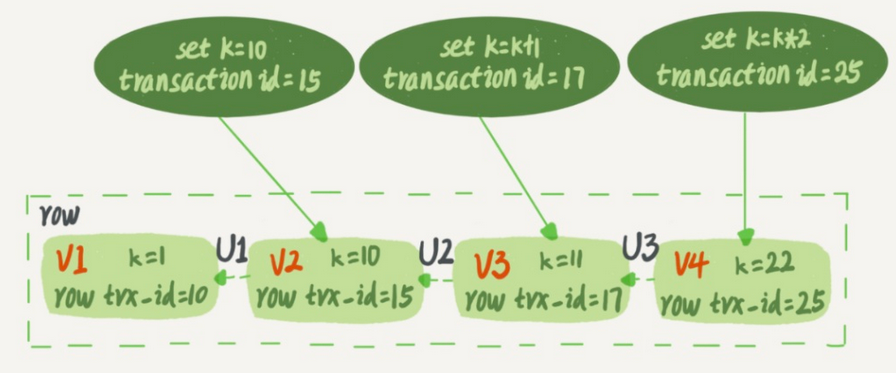
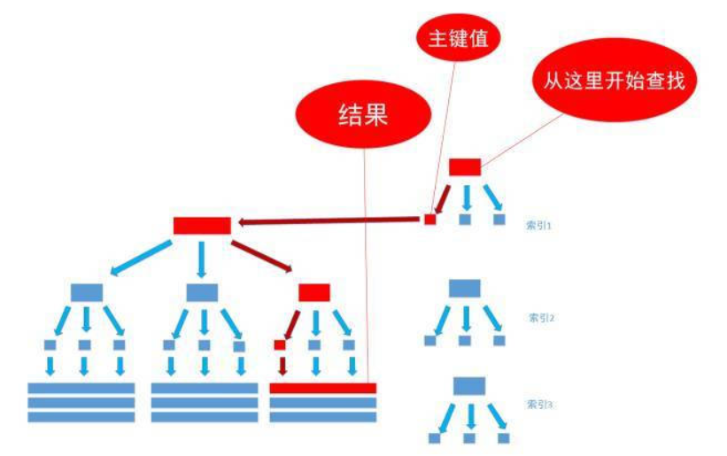
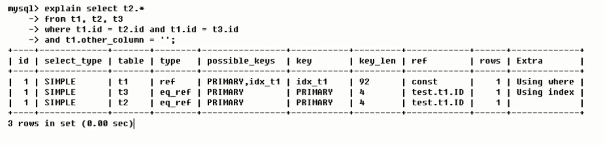
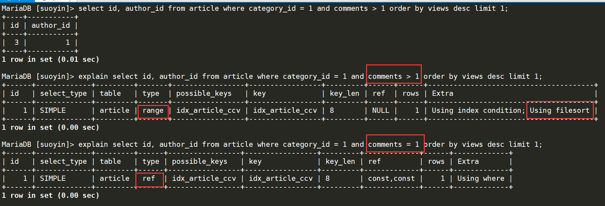
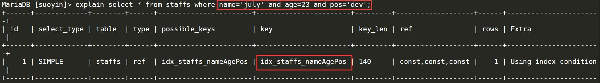
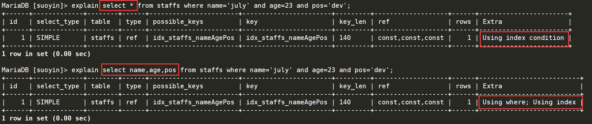
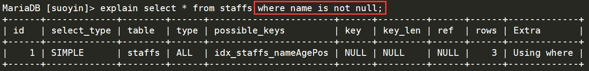
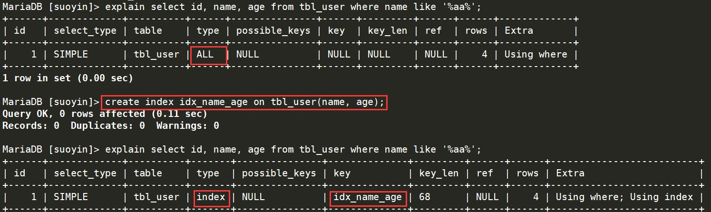

## 1. 查询语句

### 基础查询

```sql
# 查询所有字段语句
select * from employees;

# 查询指定字段
select last_name from employees;
select * from employees where last_name="fay";

# 查询常量值
select 100;

# 查询表达式
select 100%97;

# 查询函数
select version();

# 查询结果起别名
select last_name as '姓', first_name as '名' from employees;
select last_name '姓', first_name '名' from employees;
select salary as 'out put' from employees;

# 去重
select distinct department_id from employees;

# concat拼接字符
select concat(last_name, ' ',first_name) as "姓名" from employees;

# ifnull(arg1, arg2)
# 如果arg1为null，返回arg2
select ifnull(commission_pct, 0) as 奖金率 from employees;
```


### 条件查询

1. 条件表达式

   `>`、 `<、` `=` 、 `!=` 、`<>`、  `>=` 、`<=`

2. 逻辑表达式

   `&&`、 `||`、 `!`、 `and`、 `or`、 `not`

3. 模糊查询

   `like` 、`between and`、 `in`、 `is null` 

   %： 任意多个字符

   _：任意单个字符

   is null：只能判断null值

   <=>：可以判断null值和普通数值

```sql
# 工资大于12k的员工信息
select * from employees where salary > 12000;

# 部门编号不等于90的员工名和部门编号
select last_name,department_id from employees where department_id <> 90;
select last_name,department_id from employees where department_id != 90;

# 工资在10k到20k之间的员工名、工资、奖金
select last_name,salary,commission_pct from employees 
	where salary >= 10000 and salary <= 20000;
	
select last_name,salary,commission_pct from employees  
	where salary between 10000 and 20000;
	
select last_name,salary,commission_pct from employees  
	where salary not between 10000 and 20000;	

# 姓名包含a的员工信息
select * from employees where last_name like '%a%'

# 姓名第3个字符为a，第5个字符为l的员工信息
select * from employees where last_name like '__a_l%';

# 姓名第2个字符为_的员工信息
select * from employees where last_name like '_\_%';
select * from employees where last_name like '_$_%' escape '$';

# 查询工种是'AD_PRES'、'AD_VP'的员工名
select last_name from employees where job_id='AD_PRES' or job_id='AD_VP';
select last_name from employees where job_id in ('AD_PRES', 'AD_VP');

# 查询没有奖金的员工名
select last_name from employees where commission_pct is null;
select last_name from employees where commission_pct <=> null;

# 查询有奖金的员工名
select last_name from employees where commission_pct is not null;

```


### 排序查询

desc：降序

asc：升序（默认）

order by支持单个字段、多个字段、表达式、函数、别名。

```sql
# 薪资从高到底
select * from employees order by salary desc;

# 部门号大于90，入职时间升序排列
select * from employees where department_id > 90 order by hiredate asc;

# 年薪降序排列
select last_name,salary*12*(1+ifnull(commission_pct,0)) as 年薪 from employees 
	order by 年薪 desc;
	
# 按照姓名长度排序
select last_name, length(last_name) as 长度 from employees order by 长度;

# 工资升序，编号降序
select * from employees order by salary asc,employee_id desc;

```


### 常见函数

1. 字符函数

   ```sql
   # 字符函数
   select length(’john‘);
   
   # 拼接字符串
   select concat(last_name, '_', first_name) from employees;
   
   # 大小写转换
   select upper(last_name) from employees;
   select lower("joHn");
   
   # 截取字符串，索引从1开始
   # 从指定位置开始截取到末尾
   select substr("hello", 3); // llo
   
   #从指定位置开始截取指定个数
   select substr("hello", 1, 2); // he
   
   # 子串第一次出现的位置，找不到返回0
   select instr('hello world', 'wor') as out_put; // 7
   
   # 删除前后字符
   # 删除空格
   select length(trim('   你好   ')) as out_put; // 6
   
   # 删除指定字符
   select trim('a' from 'aaaa你好aaaa你aaaaa') as out_put;
   select trim('ab' from 'aba你好babab') as out_put; // a你好b
   
   # 填充字符
   select lpad("hello", 10, '*');
   select rpad("hello", 10, '*');
   
   # 替换
   select replace("I love U U U...", 'U', 'you');
   ```

2. 数学函数

   ```sql
   # 四舍五入
   select round(1.55);
   select round(1.55, 1);
   
   # 向上取整
   select ceil(1.01);
   
   # 向下取整
   select floor(1.01);
   
   # 截断
   select truncate(1.69999, 1); // 1.6
   
   # 取模
   select mod(10, 3);
   select 10%3;
   ```

3. 日期函数

   | 格式符 | 功能              |
   | ------ | ----------------- |
   | %Y     | 4位年份           |
   | %y     | 2位年份           |
   | %m     | 月份（01，02...） |
   | %c     | 月份（1，2...）   |
   | %d     | 日                |
   | %H     | 小时（24小时制）  |
   | %h     | 小时（12小时制）  |
   | %i     | 分钟              |
   | %s     | 秒                |

   

   ```sql
   # 日期+时间
   select now();
   
   # 日期
   select curdate();
   
   # 时间
   select curtime();
   
   # 年月日
   select year(now()) 年;
   select month(now()) 月;
   select monthname(now()) 月;
   select day(now()) 日;
   
   # 字符串转日期
   select * from employees where hiredate = '1992-4-3';
   select * from employees where hiredate = str_to_date('4-3 1992', '%c-%d %Y');
   
   # 日期转字符串
   select date_format(now(), "%y年%m月%d日") as out_out;
   ```

4. 其他函数

   ```sql
   # 查看版本
   select version();
   
   # 查看数据库
   select database();
   
   # 查看用户
   select user();
   
   ```

5. 流程控制函数

   ```sql
   # if函数
   select if (1>2, '大', '小') as out_put;
   
   # case分支
   /*
   case 表达式
   when 常量1 then 值或表达式;
   when 常量1 then 值或表达式;
   ...
   else 值或表达式;
   end
   */
   
   # 按部门分工资
   select salary, department_id, 
   case department_id 
   when 30 then salary*1.1 
   when 40 then salary*1.2 
   when 50 then salary*1.3 
   else salary 
   end as new_salary from employees;
   
   select salary, department_id, 
   case
   when salary > 20000 then 'A'
   when salary > 15000 then 'B'
   when salary > 10000 then 'C'
   else 'D' 
   end as level from employees;
   ```
   
   
   
6. 多行函数

   ```sql
   # sum求和，忽略null
   select sum(salary) from employees;
   select sum(distinct salary), sum(salary) from employees;
   
   # avg平均值，忽略null
   select avg(salary) from employees;
   
   # max最大值，忽略null
   select max(salary) from employees;
   
   # min最小值，忽略null
   select min(salary) from employees;
   
   # count个数，忽略null
   select count(salary) from employees;
   select count(*) from employees; # 统计行数
   select count(1) from employees; # 统计行数
   myisam存储，count(*)效率高
   innodb存储，效率差不多，比查字段快
   
   # 部门编号为90的员工个数
   select count(*) from employees  where department_id = 90;
   ```


### 分组查询

查询列表必须是分组函数和group by后面的字段。

分组前筛选是where，分组后筛选用having，一般是分组函数。

```sql
/*
select 分组函数，列（出现在group by后面） from 表
where 筛选条件
group by 分组列表
order by desc|ase;
*/

# 查询每个工种的最高工资
select max(salary),job_id from employees group by job_id;

# 每个位置上的部门个数
select count(department_id), location_id from departments group by location_id;

# 邮箱包含a字符部门的平均工资
select avg(salary),department_id from employees where email like '%a%' group by department_id;

# 哪些部门员工大于2
select count(*), department_id from employees 
	group by department_id having count(*) > 2;

# 每个工种有奖金的员工最高工资 > 12000的工种编号和最高工资 
select max(salary), job_id from employees where commission_pct is not null group by job_id having max(salary) > 12000;

# 按照员工姓名长度分组，查询每组的个数，筛选个数>5的分组
select length(last_name) as len, count(*) as cnt from employees group by len having cnt > 5;

# 每个部门，每个工种的员工的平均工资，降序排列
select avg(salary), department_id, job_id from employees 0
	group by department_id, job_id order by avg(salary) desc;


```


### 连接查询


当查询的字段涉及到多个表时，需要用到连接查询。

sql99语法：

```sql
select 查询列表
from 表1 别名 连接类型 join 表2 别名 on 连接条件
	where 筛选条件
	group by 分组
	having 筛选条件
	order by 排序列表
```


1. 内连接（inner）

   - 等值连接

     ```sql
     # 查询每个人的男朋友
     select name, boyname from boys, beauty where beauty.boyfriend_id = boys.id;
     
     # 查询员工名、工种号、工种名
     select last_name, employees.job_id, job_title from employees, jobs
         where employees.job_id = jobs.job_id;
     
     select last_name, e.job_id, job_title from employees as e, jobs as j where e.job_id = j.job_id;
     
     # 城市名第二个字符为o的部门号和城市名
     select department_name, city from departments d, locations l 
         where d.location_id = l.location_id and city like '_o%';
     
     # 每个成是的部门编号
     select count(*) 个数,city from departments d, locations l
     	where d.location_id = l.location_id group by city;
     
     ```

     ```sql
     # 查询员工名、部门名
     select last_name, department_name 
     from departments d inner join employees e on e.department_id = d.department_id;
     
     # 查询部门个数大于3的城市名和部门个数
     select city, count(*) 个数
     from departments d inner join locations l on d.location_id = l.location_id
     group by city having count(*) > 3;
     ```

   - 非等值连接

     ```sql
     # 查询员工的工资和工资级别
     select salary,grade_level from employees e, job_grades g
     	where salary between g.lowest_sal and g.highest_sal;
     	
     select salary,grade_level 
     from employees e inner join job_grades g
     on e.salary between g.lowest_sal and g.highest_sal;	
     ```

   - 自连接

     ```sql
     # 查询员工名和他的上级的名
     select e.last_name, m.last_name from employees e, employees m 
     	where e.manager_id = m.employee_id;
     	
     select e.last_name, m.last_name 
     from employees e inner join employees m 
     on e.manager_id = m.employee_id;	
     ```

     

2. 外连接

   用于查询一个表中有，另一个表中没有。查询结果为主表中的所有记录，如果没有匹配的结果显示null。

   - 左外连接（left outer）

     ```sql
     # 没有男朋友的女生
     select b.name, bo.boyname 
     from beauty b left outer join boys bo on b.boyfriend_id = bo.id 
     where bo.id is null;
     
     ```

   - 右外连接（right outer）

     ```sql
     # 没有男朋友的女生
     select b.name, bo.boyname 
     from boys bo right outer join beauty b on b.boyfriend_id = bo.id 
     where bo.id is null;
     ```

   - 全外连接（full outer）

3. 交叉连接（cross）

   交叉就是笛卡尔积

   ```sql
   select b.name, bo.boyname
   from beauty b cross join boys bo;
   ```

   

### 子查询

1. where 后面

   ```sql
   # 工资大于abel的员工信息
   select * from employees where salary > (
   	select salary from employees where last_name = 'abel'
   );
   
   # job_id和141员工相同，salary大于143的员工新名，job_id，工资
   select job_id from employees where employee_id = 141;
   select salary from employees where employee_id = 143;
   
   select last_name, job_id, salary from employees
   where job_id = ( 
   	select job_id from employees where employee_id = 141
   ) and salary > (
   	select salary from employees where employee_id = 143
   );
   
   # location_id是1400或1700的部门中素有员工姓名
   select department_id from departments where location_id in (1400, 1700);
   select last_name from employees where department_id in (
   	select department_id from departments where location_id in (1400, 1700)
   );
   
   # 员工编号最小且工资最高的员工信息
   
   select * from employees where employee_id = (
   	select min(employee_id) from employees
   ) and salary = (
   	select max(salary) from employees
   );
   
   select * from employees where (employee_id, salary) = (
       select min(employee_id), max(salary) from employees
   );
   ```

   

2. select 后面

   ```sql
   # 每个部门的员工个数
   select d.*, (
   	select count(*) from employees e where e.department_id = d. department_id
   ) 个数 from departments d;
   
   # 员工号=102的部门名
   select (
       select department_name  from departments d inner join employees e
       	on d.department_id = e.department_id where e.employee_id = 102
   ) 部门名;
   ```


### 分页查询

```sql
limit offset size;
limit (page-1)*size, size;

# 前五条索引
select * from employees limit 0, 5;

# 有奖金的员工信息，工资高的前10名
select * from employees where commission_pct is not null order by salary desc limit 0, 10;
```


### 联合查询

联合查询用于多个表之间的查询，且多个表之间没有直接的连接关系，但是查询的信息一致。

union默认去重，union all设置不去重。

```
# 部门编号 > 90或邮箱包括a的员工信息
select * from employees where email like '%a%' or department_id > 90;

select * from employees where email like '%a%'
union
select * from employees where department_id > 90;
```


## 2. 插入数据

```sql
INSERT INTO beauty(id,NAME,sex,borndate,phone,photo,boyfriend_id)
VALUES(13,'唐艺昕','女','1990-4-23','1898888888',NULL,2);

INSERT INTO beauty
SET id=17, NAME='刘涛', phone='999';

# 一条语句插入多行
INSERT INTO beauty(id,NAME,sex,borndate,phone,photo,boyfriend_id)
VALUES(21,'唐艺昕1','女','1990-4-23','1898888888',NULL,2),
(22,'唐艺昕2','女','1990-4-23','1898888888',NULL,2),
(23,'唐艺昕3','女','1990-4-23','1898888888',NULL,2);
```


## 3. 修改数据

```sql
/*
    update 表名 set 列=新值,列=新值,... where 筛选条件;

    update 表1 别名 inner/left/right join 表2 别名
    on 连接条件
    set 列=值... where 筛选条件;

*/

# 修改beauty表中姓唐的女生电话为138277777
UPDATE beauty SET phone='138277777' WHERE NAME LIKE '唐%';

# 修改boys表中id号为2的名称为张飞，魅力值为10
UPDATE boys SET boyname='张飞',usercp=10 WHERE id=2;

# 修改张无忌的女朋友的手机号为1123
UPDATE boys bo INNER JOIN beauty be 
ON bo.id=be.`boyfriend_id`
SET be.phone='1123' WHERE bo.`boyName`='张无忌';

# 修改没有男朋友的女神的男朋友编号都为张飞的编号
UPDATE boys bo RIGHT JOIN beauty be 
ON bo.id=be.`boyfriend_id`
SET be.boyfriend_id=2 WHERE bo.id IS NULL;
```


## 4. 删除数据

使用delete删除数据后，插入新的数据时，自增长列的值从断点开始。truncate删除后，再插入数据时，自增长列的值从1开始。

delete有返回值，truncate没有返回值。

truncate删除不能回滚，delete删除可以回滚。

```sql
/*
    delete from 表名 where 筛选条件

    delete 表1的别名，表2的别名 
    from 表1 别名 inner/left/right join 表2 别名 
    on 连接条件
    where 筛选条件;

    truncate table 表名
*/


# 删除手机号以9结尾的女生信息
delete from beauty where phone LIKE '%9';

# 删除张无忌的女朋友的信息
DELETE be FROM beauty be INNER JOIN boys bo 
on be.`boyfriend_id`=bo.`id`
WHERE bo.`boyName`='张无忌';

# 删除黄晓明的信息，以及他女朋友的信息
DELETE be, bo FROM beauty be INNER JOIN boys bo 
on be.`boyfriend_id`=bo.`id`
WHERE bo.`boyName`='黄晓明';

#删除boys表所有数据
truncate table boys;
delete from boys;

# 同时删除表和数据
drop table boys;
```


## 5. 库的管理

```sql
# 创建库books
create database if not exists books;

#更改库的字符集
ALTER DATABASE books CHARACTER SET gbk;

# 库的删除
DROP DATABASE IF EXISTS books;
```


## 6. 表的管理

- 建表

  ```sql
  create table book(
  	id int,
      bName varchar(20),
      price double,
      authorId int,
      publishDate datetime
  );
  ```

- 修改

  ```sql
  # 修改列名
  alter table book change column publishdate pubDate datetime;
  
  # 修改列的类型或约束
  ALTER TABLE book MODIFY COLUMN pubDate TIMESTAMP;
  
  # 添加新列
  ALTER TABLE author ADD COLUMN annual DOUBLE;
  
  # 删除列
  ALTER TABLE author DROP COLUMN annual;
  
  # 修改表名
  ALTER TABLE author RENAME TO book_author;
  ```

- 删除

  ```sql
  # 删除book表
  DROP TABLE IF EXISTS book;
  ```

- 复制

  ```sql
  INSERT INTO author VALUES
  (1,'村上春树','日本'),
  (2,'莫言','中国'),
  (3,'冯唐','中国'),
  (4,'金庸','中国');
  
  #1、仅仅复制表的结构，复制到新表copy
  CREATE TABLE copy LIKE author; 
  
  #2、复制表的结构+数据
  CREATE TABLE copy2
  SELECT * FROM author;
  
  #3、只复制部分数据
  CREATE TABLE copy3
  SELECT id,au_name FROM author WHERE nation='中国';
  
  #4、仅仅复制某些字段，不复制数据
  CREATE TABLE copy4
  SELECT id,au_name
  FROM author WHERE 0;
  ```

  

## 7. 常见约束

- not null，非空约束
- default，默认值
- primary key，主键唯一性且非空
- unique，唯一，可以为空
- check，检查约束
- foreign key，外键

可以直接在字段名和类型名之后追加对应的约束条件，但是不支持check和外键。

也可以使用constraint来为每个约束起别名进行创建，但是不支持非空和默认，constraint和约束名可以省略。

```sql
CREATE TABLE IF NOT EXISTS stuinfo(
	id INT PRIMARY KEY,
	stuname VARCHAR(20) NOT NULL,
	gender CHAR(1),
	age INT DEFAULT 18,
	seat INT UNIQUE,
	majorid INT,
	CONSTRAINT fk_stuinfo_major FOREIGN KEY(majorid) REFERENCES major(id)
);

DROP TABLE IF EXISTS stuinfo;
CREATE TABLE stuinfo(
	id INT,
	stuname VARCHAR(20),
	gender CHAR(1),
	seat INT,
	age INT,
	majorid INT,
	
	CONSTRAINT pk PRIMARY KEY(id),#主键
	CONSTRAINT uq UNIQUE(seat),#唯一
	CONSTRAINT ck CHECK(gender='男' OR gender='女'),#检查
	CONSTRAINT fk_stuinfo_major FOREIGN KEY(majorid) REFERENCES major(id)	
);


DROP TABLE IF EXISTS stuinfo;
CREATE TABLE stuinfo(
	id INT,
	stuname VARCHAR(20),
	gender CHAR(1),
	seat INT,
	age INT,
	majorid INT,
	
	PRIMARY KEY(id),#主键
	UNIQUE(seat),#唯一
	CHECK(gender='男' OR gender='女'),#检查
	FOREIGN KEY(majorid) REFERENCES major(id)	
);


#1、添加非空约束
ALTER TABLE stuinfo MODIFY COLUMN stuname VARCHAR(20) NOT NULL;
#1、删除非空约束
ALTER TABLE stuinfo MODIFY COLUMN stuname VARCHAR(20) NULL;

#2、添加默认约束
ALTER TABLE stuinfo MODIFY COLUMN age INT DEFAULT 18;
#2、删除默认约束
ALTER TABLE stuinfo MODIFY COLUMN age INT;

#3、添加唯一
ALTER TABLE stuinfo MODIFY COLUMN seat INT UNIQUE;
#3、删除唯一
ALTER TABLE stuinfo DROP INDEX seat;

#4、添加主键
ALTER TABLE stuinfo MODIFY COLUMN id INT PRIMARY KEY;#列级约束
ALTER TABLE stuinfo ADD PRIMARY KEY(id);#表级约束
#4、删除主键
ALTER TABLE stuinfo DROP PRIMARY KEY;


#5、添加外键
ALTER TABLE stuinfo ADD FOREIGN KEY(majorid) REFERENCES major(id);
#5、删除外键
ALTER TABLE stuinfo DROP FOREIGN  KEY fk_stuinfo_major;

# 级联删除
alter table stuinfo add constraint fk_stu_major foreign key(majorid) references major(id) on delete cascade;

# 级联置空
alter table stuinfo add constraint fk_stu_major foreign key(majorid) references major(id) on delete set null;
```


## 8. 标识列

又称为自增长列，可以不用手动插入值，系统提供默认的序列值

1. 标识列必须和主键搭配吗？不一定，但要求是一个key（主键外键唯一）

2. 一个表中只可以有至多一个标识列

3. 标识列的类型只能是数值型

4. 标识列可以通过SET auto_increment_increment设置步长，也可以通过手动插入值设置起始值

```sql
#1、创建表时设置标识列
DROP TABLE IF EXISTS tab_identity;
CREATE TABLE tab_identity(
	id INT PRIMARY KEY AUTO_INCREMENT,#自动增长
	NAME VARCHAR(20)
);

TRUNCATE TABLE tab_identity;
INSERT INTO tab_identity VALUES(NULL,'john'); #执行几次就会插入几次，会自动编号1,2,3...

# 查步长、起始值
SHOW VARIABLES LIKE '%auto_increment%';

# 设置步长为3
SET auto_increment_increment=3;

#2、修改表时设置标识列
ALTER TABLE tab_identity MODIFY COLUMN id INT PRIMARY KEY AUTO_INCREMENT;

#3、修改表时删除标识列
ALTER TABLE tab_identity MODIFY COLUMN id INT;
```


## 9. 事务

事务：一个或一组sql语句组成一个执行单元，这个执行单元要么全部执行，要么全部不执行。如果单元中某条sql语句一旦执行失败或产生错误，整个单元将会回滚。

回滚：把操作撤销，回到最初状态

存储引擎：在mysql中的数据用各种不同的技术存储在文件（或内存）中，通过show engines查看。（如，InnoDB，MyISAM，MEMORY）不是所有的存储引擎都支持事务，其中Innodb支持事务，MyISAM，MEMORY不支持。

### 四大特性

1. 原子性 （Atomicity）

   事务包含的操作要么全部成功，要么全部失败回滚。

2. 一致性（Consistency）

   事务必须使数据库从一个一致状态到另一个一致状态，事务执行前后都处于一致状态，例如俩个用户赚钱，钱的总和不变。

3. 隔离性（Isolation）

   多个用户并发访问数据库，数据库为每个用户开启的事务，不被其他事务操作干扰。

   **脏读**是指在一个事务处理过程里读取了另一个未提交的事务中的数据。

   **不可重复读**是指在对于数据库中的某个数据，一个事务范围内多次查询却返回了不同的数据值，这是由于在查询间隔，被另一个事务修改并提交了。

   **不可重复读和脏读**的区别是，脏读是某一事务读取了另一个事务未提交的脏数据，而不可重复读则是读取了前一事务提交的数据。

   **幻读**一个事务正在读取事务，另一个事务向表中插入新的行，第一个事务再读的时候发现多了几行，好像产生幻觉一样，这就是发生了幻读。

   **幻读和不可重复读**都是读取了另一条已经提交的事务（这点就脏读不同），不可重复读读一般是更新数据，而幻读插入或删除数据。

4. 持久性（Durability）

   事务一旦提交，对数据的更改就是永久性的，数据库遇到故障也不会丢失提交事务的操作。


事务分为隐式和显式，隐式包括insert、delete、update等。

```sql
/*
	创建显式事务
	set autocommit=0;
	start transaction;
	sql语句 ...
	commit; 提交
	rollback; 回滚
	savepoint 保存点;
*/

set autocommit=0;
start transaction;
update account set balance = 500 where username = 'bob';
update account set balance = 1500 where username = 'alice';
commit;


set autocommit=0;
start transaction;
delete from account where id = 12;
savapoint a; // 设置保存点a
delete from account where id = 12;
rollback to a; // 回滚到a
commit;
```


### 隔离级别

- Serializable (串行化)：可避免脏读、不可重复读、幻读的发生。
- Repeatable read (可重复读)：可避免脏读、不可重复读的发生。
- Read committed (读已提交)：可避免脏读的发生。
- Read uncommitted (读未提交)：最低级别，任何情况都无法保证。
- 
- 

```sql
# 查看隔离级别
select @@tx_isolation;

# 设置隔离级别为 读未提交
set session transaction isolation level read uncommitted;
```


**如何实现可重复读？**

记录在更新的时候，数据库同时记录一条undo log，记录上次更新的transaction id，记为row trx_id，通过回滚操作可以得到前一个状态值。



在可重复读的隔离级别下，事务启动时，InnoDB会构造一个数组，记录当前活跃的事务ID(启动但未提交的事务)，数组中事务ID的最小值记为低水位，最大值+1记为高水位。


- trx_id < 低水位，表示在事务启动前已经提交的事务，可读。
- trx_id > 高水位，表示在事务启动后生成，不可读。
- 低水位 < trx_id < 高水位时：
  - trx_id在数组中，表示还未提交，不可读。
  - trx_id不在数组中，表示启动了已经提交，可读。

可重复读的核心是一致性读，而事务更新数据的时候，只能使用当前读，如果当前记录的行锁被其他事务占用，就需要进入锁等待。


## 10. 视图

视图是指计算机数据库中的视图，是一个虚拟表，其内容由查询定义。同真实的表一样，视图包含一系列带有名称的列和行数据。**视图并不在数据库中以存储的数据值集形式存在**。行和列数据来自由定义视图的查询所引用的表，并且在引用视图时动态生成。

- 创建

  ```sql
  # 查询姓名中包含a字符的员工名、部门名、工种信息
  #创建
  CREATE VIEW myv1
  AS
  SELECT last_name,department_name,job_title
  FROM employees e
  JOIN departments d ON e.department_id=d.department_id
  JOIN jobs j ON j.job_id=e.job_id;
  
  #使用
  SELECT * FROM myv1 WHERE last_name LIKE '%a%';
  ```

  

- 修改

  ```sql
  # 方法1
  CREATE OR REPLACE VIEW myv3
  AS
  SELECT AVG(salary),job_id
  FROM employees
  GROUP BY job_id;
  
  # 方法2
  ALTER VIEW myv3
  AS
  SELECT * FROM employees;
  ```

  

- 删除和查看

  ```sql
  #删除
  DROP VIEW myv1,myv2,myv3;
  
  #查看
  DESC myv3;
  SHOW CREATE VIEW myv3;
  ```

  

- 更新

  更新视图，同时也会对原始表更新，大部分语句都不支持更新操作。

  ```sql
  CREATE OR REPLACE  VIEW myv1
  AS
  SELECT last_name,email
  FROM employees;
  
  SELECT * FROM myv1;
  
  #1、插入
  INSERT INTO myv1 VALUES('张飞','zf@qq.com');
  SELECT * FROM employees;#也插入了张飞
  
  #2、修改
  UPDATE myv1 SET last_name='张无忌' WHERE last_name='张飞';
  
  #3、删除
  DELETE FROM myv1 WHERE last_name='张无忌';
  ```

  

## 11. 变量

- 全局变量

  ```sql
  # 查看所有的全局变量
  SHOW GLOBAL VARIABLES;
  
  # 查看部分的全局变量
  SHOW GLOBAL VARIABLES LIKE '%char%';
  
  # 查看指定全局变量
  SELECT @@global.autocommit;
  SELECT @@transaction_isolation;
  
  # 为某个指定的全局变量赋值
  SET @@global.autocommit=0;
  ```

  

- 会话变量

  ```sql
  # 查看所有的会话变量
  SHOW SESSION VARIABLES;
  SHOW VARIABLES;
  
  # 查看部分的会话变量
  SHOW VARIABLES LIKE '%char%';
  
  # 查看指定的会话变量
  SELECT @@transaction_isolation;
  SELECT @@session.transaction_isolation;
  
  # 为某个会话变量赋值
  SET @@session.transaction_isolation='read-uncommitted';
  SET SESSION transaction_isolation='read-committed';
  ```

- 自定义变量

  ```
  /* 用户变量 */
  #1、声明并初始化
  SET @用户变量名=值;
  SET @用户变量名:=值;
  SELECT @用户变量名:=值;
  
  #2、赋值
  #方式一：和初始化相同
  #方式二：select into
  	SELECT 字段 INTO @变量名
  	FROM 表
  
  SELECT COUNT(*) INTO @count 
  FROM employees;
  
  #3、查看用户变量
  SELECT @count;
  ```

  ```sql
  /* 
  	局部变量 
  	仅仅在定义它的begin end中有效，应用在begin end中的第一句话
  */
  #1、声明
  DECLARE 变量名 类型;
  DECLARE 变量名 类型 DEFAULT 值;
  
  #2、赋值
  #方式一：set或select（和初始化一样）
  	SET 局部变量名=值;
  	SET 局部变量名:=值;
  	SELECT @局部变量名:=值;
  #方式二：select into局部
  	SELECT 字段 INTO 变量名
  	FROM 表;
  	
  #3、使用
  SELECT 局部变量名;
  ```


## 12. 索引


索引是一种数据结构，是一个**排好序的快速查找数据结构**，平常说的索引，大都指B树（多路搜索树）结构组织的索引，其中聚集索引、复合索引、前缀索引、唯一索引默认都是B+树，除了B+树之外还有哈希索引等。

- 单值索引，一个索引只包含单个列，一个表可以有多个单列索引
- 唯一索引，索引列的值必须唯一，但允许有空值
- 复合索引，一个索引包含多个列

索引本身也很大，不可能全部存在内存中，因此索引往往以索引文件的形式存储在磁盘中。

虽然索引大大提高了查询速度，同时也降低了更新表的速度，如对表进行insert、update、delete。因为更新表的时候，mysql不仅要保存数据，还要调整因为更新而变化的索引信息。

**什么情况下需要创建索引？**

1. 主键自动建立唯一索引
2. 频繁作为查询条件的字段应该创建索引
3. 查询中与其他表关联的字段，外键关系建立索引
4. 单键/复合索引的选择问题，一般偏向复合索引
5. 查询中排序的字段，排序字段若通过索引去访问将大大提高排序速度
6. 查询中统计或者分组字段

**什么情况不需要创建索引？**

1. 表的记录少
2. 频繁更新的不适合创建索引，索引降低更新表的速度
3. where条件用不到的字段不创建索引
4. 数据列包含许多重复的内容


### 聚集索引

建表的时候一般都会加上主键，在关系型数据库中，如果不指定主键，数据库会拒绝建表语句的执行，表加上主键，在磁盘上的存储结构就有整齐排列的结构转为树的结构，这时整张表就变成了一个索引，也就是聚集索引。

一个表只能由一个主键，一个表只能有一个聚集索引，主键的作用就是把表的数据结构转为平衡树的结构进行存储。


当我们执行类似`select * from table where id = 1234;`的查询时，搜先找到`id = 1234`的叶子节点，然后读取数据。


### 非聚集索引

非聚集和聚集索引类似，例如给user表的name字段加上索引，索引就是由name字段中的值构成，如果给多个字段加上索引，就会多出几个独立的索引结构，每个索引之间不存在关联。


通过非聚集索引可以查到记录对应的主键值，然后再聚集索引上查找对应的数据。



不论以什么方式查找数据，最终都是通过聚集索引来定位数据，聚集索引时访问真实数据的唯一路径。

### 覆盖索引

为多个字段同时同时建立一个索引，称为覆盖索引。

只用从索引中就可以获得到数据，而不必根据索引再次读取数据文件，效率高。


## 13. explain

explain关键字可以模拟优化器执行sql查询语句，从而知道mysql是如何处理sql语句的。


**possible_keys**，显示可能应用的索引，一个或多个，查询中涉及到的字段如果存在索引，则该索引被列出，实际不一定使用。

**key**，实际使用的索引，如果为null，则没有使用索引，如果使用了覆盖索引，则出现在key的列表中。

**key_len**，显示索引字段最大的可能长度，并非实际使用的长度，key_len是根据表定义计算而得，不是通过表内检索得到的。

**ref**，使用索引列等值匹配的条件执行查询，也就是在type字段是const、eq_ref、ref、ref_or_null、unique_subquery、index_subquery其中一个时，ref列展示的就是与索引列作等值匹配的条件，如常数或某个列。


### id

id相同，执行顺寻由上到下。




子查询，id的序号递增，id值越大优先级越高，越先被执行。


id既有相同的又有不同的，id大的优先级高。


### select_type

| select_type  | 含义                                                         |
| ------------ | ------------------------------------------------------------ |
| simple       | 简单的select查询，查询中不包含子查询或union                  |
| primary      | 查询中包含任何复杂的子部分，最外层查询被标记为primary        |
| subquery     | 再select或where中包含子查询                                  |
| derived      | 再from列表中包含的子查询被标记为derived，mysql递归执行子查询，将结果放在临时表中 |
| union        | 若第二个select出现在union之后，被标记为union；                                                                                  若union包含在form子句的子查询中，外层select被标记为derived。 |
| union result | 从union表中获取的结果的select                                |


### type

type是访问类型，查询效率从好到坏依次是：

| table  | 含义                                                         |
| ------ | ------------------------------------------------------------ |
| system | 只有一条记录，等于系统表，几乎不会出现                       |
| const  | 通过索引一次就找到了，const用于primary key或unique索引，因为只匹配一行数据，所以很快 |
| eq_ref | 唯一索引扫描，每个索引键，表中只有一条记录与之匹配，常用于主键或唯一索引扫描 |
| ref    | 非唯一索引扫描，返回匹配某个单独值的所有行                   |
| range  | 只检索给定范围的行，一般是where中出现between，<，>，in等查询 |
| index  | index只遍历索引树，通常比all快，index加载到内存中，all是在磁盘中 |
| all    | 全表扫描                                                     |
| null   |                                                              |


**rows**，根据表统计信息及索引选用情况，大致估算出找到所需的记录所需要读取的行数。


### extra

extra，包含不适合在其他列显示，但是非常重要的额外信息。

| extra                        |                                                              |
| ---------------------------- | ------------------------------------------------------------ |
| using filesort               | mysql对数据使用了一个外部的索引排序，而不是按照表内的索引顺序查询 |
| using temporary              | 使用了临时表保存中间结果，mysql在查询结果时使用了临时表，常见于order by，group by |
| using index                  | 相应的select使用了覆盖索引，避免访问了表的数据行，效率高。                                                            如果出现using where，表明索引用来执行索引键值的查找                                                                                如果没有出现䍚using where，表明索引用来读取数据而非执行查找 |
| using where                  | 使用where过滤                                                |
| using join buffer            | 使用了连接缓冲                                               |
| impossible where             | where子句的值总是false，不能用来获取任何元组                 |
| select tables optimized away | 没有group by子句的情况下，优化操作                           |
| distinct                     | 优化distinct，找到第一个就停止找相同的值                     |


## 14. 索引优化

```sql
# 查看表的索引
show index from book;

# 新建索引
alter table book add index idx_book(card);
create index idx_book on book(card);

# 删除连接
drop index idx_book on book;
```


### 单表优化

查询category_id为1，且comments大于1的情况下，views最多的article_id。

```sql
# 新建索引
alter table article add index idx_article_ccv(category_id, comments, views);
create index idx_article_ccv on article(category_id, comments, views);
```




### 两表优化

左连接把索引建在右表，右连接把索引建在左边。因为连接的一方需要遍历所有的值，不需要为它建立索引。

```sql
select * from book left join class on book.card = class.card;
create index idx_class on class(card);
```


### 三表优化

三表连接和两表类似，建立两个索引就行。

```sql
explain select * from class left join book on class.card = book.card left join phone on book.card = phone.card;

create index idx_book on book(card);
create index idx_phone on phone(card);
```


尽可能减少join语句中的nested-loop循环总次数，用小表驱动大表。

尽可能优化nested-loop的内层循环。

保证join语句中被驱动表上join条件字段已经被索引。

当无法保证被却动表的join条件字段被索引且内存资源充足的前提下，不要吝啬JoinBuffer的设置。


### 索引失效

1. **全值匹配我最爱**

   索引列和查询的列完全匹配。

   

2. **最佳左前缀法则**

   ”带头大哥不能死，中间兄弟不能断“

   如果索引了多列，要遵循最左前缀法则，查询从索引的最左前列开始并且不跳过索引的列。

   

3. **不再索引列上做任何操作**（计算、函数、自动or手动的类型转换），会导致索引失效而转向全表扫描

   

   

   

4. 存储引擎不能使用索引中**范围条件右边的列**

   

   

5. **尽量使用覆盖索引**（只访问索引的查询，索引列和查询列一致），减少select *

   

   

   

6. mysql在**使用不等于（!=、<>）的时候无法使用索引**会导致全表扫描

   

   

7. **is null、is not null也无法使用索引**

   

   

8. **like以通配符开头**（‘%abc..’）mysql索引会失效导致全表扫描

   

   优化方法是在需要查询的字段上建立索引。

   

   

9. 字符串不加单引号索引失效

   字符串不加引号，mysql默认会做自动类型转换，导致索引失效。

   

   

10. 少用or，用它来连接时会失效

    

11. order by

    ```sql
    # 创建索引
    create index idx_t1234 on test03(c1, c2, c3, c4);
    
    # 只用到c1一个字段，但是c2、c3用来排序，无filesort
    explain select * from test03 where c1='a1' and c5='a5' order by c2,c3;
    
    # 出现filesort，c3、c2颠倒
    explain select * from test03 where c1='a1' and c5='a5' order by c3,c2;
    
    # 前面用到c2，所以不会出现filesort
    explain select * from test03 where c1='a1' and c2='a2' and c5='a5' order by c3,c2;
    ```

12. group by基本上都会涉及到排序，会有临时表的产生


## 15. 查询截取分析

1.  观察发现运行慢的sql情况
2. 设置慢查询日志，设置阈值，超过5s为慢sql，并抓取出来
3. explain+慢sql分析
4. show profile查询sql语句的执行细节和声明周期
5. 数据库服务器的参数调优

### 查询优化

1. 小表驱动大表

   ```sql
   # 当B表数据小于A表，用in优于exists
   select * from A where id in (select id from B);
   
   for select id from B
   for select * from A where A.id = B.id
   
   # 当A表数据小于B表，用exists优于in
   # exists相当于将主查询的数据放到子查询中做条件验证，根据结果true、false来决定主查询的结果是否保留
   select * from A where exists (select 1 from B where B.id = A.id)
   
   for select * from A
   for select * from B where B.id = A.id
   ```

   

2. 如果不在索引列上，filesort有两种算法：双路排序和单路排序。

   **双路排序**：mysql4.1之前使用双路排序，就是进行两次硬盘扫描，读取行指针和order列对它们排序，然后扫描已经排好序的列表，按照列表中值重新从列表中读取对应的数据。

   **单路排序**：从磁盘读取查询所需要的所有列，按照order列在buffer中进行排序，然后扫描排序后的结果输出，避免了二次读取数据，把随机io变为顺序io，但是会使用更多的空间，因为把每一行都保存到了内存中，另外buffer要设置的大一些，否则单路会变为多路的多次io。


### 慢查询日志

```sql
# 查看是否开启
show variables like '%low_query_log%';

# 开启并设置，服务重启失效
set global slow_query_log = 1;

# 查看当前时间
show variables like '%long_query_time%';

# 设置新的时间，设置之后需要重新开一个会话
set global long_query_time = 3;

# 模拟超时sql语句
select sleep(4);

# 查看日志文件
sudo vim /var/lib/mysql/raspberrypi-slow.log 

# mysqld下配置，永久生效
slow_query_log = 1;
slow_query_log_file = /var/lib/mysql/sanzo-slow.log
long_query_time = 3;
log_output = FILE;
```


### mysqldumpslow


```sql
# 返回记录最多的10个sql
sudo mysqldumpslow -s r -t 10 /var/lib/mysql/raspberrypi-slow.log | more

# 访问此说最多的10个sql
sudo mysqldumpslow -s c -t 10 /var/lib/mysql/raspberrypi-slow.log | more

# 时间排序的前十条含有left join的查找语句
sudo mysqldumpslow -s t -t 10 -g "left join" /var/lib/mysql/raspberrypi-slow.log | more
```


### 批量数据脚本

1. 建表

   ```sql
   create database bigData;
   use bigData;
   
   CREATE TABLE `dept` (
     `id` int(10) unsigned NOT NULL AUTO_INCREMENT,
     `deptno` mediumint(8) unsigned NOT NULL DEFAULT '0',
     `dname` varchar(20) NOT NULL DEFAULT '',
     `loc` varchar(13) NOT NULL DEFAULT '',
     PRIMARY KEY (`id`)
   ) ENGINE=InnoDB DEFAULT CHARSET=GBK;
   
   CREATE TABLE `emp` (
     `id` int(10) unsigned NOT NULL AUTO_INCREMENT,
     `empno` mediumint(8) unsigned NOT NULL DEFAULT '0',/*编号*/
     `ename` varchar(20) NOT NULL DEFAULT '',/*名字*/
     `job` varchar(9) NOT NULL DEFAULT '',/*工作*/
     `mgr` mediumint(8) unsigned NOT NULL DEFAULT '0',/*上级编号*/
     `hiredate` date NOT NULL,/*入职时间*/
     `sal` decimal(7,2) NOT NULL,/*薪水*/
     `comm` decimal(7,2) NOT NULL,/*红利*/
     `deptno` mediumint(8) unsigned NOT NULL DEFAULT '0',/*部门编号*/
     PRIMARY KEY (`id`)
   ) ENGINE=InnoDB DEFAULT CHARSET=GBK;
   ```

   

2. 设置参数

   创建函数报错：This function has none of deterministic...，这是因为开启过慢查询日志，因为开启了bin-log，所以必须为funciton指定一个参数。

   ```sql
   # 查看是否开启
   show variables like 'log_bin_trust_function_creators';
   
   # 开启
   set global log_bin_trust_function_creators = 1;
   
   # 永久生效配置方法
   /etc/my.cnf
   my.cnf[mysqld]加上log_bin_trust_function_creators=1
   ```

   

3. 创建函数，保证数据随机

   ```sql
   # 查看函数
   show function status;     
   
   # 随机产生字符串
   DELIMITER $$
   CREATE FUNCTION rand_string(n INT) RETURNS VARCHAR(255)
   BEGIN
   	DECLARE char_str VARCHAR(100) DEFAULT 'abcdefghijklmnopqrstuvwxyzABCDEFGHIJKLMNOPQRSTUVWXYZ';
   	DECLARE return_str VARCHAR(255) DEFAULT '';
   	DECLARE i INT DEFAULT 0;
   	WHILE i < n DO
   	SET return_str = CONCAT(return_str,SUBSTRING(char_str,FLOOR(1+RAND()*52),1));
   	SET i = i+1;
   	END WHILE;
   	RETURN return_str;
   END $$
   
   # 随机产生部门编号
   DELIMITER $$
   CREATE FUNCTION rand_num() RETURNS INT(5)
   BEGIN
   	DECLARE i INT DEFAULT 0;
   	SET i = FLOOR(100+RAND()*10);
   	RETURN i;
   END $$
   ```

   

4. 创建存储过程

   ```sql
   # 查看存储过程
   show procedure status;
   
   # 创建存储过程
   DELIMITER $$
   CREATE PROCEDURE insert_emp(IN START INT(10),IN max_num INT(10))
   BEGIN
   	DECLARE i INT DEFAULT 0;
   	SET autocommit = 0; #把自动提交关闭
   	REPEAT
   	SET i = i + 1;
   	INSERT INTO emp (empno,ename,job,mgr,hiredate,sal,comm,deptno) VALUES((START+i),rand_string(6),'SALESMAN',0001,CURDATE(),2000,400,rand_num());
   	UNTIL i = max_num
   	END REPEAT;
   	COMMIT;
   END $$
   
   DELIMITER $$
   CREATE PROCEDURE insert_dept(IN START INT(10),IN max_num INT(10))
   BEGIN
   	DECLARE i INT DEFAULT 0;
   	SET autocommit = 0;
   	REPEAT
   	SET i = i + 1;
   	INSERT INTO dept (deptno,dname,loc) VALUES((START+i),rand_string(10), rand_string(8));
   	UNTIL i = max_num
   	END REPEAT;
   	COMMIT;
   END $$
   ```

   

5. 调用存储过程

   ```sql
   delimiter;
   call insert_dept(100, 10);
   
   call insert_emp(100001, 500000);
   ```

   

### show profile


```sql
# 产看状态
show variables like 'profiling';

# 开启和关闭
set profiling=on;
set profiling=off;

# 查询所有执行的sql
show profiles;

# 根据query id查看细节
show profile cpu,block io for query 3;
```

convertin heap to MyISAM：查询结果太大，内存不够用往硬盘搬。

creating tmp table：创建临时表，包括拷贝数据到临时表，用完删除临时表

copying to tmp table on disk：把内存中的临时表复制到硬盘上

locked：死锁


### 全局查询日志

一般是在测试环境下进行。

```
# 保存运行的sql语句到mysql库中的general_log表中
set global general_log = 1;
set global log_outout = 'TABLE';

# 查看记录运行的sql语句
select * from mysql.general_log;

```


## 16. 锁机制

```sql
# 查看使用的锁
show open tables;
```

读共享、写独占。

读锁阻塞写，不阻塞读；写锁会阻塞读和写。

### 读写锁

读锁（共享锁）：针对工艺数据，多个读操作可以同时进行，而不会互相影响

写锁（排它锁）：当前写操作没有完成前，他会阻断其他的写锁和读锁


### 表锁（偏读）

```sql
# 查看表锁定状态
show status like 'table%';
table_locks_immediate: 产生表锁定的次数，获取锁的次数
table_locks_waited: 出现表锁定证用而发生等待的次数，不能立即获取锁的次数
```

偏向MyISAM存储引擎，开销小、加锁快、无死锁、锁粒度大、发生锁冲突的概率最高、并发性最低。

```sql
lock table 表名1 read(write), 表名2 read(write), 其他;

# 加锁
lock table mylock read, book write;

# 解锁
unlock tables;
```

加读锁之后，自己可以读加锁的表，不能修改当前加锁的表，也不能读别其他没加锁的表。

其他会话可以读，如果要修改加写锁的表，会阻塞等待。


加写锁之后，自己可以读写加锁的表，不能读写别其他没加锁的表。

其他会话读写会阻塞等待。


### 行锁（偏写）

```sql
# 查看行锁状态
show status like 'innodb_row_lock%';
```

InnoDB存储引擎，开销大、加锁慢、会死锁、锁粒度小、发生锁冲突的概率最低、并发性最高。

InnoDB与MyISAM最大不同，支持事务（transaction），采用了行锁。


```sql
# 可以取消自动提交，进行实验
set autocommit = 0;

update test_innodb_lock set b='4005' where a=4; # 加行锁

commit;
```


注意事项：

1. InnoDB行锁是通过给索引上的索引项加锁来实现的，这一点MySQL与Oracle不同，后者是通过在数据块中对相应数据行加锁来实现的。InnoDB这种行锁实现特点意味着：**只有通过索引条件检索数据，InnoDB才使用行级锁，否则，InnoDB将使用表锁！**

2. 由于MySQL的行锁是针对索引加的锁，不是针对记录加的锁，所以虽然是访问不同行的记录，但是如果是使用相同的索引键，是会出现锁冲突的。说白了就是，where id=1 for update 会锁定所有id=1的数据行，如果是where id=1 and name='liuwenhe' for update,这样会把所有 id=1以及所有name='liuwenhe'的行都上排它锁；
3. 即便在条件中使用了索引字段，但是否使用索引来检索数据是由MySQL优化器通过判断不同执行计划的代价来决定的，如果**MySQL认为全表扫描效率更高**，比如对一些很小的表，它就不会使用索引，或者隐式转换，或者like百分号在前等等，这种情况下**InnoDB将使用表锁**，而不是行锁。


### 行锁变表锁（索引不当）

```sql
set autocommit = 0;

update test_innodb_lock set b=4005 where a=4; # 加行锁，b类型转换导致索引失效

# commit;
```

```sql
set autocommit = 0;

# 在上一个没有commit之前，阻塞等待，上边行锁变表锁
update test_innodb_lock set b='5005' where a=5; # 加行锁
```


### 死锁

**MyISAM表锁是deadlock free的**，这是因为MyISAM总是一次获得所需的全部锁，要么全部满足，要么等待，因此不会出现死锁。

InnoDB中，除单个SQL组成的事务外，**锁是逐步获得的【一个包含多条sql的事务】**，这就决定了在InnoDB中发生死锁是可能的。

发生死锁后，InnoDB一般都能**自动检测**到，并使一个事务**释放锁并回退**，另一个事务获得锁，继续完成事务。但在涉及外部锁，或涉及表锁的情况下，InnoDB并不能完全自动检测到死锁，这需要通过**设置锁等待超时参数** **innodb_lock_wait_timeout**来解决。这个参数并不是只用来解决死锁问题，在并发访问比较高的情况下，如果大量事务因无法立即获得所需的锁而挂起，会占用大量计算机资源，造成严重性能问题，甚至拖跨数据库。我们通过设置合适的**锁等待超时阈值**，可以避免这种情况发生。

**避免死锁的常用方法：**

1. 在应用中，如果不同的程序会并发存取多个表，应尽量约定**以相同的顺序来访问表**，这样可以大大降低产生死锁的可能。

2. 在程序以批量方式处理数据的时候，如果**事先对数据排序**，保证每个线程按固定的顺序来处理记录，也可以大大降低出现死锁的可能。

3. 在事务中，**如果要更新记录，应该先申请排他锁，再申请共享锁**，因为当用户申请排他锁时，其他事务可能又已经获得了相同记录的共享锁，从而造成锁冲突，甚至死锁。

```sql
# 命令来确定最后一个死锁产生的原因
show engine innodb status\G
```


Innodb检测锁的机制：数据库把事务单元维持的锁和它等待的锁记录下来，Innodb提供一个wait for graph算法进行死锁检测，每次加锁无法立即满足就进入等待，当数据库检测到两个事务不同方向的给同一个资源加锁，就会发生死锁，出发wait for graph算法。死锁解决就是终止一个事务，执行另一个事务。


### 间隙锁

```sql
set autocommit = 0;

update test_innodb_lock set b='4005' where a > 1 and a < 5; 

# commit;
```

```sql
set autocommit = 0;

# 在上一个没有commit之前，阻塞等待
insert into test_innodb_lock values(2, '2000');
```

当使用范围检索数据时，并请求共享或排它锁时，innoDB会给符合条件的已有数据记录的索引项加锁，对于键值在条件范围之内但并不存在的记录，叫做间隙（GAP）


### 单独加锁

```sql
begin;

select * from test_innodb_lock where a = 8 for update; // 手动加锁

... 

commit; // 提交解锁
```


### 乐观锁（Optimistic）

乐观锁是相对悲观锁而言的，乐观锁假设数据一般情况下不会造成冲突，所以在数据进行提交更新的时候，才会正式对数据的冲突与否进行检测，如果发现冲突了，则返回给用户错误的信息，让用户决定如何去做。

乐观锁是相对悲观锁而言，也是为了避免数据库幻读、业务处理时间过长等原因引起数据处理错误的一种机制，但乐观锁不会刻意使用数据库本身的锁机制，而是依据数据本身来保证数据的正确性。

相对于悲观锁，在对数据库进行处理的时候，乐观锁并不会使用数据库提供的锁机制。一般的实现乐观锁的方式就是记录数据版本。

主要就是两个步骤：**冲突检测**和**数据更新**。其实现方式有一种比较典型的就是CAS(Compare and Swap)。

**CAS**是乐观锁技术，当多个线程尝试使用CAS同时更新同一个变量时，只有其中一个线程能更新变量的值，而其它线程都失败，失败的线程并不会被挂起，而是被告知这次竞争中失败，并可以再次尝试。

乐观锁并未真正加锁，效率高。一旦锁的粒度掌握不好，更新失败的概率就会比较高，容易发生业务失败。


### 悲观锁（Pessimistic）

当要对数据库中的一条数据进行修改的时候，为了避免同时被其他人修改，最好的办法就是直接对该数据进行加锁以防止并发。这种借助数据库锁机制，在修改数据之前先锁定，再修改的方式被称之为悲观并发控制。

之所以叫做悲观锁，是因为这是一种对数据的修改抱有悲观态度的并发控制方式。我们一般认为数据被并发修改的概率比较大，所以需要在修改之前先加锁。

常见的就是读锁和写锁。

悲观锁依赖数据库锁，效率低。更新失败的概率比较低


## 17. 存储引擎


### MyISAM

创建一个myisam存储引擎的表的时候回出现三个文件：

- tb_demo.frm，存储表定义
- tb_demo.MYD，存储数据
- tb_demo.MYI，存储索引。

MyISAM表无法处理事务。

MyISAM存储引擎特别适合在以下几种情况下使用：

1. 选择密集型的表

   MyISAM存储引擎在筛选大量数据时非常迅速，这是它最突出的优点。

2. 插入密集型的表

   MyISAM的并发插入特性允许同时选择和插入数据。例如：MyISAM存储引擎很适合管理邮件或Web服务器日志数据。

 

### InnoDB

InnoDB是一个健壮的事务型存储引擎MySQL 5.6.版本以后InnoDB就是作为默认的存储引擎。

InnoDB还引入了**行锁**和**外键约束**，支持**事务**。

在以下场合下，使用InnoDB是最理想的选择：

1. 更新密集的表。InnoDB存储引擎特别适合处理多重并发的更新请求。
2. 事务。InnoDB存储引擎是支持事务的标准MySQL存储引擎。

3. 自动灾难恢复。与其它存储引擎不同，InnoDB表能够自动从灾难中恢复。
4. 外键约束。MySQL支持外键的存储引擎只有InnoDB。

5. 支持自动增加列AUTO_INCREMENT属性。

 

### MEMORY

使用MySQL  Memory存储引擎的出发点是速度。为得到最快的响应时间，采用的逻辑**存储介质是系统内存**。虽然在内存中存储表数据确实会提供很高的性能，但当mysqld守护进程崩溃时，所有的Memory**数据都会丢失**。它要求存储在Memory数据表里的数据使用的是**长度不变的格式**，这意味着不能使用BLOB和TEXT这样的长度可变的数据类型，VARCHAR是一种长度可变的类型，但因为它在MySQL内部当做长度固定不变的CHAR类型，所以可以使用。

一般在以下几种情况下使用Memory存储引擎：

1. 目标数据较小，而且被非常频繁地访问。

   在内存中存放数据，所以会造成内存的使用，可以通过参数max_heap_table_size控制Memory表的大小，设置此参数，就可以限制Memory表的最大大小。

2. 如果数据是临时的，而且要求必须立即可用，那么就可以存放在内存表中。

3. 存储在Memory表中的数据如果突然丢失，不会对应用服务产生实质的负面影响。Memory同时支持散列索引和B树索引。B树索引的优于散列索引的是，可以使用部分查询和通配查询，也可以使用<、>和>=等操作符方便数据挖掘。散列索引进行“相等比较”非常快，但是对“范围比较”的速度就慢多了，因此散列索引值适合使用在=和<>的操作符中，不适合在<或>操作符中，也同样不适合用在order by子句中

 

### MERGE

MERGE存储引擎是一组**MyISAM表的组合**，这些MyISAM表结构必须完全相同，尽管其使用不如其它引擎突出，但是在某些情况下非常有用。Merge表就是几个相同**MyISAM表的聚合器**；**Merge表中并没有数据，对Merge类型的表可以进行查询、更新、删除操作，这些操作实际上是对内部的MyISAM表进行操作**。

Merge存储引擎的使用场景。对于服务器日志这种信息，一般常用的存储策略是将数据分成很多表，每个名称与特定的时间端相关。例如：可以用12个相同的表来存储服务器日志数据，每个表用对应各个月份的名字来命名。当有必要基于所有12个日志表的数据来生成报表，这意味着需要编写并更新多表查询，以反映这些表中的信息。与其编写这些可能出现错误的查询，不如将这些表合并起来使用一条查询，之后再删除Merge表，而不影响原来的数据，删除Merge表只是删除Merge表的定义，对内部的表没有任何影响。

 

### ARCHIVE

Archive是归档的意思，在归档之后很多的高级功能就不再支持了，**仅支持最基本的插入和查询**两种功能。在MySQL  5.5版以前，Archive是不支持索引，但是在MySQL  5.5以后的版本中就开始支持索引了。Archive拥有很好的压缩机制，它使用zlib压缩库，在记录被请求时会实时压缩，所以它经常被用来当做仓库使用。


### MyISAM和InnoBD

|                                         | **MyISAM**                                                   | **InnoDB**                                                   |
| --------------------------------------- | ------------------------------------------------------------ | ------------------------------------------------------------ |
| **构成上的区别：**                      | 每个MyISAM在磁盘上存储成三个文件。tb_demo.frm，存储表定义           tb_demo.MYD，存储数据            tb_demo.MYI，存储索引。 | InnoDB表数据文件和日志文件存在磁盘上，InnoDB 表的大小只受限于操作系统文件的大小，一般为 2GB |
| **事务处理上方面:**                     | MyISAM类型的表强调的是性能，其执行数度比InnoDB类型更快，不提供事务支持 | InnoDB提供事务支持事务，外键约束（foreign key）、行锁        |
| **SELECT  UPDATE,  INSERT，Delete操作** | 如果执行大量的SELECT，MyISAM是更好的选择                     | 1.如果你的数据执行大量的INSERT 或 UPDATE，出于性能方面的考虑，应该使用InnoDB                 2.DELETE  FROM table时，InnoDB不会重新建立表，而是一行一行的删除。                 3.LOAD  TABLE FROM MASTER操作对InnoDB是不起作用的，解决方法是首先把InnoDB表改成MyISAM表，导入数据后再改成InnoDB表，但是对于使用的额外的InnoDB特性（例如外键）的表不适用 |
| **AUTO_INCREMENT  **                    | 保存自增主键的最大值，mysql重启不会丢失                      | 自增主键的最大值存储在内存中，mysql重启丢失                  |
| **select count(**)**                    | 变量维护具体的行数                                           | 因为MVCC（多版本并发控制）不保存表的具体行数，每次需要扫描整个表 |
| **锁**                                  | 表锁                                                         | 提供行锁(locking on row level)，另外，InnoDB表的行锁也不是绝对的，如果在执行一个SQL语句时MySQL不能确定要扫描的范围(索引失效)，InnoDB表同样会锁全表， 例如update table set num=1 where name like “%a%” |
| **索引结构**                            | 非聚集索引，数据文件分离，索引保存的是数据文件的指针         | 聚集索引，索引文件存放在主键索引的叶子节点，通过辅助索引需要进行两次查询，先找到主键，然后再找到数据。 |
| **缓存**                                | 只缓存索引，不缓存数据                                       | 索引和数据同时缓存，对内存要求高                             |


## 常见问题

**char和varchar的区别?**

char固定长度，varchar边长。

varchar需要额外字节记录长度。

char会截断尾部空格，varchar不会。


**blob和text的区别？**

blob是二进制对象，容纳变长的数据。

text是不区分大小写的blob。

blob保存二进制数据，text保存字符数据。


**为什么推荐使用整型自增主键，而不是选择UUID**

UUID是字符串，比整型消耗更多的存储空间。

查询时需要比较，整型比较运算更快速。

自增的整型索引在磁盘上是连续存储，UUID是随机产生 ，读取上下两行数据是分散的，不适合做范围查询。