# 编译器概述

- 什么是编译器

  编译器是一个程序，核心功能是把源代码翻译成目标代码。

  - 源代码

    C、C++、Java、C#、html、SQL...

  - 目标代码

    x86、IA64、ARM、MIPS...
    
    

- 编译器的核心功能

  源代码经过编译器的静态计算得到目标程序（保持语义相同），目标程序经过计算机或虚拟机的动态计算得到计算结果。

  

- 编译器和解释器

  解释器也是处理程序的一种程序，它是一种在线（online）的方式，直接得到结果，不需要生成中间的可执行程序。

  编译器是一种离线（offline）的方式，需要生成可执行程序。

  

- 编译器简史

  计算机科学史上第一个编译器是Fortran语言的编译器。

  - 理论上有利于形式语言、自动机、文法、语法指导的翻译发展。
  - 实践上有利于算法、数据结构的发展。
  - 编译器架构。


# 词法分析

## 词法分析的任务

词法分析的任务：字符流到记号流的转换。

字符流：和被编译的语言密切相关（ASCII、Unicode...）

记号流：编译器内部定义的数据结构，编码所识别出的词法单元

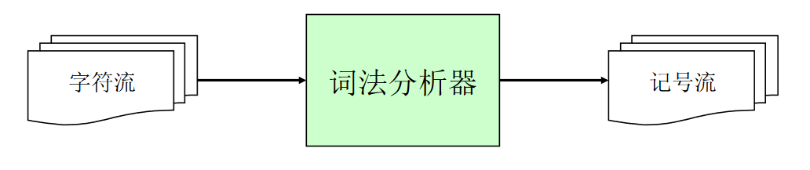


## 记号的数据结构定义

```cpp
enum kind {IF, LPAREN, ID, INTLIT, ...}; // 对所能识别记号的分类

struct token{
  enum kind k;
  char *lexeme; 	// 单词对应的值
};
```

假如分析`if(x > 5)`：

```cpp
token { k = IF, lexeme = 0 };
token { k = LPAREN, lexeme = 0 };
token { k = ID, lexeme = "x" };
...
```

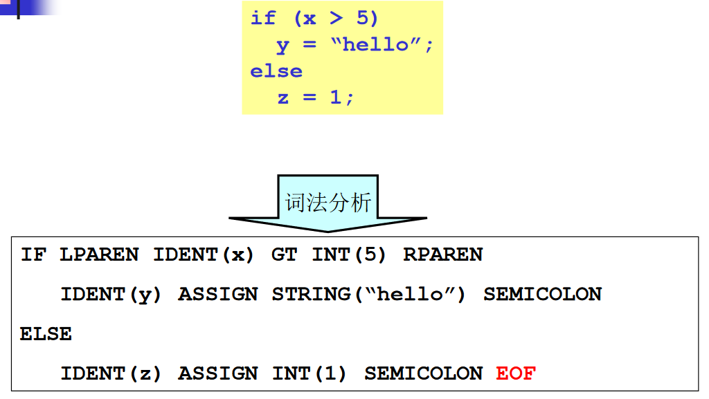


## 词法分析器的实现

- 手工编码实现法
  - 相对复杂、容器出错
  - 目前非常流行的实现方法，GCC、LLVM...
- 词法分析器的生成器
  - 可快速原型、代码量少
  - 较难控制


### 手动构造

假如需要对关系运算符`<=` `<>` `<` `=` `>=` `>`做分析。


对应转移图的算法：

```cpp
token nextToken()
    c = getChar();
	switch (c)
	    case '<':
			c = getChar();
			switch (c)
        		case '=': return LE; // <=
				case '>': return NE; // <>
				default : rollback(); return LT;
        case '=': return EQ; // =
        case '>': 
        	c = getChar();
        	switch(c);
        	...
```


下面是标识符的转移图和对应的算法：


#### 关键字和标识符


标识符：以字母和下划线开头、后跟0个或多个字母、下划线、数字。

关键字：if、while、else...

关键字属于标识符，可以在识别标识符的基础上对关键字单独判断处理：


另一种处理关键字的方法是使用关键字表算法：


### 自动生成

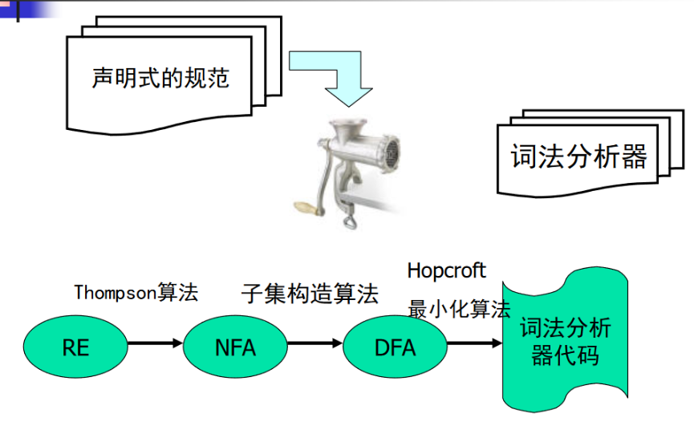

自动生成不需要手动编码词法分析器的代码，而是声明规范，然后使用一些工具如：lex、flex、jlex等生成目标的词法分析代码。


#### 正则表达式

正则表达式用于对规范的声明。

对给定的字符集$\sum={c1, c2, \cdots,cn}$，归纳定义如下：

- 空串$\varepsilon$是正则表达式
- 对于任意$c\in\sum$，$c$是正则表达式
- 如果M和N是正则表达式，则以下也是正则表达式
  - 选择	$M|N = \{M, N\}$
  - 连接    $MN=\{mn|m\in M,n \in N\}$
  - 闭包    $M^*=\{\varepsilon,M,MM,MMM,\cdots\}$


如何使用正则表达式表示以下例子：

- 标识符

  标识符：以字母或下划线开头，后跟零个或多个字母、数字、下划线。

  26个大写字母、26个小写字母、1个下划线、10个字母，一共63个字符。

  $([a-z]|[A-Z]|\_)([a-z]|[A-Z]|\_|[0-9])^*$

- C语言中的无符号整数

  十进制整数：或者是0，或者是1到9开头，后跟零个或多个0到9。

  $(+|-)?(0|[1-9][0-9]^*)$

  


使用语法糖简化构造


#### 有限状态自动机（FA）

有限自动机描述词法分析的输出词法分析器的结果。


##### 确定的有限状态自动机（DFA）

转移函数对应的一个状态。


$\sum=\{a,b\}，S=\{0,1,2\}$

$q0=0，F=\{2\}$

$\delta=\{$

$(q0,a)\rightarrow q1, (q0,b)\rightarrow q0$

$(q1,a)\rightarrow q2, (q1,b)\rightarrow q1$

$(q2,a)\rightarrow q2, (q2,b)\rightarrow q2$

$\}$


可以把DFA看作有向图，它的边和点都包含一定信息，比如边上的转移字符，和点的状态。


一个串可以被接受，就是经过转移函数之后，能够到达终止状态F。


##### 非确定的有限状态自动机（NFA）

转移函数对应的多个状态，这样串可能由多个状态，只要存在一个走到终止状态，那么它就是可接受的。


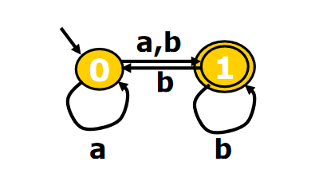

$\delta=\{$

$(q0,a)\rightarrow \{q0,q1\}$

$(q0,b)\rightarrow q1$

$(q1,b)\rightarrow \{q0,q1\}$

$\}$


#### RE到NFA（Thompson算法）

Thompson算法用于将正则表达式到NFA的转换。

Thompson基于对RE的结构做构造，它是一个递归算法容易实现。


- 对基本的RE直接构造

  

- 对复合的RE递归构造。

  - 连接 $e1e2$

    首先分别递归构造$e1$和$e2$的NFA然后使用$\varepsilon$进行连接。

    

  - 选择 $e1|e2$

    

  - 闭包 $e1^*$

    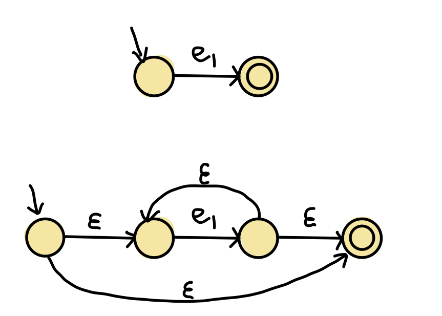


例子：$a(b|c)^*$的NFA:


#### NFA到DFA（子集构造法）

子集构造算法又叫工作表算法。

- 不动点算法，子集有上界，n个元素的幂集最多有$2^n$个
- 时间复杂度最坏为$O(2^n)$，但是实际上不常发生，因为不是每个子集都会出现。


$\varepsilon-闭包的计算$：

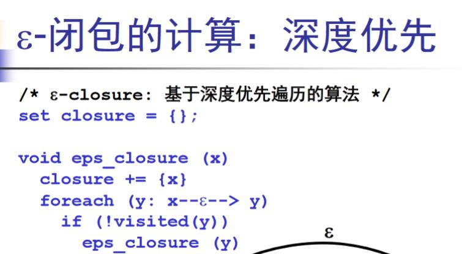


```cpp
q0 <- eps_closure(n0) // 求n0的epsilon闭包，作为起始集合q0
Q <- {q0} // 将q0加入到DFA集合Q中
workList <- q0 // 将q0加入到工作列表中，队列实现
while (workList != []) // 工作列表不为空
    remove q from workList	// 取出第一个集合q并删除它
    foreach (character c) // 遍历字符集中的字符，进行状态转移
        t <- eps_closure(delta(q, c)) // delta首先求q在字符c的转换得到的状态，然后求它的epsilon闭包
        D[q,c] <- t // 在DFA记录状态转移
        if (t not in Q)	// 如果集合t没有出现过
            add t to Q and workList // 加入到DFA集合Q中和工作列表workList中
```


#### DFA的最小化（Hopcroft算法）

Hopcroft对DFA进行操作生成一个优化的DFA，最终输出为词法分析器代码。

- 不动点算法，子集由上界，n个元素的幂集最多有$2^n$个
- 时间复杂度最坏为$O(2^n)$，但是实际上不常发生，因为不是每个子集都分裂。

```cpp
// 基于等价类的思想
split(S) // 切分S集合
    foreach (character c) // 遍历每个字符
    	if (c can split S)	// 如果c可以切分S
            split S into T1, ..., Tk // 将S切分为多个子集
hopcroft()
	split all nodes into N, A // 所有节点分为非接受状态、接受状态状态
	while (set is still changes) // 如果集合仍可以切分
        split(s) // 对集合进行切分
```


#### DFA的代码表示

DFA可以看作是一个有向图，DFA的代码表示有多种：

- 哈希表

- 转移表（类似邻接矩阵）

  

  转移表遵循**最长匹配原则**

  

  如果存在`if`和`ifif`两个关键字，在对`ifif`进行匹配时，他会按照最长的匹配结果。

  对于`ifii`当匹配到q3时出现错误，因为不存在q3到`i`的转移，这是会rollback()q2，返回`if`，所以跳转表在识别的识别的时候，每次都是在一个可接受状态的基础上进行识别，如果有新的可接受状态就清空之前的栈，然后更新；如果存在错误，就回滚到最近的一个可接受状态上。

- 跳转表

  

  跳转表使用goto跳转语句，把每个转移处理写到一块，然后根据读取的字符进行跳转。

  - 跳转表不需要存储所有的状态，因此可以节省空间。

  - 每个状态都在一个块语句中，性能要高于转移表。

  

  跳转表和转移表的选择需要对时间和空间的权衡。


## 语法分析

### 语法分析的任务


语法分析的错误处理：


语法树的构建


- 数学理论：上下文无关文法（CFG）
- 自顶向下分析
  - 递归下降分析算法（预测分析算法）
  - LL分析算法
- 自底向上分析
  - LR分析算法


### 上下文无关文法


上下文无关文法G是一个四元组$G = (T, N, P, S)$。

- T是终结符集合
- N是非终结符集合
- P是一组产生式规则，每条规则形式为：$X\rightarrow \beta_1 \beta_2 \cdots \beta_n$，其中$X \in N, \beta_i \in(T \bigcup N)$
- S是唯一开始符号（非终结符），$S \in N$


**推导**

- 给定文法G，从G的开始符号S开始，用产生式的右部替换左侧的非终结符。

- 此过程不断重复，直到不出现非终结符为止

- 最终串称为句子


**最左推导和最右推导**

最左推导：每次总是选择最左侧的符号进行替换。

$\begin{align}
S & \rightarrow NVN\\
  & \rightarrow sVN\\ 
  & \rightarrow seN\\
  & \rightarrow seg\\
\end{align}$

 $\begin{align}
S & \rightarrow NVN\\
  & \rightarrow NVg\\ 
  & \rightarrow Neg\\
  & \rightarrow seg\\
\end{align}$


**语法分析**

给定文法G和句子s，语法分析就是要回答问题：是否存在对句子s的推导。


### 分析树和二义性文法

**推导和分析树**


**分析树**

推导可以表达成树状结构，和推导所用的顺序无关（最左、最右、其他）

- 树中的每个内部节点代表非终结符
- 每个叶子节点代表终结符
- 每一步推导代表如何从双亲节点生成它的直接孩子节点


**二义性文法**

给定文法G，如果存在句子S，它有两棵不同的分析树，那么称G是二义性文法

从编译器角度，二义性文法存在问题：

- 同一个程序会有不同的含义
- 因此程序运行的结果不是唯一的

解决方法就是：**文法的重写**。


### 自顶向下分析

语法分析：给定文法G和句子s，回答s是否能够从G中推导出来。

基本算法思想：从G的开始符号出发，随意推导出某个句子t，比较t和s。

- t == s，则回答是。
- t != s，需要回溯进一步判断。

因为这是从开始符号出发推句子，因此称为自顶向下分析，对应于分析树自顶向下的构造顺序。

```cpp
tokens[]; // 保存所有的tokens
i = 0; // 指向tokens
stack = [S]; // S是开始符号
while (stack != [])
    if (stack[top] is a terminal t) // 如果栈顶元素是终结符t
        if (t == tokens[i++]) // 终结符和tokens指向的相同
            pop();
		else backtrack(); // 否则进行回滚
	else if (stack[top] is a nonterminal T) // 栈顶元素是非终结符T
        pop();
		push(the next right hand side of T); 将非终结符T的右部压栈，如果有多个要逆序压栈
```

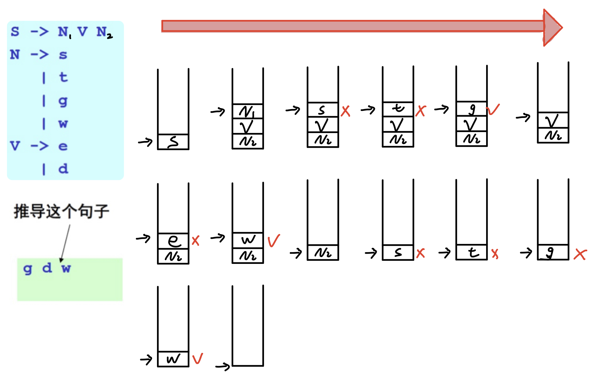

该算法用到回溯，不容易分析算法的效率，编译器可能要处理大量的程序，例如成千上万的内核程序，因此实际需要线性时间的算法，避免回溯，从而引出两种算法：

- 递归下降分析算法
- LL(1)分析算法


对于上面的算法，最容易想到减少回溯的方法是，在每次对右部的选取，可以根据token的值进行选取，这就是**前向符号**来避免回溯，但是如果存在多个右部的前缀相同的情况，这时候可能需要向前看两步或多步。


#### 递归下降分析算法

递归下降算法又称为预测分析。

- 分析高效（线性时间）
- 容易实现（方便手工编码）
- 错误定位和诊断信息准确
- 被很多开源和商业的编译器所采用，GCC 4.0、LLVM...

算法思想：

- 采用分治的思想，每个非终结符构造一个分析函数。
- 用前看符号指导产生式规则的选择。


对于上面的推导，算法可以这样写：

```cpp
parse_S()
    parse_N();
    parse_V();
    parse_N();

parse_N()
    token = tokens[i++];
	if (token == s || token == t || 
        token == g || token == w)
        return;
	error("...");

parse_V()
    token = tokens[i++];
	if (token == e || token == d)
        return;
	error("...");
```


**一般的算法框架：**

```cpp
parse_X()
    token = nextToken();
	switch (token):
	case ...: // B11 ... B1i
	case ...: // B21 ... B2j
	case ...: // B31 ... B3k
	...
    default: error("...")
```


**尝试对算术表达式的递归下降分析：**


根据上面的框架，很容易写出这样的代码：

```cpp
parse_E()
    token = tokens[i++];
	if (token == num)
    	? // E+T or T
    else error("...")
```

这样在分析E时，不知道下一步是E+T还是T。

通常我们可以根据文法的特殊性和性质来避免这种情况。

对于上面的算术表达式的文法，可以发现E和T都有一定的模式，$E \rightarrow T+\cdots+T$，$T \rightarrow F*F*\cdots *F$，根据这样的特性，我们可以对上面代码进行改进。

```cpp
parse_E()
    parse_T();
    token = tokens[i++];
	while (token == +)
   		parse_T();
	token = tokens[i++];

parse_T()
    parse_F();
	token = tokens[i++];
	while (token == *)
        parse_F();
        token = tokens[i++];

parse_F();
	token = tokens[i++];
	switch (token):
	case ...:
	...	
	default: error("...")
```


#### LL(1)分析算法

从左（L）向右读入程序，最左（L）推导，采用一个（1）前看符号。

- 分析高效（线性时间）
- 错误定位和准段信息准确
- 很多开源或商业的生成工具，ANTLR...

算法基本思想：表驱动的分析算法


通过语法分析器自动生成器生成分析表，来指导语法分析器的分析栈的操作。


分析表对分析栈的指导，在压栈的时候选择正确的右部进行压栈，这样就不需要进行回溯了。


分析表的构成需要用到**FIRST集，Follow集，nullable集**。


#### NULLBALE集合

非终结符X数据集合NULLABLE，当且仅当：

- $X \rightarrow \varepsilon$
- $X \rightarrow Y_1 \cdots Y_n$，$Y_1 \cdots Y_n$是n个非终结符，且都属于NULLABLE集


#### FIRST集的不动点算法

FIRST(N) = 从非终结符N开始推导得出句子的所有可能终结符集合。

对于$N \rightarrow a...$   $FRIST(N) \bigcup=\{a\}$

对于$N \rightarrow M...$   $FRIST(N) \bigcup= FIRST(M)$


使用FIRST来构造分析表：

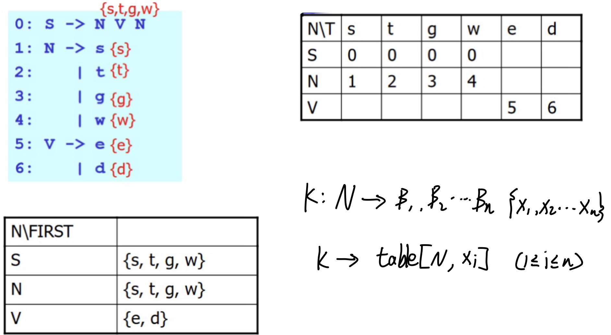


因为存在NULLABLE集，所以可以对FIRST算法进一步改造：


```cpp
foreach (nonterminal N) // 初始化所有的FIRST为空
	First(N) = {};

while (some set is changing) // 如果集合存在变化
    foreach (production p: N -> B1 ... Bn) // 遍历每个产生式
    	foreach (Bi from B1 upto Bn) // 遍历产生式每个右部
            if (Bi == a...) // 如果是终结符开头
                FIRST(N) U= {a};
				break;
			if (Bi == M...) // 如果是非终结开头
                FIRST(N) U= FIRST(M);
				if (M is not in NULLABLE)
                    break;
```


#### FOLLOW集的不动点算法

```cpp
foreach (nonterminal N) // 初始化所有的FOLLOW为空{}
    FOLLOW(N) = {}

while (some set is changing)
    foreach (production p: N->B1 .. Bn) // 遍历每个产生式
    	temp = FOLLOW(N)
    	foreach (Bi from Bn downto B1) // 逆序
    		if (Bi == a...) // 终结符
                temp = {a}
			if (Bi == M...) // 非终结符
                FOLLOW(M) U= temp;
				if (M is not NULLABLE) // M不是NULL集
                    temp = FIRST(M)
                else temp U= FIRST(M) // M是NULL集
```


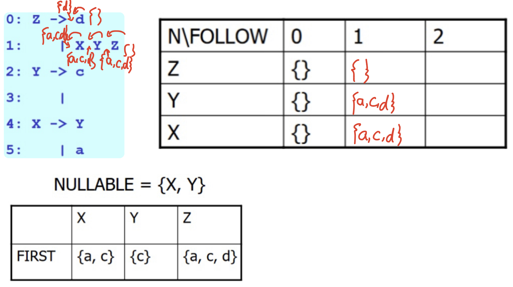


将FIRST推广到一个产生式，计算一个产生式的FIRST集：

```cpp
foreach (production p)
    FIRST_S(p) = {}

calculte_FIRST_S(production p: N->B1 ... Bn)
    foreach (Bi from B1 to Bn) // 遍历产生式每个右部
    	if (Bi == a...) // 终结符
            FIRST_S(p) U= {a}
			return;
		if (Bi == M...) // 非终结符
            FIRST_S(p) U= FIRST(M)
			if (M is not NULLABLE)
                return;
	FIRST_S(p) U= FOLLOW(N) // 如果改产生式所有右部B1...Bn都为空，则FIRST为FOLLOW(N)
```


使用FIRST_S构造LL(1)分析表。


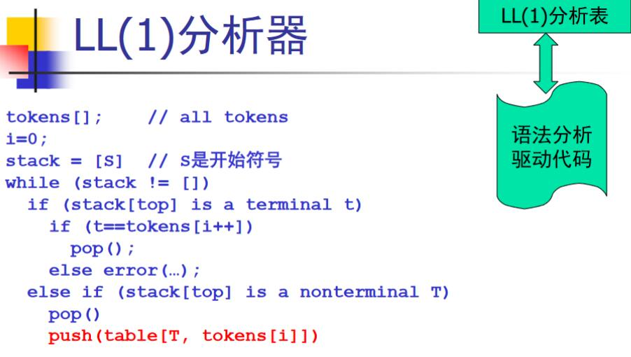


#### LL(1)分析表的冲突：


消除分析表的冲突有两种方法：

- 消除左递归

  

  

- 提取公共项目

  


### 自底向上分析

自底向上分析是最右推导的逆过程


**点记号**：为了方便标记语法分析器已经读入了多少输入，我们可以引入一个点记号。


观察发现点记号的左部是一个栈结构，取出栈顶的一个右部进行归约。

- **移进**：一个记号到栈顶上

- **规约**：栈顶上的n个符号（某产生式的右部）到左部的非终结符

  对于产生式：$A \rightarrow \beta_1 \cdots \beta_n$，如果$\beta_n \cdots \beta_1$在栈顶，则弹出$\beta_n \cdots \beta_1$，压入A进行归约。

#### LR(0)分析算法 


引入$S'$是为了防止起始符号出现产生式的右部，$显式地表示终止状态。

首先是状态1，通过点记号右移移入x走到状态2，同时将x和2压入栈中。经过一系列的转换之后，当栈中出现产生式的右部，则可以发生归约，并将产生式的左部压入栈中，直到出现接受状态（$）为止。


**LR(0)分析表**


s2（shift2）：移进x，走到状态2。

r2（reduce2）：按照2号产生式进行归约。

goto：当发生归约将字符和状态弹出栈之后，根据栈顶的状态找到下一个状态。

**LR(0)分析算法**

```cpp
stack = []
push($);	// EOF
push(1);	// 1: 初始状态
while (true)
    token t = nextToken();
	state s = stack[top];
    if (ACTION[s, t] == "si") // 移进
        push(t); push(i);
	else if (ACTION[s, t] == "rj") // 归约
        pop(the right hand of production "j: X -> B") // 弹出产生式的右部（包括状态）
        state s = stack[top];
        push(X); push(GOTO[s, X]); // 压入左部，并找到下个状态
	else error(...)
```


**LR(0)分析表构造算法**


$D=goto(C,x)$对应状态的转移，产生一些新的项目集。


**LR(0)分析算法的问题：**


#### SLR分析算法


#### LR(1)分析算法


#### LALR分析算法

把LR(1)中产生的类似项目，如状态[8,10]或状态[5,11]进行合并。


#### 对二义性文法的处理

二义性文法无法使用LR算法分析，不过有几类二义性文法很容易理解，因此可以特殊处理。

- 优先级
- 结合性
- 悬空else


对于*和+我们可以根据优先级和结合性进行移进或归约。

*和+都是左结合，当后面为+号时，应该归约，因为+为左结合；如果后面为\*，应该移进，因为\*优先级高。


#### LR(1)分析工具


Yacc中规定大写字母为终结符，小写字母为非终结符。

一个简单的判断加法的语法分析器。

```bash
bison test.y ->test.tab.c
gcc test.tab.c -> a.out
./a.out
```


```cpp
// test.y
%{
	#include <stdio.h>
	#include <stdlib.h>
	int yylex(); // 声明YACC的yylex()
	void yyerror();
%}


%left '+'

%%

lines: line
	 | line lines
;

line : exp '\n';

exp: n
   | exp '+' exp
;   

n: '1' | '2' | '3' | '4' | '5' | '6' | '7' | '8' | '9' | '0';

%%

int yylex() 
{
	return getchar();
}

void yyerror(char *s) 
{
	fprintf(stderr, "%s\n", s);
	return;
}

int main(int argc, char **argv) 
{
	yyparse(); // 语法分析
	return 0;
}
```


### 语法制导翻译


```cpp
%{
	#include <stdio.h>
	#include <stdlib.h>
	int yylex(); // 声明YACC的yylex()
	void yyerror();
%}


%left '+'

%%

lines: line				 
	 | line lines
;

line : exp '\n'  {printf("value = %d\n", $1);}
;	 

exp: n				{$$ = $1;}
   | exp '+' exp	{$$ = $1 + $3;}
;   

n: '1' {$$ = 1;}
 | '2' {$$ = 2;}
 | '3' {$$ = 3;}
 | '4' {$$ = 4;}
 | '5' {$$ = 5;}
 | '6' {$$ = 6;}
 | '7' {$$ = 7;}
 | '8' {$$ = 8;}
 | '9' {$$ = 9;}
 | '0' {$$ = 0;}
;

%%

int yylex() 
{
	return getchar();
}

void yyerror(char *s) 
{
	fprintf(stderr, "%s\n", s);
	return;
}

int main(int argc, char **argv) 
{
	yyparse(); // 语法分析
	return 0;
}
```


### 抽象语法树


分析树编码了句子的推导过程，但是包含了一些不必要的信息，对于表达式，编译器只需要知道运算符和运算数，优先级和结合性已经在语法分析阶段处理过了。

具体语法：是语法分析器使用的语法，必须适合于语法分析，如各种分隔符，消除左递归，提取公因子等

抽象语法：是用来表达语法结构的内部表示，现代编译器一般采用抽象语法作为前端（词法/语法分析器）和后端（代码生成）的接口

早期的编译器不采用抽象语法树数据结构，直接在语法制导翻译中生成代码。

抽象语法树作为语法分析的输出，可以更好的系统的支持，简化编译器的设计。


**抽象语法树的自动生成**

在语法动作中加入生成语法树的片段，产生式归约的时候，自底向上构造整棵树。从叶子到根。


抽象语法树必须仔细设计

抽象语法树是编译器前端和后端的接口，程序一段被转换成抽象语法树，则源代码及被丢弃，后续的阶段只处理抽象语法树。

所以抽象语法树必须编码足够多的源代码信息，例如必须编码每个语法结构在源代码中的位置（文件、行号、列号），这样后续检查阶段就能精确的报错，或者获取程序的执行剖面。


## 语义分析


语义分析也称为类型检查、上下文相关分析。

负责检查程序（抽象语法树）的上下文相关的属性：这是具体语言相关的典型的情况包括：

- 变量使用前先进行声明
- 每个表达式都有合适的类型
- 函数调用和函数的定义一致


#### 符号表

用来存储程序中的变量相关信息：

- 类型
- 作用域
- 访问控制信息

程序中的变量规模会很大，必须非常高效。

符号表可以使用哈希表等数据结构实现，查找为O(1)时间，为了节约空间，也可以使用红黑树等平衡树，查找O(logN)。

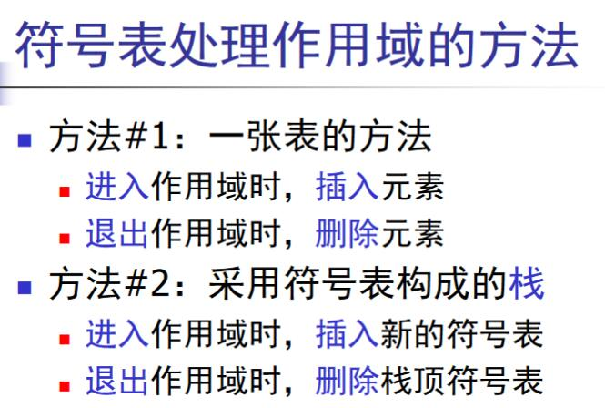


#### 语义检查


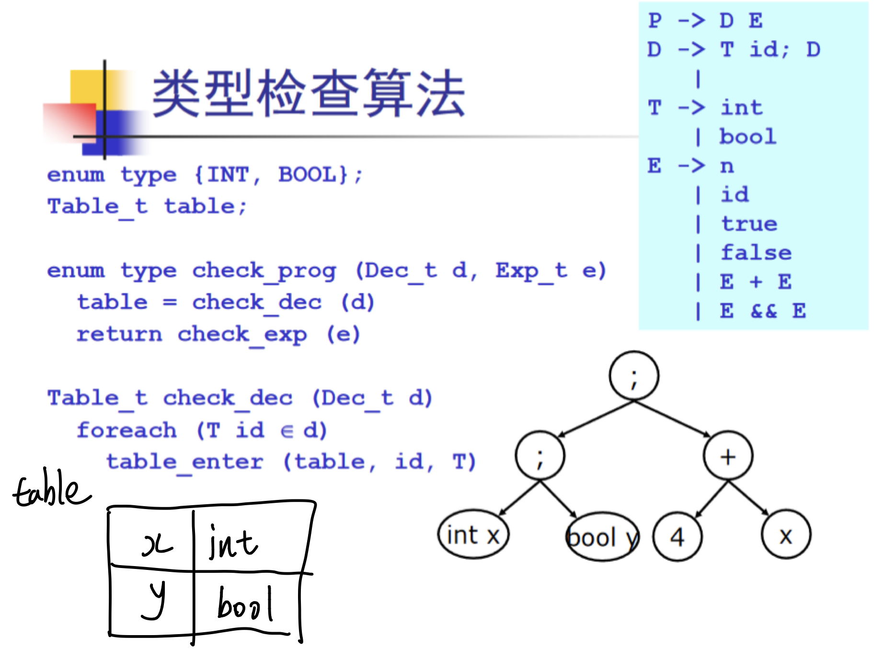


#### 其他问题

语义分析中要考虑的其他问题

- 类型相容性
- 错误诊断
- 代码翻译

类型检查问题往往归结为判断两个类型是否相等t1==t2?

在实际的语言中，这往往是一个需要谨慎处理的复杂问题。

- 名字相等vs结构相等
  - 对采用名字相等的语言，可直接比较
  - 对采用结构相等的语言，需要递归比较各个域
- 面向对象的继承
  - 需要维护类型间的继承关系


要给出尽可能准确的错误信息

要给出尽可能多的错误信息

- 从错误中进行恢复

要给出尽可能准确的出错为止

- 程序代码的为止信息要从前端保留并传递过来


# 总结

## 自顶向下分析算法

自顶向下分析算法的思想就是，使用给定的文法G尝试的出推导一个句子，然后比较这个句子和所希望的句子是否相同，如果相同则表示句子合法，如果不同，需要回溯进一步推导，当所有可能的句子都推导一遍之后，都没有所希望的句子，就可以判断句子不合法。

自顶向下的算法涉及到回溯效率很低，为了减少回溯的发生，最简单的方法就是使用前看符号，去指导句子的推导，所以在这基础上引出了**递归下降分析算法**和**LL(1)分析算法**。

**递归下降算法**是分治思想，为每一个非终结符构造一个分析函数，去判断它是否存在对应的右部字符。递归算法容器存在冲突，可以对文法的特性来避免这一情况，

**LL(1)分析算法**:是从左(L)向右读入程序，最左(L)推导，采用一个前看符号(1)，是一个表驱动的分析算法，使用分析表来指导语法分析器分析栈，指导压栈操作，压入正确的右部，从而避免回溯。


## 自底向上分析算法

自底向上分析算法的想想是，将句子按照给定文法进行归约，如果能归约到起始状态S，则表示句子合法。

从形式上看，自底向上算法是一个最右推导的逆过程。