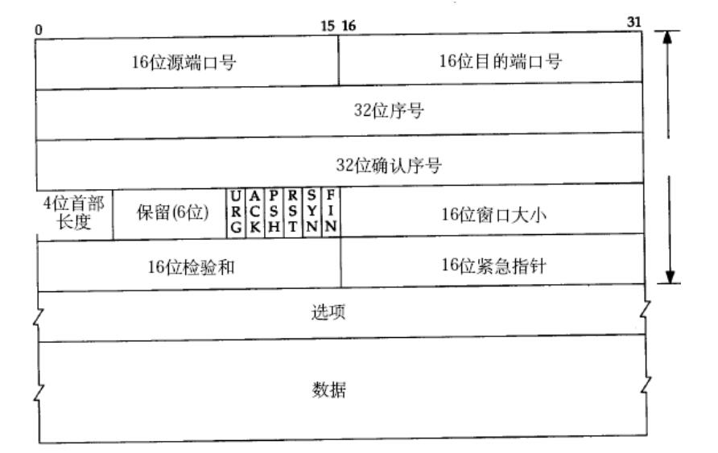
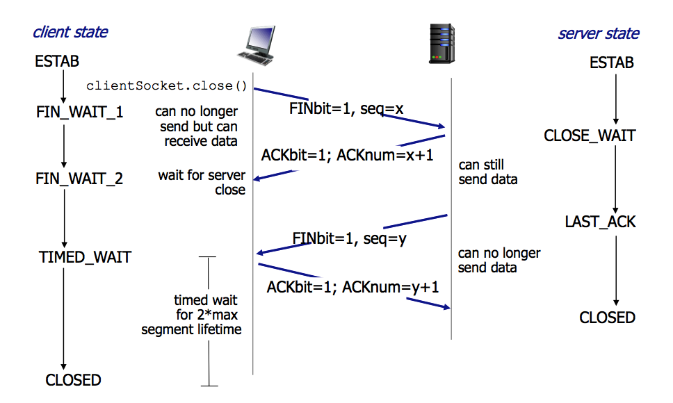

## OSI 七层模型


1. 物理层：主要定义物理设备标准，如网线的接口类型、光纤的接口类型、各种传输介质的传输速率等。它的主要作用是传输比特流（就是由1、0转化为电流强弱来进行传输，到达目的地后再转化为1、0，也就是我们常说的数模转换与模数转换）。这一层的数据叫做比特。

2. 数据链路层：定义了如何让格式化数据以帧为单位进行传输，以及如何让控制对物理介质的访问。这一层通常还提供错误检测和纠正，以确保数据的可靠传输。如：串口通信中使用到的115200、8、N、1

3. 网络层：在位于不同地理位置的网络中的两个主机系统之间提供连接和路径选择。Internet的发展使得从世界各站点访问信息的用户数大大增加，而网络层正是管理这种连接的层。

4. 传输层：定义了一些传输数据的协议和端口号（WWW端口80等），如：TCP（传输控制协议，传输效率低，可靠性强，用于传输可靠性要求高，数据量大的数据），UDP（用户数据报协议，与TCP特性恰恰相反，用于传输可靠性要求不高，数据量小的数据，如QQ聊天数据就是通过这种方式传输的）。 主要是将从下层接收的数据进行分段和传输，到达目的地址后再进行重组。常常把这一层数据叫做段。

5. 会话层：通过传输层(端口号：传输端口与接收端口)建立数据传输的通路。主要在你的系统之间发起会话或者接受会话请求（设备之间需要互相认识可以是IP也可以是MAC或者是主机名）。

6. 表示层：可确保一个系统的应用层所发送的信息可以被另一个系统的应用层读取。例如，PC程序与另一台计算机进行通信，其中一台计算机使用扩展二一十进制交换码(EBCDIC)，而另一台则使用美国信息交换标准码（ASCII）来表示相同的字符。如有必要，表示层会通过使用一种通格式来实现多种数据格式之间的转换。
7. 应用层：是最靠近用户的OSI层。这一层为用户的应用程序（例如电子邮件、文件传输和终端仿真）提供网络服务。


## TCP/IP四层模型


## 数据包封装

不同的协议层对数据包有不同的称谓，在传输层叫做段（segment），在网络层叫做数据报（datagram），在链路层叫做帧（frame）。数据封装成帧后发到传输介质上，到达目的主机后每层协议再剥掉相应的首部，最后将应用层数据交给应用程序处理。


## 以太网帧


的源地址和目的地址是指网卡的硬件地址（也叫MAC地址），长度是48位，是在网卡出厂时固化的。可在shell中使用ifconfig命令查看，“HWaddr 00:15:F2:14:9E:3F”部分就是硬件地址。

协议字段有三种值，分别对应IP、ARP、RARP。帧尾是CRC校验码。
以太网帧中的数据长度规定最小46字节，最大1500字节，ARP和RARP数据包的长度不够46字节，要在后面补填充位。最大值1500称为以太网的最大传输单元（MTU），不同的网络类型有不同的MTU，如果一个数据包从以太网路由到拨号链路上，数据包长度大于拨号链路的MTU，则需要对数据包进行分片（fragmentation）。ifconfig命令输出中也有“MTU:1500”。注意，MTU这个概念指数据帧中有效载荷的最大长度，不包括帧头长度。


## ARP数据包


在网络通讯时，源主机的应用程序知道目的主机的IP地址和端口号，却不知道目的主机的硬件地址，而数据包首先是被网卡接收到再去处理上层协议的，如果接收到的数据包的硬件地址与本机不符，则直接丢弃。因此在通讯前必须获得目的主机的硬件地址。ARP协议就起到这个作用。源主机发出ARP请求，询问“IP地址是192.168.0.1的主机的硬件地址是多少”，并将这个请求广播到本地网段（以太网帧首部的硬件地址填FF:FF:FF:FF:FF:FF表示广播），目的主机接收到广播的ARP请求，发现其中的IP地址与本机相符，则发送一个ARP应答数据包给源主机，将自己的硬件地址填写在应答包中。

每台主机都维护一个ARP缓存表，可以用arp -a命令查看。缓存表中的表项有过期时间（一般为20分钟），如果20分钟内没有再次使用某个表项，则该表项失效，下次还要发ARP请求来获得目的主机的硬件地址。想一想，为什么表项要有过期时间而不是一直有效？

源MAC地址、目的MAC地址在以太网首部和ARP请求中各出现一次，对于链路层为以太网的情况是多余的，但如果链路层是其它类型的网络则有可能是必要的。硬件类型指链路层网络类型，1为以太网，协议类型指要转换的地址类型，0x0800为IP地址，后面两个地址长度对于以太网地址和IP地址分别为6和4（字节），op字段为1表示ARP请求，op字段为2表示ARP应答。


## IP数据包


IP数据报的首部长度和数据长度都是可变长的，但总是4字节的整数倍。对于IPv4，4位版本字段是4。4位首部长度的数值是以4字节为单位的，最小值为5，也就是说首部长度最小是4x5=20字节，也就是不带任何选项的IP首部，4位能表示的最大值是15，也就是说首部长度最大是60字节。

8位TOS字段有3个位用来指定IP数据报的优先级（目前已经废弃不用），还有4个位表示可选的服务类型（最小延迟、最大?吐量、最大可靠性、最小成本），还有一个位总是0。总长度是整个数据报（包括IP首部和IP层payload）的字节数。
每传一个IP数据报，16位的标识加1，可用于分片和重新组装数据报。
3位标志和13位片偏移用于分片。
TTL（Time to live)是这样用的：源主机为数据包设定一个生存时间，比如64，每过一个路由器就把该值减1，如果减到0就表示路由已经太长了仍然找不到目的主机的网络，就丢弃该包，因此这个生存时间的单位不是秒，而是跳（hop）。
协议字段指示上层协议是TCP、UDP、ICMP还是IGMP。然后是校验和，只校验IP首部，数据的校验由更高层协议负责。IPv4的IP地址长度为32位。


## UDP数据报

UDP是不面向连接、不可靠的用户数据报协议。开销小，首部8字节，存在丢包，提供一对一、一对多、多对一、多对多的通信。


```c

struct UDP_HEADER 
{
 short m_sSourPort;        　　　　　　// 源端口号16bit
 short m_sDestPort;       　　　　　　 // 目的端口号16bit
 short m_size;						 // 长度16bit
 short m_sCheckSum;        　　　　　 // 检验和16bit
}
```


## TCP数据包

TCP是面向连接的基于字节流的可靠传输控制协议，需要三次握手，确认重传等连接。有延迟、实时性差。TCP的报文开销大，首部有20字节。



```c
struct TCP_HEADER 
{
 short m_sSourPort;        　　　　　　// 源端口号16bit
 short m_sDestPort;       　　　　　　 // 目的端口号16bit
 unsigned int m_uiSequNum;       　　// 序列号32bit
 unsigned int m_uiAcknowledgeNum;  // 确认号32bit
 short m_sHeaderLenAndFlag;      　　// 前4位：TCP头长度；中6位：保留；后6位：标志位
 short m_sWindowSize;       　　　　　// 窗口大小16bit
 short m_sCheckSum;        　　　　　 // 检验和16bit
 short m_surgentPointer;      　　　　 // 紧急数据偏移量16bit
}
```


## 滑动窗口


发送端是一K一K地发送数据，而接收端的应用程序可以两K两K地提走数据，当然也有可能一次提走3K或6K数据，或者一次只提走几个字节的数据。也就是说，应用程序所看到的数据是一个整体，或说是一个流（stream），在底层通讯中这些数据可能被拆成很多数据包来发送，但是一个数据包有多少字节对应用程序是不可见的，因此TCP协议是面向流的协议。而UDP是面向消息的协议，每个UDP段都是一条消息，应用程序必须以消息为单位提取数据，不能一次提取任意字节的数据，这一点和TCP是很不同的。


## 拥塞控制

- **慢开始：**开始拥塞窗口cwnd为1，收到对方的ack之后，$cwnd=cwnd\times2$。
- **拥塞避免：**让拥塞窗口缓慢的增大，每经过一个RTT就把发送方的拥塞窗口加1，而不是加倍，这样拥塞窗口就是线性缓慢增加，比慢开始的增长速率缓慢的多。
- **慢开始门限(ssthresh)：**为了防止拥塞窗口增长过大引起网络拥塞，还需要设置一个慢开始门限
  - 拥塞窗口<慢开始门限时，使用慢开始算法
  - 拥塞窗口>=慢开始门限时，使用拥塞避免算法
- **快重传：**接收方每收到一个报文后，就立即发出重复确认，而不要等到自己发送数据时才进行捎带确认。而发送方只要一连收到**三个重复确认就应当立即重传**对方尚未接受到的报文，而不必等待为报文设置的重传计时器到期（RTO）。
- **快恢复：**与快重传配合使用，当发送方连续收到三个重复确认的时候，将ssthresh和cwnd调整为当前窗口的一半，并开始拥塞避免算法。

首先进行慢开始算法，当cwnd达到ssthresh之后，开始拥塞避免算法，如果遇到RTO表示可能出现拥塞，则将ssthresh设置为cwnd的一半，cwnd=1重新开始满开始算法。

遇到RTO不一定是网络拥塞，有可能是中间路由丢包，所以使用快重传机制，快速对丢包重传，可以提高整个网络的吞吐量20%左右。

发送方收到3个重复确认，知道丢失了个别报文，于是不启动慢开始，而是执行快恢复，有的快恢复把拥塞窗口cwnd设置的再大一些，比如ssthresh+3。


## 三次握手


1. 客户端发送SYN，指明客户端的初始序列号ISN(a)。
2. 服务端发送自己的SYN作为应答，同时指明之际的ISN(b)，为了确认客户端的SYN，将ISN(a)+1作为ACK确认。
3. 为了确认服务端的SYN，客户端发送ISN(b)+1作为ACK确认发送给服务端。


## 四次挥手




1. 客户端发送FIN，seq = K
2. 服务端ACK = K + 1，同时告诉上层应用程序另一端发起关闭。
3. 服务端发送FIN，seq = y
4. 客户端发送确认ACK = y + 1


**为什么需要三次握手、四次挥手**？

三次握手建立连接的目的是确认客户端和服务端双方的通信能力，服务端收到客户端的SYN，表示服务端的接受能力和客户端的发送能力正常，客户端收到服务端的ACK，表示客户端的接受、发送能力和服务端的接受、发送能力正常，服务端收到客户端的ACK，表示服务端的发送能力和客户端的接受能力正常，从而双方的通讯正常。

四次挥手，当服务端给收到客户端的FIN，表示客户端终止连接，不再往服务器发送数据，但是服务端这边可能还有数据没有发送完，所以服务端只能先发送一个ACK确认FIN，当应用层决定断开连接之后，再发送FIN断开连接。

三次握手的ACK和SYN可以合在一起发送，四次挥手的FIN和ACK不能放到一起。


**connect、accept在三次握手的体现**

- 客户端调用connect()发送SYN到服务器，客户端处于SYN_SEND状态
- 服务端accept()接受SYN之后，发送ACK和SYN，服务器处于SYN_RECV状态
- 客户端接受到SYN后发送ACK给服务端，connect()返回（期间处于阻塞状态），客户端处于ESTABLISHED状态
- 服务端接受到ACK后accept()返回，服务端处于ESTABLISHED状态


## time_wait

主动断开连接的一方，在发送完最后一个ack之后，要等待2MSL之后才能断开连接。

2MSL (Maximum Segment Lifetime) TIME_WAIT状态的存在有两个理由：

- **让4次挥手关闭流程更加可靠**；4次挥手的最后一个ACK是由主动关闭方发送出去的，若这个ACK丢失，被动关闭方会再次发一个FIN过来。若主动关闭方能够保持一个2MSL的TIME_WAIT状态，则有更大的机会让丢失的ACK被再次发送出去。
- 如果主动关闭方不进入TIME_WAIT，那么在主动关闭方对被动关闭方FIN包的ACK丢失了的时候，被动关闭方由于没收到自己FIN的ACK，会进行重传FIN包，这个FIN包到主动关闭方后，由于这个连接已经不存在于主动关闭方了，这个时候主动关闭方无法识别这个FIN包，协议栈会认为对方疯了，都还没建立连接你给我来个FIN包？，于是**回复一个RST包给被动关闭方，被动关闭方就会收到一个错误(**我们见的比较多的：connect reset by peer，这里顺便说下 Broken pipe，在收到RST包的时候，还往这个连接写数据，就会收到 Broken  pipe错误了)，原本应该正常关闭的连接，给我来个错误，很难让人接受；
- **使得链路中的数据包因超时而失效，防止FIN包终止掉新的连接**，这个概率比较低，因为涉及到一个匹配问题，迟到的FIN分段的序列号必须落在新连接的期望序列号范围之内，虽然概率低，但是确实可能发生，因为初始序列号都是随机产生的，并且这个序列号是32位的，会回绕；
- 防止链路上已经关闭的连接的残余数据包**干扰正常的数据包**，造成数据流的不正常。


**该状态为什么设计在主动关闭的一方**：

- 最后发ACK的是主动关闭一方。

- 只要有一方保持TIME_WAIT状态，就能起到避免在2MSL内的重新建立，不需要两方都有。

RFC要求socket pair在处于TIME_WAIT时，不能再起相同的连接。但绝大部分TCP实现，加了更为严格的限制。在2MSL等待期间，socket中使用的本地端口在默认情况下不能再被使用。

server一般是熟知端口。比如http，一般端口是80，不可能允许这个服务在2MSL内不能起来。解决方案是给服务器的**socket设置SO_REUSEADDR选项**，这样的话就算熟知端口处于TIME_WAIT状态，在这个端口上依旧可以将服务启动。当然，虽然有了SO_REUSEADDR选项，但sockt pair这个限制依旧存在。比如上面的例子，A通过SO_REUSEADDR选项依旧在1234端口上起了监听，但这时我们若是从B通过6666端口去连它，TCP协议会告诉我们连接失败，原因为Address already in use.

RFC 793中规定MSL为2分钟，实际应用中常用的是30秒，1分钟和2分钟等。


time_wait发生在主动断开连接的一方，在这期间客户端不能再相同端口起应用，可以设置端口复用来避免，另外通过设置时间戳，来区分新旧连接的数据包。

**net.ipv4.tcp_timestamps**

**net.ipv4.tcp_tw_reuse**

**net.ipv4.tcp_tw_recycle**


## close_wait

CLOSE_WAIT才可怕，因为CLOSE_WAIT很多，表示说要么是你的应用程序写的有问题，没有合适的关闭socket；要么是说，你的服务器CPU处理不过来（CPU太忙）或者你的应用程序一直睡眠到其它地方(锁，或者文件I/O等等)，你的应用程序获得不到合适的调度时间，造成你的程序没法真正的执行close操作。

通常来说，一个CLOSE_WAIT会维持至少2个小时的时间（系统默认超时时间的是7200秒，也就是2小时）

epoll设置EPOLLRDHUB事件，如果发生就主动关闭。

手动修改close_wait的超时时间。


## 连接队列


对于服务端来说有两种状态SYN_RECV和ESTABLISHED，服务端维护两个队列，将SYN_RECV状态的连接放到半连接队列中，将ESTABLISHED状态还未被accept()的连接放到全连接队列。

**半连接队列没有满，全连接队列满**

服务端收到最后一个ACK，尝试将连接放到全连接队列，但是全连接队列没有位置，服务器不会改变连接的状态还是SEND_RECV，创建定时器像客户端重传SYN+ACK，如果到一定的重传阈值，则丢弃半连接队列中的syn分节。

**半连接队列满，全连接队列满**

服务端收到syn，半连接队列满了，而且没有重传过syn，丢弃syn。客户端重传syn，服务端的半连接队列满了，而且重传过，正常三次握手，然后判断全连接队列也满了，创建定时器，定时重传syn+ack，直到synack的重传阈值，然后丢弃。


## TCP的心跳机制

TCP默认的tcp keep alive的超时时间太长，默认是7200秒，2个小时。

- TCP提供一个keepalive机制，再网络空闲一段时间后发出报文，如果网络畅通，收到对方的回复报文，继续等待空闲一段时间再次发送；如果没有收到回复，每个一段时间发送报文，如果几次都没有收到，说明对方掉线，recv()返回0，关闭套接字。此方法来检测网络的通畅性。

- 应用层发送心跳包，每隔一段时间发送小的数据包，通知对方自己在线，并传输一些可能必要的数据（告诉服务器数据包为心跳包），定时检测对端返回的数据，如果连续几次没有收到回复，判断对方掉线，做下一步处理。适用于客户端处理，应用层开一个线程发送心跳包。

  

**keepalive的缺点**

- keepalive的目的是检测连接是否存在，无法检测能不能发送数据，如果服务器由于负载大无法响应请求，应用层的原因导致无法传输，但是连接还是正常的。

- 如果本地断网，对方不知道，继续发送数据，因为发送数据的优先级大于keepalive，因此keepalive是无法发送出去的。
- keepalive遇到四层负载均衡的中继器，可能不会转发出去。
- 运营商可能过滤掉keepalive数据包。


## 常用机制

- **流量控制：**协调发送方和接收方的收发速率，利用滑动窗口来协调，使用探测报文来探测当前应该发送的速率，采用[Nagle算法](http://baike.sogou.com/v10500918.htm?fromTitle=Nagle算法)


## 常见端口

- FTP（文件传输协议）：20，21------其中20端口用于传输数据，21端口用于命令控制
- Telnet（远程登录协议）：23
- DNS（域名解析服务）：53
- TFTP（简单文件传输协议）：69
- HTTP（超文本传输协议）：80
- HTTPS的端口是443


## 如何优化TCP

TCP的缺点：

- 需要三次握手，时延高
- 保持连接，容易受到攻击(DDOS)
- 发送的数据量受到接收窗口的大小限制
- 丢包执行拥塞控制，减小发送窗口

尽量的复用tcp的链接，采用负载均衡，请求发到负载均衡的服务器之后，看自己有没有后端保存的长连接，如果有直接复用，如果没有就新建一个，完成之后保存长连接，共下次使用。

尽量提高接收端的窗口大小，提高带宽利用率。

减少数据传输量(压缩)，减少往返时间(CDN)，

增大TCP的初始拥塞矿口，采用慢启动重启。

