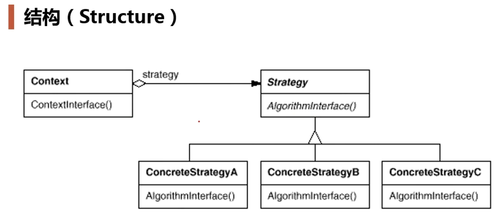
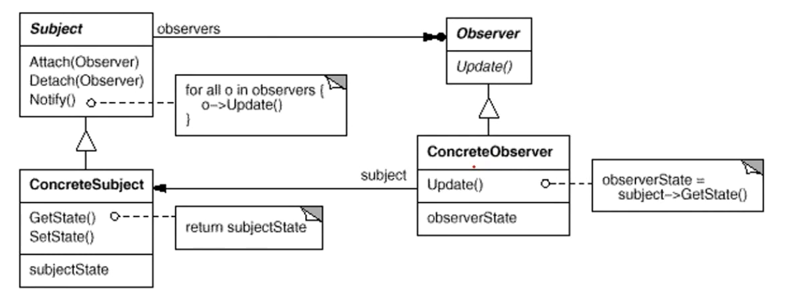
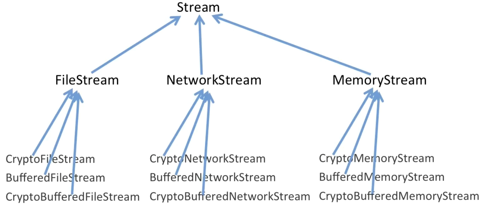

## 八大设计原则

**依赖倒置原则（DIP）**

高层模块（稳定）不应该依赖于低层模块（变化），二者都应该依赖于抽象（稳定）。

抽象（稳定）不应该依赖于实现细节（变化），实现细节应该依赖于抽象（稳定）。


**开放封闭原则（OCP）**

对扩展开放，对更改封闭。

类模板应该是可扩展的，但不不可修改。


**单一职责原则（SRP）**

一个类应该仅有一个引起它变化的原因。

变化的方向隐含着类的责任。


**Liskov替换原则（LSP）**

子类必须能够替换他们的基类（IS-A）。

继承表达类型抽象。


**接口隔离原则（ISP）**

不应该强迫客户程序以来他们不用的方法。

接口应该小而完备。


**优先使用对象组合，而不是类继承**

类继承通常为“白箱复用”，对象组合通常为“黑箱复用”

继承在某种程度上破环了封装性，子类父类耦合度高。

对象组合只要求被组合的对象具有良好定义的接口，耦合度低。


**封装变化点**

使用封装来创建对象之间的分界层，让设计者可以在分解层的一侧进行修改，而不会对另一侧产生不良的影响，从而实现层次间的松耦合。


**针对接口编程，而不是针对实现编程**

不将变量类型声明为某个特定的具体类，而是声明为某个接口。

客户程序无法获知对象的具体类型，只需要知道对象所具有的接口。

减少系统中的各部分的依赖关系，从而实现“高内聚、松耦合”的类型设计方案。


```cpp
vector<Line*> lineVector;
vector<Rect*> rectVector;

vector<Shape*> shapeVector;
```


## 模板模型

在父类中定义各个方法，和每个方法的执行过程。对于一些不确定的函数，设置成虚函数由子类完成。实现玩绑定。


## 策略模型

如果程序中出现大量的if-else结构，如果增加需求的话，就不符合开闭原则，可以考虑使用策略模型。




```cpp
enum TaxBase {
	CN_Tax,
	US_Tax,
	DE_Tax,
	FR_Tax       //更改
};

class SalesOrder{
    TaxBase tax;
public:
    double CalculateTax(){
        //...
        
        if (tax == CN_Tax){
            //CN***********
        }
        else if (tax == US_Tax){
            //US***********
        }
        else if (tax == DE_Tax){
            //DE***********
        }
		else if (tax == FR_Tax){  //更改
			//...
		}
        //....
     }
};
```

```cpp
class TaxStrategy{
public:
    virtual double Calculate(const Context& context)=0;
    virtual ~TaxStrategy(){}
};

class CNTax : public TaxStrategy{
public:
    virtual double Calculate(const Context& context){
        //***********
    }
};

class USTax : public TaxStrategy{
public:
    virtual double Calculate(const Context& context){
        //***********
    }
};

class DETax : public TaxStrategy{
public:
    virtual double Calculate(const Context& context){
        //***********
    }
};


//扩展
//*********************************
class FRTax : public TaxStrategy{
public:
	virtual double Calculate(const Context& context){
		//.........
	}
};


class SalesOrder{
private:
    TaxStrategy* strategy;

public:
    SalesOrder(StrategyFactory* strategyFactory){
        this->strategy = strategyFactory->NewStrategy();
    }
    ~SalesOrder(){
        delete this->strategy;
    }

    public double CalculateTax(){
        //...
        Context context();
        
        double val = 
            strategy->Calculate(context); //多态调用
        //...
    }
};
```


## 观察者模型

需要为某些对象建立一种“通知依赖关系”，一个对象的撞他发生改变，所依赖的对象都将的到通知，如果这样的依赖关系过于紧密，将使软件不能很好地低于变化。

定义对象的一对多的依赖关系，一遍当一个对象的状态发生改变时，所有依赖于它的对象都将通知并自动更新。




## 装饰模式

在某些情况下可能会过度使用继承来扩展对象的功能，由于继承为类型引入的静态特性，使得这些扩展方式缺乏灵活性，并且随着子类的增多（扩展功能的增多），各种子类的组合（扩展功能的组合）会导致更多子类的膨胀。

动态组合地给一个对象增加一些额外的职责，就增加功能而言，Decorator模式比生成子类（继承）更为灵活（消除重复代码，减少子类个数）。

1、通过组合而非继承的手法，避免了使用继承带来的灵活性差和多子类衍生的问题

2、Decorator类在接口上表现为is-a的继承关系，但实际表现为has-a的组合关系

3、Decorator主要用于解决“主题类在多个方向上的扩展功能”




```cpp
// 传统继承的方式来扩展功能

//业务操作
class Stream{
public：
    virtual char Read(int number)=0;
    virtual void Seek(int position)=0;
    virtual void Write(char data)=0;
    
    virtual ~Stream(){}
};

//主体类
class FileStream: public Stream{
public:
    virtual char Read(int number){
        //读文件流
    }
    virtual void Seek(int position){
        //定位文件流
    }
    virtual void Write(char data){
        //写文件流
    }

};

class NetworkStream :public Stream{
public:
    virtual char Read(int number){
        //读网络流
    }
    virtual void Seek(int position){
        //定位网络流
    }
    virtual void Write(char data){
        //写网络流
    }
    
};

class MemoryStream :public Stream{
public:
    virtual char Read(int number){
        //读内存流
    }
    virtual void Seek(int position){
        //定位内存流
    }
    virtual void Write(char data){
        //写内存流
    }
    
};

//扩展操作
class CryptoFileStream :public FileStream{
public:
    virtual char Read(int number){
       
        //额外的加密操作...
        FileStream::Read(number);//读文件流
        
    }
    virtual void Seek(int position){
        //额外的加密操作...
        FileStream::Seek(position);//定位文件流
        //额外的加密操作...
    }
    virtual void Write(byte data){
        //额外的加密操作...
        FileStream::Write(data);//写文件流
        //额外的加密操作...
    }
};

class CryptoNetworkStream : :public NetworkStream{
public:
    virtual char Read(int number){
        
        //额外的加密操作...
        NetworkStream::Read(number);//读网络流
    }
    virtual void Seek(int position){
        //额外的加密操作...
        NetworkStream::Seek(position);//定位网络流
        //额外的加密操作...
    }
    virtual void Write(byte data){
        //额外的加密操作...
        NetworkStream::Write(data);//写网络流
        //额外的加密操作...
    }
};

class CryptoMemoryStream : public MemoryStream{
public:
    virtual char Read(int number){
        
        //额外的加密操作...
        MemoryStream::Read(number);//读内存流
    }
    virtual void Seek(int position){
        //额外的加密操作...
        MemoryStream::Seek(position);//定位内存流
        //额外的加密操作...
    }
    virtual void Write(byte data){
        //额外的加密操作...
        MemoryStream::Write(data);//写内存流
        //额外的加密操作...
    }
};

class BufferedFileStream : public FileStream{
    //...
};

class BufferedNetworkStream : public NetworkStream{
    //...
};

class BufferedMemoryStream : public MemoryStream{
    //...
}

class CryptoBufferedFileStream :public FileStream{
public:
    virtual char Read(int number){
        
        //额外的加密操作...
        //额外的缓冲操作...
        FileStream::Read(number);//读文件流
    }
    virtual void Seek(int position){
        //额外的加密操作...
        //额外的缓冲操作...
        FileStream::Seek(position);//定位文件流
        //额外的加密操作...
        //额外的缓冲操作...
    }
    virtual void Write(byte data){
        //额外的加密操作...
        //额外的缓冲操作...
        FileStream::Write(data);//写文件流
        //额外的加密操作...
        //额外的缓冲操作...
    }
};


void Process(){

    //编译时装配
    CryptoFileStream *fs1 = new CryptoFileStream();

    BufferedFileStream *fs2 = new BufferedFileStream();

    CryptoBufferedFileStream *fs3 =new CryptoBufferedFileStream();
}
```


```cpp
//业务操作
class Stream{

public：
    virtual char Read(int number)=0;
    virtual void Seek(int position)=0;
    virtual void Write(char data)=0;
    
    virtual ~Stream(){}
};

//主体类
class FileStream: public Stream{
public:
    virtual char Read(int number){
        //读文件流
    }
    virtual void Seek(int position){
        //定位文件流
    }
    virtual void Write(char data){
        //写文件流
    }

};

class NetworkStream :public Stream{
public:
    virtual char Read(int number){
        //读网络流
    }
    virtual void Seek(int position){
        //定位网络流
    }
    virtual void Write(char data){
        //写网络流
    }
    
};

class MemoryStream :public Stream{
public:
    virtual char Read(int number){
        //读内存流
    }
    virtual void Seek(int position){
        //定位内存流
    }
    virtual void Write(char data){
        //写内存流
    }
    
};

//扩展操作
DecoratorStream: public Stream{
protected:
    Stream* stream;//...
    
    DecoratorStream(Stream * stm):stream(stm){
    
    }
};

class CryptoStream: public DecoratorStream {
 
public:
    CryptoStream(Stream* stm):DecoratorStream(stm){
    
    }
    
    virtual char Read(int number){
        //额外的加密操作...
        stream->Read(number);//读文件流
    }
    virtual void Seek(int position){
        //额外的加密操作...
        stream::Seek(position);//定位文件流
        //额外的加密操作...
    }
    virtual void Write(byte data){
        //额外的加密操作...
        stream::Write(data);//写文件流
        //额外的加密操作...
    }
};


class BufferedStream : public DecoratorStream{
    
    Stream* stream;//...
    
public:
    BufferedStream(Stream* stm):DecoratorStream(stm){
        
    }
    //...
};

void Process(){

    //运行时装配
    FileStream* s1=new FileStream();
    
    CryptoStream* s2=new CryptoStream(s1);
    
    BufferedStream* s3=new BufferedStream(s1);
    
    BufferedStream* s4=new BufferedStream(s2);
}
```


## 桥模式


## 单例模型

对于系统中的某些类来说，只有一个实例很重要，比如一个打印机可以有多个打印任务，但是只有一个正在工作的任务，一个系统只能有一个窗口管理器或文件系统。

单例模型保证一个类仅有一个实例，并提供一个访问它的全局访问点。

单例模式的优点:

- 在内存中只有一个对象,节省内存空间

- 避免频繁的创建销毁对象,可以提高性能

- 避免对共享资源的多重占用

- 可以全局访问

```cpp
// 懒汉
class Single{
public:
    static Single* getInstance() {
        if (p == NULL) {
            pthread_mutex_lock(&lock);
            if (p == NULL) {
                p = new Single;
            }
            pthread_mutex_unlock(&lock);
        }
        returnp;
    }    

private:
    static Single *p;
    static pthread_mutex_t lock;
    Single() {
        pthread_mutex_init(&lock, NULL);
    }
    ~Single() {}
};

Single* Single::p = NULL;
```


```c
// 懒汉
class Single{
public:
    static Single* getInstance() {
        return p;
    }    

private:
    static Single *p;
    Single() {}
    ~Single() {}
};

Single* Single::p = new Single;
```


```c
/*
	使用Magic static的特性：如果当变量在初始化的时候，并发同时进入声明语句，并发线程将会阻塞等待初始化结束。
*/
#include <iostream>
using namespace std;

class Singleton{
public:
    Singleton(const Singleton &) = delete;
    Singleton& operator = (const Singleton &) = delete;

    static Singleton& getInstance() {
        static Singleton instance;
        return instance;
    }

private:
    Singleton() {}
    ~Singleton() {}

};

int main() {
    Singleton& instance1 = Singleton::getInstance();
    Singleton& instance2 = Singleton::getInstance();

    cout << &instance1 << endl;
    cout << &instance2 << endl;

    return 0;
}


class Single{
public:
    static Single* getInstance() {
        static Single p;
        return &p;
    }    

private:
    Single() {}
    ~Single() {}
};
```


## 生产者消费模型

```c
#include <stdlib.h>
#include <unistd.h>
#include <pthread.h>
#include <stdio.h>
#include <queue>
using namespace std;

queue<int> que;
pthread_cond_t has_product = PTHREAD_COND_INITIALIZER;
pthread_mutex_t lock = PTHREAD_MUTEX_INITIALIZER;
int num = 1;
void *consumer(void *p) {
    while (true) {
        pthread_mutex_lock(&lock);
        while (que.empty()) {
            pthread_cond_wait(&has_product, &lock);
        }
        int t = que.front();
        que.pop();
        pthread_mutex_unlock(&lock);
        printf("consume: %d\n", t);

    }
}

void *producer(void *p) {
    while (true) {
        printf("produce: %d\n", num);
        pthread_mutex_lock(&lock);
        que.push(num++);
        pthread_mutex_unlock(&lock);
        pthread_cond_signal(&has_product);
    }
}

int main() {

    pthread_t pid, cid;
    pthread_create(&pid, NULL, producer, NULL);
    pthread_create(&cid, NULL, consumer, NULL);

    pthread_join(pid, NULL);
    pthread_join(cid, NULL);

    return 0;
}
```

