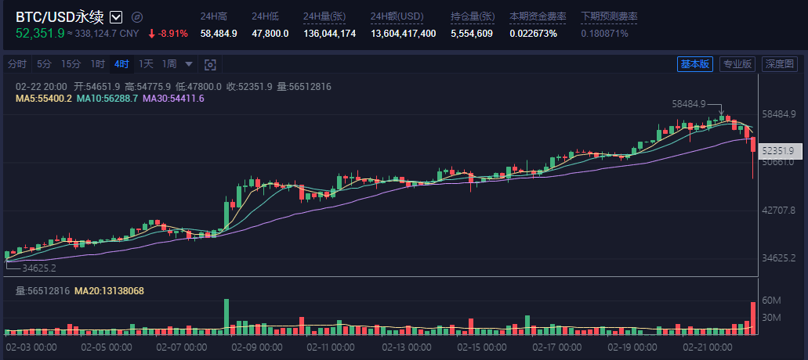
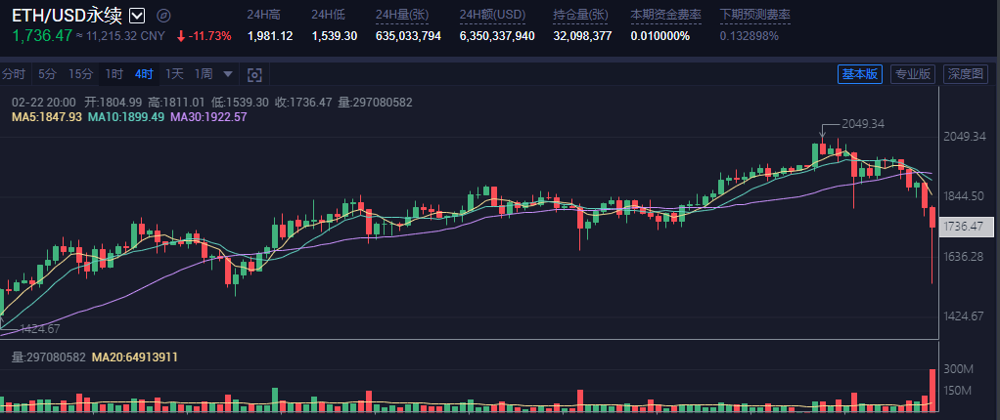
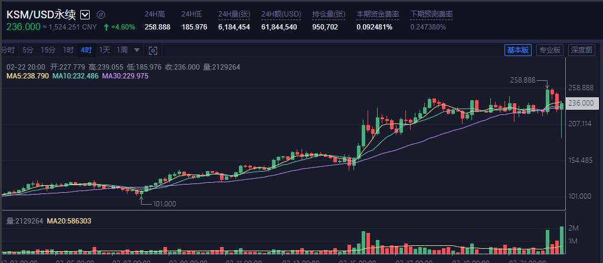
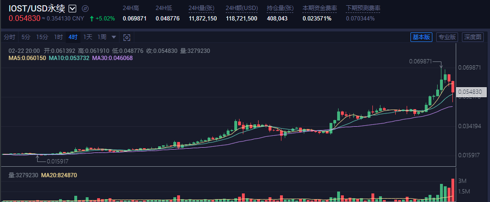
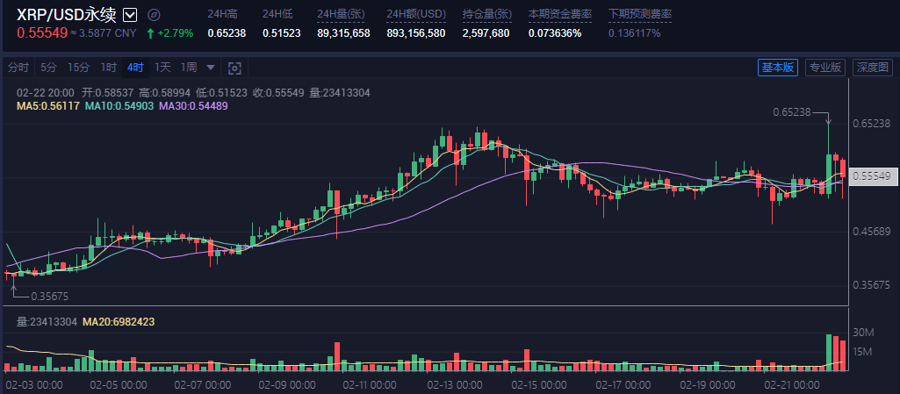
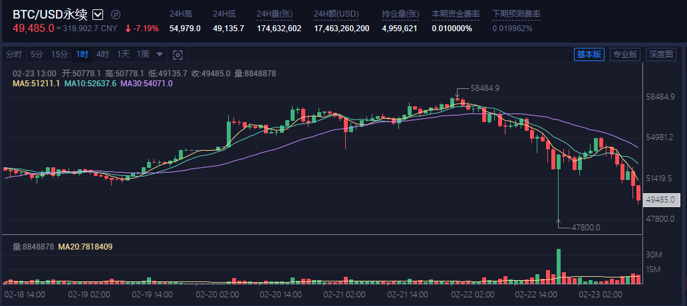
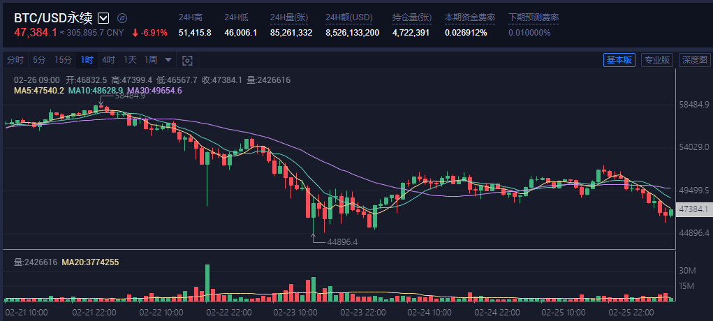
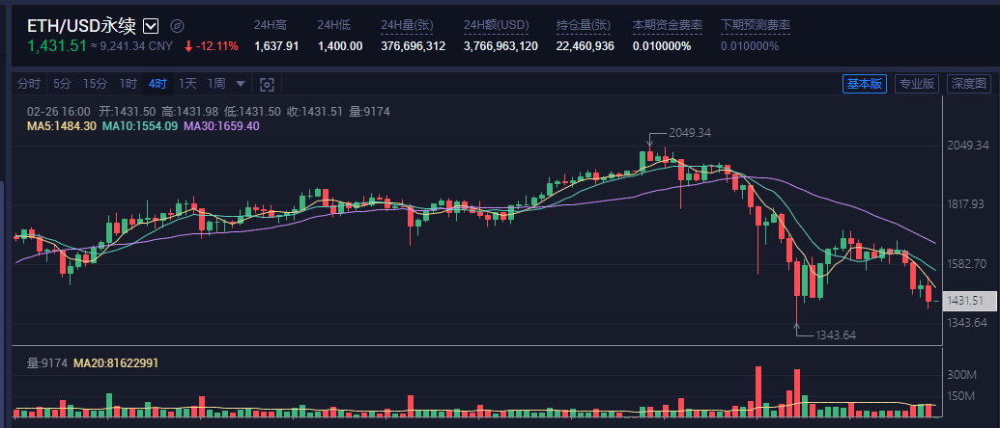

## 2021/2/22 22:52

总结抄底抄的太少了...

几乎所有币种都大跌，只有KSM、XRP、IOST在涨。

| 买入    | 数量         | 单价          |
| ------- | ------------ | ------------- |
| 500 CNY | 0.001441 BTC | 346749.78 CNY |
| 500 CNY | 0.047200 ETH | 10593.06 CNY  |
| 200 CNY | 0.016052 ETH | 12459.00 CNY  |

## 2021/02/23 13:22

| 买入    | 数量         | 单价           |
| ------- | ------------ | -------------- |
| 500 CNY | 0.001493 BTC | 334,862.28 CNY |
|         |              |                |
| 300 CNY | 0.000951 BTC | 315,423.51 CNY |

## 2021/02/26 09:23

| 买入    | 数量         | 单价           |
| ------- | ------------ | -------------- |
| 300 CNY | 0.000951 BTC | 315,423.51 CNY |
| 300 CNY | 0.031284 ETH | 9,589.36 CNY   |
|         |              |                |

## 持仓

| 买入     | 数量         | 单价           |
| -------- | ------------ | -------------- |
| 1700 CNY | 0.003886 BTC | 315,423.51 CNY |
| 1300 CNY | 0.152822 ETH | 9,589.36 CNY   |
|          |              |                |