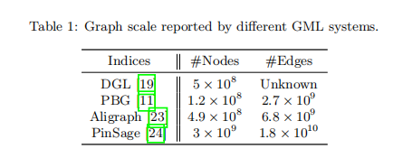
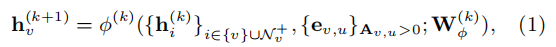
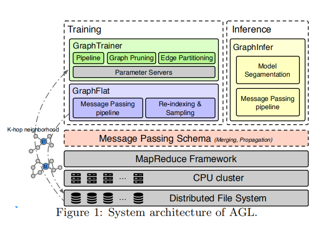
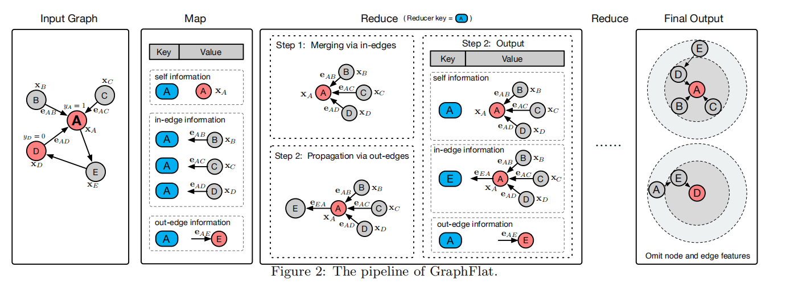
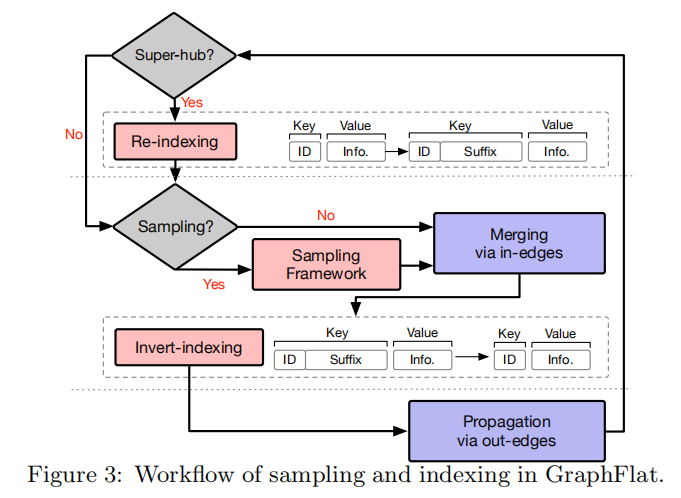
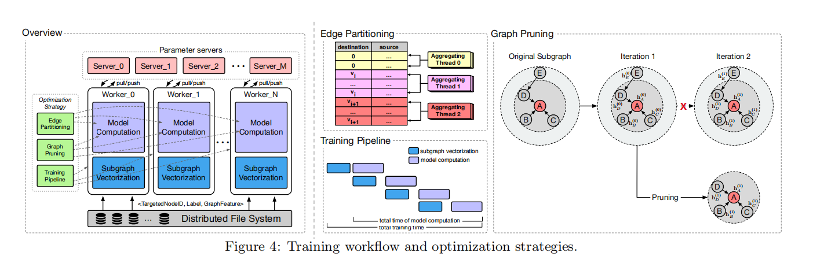
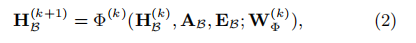
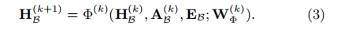
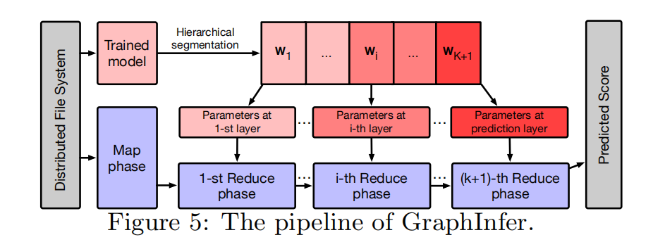
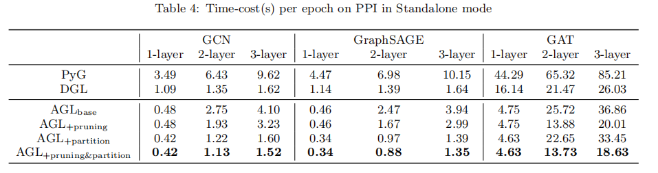

---

typora-copy-images-to: img\agl

---

```pdf
https://arxiv.org/pdf/2003.02454.pdf
```

## Introduce

现有的图机器学习框架存在一些缺点：

- 数据存放在内存中，由于内存容量的限制，不易扩展缩放。
- 需要额外开发图性存储，而不能使用已有成熟的框架，例如MapReduce来保证系统的良好性能。
- 已有的系统侧重于训练，忽略了图推理优化，不是一个整合的系统。

这篇论文设计了一个新的框架：AGL（Ant Graph mechine Learning system），是一个可扩展、容错和集成的系统，具有GNN的全功能训练和推理。

AGL遵循了GNN计算的消息传递的方案，设计了k跳邻域（每个节点的信息完整子图），通过MapReduce整合入边节点的值并传播给出边的节点来完成图推理。


已有的图机器学习系统的规模：



DGL (Deep Graph Library) 和PBG (PyTorch-BigGraph) 是单机系统，而且数据都是存储在内存中，所以在处理大规模工业数据时，需要具有巨大内存（TB）的服务器。

Aligraph实现了分布式内存图存储引擎，在训练GNN模型前需要独立部署。


$k^{th}$GNN layer：




## K-hop Neighborhood


k-hop neighborhood的定义是一个图结构，$g_v^k$表示以点$v$为中心的子图，图中的任意一点到$v$的距离都$\le k$，同时包括点和边的特征向量$X_v^k 、E_v^k$。

$g_v^k$具有k-layer GNN模型所需要的充足的信息。


## System Overview

首先合并来自每个节点的边缘邻居的所有信息，然后将这些合并的信息传播到目标节点，重复执行应用于训练和推理过程，并开发了GraphFlat和GraphInfer。

GraphFlat在训练过程中生成独立的K-hop邻域。GraphInfer在给定GNN的训练模型上推断节点的embeddings。

基于上述的设计原理，AGL利用已有的并行架构MapReduce和Parameter Server，通过精心设计分布式实现来构建每一个组件，因此可以将系统部署到计算性能和内存容量有限的集群上。




## GraphFlat

GraphFlat是一个基于消息传递高效的的分布式生成器，用来生成包含完整信息的K-hop邻域。这些K-hop邻域可以转化为字符串并存放在分布式文件系统上。使用时可以加载一个或多个到内存中而不再是整张图。

另外提出了重新索引（re-indexing）技术和抽样框架（sampling framework）以解决"hub"的问题。


### pipeline



GraphFlat使用一个pipeline来完成k-hop的生成。

1. Map

   Map只会在pipeline开始的时候执行一次，对于中心节点$v$来说Map生成三个信息：self information、in-edge information、out-edge information，Map为每个节点设置一个shuffle key，并将生成的三个信息作为value。

2. Reduce

   Reduce运行K次来生成K-hop邻域。在第$k^{th}$轮，reduce首先收集所有values，然后合并self information和in-edge information作为新的self information，然后向out-edge传播并作为目标节点的in-edge information。

3. Storing

   在k次Reduce之后最终的self information变为k-hop邻域，将k-hop中所有目标节点信息转化string并存储在分布式文件系统中。


k-hop邻域有助于区分节点和其他节点，所有也称GraphFlat为GraphFeature。


### Sampling & Indexing




由于"hub"节点的存在导致图程度分布的倾斜，尤其是在工业场景下的数据。这就意味着存在某些k-hop几乎覆盖了整个graph，这严重拖慢整个进度，而且会超出内存大小（Out of memory），从而降低GNN模型的精准度。

re-indexing策略和Sampling framework可以有效的处理这种"hub"情况。

- Re-indexing

  当中心节点shuffle key的in-degree超过预先设定的threshold（10k），re-indexing组件将"hup"上的节点均匀的分布到多个reducers。

- Sampling framework

  Sampling framework提供均匀抽样、权重抽样，来减少k-hop邻域的规模。

- Inverted indexing

  这个组件将原来的shuffle key替换为reindexed shuffle key，之后将数据输出到磁盘用于后面的任务。


## GraphTrainer

GraphFlat保证了数据的独立性，GraphTrainer使用很多技术来优化模型训练。例如：pipeline、pruning、edge-partition用来解决IO负载，同时优化了GNN模型训练中浮点运算。

GraphTrainer在CPU集群下在处理真实的工业级数据时可以得到接近线性的提升。


### Training workflow




workers执行大量的计算，servers维护当前图模型参数的版本，因为k-hop邻域包含着GNN模型足够多的信息，因此彼此间不需要通信。

对于节点分类任务，训练任务可以描述为一个集合$\beta={目标节点、标签、图特征}$。GNN的训练过程需要将子图按照GraphFeatures进行合并，然后向量化合并后的子图为：邻接矩阵$A_\beta$，节点特征矩阵$X_\beta$、边特征矩阵$E_\beta$。


### training pipeline

GNN模型的worker在模型开始训练的时候，首先从磁盘中读取一些训练数据，然后执行子图向量化和模型计算。然后顺序的执行这些步骤比较消耗时间，使用pipeline可以有效解决这个问题。

pipeline包括两个阶段：预执行阶段（包含数据的读取和子图的向量化）、模型计算阶段。这两个阶段并行执行。应为预处理阶段相对来说比模型计算快，在几轮之后整个训练的时间接近了模型计算的性能。


### graph pruning



对于公式2来说，因为只有$\beta$的节点被标记，因此其他的节点对于$H_\beta^{(K)}$是多余的。可以通过删除多余的节点来加快模型的计算。

对于点的集合$V_\beta$来说，从$k^{th}$到${k+1}^{th}$只会用到距离$V_\beta$一跳的节点，因此对于$d(V_\beta,u) > K - k + 1$的节点来说都是多余的节点，因此公式2可以修改为：


### edge partitioning

节点只会aggregation所有指向他的边，如果相同目的的边在同一个线程中执行，那么aggregation将非常的高效，因为他们之间不存在冲突。


## GraphInfer

GraphInfer将K层GNN模型划分到K片，并使用基于MapReduce的消息传递充分的利用每个节点的embedding，因为第k层的embedding将传播到下一轮的消息传递，这将显著的加速推理任务。


推理任务在工业场景下的数据规模和使用频率远远高于训练任务，因此对推理模型的优化非常重要。

1. Hierarchical model segmentation

   将训练好的K层GNN划分为K+1块，第K+1层包含最终预测模型的所有参数。

2. Map

   这里的Map和GraphFlat类似，生成三种信息：self、in-edge、out-edge information，node id设置为suffle key，生成的各种信息作为value。

3. Reduce

   Reduce运行K+1次，前K次生成$K^{th}$layer embedding，最后一轮执行最终的预测。





## Experiment





