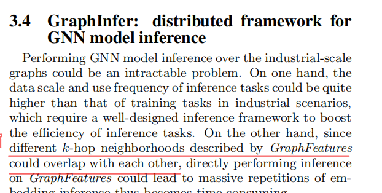
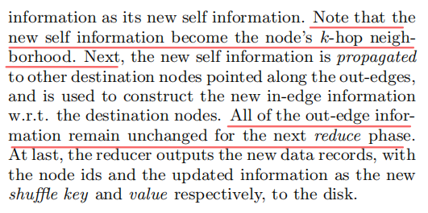
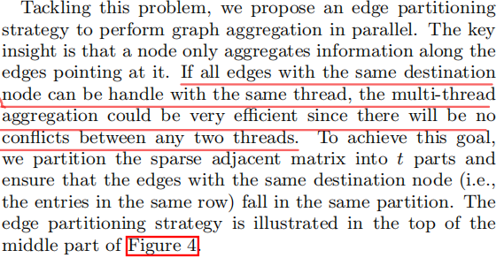
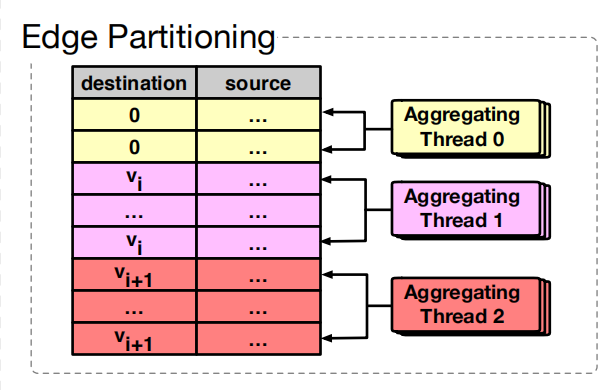
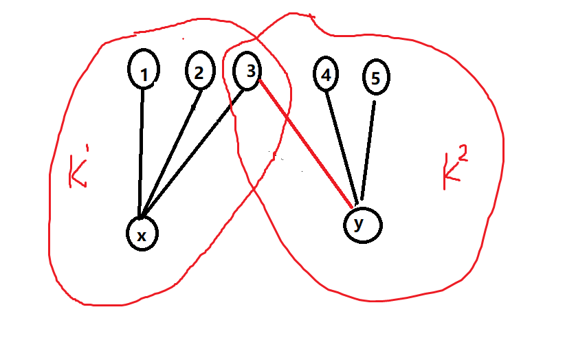
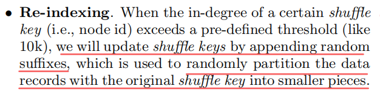
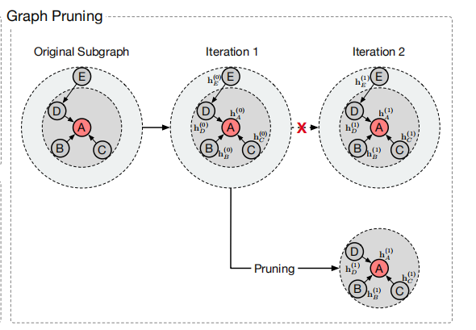
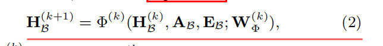
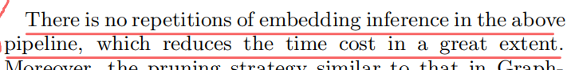

---

typora-copy-images-to: img\agl

---

```pdf
https://arxiv.org/pdf/2003.02454.pdf
```


AGL（Ant Graph mechine Learning system）是一个可扩展、容错和集成的系统，具有全功能的GNN训练和推理。


## K-hop Neighborhood


K跳邻域的定义是一个图结构，$g_v^k$表示以点$v$为中心的子图，图中的任意一点到$v$的距离都$\le k$，同时包括点和边的特征向量$X_v^k 、E_v^k$。

$g_v^k$具有K-layer GNN模型所需要的充足的信息，通过将图转化为K条邻域，从而解决大规模GNN计算的问题。


$k^{th}$GNN layer：


## GraphFlat

GraphFlat用于将图结构转化为K-hop邻域，最终将K-hop邻域转化为字符串并存放在分布式文件系统上。


> pipeline


GraphFlat通过pipeline的方式生成k-hop。

首先执行Map操作，生成关于节点$v$所有的信息：节点信息、入邻居信息、出邻居信息。每个节点分配一个id作为shuffle key，节点包含的所有信息作为value。

然后重复执行ReduceK次，每次Reduce先收集关于点$v$的所有信息，将节点本身和入邻居合并为新的节点信息，并将新的节点信息传递到出邻居节点，最后Reduce生成新的key-value记录。

经过K次Reduce之后，最终的节点信息就成为了K-hop邻居，将所有节点信息转化为字符串存储在分布式文件系统中。


> Sampling & Indexing


由于"hub"节点的存在导致度分布的倾斜，这意味着存在某些k-hop几乎覆盖了整个graph，这可能会出现OOM问题（Out of memory），并且降低GNN模型的精准度。

AGL提出了两个优化方案：re-indexing和Sampling。

Re-indexing，在节点的suffle key后添加后缀，从而将数据随机的划分成多个部份。

Sampling，提供均匀抽样、权重抽样，来减小k-hop邻域的规模。

Inverted indexing，将shuffle key替换为之前的值。


## GraphTrainer

GraphFlat保证了数据的独立性，GraphTrainer使用很多技术来优化模型训练。例如：pipeline、pruning、edge-partition用来解决IO负载，同时优化了GNN模型训练中浮点运算。

GraphTrainer在CPU集群下在处理真实的工业级数据时可以得到接近线性的提升。


workers执行大量的计算，servers维护当前图模型参数的版本，因为k-hop邻域包含着GNN模型足够多的信息，因此彼此间不需要通信。

对于节点分类任务，训练任务可以描述为一个集合$\beta={目标节点、标签、图特征}$。GNN的训练过程需要将子图按照GraphFeatures进行合并，然后向量化合并后的子图为：邻接矩阵$A_\beta$，节点特征矩阵$X_\beta$、边特征矩阵$E_\beta$。


> training pipeline

每个worker在GNN模型开始训练时，首先从磁盘中读取一些训练数据，然后执行子图向量化和模型计算。AGL采用pipeline来优化这一过程，pipeline包括两个阶段：预执行阶段（包含数据的读取和子图的向量化）、模型计算阶段，这两个阶段并行执行。

因为模型计算的耗时长，所以最终训练的时间取决于模型计算的时间。


> graph pruning


对于公式2来说，因为只有$\beta$的节点被标记，$H_\beta^{(K)}$中其他的节点的embedding都是多余的，而且缺少足够的信息其他节点的embedding计算也是错误的。

对于点的集合$V_\beta$来说，从$k^{th}$到${k+1}^{th}$的更新，所有$d(V_\beta,u) > K - k + 1$的节点都是多余的，因此公式2可以修改为：


> edge partitioning

节点只会aggregation所有指向他的边，将具有相同的目标节点的边放在同一个线程中执行，可以整体的效率，因为它们之间不存在冲突。


## GraphInfer


GraphInfer将K层GNN模型划分到K块，并使用基于MapReduce的消息传递充分的利用每个节点的embedding，因为第k层的embedding将传播到下一轮的消息传递，这将显著的加速推理任务。


GraphInfer将训练得到的模型分为K+1块，前K块对应训练模型的每一层，第K+1块为预测层。

使用pipeline的MapReduce，Map和GraphFlat的类似，每次Reduce首先读取对应的模型块，将本层和来自上一层入边的信息合并，然后传递给出边用于下一层的embedding。


## Experiment


## 问题

### q1

**每个k-hop结构是围绕一个点生成的吗？**








### q2

**edge partitioning将相同目标节点的边在同一个线程执行，这样彼此不冲突？**









### q3

**处理hub时，在节点的key加后缀具体时如何实现的，是将一个点分成多个带后缀的点吗？**




### q4

**图的划分不太理解，每层只需要下一层的点，那每次执行完当前层，不是还要把下一层的结构加上，这样不会影响效率吗？**






### q5

**GraphInfer将训练模型分为k+1块，为什么要这样做，这样做可以提高效率吗？**



