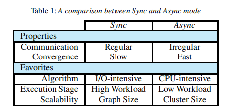

---

typora-copy-images-to: img\hsync

---

```pdf
https://ipads.se.sjtu.edu.cn/_media/publications/powerswitch-ppopp15.pdf
```


## 介绍

处理大规模图计算往往使用sync和async两种方法，但是目前还没有对两种模型执行特性进行深入研究，因此程序员需要手动选择一种模型，要么需要对底层图形引擎进行深入了解，要么就会损失一些性能。

这篇论文详细的测试了同步和异步模型在不同的graph algorithms、partitioning methods、execution stages、input graphs、cluster scales的性能，发现没有一种模型能完全战胜另一种。因此论文提出了一个sync和async混合的模型Hsync。

Hsync可以在最优的条件下自动的进行sync和async的模式切换，从而提升整体的性能。

Hsync不断地实时收集统计数据，例如：throughput、active vertices、convergence speed、online sampling、offline profiling，并利用一组启发式方法来预测未来的性能，并确定何时切换模型可以提升性能。

Hsync的原型为PowerSwitch，它是基于PowerGraph实现的，PowerSwitch始终优于单个模型，性能提升为9%-73%。


## sync vs async



sync可以将消息分组以减少通信的消耗，更喜欢IO密集的算法。

async可以快速的收敛，更喜欢CPU密集的算法。

PageRank算法在sync模型下更快，LBP（Loopy Belief Propagation）在async模型下更快。另外Graph Coloring甚至不能再sync下收敛。

除了不同的算法，input data size、scale of clusters、graph partitioning approaches都影响两种模型的性能。