---

typora-copy-images-to: img\maiter

---

```pdf
https://arxiv.org/pdf/1710.05785.pdf
```


## 介绍

Maiter是一个基于增量累计迭代计算（delta-based accumulative iterative computation DAIC）的异步图处理框架。不同于传统的迭代计算从上一个迭代更新，DAIC通过迭代之间累计changes更新结果。通过DAIC只处理changes避免不必要的更改。


> synchronous iteration

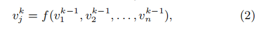

vertex-centric model，以顶点为中心的模型，通常使用同步迭代方式。


顶点j在第k次迭代的结果，由它所有邻居顶点在k-1次的迭代结果得到。第k次的迭代需要在k-1次迭代全部完成才可以进行。


> asynchronous iteration

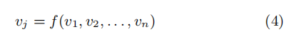

同步迭代会降低性能，使用异步迭代可以避免高成本的同步障碍。

异步更新意味着它可以在任意时刻根据最近的状态信息进行更新，不过异步迭代可能需要更多的通信和大量无用的计算，例如顶点在更新的时候，需要获取它所有邻居节点的信息，但是邻居节点可能有一部分还没有更新或者都没有更新，那么这个顶点就做了无用的计算。

另外异步迭代不能保证算法的收敛，这就造成了不确定性。

pull-based的异步迭代只适用于通信开销可以忽略不计的环境，例如共享内存系统，在分布式环境或者cloud是无法有效利用。作为替代有一种基于pushes的更新方法，当节点发生更新的时候，将节点的信息push到它所有的邻居，邻居缓存下这个信息，只有当节点缓存了新的更新信息时才执行更新。这样可以有效的减少不必要计算。同时这要求更高的空间复杂度，因为每个节点都需要存储他所有邻居节点的更新信息。

同步迭代由于全局障碍导致低性能，异步迭代由于各种实现开销而无法有效利用。


本文提出的DAIC是基于change的状态更新，可以避免无用的更新。DAIC模型执行的关键在于change可以单调累计，并且迭代计算可以异步执行。基于DAIC模型，作者设计了分布式的网络框架Maiter。


## DAIC


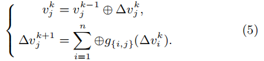


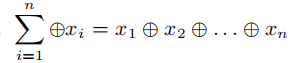

不是所有的迭代计算都能用DAIC表示，满足DAIC的条件是：

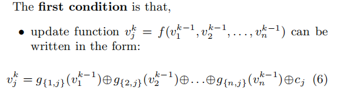


解合（6）和（7）可以得到：

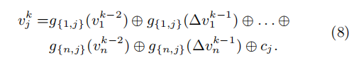


满足交换律和结合律：

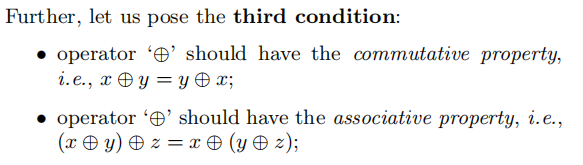

根据结合律，合并（8）中的$g_{\{i,j\}}(v_j^{k-2})$和$c_j$可以得到$v_j^{k-1}$，对比（7）可以得到$\sum_{i=1}^n\oplus g_{\{i,j\}}(\Delta v_i^{k-1}) = \Delta v_j^{k}$，因此就得到了（5）。


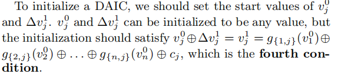


> Asynchronous DAIC

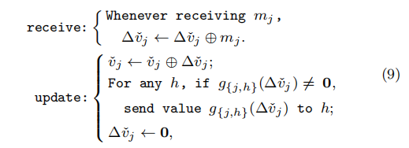

顶点j收到来自i的增量消息之后累计$m_j$，将累计的增量信息发送到j的所有邻居，然后重置为0。


## 收敛性

异步DAIC的收敛定义为：

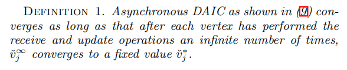


同步和同步的DAIC都将收敛到相同的结果。无论是同步还是异步增量的传递并不会丢失，即消息传递的路径相同，只不过是过程不同而已，所以他们收敛的结果相同。

具体的证明见：**3.3 Convergence**

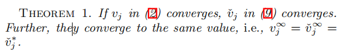


## 有效性

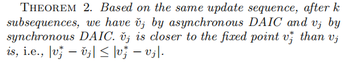

对于同步的DAIC来说，每一次的迭代更新，都是在上一个更新全部执行完成的基础上进行的。也就是说同步执行对应一系列的更新列表。只要满足列表中的点才会更新。如果异步DAIC使用和同步相同的更新列表进行更新，那么异步会比同步收敛的快一些，因为即使不再更新列表的增量信息，异步DAIC也会立即进行累计。


## 调度策略

常见的调度是轮询调度：round-robin scheduling，作者发现选择性的处理顶点的子集具有加速迭代计算的潜力。

证明见**3.5 Scheduling Policies**


### DAIC Algorithm

如何编写DAIC算法？

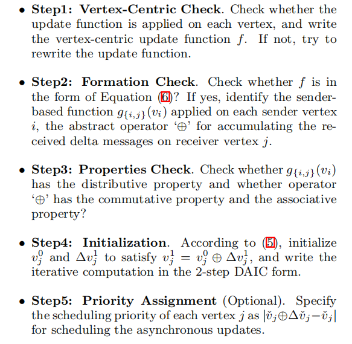


## Maiter

Maiter的项目部署：[github.com/Sanzona/Maiter](https://github.com/Sanzona/Maiter)

Maiter的实现借鉴了Piccolo。Maiter采用master和workers的架构，master负责协调workers并监控他们的状态，每个worker并行的执行，worker之间通过MPI进行通信。


> Data Partition

在Maiter中每个顶点都有一个唯一的vid，每个worker加载一部分的点到内存中执行，这些点的划分通常采用哈希函数来完成。


> Local State Table

每个worker都会维护一个状态表。

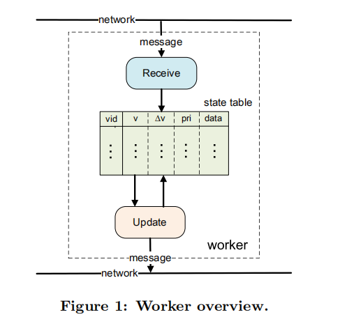

> Receive Thread and Update Thread

DAIC中最重要的就是接受和处理增量信息，在每个worker中都会有两个单独的线程来完成。


> Scheduling within Update Thread

每个worker都包含一个优先队列，存储具有较大优先级的本地vid子集。


> Message Passing

Maiter使用OpenMPI实现消息的发送。

消息传递的一个简单的实现是只要有新的消息产生就立即发送。这将导致异步迭代的全部潜力，但是会增加系统的开销。

为了减少系统开销，Maiter的做法是缓存输出的消息，定时的刷新缓存。如果接收方是一个本地的worker，这个消息将直接的在local table更新。另外消息按照接收方来划分成多个msg tables，也可以对msg tables进行整合从而减少发送的数据量。


> Iteration Termination

Maiter在每个worker中包含一个progress estimator，在master中有global terminator用来决定是否中止所有的iteration。

master周期的广播进度请求信号，worker的progress estimator收到信号之后，就开始进行评估，然后将结果返回给master，当master收到所有的worker的回复后进行决策。如果决定终止iteration，他将广播terminate signal给所有的worker。

woker在汇报自己的进度给master之后就继续进行迭代计算，他不会等待master的反馈，所以这并不影响整体的迭代计算。


> Fault Tolerance

Maiter的容错主要通过checkpoints来实现，Maiter使用Chandy-Lamport算法来设计容错机制。

master检测到worker failure，根据最后的检查点重新加载进行计算，并通知所有的worker在最近的检查点加载数据。

master的faulure是通过第二个master进行恢复。

