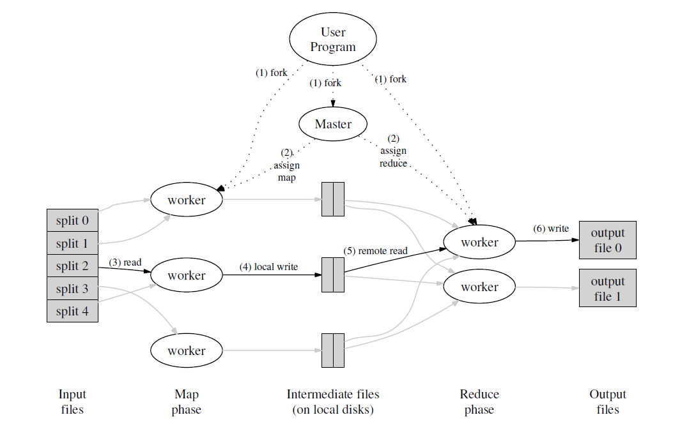
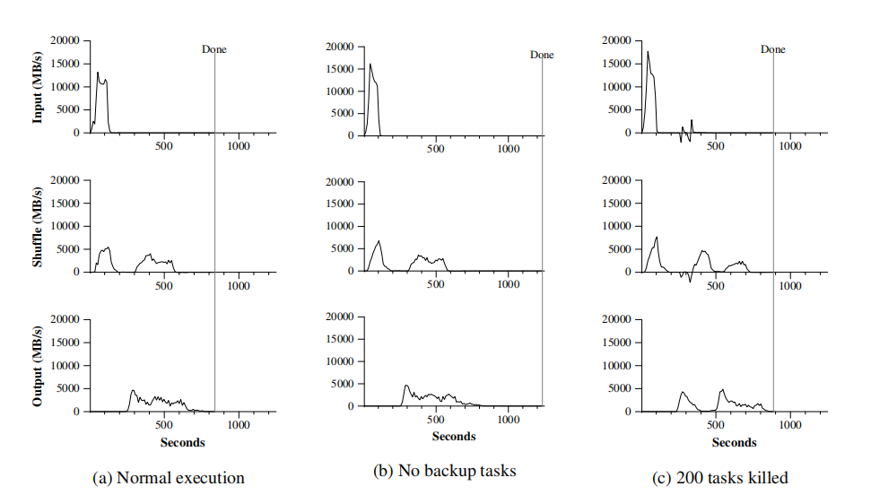

---

typora-copy-images-to: img\mapreduce

---

```pdf
https://pdos.csail.mit.edu/6.824/papers/mapreduce.pdf
```


## 介绍

MapReduce是一个将数据分布到大型集群上计算的一种方案。

MapReduce最核心的就是map和reduce。

map函数的任务是从输入文件中获取<key, value>，reduce函数的任务是合并所有可相同的value值。

> 一个简单的例子

用mapreduce处理单词计数。

input1: I like sport.

input2: I like watch movice.

map: <I, 1>，<like, 1>，<sport, 1>，<I, 1>，<like, 1>，<watch, 1>，<movice, 1>

reduce: <I, 2>，<like, 2>，<sport, 1>，<watch, 1>，<movice, 1>


```cpp
map(String key, String value):
    // key: document name
    // value: document contents
    for each word w in value:
    	EmitIntermediate(w, "1");

reduce(String key, Iterator values):
    // key: a word
    // values: a list of counts
    int result = 0;
    for each v in values:
        result += ParseInt(v);
    Emit(AsString(result));
```


## 执行过程



1. MapReduce首先将输入的文件划分成M份，每份大小16-64MB。
2. 将用户代码复制到集群中的机器，其中一个机器为master其他为worker，master负责将map task和reduce task分配到空闲的机器上。
3. worker领到一个map task后，首先将输入的文件及解析成键值对，并作为用户自定义的map函数的输入，map函数的输出缓存到内存中。
4. 缓存被周期的写入到本地磁盘中，缓存的位置信息发送给master，master将这些信息转发给reduce。
5. reduce收到信息之后，执行远程调用读取缓存在worker本地磁盘的数据，然后将这些数据按照key进行排序，如果数据太大，将会使用外部排序。
6. reduce worker将遍历这些排好序的数据，将每个key和它所对应的value list发送到用户自定义的reduce函数进行处理。
7. 当所有的map task和reduce task完成，master将唤醒用户程序，mapreduce返回到用户的代码。


## 容错

master周期的ping每一个worker，如果在一定的时间内worker没有恢复，master就认为worker failed。每一个failed worker和completed worker将重置为空闲状态供调度器调度。

当出现故障时，已经完成的map task需要重新执行，因为他们的输出结果存放故障的机器里而无法获取，而已经完成的reduce task不需要重新执行，因为他们的输出存储在全局文件系统中（global file system）。

当原本在worker A执行的map task重新在worker B上执行时，所有涉及到的reduce task也需要重启，因为他们不能再worker A中读取到map task的输出。

master周期的保存checkpoint可以有效地用来恢复。


## 任务粒度

MapReduce通常设置M=200000，R=5000，machines=2000。

MapReduce在调度的时候是O(M+R)，但是要存储O(M*R)的状态。

R的大小一般由用户确定，因为R的大小决定输出文件的个数，通常倾向于设置M的大小，即每个任务输入文件的大小16-64M。


## 备份任务

拖慢MapReduce执行的一个操作是straggler，即MapReduce花费大量的时间去执行剩下很少的map/reduce task，这通常可能因为磁盘出现故障，网络带宽降低，代码出现bug等等。

MapReduce有一个通用的机制去缓解这种情况，当一个task接近完成的时候，master调度器将备份剩余执行的task，当备份的task或者主执行完成时，这个task就标记为已完成。

这有效的降低了MapReduce执行时间。在一个sort算法中，使用backup task可以减少44%的执行时间。

虽然备份操作增加了机器的负担，但是对执行时间的影响非常小。




## 总结

MapReduce成功的原因：

1. MapReduce模型容易使用。
2. 大量的问题都可以用MapReduce很好表示。
3. MapReduce的实现扩展到数千台机器著称的集群上。


MapRedecu学到的经验：

1. 限制编程模型使计算易于并行和分发，并且具有容错性。
2. 网络带宽是个稀缺资源。(将map task分派到有数据备份的机器上，这样就减少了数据加载的时间)
3. 冗余执行可以用来减少慢机器的影响，并处理机器故障和数据丢失。

