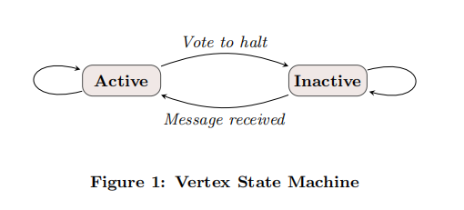
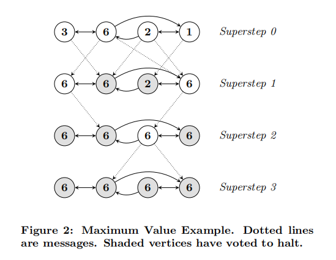
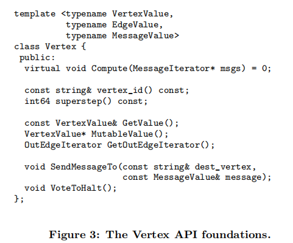

---

typora-copy-images-to: img\pregel

---

```pdf
http://www.dcs.bbk.ac.uk/~dell/teaching/cc/paper/sigmod10/p135-malewicz.pdf
```

## 介绍

图算法通常表现出内存访问不好的局部性，大规模图运算在商业中很常见，但是在大规模分布式环境下没有可扩展的通用系统来实现任意的图算法。

传统的方法实现一个处理大规模图算法存在的问题：

1. 对于每个算法都要设计特定的网络结构。
2. 依赖于现有的分布式计算平台，通常不适合图形处理。
3. 使用单机图形算法库，限制了解决问题的规模。
4. 使用现有的并行图系统，虽然可以处理并行图算法，但是不解决容错和其他重要的问题。

Pregel是可扩展和容错大型图形处理系统。

Pregel的计算是由一系列的迭代组成，称之为超步supersteps。在每个superstep中执行用户自定义的函数并行的处理每一个点。每个超步S可以读取S-1的消息，并进行修改合并，处理后的消息可以在在S+1步获取。

Pregel的同步性使得它不存在死锁和一步系统中常见的数据竞争。在足够的并行松弛条件下，Pregel的性能可以和一步系统相媲美。


> termination



算法的终止是由每个点的状态决定的，当顶点没有收到新的消息，这个顶点将从Active变为Inactive通过vote to halt完成，如果所有的点都储在Inactive，而且没有新的消息传送，那么算法就会终止。当Inactive的顶点收到了新的消息，它将重新切换到Active的状态。


> 例子



这是一个传递最大值的图模型，在每个超步中，每个点在接受到的数值中选择最大的进行传递，当没有新的点改变算法就会终止。


> 消息传递

选择纯消息传递模型，而忽略远程读取和共享内存的方法，一共有两个原因：

1. 消息传递已经很高效了，不需要远程读取。
2. 消息传递的性能更高，在集群环境下，远程读取往往会造成高延迟，而通过比批量的异步传递消息，可以降低延迟的影响。


> MapReduce

许多图算法也可以使用一些列的MapReduce来完成，但是MapReduce本是上是功能性的，将图算法表示为链式的MapReduce，需要将图的整个状态从一个阶段传递到下一个阶段，通常需要更多的通信和序列化的开销。另外还需要协调链式的MapReduce增加了编程的复杂度。


## API


> C++ API



用户需要重写`Compute()`，用于superstep中Active顶点的执行操作。

`Compute()`可以通过`GetValue()`和`MutableValue()`来获取和修改顶点信息。

`SendMessageTo()`用于消息的传递，消息的类型由模板参数决定，在superstep S中发送的消息，在superstep S+1无法保证顺序性，但是可以保证消息的传递，而别不会被重复发送。

当消息的目标定点不存在时，将执行用户自定义的函数，可以选择创建丢失的顶点，也可以删除多余的边。


> Combiners

发送消息到另一台机器，这会造成系统一定的开销，如果对发送的消息进行整合之后再发送，这样会大大减小这笔开销。

默认没有提供`Combiner()`，因为没有通用的表现形式。用户需要继承`Combiner`类，然后重写虚方法`Combine()`。


> Aggregators

aggregator用于全局的通信、监控、数据等，每个顶点都可以superstep S中向aggregator提供值，系统进行整合，所有的点都可以再superstep S+1获取这个值。

Pregel内置了int和string类型的min、max、sum操作。

aggregator可以用于统计，例如统计图中边的个数。

aggregator可以用于全局的调度，例如当所有顶点满足一定的条件时当前节点才允许执行。

用户可以前置声明`Aggregator class`，并指定如何从第一个输入值初始化Aggregator，如果将多个值聚集为一个，aggregator要满足交换律和结合律。


## 执行


1. 集群中的机器在执行前复制用户代码，其中一个机器作为master，master只负责调度worker，worker使用集群管理系统的名称服务得到master的位置，向master发送注册信息。
2. master确定graph划分成几个分区，并分配给worker一个或多个分区，用户也可以控制分配的数量，worker分配多个分区，可以提升整体的性能。
3. master将用户输入的一部分分配个worker，每部分数据包含任意数量的点和边，如果点和边刚好在分配给worker图形区域内，那么这部分数据结构将直接更新，如果不在就把这些数据发送给属于他们的worker。
4. master命令所有的worker执行superstep，每个worker中都有一个线程来执行`Compute()`，接受上一步superstep的message，处理之后将消息异步的发送出去。当worker完成之后，将下一步superstep中active的数量报告给master。只要存在任意个active的点或者由任意消息传递，这个步骤就会一直持续。
5. 当计算停止，master命令所有的worker保存图形的结构和发送的消息。这样有利于计算的恢复，虽然会增加开销，但足够的磁盘确保I/O不会成为瓶颈。


