---

typora-copy-images-to: img\roc

---

```pdf
https://theory.stanford.edu/~aiken/publications/papers/mlsys20.pdf
```


Roc是用于处理大规模图GNN训练和推断的分布式多GPU架构，解决了分布式GNN计算存在的两个难题：图的划分、内存管理。

Roc采用在线的线性回归模型高效处理图的划分，同时采用动态规划算法最小化数据的传输从而减小GPU的内存压力。

Roc没有使用大规模图GNN训练的抽样算法，同时探究了更加复杂的GNN架构对精确度的影响。


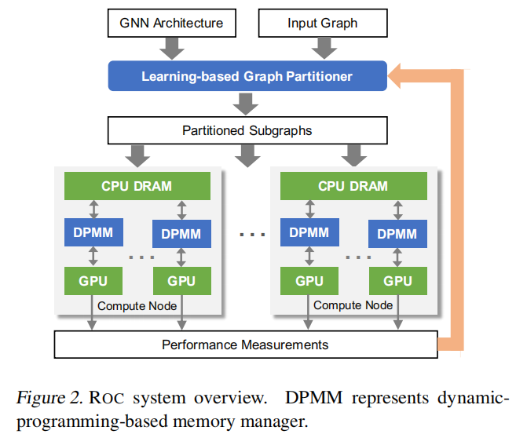


## 图的划分

> 现有图划分方法的缺点

最小化启发式目标函数来静态划分图，例如通过跨越不同分区的边的数目，这些函数适用于在数据密集型图，但是不适用于计算密集的图，因为某个点的计算负载可能非常大。

动态重新分区的方法，通过对之前迭代的性能衡量来平衡负载，这种方法在GNN训练中可以达到收敛，但是在推断上不太有用，因为每个新图只计算一次GNN模型。


> 在线的线性回归图划分


将之前处理过的运行性能作为训练样本，然后用于预测任意新图的性能。

代价模型学会预测GNN中的一层的执行时间，而不是整个图结构，因为神经网络可组合性使得代价模型可以适用于任何GNN模型，而且型对于整个图（P个分区）可以获得更多的训练数据（N$\times$P）。

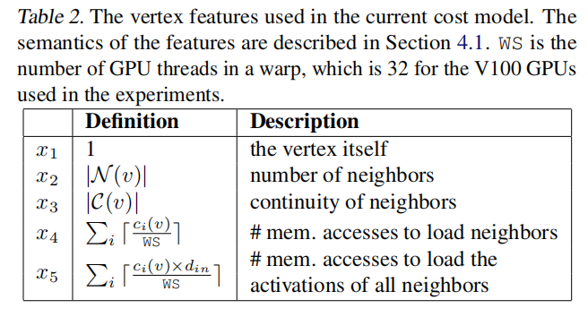


> 分区算法

使用Lux算法最大化合并访问GPU内存。


## 内存管理

Roc将所有的GNN计算放到GPU中执行，但是CPU需要容纳所有GNN数据，CPU和GPU的数据传输得数量通过动态规划来确定。

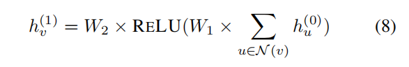


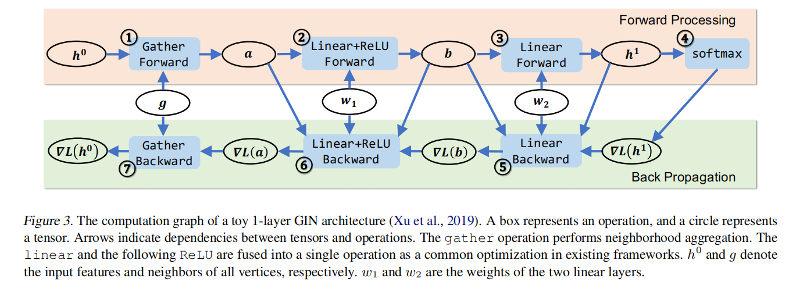

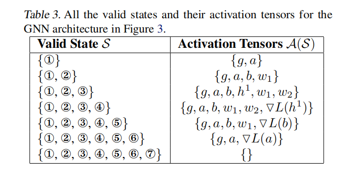

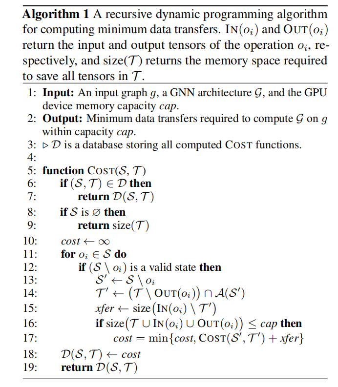


## 问题

### q1

**什么是有效地状态S？**


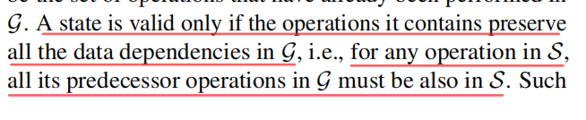

### q2

**不太理解line14？**

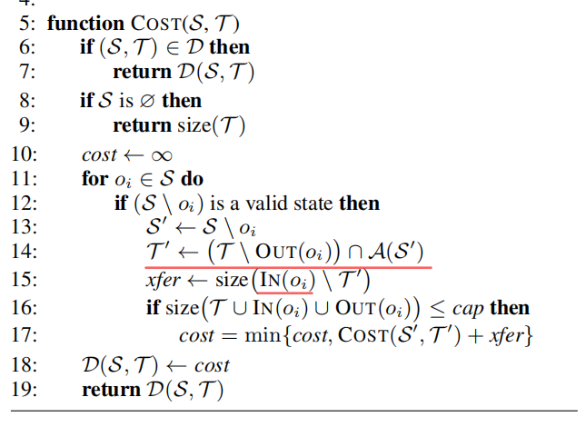


### q3

**不太理解特征4和特征5？**

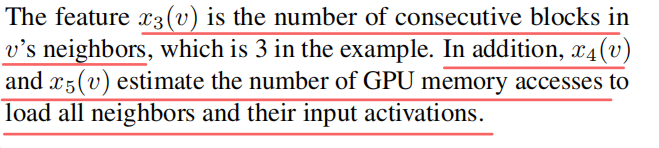


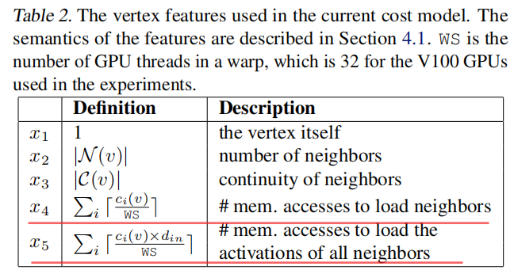


### q4

**动态分区，图推断为什么只用计算一次，图推断的过程是什么？**

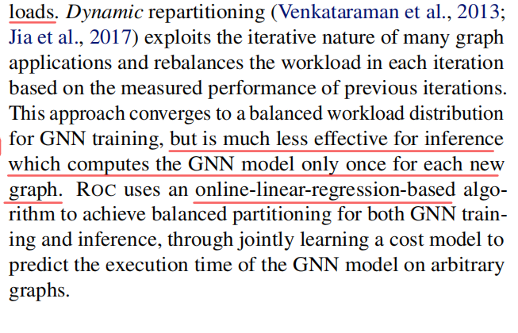


​	

