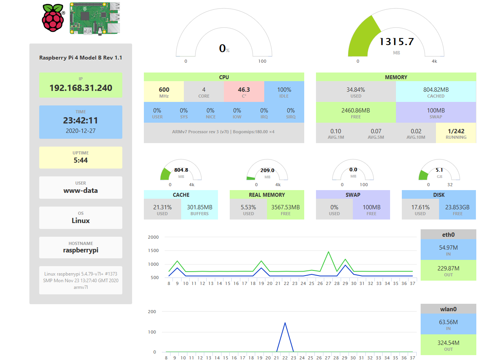

---

typora-copy-images-to: img

---


> 安装软件包

```bash
sudo apt-get install nginx php7.3-fpm php7.3-cli php7.3-curl php7.3-gd php7.3-cgi
```


> 开启系统服务

```bash
sudo service nginx restart
sudo service php7.3-fpm restart
```

浏览器访问`http://树莓派ip`


> 修改配置文件


`sudo vim /etc/nginx/sites-available/default`

```bash
location / {
	# First attempt to serve request as file, then
	# as directory, then fall back to displaying a 404.
	try_files $uri $uri/ =404;
}
```

替换为

```bash
location / {
	index  index.html index.htm index.php default.html default.htm default.php;
}
 
location ~\.php$ {
	fastcgi_pass unix:/run/php/php7.3-fpm.sock;
	# fastcgi_pass 127.0.0.1:9000;
	fastcgi_param SCRIPT_FILENAME $document_root$fastcgi_script_name;
	include fastcgi_params;
}
```


重启服务`sudo service nginx restart`


> 部署项目

```bash
sudo git clone https://github.com/nxez/pi-dashboard.git /var/www/html/pi-dashboard

sudo chown -R www-data /var/www/html/pi-dashboard
```

浏览器访问`http://树莓派ip/pi-dashboard`


