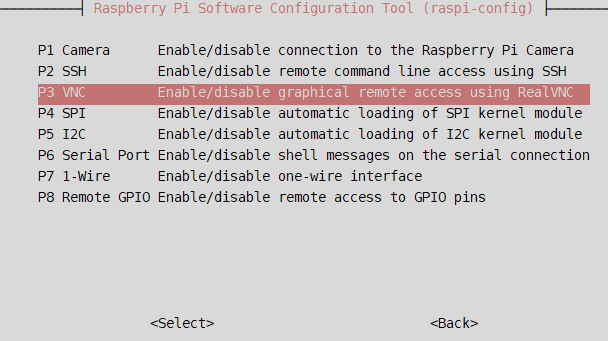
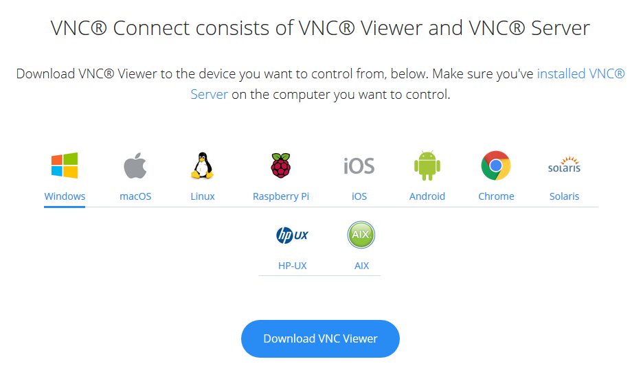
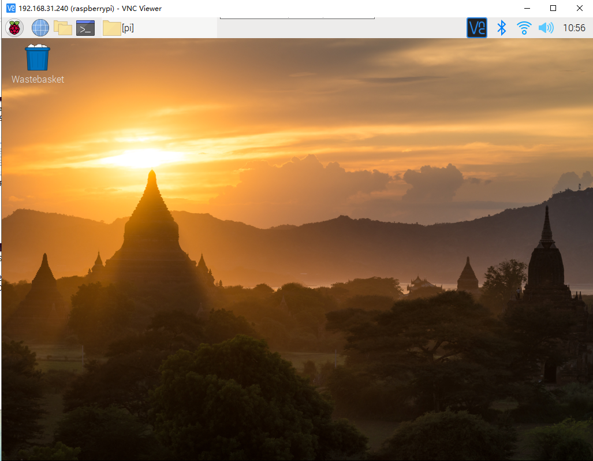
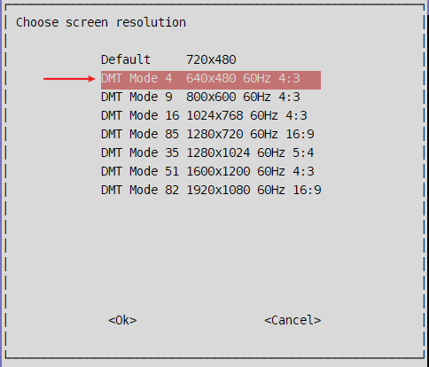

---

typora-copy-images-to: img

---


## 开启VNC服务

```bash
sudo raspi-config
```





## 客户端下载

[realVNC](https://www.realvnc.com/en/connect/download/viewer/windows/)







## 常见错误


可以通过通过设置树莓派的分辨率解决。

```bash
sudo raspi-config
```


选择适合自己的分辨率，尽量先别选Default...

