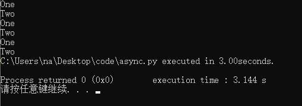
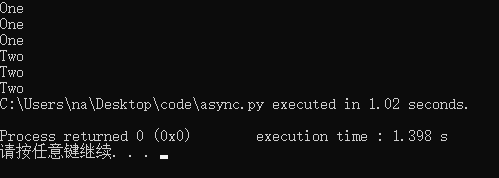
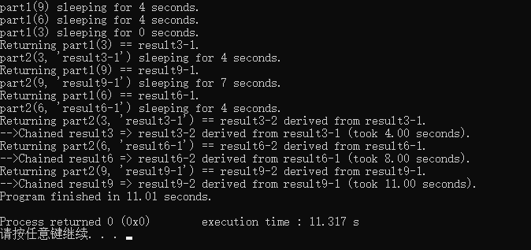

---

typora-copy-images-to: img\asyncio

---

## 协程

协程本质是一个单线程，由用户决定切换的时机，操作系统不参与切换，资源开销小，效率更高。

程序遇到耗时的IO操作时，可以临时的交出cpu控制权，等IO操作执行完再回收控制权。

python中使用async/await。


## 同步和异步

```python
# synchronous
import time

def count():
    print("One")
    time.sleep(1)
    print("Two")

def main():
    for _ in range(3):
        count()

if __name__ == '__main__':
    s = time.perf_counter()
    main()
    elapsed = time.perf_counter() - s
    print(f'{__file__} executed in {elapsed:0.2f}seconds.')
```




```python
# asynchronous 
import asyncio

async def count():
    print("One")
    await asyncio.sleep(1)
    # time.sleep(1)
    print("Two")

async def main():
    await asyncio.gather(count(), count(), count())

if __name__ == '__main__':
    import time
    s = time.perf_counter()
    asyncio.run(main())
    elapsed = time.perf_counter() - s
    print(f'{__file__} executed in {elapsed:0.2f} seconds.')

```



输出的顺序就是async IO的核心，当程序执行到`await asyncio.sleep(1)`时，函数交出cpu的控制权，这时cpu就可以执行其他的任务。相对于`time.sleep(1)`来说`asyncio.sleep(1)`是一个非阻塞函数。


await修饰修饰词的意思时，挂起当前的函数执行，直到期待的值返回，在此期间先执行其他的函数。

```python
async def g():
    # Pause here and come back to g() when f() is ready
    r = await f()
    return r
```


## Chaining Coroutines

```python
import asyncio
import random
import time

async def part1(n):
    i = random.randint(0, 10)
    print(f"part1({n}) sleeping for {i} seconds.")
    await asyncio.sleep(i)
    result = f"result{n}-1"
    print(f"Returning part1({n}) == {result}.")
    return result

async def part2(n, arg):
    i = random.randint(0, 10)
    print(f"part2{n, arg} sleeping for {i} seconds.")
    await asyncio.sleep(i)
    result = f"result{n}-2 derived from {arg}"
    print(f"Returning part2{n, arg} == {result}.")
    return result

async def chain(n):
    start = time.perf_counter()
    p1 = await part1(n)
    p2 = await part2(n, p1)
    end = time.perf_counter() - start
    print(f"-->Chained result{n} => {p2} (took {end:0.2f} seconds).")

async def main(*args):
    await asyncio.gather(*(chain(n) for n in args))

if __name__ == '__main__':
    import sys
    random.seed(444)
    args = [9, 6, 3] if len(sys.argv) == 1 else map(int, sys.argv[1:])
    start = time.perf_counter()
    asyncio.run(main(*args))
    end = time.perf_counter() - start
    print(f"Program finished in {end:0.2f} seconds.")
```



