---

typora-copy-images-to: img\python

---

## 基础语法

### print

```python
# 打印到屏幕
print('hello Tom')
print('hello', 'Bob')

# 打印到文件
fp = open('test.txt', 'a')
print('hello!', file=fp)
fp.close()

# 换行
print('hello\nworld')
"""
hello
world
"""

# 制表符
print('hello\tworld') # hello   world

# 回车
print('hello\rworld') # world

# 退格
print('hello\bworld') # hellworld

# \
print('http:\\\\') # http:\\

# 原字符，最后不能是\
print(r'hello\nworld') # hello\nworld

# 保留字
import keyword
print(keyword.kwlist)
"""
['False', 'None', 'True', 'and', 'as', 'assert', 'async', 'await', 'break', 'class', 'continue', 'def', 'del', 'elif', 'else', 'except', 'finally', 'for', 'from', 'global', 'if', 'import', 'in', 'is', 'lambda', 'nonlocal', 'not', 'or', 'pass', 'raise', 'return', 'try', 'while', 'with', 'yield']
"""
```


### 变量

```python
name = 'Bob'
print('标识:', id(name))
print('类型:', type(name))
print('值:', name)
print(id('Bob'))

"""
标识: 2851856361840
类型: <class 'str'>
值: Bob
2851856361840
"""
```

变量中的值存放在一个内存单元中，内存单元的地址对应一个id，变量实际保存这个id。


### 数据类型

```python
# 整型
print('10进制:', 110)       # 10进制: 110
print('2进制:', 0b110)      # 2进制: 6
print('8进制:', 0o170)      # 8进制: 120
print('16进制:', 0x1EAF)    # 16进制: 7855

# 浮点型
print(1.1+2.2)  # 3.3000000000000003
from decimal import Decimal
print(Decimal('1.1') + Decimal('2.2')) # 3.3

# 布尔类型
T = True
F = False
print(T, F)

# 字符串类型
str1 = 'hello world!'
str2 = "hello world!"
str3 = '''hello
        world!'''
str4 = """hello
        world!"""
print(str1)
print(str2)
print(str3)
print(str4)

# 其他数据类型 -> 字符串
print("hello" +str(123)) # hello123

# 浮点、字符串整数、布尔类型 -> 整数
print(int(1.63))    # 1
print(int('123'))   # 123
print(int(False))   # 0
# print(int('1.23')) not allow

# 整型、字符串数字、布尔类型 -> 浮点型
print(float(2))         # 2.0
print(float('2'))       # 2.0
print(float('1.23'))    # 1.23
print(float(True))      # 1.0
```


### 输入

```
a = int(input("输入a:"))
b = int(input("输入b:"))
print('a + b = ', a+b)
```


### 算术运算

```python
# 算术运算
print(1+1)  # 2
print(1-1)  # 0
print(1*2)  # 2
print(1/2)  # 0.5

# 整除，向下取整
print(9//4)  # 2
print(-9//4) # -3
print(9//-4) # -3

# 取模，被除数-除数*商
print(9%4)  # 1
print(9%-4) # -3
print(-9%4) # 3
```


### 赋值运算

```python
# 链式赋值，浅拷贝
a = b = c = 10
print(a, id(a))
print(b, id(a))
print(c, id(a))
'''
10 140710539465392
10 140710539465392
10 140710539465392
'''

# 参数赋值
a = 10
a += 10     # 20
a -= 10     # 10
a *= 2      # 20
a /= 3      # 6.666666666666667
a //= 2     # 3.0
a %= 2      # 1.0

# 解包赋值
a, b= 1, 2
print(a, b) # 1 2

a, b = b, a
print(a, b) # 2 1
```


### 比较运算符

```python
a, b = 10, 20
print('a > b?', a>b)      # False
print('a < b?', a<b)      # True
print('a >= b?', a>=b)    # False
print('a <= b?', a<=b)    # True

l1 = [1, 2, 3]
l2 = [1, 2, 3]
print('l1 == l2?', l1==l2)      # True，数值比较
print('l1 is l2?', l1 is l2)    # False，id比较
print(l1 is not l2)             # True
print(id(l1), id(l2))           # 1615788849928 1615816075272
```


### 布尔运算符

```python
a, b = 5, 15

print(a < 10 and b < 10)    # False
print(a < 10 or b < 10)     # True

print(not False)            # True
print(not True)             # False

s = 'hello'
print('w' in s)             # False
print('w' not in s)         # True
```


### 条件判断

```python
a, b = 10, 20
mx = a if a >= b else b
print(mx) # 20
```


### range

无论range表示的序列有多长，所有的range对象占用的内存空间都是相同的，只存储start、stop、step。

```python
# [0, 10) step = 1
r = range(10) # 迭代器
print(r) # range(0, 10)
print(list(r)) # [0, 1, 2, 3, 4, 5, 6, 7, 8, 9]

# [1, 10) step = 1
range(1, 10) # 1 2 3 4 5 6 7 8 9

# [1, 10) step = 2
range(1, 10) # 1 3 5 7 9
```


## 数据类型

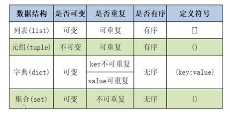

### list

- 元素有序排列
- 索引映射唯一数据
- 可以存储重复数据
- 数据类型混存
- 动态分配和回收内存

```python
# list创建
lst = ['hello', 123, 'world', 123]
lst2 = list(['hello', 123, 'world', 123])

# 列表生成式 
lst = [i*i for i in range(0, 10)] 
# [0, 1, 4, 9, 16, 25, 36, 49, 64, 81]

[n for n in range(1, 10) if n % 2 == 0] 
# [2, 4, 6, 8]

[letter.lower() for letter in 'ABCDEFGHI']	
# ['a', 'b', 'c', 'd', 'e', 'f', 'g', 'h', 'i']
```


**增加元素**

```python
# 获取元素索引，相同返回第一个 （ValueError）
idx = lst.index(123)
idx2 = lst.index(123, 2, 4)

# append
lst = ['hello', 123, 'world']
lst2 = ['haha', 'heihei']
lst.append(111)
print(lst) # ['hello', 123, 'world', 111]

lst = ['hello', 123, 'world']
lst2 = ['haha', 'heihei']
lst.append(lst2)
print(lst) # ['hello', 123, 'world', ['haha', 'heihei']]

# extend, 扩展多个元素
lst = ['hello', 123, 'world']
lst2 = ['haha', 'heihei']
lst.extend(lst2)
print(lst) # ['hello', 123, 'world', 123, 'haha', 'heihei']

# insert
lst = ['hello', 123, 'world']
lst.insert(1, 110)
print(lst) # ['hello', 110, 123, 'world']

# 切片添加
lst = ['hello', 123, 'world']
lst2 = ['haha', 'heihei']
lst[1:2] = lst2
print(lst) # ['hello', 'haha', 'heihei', 'world']
```


**删除元素**

```python
# remove
lst = ['hello', 123, 'world', 123]
lst.remove(123)
print(lst) # ['hello', 'world', 123]

# pop, 删除指定索引元素，默认删除最后一个元素
lst = ['hello', 123, 'world', 123]
lst.pop()
print(lst) # ['hello', 123, 'world']

lst = ['hello', 123, 'world', 123]
lst.pop(1)
print(lst) # ['hello', 'world', 123]

# 切片删除
lst = ['hello', 123, 'world']
lst[1:2] = []
print(lst) # ['hello', 'world']

# clear, 清空
lst = ['hello', 123, 'world']
lst.clear()
print(lst) # []
```


**修改元素**

```python
# 索引修改
lst = ['hello', 123, 'world']
lst[1] = 'haha'
print(lst) # ['hello', 'haha', 'world']

# 切片
lst = ['hello', 123, 'world']
lst[1:2] = ['alice', 'bob']
print(lst) # ['hello', 'alice', 'bob', 'world']
```


**排序**

```python
# sort，内部排序
lst = [1, 3, 4, 8, 9, 7, 6]
lst.sort() # 升序
lst.sort(reverse=True) # 降序
print(lst)

# sorted，产生新的对象
lst = [1, 3, 4, 8, 9, 7, 6]
new_lst = sorted(lst) # 升序
new_lst = sorted(lst, reverse=True) # 降序
print(new_lst)

# 指定排序规则
def f(x):
    return len(x)
a = [[1, 2, 3], ['a'], [123, 'b']]
print(sorted(a, key=f)) # [['a'], [123, 'b'], [1, 2, 3]]
```


### dict

- 字典是{key:value}键值对的存在，无序
- key不能重复出现，value可以重复
- key是不可变且不可修改，不能用不确定的元素定义
- value可修改为任意对象
- 不支持切片

```python
# 创建字典
d = {} # {}
scores = {'bob': 100, 'alice': 99} # {'bob': 100, 'alice': 99}
student = dict(name='bob', age=20, score=99) # {'name': 'bob', 'age': 20, 'score': 99}

{i: i+1 for i in range(4)} 
# {0: 1, 1: 2, 2: 3, 3: 4}

{i: j for i, j in zip(range(1, 6), 'abcde')} 
# {1: 'a', 2: 'b', 3: 'c', 4: 'd', 5: 'e'}

{i: j.upper() for i, j in zip(range(1, 6), 'abcde')}  
# {1: 'A', 2: 'B', 3: 'C', 4: 'D', 5: 'E'}

# 获取元素
print(scores['bob']) # 100
print(scores.get('bob')) # 100

print(scores['jim']) # Key Values error
print(scores.get('jim')) # None
print(scores.get('jim', 99)) # 99

# del
scores = {'bob': 100, 'alice': 99}
del scores['alice']
print(scores) # {'bob': 100}

# clear
scores.clear() # {}

# 视图
scores = {'bob': 100, 'alice': 99}
keys = scores.keys() # dict_keys(['bob', 'alice'])
values = scores.values() # dict_values([100, 99])
items = scores.items() # dict_items([('bob', 100), ('alice', 99)])
```


### tuple

元组同样也是存储的引用，引用是不可以更改的，引用指向的对象是可以修改的。

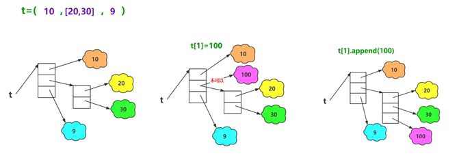

10，9不可修改，[20,30]不能修改为其他数据类型，不过因为list支持修改，所以可以增删改查元素。

```python
# 创建元组
t = tuple(('python', 'hello', 100))

t = ('python', 'hello', 100)
t = ('python',) 

t = ()
```


### set

```python
# 创建
s = {1, 2, 3, 3} # {1, 2, 3}
s = set(range(3)) # {0, 1, 2}
s = set([1, 2, 3]) # {1, 2, 3}
s = set((3, 1, 2, 'ha')) # {3, 1, 2, 'ha'}
s = set('python') # {'h', 'y', 'p', 'n', 't', 'o'}
s = set() # 空

s = {i*i for i in range(0, 10)} 
# {0, 1, 64, 4, 36, 9, 16, 49, 81, 25}

# 添加
s = {1}
s.add('hello') # {1, 'hello'}
s.update([2, 3]) # {1, 2, 3, 'hello'}

# remove
s = {1, 2, 3}
s.remove(1) # {2, 3}
s.remove(4) # KeyError

# discard
s = {1, 2, 3}
s.discard(1) # {2, 3}
s.discard(4) # 不抛异常

s.pop() # 随机删除并返回删除元素
clear() # 清空
```


集合关系

```python
# 相等
s1 = {1, 2, 3}
s2 = {2, 3, 1}
print(s1 == s2) # True

# 子集
s1 = {1, 2, 3}
s2 = {2, 1}
print(s2.issubset(s1)) # True

# 超集
s1 = {1, 2, 3}
s2 = {2, 1}
print(s1.issuperset(s2)) # True

# 交集
s1 = {1, 2, 3}
s2 = {2, 1}
print(s2.isdisjoint(s1)) # False
```


集合操作


```python
s1 = {1, 2, 3}
s2 = {1, 4}

# 交集
print(s1.intersection(s2))
print(s1 & s2)
# {1}

# 并集
print(s1.union(s2)) 
print(s1 | s2)
# {1, 2, 3, 4}

# 差集
print(s1.difference(s2))
print(s1 - s2)
# {2, 3}

# 对称差集
print(s1.symmetric_difference(s2))
print(s1 ^ s2)
# {2, 3, 4}
```


### 字符串

字符串有一套驻留机制，满足条件的相同字符串拥有相同的地址空间。

字符串的长度为0、1

符合标识符(字母、数字、下划线)的字符串 （交互模式）

```python
>>> a = 'abc%'
>>> b = 'abc%'
>>> print(a is b)
False
```


字符串只在编译时进行驻留，而非运行时

```python
a = 'abc'
b = 'ab' + 'c'
c = 'a'.join('bc')
print(a is b) # True
print(a is c) # False
```

[-5, 256]之间的整数数字（交互）

```python
>>> a = 257
>>> b = 257
>>> a is b
False
>>> a = 256
>>> b = 256
>>> a is b
True
>>> a = -6
>>> b = -6
>>> a is b
False
>>> a = -5
>>> b = -5
>>> a is b
True
```

强制驻留

```python
>>> import sys
>>> a = 'abc%'
>>> b = 'abc%'
>>> a is b
False
>>> a = sys.intern(b)
>>> a is b
True
```

**字符串查找**

```python
# index、rindex，不存在抛异常ValueError
s = 'hell no hell'
print(s.index('hell'))  # 0
print(s.rindex('hell')) # 8

# find、rfind，不存在返回-1
print(s.find('hell'))   # 0
print(s.rfind('hell'))  # 8
```


**大小写转换**

```python
s = 'abCD abCD'
# 转大写
print(s.upper())        # ABCD ABCD

# 转小写
print(s.lower())        # abcd abcd

# 大写转小写，小写转大写
print(s.swapcase())     # ABcd ABcd

# 首字母大写，其他小写
print(s.capitalize())   # Abcd abcd

# 每个单词首字母大写，其他小写
print(s.title())        # Abcd Abcd
```


**内容对齐**

```python
s = 'hello world'

# 居中对齐，参数：宽度、填充物(可选)
print(s.center(13, '-')) # -hello world-

# 左对齐，参数：宽度、填充物(可选)
print(s.ljust(13, '-')) # hello world--

# 右对齐，参数：宽度、填充物(可选)
print(s.rjust(13, '-'))	# --hello world

# 右对齐，参数：宽度，填充物为0
print(s.zfill(13)) # 00hello world 
```


**字符串分割**

```python
# split， 返回列表，默认按空格分割
# sep指定分隔符，maxsplit最大分割次数
s = 'he he he,he,he'
print(s.split(' '))         # ['he', 'he', 'he,he,he']
print(s.split(maxsplit=1))  # ['he', 'he he,he,he']
print(s.split(sep=','))     # ['he he he', 'he', 'he']

# rsplit，从右侧开始
```


**字符串判断**

```python
# 是否为合法标识符
isidentifier()

# 是否全为空白字符组成 (回车、换行、水平制表符)
isspace()

# 是否全为字母组成
isalpha()

# 是否全为十进制数字组成
isdecimal()

# 是否全为数字组成, 支持中文、罗马数字
isnumeric()

# 是否全为字母和数字组成，支持中文、罗马数字
isalnum()
```


**其他操作**

```python
# replace，（被替换、替换、次数）
s = 'hello cpp cpp'
print(s.replace('cpp', 'python', 1)) # hello python cpp

# join，将列表或元组中的字符串合并为一个字符串
lst = ['hello', 'world']
print(', '.join(lst)) # hello, world
print('*'.join('python')) # p*y*t*h*o*n

# chr，数字对应的字符
# ord，字符对应的ascii
print(ord('a')) # 97
print(chr(97))  # a
```


**格式化字符串**

```python
name, age = 'sanzo', 20
s = '%s, 我叫%s, 今年%d岁了' % (name, name, age) 
s = '{0}, 我叫{0}, 今年{1}岁了'.format(name, age)
s = f'我叫{name}, 今年{age}岁了'
# 我叫sanzo, 今年20岁了

# 精度
pi = 3.1415926
print('%.3f' % pi)          # 保留3位小数
print('{0:.3f}'.format(pi)) # 保留3位小数
print('%10f' % pi)          # 宽度10
print('{0:10f}'.format(pi)) # 宽度10
```


**编码转换**

```python
s = '无花无酒锄作田'
# 编码 
bytes = s.encode(encoding='utf-8')   # utf-8 三个字节
bytes = s.encode(encoding='gbk')     # gbk 两个字节

# 解码
bytes.decode(encoding='gbk')
bytes.decode(encoding='utf-8')
```


## 函数

函数调用过程，如果对象是不可修改的，在函数体内的修改不会影响实参的值。

```python
def cal(a, b):
    return (a+b)

n1 = 10
n2 = 20

print(cal(n1, n2))      # 位置传参
print(cal(a=n1, b=n2))  # 关键字传参
```


**返回值**

- 可以没有返回值
- 如果有多个返回值，返回类型为tuple

```python
def fun(n):
    odd = list()
    even = list()

    for i in range(n):
        if i % 2:
            odd.append(i)
        else:
            even.append(i)
    
    return odd, even

ret = fun(10)
print(type(ret), ret)
# <class 'tuple'> ([1, 3, 5, 7, 9], [0, 2, 4, 6, 8])
```


**可变参数**

```python
# 可变位置参数，tuplue
def fun1(*arg):
    print(type(arg), arg)

fun1(10, 'hello')

# 可变关键字参数，dict
def fun2(**arg):
    print(type(arg), arg)

fun2(a=10, b=20)

# 同时包含位置可变和关键字可变时，位置可变放在前面
def fun3(*arg1, **arg2):
    print(arg1, arg2)

fun3(10, 20, a=10, b=20) 
```

```python
def fun1(a, b, c):
    print(a, b, c)

# 转为位置实参
l = [1, 2, 3]
fun1(*l)

# 转为关键字实参
d = {'c': 10, 'b': 20, 'a': 30}
fun1(**d)

# *号后面只能使用关键字传参
def fun2(a, b,*, c):
    print(a, b, c)
fun2(10, 20, c=30)
```


## 异常处理

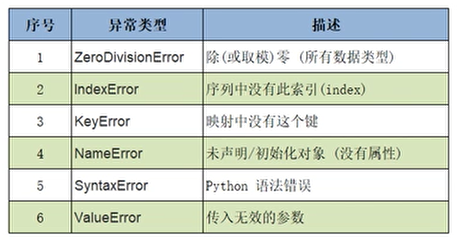

**try except**

```python
try:
    a = int(input('输输入第一个整数:'))
    b = int(input('请输入第二个整数:'))
    result = a / b
    print('结果:', result)
except ZeroDivisionError:
    print('对不起，除数不能为0')
except BaseException:
    print('只能输入数字')     
print('程序结束')  
```


**try except else**

```python
try:
    a = int(input('输输入第一个整数:'))
    b = int(input('请输入第二个整数:'))
    result = a / b
except ZeroDivisionError:
    print('对不起，除数不能为0')   
except BaseException:
    print('只能输入数字')     
else:
    print('结果:', result)
```


**try except else finally**

```python
try:
    a = int(input('输输入第一个整数:'))
    b = int(input('请输入第二个整数:'))
    result = a / b
except ZeroDivisionError:
    print('对不起，除数不能为0')   
except BaseException:
    print('只能输入数字')     
else:
    print('结果:', result)
finally:
    print('无论如何都会执行')  
```


**traceback**

```python
import traceback
try:
    result = 10 / 0
except:
    traceback.print_exc()

Traceback (most recent call last):
  File "c:\Users\na\Desktop\python\code.py", line 3, in <module>
    result = 10 / 0
ZeroDivisionError: division by zero
```


## 类和对象

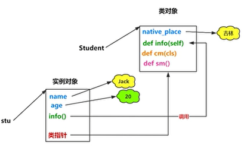


### 类、实例对象

```python
class Student:
    # 类属性
    location = '郑州'

    # 构造函数
    def __init__(self, name, age):
        self.name = name
        self.age = age

    # 实例方法
    def eat(self):
        print('吃饭')

    # 静态方法
    @staticmethod
    def sm():
        print('静态方法')

    @classmethod
    def cm(cls):
        print('类方法')

stu = Student('sanzo', 20)

stu.eat()
stu.sm()
stu.cm()

Student.eat(stu)
Student.sm()
Student.cm()
```


```python
stu1 = Student('sanzo', 20)
stu2 = Student('alice', 18)

print(stu1.location, stu2.location)
Student.location = '沈阳'
print(stu1.location, stu2.location)
```


### 动态绑定

```python
class Student:
    def __init__(self, name, age):
        self.name = name
        self.age = age

    def eat(self):
        print(self.name + '正在吃饭...')

stu1 = Student('sanzo', 20)
stu2 = Student('alice', 18)

# 动态绑定属性
stu1.sex = 'male' 
print(stu1.name, stu1.age, stu1.sex)
print(stu2.name, stu2.age)

# 动态绑定方法
def show():
    print('动态绑定方法')
stu1.show = show
stu1.show()    
```


### 三大特性

**封装**

```python
class Student:
    def __init__(self, name, age):
        self.name = name
        self.__age = age # 私有方法

    def show(self):
        print(self.name, self.__age)

stu = Student('sanzo', 20) 
# print(stu.__age) # 类外不能访问
print(dir(stu)) # 查看所有的变量、方法
print(stu._Student__age) # 类外访问方法
```


**继承**

- 支持多继承，

- 默认继承object
- 必须在子类的构造函数调用父类的构造函数

```python
class Person(object):
    def __init__(self, name, age):
        self.name = name
        self.age = age

    def info(self):
        print(self.name, self.age)

class Student(Person):
    def __init__(self, name, age, score):
        super().__init__(name, age) # 调用父类构造函数
        self.score = score
    
    # 方法重写
    def info(self):
        super().info() # 调用父类方法
        print(self.score)
        
stu = Student('sanzo', 20, 99)        
stu.info()

'''
sanzo 20
99
'''
```


**多态**

静态语言实现多态要求：

- 继承
- 重写
- 父类引用执行子类对象

python是动态语言，对多态的要求不太严格，不关心对象的类型，只关心对象的行为。

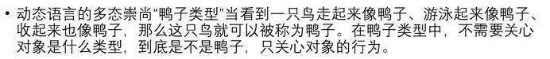

```python
class Animal(object):
    def eat(self):
        print('动物会吃')

class Dog(Animal):
    def eat(self):
        print('狗吃屎')

class Cat(Animal):
    def eat(self):
        print('猫吃🐟')

class Person(object):
    def eat(self):
        print('人吃万物')

def fun(obj):
    obj.eat()

dog = Dog()
cat = Cat()
person = Person()

fun(dog)
fun(cat)
fun(person)
```


### object类

使用dir可以查看对象所有属性：

```python
class Person(object):
    def __init__(self, name, age):
        self.name = name
        self.age = age

    def info(self):
        print(self.name, self.age)

p = Person('sanzo', 20)
print(dir(p))
'''
['__class__', '__delattr__', '__dict__', '__dir__', '__doc__', '__eq__', '__format__', '__ge__', '__getattribute__', '__gt__', '__hash__', '__init__', '__init_subclass__', '__le__', '__lt__', '__module__', '__ne__', '__new__', '__reduce__', '__reduce_ex__', '__repr__', '__setattr__', '__sizeof__', '__str__', '__subclasshook__', '__weakref__', 'age', 'info', 'name']
'''

print(p) # <__main__.Person object at 0x000001FA977C4308>
```

其中就包含了\_\_str\_\_()，它用于print输出，用户重写该方法实现自定义输出：

```python
class Person(object):
    def __init__(self, name, age):
        self.name = name
        self.age = age

    def info(self):
        print(self.name, self.age)

    def __str__(self):
        return '姓名: {0}, 年龄: {1}'.format(self.name, self.age)


p = Person('sanzo', 20)
print(p) # 姓名: sanzo, 年龄: 20
```


### 特殊属性方法

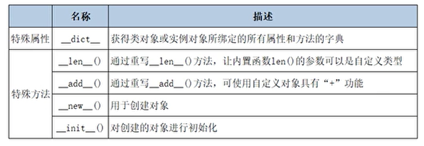

```python
# __dict__
class A:
    def __init__(self, name, age):
        self.name = name
        self.age = age

    def show(self):
        print(self.name, self.age)
    
    
a = A('sanzo', 20)

print(a.__dict__) # {'name': 'sanzo', 'age': 20}
```


```python
# __add__
class Student:
    def __init__(self, name, age):
        self.name = name
        self.age = age

    def __add__(self, other):
        return self.name + ' ' + other.name    
    
s1 = Student('sanzo', 20)
s2 = Student('alice', 20)
s = s1 + s2
s = s1.__add__(s2)
print(s) # sanzo alice
```


```python
# __len__
class Student:
    def __init__(self, name, age):
        self.name = name
        self.age = age

    def __len__(self):
        return len(self.name)         
    
s = Student('sanzo', 20)
print(len(s)) # 5
```


```python
# __new__、__init__
class Person(object):
    def __new__(cls, *args, **kwargs):
        print('调用Person的__new__, cls的id为{0}'.format(id(cls)))
        obj = super().__new__(cls)
        print('调用object的__new__, 创建obj的id为{0}'.format(id(obj)))
        return obj

    def __init__(self, name, age):
        print('调用Person的__init__, self的id为{0}'.format(id(self)))
        self.name = name
        self.age = age


print('类对象object的id为{0}'.format(id(object)))
print('类对象Person的id为{0}'.format(id(Person)))

p = Person('sanzo', 20)
print('实例对象p的id为{0}'.format(id(p)))

'''
类对象object的id为140728042220336
类对象Person的id为2681653732648
调用Person的__new__, cls的id为2681653732648
调用object的__new__, 创建obj的id为2681687598472
调用Person的__init__, self的id为2681687598472
实例对象p的id为2681687598472
'''
```

### 深浅拷贝

```python
class Cpu:
    pass

class Disk:
    pass

class Computer:
    def __init__(self, cpu, disk):
        self.cpu = cpu
        self.disk = disk

# 变量赋值
cpu1 = Cpu()
cpu2 = cpu1
print(id(cpu1), id(cpu2)) # 1733097506120 1733097506120

# 浅拷贝
import copy
cpu1 = Cpu()
disk1 = Disk() 
com1 = Computer(cpu1, disk1)
com2 = copy.copy(com1)
print('com1', id(com1), id(com1.cpu), id(com1.disk))
print('com2', id(com2), id(com2.cpu), id(com2.disk))
'''
com1 2722209290568 2722209290440 2722209288456
com2 2722209290632 2722209290440 2722209288456
'''

# 深拷贝
com2 = copy.deepcopy(com1)
print('com1', id(com1), id(com1.cpu), id(com1.disk))
print('com2', id(com2), id(com2.cpu), id(com2.disk))
'''
com1 2722209290568 2722209290440 2722209288456
com2 2722209291016 2722209291208 2722209290952
'''
```


## 模块和包

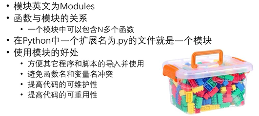


```python
import schedule

def job():
    print('hahaha~')

schedule.every(3).seconds.do(job)

while True:
    schedule.run_pending()
```


**常用的模块**

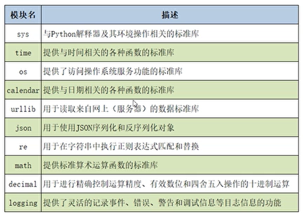


```python
import sys
print(sys.getsizeof(2))     # 28
print(sys.getsizeof(2.2))   # 24
print(sys.getsizeof(True))  # 28

import time
print(time.time())  # 1602730555.0144687
print(time.localtime(time.time()))
# time.struct_time(tm_year=2020, tm_mon=10, tm_mday=15, tm_hour=10, tm_min=55, tm_sec=55, tm_wday=3, tm_yday=289, tm_isdst=0)     
```


## 编码格式

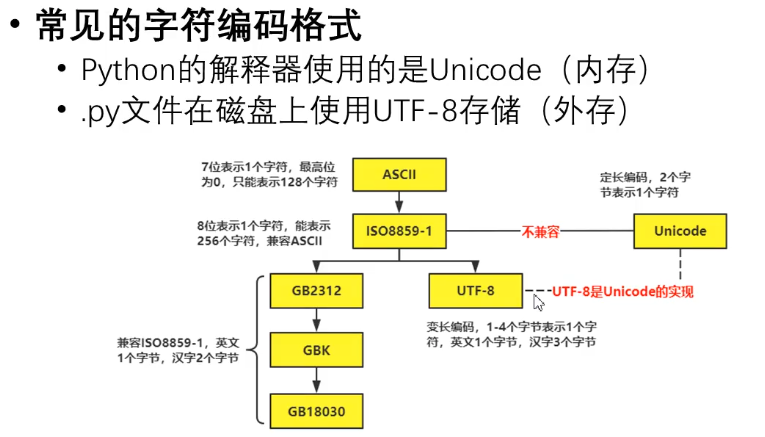

```
# encoding=utf-8
# encoding=gbk

print('hello world')
```


## 文件读写

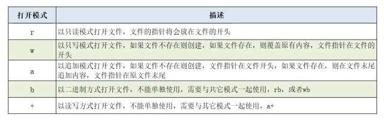

```python
f = open('test.txt', 'r+', encoding='utf-8')
print(f.read())
f.write('hello\n')
f.close()
```


with语句(上下文管理器)

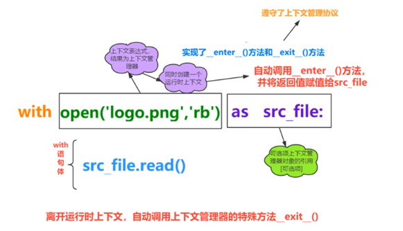

有点像C++的RAII模式，在构造中申请资源，在析构中释放资源。

```python
'''
实现了特殊方法__enter__、__exit__，称为类对象遵守了上下文管理器协议
类对象的实例对象，称为上下文管理器
'''
class MyContentMgr(object):
    def __enter__(self):
        print('调用__enter__')
        return self

    def __exit__(self, exc_type, exc_val, exc_tb):
        print('调用__exit__')

    def show(self):
        print('调用show')

with MyContentMgr() as mgr:
    pass    

'''
调用__enter__
调用__exit__
'''
```


```python
# 文件赋值
with open('test.txt', 'rb') as src_file:
    with open('copy_test.txt', 'wb') as dest_file:
        dest_file.write(src_file.read())
```


## 目录操作

**os模块**


**os.path模块**


 