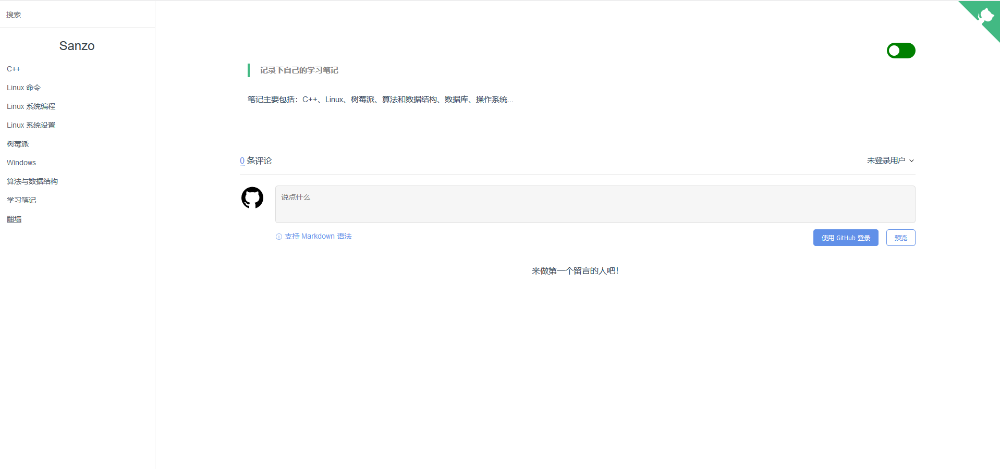
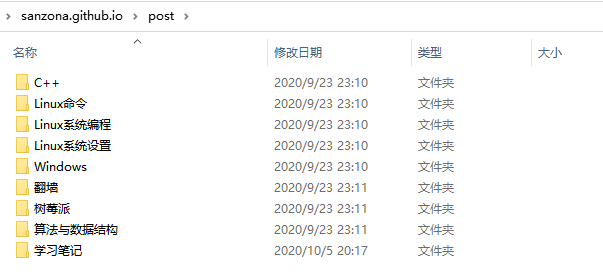
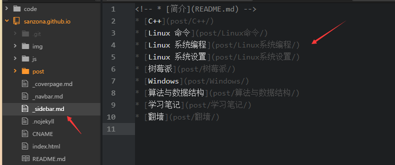
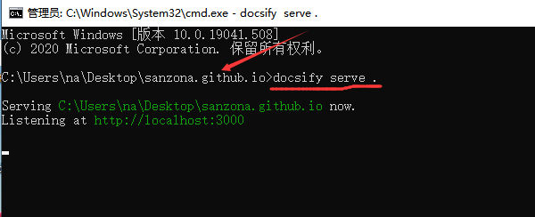

---

typora-copy-images-to: img\docsify

---


## Docsify介绍

docsify 是一个动态生成文档网站的工具。不同于 GitBook、Hexo 的地方是它不会生成将 `.md` 转成 `.html` 文件，所有转换工作都是在运行时进行。

这将非常实用，如果只是需要快速的搭建一个小型的文档网站，或者不想因为生成的一堆 `.html` 文件“污染” commit 记录，只需要创建一个 `index.html` 就可以开始写文档而且直接[部署在 GitHub Pages](https://docsify.js.org/#/zh-cn/deploy)。


## 项目展示

可以参考我个人搭建的docsify。

项目地址：[github.com/Sanzona/Note](https://github.com/Sanzona/Note)。

预览地址：[sanzo.top](https://sanzo.top/#/)

### **欢迎页面**


### **首页**



### **正文**


### **评论**


### **黑夜模式**


## 环境搭建

```bash
# 将项目克隆到本地
git clone git@github.com:Sanzona/Note.git
```


### **欢迎页面**

修改`_coverpage.md`文件，替换自己的github链接和头像。


### 目录结构

docsify的目录结构支持子目录。

> 设置父目录

将自己的目录放到post目录里：



同时修改对应的`_sidebar.md`文件。




### 添加新文章

将对应的markdown文件添加到对应的目录中，然后修改子目录中的`_sidebar.md`文件。


### 修改预览

使用cmd在项目目录地址，执行`docsify serve .`命令，可以在浏览器预览修改。

浏览器访问`localhost:3000`。




### 提交修改

最后通过git命令，将修改同步到仓库中即可。


