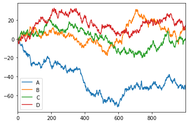
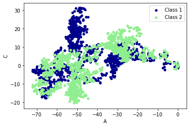

[b站视频](https://www.bilibili.com/video/BV1Ex411L7oT?p=11)

[pandas.ipynb](https://github.com/Sanzona/files/blob/master/ipynb/Pandas%E7%AC%94%E8%AE%B0.ipynb)

 ## 基本使用


```python
import pandas as pd
import numpy as np

# 创建数组
s = pd.Series([1, 2, 3, np.nan, 11])
print(s)
```

    0     1.0
    1     2.0
    2     3.0
    3     NaN
    4    11.0
    dtype: float64


```python
dates = pd.date_range('20200928', periods=6)
print(dates)
```

    DatetimeIndex(['2020-09-28', '2020-09-29', '2020-09-30', '2020-10-01',
                   '2020-10-02', '2020-10-03'],
                  dtype='datetime64[ns]', freq='D')


```python
# 创建矩阵，指定行名、列名
df = pd.DataFrame(np.random.randn(6, 4), index=dates, columns=['a', 'b', 'c', 'd'])
print(df)
```

                       a         b         c         d
    2020-09-28  0.329133  0.855724 -1.980535  1.192464
    2020-09-29  0.259986  1.633665  0.540650  0.624041
    2020-09-30 -0.695234 -1.102229 -0.561973  2.775647
    2020-10-01 -1.021586 -1.477676  0.647583  0.818406
    2020-10-02 -0.836655 -1.889947  0.449248 -0.156687
    2020-10-03 -0.141239  0.639270  0.977544  0.261483


```python
# 使用字典创建矩阵
df2 = pd.DataFrame({'A' : 1.,
                       'B' : pd.Timestamp('20130102'),
                        'C' : pd.Series(1,index=list(range(4)),dtype='float32'),
                        'D' : np.array([3] * 4,dtype='int32'),
                        'E' : pd.Categorical(["test","train","test","train"]),
                        'F' : 'foo'})
print(df2)
```

         A          B    C  D      E    F
    0  1.0 2013-01-02  1.0  3   test  foo
    1  1.0 2013-01-02  1.0  3  train  foo
    2  1.0 2013-01-02  1.0  3   test  foo
    3  1.0 2013-01-02  1.0  3  train  foo


```python
# 查看每列的数据类型
df2.dtypes
```


    A           float64
    B    datetime64[ns]
    C           float32
    D             int32
    E          category
    F            object
    dtype: object


```python
# 查看每行的名称
print(df2.index)

# 查看每列的名称
print(df2.columns)
```

    Int64Index([0, 1, 2, 3], dtype='int64')
    Index(['A', 'B', 'C', 'D', 'E', 'F'], dtype='object')


```python
# 查看所有的元素值
print(df2.values)
```

    [[1.0 Timestamp('2013-01-02 00:00:00') 1.0 3 'test' 'foo']
     [1.0 Timestamp('2013-01-02 00:00:00') 1.0 3 'train' 'foo']
     [1.0 Timestamp('2013-01-02 00:00:00') 1.0 3 'test' 'foo']
     [1.0 Timestamp('2013-01-02 00:00:00') 1.0 3 'train' 'foo']]


```python
# dataframe的一般信息
df2.describe()
print(df2)
```

         A          B    C  D      E    F
    0  1.0 2013-01-02  1.0  3   test  foo
    1  1.0 2013-01-02  1.0  3  train  foo
    2  1.0 2013-01-02  1.0  3   test  foo
    3  1.0 2013-01-02  1.0  3  train  foo


```python
# 矩阵转置
print(df2.T)
```

                         0                    1                    2  \
    A                    1                    1                    1   
    B  2013-01-02 00:00:00  2013-01-02 00:00:00  2013-01-02 00:00:00   
    C                    1                    1                    1   
    D                    3                    3                    3   
    E                 test                train                 test   
    F                  foo                  foo                  foo   
    
                         3  
    A                    1  
    B  2013-01-02 00:00:00  
    C                    1  
    D                    3  
    E                train  
    F                  foo  


```python
# 按照列名称降序排列
tmp = df2.sort_index(axis=1, ascending=False)
print(tmp)
```

         F      E  D    C          B    A
    0  foo   test  3  1.0 2013-01-02  1.0
    1  foo  train  3  1.0 2013-01-02  1.0
    2  foo   test  3  1.0 2013-01-02  1.0
    3  foo  train  3  1.0 2013-01-02  1.0


```python
# 按照行名称降序排列
tmp = df2.sort_index(axis=0, ascending=False)
print(tmp)
```

         A          B    C  D      E    F
    3  1.0 2013-01-02  1.0  3  train  foo
    2  1.0 2013-01-02  1.0  3   test  foo
    1  1.0 2013-01-02  1.0  3  train  foo
    0  1.0 2013-01-02  1.0  3   test  foo


```python
# 根据元素排序
tmp = df2.sort_values(by='E', ascending=False)
print(tmp)
```

         A          B    C  D      E    F
    1  1.0 2013-01-02  1.0  3  train  foo
    3  1.0 2013-01-02  1.0  3  train  foo
    0  1.0 2013-01-02  1.0  3   test  foo
    2  1.0 2013-01-02  1.0  3   test  foo


## 选择数据


```python
dates = pd.date_range('20200928', periods=6)
df = pd.DataFrame(np.arange(24).reshape((6,4)), index=dates, columns=['A', 'B', 'C', 'D'])
print(df)
```

                 A   B   C   D
    2020-09-28   0   1   2   3
    2020-09-29   4   5   6   7
    2020-09-30   8   9  10  11
    2020-10-01  12  13  14  15
    2020-10-02  16  17  18  19
    2020-10-03  20  21  22  23


```python
# 选择某一列
print(df['A'])
print(df.A)
```

    2020-09-28     0
    2020-09-29     4
    2020-09-30     8
    2020-10-01    12
    2020-10-02    16
    2020-10-03    20
    Freq: D, Name: A, dtype: int32
    2020-09-28     0
    2020-09-29     4
    2020-09-30     8
    2020-10-01    12
    2020-10-02    16
    2020-10-03    20
    Freq: D, Name: A, dtype: int32


```python
# 选择某一行
print(df.loc['20200930'])
print(df[2:3])
```

    A     8
    B     9
    C    10
    D    11
    Name: 2020-09-30 00:00:00, dtype: int32
                A  B   C   D
    2020-09-30  8  9  10  11


```python
# 指定范围的行和列
tmp = df2.loc[0:1, ['A', 'D']]
print(tmp)
```

         A  D
    0  1.0  3
    1  1.0  3


```python
# 通过索引定位
print(df.iloc[1, 0])
```

    4


```python
# 切片
print(df.iloc[1:3, 2:4])
print(df.iloc[[1,2], 2:4])
```

                 C   D
    2020-09-29   6   7
    2020-09-30  10  11
                 C   D
    2020-09-29   6   7
    2020-09-30  10  11


```python
# 条件筛选
print(df[df.A > 8])
```

                 A   B   C   D
    2020-10-01  12  13  14  15
    2020-10-02  16  17  18  19
    2020-10-03  20  21  22  23


## 设置值


```python
dates = pd.date_range('20200928', periods=6)
df = pd.DataFrame(np.arange(24).reshape((6,4)), index=dates, columns=['A', 'B', 'C', 'D'])
print(df)
```

                 A   B   C   D
    2020-09-28   0   1   2   3
    2020-09-29   4   5   6   7
    2020-09-30   8   9  10  11
    2020-10-01  12  13  14  15
    2020-10-02  16  17  18  19
    2020-10-03  20  21  22  23


```python
# 修改对应的值
df.iloc[2, 2] = 1111
df.loc['20200930', 'B'] = 2222
print(df)
```

                 A     B     C   D
    2020-09-28   0     1     2   3
    2020-09-29   4     5     6   7
    2020-09-30   8  2222  1111  11
    2020-10-01  12    13    14  15
    2020-10-02  16    17    18  19
    2020-10-03  20    21    22  23


```python
# 将A>4的所有B置0
df.B[df.A > 4] = 0
print(df)
```

                 A  B     C   D
    2020-09-28   0  1     2   3
    2020-09-29   4  5     6   7
    2020-09-30   8  0  1111  11
    2020-10-01  12  0    14  15
    2020-10-02  16  0    18  19
    2020-10-03  20  0    22  23


```python
# 将A>4的所有行置0
df[df.A > 4] = 0
print(df)
```

                A  B  C  D
    2020-09-28  0  1  2  3
    2020-09-29  4  5  6  7
    2020-09-30  0  0  0  0
    2020-10-01  0  0  0  0
    2020-10-02  0  0  0  0
    2020-10-03  0  0  0  0


```python
# 新增一列
df['F'] = np.nan
df['E'] = pd.Series([1,2,3,4,5,6], index=pd.date_range('20200928', periods=6))
print(df)
```

                A  B  C  D   F  E
    2020-09-28  0  1  2  3 NaN  1
    2020-09-29  4  5  6  7 NaN  2
    2020-09-30  0  0  0  0 NaN  3
    2020-10-01  0  0  0  0 NaN  4
    2020-10-02  0  0  0  0 NaN  5
    2020-10-03  0  0  0  0 NaN  6


## 处理数据


```python
dates = pd.date_range('20200928', periods=6)
df = pd.DataFrame(np.arange(24).reshape((6,4)), index=dates, columns=['A', 'B', 'C', 'D'])
df.iloc[0,1] = np.nan
df.iloc[1,2] = np.nan
print(df)
```

                 A     B     C   D
    2020-09-28   0   NaN   2.0   3
    2020-09-29   4   5.0   NaN   7
    2020-09-30   8   9.0  10.0  11
    2020-10-01  12  13.0  14.0  15
    2020-10-02  16  17.0  18.0  19
    2020-10-03  20  21.0  22.0  23


```python
# 丢掉包含NaN的行
tmp = df.dropna(axis=0, how='any')
print(tmp)
```

                 A     B     C   D
    2020-09-30   8   9.0  10.0  11
    2020-10-01  12  13.0  14.0  15
    2020-10-02  16  17.0  18.0  19
    2020-10-03  20  21.0  22.0  23


```python
# 丢掉全为NaN的行
tmp = df.dropna(axis=0, how='all')
print(tmp)
```

                 A     B     C   D
    2020-09-28   0   NaN   2.0   3
    2020-09-29   4   5.0   NaN   7
    2020-09-30   8   9.0  10.0  11
    2020-10-01  12  13.0  14.0  15
    2020-10-02  16  17.0  18.0  19
    2020-10-03  20  21.0  22.0  23


```python
dates = pd.date_range('20200928', periods=6)
df = pd.DataFrame(np.arange(24).reshape((6,4)), index=dates, columns=['A', 'B', 'C', 'D'])
df.iloc[0,1] = np.nan
df.iloc[1,2] = np.nan

# 将NaN值设为0
tmp = df.fillna(value=0)
print(tmp)
```

                 A     B     C   D
    2020-09-28   0   0.0   2.0   3
    2020-09-29   4   5.0   0.0   7
    2020-09-30   8   9.0  10.0  11
    2020-10-01  12  13.0  14.0  15
    2020-10-02  16  17.0  18.0  19
    2020-10-03  20  21.0  22.0  23


```python
dates = pd.date_range('20200928', periods=6)
df = pd.DataFrame(np.arange(24).reshape((6,4)), index=dates, columns=['A', 'B', 'C', 'D'])
df.iloc[0,1] = np.nan
df.iloc[1,2] = np.nan

# 判断是否有NaN
print(df.isnull())
print(np.any(df.isnull()) == True)
```

                    A      B      C      D
    2020-09-28  False   True  False  False
    2020-09-29  False  False   True  False
    2020-09-30  False  False  False  False
    2020-10-01  False  False  False  False
    2020-10-02  False  False  False  False
    2020-10-03  False  False  False  False
    True

## 导入导出

[student.csv](https://github.com/Sanzona/files/blob/master/other/student.csv)


```python
import pandas as pd

# 读文件
data = pd.read_csv('student.csv')
print(data)

# 写文件
data.to_json('student.json')
```

        Student ID  name   age  gender
    0         1100  Kelly   22  Female
    1         1101    Clo   21  Female
    2         1102  Tilly   22  Female
    3         1103   Tony   24    Male
    4         1104  David   20    Male
    5         1105  Catty   22  Female
    6         1106      M    3  Female
    7         1107      N   43    Male
    8         1108      A   13    Male
    9         1109      S   12    Male
    10        1110  David   33    Male
    11        1111     Dw    3  Female
    12        1112      Q   23    Male
    13        1113      W   21  Female


## 合并 concat


```python
df1 = pd.DataFrame(np.ones((3,4))*0, columns=['a', 'b', 'c', 'd'])
df2 = pd.DataFrame(np.ones((3,4))*1, columns=['a', 'b', 'c', 'd'])
df3 = pd.DataFrame(np.ones((3,4))*2, columns=['a', 'b', 'c', 'd'])
print(df1)
print(df2)
print(df3)
```

         a    b    c    d
    0  0.0  0.0  0.0  0.0
    1  0.0  0.0  0.0  0.0
    2  0.0  0.0  0.0  0.0
         a    b    c    d
    0  1.0  1.0  1.0  1.0
    1  1.0  1.0  1.0  1.0
    2  1.0  1.0  1.0  1.0
         a    b    c    d
    0  2.0  2.0  2.0  2.0
    1  2.0  2.0  2.0  2.0
    2  2.0  2.0  2.0  2.0


```python
# 纵向合并
res = pd.concat([df1, df2, df3], axis=0)
print(res)
```

         a    b    c    d
    0  0.0  0.0  0.0  0.0
    1  0.0  0.0  0.0  0.0
    2  0.0  0.0  0.0  0.0
    0  1.0  1.0  1.0  1.0
    1  1.0  1.0  1.0  1.0
    2  1.0  1.0  1.0  1.0
    0  2.0  2.0  2.0  2.0
    1  2.0  2.0  2.0  2.0
    2  2.0  2.0  2.0  2.0


```python
# 纵向合并 忽略行号
res = pd.concat([df1, df2, df3], axis=0, ignore_index=True)
print(res)
```

         a    b    c    d
    0  0.0  0.0  0.0  0.0
    1  0.0  0.0  0.0  0.0
    2  0.0  0.0  0.0  0.0
    3  1.0  1.0  1.0  1.0
    4  1.0  1.0  1.0  1.0
    5  1.0  1.0  1.0  1.0
    6  2.0  2.0  2.0  2.0
    7  2.0  2.0  2.0  2.0
    8  2.0  2.0  2.0  2.0


```python
df1 = pd.DataFrame(np.ones((3,4))*0, columns=['a', 'b', 'c', 'd'], index=[1, 2, 3])
df2 = pd.DataFrame(np.ones((3,4))*0, columns=['b', 'c', 'd', 'e'], index=[2, 3, 4])
print(df1)
print(df2)
```

         a    b    c    d
    1  0.0  0.0  0.0  0.0
    2  0.0  0.0  0.0  0.0
    3  0.0  0.0  0.0  0.0
         b    c    d    e
    2  0.0  0.0  0.0  0.0
    3  0.0  0.0  0.0  0.0
    4  0.0  0.0  0.0  0.0


```python
# 默认上下合并，不存在的数据补充为NaN，默认为outer
ret = pd.concat([df1, df2], ignore_index=True, sort=True)
# ret = pd.concat([df1, df2], join='outer', ignore_index=True, sort=True)
print(ret)
```

         a    b    c    d    e
    0  0.0  0.0  0.0  0.0  NaN
    1  0.0  0.0  0.0  0.0  NaN
    2  0.0  0.0  0.0  0.0  NaN
    3  NaN  0.0  0.0  0.0  0.0
    4  NaN  0.0  0.0  0.0  0.0
    5  NaN  0.0  0.0  0.0  0.0


```python
# 上下合并，之合并共有的元素
ret = pd.concat([df1, df2], join='inner', ignore_index=True, sort=True)
print(ret)
```

         b    c    d
    0  0.0  0.0  0.0
    1  0.0  0.0  0.0
    2  0.0  0.0  0.0
    3  0.0  0.0  0.0
    4  0.0  0.0  0.0
    5  0.0  0.0  0.0


```python
# reindex，指定按照那个索引合并
ret = pd.concat([df1, df2], axis=1).reindex(df1.index)
print(ret)
```

         a    b    c    d    b    c    d    e
    1  0.0  0.0  0.0  0.0  NaN  NaN  NaN  NaN
    2  0.0  0.0  0.0  0.0  0.0  0.0  0.0  0.0
    3  0.0  0.0  0.0  0.0  0.0  0.0  0.0  0.0


```python
# append 向下追加DataFrame
df1 = pd.DataFrame(np.ones((3,4))*0, columns=['a', 'b', 'c', 'd'])
df2 = pd.DataFrame(np.ones((3,4))*1, columns=['a', 'b', 'c', 'd'])
df3 = pd.DataFrame(np.ones((3,4))*2, columns=['a', 'b', 'c', 'd'])

ret = df1.append([df2, df3], ignore_index=True)
print(ret)
```

         a    b    c    d
    0  0.0  0.0  0.0  0.0
    1  0.0  0.0  0.0  0.0
    2  0.0  0.0  0.0  0.0
    3  1.0  1.0  1.0  1.0
    4  1.0  1.0  1.0  1.0
    5  1.0  1.0  1.0  1.0
    6  2.0  2.0  2.0  2.0
    7  2.0  2.0  2.0  2.0
    8  2.0  2.0  2.0  2.0


```python
# append 追加一行数据
df1 = pd.DataFrame(np.ones((3,4))*0, columns=['a', 'b', 'c', 'd'])
s1 = pd.Series([1, 2, 3, 4], index = ['a', 'b', 'c', 'd'])
ret = df1.append(s1, ignore_index=True)
print(ret)
```

         a    b    c    d
    0  0.0  0.0  0.0  0.0
    1  0.0  0.0  0.0  0.0
    2  0.0  0.0  0.0  0.0
    3  1.0  2.0  3.0  4.0


## 合并 merge


```python
left = pd.DataFrame({'key': ['K0', 'K1', 'K2', 'K3'],
                                  'A': ['A0', 'A1', 'A2', 'A3'],
                                  'B': ['B0', 'B1', 'B2', 'B3']})
right = pd.DataFrame({'key': ['K0', 'K1', 'K2', 'K3'],
                                    'C': ['C0', 'C1', 'C2', 'C3'],
                                    'D': ['D0', 'D1', 'D2', 'D3']})
print(left)
print(right)

# 按照key合并
res = pd.merge(left, right, on='key')
print(res)
```

      key   A   B
    0  K0  A0  B0
    1  K1  A1  B1
    2  K2  A2  B2
    3  K3  A3  B3
      key   C   D
    0  K0  C0  D0
    1  K1  C1  D1
    2  K2  C2  D2
    3  K3  C3  D3
      key   A   B   C   D
    0  K0  A0  B0  C0  D0
    1  K1  A1  B1  C1  D1
    2  K2  A2  B2  C2  D2
    3  K3  A3  B3  C3  D3


```python
left = pd.DataFrame({'key1': ['K0', 'K0', 'K1', 'K2'],
                             'key2': ['K0', 'K1', 'K0', 'K1'],
                             'A': ['A0', 'A1', 'A2', 'A3'],
                             'B': ['B0', 'B1', 'B2', 'B3']})
right = pd.DataFrame({'key1': ['K0', 'K1', 'K1', 'K2'],
                              'key2': ['K0', 'K0', 'K0', 'K0'],
                              'C': ['C0', 'C1', 'C2', 'C3'],
                              'D': ['D0', 'D1', 'D2', 'D3']})
print(left)
print(right)

# 两个key合并
# res1 = pd.merge(left, right, on=['key1', 'key2'])
res1 = pd.merge(left, right, on=['key1', 'key2'], how='inner')
res2 = pd.merge(left, right, on=['key1', 'key2'], how='outer')
print(res1)
print(res2)
```

      key1 key2   A   B
    0   K0   K0  A0  B0
    1   K0   K1  A1  B1
    2   K1   K0  A2  B2
    3   K2   K1  A3  B3
      key1 key2   C   D
    0   K0   K0  C0  D0
    1   K1   K0  C1  D1
    2   K1   K0  C2  D2
    3   K2   K0  C3  D3
      key1 key2   A   B   C   D
    0   K0   K0  A0  B0  C0  D0
    1   K1   K0  A2  B2  C1  D1
    2   K1   K0  A2  B2  C2  D2
      key1 key2    A    B    C    D
    0   K0   K0   A0   B0   C0   D0
    1   K0   K1   A1   B1  NaN  NaN
    2   K1   K0   A2   B2   C1   D1
    3   K1   K0   A2   B2   C2   D2
    4   K2   K1   A3   B3  NaN  NaN
    5   K2   K0  NaN  NaN   C3   D3


```python
# 左连接
res1 = pd.merge(left, right, on=['key1', 'key2'], how='left')
# 右连接
res2 = pd.merge(left, right, on=['key1', 'key2'], how='right')
print(res1)
print(res2)
```

      key1 key2   A   B    C    D
    0   K0   K0  A0  B0   C0   D0
    1   K0   K1  A1  B1  NaN  NaN
    2   K1   K0  A2  B2   C1   D1
    3   K1   K0  A2  B2   C2   D2
    4   K2   K1  A3  B3  NaN  NaN
      key1 key2    A    B   C   D
    0   K0   K0   A0   B0  C0  D0
    1   K1   K0   A2   B2  C1  D1
    2   K1   K0   A2   B2  C2  D2
    3   K2   K0  NaN  NaN  C3  D3


```python
df1 = pd.DataFrame({'col1':[0,1], 'col_left':['a','b']})
df2 = pd.DataFrame({'col1':[1,2,2],'col_right':[2,2,2]})
print(df1)
print(df2)

# 显示合并信息
res = pd.merge(df1, df2, on='col1', how='outer', indicator=True)
print(res)

# 自定义显示名字
res = pd.merge(df1, df2, on='col1', how='outer', indicator="info")
print(res)
```

       col1 col_left
    0     0        a
    1     1        b
       col1  col_right
    0     1          2
    1     2          2
    2     2          2
       col1 col_left  col_right      _merge
    0     0        a        NaN   left_only
    1     1        b        2.0        both
    2     2      NaN        2.0  right_only
    3     2      NaN        2.0  right_only
       col1 col_left  col_right        info
    0     0        a        NaN   left_only
    1     1        b        2.0        both
    2     2      NaN        2.0  right_only
    3     2      NaN        2.0  right_only


```python
# 根据index合并
left = pd.DataFrame({'A': ['A0', 'A1', 'A2'],
                                  'B': ['B0', 'B1', 'B2']},
                                  index=['K0', 'K1', 'K2'])
right = pd.DataFrame({'C': ['C0', 'C2', 'C3'],
                                     'D': ['D0', 'D2', 'D3']},
                                      index=['K0', 'K2', 'K3'])
print(left)
print(right)

# left_index and right_index
res = pd.merge(left, right, left_index=True, right_index=True, how='outer')
print(res)
res = pd.merge(left, right, left_index=True, right_index=True, how='inner')
print(res)
```

         A   B
    K0  A0  B0
    K1  A1  B1
    K2  A2  B2
         C   D
    K0  C0  D0
    K2  C2  D2
    K3  C3  D3
          A    B    C    D
    K0   A0   B0   C0   D0
    K1   A1   B1  NaN  NaN
    K2   A2   B2   C2   D2
    K3  NaN  NaN   C3   D3
         A   B   C   D
    K0  A0  B0  C0  D0
    K2  A2  B2  C2  D2


```python
# 处理重复的数据

boys = pd.DataFrame({'k': ['K0', 'K1', 'K2'], 'age': [1, 2, 3]})
girls = pd.DataFrame({'k': ['K0', 'K0', 'K3'], 'age': [4, 5, 6]})
print(boys)
print(girls)

# 根据k筛选，给列名添加后缀区分
res = pd.merge(boys, girls, on='k', suffixes=['_boy', '_girl'], how='inner')
print(res)
```

        k  age
    0  K0    1
    1  K1    2
    2  K2    3
        k  age
    0  K0    4
    1  K0    5
    2  K3    6
        k  age_boy  age_girl
    0  K0        1         4
    1  K0        1         5


## plot画图


```python
import numpy as np
import pandas as pd
import matplotlib.pyplot as plt

# Series
data = pd.Series(np.random.randn(1000), index=np.arange(1000))
data = data.cumsum()
data.plot()
plt.show()
```


```python
# DataFrame
data = pd.DataFrame(np.random.randn(1000, 4), index=np.arange(1000), columns=list("ABCD"))
data = data.cumsum()
data.plot()
plt.show()
```





```python
# plot methods:
# 'bar', 'hist', 'box', 'kde', 'area', scatter', hexbin', 'pie'

ax = data.plot.scatter(x='A', y='B', color='DarkBlue', label="Class 1")
data.plot.scatter(x='A', y='C', color='LightGreen', label='Class 2', ax=ax)
plt.show()
```




