[推荐视频](https://www.bilibili.com/video/BV1S54y1R7SB?p=1)

## Nosql概述


Nosql的优点：

1、方便扩展，数据之间没有关系

2、大数据量提高新能，Redis1秒写8万，读11万

3、数据类型多样，不需要事先设计数据库


四大分类：

KV键值对：Redis

文档型数据库：MongoDB

列存储数据库：HBase，分布式文件系统

图关系数据库：Neo4j，InfoGrid


> 1、单机Mysql时代


网站的瓶颈：

1、 数据量太大，一个机器放不下

2、 数据的索引，一个机器内存也放不下

3、访问量大(读写混合)，一个机器承受不了


> 2、Memcached (缓存) + Mysql + 垂直拆分（读写分离）

网站的大多数为读请求，每次都查询数据库很费时，可以使用缓冲加速。

发展过程：优化数据结构-> 文件缓存 -> Memcached

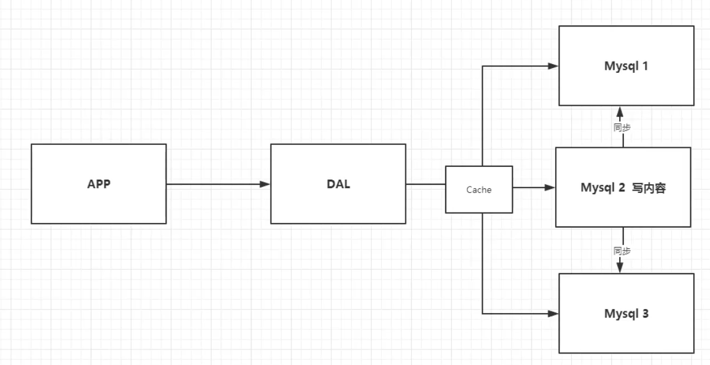


> 3、分库分表+水平拆分+Mysql集群

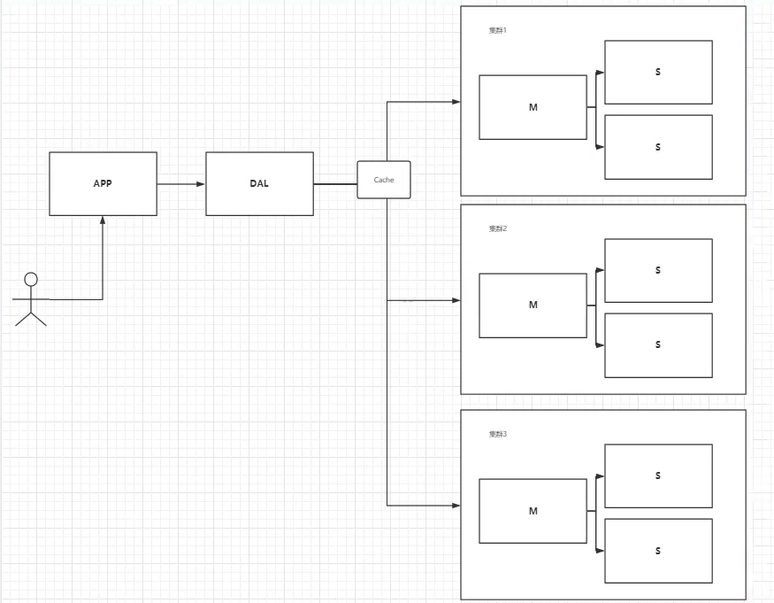


> 4、大数据时代

数据量大时，mysql等关系型数据库效率低。

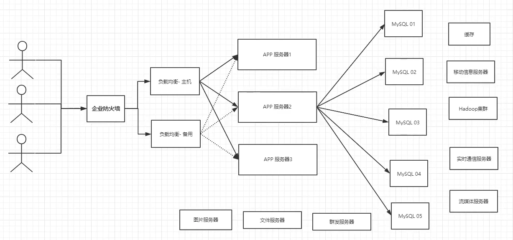


## Redis入门

Redis是C语言写的，100000+QPS。

Redis6.0之前是单线程，因为Redis基于内存操作，CPU不是Redis的瓶颈，Redis的瓶颈取决于机器的内存和网络带宽，所以采用单线程。


启动redis-server


连接redis-server


退出redis


性能测试

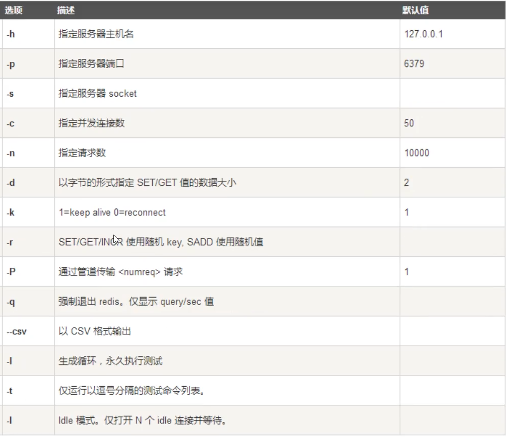


```bash
redis-benchmark -h localhost -p 6379 -c 50 -n 10000
```


```bash
# 切换2号数据库
select 2

# 查看所有的key
keys * 

# 查看数据库的大小
dbsize

# 清空当前数据库
flushdb

# 清空所有数据库
flushall

# 查看是否存在键值name
exists name

# 将name移动到2号数据库
move name 2

# name 10s后过期
expise name 10

# 查看剩余的时间
ttl name
-1: 没有设置生存时间
-2: 已经过期

# 查看name的数据类型
type name
```


## 五大数据类型

### String

```bash
# value后面追加
append name haha

# 获取长度
strlen name

# 自增
incr views
incrby views 10

# 自减
decr views
decrby views 10

# 截取字符串，闭区间
getrange name 0 2
getrange name 0 -1

# 替换字符串
setrange name 1 xx
yhhaha -> yxxaha

# 设置key hello，30s后超时时间
setex key 10 "hello"

# 不存在时设置
setnx key “haha”

# 同时设置获取多个
mset k1 v2 k2 v2 k3 v3
msetnx k1 v2 k2 v2 k3 v3

mget k1 k2 k3

# 设置一个对象，user:1 {name:zhangshan, age:2}
mset user:1:name zhangshan user:1:age 2
mget user:1:name user:1:age

# getset，返回之前的值并设置新值
getset db redis
```


### List

list是一个链表，可以当成栈、队列、阻塞队列。

```bash
# 插到队头
127.0.0.1:6379[1]> lpush list one two three
(integer) 3

# 插到队尾
127.0.0.1:6379[1]> rpush list 1 2 3
(integer) 6


# 范围查询
127.0.0.1:6379[1]> lrange list 0 -1
1) "three"
2) "two"
3) "one"

127.0.0.1:6379[1]> lrange list 0 -1
1) "three"
2) "two"
3) "one"
4) "1"
5) "2"
6) "3"

# 移除元元素
127.0.0.1:6379[1]> lpop list
"three"
127.0.0.1:6379[1]> rpop list
"3"

# 获取第一个值
lindex list 0

# 获取长度
llen list

# 移除元素
127.0.0.1:6379[1]> lrange list 0 -1
1) "one"
2) "two"
3) "one"
4) "1"
5) "2"
127.0.0.1:6379[1]> lrem list 1 one # 移除一个one
(integer) 1
127.0.0.1:6379[1]> lrange list 0 -1
1) "two"
2) "one"
3) "1"
4) "2"

# 截取中间的元素
127.0.0.1:6379[1]> lrange list 0 -1
1) "hell3"
2) "hell2"
3) "hell1"
4) "hello"
127.0.0.1:6379[1]> ltrim list 1 2
OK
127.0.0.1:6379[1]> lrange list 0 -1
1) "hell2"
2) "hell1"

# 从list1弹出右边加到list2左边
rpoplpush list1 list2

# 更新第一个元素元素
lset list 0 item

# 在指定元素前后插入
linsert list before hello world
linsert list after hello xxxx
```


### Set

set中的值不能重复。

```bash
# 添加元素
sadd myset "hello"

# 查看所有元素
smembers myset 

# 判断是否存在
sismember myset hello 

# 查看set元素个数
scard myset

# 删除元素
srem myset hello

# 随机返回元素
srandmember myset

# 随机移除元素
spop myset

# 移动元素
smove myset myset2 “hello”
myset -> myset2

# 差集 A-B
sdiff A B

# 交集
sinter A B

# 并集
sunion A B
```


### Hash

类似map，key-value。

```bash
# 插入key-val
hset myhash field1 hello
hmset myhash field1 hello field2 world

# 获取元素
hget myhash field1
hmget myhash field1 field2
hgetall myhash

# 删除元素
hdel myhash field1

# 获取元素个数
hlen myhash

# 判断某个元素是否存在
hexists myhash field1

# 获取key值
hkeys myhash

# 获取value值
hvals myhash

# 自增10
hincrby myhash field3 10 

# 自减10
hincrby myhash field3 -10 

# 不存在就插入
hsetnx myhash field4 hello
```


### Zset

Zset是一种有序集合。

```bash
# 插入
zadd myset 1 one
zadd myset 2 two

# 升序
zadd salary 2000 jim 1000 alice 500 bob
zrangebyscore salary -inf +inf
zrangebyscore salary -inf +inf withscores
zrangebyscore salary -inf +1000 withscores

# 降序
zrevrangebyscore salary +1000 -inf withscores 

# 删除bob
zrem salary bob

# 元素个数
zcard salary

# 查询所有
zrange salary 0 -1
zrevrange salary 0 -1

# 统计区间的元素个数
zcount salary 0 1000
```


## 特殊数据类型

### geospatial

 将指定的地理空间位置（经度、纬度、名称）添加到指定的key中。


```bash
# 添加经纬度信息
geoadd china:city 113.66 34.757 zhengzhou

# 获取经度纬度
geopos china:city zhengzhou

# 返回两个位置之间的距离
geodist china:city zhengzhou beijing km

# 获取经纬度半径内的地址
georadius china:city 110 30 1000 km
georadius china:city 110 30 1000 km withdist  # 带上距离
georadius china:city 110 30 1000 km withcoord # 带上经纬度信息
georadius china:city 110 30 1000 km count 2   # 查询2个

# 获取某一元素半径内的地址
georadiusbymember china:city zhengzhou 100 km

# 返回一个或多个位置的geohash表示
geohash china:city zhengzhou beijing
```

geo函数底层使用zset，所以支持zset的操作。

```bash
# 查看所有的位置
zrange china:city 0 -1

# 删除某个位置
zrem china:city zhengzhou
```


### Hyperloglog

统计UV(独立访客)，存在一定的容错率，$2^{64}$个元素只需要12KB内存。

```bash
# 创建一组元素
pfadd mykey a b c d e ff
pfadd mykey2 1 2 3 a b c

# 统计不同的个数
pfcount mykey

# 合并两组元素
pfmerge mykey3 mykey mykey2
pfcount mykey3
```


### Bitmaps


```bash
# 设置值
setbit sign 0 1
setbit sign 1 0
setbit sign 2 0
setbit sign 3 1

# 获取值
getbit sign 0

# 统计个数
bitcount sign
bitcount sign 0 1 # 字节区间[start,end]被设置为 1 的比特
```


## 事务

一次性、顺序性、排他性，Redis事务没有隔离级别，单条命令保证原子性，事务不保证原子性。

**Redis的事务：**

- 开启事务（multi）
- 命令入队
- 执行事务（exec），取消事务（discard）

```bash
127.0.0.1:6379[1]> multi
OK
127.0.0.1:6379[1]> set k1 v1
QUEUED
127.0.0.1:6379[1]> set k2 v2
QUEUED
127.0.0.1:6379[1]> set k3 v3
QUEUED
127.0.0.1:6379[1]> exec
1) OK
2) OK
3) OK

127.0.0.1:6379[1]> get k1
"v1"
```

（编译时错误）如果事务中的语法错误，在执行的时候会报错，所有的命令都不会执行。

（执行时错误）如果是错误的语句执行，这条语句执行失败，其他正常。

**乐观锁**

使用watch来监控变量实现乐观锁操作。

```bash
127.0.0.1:6379[1]> set money 100
OK
127.0.0.1:6379[1]> watch money
OK
127.0.0.1:6379[1]> multi 
OK
127.0.0.1:6379[1]> decrby money 10
QUEUED
127.0.0.1:6379[1]> exec # exec前，另一个线程修改money
(nil)
```


## Redis.conf

自定义单位，大小写不敏感


导入配置文件


> 网络配置

```bash
bind 127.0.0.1		# 绑定地址
protected-mode yes	# 保护模式
port 6379			# 端口设置
```


> 常规配置

```bash
daemonize yes		# 守护进程

pidfile /var/run/redis_6379.pid	#后台启动，指定一个pid文件
# Specify the server verbosity level.
# This can be one of:
# debug (a lot of information, useful for development/testing)
# verbose (many rarely useful info, but not a mess like the debug level)
# notice (moderately verbose, what you want in production probably)
# warning (only very important / critical messages are logged)
loglevel notice		# 日志
logfile ""			# 日志文件名

database 16				# 默认16个数据库
always-show-logo yes	# 是否显示logo
```


> 快照

在规定时间内，执行多少此操作，会持久化到文件`.rdb.aof`

redis是内存数据库，需要持久化保存到磁盘上。

```
save 900 1		# 900s内，至少1个key发生修改，就做持久化
save 300 10		# 30s内， 至少10个key发生修改，就做持久化
save 60 10000	# 60s内， 至少10000个key发生修改，就做持久化

stop-writes-on-bgsave-error yes # 持久化失败是否停止
rdbcompression yes	# 是否压缩文件，消耗cpu资源
rdbchecksum yes		# 保存rdb文件时，进行错误检查
dbfilename dump.rdb # rdb的文件名
dir ./				# rdb保存的目录

```


> REPLICATION 复制


> SECURITY 安全


```bash
requirepass 123456	# 设置密码

# 命令获取密码
config get requirepass
# 命令设置密码
config set requirepass "123456" 
auth 123456
```


> CLIENT

```bash
maxclients 10000	# 最大的连接数
maxmemory <bytes>	# redis内存容量
maxmemory-policy noeviction # 内存达到上限的处理动作
    1、volatile-lru:		只对设置了过期时间的key进行LRU（默认值） 
    2、allkeys-lru:		删除lru算法的key   
    3、volatile-random:	随机删除即将过期key   
    4、allkeys-random:	随机删除   
    5、volatile-ttl:		删除即将过期的   
    6、noeviction:		永不过期，返回错误
```


> APPEND ONLY 模式 aof配置

```bash
appendonly no 	# 默认不适用aof，使用rdb模式持久化
appendfilename "appendonly.aof" # 持久化的文件名字

# appendfsync always    # 每次都会sync，消耗资源
appendfsync everysec	# 每秒执行一次
# appendfsync no		# 不执行同步，由操作系统执行，速度最快
```


## Redis持久化

### RDB（Redis DataBase）


在指定时间内将内存中的数据集快照写入磁盘，Snapshot快照，恢复时将快照读到内存中。

Redis会单独fork一个子进程来进行持久化，子进程将数据写入到临时文件中，在持久化结束之后，将临时文件替换为上次持久化好的文件，整个过程主进程时不进行任何IO操作，确保了性能。

如果需要进行大规模数的恢复，且对数据恢复的完整性不敏感，RDB方式比AOF方式更加高效，RDB缺点就是最后一次持久化后的数据可能丢失。

默认使用的是RDB，`dump.rdb`。

**触发机制：**

1、sava规则满足

2、flushall

3、退出redis


**恢复rdb文件：**

```bash
# 查看dump.rdb目录
config get dir

# 将dump.rdb放到对应目录下即可
```


### AOF（Append Only File）

aof类似于history文件，将写的命令记录下来，恢复的时候重新执行所有写的命令。

每次修改都会同步，文件的完整性好，可能会丢失最后一秒的数据。

对于大数据来说aof远大于rdb，修复速度比rdb慢，执行效率也没有rdb好。


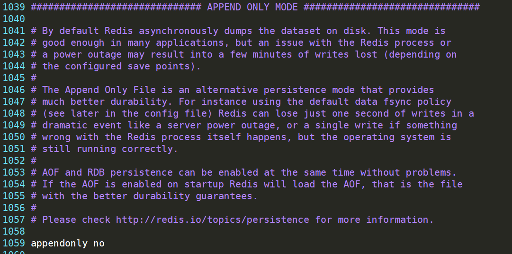

将appendonly设置为yes，即可开启AOF。默认生成appendonly.aof文件，如果appendonly.aof出现错误，redis不能成功连接，可以使用redis-check-aof进行修复。


## Redis发布订阅

Redis发布订阅(pub/sub)是一种消息通信模式：发送者发送消息，订阅者接受消息。


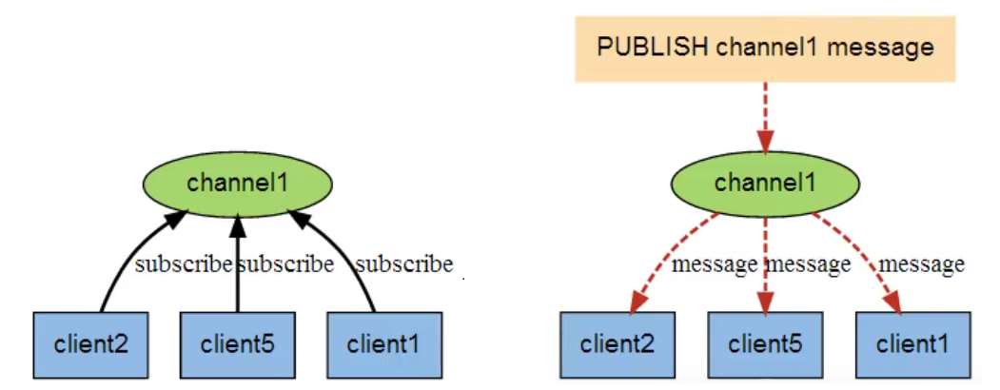


|                                  |                                  |
| -------------------------------- | -------------------------------- |
| PSUBSCRIBE pattern [pattern ...] | 订阅一个或多个符合给定模式的频道 |
| PUBSUB subcommand [argument ...] | 查看订阅与发布系统状态           |
| PUBLISH channel message          | 将信息发送到指定的频道           |
| PUNSUBSCRIBE pattern ...]        | 退订所有给定模式的频道           |
| SUBSCRIBE channel [channel ...]  | 订阅给定的一个或多个频道的信息。 |
| UNSUBSCRIBE [channel ...]        | 指退订给定的频道                 |

```bash
# 订阅频道sanzo
psubscribe sanzo

# 发布消息
publish sanzo "hello, world"
```


## Redis主从复制

主从复制，数据的复制时单向的，只能从主节点到从节点，主节点写为主，从节点读为主。

1、数据冗余，实现了数据的热备份

2、故障恢复，主节点出现问题，可以由从节点提供服务

3、负载均衡，主从复制配合读写分离，分担服务器负载，提高Redis服务器并发量

4、高可用基石，是哨兵和集群的基础


复制的原理：

slave启动成功连接到maser后，发送一个sync同步命令，master收到命令后，启动后台的存盘进程，同时手机所有接受到的用于修改数据的命令，在后台执行完毕后，将整个数据文件发送给slave，并完成一次完全同步。

全量复制：slava服务在收到数据文件后，将其存盘并加载到内存中，只要重新连接master，全量复制就会被自动执行。

增量复制：master继续将所有收集的修改命令发送给slave。


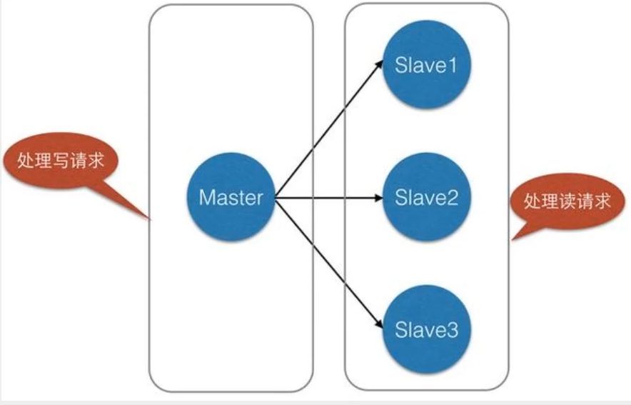

```bash
# 查看当前复制信息
127.0.0.1:6379> info replication
# Replication
role:master		# 默认主设备
connected_slaves:0
master_replid:306c9aaa9834a8f601bdfcd7b85e00a83a5fe311
master_replid2:0000000000000000000000000000000000000000
master_repl_offset:0
second_repl_offset:-1
repl_backlog_active:0
repl_backlog_size:1048576
repl_backlog_first_byte_offset:0
repl_backlog_histlen:0
```


复制3个配置文件，修改对应信息：


修改配置文件；

```bash
port 6380							# 修改端口号
pidfile /var/run/redis_6380.pid		# 修改pid
logfile "6380.log"					# 修改日志文件
dbfilename dump80.rdb 				# 修改dump.rdb
```


同时启动多个服务：


### 一主二从

默认情况下redis为maser，需要手动设置

命令配置（临时）

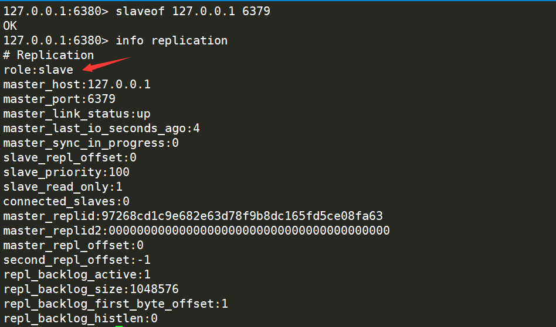


文件配置（永久）


只有master可以写，并同步到其他slave上。

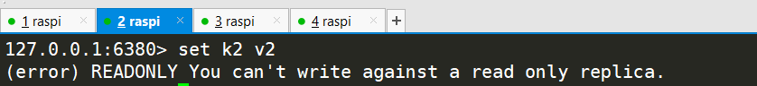

```bash
# 自立为王
slave no one
```


### 哨兵模式

哨兵通过发送命令，让redis服务器返回监控其运行状态，包括主服务器和从服务器，当哨兵检测到master宕机，会自动将slave切换为master，然后通过发布订阅的方式通知其他从服务器，一般采用多哨兵模式，哨兵彼此监控，投票选取maste。

优点：

1、哨兵集群，基于主从复制模式

2、主从可以切换，故障转移、提高系统可用性

3、哨兵模式是主从复制的升级版，更加健壮


缺点：

1、Redis不好在线扩种，集群容量达到上限扩容麻烦

2、哨兵配置比较麻烦


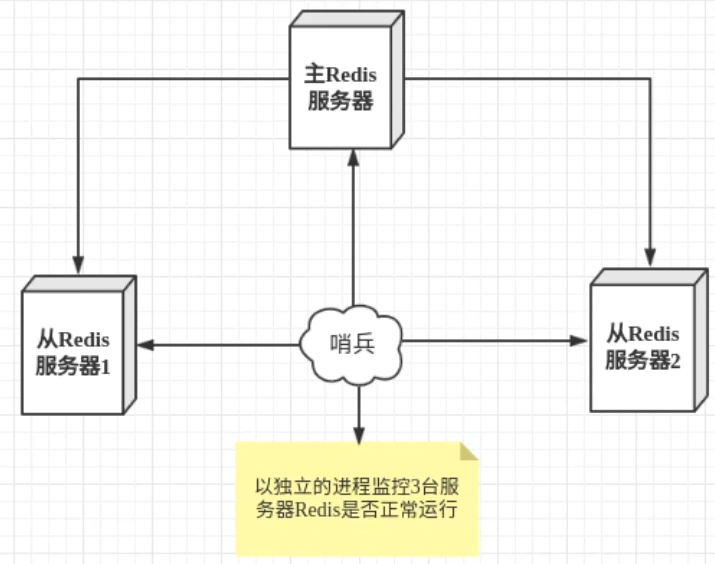


主观下机：一个哨兵发现master发生宕机

客观下线：多个哨兵同时发现宕机，哨兵之间发起投票选master，进行failover（故障转移）操作。

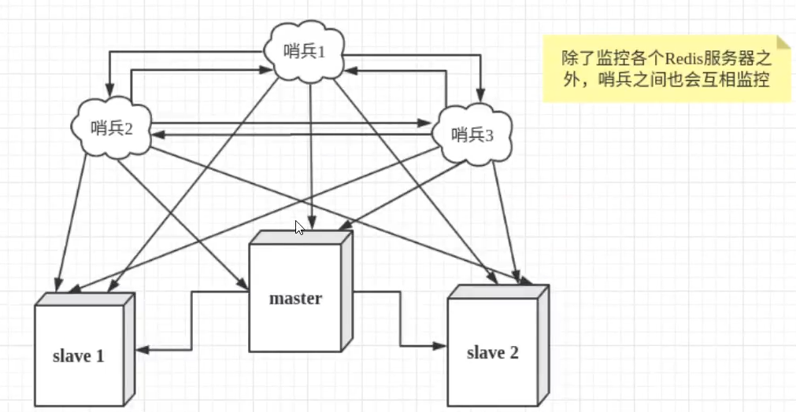


配置哨兵文件`sentinel.conf `：

```bash
# sentinel monitor 主机名 ip port 有一个哨兵认为master失联，就客观的认为失联了
sentinel monitor myredis 127.0.0.1 6379 1
```

启动哨兵

```bash
redis-sentinel sentinel.conf
```

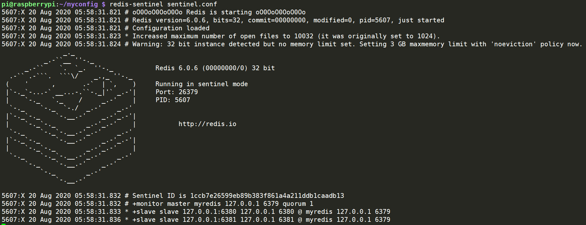


master挂了，自动选举一个slave作为master。

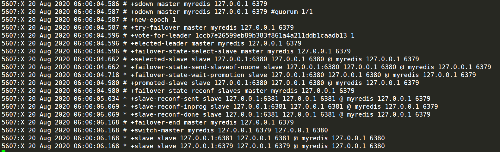

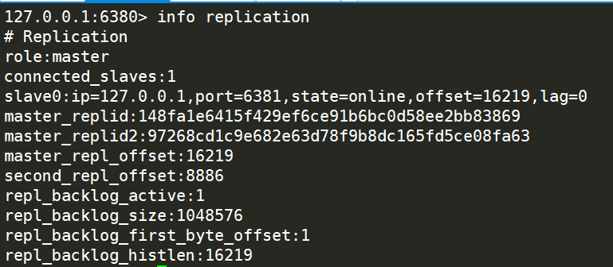


如果master恢复连接之后，变为新master的slave


所有的配置文件

```bash
# Example sentinel.conf
 
# 哨兵sentinel实例运行的端口 默认26379
port 26379
 
# 哨兵sentinel的工作目录
dir /tmp
 
# 哨兵sentinel监控的redis主节点的 ip port 
# master-name  可以自己命名的主节点名字 只能由字母A-z、数字0-9 、这三个字符".-_"组成。
# quorum 当这些quorum个数sentinel哨兵认为master主节点失联 那么这时 客观上认为主节点失联了
# sentinel monitor <master-name> <ip> <redis-port> <quorum>
  sentinel monitor mymaster 127.0.0.1 6379 2
 
# 当在Redis实例中开启了requirepass foobared 授权密码 这样所有连接Redis实例的客户端都要提供密码
# 设置哨兵sentinel 连接主从的密码 注意必须为主从设置一样的验证密码
# sentinel auth-pass <master-name> <password>
sentinel auth-pass mymaster MySUPER--secret-0123passw0rd
 
 
# 指定多少毫秒之后 主节点没有应答哨兵sentinel 此时 哨兵主观上认为主节点下线 默认30秒
# sentinel down-after-milliseconds <master-name> <milliseconds>
sentinel down-after-milliseconds mymaster 30000
 
# 这个配置项指定了在发生failover主备切换时最多可以有多少个slave同时对新的master进行 同步，
这个数字越小，完成failover所需的时间就越长，
但是如果这个数字越大，就意味着越 多的slave因为replication而不可用。
可以通过将这个值设为 1 来保证每次只有一个slave 处于不能处理命令请求的状态。
# sentinel parallel-syncs <master-name> <numslaves>
sentinel parallel-syncs mymaster 1
 
 
 
# 故障转移的超时时间 failover-timeout 可以用在以下这些方面： 
#1. 同一个sentinel对同一个master两次failover之间的间隔时间。
#2. 当一个slave从一个错误的master那里同步数据开始计算时间。直到slave被纠正为向正确的master那里同步数据时。
#3.当想要取消一个正在进行的failover所需要的时间。  
#4.当进行failover时，配置所有slaves指向新的master所需的最大时间。不过，即使过了这个超时，slaves依然会被正确配置为指向master，但是就不按parallel-syncs所配置的规则来了
# 默认三分钟
# sentinel failover-timeout <master-name> <milliseconds>
sentinel failover-timeout mymaster 180000
 
# SCRIPTS EXECUTION
 
#配置当某一事件发生时所需要执行的脚本，可以通过脚本来通知管理员，例如当系统运行不正常时发邮件通知相关人员。
#对于脚本的运行结果有以下规则：
#若脚本执行后返回1，那么该脚本稍后将会被再次执行，重复次数目前默认为10
#若脚本执行后返回2，或者比2更高的一个返回值，脚本将不会重复执行。
#如果脚本在执行过程中由于收到系统中断信号被终止了，则同返回值为1时的行为相同。
#一个脚本的最大执行时间为60s，如果超过这个时间，脚本将会被一个SIGKILL信号终止，之后重新执行。
 
#通知型脚本:当sentinel有任何警告级别的事件发生时（比如说redis实例的主观失效和客观失效等等），将会去调用这个脚本，
这时这个脚本应该通过邮件，SMS等方式去通知系统管理员关于系统不正常运行的信息。调用该脚本时，将传给脚本两个参数，
一个是事件的类型，
一个是事件的描述。
如果sentinel.conf配置文件中配置了这个脚本路径，那么必须保证这个脚本存在于这个路径，并且是可执行的，否则sentinel无法正常启动成功。
#通知脚本
# sentinel notification-script <master-name> <script-path>
  sentinel notification-script mymaster /var/redis/notify.sh
 
# 客户端重新配置主节点参数脚本
# 当一个master由于failover而发生改变时，这个脚本将会被调用，通知相关的客户端关于master地址已经发生改变的信息。
# 以下参数将会在调用脚本时传给脚本:
# <master-name> <role> <state> <from-ip> <from-port> <to-ip> <to-port>
# 目前<state>总是“failover”,
# <role>是“leader”或者“observer”中的一个。 
# 参数 from-ip, from-port, to-ip, to-port是用来和旧的master和新的master(即旧的slave)通信的
# 这个脚本应该是通用的，能被多次调用，不是针对性的。
# sentinel client-reconfig-script <master-name> <script-path>
 sentinel client-reconfig-script mymaster /var/redis/reconfig.sh
```


## Redis缓存穿透和雪崩

### 缓存穿透

用户查询数据，缓存中和数据库中都不存在，如果由大量的这个请求，给服务器造成很大的压力。


> 解决方案

**布隆过滤器**

布隆过滤器是一种数据结构，多所有可能查询的参数以hash形式存储，在控制成先进行校验，不符合就丢弃，从而避免了对底层存储系统的查询压力。


**缓存空对象**

当存储层没有命中，及时返回空对象也将其缓存下来，同时设置一个过期时间，之后再访问这个数据，直接从缓存中获取，保护后端服务器资源。

存在两个问题：

1、如果空指被缓存起来，造成缓存资源浪费

2、设置过期时间，使得缓存层和存储层的数据会有一段时间窗口不一致，对一致性业务造成影响


### 缓存击穿

一个key值非常热点，在扛着大并发集中的访问，当key失效的时候（量大缓存过期），请求穿破缓存，直接请求数据库，造成数据库的压力过大。


> 解决方案

**设置热点数据不过期**

**互斥锁**

多个请求，只有一个线程可以查询后端服务，其他的等待，将压力转移给分布式锁。


### 缓存雪崩

缓存雪崩是在某一个时间，缓存集中过期失效（redis宕机）。


> 解决方案

**设置多个redis服务器，异地多活**

**限流降级**

通过加锁或队列的方式控制读数据库读写缓存的线程数量。

**数据预热**

在正式部署前，将所有可能的数据预先访问一遍，这样部分可能大量访问的数据就会加载到缓存中，在即将发生大并发访问时手动出发加载缓存不同的key，设置不同的过期时间，让缓存失效时间点尽量均匀。