---

typora-copy-images-to: img\微积分

---

## 数列极限

如何证明$0.999\dots = 1$：
$$
\begin{aligned} 
proof\ 1: \\
\frac{1}{3}&=0.333\cdots \\
\frac{1}{3}\times3&=0.333\cdots\times3 \\
1&=0.999\cdots \\ \\

proof\ 2: \\
0.999\cdots&=0.9+0.99+0.999+\cdots\\
&=0.9+0.99+0.999+\cdots\\
&=\frac{0.9\times(1-0.1^n)}{1-0.1}\\
&=\frac{0.9}{0.9} \\
&=1 \\ \\

proof\ 3: \\
a &= 0.999\cdots \\
10a &= 9.999\cdots \\
10a-a&=9 \\
a&=1
\end{aligned}
$$

$$
\begin{aligned}
正割:sec\theta&=\frac{1}{cos\theta}\\ 
正割:csc\theta&=\frac{1}{sin\theta}\\ 
余切:cot\theta&=\frac{1}{tan\theta}\\
\end{aligned}
$$

## 两个重要极限

$$
\begin{aligned}
\lim\limits_{x\rightarrow0}\frac{sinx}{x}=1 \\
\lim\limits_{x\rightarrow \infty}(1+\frac{1}{x})^x=e
\end{aligned}
$$

## 等价无穷小

当$x\rightarrow0$：
$$
\begin{aligned}
sinx &\sim x \\
arcsinx &\sim x \\
tanx &\sim x \\
e^x-1 &\sim x \\
ln(1+x) &\sim x \\
1-cosx&\sim\frac{1}{2}x^2 \\
(1+x)^a-1&\sim ax\\
(1+bx)^a-1 &\sim abx \\
a^x-1 &\sim xlna (a>0,a\ne1) \\
log_a(1+x) &\sim\frac{x}{lna} (a>0,a\ne1) \\
\end{aligned}
$$

## 求导法则

一般函数求导：
$$
\begin{aligned}
(u+v)'&=u'+v' \\
(uv)' &= u'v+uv' \\
(\frac{u}{v})' &= \frac{u'v-uv'}{v^2} \\
\end{aligned}
$$
反函数的导数，等于原函数导数的倒数。
$$
y=f(x),\ x=\phi(y),\ \phi'(y)=\frac{1}{f'(x)}
$$

复合函数遵循联式法则：
$$
y=f(u),\ u=h(t),\ t=k(w),\ w=g(x) \\
\frac{dy}{dx}=\frac{dy}{du}\cdot\frac{du}{dt}\cdot\frac{dt}{dw}\cdot\frac{dw}{dx}\\
\frac{d}{dx}g(h(x))=\frac{dg}{dh}(h(x))\frac{dh}{dx}(x)
$$

常见函数的求导：
$$
\begin{aligned}
c'&=0 \\
(x^n)'&=nx^{n-1} \\
(sinx)'&=cosx \\
(cosx)'&=-sinx \\
(log_ax)'&=\frac{1}{x}lna \\
(lnx)'&==\frac{1}{x} \\
(a^x)'&=a^xlna \\
(e^x)'&=e^x\\
(tanx)'&=(\frac{sinx}{cosx})'=\frac{1}{cos^2x}=sec^2x \\
(cotx)'&=-csc^2x \\
(secx)'&=secx\cdot tanx\\
(cscx)'&=-cscx\cdot cotx \\
(arcsinx)'x&=\frac{1}{\sqrt{1-x^2}} \\
(arccosx)'x&=\frac{-1}{\sqrt{1-x^2}} \\
(arctanx)'x&=\frac{1}{1+x^2} \\
(arccotx)'x&=\frac{-1}{1+x^2} \\
\end{aligned}
$$

## 高阶导数

求导法则：
$$
\begin{aligned}
(u\pm v)^{(n)} &= u^{(n)}\pm v^{(n)} \\
(cu)^{(n)} &= cu^{(n)} \\
(uv)^{(n)}&=\sum_{i=0}^{n}C_n^iu^{(n-i)}v^{(i)}
\end{aligned}
$$
先函数求导：

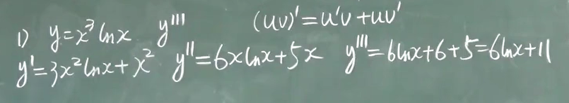

隐函数求导，等号两边同时对$x$求导：

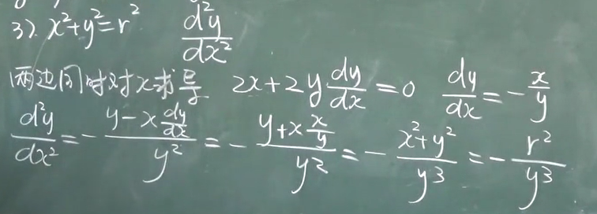

参数函数求导：

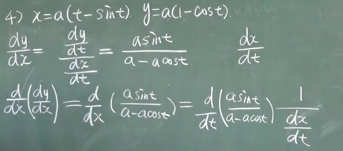

常见的多阶导数：
$$
\begin{aligned}
(sinx)^{(n)}&=sin(x+\frac{n\pi}{2}) \\
(cosx)^{(n)}&=cos(x+\frac{n\pi}{2}) \\
(lnx)^{(n)}&=(-1)^{n-1}\frac{(n-1)!}{x^{n}}
\end{aligned}
$$

## 微分

微分是求函数在某点$x_0$附近的变化量。

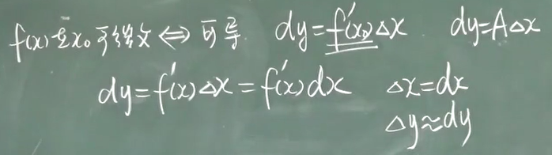

微分规则：
$$
\begin{aligned}
dc&=0 \\
d(u\pm v)&=du\pm dv \\
d(uv)&=vdu+udv \\
d(cu)&=cdu \\
d(\frac{u}{v})&=\frac{vdu+udv}{v^2}

\end{aligned}
$$

显函数微分：

隐函数求导：

近似计算：

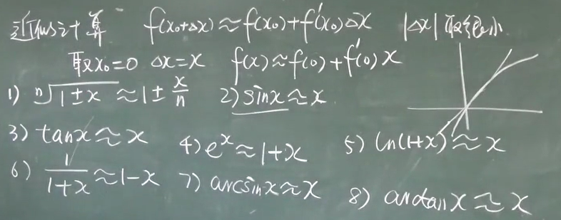

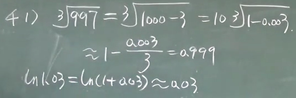

## 微分中值定理

罗尔定理

拉格朗日中值定理：

罗尔定理是拉格朗日中值定理的特殊情况，将拉格朗日中的坐标系转换成罗尔即可证明。

柯西中值定理：

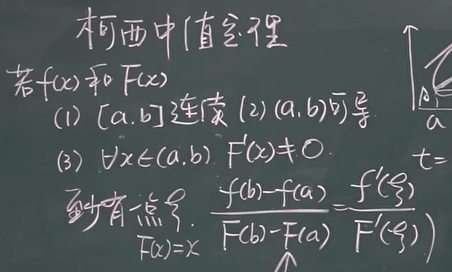

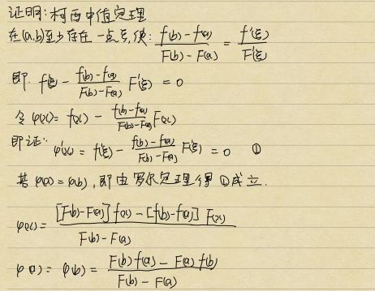

## 泰勒公式

使用微分$f(x)=f'(x_0)(x-x_0)+f(x_0)$估计函数的值误差太大，泰勒公式可以很好的表示函数的值。

马克劳林公式

## 洛必达法则

洛必达法则用于求两个函数相比的极限，适用于$\frac{0}{0}、\frac{\infty}{\infty}$型极限。

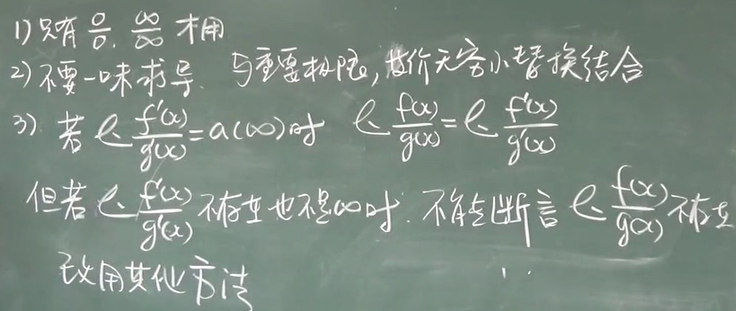

洛必达求解极限不存在时，原函数不一定不存在，需要改用其他方法。

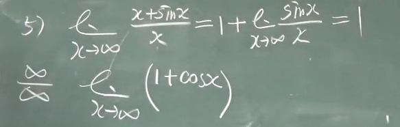

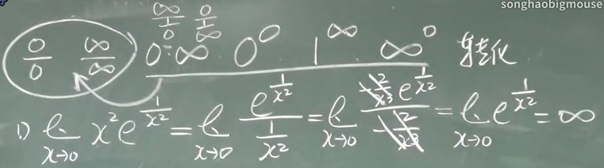

## 单调性和凸凹性

单调性可以根据函数的导数判断$f'(x)>0$增函数，$f'(x)<0$减函数。

函数增减的分界点$\begin{cases} f'(x)=0(驻点)\\导数不存在的点\end{cases}$

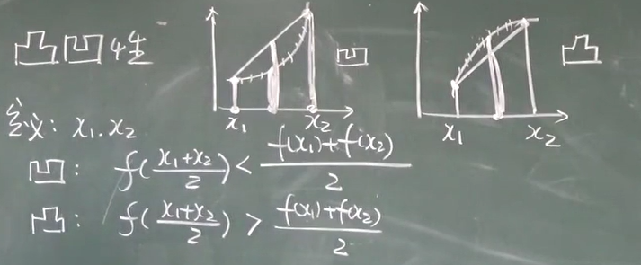

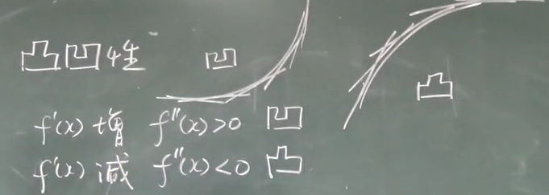

函数的凸凹行可以根据二阶导数来判断，$f''(x)>0$凸函数，$f''(x)<0$凹函数。

$\left.\begin{matrix} f''(x)=0(拐点)\\二阶导数不存在的点 \end{matrix} \right\}$可能是拐点（凸凹的分界点），还需要根据左右的凸凹性进一步判断。

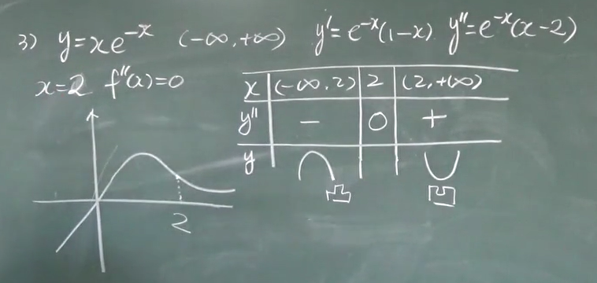