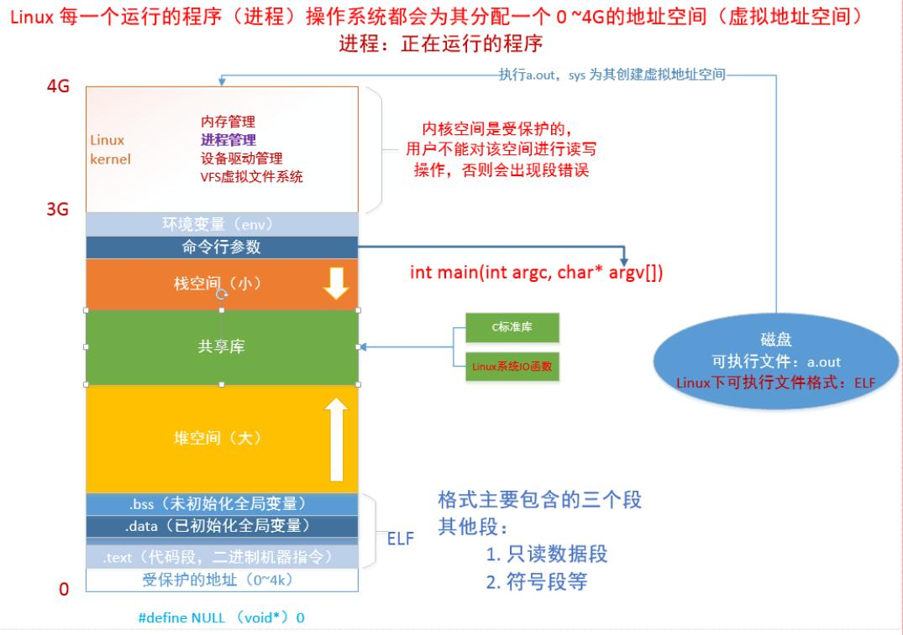
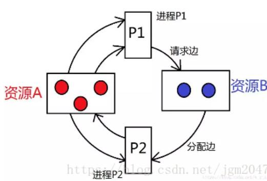

## 用户空间和内核空间

操作系统的核心是内核, 独立于普通的应用程序, 可以访问受保护的内存空间, 拥有访问底层硬件设备的所有权限. 为了保证用户进程不能直接操作内核, 保证内核安全, 操作系统将虚拟空间分为两部分, 内核空间和用户空间.
其中最高的1G字节(虚拟地址: 0xC0000000 到 0xFFFFFFFF)为内核区域, 低位的3G(虚拟地址: 0x00000000 到 0xBFFFFFFF)为用户空间.


## 进程的状态

- 就绪状态

  进程分配到除cpu以外的其他资源，只要获取cpu就能运行。

- 执行状态

  当进程获取cpu，程序在cpu上执行。

- 阻塞状态

  正在执行的进程，等待某个事件的到来，而进入阻塞状态。IO请求、等待信号等。

进程状态的转化：

- 执行->就绪：时间片用完

- 就绪->执行：被调度

- 执行->阻塞：IO请求

- 阻塞->就绪：IO完成

  

## 进程切换

内核挂起CPU上运行的进程, 恢复以前挂起的某个进程的执行.
从一个进程的运行到另一个进程的运行, 经历以下变化

1. 保存处理机上下文, 包括程序计数器和其他寄存器
2. 更新PCB信息
3. 把进程的PCB移入相应的队列, 就绪、阻塞等队列
4. 选择另一个进程执行, 更新PCB
5. 更新内存管理的数据结构
6. 恢复处理机上下文


## 进程调度

1. **先来先服务调度算法：**先来先服务(FCFS)调度算法是一种最简单的调度算法，该算法既可用于作业调度，也可用于进程调度。当在作业调度中采用该算法时，每次调度都是从后备作业队列中选择一个或多个最先进入该队列的作业，将它们调入内存，为它们分配资源、创建进程，然后放入就绪队列。在进程调度中采用FCFS算法时，则每次调度是从就绪队列中选择一个最先进入该队列的进程，为之分配处理机，使之投入运行。该进程一直运行到完成或发生某事件而阻塞后才放弃处理机。

2. **短作业(进程)优先调度算法：**短作业(进程)优先调度算法SJ(P)F，是指对短作业或短进程优先调度的算法。它们可以分别用于作业调度和进程调度。短作业优先(SJF)的调度算法是从后备队列中选择一个或若干个**估计运行时间最短**的作业，将它们调入内存运行。而短进程优先(SPF)调度算法则是从就绪队列中选出一个估计运行时间最短的进程，将处理机分配给它，使它立即执行并一直执行到完成，或发生某事件而被阻塞放弃处理机时再重新调度。

3. **高优先权优先调度算法：**为了照顾紧迫型作业，使之在进入系统后便获得优先处理，引入了最高优先权优先(FPF)调度算法。此算法常被用于批处理系统中，作为作业调度算法，也作为多种操作系统中的进程调度算法，还可用于实时系统中。当把该算法用于作业调度时，系统将从后备队列中选择若干个优先权最高的作业装入内存。当用于进程调度时，该算法是把处理机分配给就绪队列中优先权最高的进程，这时，又可进一步把该算法分成如下两种。

   -  **非抢占式优先权算法**：系统一旦把处理机分配给就绪队列中优先权最高的进程后，该进程便一直执行下去，直至完成；或因发生某事件使该进程放弃处理机时，系统方可再将处理机重新分配给另一优先权最高的进程。这种调度算法主要用于批处理系统中；也可用于某些对实时性要求不严的实时系统中。

   -  **抢占式优先权调度算法**：系统同样是把处理机分配给优先权最高的进程，使之执行。但在其执行期间，只要又出现了另一个其优先权更高的进程，进程调度程序就立即停止当前进程(原优先权最高的进程)的执行，重新将处理机分配给新到的优先权最高的进程。因此，在采用这种调度算法时，这种抢占式的优先权调度算法能更好地满足紧迫作业的要求，故而常用于要求比较严格的实时系统中，以及对性能要求较高的批处理和分时系统中。

   优先级调度算法容易出现**优先级反转**的现象：优先级反转是指一个低优先级的任务持有一个被高优先级任务所需要的共享资源。高优先任务由于因资源缺乏而处于受阻状态，一直等到低优先级任务释放资源为止。而低优先级获得的CPU时间少，如果此时有优先级处于两者之间的任务，并且不需要那个共享资源，则该中优先级的任务反而超过这两个任务而获得CPU时间。如果高优先级等待资源时不是阻塞等待，而是忙循环，则可能永远无法获得资源，因为此时低优先级进程无法与高优先级进程争夺CPU时间，从而无法执行，进而无法释放资源，造成的后果就是高优先级任务无法获得资源而继续推进。

   **解决优先级反转的方法**：

   - 设置优先级上限，给临界区一个高优先级，进入临界区的进程都将获得这个高优先级，如果其他试图进入临界区的进程的优先级都低于这个高优先级，那么优先级反转就不会发生。
   - 优先级继承，当一个高优先级进程等待一个低优先级进程持有的资源时，低优先级进程将暂时获得高优先级进程的优先级别，在释放共享资源后，低优先级进程回到原来的优先级别。嵌入式系统VxWorks就是采用这种策略。
   - 临界区禁止中断，通过禁止中断来保护临界区，采用此种策略的系统只有两种优先级：可抢占优先级和中断禁止优先级。前者为一般进程运行时的优先级，后者为运行于临界区的优先级。火星探路者正是由于在临界区中运行的气象任务被中断发生的通信任务所抢占才导致故障，如果有临界区的禁止中断保护，此一问题也不会发生。

4. **高响应比优先调度算法：**在批处理系统中，短作业优先算法是一种比较好的算法，其主要的不足之处是长作业的运行得不到保证。如果我们能为每个作业引入前面所述的动态优先权，并使作业的优先级随着等待时间的增加而以速率a 提高，则长作业在等待一定的时间后，必然有机会分配到处理机。该优先权的变化规律可描述为：$R_p=\frac{等待时间+要求服务时间}{要求服务时间}=\frac{响应时间}{要求服务时间}$

5. **时间片轮转法：**在早期的时间片轮转法中，系统将所有的就绪进程按先来先服务的原则排成一个队列，每次调度时，把CPU 分配给队首进程，并令其执行一个时间片。时间片的大小从几ms  到几百ms。当执行的时间片用完时，由一个计时器发出时钟中断请求，调度程序便据此信号来停止该进程的执行，并将它送往就绪队列的末尾；然后，再把处理机分配给就绪队列中新的队首进程，同时也让它执行一个时间片。这样就可以保证就绪队列中的所有进程在一给定的时间内均能获得一时间片的处理机执行时间。换言之，系统能在给定的时间内响应所有用户的请求。

6. **多级反馈队列调度算法：**多级反馈队列调度算法则不必事先知道各种进程所需的执行时间，而且还可以满足各种类型进程的需要，因而它是目前被公认的一种较好的进程调度算法。在采用多级反馈队列调度算法的系统中，调度算法的实施过程：设置多个就绪队列，每个队列设置不同的优先级，第一个优先级最高，依次降低，优先级高的队列时间片越长，当新进程进入内存时，首先放到第一个队列的末尾，按照FCFS进行处理，轮到进程执行，没能在时间片内处理完，将被放到下一个队列中，只有当前面所有的队列都为空，才会处理下一个队列。

**批处理系统常用调度算法**：

- 先来先服务
- 最短作业优先
- 最短剩余时间优先
- 响应比最高者优先

分时系统调度算法：

- 轮转调度
- 优先级调度
- 多级队列调度
- 彩票调度

实时系统调度算法：

- 单比率调度
- 限期调度
- 最少裕度法


## 三级映射


## 虚拟地址空间

32为操作系统，在程序启动后，系统分配一个4G的虚拟地址空间。




**为什么需要虚拟地址空间？**

虚拟地址空间和物理地址空间的映射可以解决：

- 方便编译器和操作系统安排程序的地址分布

  程序可以使用一系列相邻的虚拟地址空间来访问物理内存中不相邻的大内存缓冲区。

- 方便进程间隔离

  不同进程使用的虚拟地址彼此隔离，一个进程中的代码无法更改正在另一个进程中使用的物理内存。

- 方便OS使用可怜的内存

  程序可以使用一系列虚拟地址来访问大于可用物理内存的内存缓冲区，当物理内存的供应量变小时，内存管理器会将物理内存页（通常为4KB）保存到磁盘中，数据或代码页会根据需要在物理内存与磁盘之间移动。


**受保护地址**

范围是[0，4k]，不允许用户访问，通常定义的NULL的地址在这一段。

**ELF**

在linux中可执行文件**a.out**的格式是ELF文件，可以通过**file**命令进行查看。

```
file a.out
a.out: ELF 32-bit LSB executable
```

ELF中主要包含三段：

- .test，代码段存放二进制机器指令
- .data，已初始化的全局变量
- .bss，未初始化的全局变量

另外还包含一些其他的段：

- 只读数据段
- 符号段

静态库存放在代码段，绝对地址位置不变。


**堆区**

存放动态申请的内存地址，向上增长，内存大。


**共享库**

加载程序运行需要的库，只在程序运行时加载，相对地址位置不固定。


**栈区**

存放局部变量，向下增长，内存小。


## 死锁

产生死锁的条件：

1. 线程对同一个互斥量加锁两次

2. 线程1拥有A锁，请求B锁；线程2拥有B锁，请求A锁

3. 哲学家吃饭问题的振荡，同时请求资源，同时释放


- 互斥：资源在同一时间，只能被一个任务使用。
- 请求和占有：拥有资源的进程可以请求另一个资源。
- 不可抢占：已经分配的资源，不能强制的被抢占，只能等待释放资源。
- 环路等待：有两个以上的进程，等待下一个进程所占有的资源。


**如何检测死锁？**

可以画出每个进程的资源分配图，如下：



对于满足的进程，可以为它分配资源执行，然后回收资源。

如果资源分配图上没有环路，则系统不存在死锁。

如果资源分配图上存在环路，则可能发生死锁。


查看每个线程的函数调用关系的堆栈，观察每个线程当前的执行点是否在等待一个锁。多次执行该命令，发现某些线程的当前执行点不变，总是在等待同一个锁，就可以怀疑是否死锁了。

如果怀疑哪些线程发生死锁了，可以采用gdb 进一步attach线程并进行分析。

```bash
(gdb) info thread

(gdb) thread <thread ID>
```


**死锁的解除**

- 资源剥夺法，挂起死锁进程并释放他的资源
- 撤销进程
- 进程回退法，进程回退到避免死锁的状态，进程自动释放已有的资源


## 自旋锁和互斥锁

互斥锁属于sleep-waiting类型的锁

自旋锁属于busy-waiting类型的锁


**自旋锁**

自旋锁不会引起调用者睡眠，如果自旋锁已经被别的执行单元保持，调用者就一直循环在那里看是  否该自旋锁的保持者已经释放了锁，"自旋"一词就是因此而得名。其作用是为了解决某项资源的互斥使用。因为自旋锁不会引起调用者睡眠，所以自旋锁的效率远 高于互斥锁。虽然它的效率比互斥锁高，但是它也有些不足之处：

1. 自旋锁一直占用CPU，他在未获得锁的情况下，一直运行如果不能在很短的时间内获得锁，这无疑会使CPU效率降低。
2. 在用自旋锁时有可能造成死锁，当递归调用时有可能造成死锁，调用有些其他函数也可能造成死锁，如 copy_to_user()、copy_from_user()、kmalloc()等。

因此我们要慎重使用自旋锁，自旋锁只有在内核可抢占式或SMP的情况下才真正需要，在单CPU且不可抢占式的内核下，自旋锁的操作为空操作。自旋锁适用于锁使用者保持锁时间比较短的情况下。


**加锁原理**

互斥锁：线程会从sleep（加锁）——>running（解锁），过程中有上下文的切换，cpu的抢占，信号的发送等开销。

自旋锁：线程一直是running(加锁——>解锁)，死循环检测锁的标志位，机制不复杂。


**两种锁的区别**

互斥锁的起始原始开销要高于自旋锁，但是基本是一劳永逸，临界区持锁时间的大小并不会对互斥锁的开销造成影响，而自旋锁是死循环检测，加锁全程消耗cpu，起始开销虽然低于互斥锁，但是随着持锁时间，加锁的开销是线性增长。


**两种锁的应用**

互斥锁用于临界区持锁时间比较长的操作：

- 临界区有IO操作
- 临界区代码复杂或者循环量大
- 临界区竞争非常激烈
- 单核处理器

自旋锁就主要用在临界区持锁时间非常短，且CPU资源不紧张的情况下，一般用于多核的服务器。


## 银行家算法

 可利用资源，最大需求资源，已分配资源，需求资源数。

对每一个进程判断，资源是否够用，够用就分配执行，然后回收分配的资源，接着判断下一个。


## 缓存算法

- LRU（Least recently used）最近最少使用，如果数据最近被访问过，那么将来被访问的几率也更高。

  - 新数据插入到链表头部。
  - 每当缓存命中，将数据移动到链表头部。
  - 链表满，将链表尾部数据丢弃。

  可以使用哈希表来记录数据是否存在链表中。

- LFU（Least frequently used）最近不经常使用，如果一个数据在最近一段时间内使用的次数最少，那么在将来一段时间内被使用的可能性也小。

  主要看在一个时间段中页面使用的频率。

- FIFO（Fist in first out）先进先出，如果一个数据最先进入缓冲中，则应该最早淘汰掉。


## CAS原理

CAS：Compare and Swap，即比较再交换。

多个线程同时修改一个数据的时候，首先拷贝一份数据到内存中，然后修改i的时候比较下数据是否一样，如果不一样，表示已经被别的线程修改过了，可以再次尝试修改。

比较再交换，cpu内部是一个原子操作，cas不需要锁