---

typora-copy-images-to: img\机器学习

---

[吴恩达机器学习](https://www.bilibili.com/video/BV164411b7dx)

## 监督学习

监督学习是已经知道数据的label，例如预测房价问题，给出了房子的面积和价格。

- 回归问题是预测连续值的输出，例如预测房价。

  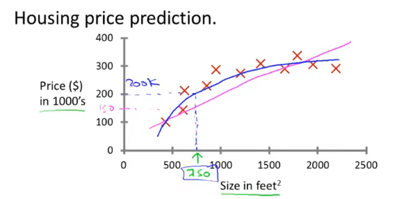

- 分类问题是预测离散值输出，例如判断肿瘤是良性还是恶性。

  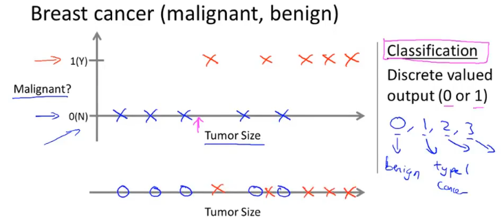

## 无监督学习

无监督学习是不知道数据具体的含义，比如给定一些数据但不知道它们具体的信息，对于分类问题无监督学习可以得到多个不同的聚类，从而实现预测的功能。

## 线性回归

线性回归是拟合一条线，将训练数据尽可能分布到线上。另外还有多变量的线性回归称为多元线性回归。

## 代价函数

cost function，一般使用最小均方差来评估参数的好坏。

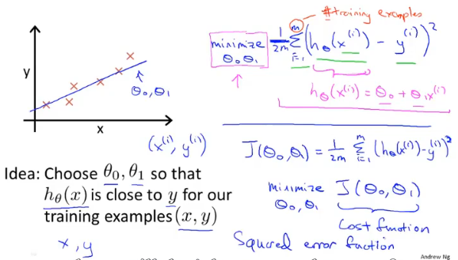

## 梯度下降

梯度下降，首先为每个参数赋一个初值，通过代价函数的梯度，然后不断地调整参数，最终得到一个局部最优解。初值的不同可能会得到两个不同的结果，即梯度下降不一定得到全局最优解。

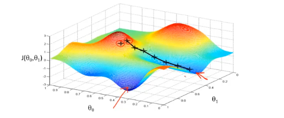

梯度下降在具体的执行时，每一次更新需要同时更新所有的参数。

梯度下降公式中有两个部分，学习率和偏导数。

偏导数，用来计算当前参数对应代价函数的斜率，导数为正则$\theta$减小，导数为负则$\theta$增大，通过这样的方式可以使整体向$\theta=0$收敛。

$\alpha$用来描述学习率，即每次参数更新的步长。$\alpha$的大小不好确定，如果太小则需要很多步才能收敛，如果太大最后可能不会收敛甚至可能发散。

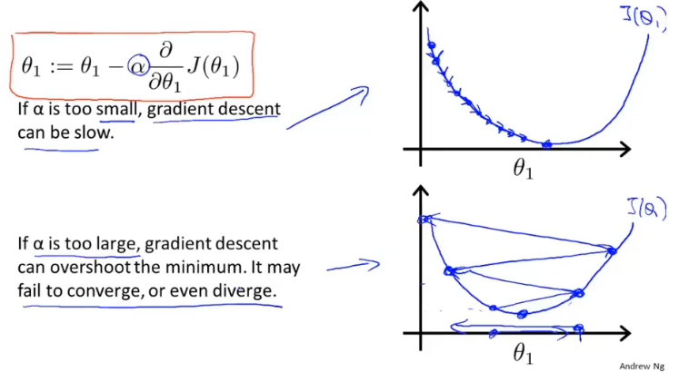

当$\theta$处于局部最优解时，$\theta$的值将不再更新，因为偏导为0。

这也说明了如果学习率$\alpha$不改变，参数也可能收敛，假设偏导$> 0$，因为偏导一直在向在减小，所以每次的步长也会慢慢减小，所以$\alpha$不需要额外的减小。

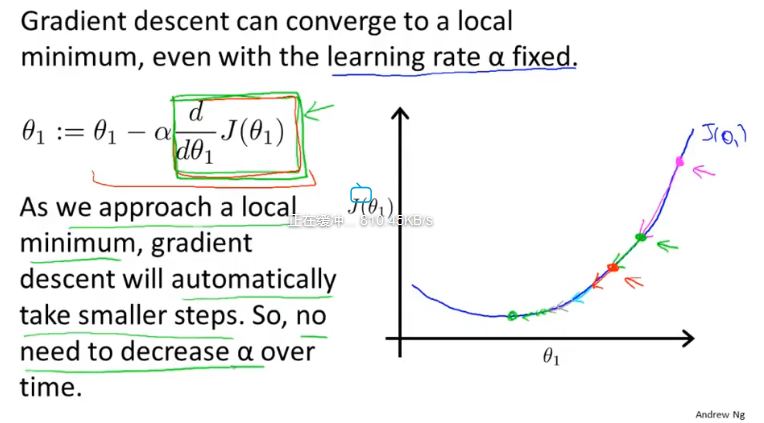

### 单元梯度下降

梯度下降每次更新的都需要进行偏导计算，这个偏导对应线性回归的代价函数。

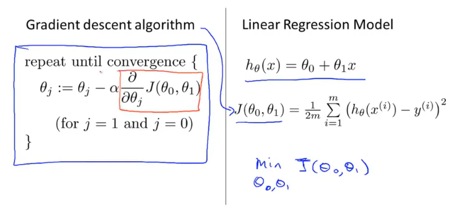

对代价函数求导的结果为：

梯度下降的过程容易出现局部最优解：

但是线性回归的代价函数，往往是一个凸函数。它总能收敛到全局最优。

梯度下降过程的动图展示：

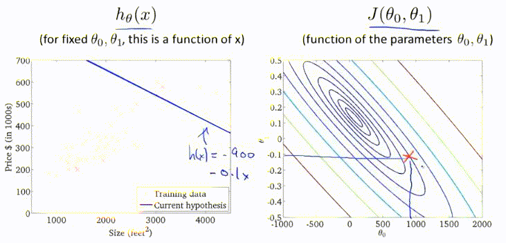

### 多元梯度下降

通常问题都会涉及到多个变量，例如房屋价格预测就包括，面积、房间个数、楼层、价格等

因此代价函数就不再只包含一个变量，为了统一可以对常量引入变量$x_0=1$。

虽然参数的个数增多，但是对每个参数求偏导时和单个参数类似。

### 特征缩放

多个变量的度量不同，数字之间相差的大小也不同，如果可以将所有的特征变量缩放到大致相同范围，这样会减少梯度算法的迭代。

特征缩放不一定非要落到[-1，1]之间，只要数据足够接近就可以。

$X_i = \frac{X_i-\mu}{\sigma}$，$\mu$表示平均值，$\sigma$表示标准差。

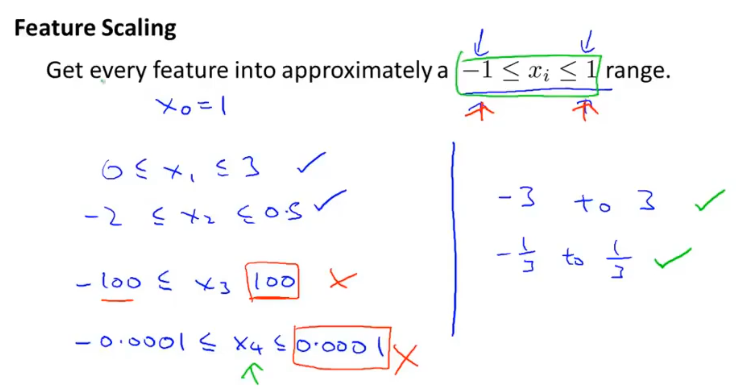

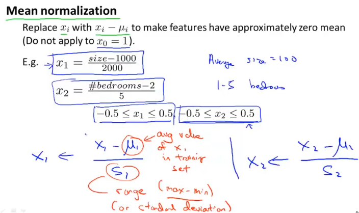

**缩放后的还原**

经过线性回归得到的参数$\theta'$，对应着缩放后的数据，如何得到缩放前的参数$\theta$？
$$
\begin{aligned}
不缩放，回归方程为y&=\theta_0+x_1\theta_1+x_2\theta_2+\cdots+x_n\theta_n\\
缩放，回归方程为y'&=\theta_0'+x_1'\theta_1'+x_2'\theta_2'+\cdots+x_n'\theta_n'\\
\because y'&=\frac{y'-\mu_y}{\sigma_y}，x_i'=\frac{x_i-\mu_i}{\sigma_i}\\

\therefore \frac{y-\mu_y}{\sigma_y}&=\theta_0'+x_1'\theta_1'+x_2'\theta_2'+\cdots+x_n'\theta_n'\\
&=\theta_0'+\frac{x_1-\mu_1}{\sigma_1}\theta_1'+\frac{x_2-\mu_2}{\sigma_2}\theta_2'+\cdots+\frac{x_n-\mu_n}{\sigma_n}\theta_n'\\

\therefore y&=[(\theta_0' - \sum_{i=1}^{n}\frac{\mu_i\theta_i'}{\sigma_i})\sigma_y+\mu_y]+x_1\frac{\theta_1'\sigma_y}{\sigma_1}+x_2\frac{\theta_2'\sigma_y}{\sigma_2}+\cdots +x_n\frac{\theta_n'\sigma_y}{\sigma_n}\\

&
\therefore \left\{ \begin{matrix}
(\theta_0' - \sum_{i=1}^{n}\frac{\mu_i\theta_i'}{\sigma_i})\sigma_y+\mu_y &(i=0)\\
\frac{\theta_i'\sigma_y}{\sigma_i} &(i\ne 0)\\
\end{matrix} \right.

\end{aligned}
$$

### 学习率

学习率$\alpha$的大小会影响梯度算法的执行，太大可能会导致算法不收敛，太小会增加迭代的次数。

可以画出每次迭代的$J(\theta)$的变化，来判断当前算法执行的情况，然后选择合适的学习率。（调参开始...）

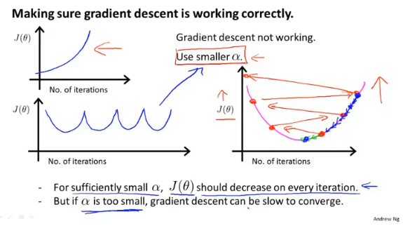

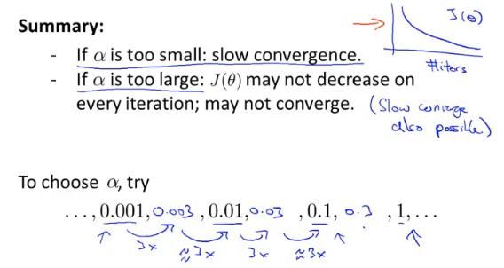

**Batch梯度下降**：每一步梯度下降，都需要遍历整个训练集样本。

## 矩阵和向量

一些数学计算转化为矩阵的形式，可以简化代码书写、提高效率、代码更容易理解。

**矩阵乘法不满足交换律：**

**矩阵乘法满足结合律**：

**单位矩阵**：

**矩阵的逆**：

- 首先是方阵
- 不是所有的矩阵都有逆

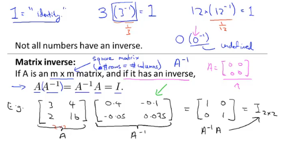

**转置矩阵**：

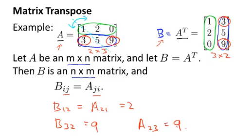

## 正则方程

偏导等于0对应线性方程的最小值：

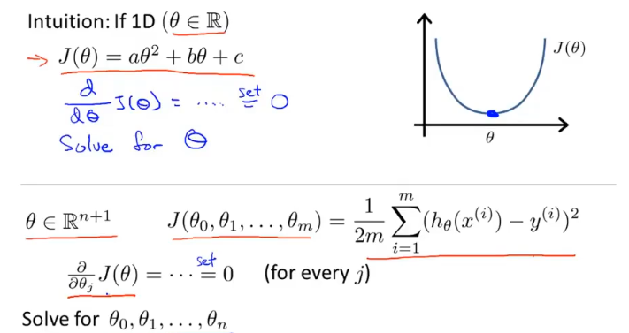

利用线性代数的方法直接求解$\theta$。

$\theta$的推导可以根据等式$X\theta=y$得到，$X^TX$的目的是将矩阵转化为方阵，因为求矩阵的逆的前提是方阵。

矩阵可能存在 不可逆的情况，这时可是删除一些不必要的特征，或使用正则化。

梯度下降和正则方程的优缺点：

## 逻辑回归

对于分类的问题，一般不适用线性回归进行预测：使用线性回归可能会造成很大的误差，即使样本的标签值为0、1，线性回归输出值也会存在>1和小于0的情况，不太符合实际。

如果对于一个均匀的数据，使用线性回归，选取0.5作为分界线，可能会得到一个比较准确的模型，但是如果数据不太均匀就会存在很大的误差。

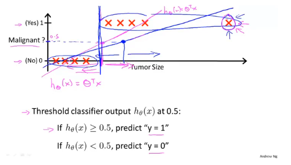

Logistic Regression

[激活函数](https://github.com/Sanzona/files/blob/master/py/sigmoid.py)

利用激活函数值分布的特性，可以得到在参数$\theta$下输入x得到y=1、0的概率。

### 决策界限

决策边界是假设函数的一个属性，取决于函数的参数，而不是数据集。

根据sigmoid的性质，以x=0，y=0.5作为判断的界限，当即$\theta^Tx >=0$，y=1；$\theta^Tx <0$，y=0。

                

### 代价函数

对于函数$f(x)=\frac{1}{1+e^{-x}}$，如果使用类似线性回归的代价函数$\Sigma(h(x)-y)^2$，将得到一个非凸函数，这样就不能使用梯度下降的方法求解全局最优解。

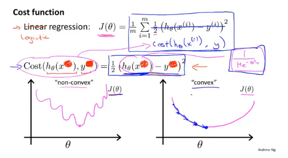

逻辑回归一般使用对数函数作为代价函数：

首先对于分类函数来说，他的输出值范围为[0,1]，得到的对数图像如下：

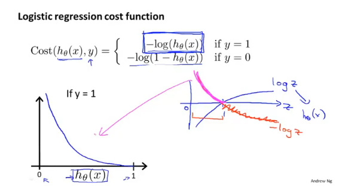

当评估模型参数对y=1（恶性肿瘤）进行预测的好坏时，如果实际为恶性，预测值也为1（恶性），此时的代价为0；如果实际为恶性，预测为0（良性），此时的代价为$+\infty$，这时代价函数就很好的评估了参数$\theta$的表现。

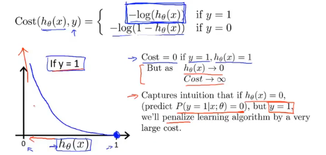

同样对于y=0（良性肿瘤）的代价函数为：

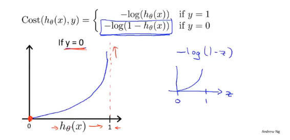

y的取值只有0、1，可以将上面两个函数合成一个，评估当前参数的$J(\theta)$为：

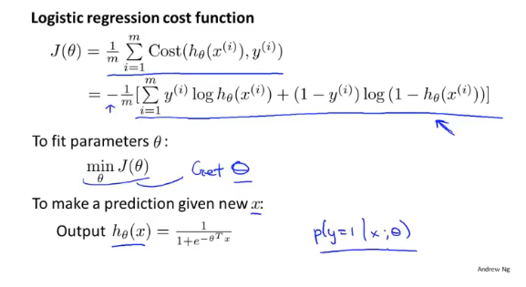

在确定代价函数之后的任务是，如何最小化代价函数，因为代价函数是凸的，所以可以使用梯度下降求解。

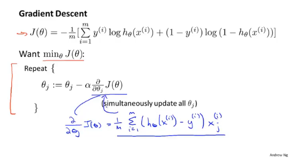

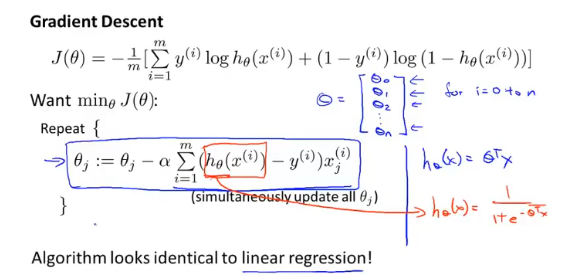

虽然求偏导之后，$\theta$更新的形式和线性回归类似，但是他们本质不同，因为$h_\theta(x)$完全不一样。

[具体的偏导推导过程](https://www.cnblogs.com/zhongmiaozhimen/p/6155093.html)：

### 多元分类

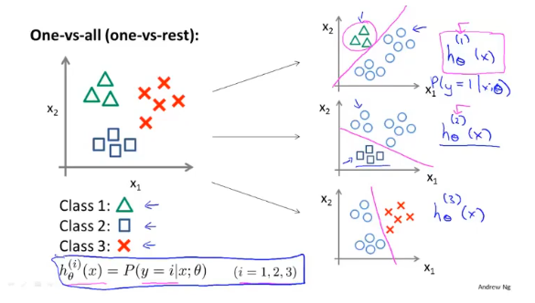

对每个特征单独训练，在做预测的时候，取三个分类器结果最大的。

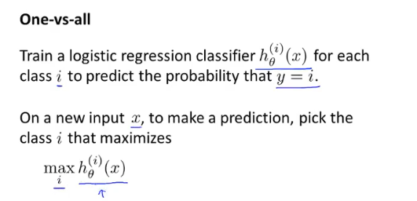

## 过拟合

存在多个特征，但是数据很少，或者模型函数不合理，都会出现过拟合的现象。过拟合可能对样本数能够很好的解释，但是无法正确的预测新数据。

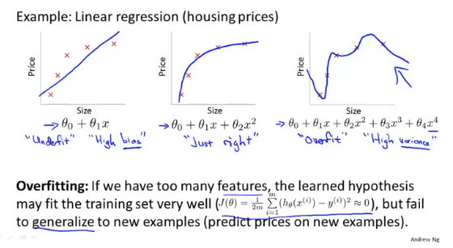

解决过拟合的方法：

正则化处理过拟合问题：

在代价函数中加入正则项，通过lambda的来平衡拟合程度和参数的大小，$\theta$约大越容易出现过拟合的现象。

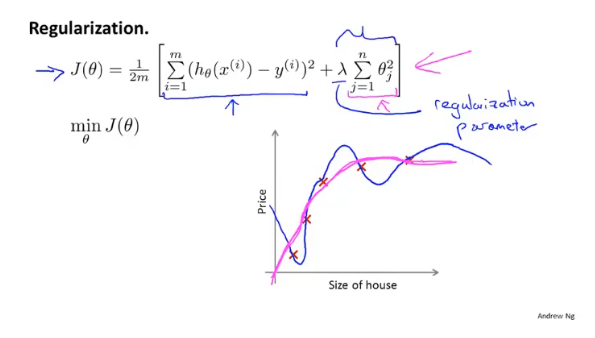

如果lambda过大，导致$\theta \approx 0$，那么最终只剩下下$\theta_0$，图像将变成一个直线。

## 神经网络

### 介绍

大多数的机器学习所涉及到的特征非常多，对于非线性分类问题，往往需要很多高次项，那么他们之间的组成方式多种多样，这对计算带来一定困扰。

神经网络参考大脑中的神经元结构

神经网络一般包括三部分，输入层，隐藏层，输出层。

数据从输入层开始，通过激活函数前向传播到第一隐藏层，然后到第二隐藏层，最后到输出层。

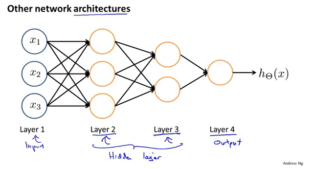

### 逻辑运算

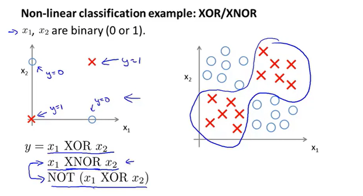

如上为一个XNOR的分类问题，我们可以搭建出各种逻辑运算的神经网络，最终得到XNOR的神经网络模型。

**AND运算**

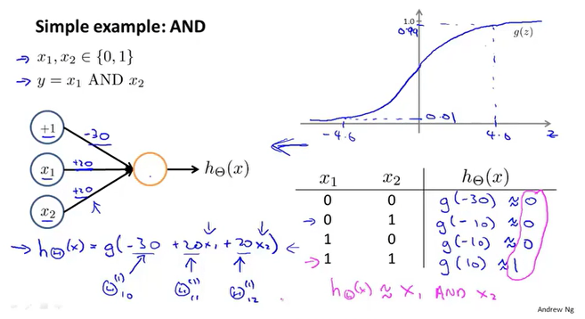

**OR运算**

**NOT运算**

**XNOR运算**

### 多元分类

通过构建神经网络，每种输出就对应一个分类器。

### 代价函数

### 前向传播

### 反向传播

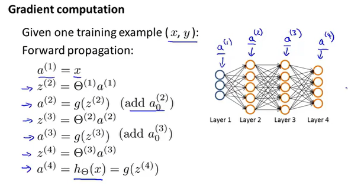

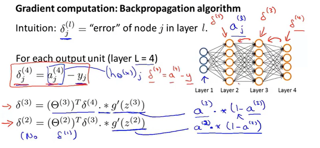

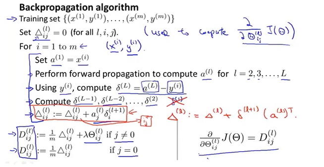

## 模型评估

### 训练、测试集

将数据集分为训练集和测试集，训练集得到参数$\theta$，然后使用测试集的数据对参数$\theta$进行评估，即计算误差。

线性回归问题的评估：

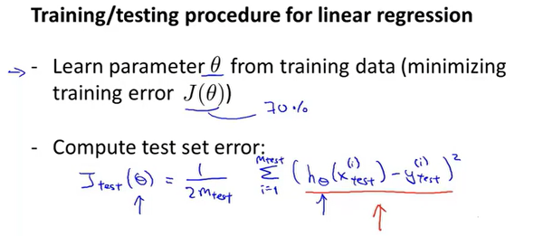

逻辑回归问题的评估：

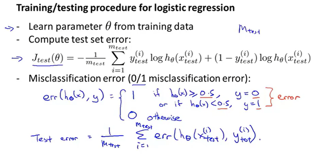

### 训练、验证、测试集

对于多个模型，首先可以用测试集得到一个最优的参数$\theta$，然后用测试集进行评估误差。通过这样的方式可以在众多模型中选择一个理想的模型。

但是这样做并不能评估模型的**泛化能力**，通过测试集评估选择的模型，可能刚好适合测试集的数据，并不能说明它对其他数据的预测能力，这时就引入了验证集。

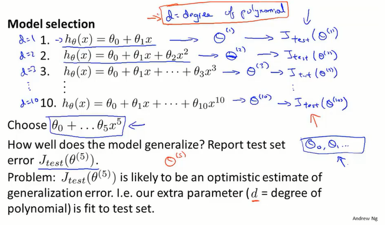

将数据集分为：训练集、验证集、测试集。

对于每个集合都可以计算相应的误差。

 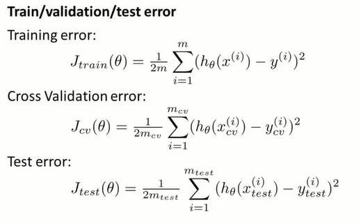

这样在选择模型的时候，可以先使用测试集得到每个模型的$\theta$，然后使用验证集评估得到误差最小的模型，最后使用测试集评估他的泛化能力。

### 偏差、方差

当多项式次数增大时，训练集的误差慢慢减小，因为多项式次数越高，图像拟合的就越准确。但是验证即不同，它的趋势是先减少后增大，这分别对应着欠拟合和过拟合。

那么我们可以根据误差的不同表现来区分偏差和方差。

高偏差：训练误差和验证误差都很大。

高方差：训练误差小，验证误差大。

### 正则化

通过引入$\lambda$来平衡多形式的权重。

当$\lambda$太大，参数$\theta \approx0$，模型近似直线，即欠拟合。当$\lambda$太小，就会出现过拟合。

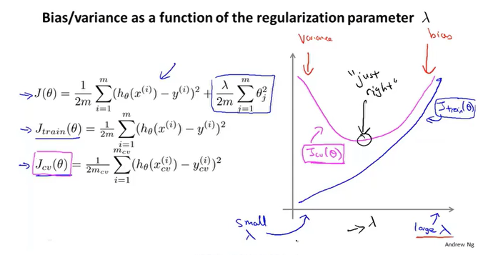

### 学习曲线

随着数据量的增加，$J_{train}(\theta)$的误差慢慢增大，因为数据越少，模型越容易拟合；$J_{cv}(\theta)$慢慢减少，因为数据越多，模型越精准，所以误差减小。

高偏差的模型的学习曲线：

因为参数很少，数据很多，所以随着数据的增多高偏差的模型的$J_{train}(\theta)$和$J_{train}(\theta)$很接近。这时选择增加数据就不是很好的选择了，可以尝试增加数据的特征。

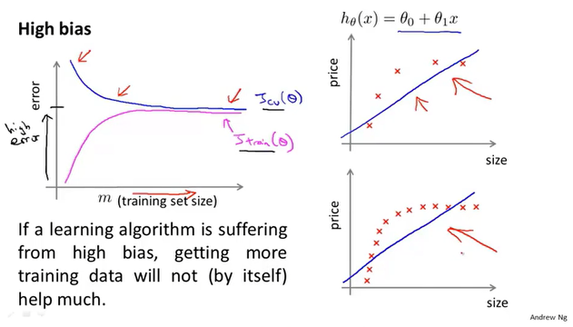

高方差的模型的学习曲线：

高方差的特点是训练误差和验证误差之间有很大的差距，这时可以选择增加数据，随着图像右移可以看出训练误差和验证误差会慢慢接近。

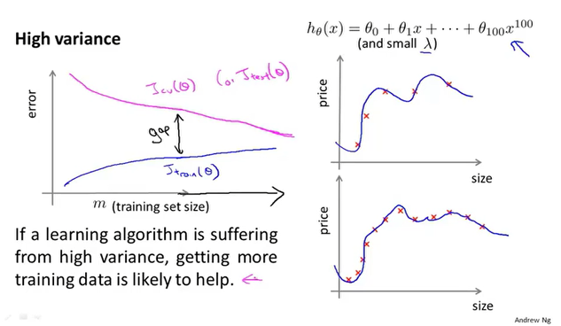

### 如何抉择

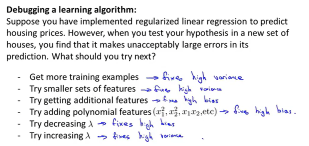

### 查准率、召回率

例如对癌症的预测，相对于样本数据真实得癌症的人非常少，大概只有0.5%的概率，这样的问题称为偏斜类，一个类中的样本数比另一个类多得多。

对于偏斜类的问题，如何评估模型的精准度呢？可能一个只输出y=1的函数都比你的模型准确。

这里引入了查准率和召回率，对于稀有的样本有：

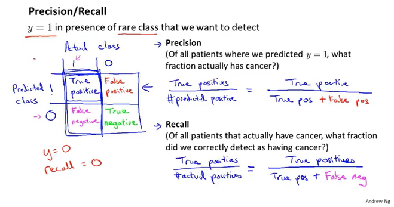

通常如果阈值设置的比较高，那么对应的查准率高、召回率低；相反如果阈值设置的低，那么查准率低、召回率高。

如何比较权衡不同的算法呢？

这里使用的$F_1 score$，即调和平均数（倒数的平均数）来衡量。

$F_1 score$会比较照顾数值小的一方，如果PR都为0，$F_1 score=0$；如果PR都为1，$F_1 score=1$

## 支持向量机

对于逻辑回归模型，他的图像是一个曲线，SVM使用简单函数来近似这个曲线。

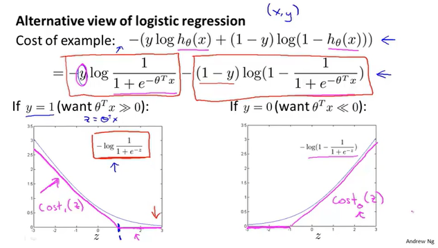

### 代价函数

支持向量机在逻辑回归的基础上简化了代价函数，逻辑回归使用正则项来权衡$\theta$的大小，以此解决过拟合的问题。SVM也是类似，它是在代价函数上添加系数C，实际上效果等价。

### 最大边界

SVM又叫做最大边界分类问题，观察代价函数可以得到：

最小化代价函数，就是让左侧代价函数的和尽可能等于0，即对应$\theta^Tx$，另外还有右侧的$\theta^2$的和最小，即向量的模尽可能小。

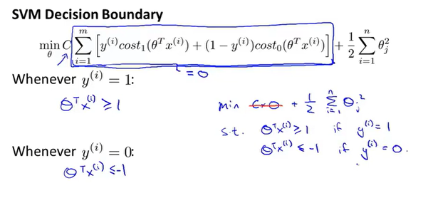

SVM对于如下二分类的问题，往往会得到黑色的那条分界线，这条线恰好对应着最大的边界，因此也叫做最大边界分类问题。

另外代价函数中的C决定了边界的划分，如果C很大，对应逻辑回归的$\lambda$很小时的过拟合，这样就会的到紫色的分界线，通过C的取值，我们可以决定边界的划分情况。

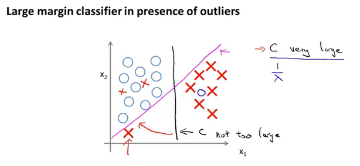

### 证明

向量的内积，等价于投影长度的乘积。

因此$\theta^Tx$可以写为$p||\theta||$。

对于左侧的$\theta$，每个x向量在$\theta$上的投影距离很小，要满足条件那么$||\theta||$就要增大，这样最小化代价函数的值就不是最优的，所以SVM会得到类似右侧的边界，这样$||\theta||$尽可能小些，因为投影距离都比左侧的要大，这也是最大边界的原因。

## 核函数

对于一个非线性决策边界问题，我们可能使用高阶的函数进行拟合，但是是否存在比当前特征刚好的表达形式呢？

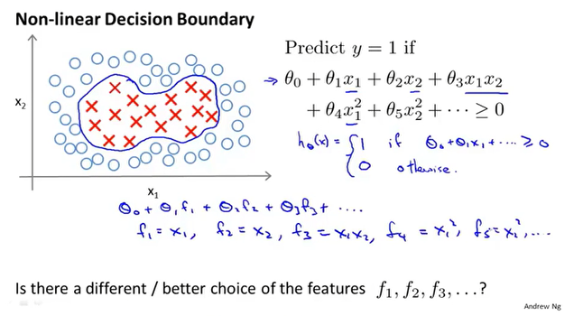

我们可以将每种特征表示为$f_i$，使用**高斯核函数**来做相似度分析。

使用高斯函数的特点：如果相似度很高，即对应的欧几里得距离$\approx 0$对应$f_i=1$，相反如果相似度低对应$f_i\approx 0$。

假设我们已经训练好参数$\theta$，那么就可以通过$\theta^Tf \ge 0$来进行预测，即对应红色的决策边界。

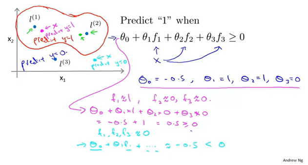

和函数中的$l^{(i)}$的选值，可以直接对应训练集$x^{(i)}$。

SVM在使用核函数的时候，对应代价函数就可以替换为：

和SVM中的参数C一样，核函数的$\sigma^2$决定了拟合的程度。

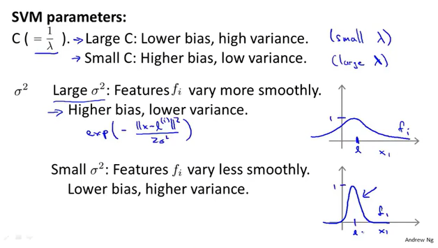

## k均值

对于没有标签的数据来说，首先根据划分聚类的个数，随机设置聚类中心的位置，然后遍历所有的数据，把每个数据分配到离它最近的坐标，对于同一个簇的数据计算它们坐标的中心位置，并设置为新的聚类中心，以此不断的迭代。

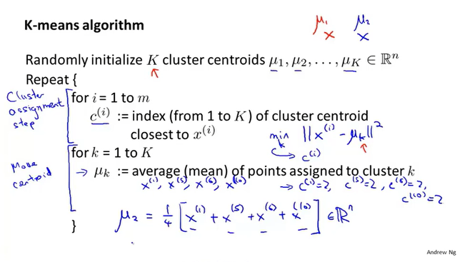

k均值的目标函数就是使得所有数据离它所属聚类中心距离。

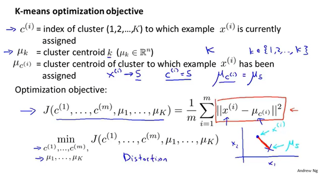

**随机初始化**，当聚类数量很少时，如果初始化的位置不够好，会得到一个局部最优解，解决方案时多次随机初始化得到一个全局最优解。

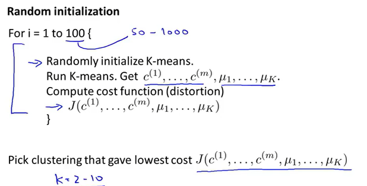

**聚类数量的选择**，可以得到数量和代价函数的图像，根据肘部原则选取（一般不用）；或者根据k均值聚类的目的来做判断，比如做衣服尺寸的聚类分析，根据市场需求，3个聚类or5个聚类更适合市场营销等等。

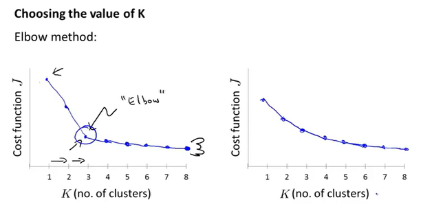

## 主成分分析

主成分分析(PCA)是一种数据压缩的算法，他将数据压缩到k维度，并使得所有数据投影到新维度的距离最小。

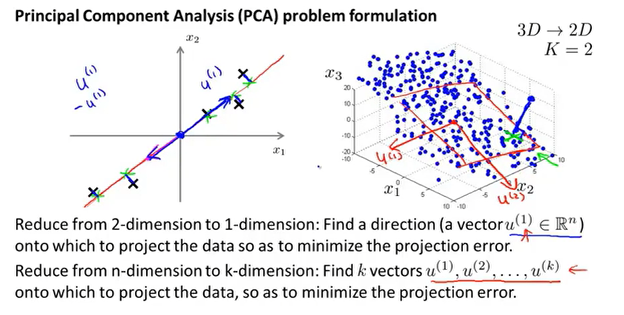

PCA不是线性回归，一个是投影距离，一个点和直线上点的距离。

PCA执行过程，首先对数据进行均值归一化，然后计算协方差，最后得到一个k维的矩阵。

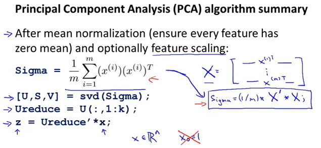

如何确定维度K？

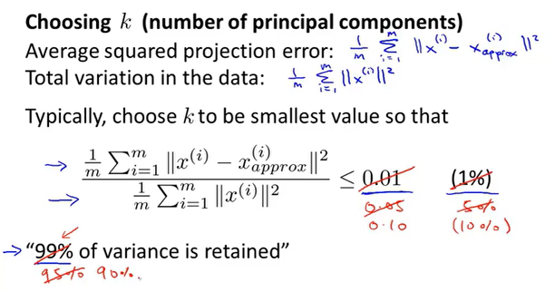

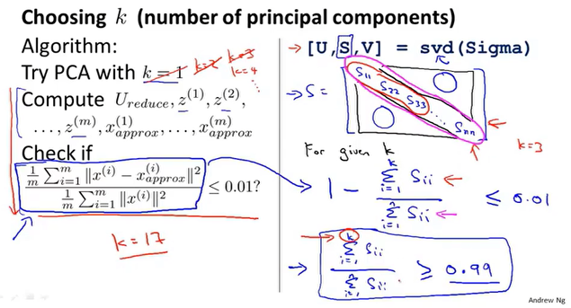

如何得到压缩直线的近似坐标？

## 异常检测

可以使用**高斯分布**来进行异常检测。

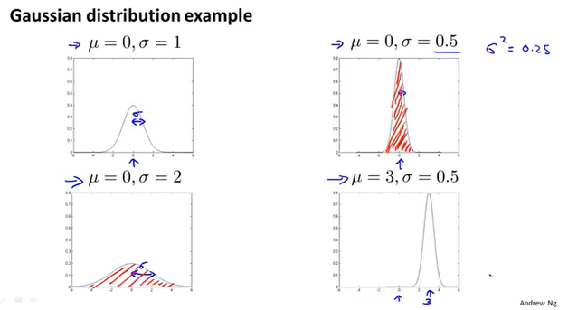

计算m个数据集在每一个维度上的$\mu$和$\sigma^2$，然后根据$p(x)$得到一个概率$\epsilon$，根据概率的大小来定义是否为异常行为。

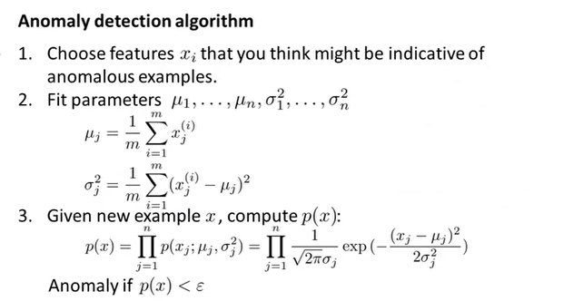

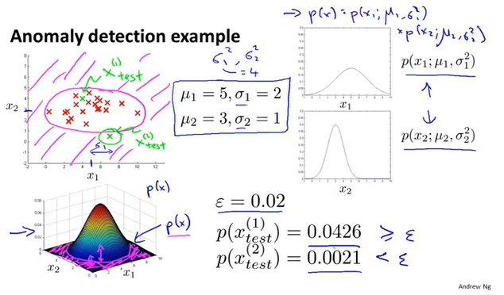

**多变量高斯分布**

异常检测算法，往往是把$\mu$附近的数据认为是高频率出现的，表现在图像上类似一个圆形。这样在一些情况下并不能完全的拟合数据，他不能体现一个椭圆区域的数据表现。

 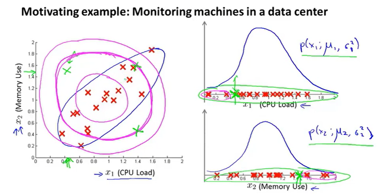

多变量高斯分布引入了协方差矩阵，通过修改矩阵的值来改变高斯分布的情况。

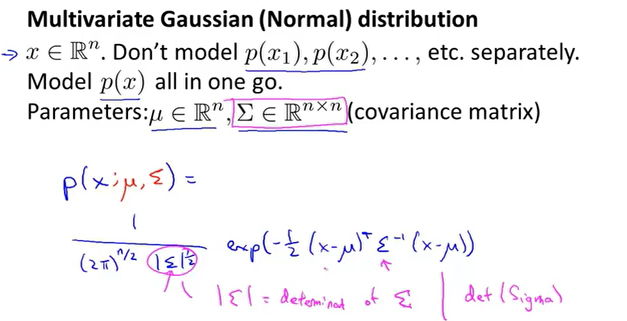

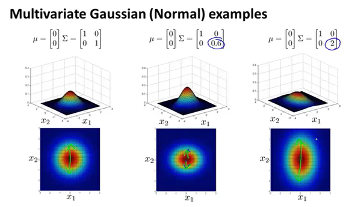

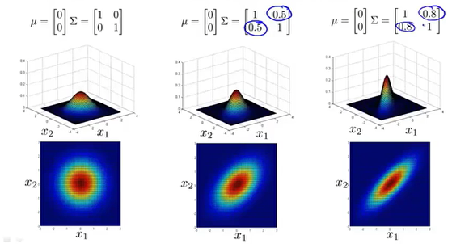

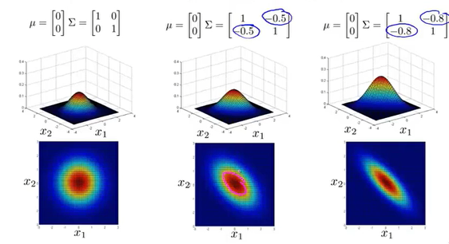

这样就可以更好的表示数据的分布。

传统的高斯分布实际上是多变量高斯分布的特殊形式，对应矩阵在非对角线上的数为0。

传统的需要手动构造异常特征的组合，多变量可以自动的捕捉。不过多变量的计算要高一些。

## 推荐系统

### 内容推荐算法

例如一个电影推荐系统，一共有n个用户，m个电影，对于每个电影都有一定的特征描述，例如爱情片的比例、动作片的比例。n个用户对看过的电影进行评分，推荐系统做的就是，对于用户没有看过的电影如何预测用户的评分？

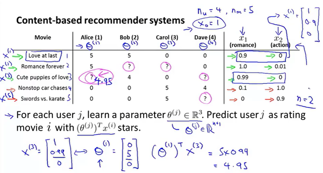

可以使用线性回归的方法进行训练，得到用户对于特征的参数$\theta$，之后就可以根据$\theta^TX$对电影进行打分。

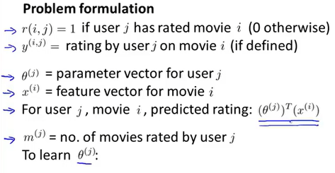

优化目标函数为：

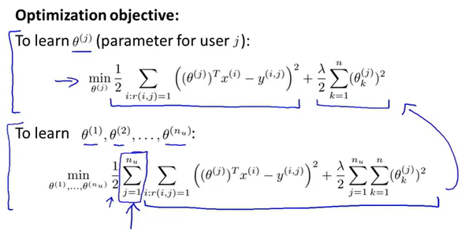

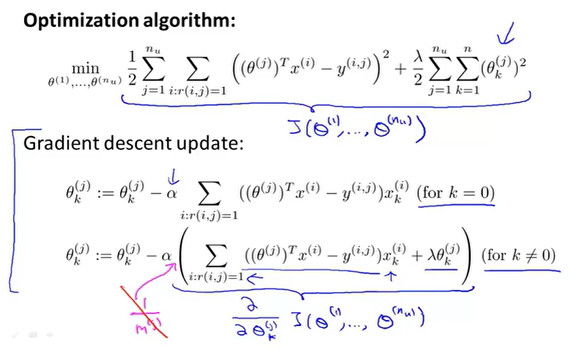

### 协同过滤

collaborative filtering

我们无法得到一部电影对应特征的数值，例如如何得到一部电影中爱情片和动作片的比例？除非人工审核每一部电影。

这里有一个思路，首先用户根据自己的喜好对这些特征打分，然后结合那些已经被评分后的电影，就可以得到一个多元的线性方程组，从而大致的得到每部电影对应特征的数值。

先有鸡还是先有蛋？

根据特征向量$X$可以通过线性回归得到用户的$\theta$向量，通过用户提供的$\theta$向量可以估计每部电影的特征数值。这就有点像鸡和蛋的问题。

我们可以随机选取$\theta$向量计算得到特征数值，然后在通过线性回归去更新$\theta$，这样不停的迭代直到最后的收敛。

我们也可以将两种函数合并为一个目标函数：

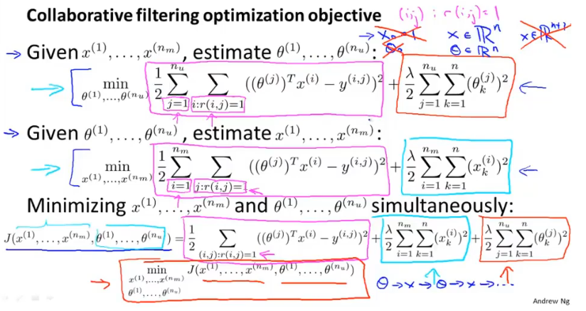

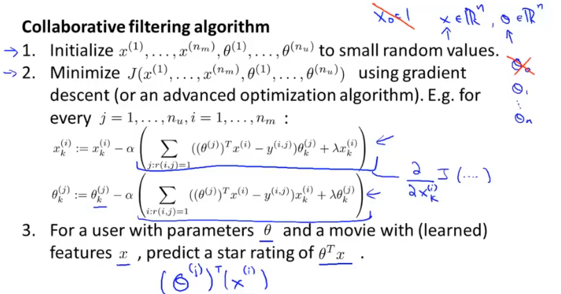

### 低秩矩阵分解

可以把n个用户对m部电影的评分结果表示为$m\times n$的矩阵。

根据前面的只是，这个矩阵可以表示为$X\theta^T$。

通过特征值之间的偏差，我们可以找到类型相近的电影。

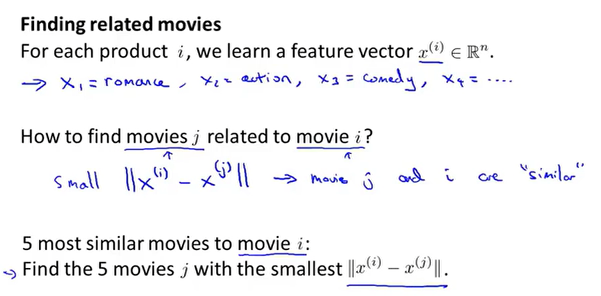

### 均值规范化

之前无论是参数$\theta$还是特征$X$，都基于每个用户都对多个电影进行的评分，每部电影也被多个用户评分。对于新用户，他可能还没有对任何一部电影进行评分，一种思路就是把所有用户对每部电影的评分的均值作为新用户的初始评分。

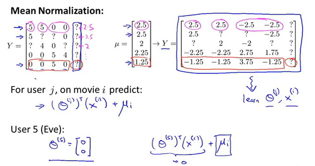

## 随机梯度下降

Stochastic gradient descent

随机梯度下降算法对每个数据分开处理，对一个数据更新所有的参数。

梯度下降算法是在每次更新参数的时候，需要计算所有数据。

对比下来SGD的速度要快一些，不过收敛性可能没GD好。

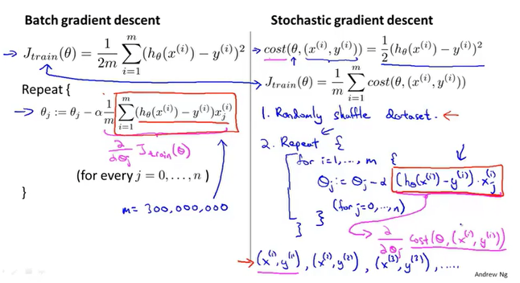

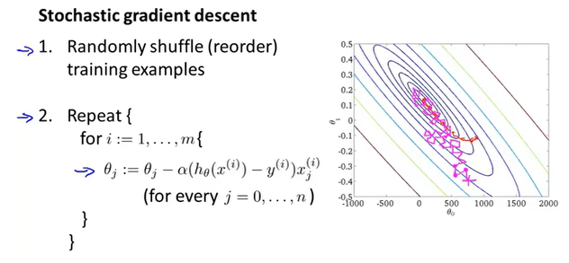

如何判断SGD的收敛？

首先定义cost函数，然后每隔1000次迭代画出cost的图像，根据均值来判断。

如果噪声太多图像上下震荡，可以选择更多的迭代次数。

如果随着迭代次数cost增加，那么选择更小的$\alpha$。

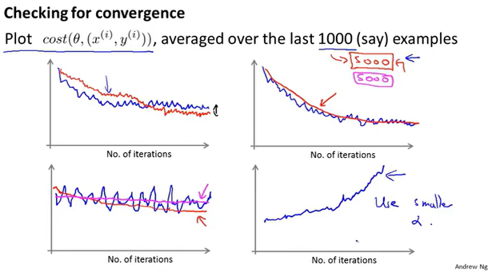

SGD一般不能得到全局最优，他会一直在最优值附近徘徊。

学习率的大小一般保持不变，一个思路是可以动态的改变学习率$\alpha$的大小来提高准确度，比如随着迭代次数的增加慢慢减小$\alpha$的值。

## Mini-Batch

Mini-Batch gradient descent

将数据分为多份，对每一份执行GD，相当于GD和SGD的综合。

b可以取[10,100]。

## Map-reduce

Map-reduce and data parallelism。

Map-reduce利用了线性回归求和运算的特性，将GD对整个数据的求和处理，分摊到多个服务器上执行，最后各个服务器把结果汇总到一起进行合并。

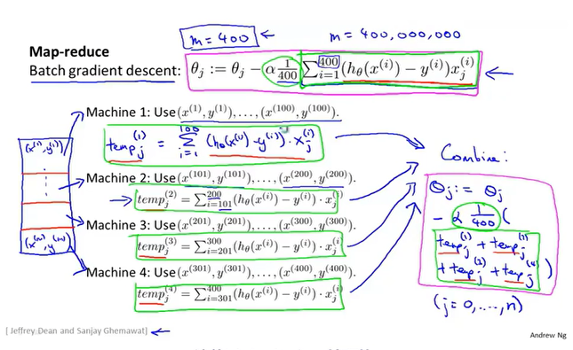

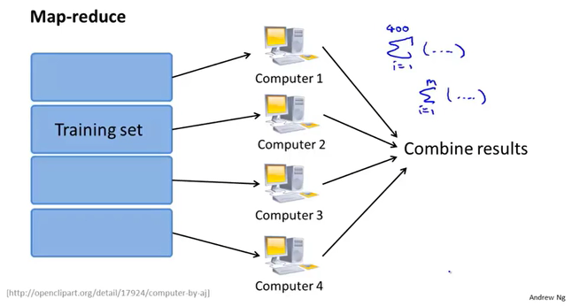

逻辑回归也可以这样搞。

## OCR 

### pipeline

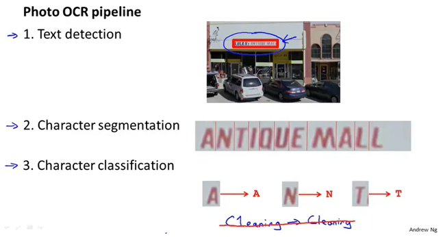

### 滑动窗口

### 获取数据

下载字体，然后将它们放到一个随机北京图片上。

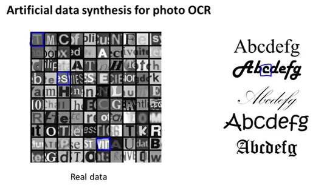

对图像进行人工扭曲

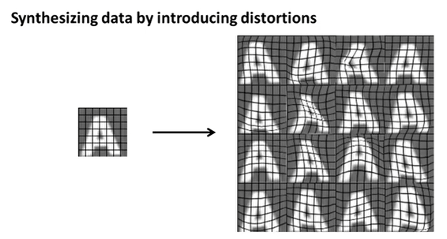

对语音文本加入不同的背景干扰。

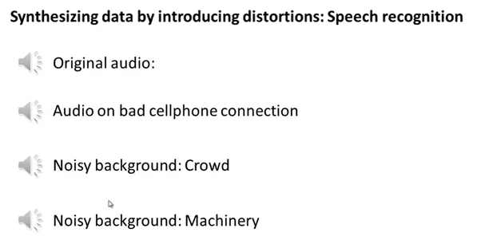

首先确保算法已经有很低的偏差，整体的模型ok，然后在考虑加数据，否则只是徒劳。

然后考虑加数据的人工和时间成本。

## 上限分析

对多个模块进行分析，让其中一个模块达到100%的准确率，然后判断它能提高整个系统多少准确率。

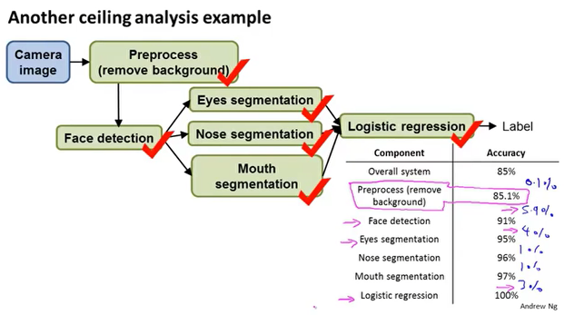

## 课后作业

作业地址：[https://github.com/Sanzona/ML-homework](https://github.com/Sanzona/ML-homework)