---

typora-copy-images-to: img/线性代数

---

[b站视频链接](https://www.bilibili.com/video/BV1ib411t7YR)

## 什么是向量

向量对于不同的学科有不一样的定义。

物理中的向量有**长度**和**方向**决定，长度和方向不变可以随意移动，它们表示的是同一个向量。

计算机中的向量更多的是对数据的抽象，可以根据面积和价格定义一个房子$\begin{bmatrix}
   100m^2 \\
   700000￥
  \end{bmatrix}$。

数学中的向量可以是任意东西，只要保证两个**向量的相加**$\vec v + \vec w$以及**数字和向量相乘**$2\vec v$是有意义的即可。

线性代数中的向量可以理解为一个空间中的箭头，这个箭头起点落在原点。如果空间中有许多的向量，可以点表示一个向量，即向量头的坐标。

> 向量的基本运算

向量的加法：可以理解为在坐标中两个向量的移动。

$\begin{bmatrix}
   1 \\
   2
  \end{bmatrix} + \begin{bmatrix}
   3 \\
   -1
  \end{bmatrix} = \begin{bmatrix}
   4 \\
   1
  \end{bmatrix}$

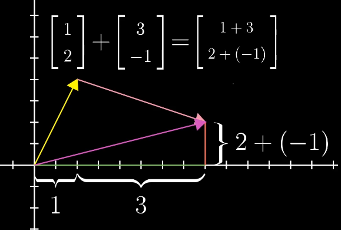

数字和向量相乘：可以理解为向量的缩放。

$2\begin{bmatrix}
   3 \\
   1
  \end{bmatrix}=\begin{bmatrix}
   6 \\
   2
  \end{bmatrix}$

## 线性组合、张成空间、基

> 线性组合

两个数乘向量称为两个向量的线性组合$a\vec v+ b\vec w$。

两个不共线的向量通过不同的线性组合可以得到二维平面中的所有向量。

两个共线的向量通过线程组合只能得到一个直线的所有向量。

如果两个向量都是零向量那么它只能在原点。

> 张成空间

所有可以表示给定向量线性组合的向量的集合称为给定向量的张成空间（span）。

一般来说两个向量张成空间可以是直线、平面。

三个向量张成空间可以是平面、空间。

如果多个向量，并且可以移除其中一个而不减小张成空间，那么它们是**线性相关**的，也可以说一个向量可以表示为其他向量的线性组合$\vec u = a \vec v + b\vec w$。

如果所有的向量都给张成的空间增加了新的维度，它们就成为线性无关的$\vec u \neq a \vec v + b\vec w$。

> 基

向量空间的一组及是张成该空间的一个线性无关向量集。

## 矩阵与线性变换

严格意义上来说，线性变换是将向量作为输入和输出的一类函数。

变化可以多种多样，线性变化将变化限制在一个特殊类型的变换上，可以简单的理解为网格西安保持平行且等距分布。

线性变化满足一下两个性质：

- 线性变化前后直线依旧是直线不能弯曲。
- 原点必须保持固定。

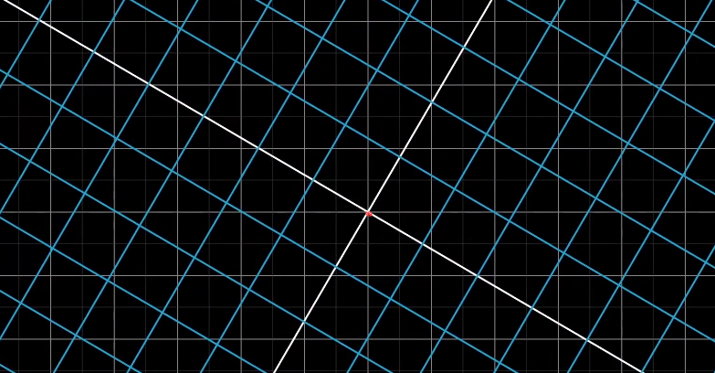

可以使用**基向量来描述线性变化**：

通过记录两个基向量$\hat{i}$,$\hat{j}$的变换，就可以得到其他变化后的向量。

已知向量$\vec v = \begin{bmatrix}
-1 \\
   2
  \end{bmatrix}$

变换之前的$\hat i$和$\hat j$：
$$
\hat{i} = \begin{bmatrix}
1 \\
   0
  \end{bmatrix} \\
  \hat{j} = \begin{bmatrix}
0 \\
   1
  \end{bmatrix} \\
\vec{v} = -1\hat{i} + 2 \hat{j} = \begin{bmatrix}
-1 \\
   2
  \end{bmatrix}
$$
变换之后的$\hat i$和$\hat j$：
$$
\begin{aligned}
\hat{i} = \begin{bmatrix}
1 \\
   -2
  \end{bmatrix} \\
  \hat{j} = \begin{bmatrix}
3 \\
   0
  \end{bmatrix} \\
\vec{v} = -1\hat{i} + 2 \hat{j} &= \begin{bmatrix}
-1 \\
   2
  \end{bmatrix} \\
  &= -1\begin{bmatrix}
1 \\
   -2
  \end{bmatrix}  + 2 \begin{bmatrix}
3 \\
  0
  \end{bmatrix} \\
  &= \begin{bmatrix}
1 & 3 \\
   -2 & 0
  \end{bmatrix}  \begin{bmatrix}
-1 \\
   2
  \end{bmatrix} \\
  &= \begin{bmatrix}
5 \\
   2
  \end{bmatrix} \\
\end{aligned}
$$
我们可以将变换后的$\hat i$和$\hat j$写成矩阵的形式：$\begin{bmatrix}
1 & 3 \\
   -2 & 0
  \end{bmatrix}  \begin{bmatrix}
-1 \\
   2
  \end{bmatrix}$，通过矩阵的乘法得到变化后的向量。

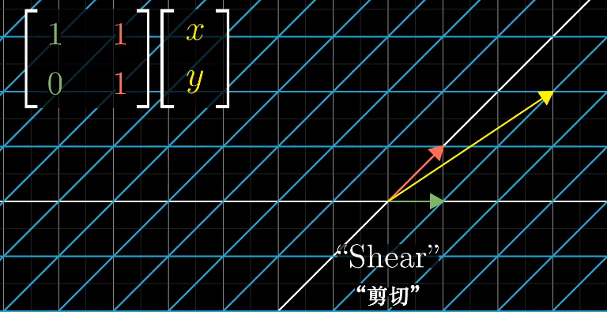

如果变化后的$\hat{i}$和$\hat{j}$是线性相关的，变化后向量的张量就是一维空间：

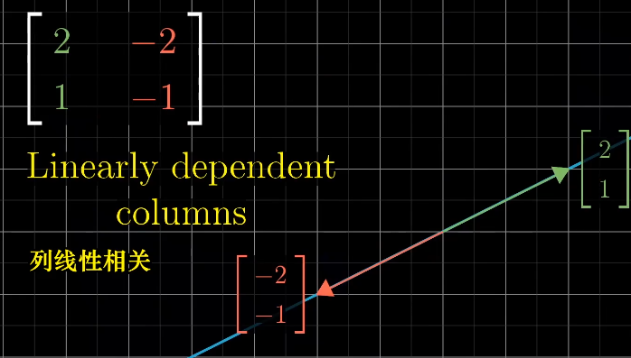

## 矩阵乘法与线性变换复合的联系

> 线性变化的复合

如何描述**先旋转再剪切**的操作呢？

一个通俗的方法是首先**左乘旋转矩阵**然后**左乘剪切矩阵**。

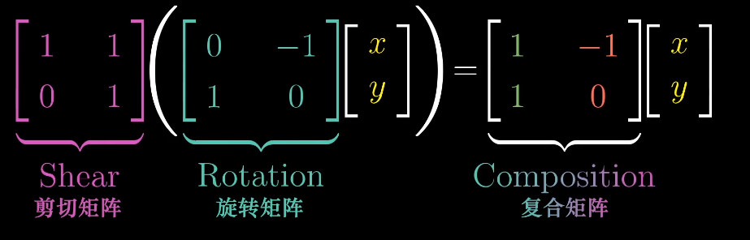

两个矩阵的乘积需要从右向左读，类似函数的复合。

这样两个矩阵的乘积就对应了一个复合的线性变换，最终得到对应变换后的$\hat{i}$和$\hat{j}$，例如

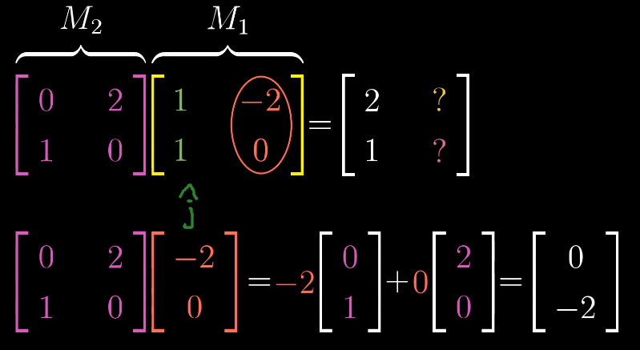

这一过程具有普适性：

> 矩阵乘法的顺序

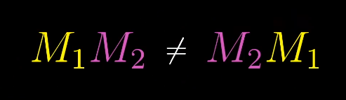

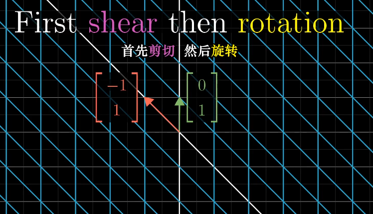

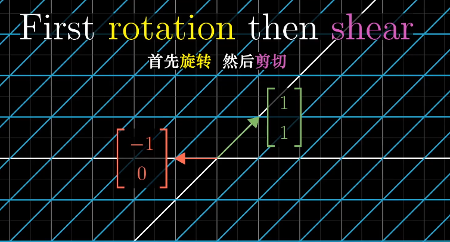

> 如何证明矩阵乘法的结合性？

$(AB)C = A(BC)$

根据线性变化我们可以得出，矩阵的乘法都是以CBA的顺序变换得到，所以他们本指上相同，通过变化的形式解释比代数计算更加容易理解。

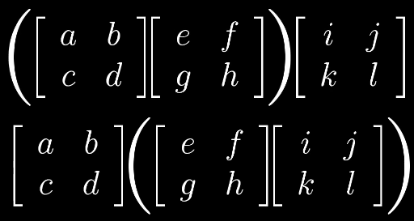

## 三维空间的线性变化

三维的空间变化和二维的类似。

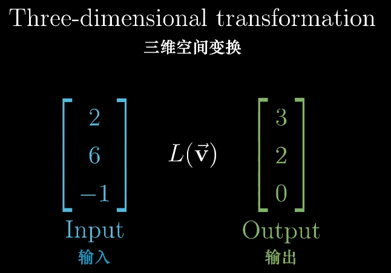

同样跟踪基向量的变换，能很好的解释变换后的向量，同样两个矩阵相乘也是。

 

## 行列式

> 行列式的本质

行列式的本质是计算线性变化对空间的缩放比例，具体一点就是，测量一个给定区域面积增大或减小的比例。

单位正方形的变换可以得到任意区域的面积变换。

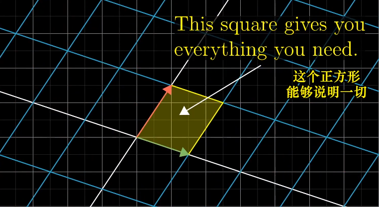

**行列式的值表示缩放比例。**

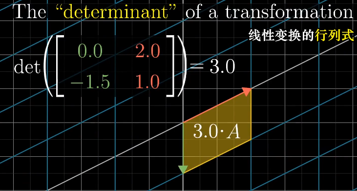

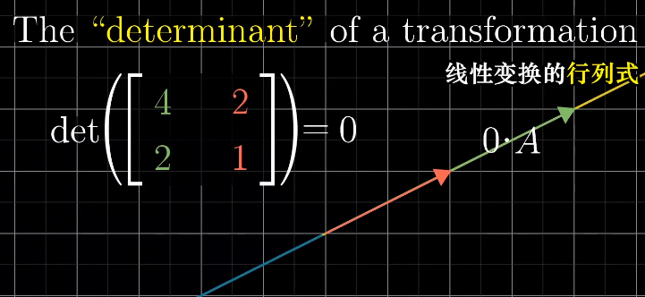

行列式为什么有负值呢？

三维空间的行列式也是相同，只不过它的单位是一个单位1的立方体。

三位空间的线性变换，可以使用**右手定则**判断三维空间的定向。如果变换前后都可以通过右手定则得到，那么他的行列式就是正值，否则为负值。

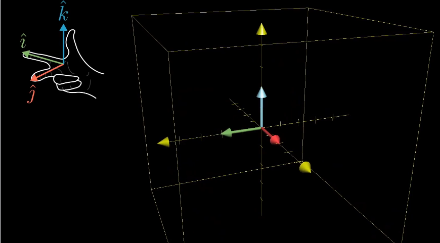

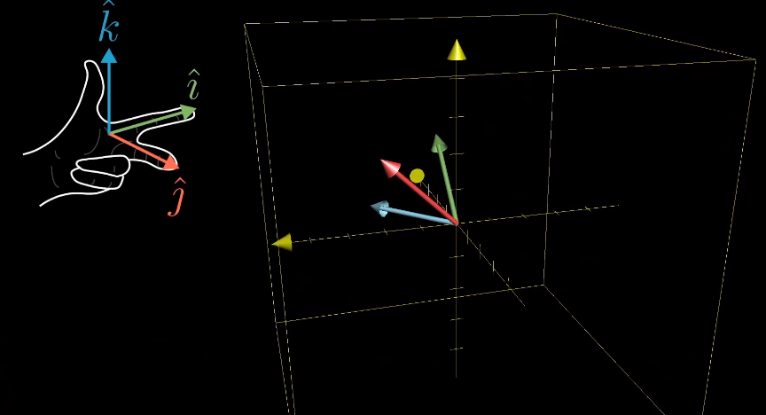

> 行列式的计算

二阶行列式

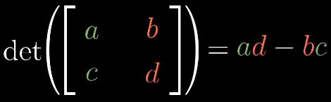

三阶行列式

二阶行列式中a、d，表示横向和纵向的拉伸，b、c表示对角线的拉伸和压缩的情况。

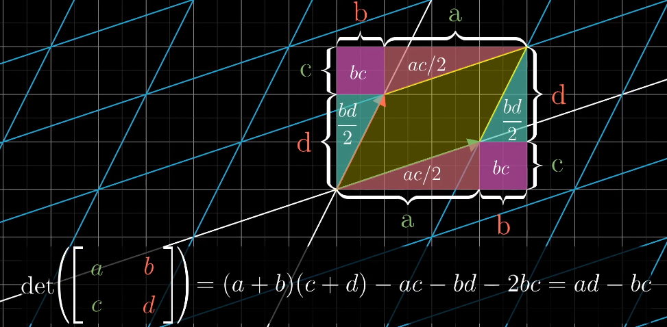

## 逆矩阵、列空间、秩、零空间

> 线性方程组

从几何的角度来思考，矩阵A表示一个线性变换，我们需要找到一个$\vec x$使得它在变换后和$\vec v$重合。

> 逆矩阵

矩阵的逆运算，记为$\vec A = \begin{bmatrix}
3&1 \\
   0&2
  \end{bmatrix}^{-1}$，对于线程方程$A \vec x = \vec v $来说如果找到$A^{-1}$就可以得到$\vec x = A^{-1} \vec v$。

$A^{-1}A=\begin{bmatrix}
1&0 \\
   0&1
  \end{bmatrix}$，什么都不做称为恒等变换。

> 线性方程组的解

对于方程组$A\vec x = \vec v$，线性变换A存在两种情况：

$det(A) \neq0$：这时空间的维数并没有减少，有且只有一个向量经过线性变换后和$\vec v$重合。

$det(A) =0$：空间被压缩到更低的维度，这时不存在一个逆变换，因为不能将一个直线解压缩为一个平面，这样就会映射多个向量。但是即使不存在逆变换，解可能仍然存在，因为目标$\vec v$刚好落在压缩后的空间上。

> 秩

秩代表变换后空间的维度。

如果线性变化后将空间压缩成一条直线，那么称这个变化的秩为1；

如果线性变化后向量落在二维平面，那么称这个变化的秩为1。

如果线性变化后空间时一条直线，那么称这个变化的秩为1。

> 列空间

所有可能的**输出向量**$A\vec v$构成的集合，称为列空间，即所有列向量张成的空间。

> 零空间（Null space）

在所有的线性变化中，零向量一定包含再列空间中，因为线性变换原点保持不动。对于非满秩的情况来说，会有一系列的向量在变换后称为零向量。

二维空间压缩为一条直线，一条线上的向量都会落到原点。

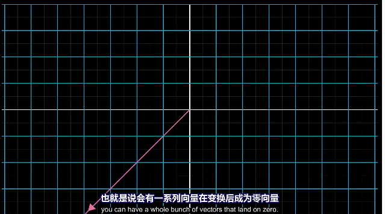

三维维空间压缩为二维平面，一条线上的向量都会落到原点。

三维维空间压缩为一条直线，整个平面上的向量都会落到原点。

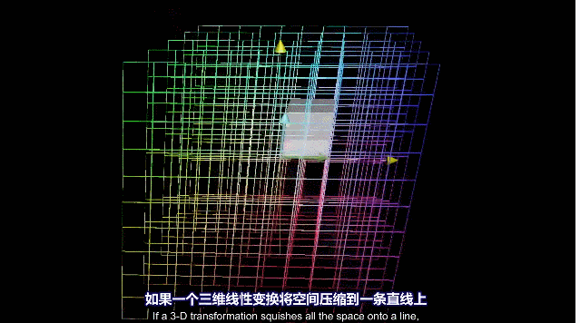

当$A\vec x = \vec v$中的$\vec v$是一个零向量，即$A\vec x = \begin{bmatrix}
0 \\
   0
  \end{bmatrix}$时，零空间就是它所有可能的解。

## 非方阵、不同维度空间之间的线性变换

不同维度的变换也是存在的。

一个$3\times2$的矩阵：$\begin{bmatrix}2&0\\-1&1\\-2&1 \end{bmatrix}$它的集合意义是将一个二维空间映射到三维空间上，矩阵有两列表明输入空间有两个基向量，有三行表示每个向量在变换后用三个独立的坐标描述。

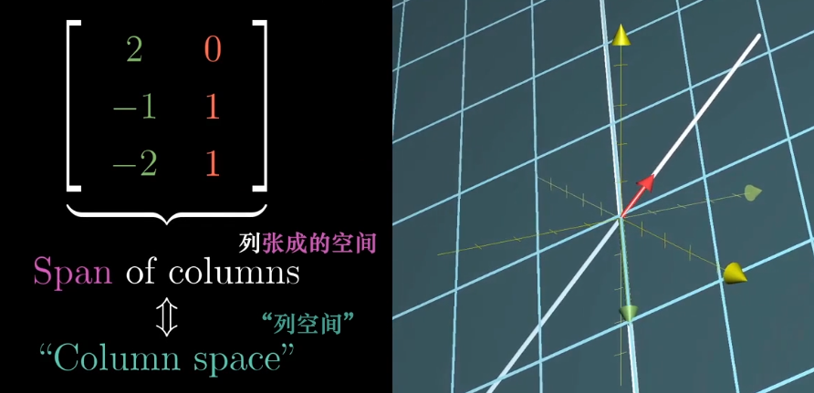

一个$2\times 3$的矩阵：$\begin{bmatrix}3&1&4\\1&5&9 \end{bmatrix}$则表示将一个三维空间映射到二维空间上。

一个$1\times 2$的矩阵：$\begin{bmatrix}1&2 \end{bmatrix}$表示一个二维空间映射到一维空间。

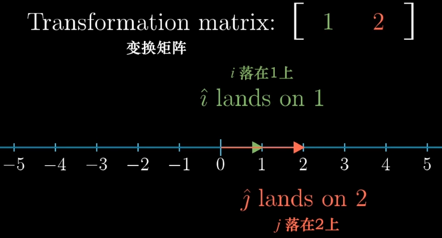

## 点积与对偶性

> 点积

 对于两个维度相同的向量，他们的点积计算为：$\begin{bmatrix}1\\2 \end{bmatrix}\cdot\begin{bmatrix} 3\\4\end{bmatrix}=1\cdot3+2\cdot4=11$。

点积的几何解释是将一个向量向一个向量投影，然后两个长度相乘，如果为负数则表示反向。

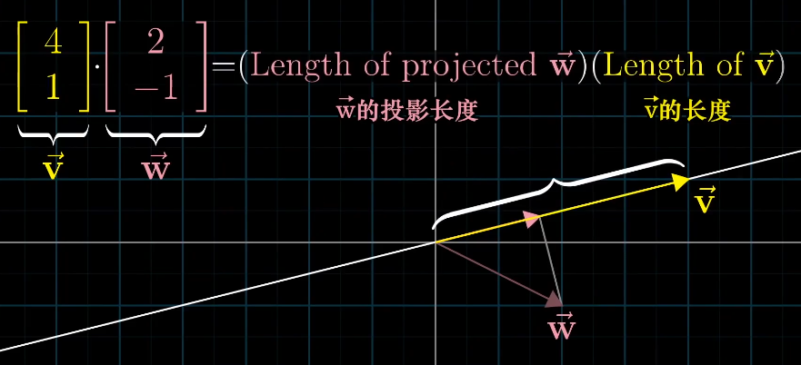

> 对偶性

对偶性的思想是：每当看到一个多维空间到数轴上的线性变换时，他都与空间中的唯一一个向量对应，也就是说使用线性变换和与这个向量点乘等价。这个向量也叫做线性变换的**对偶向量**。

为什么点积和坐标相乘联系起来了？这来自于对偶性。

首先对于一个二维空间向一维空间的映射，如果在二维空间中等距分布的点在变换后还是等距分布的，那么这种变换就是线性的。

假设有一个线性变换A$\begin{bmatrix}1&-2\end{bmatrix}$和一个向量$\vec v=\begin{bmatrix}4\\3\end{bmatrix}$。

变换后的位置为$\begin{bmatrix}1&-2\end{bmatrix}\begin{bmatrix}4\\3\end{bmatrix}=4\cdot1+3\cdot-2=-2$，这个变换是一个二维空间向一维空间的变化，所以变换后的结果为一个坐标值。

我们可以看到线性变换的计算过程和向量的点积相同$\begin{bmatrix}1\\-2\end{bmatrix}\cdot\begin{bmatrix}4\\3\end{bmatrix}=4\cdot1+3\cdot-2=-2$，所以向量和一个线性变化有着微妙的联系。

假设有一个倾斜的数轴，上面有一个单位向量$\vec v$，对于任意一个向量他在数轴上的投影都是一个数字，这表示了一个二维向量到一位空间的一种线性变换，那么如何得到这个线性变化呢？

由之前的内容来说，我们可以观察基向量$\vec i$和$\vec j$的变化，从而得到对应的线性变化。

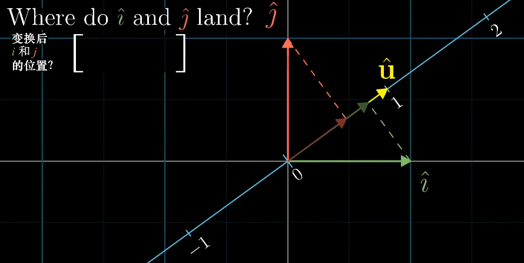

因为$\vec i$、$\vec j$、$\vec u$都是单位向量，根据对称性可以得到$\vec i$和$\vec j$在$vec u$上的投影刚好是$\vec u$的坐标。

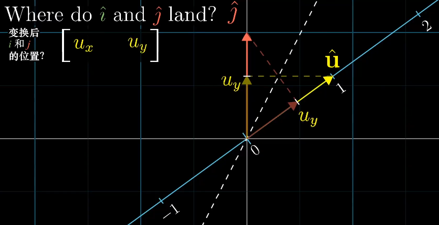

这样空间中的所有向量都可以通过线性变化$\begin{bmatrix}u_x&u_y \end{bmatrix}$得到，而这个计算过程刚好和单位向量的点积相同。

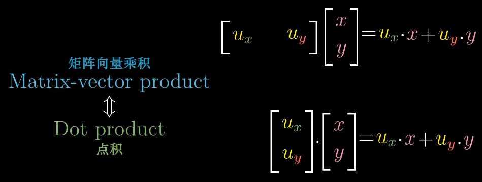

也就是为什么与单位向量的点积可以解读为将向量投影在单位向量所在直线上所得到的投影长度。对于非单位长度也是类似，只是将结果扩大对应的倍数。

## 叉积

对于两个向量所围成的面积来说，可以使用行列式计算，将两个向量看作是变换后的基向量，这样通过行列式就可以得到变换后面积缩放的比例，因为基向量的单位为1，所以就得到了对应的面积。

考虑到正向，这个面积的值存在负值，这是参照基向量$\vec i$和$\vec j$的相对位置来说的。

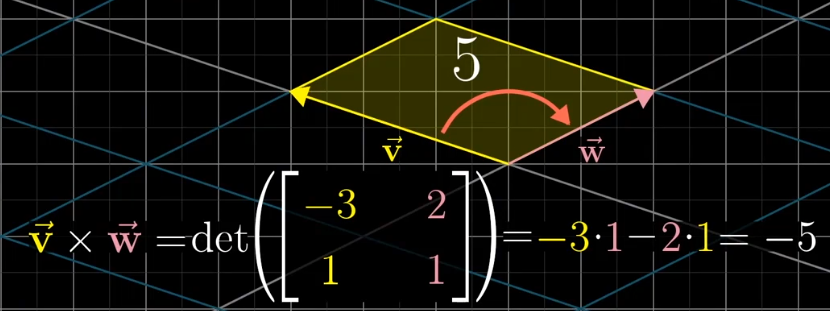

真正的叉积是通过两个三维向量$\vec v$和$\vec w$，生成一个新的三维向量$\vec u$，这个向量垂直于向量$\vec v$和$\vec w$所在的平面，长度等于它们围成的面积。

叉积的反向可以通过右手定则判断：

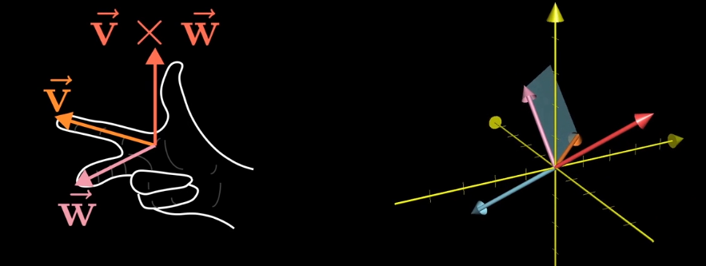

叉积的计算方法：

## 线性代数看叉积

参考二维向量的叉积计算：

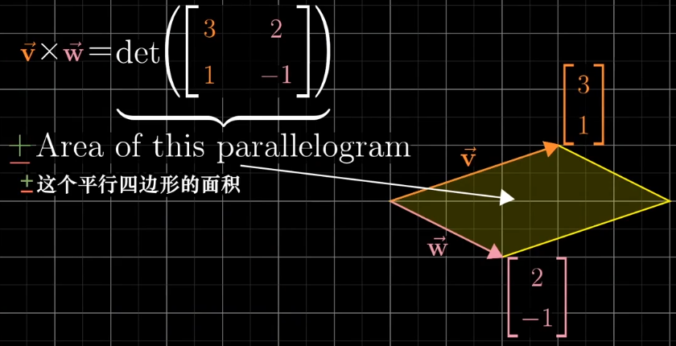

三维的可以写成类似的形式，但是他并是真正的叉积，不过和真正的叉积已经很接近了。

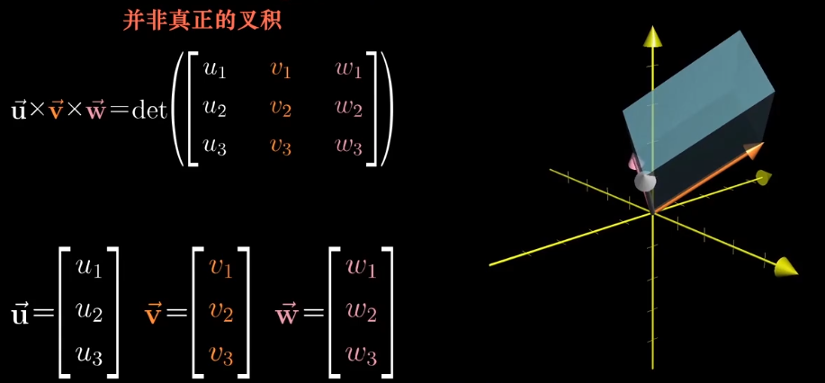

我肯可以构造一个函数，它可以把一个三维空间映射到一维空间上。

右侧行列式是线性的，所以我们可以找到一个线性变换代替这个函数。

根据对偶性的思想，从多维空间到一维空间的线性变换，等于与对应向量的点积，这个特殊的向量$\vec p$就是我们要找的向量。

> 从数值计算上:

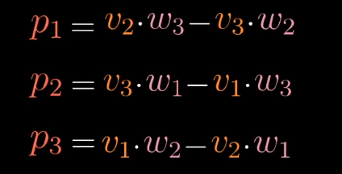

向量$\vec p$的计算结果刚好和叉积计算的结果相同。

> 从几何意义：

当向量$\vec p$和一个向量$\begin{bmatrix}x\\y\\z \end{bmatrix}$点乘时，得到一个$\begin{bmatrix}x\\y\\z \end{bmatrix}$与$\vec v$与$\vec w$确定的平行六面体的有限体积，什么样的向量满足这个性质呢？

向量$\vec p$和其他向量点积的集合解释是，其他向量在$\vec p$上的投影的长度乘以p的长度。

对于平行六面体的体积来说，它等于$\vec v$和$\vec w$所确定的面积乘以$\begin{bmatrix}x\\y\\z \end{bmatrix}$在垂线上的投影，这个$\begin{bmatrix}x\\y\\z \end{bmatrix}$与$\vec p$的结果一样。

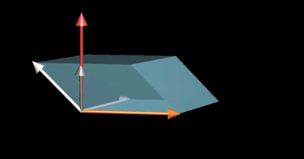

## 基变换

标准坐标系的基向量为$\vec i \begin{bmatrix}1\\0 \end{bmatrix}$和$\vec j \begin{bmatrix}0\\1 \end{bmatrix}$，假如詹妮弗有另一个坐标系他的基向量为$\vec i \begin{bmatrix}2\\1 \end{bmatrix}$和$\vec j \begin{bmatrix}-1\\1 \end{bmatrix}$。

对于同一个点$\begin{bmatrix}3\\2 \end{bmatrix}$来说他们所表示的形式不同，在詹妮弗的坐标系中表示为$\begin{bmatrix}\frac{5}{3}\\\frac{1}{3} \end{bmatrix}$。

从标准坐标到詹尼佛的坐标系，我能可以得到一个线性变换$A:\begin{bmatrix}2&-1\\1&1 \end{bmatrix}$。

如果想知道詹妮弗的坐标系中点$\begin{bmatrix}3\\2 \end{bmatrix}$在标准坐标系的位置，可以通过$\begin{bmatrix}2&-1\\1&1 \end{bmatrix}\begin{bmatrix}3\\2 \end{bmatrix}$得到。

如果想知道标准坐标系中点$\begin{bmatrix}3\\2 \end{bmatrix}$在詹妮弗坐标系的位置，可以通过$\begin{bmatrix}2&-1\\1&1 \end{bmatrix}^{-1}\begin{bmatrix}3\\2 \end{bmatrix}$得到。

具体的例子，90°旋转。

在标准坐标系可以跟踪基向量的变化来体现：

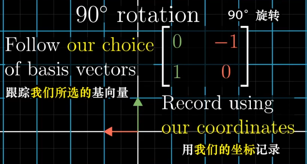

但是如何得到詹妮弗的旋转表示呢？可以从一个任意向量出发，首先将他转换为标准坐标系的表示，然后左旋，最后再转换为詹妮弗的表示。

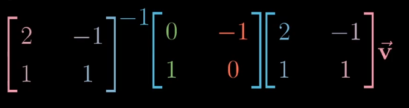

所以我们可以得到对于詹妮弗坐标系的左旋线性变化的表示：

所以表达式$A^{-1}MA$表示一种数学上的转移作用，$M$表示一种线性变换$A$和$A^{-1}$表示为一种坐标系的转换。

## 特征向量与特征值

对于一些线性变化来说，存在一些向量在变换前后留在了张成的空间里，只是拉伸或收缩了一定比例，这些向量称为特征向量，拉伸收缩的比例称为特征值。

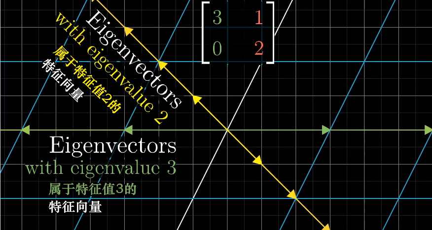

一个三维空间的旋转，如果能找到特征值为1的特征向量，那么它就是旋转轴。

> 特征向量的求解

特征向量的概念，等号左侧表示矩阵向量的乘积，等号右侧表示向量向量数乘，可以将右侧重写为某个向量的乘积，$\vec I$为单位向量。

求解等式，就是使左侧的det为0：

二维线性变换不一定存在特征向量，例如左旋90°，每个想都都发生了旋转，离开了张成空间。如果强行计算，会得到两个虚根：

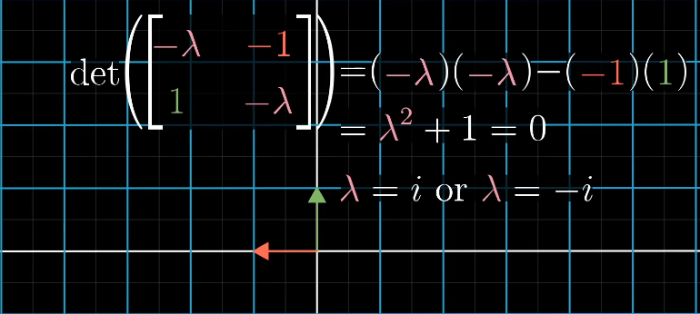

剪切变换的特征向量分布在x轴：

 只有一个特征值，但是特征向量不一定只在一条直线上：

> 特征基

如果特征向量是基向量，对应的矩阵是一个对角矩阵，矩阵的对角元是它们所属的特征值。

对角矩阵在很多方面都更容易处理，例如求幂次是对应的就是对角元的幂次。

当一个线性变换存在多个特征向量，而且其中两个向量可以张成整个空间，那么可以把问题求解转化为在特征向量坐标系中计算，最后把结果转化为标准坐标系中。

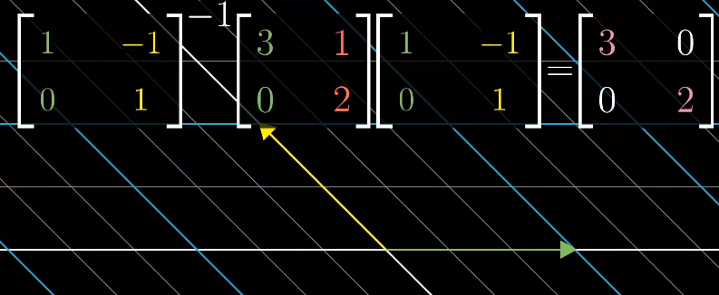

并不是所有的变换都能转化为特征基，例如剪切变换，它的特征向量不够多，不能张成全空间。

## 抽象向量空间

线性的严格定义是：可加性和成比例性。

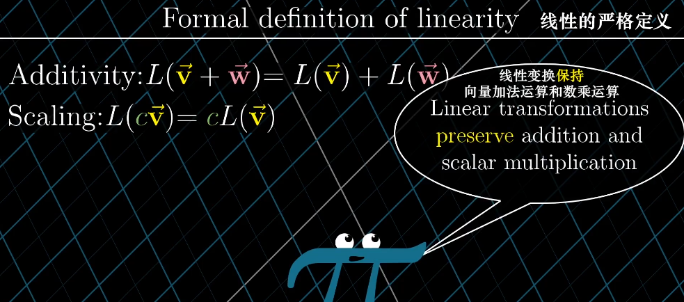

这个函数的求导类似，求导具有可加性和成比例性。

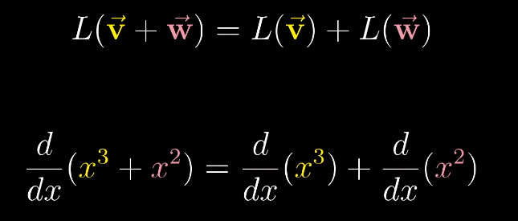

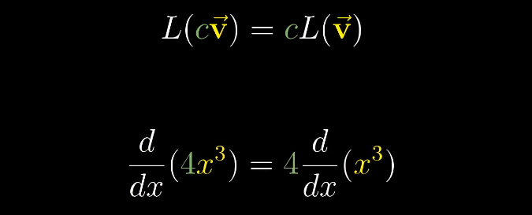

对于多项式的求导，我们也可以看成是矩阵的形式，将x的不同次幂看成基函数，这和多维空间的基向量类似。

因为求导的可加性和成比例行，我们可以分别对每个基向量求导，从而得到左侧的矩阵。

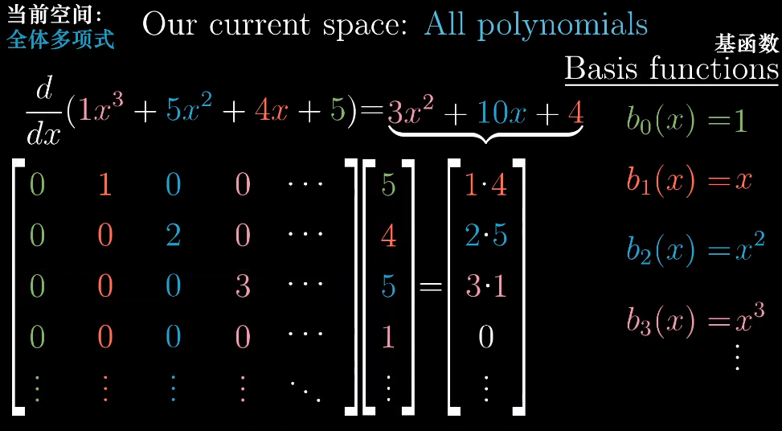

数学中有很多类似向量的事物，只要处理的对象具有数乘和相加的概念，都可以运行向量的基本性质。

对于发明向量的数学家来说，她不用考虑其他所有类似的向量，他只需要给出向量数乘和加法必须遵守的规则，即定理，那么所有满足这些定理的对象，就可以使用向量所有的性质。

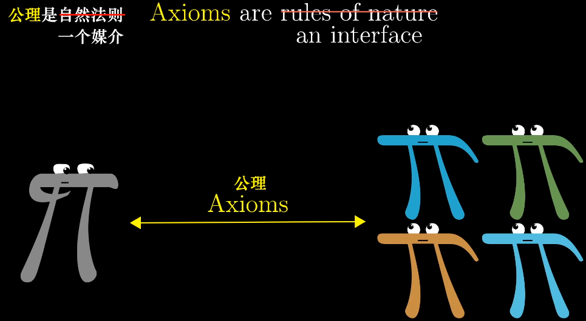
