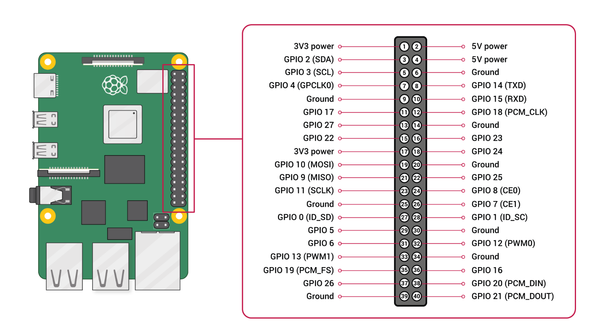
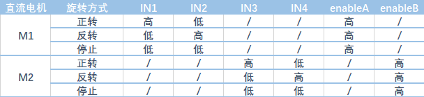

---

typora-copy-images-to: img\car

---

## GPIO

### pinout

```bash
sudo apt install python3-gpiozero
pinout
```


### gpio readall

```
wget https://project-downloads.drogon.net/wiringpi-latest.deb
sudo dpkg -i wiringpi-latest.deb
```


### 分布图




## 接线

这里使用树莓派的GPIO的BCM编号。

### L298N



IN1、IN2、IN3、IN4分别接到树莓派的5、6、13、19上。

ENA、ENB接到树莓派的20、21。


### 电源

这里采用的是树莓派和L298N都单独供电，树莓派使用的是5V3A的充电宝供电，L298N使用电池盒供电。

电池盒的正极和负极，分别接到L298N的+12V、GND。

因为都是单独供电，所以将L298N的GND和树莓派的GND相互连接，这样方便同步逻辑信号。


