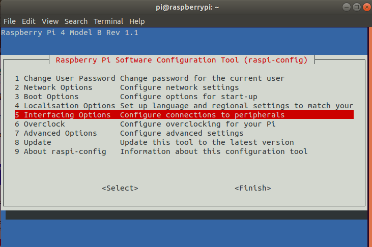
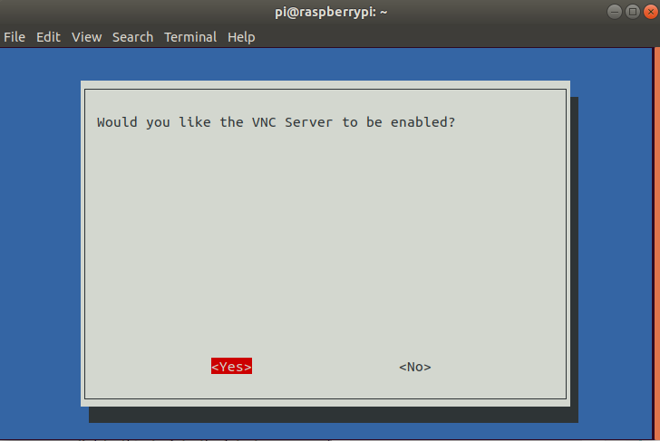
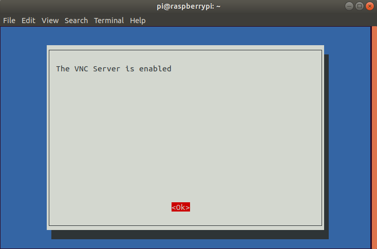

## 树莓派设置VNC

VNC可以远程显示桌面方便管理,下面以linux为例安装配置VNC Viewer.

1. 首先在树莓派开启VNC服务

   ```bash
   sudo raspi-config
   ```

   
   
   
   
   
   
   
   
2. 下载VNC Viewer

   [下载链接](https://www.realvnc.com/en/connect/download/viewer/linux/)
   
3. 连接树莓派
   
   
   
4. 常见错误
   ```Cannot currently show the Desktop```
   通过设置树莓派的分辨率解决
   ```bash
   sudo raspi-config
   ```

   
   
   
   
   
   
   
   

