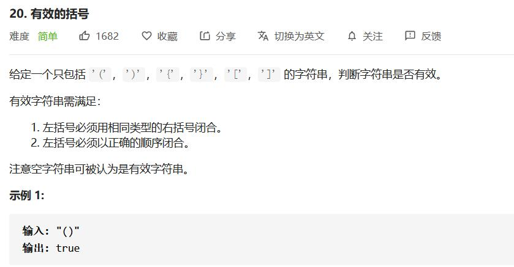
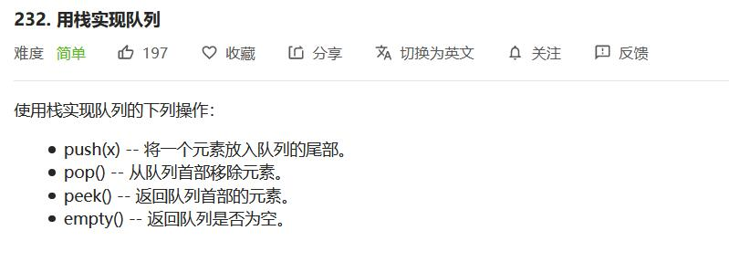

## 比较含退格的字符串

[题目链接](https://leetcode-cn.com/problems/backspace-string-compare)


- 栈模拟
- 双指针，从末尾开始模拟

```cpp
class Solution {
public:
    bool backspaceCompare(string S, string T) {
        stack<char> s1;
        stack<char> s2;
        for (char &it : S) {
            if (it != '#') s1.push(it);
            else if (!s1.empty()) s1.pop();
        }

        for (char &it : T) {
            if (it != '#') s2.push(it);
            else if (!s2.empty()) s2.pop();
        }
        return s1 == s2;
    }
};
```

```cpp
class Solution {
public:
    bool backspaceCompare(string S, string T) {
        int i = S.size() - 1;
        int j = T.size() - 1;
        int cntS = 0;
        int cntT = 0;
        while (i >= 0 || j >= 0) {
            while (i >= 0) {
                if (S[i] == '#') cntS++, --i;
                else if (cntS) --cntS, --i;
                else break;
            }

            while (j >= 0) {
                if (T[j] == '#') cntT++, --j;
                else if (cntT) --cntT, --j;
                else break;
            }

            if (i >= 0 && j >= 0 && S[i] != T[j]) return false;
            if ((i < 0) != (j < 0)) return false;
            i--; j--;
        }
        return true;
    }
};
```


## 有效的括号

[题目链接](https://leetcode-cn.com/problems/valid-parentheses/)



- 栈模拟

```cpp
class Solution {
public:
    bool isValid(string s) {
        stack<int> sta;
        for (char &it : s) {
            if (it == '(' || it == '[' || it == '{') sta.push(it);
            else if (sta.empty() || 
                (it == ')' && sta.top() != '(') ||
                (it == ']' && sta.top() != '[') ||
                (it == '}' && sta.top() != '{')) return false;
            else sta.pop();
        }
        
        return sta.empty();
    }
};
```


## 用栈实现队列

[题目链接](https://leetcode-cn.com/problems/implement-queue-using-stacks/)



压入O(1)，弹出O(1)均摊。

每个元素只会进栈两次，出栈两次。

```cpp
class MyQueue {
private:
    stack<int> s1, s2;
public:
    /** Initialize your data structure here. */
    MyQueue() {
        while (!s1.empty()) s1.pop();
        while (!s2.empty()) s2.pop();
    }
    
    /** Push element x to the back of queue. */
    void push(int x) {
        s1.push(x);
    }
    
    /** Removes the element from in front of queue and returns that element. */
    int pop() {
        int ret = peek();
        s2.pop();
        return ret;
    }
    
    /** Get the front element. */
    int peek() {
        if (!s2.empty()) return s2.top();
        while (!s1.empty()) {
            s2.push(s1.top());
            s1.pop();
        }
        return s2.top();
    }
    
    /** Returns whether the queue is empty. */
    bool empty() {
        return (s1.empty() && s2.empty());
    }
};
```


## 用队列实现栈

[题目链接](https://leetcode-cn.com/problems/implement-stack-using-queues/)


- 使用两个队列进行模拟
  - 压入O(1)，弹出O(n)
  - 压入O(n)，弹出O(1)
- 使用一个队列模拟，压入O(n)，弹出O(1)

```cpp
class MyStack {
private:
    queue<int> que[2];
    int now;
    int size;
public:
    /** Initialize your data structure here. */
    MyStack() {
        now = 0;
        size = 0;
    }
    
    /** Push element x onto stack. */
    void push(int x) {
        que[now].push(x);
        size++;
    }
    
    /** Removes the element on top of the stack and returns that element. */
    int pop() {
        for (int i = 1; i < size; ++i) {
            que[now^1].push(que[now].front());
            que[now].pop();
        }
        int ret = que[now].front();
        que[now].pop();
        now ^= 1;
        size--;
        return ret;
    }
    
    /** Get the top element. */
    int top() {
        int ret = pop();
        push(ret);
        return ret;
    }
    
    /** Returns whether the stack is empty. */
    bool empty() {
        return size == 0;
    }
};
```

```cpp
class MyStack {
private:
    queue<int> que;    
public:
    /** Initialize your data structure here. */
    MyStack() {
        while (!que.empty()) que.pop();
    }
    
    /** Push element x onto stack. */
    void push(int x) {
        que.push(x);
        int len = que.size() - 1;
        while (len--) {
            que.push(que.front());
            que.pop();
        }
    }
    
    /** Removes the element on top of the stack and returns that element. */
    int pop() {
        int ret = que.front();
        que.pop();
        return ret;
    }
    
    /** Get the top element. */
    int top() {
        return que.front();
    }
    
    /** Returns whether the stack is empty. */
    bool empty() {
        return que.empty();
    }
};
```


