---

typora-copy-images-to: img\算法题

---


## swap的复杂度

O(1)的swap：vector、map、set、deque

O(n)的swap：stack、queue、priority_queue、数组


**卡特兰树**

$C_n=\frac{C_{2n}^n}{n+1}$

$C_0 = 1$，$C_{n+1}=\frac{2(2n+1)}{n+2}C_n$


## 多数元素

[题目链接](https://leetcode-cn.com/problems/majority-element/)

找到数组中众数（出现次数$>\lfloor\frac{n}{2}\rfloor$ ）

- 排序返回中间的数。$O(nlogn)$

- 哈希表（unordered_map）统计每个数出现的次数。$O(n)$
  - 随机找众数，期望是线性。$O(n)$
- Boyer-Moore 摩尔投票算法，维护一个候选变量和它出现的次数cnt，遍历数组，如果出现的数字不同，cnt--，如果相同cnt++，如果cnt=0就替换为新的数。最后剩下的数就是众数。$O(n)$


## 求众数 II

[题目链接](https://leetcode-cn.com/problems/majority-element-ii/)

出现次数$>\lfloor\frac{n}{3}\rfloor$ ，维护两个候选变量。

   ```c
int num1 = nums[0];
int num2 = nums[0];
int cnt1 = 0;
int cnt2 = 0;
for (int i = 0; i < len; ++i) {
    if (nums[i] == num1) cnt1++;
    else if (nums[i] == num2) cnt2++;
    else if (cnt1 == 0) num1 = nums[i], cnt1 = 1;
    else if (cnt2 == 0) num2 = nums[i], cnt2 = 1;
    else --cnt1, --cnt2;
}
   ```


## 搜索二维矩阵 II

[题目链接](https://leetcode-cn.com/problems/search-a-2d-matrix-ii/)

矩阵的性质是每行从左向右递增，每列从上到下递增。利用性质从左下角或右上角开始出发。

例如从右上角走，它往下走比它大，往左走比它小。利用这个性质直到数字相等为止。

```c
while (i < r && j >= 0) {
    if (matrix[i][j] > target) --j;
    else if (matrix[i][j] < target) ++i;
    else return true; 
}
return false;
```


## 最小栈

[题目链接](https://leetcode-cn.com/problems/min-stack/)

设计一个支持push、pop、top、getMin()的栈。

使用数据栈和辅助栈。

添加元素直接向data中push，helper栈维护栈顶为当前的最小值，每次push都和栈顶比较，小的话直接push，比栈顶大就把栈顶元素再push一份。

   ```c
void push(int x) {
    data.push(x);
    if (helper.empty() || helper.top() >= x) 
        helper.push(x);
    else
        helper.push(helper.top());
}

void pop() {
    data.pop();
    helper.pop();
}

int top() {
    return data.top();
}

int getMin() {
    return helper.top();
}
   ```


## 重构二叉树

[题目链接](https://leetcode-cn.com/problems/zhong-jian-er-cha-shu-lcof/submissions/)

   ```c
/**
    * Definition for a binary tree node.
    * struct TreeNode {
    *     int val;
    *     TreeNode *left;
    *     TreeNode *right;
    *     TreeNode(int x) : val(x), left(NULL), right(NULL) {}
    * };
    */
class Solution {
    public:
    map<int, int> mp;
    TreeNode* buildTree(vector<int>& preorder, vector<int>& inorder) {
        int len = preorder.size();
        map<int, int> mp;
        for (int i = 0; i < len; ++i) {
            mp[inorder[i]] = i;
        }
        return build(preorder, 0, len-1, inorder, 0, len-1, mp);
    }

    TreeNode* build(vector<int>& pre, int pl, int pr, vector<int>& vin, int vl, int vr, map<int,int>& mp) {
        if (pl > pr) return nullptr;
        // if (vl > vr) return nullptr;
        int num = pre[pl];
        TreeNode* cur = new TreeNode(num);
        int mid = mp[num];
        int L = mid - vl; // 左孩子个数
        int R = vr - mid; // 右孩子个数
        cur->left = build(pre, pl+1, pl+L, vin, vl, mid-1, mp);
        cur->right = build(pre, pl+L+1, pl+L+R, vin, mid+1, vr, mp);
        return cur;
    }
};
   ```


## 二叉树遍历

   ```c
//前序遍历
class Solution {
    public:
    vector<int> preorderTraversal(TreeNode* root) {
        vector<int> vec;
        stack<TreeNode*> sta;
        TreeNode* p = root;
        while (p || !sta.empty()) {
            while (p) {
                vec.push_back(p->val);
                sta.push(p);
                p = p->left;
            }
            p = sta.top();
            sta.pop();
            p = p->right;
        }
        return vec;
    }
};

// 中序遍历
class Solution {
    public:
    vector<int> inorderTraversal(TreeNode* root) {
        vector<int> vec;
        stack<TreeNode*> sta;
        TreeNode* p = root;
        while (p || !sta.empty()) {
            while (p) {
                sta.push(p);
                p = p->left;
            }
            p = sta.top();
            sta.pop();
            vec.push_back(p->val);
            p = p->right;
        }
        return vec;
    }

    void in(TreeNode* rt, vector<int>& vec) {
        if (rt == NULL) return;
        in(rt->left, vec);
        vec.push_back(rt->val);
        in(rt->right, vec);
    }
};

// 后序遍历
class Solution {
    public:
    vector<int> postorderTraversal(TreeNode* root) {
        vector<int> vec;
        stack<TreeNode*> sta;
        TreeNode* p = root;
        map<TreeNode*, int> mp;

        while (p || !sta.empty()) {
            while (p) {
                sta.push(p);
                mp[p]++;
                p = p->left;
            }
            p = sta.top();
            sta.pop();
            if (mp[p] == 2 || p->right == NULL) {
                vec.push_back(p->val);
                p = NULL;
            }else{
                sta.push(p);
                mp[p]++;
                p = p->right;
            }
        }
        return vec;
    }

    void post(TreeNode* rt, vector<int>& vec) {
        if (rt == NULL) return;
        post(rt->left, vec);
        post(rt->right, vec);
        vec.push_back(rt->val);
    }
};
   ```


## 验证二叉搜索树

[题目链接](https://leetcode-cn.com/explore/interview/card/top-interview-questions-easy/7/trees/48/)


   - 为每个点设置上下界
   - 检查中序遍历结果

   ```c
class Solution {
public:
    bool isValidBST(TreeNode* root) {
        return judge(root, LLONG_MIN, LLONG_MAX);
    }
    
    bool judge(TreeNode*rt, long long l, long long r) {
        cout << l << " " << r << endl;
        if (rt == nullptr) return true;
        if (rt->val <= l || rt->val >= r) return false;
        return judge(rt->left, l, rt->val) && judge(rt->right, rt->val, r);
    }
};
   ```

   

## 对称二叉树

[题目链接](https://leetcode-cn.com/problems/symmetric-tree/)

递归检查节点的对称性

```c
bool judge(TreeNode* l, TreeNode* r) {
    if (!l && !r) return true;
    if (!l || !r) return false;
    return (l->val == r->val) 
        && judge(l->left, r->right) 
        && judge(l->right, r->left);
}
```


## 循环链表的入口

[题目链接](https://www.nowcoder.com/questionTerminal/253d2c59ec3e4bc68da16833f79a38e4)


```c
class Solution {
public:
    ListNode* EntryNodeOfLoop(ListNode* pHead)
    {
        if(pHead == NULL || pHead->next == NULL) return NULL;
        ListNode* p1 = pHead;
        ListNode* p2 = pHead;
        while (p2 && p2->next) {
            p1 = p1->next;
            p2 = p2->next->next;
            if (p1 == p2) break;
        }
        if (p2 == NULL || p2->next == NULL) return NULL;
        p1 = pHead;
        while (p1 != p2) {
            p1 = p1->next;
            p2 = p2->next;
        }
        return p1;
    }
};
```


## 买卖股票2

[题目链接](https://leetcode-cn.com/problems/best-time-to-buy-and-sell-stock-ii/)

允许多次交易股票，每次手里只能持有一个股票。

利用峰谷法，只要涨就买。


## 最大正方形

[题目链接](https://leetcode-cn.com/problems/maximal-square/)

在一个01矩阵中，找到只包含1的最大正方形。


dp[i]\[j]表示以[i,j]为右下角的最大矩阵

dp[i]\[j] = min(dp[i-1]\[j], dp[i]\[j-1], dp[i-1]\[j-1]) + 1

```c
int ans = 0;
vector<vector<int>> dp;
vector<int> tmp(c+1);
dp.resize(r+1, tmp);

for (int i = 1; i <= r; ++i) {
    for (int j = 1; j <= c; ++j) {
        if (matrix[i-1][j-1] == '1') {
            dp[i][j] = min(min(dp[i-1][j], dp[i][j-1]), dp[i-1][j-1]) + 1;
            ans = max(ans, dp[i][j]);
        }
    }
}
return ans * ans;
```


## 俄罗斯套娃信封问题

[题目链接](https://leetcode-cn.com/problems/russian-doll-envelopes/)

每个信封(w,h)，信封1可以放到信封2的条件是$w_1 < w_2 \space and\space h_1 < h_2$，求最多多少个信封套在一起。

按照w升序排列，w相同h降序排列（套娃的条件是严格小），然后求h的最长上升子序列。

```c
sort(envelopes.begin(), envelopes.end(), [&](vector<int>& X, vector<int>& Y){
    if (X[0] != Y[0]) return X[0] < Y[0];
    else return X[1] > Y[1];
});
vector<int> num;
for (int i = 0; i < len; ++i) {
    num.push_back(envelopes[i][1]);
}
// 最长上升子序列
vector<int> tmp;
for (int i = 0; i < len; ++i) {
    auto it = lower_bound(tmp.begin(), tmp.end(), num[i]);
    if (it == tmp.end()) tmp.push_back(num[i]);
    else *it = num[i];
}
return tmp.size();
```


## 链表合并

```cpp
#include <bits/stdc++.h>
using namespace std;

struct Node{
  Node(int x): val(x), next(NULL) {}
  int val;
  Node* next;
};

// 尾插入
void insert(Node* link, Node* x) {
  Node* p = link;
  while (p->next) {
    p = p->next;
  }
  p->next = x;
}

// 打印
void show(Node* link) {
  Node* p = link;
  while (p) {
    cout << p->val << " ";
    p = p->next;
  }
  cout << endl;
}

// 合并
Node* merge(Node* link1, Node* link2) {
  // 使用头结点
  Node* ret = new Node(0);
  Node* p = ret;
  while (link1 && link2) {
    if (link1->val < link2->val) {
      p->next = new Node(link1->val);
      link1 = link1->next;
    }else {
      p->next = new Node(link2->val);
      link2 = link2->next;
    }
    p = p->next;
  }
  while (link1) {
    p->next = new Node(link1->val);
    p = p->next;
    link1 = link1->next;
  }

  while (link2) {
    p->next = new Node(link2->val);
    p = p->next;
    link2 = link2->next;
  }
  return ret->next;
}

int main(){

  // 初始化link1
  Node* link1= new Node(2);
  insert(link1, new Node(4));
  insert(link1, new Node(5));
  show(link1);
  // 初始化link1
  Node* link2= new Node(1);
  insert(link2, new Node(3));
  insert(link2, new Node(6));
  show(link2);
  // 合并
  Node* link = merge(link1, link2);
  show(link);

  return 0;
}
```


## LRU缓存算法

[题目链接](https://leetcode-cn.com/problems/lru-cache/)

LRU，最近很少使用，如果数据最近被访问过，那么将来被访问的几率也更高。

- 新数据插入到链表头部。
- 每当缓存命中，将数据移动到链表头部。
- 链表满，将链表尾部数据丢弃。

可以使用哈希表记录<key，Node*>，双向链表在删除元素的时候不需要额外信息。

```cpp
struct Node{
  int key;
  int val;
  Node* prev;
  Node* next;
};
class LRUCache {
public:
  LRUCache(int capacity) {
    this->capacity = capacity;
    this->size = 0;
    head = new Node;
    tail = new Node;
    head->next = tail;
    tail->prev = head;
  }

  void remove(Node *p) {
    Node *prev = p->prev;
    Node *next = p->next;
    prev->next = next;
    next->prev = prev;
    mp[p->key] = NULL;
    delete p;
  }

  void add(Node *p) {
    p->next = head->next;
    p->prev = head;
    head->next->prev = p;
    head->next = p;
    mp[p->key] = p;
  }

  int get(int key) {
    Node *p = mp[key];
    if (p == NULL) return -1;
    Node* q = new Node;
    q->val = p->val;
    q->key = p->key;
    remove(p);
    add(q);
    return q->val;
  }

  void put(int key, int value) {
    Node *p = mp[key];
    if (p == NULL) {
      Node* q = new Node;
      q->val = value;
      q->key = key;
      add(q);
      ++size;
      if (size > capacity) {
        remove(tail->prev);
        --size;
      }
    }else {
      Node* q = new Node;
      q->key = key;
      q->val = value;
      remove(p);
      add(q);
    }
  }

private:
  int size;
  int capacity;

  unordered_map<int, Node*> mp;
  Node* head;
  Node* tail;

};
```


## LFU缓存算法

Least frequently used）最近不经常使用，如果一个数据在最近一段时间内使用的次数最少，那么在将来一段时间内被使用的可能性也小。

- 记录每个数据使用的次数和最后访问的时间。
- 当命中缓存，更新使用次数和最后访问的时间。
- 当空间满，优先删除使用次数少的数据，如果有多个，删除时间最老的那个。


哈希表+红黑树，哈希表记录<key, Node>，set记录每个Node。自定排序优先按照使用次数，然后是访问时间，删除的时候就是set的第一个元素。

哈希表的添加和查询是O(1)，set的添加和删除是O(logn)。总体复杂度O(logn)。

```cpp
struct Node{
  int cnt, time, key, value;
  Node() {}
  Node(int _cnt, int _time, int _key, int _value): cnt(_cnt), time(_time), key(_key), value(_value){}
  bool operator < (const Node &x) const{
    return cnt == x.cnt ? time < x.time : cnt < x.cnt;
  }
};

class LFUCache {
public:
    LFUCache(int capacity_) {
      capacity = capacity_;
      time = 0;
      mp.clear();
      st.clear();
    }

    int get(int key) {
      if (capacity == 0) return -1;
      auto it = mp.find(key);
      if (it == mp.end()) return -1;
      Node p = it->second;
      st.erase(p);
      p.cnt++;
      p.time = time++;
      st.insert(p);
      it->second = p;
      return p.value;
    }

    void put(int key, int value) {
      if (capacity == 0) return;
      auto it = mp.find(key);
      if (it == mp.end()) {
        if ((int)mp.size() == capacity) {
            mp.erase(st.begin()->key);
            st.erase(st.begin());
        }
        Node p = Node(1, time++, key, value);
        st.insert(p);
        mp[key] = p; // 需要默认构造
      }else {
        Node p = it->second;
        st.erase(p);
        p.cnt++;
        p.time = time++;
        p.value = value;
        st.insert(p);
        it->second = p;
      }
    }
private:
  unordered_map<int, Node> mp;
  set<Node> st;
  int capacity;
  int time;
};
```


## 机器人的运动范围

 

[题目链接](https://leetcode-cn.com/problems/ji-qi-ren-de-yun-dong-fan-wei-lcof/)

输入m, n, k，表示一个矩阵[m,n]。机器人从[0,0]出发，可以上下左右走，要求是格子[i,j]，i和j各位上的和不能大于k。求一共可以走多少个格子。

因为是从[0,0]开始走，向右和向下都是递增。所以只用判断向右或向下两个方向就行。

- 深度优先搜索

  ```cpp
  class Solution {
      // 计算 x 的数位之和
      int get(int x) {
        int ans = 0;
        while (x) {
          ans += x % 10;
          x /= 10;
        }
        return ans;
      }
  public:
      int movingCount(int m, int n, int k) {
          if (!k) return 1;
          queue<pair<int,int> > Q;
          // 向右和向下的方向数组
          int dx[2] = {0, 1};
          int dy[2] = {1, 0};
          vector<vector<int> > vis(m, vector<int>(n, 0));
          Q.push(make_pair(0, 0));
          vis[0][0] = 1;
          int ans = 1;
          while (!Q.empty()) {
              auto [x, y] = Q.front();
              Q.pop();
              for (int i = 0; i < 2; ++i) {
                  int tx = dx[i] + x;
                  int ty = dy[i] + y;
                  if (tx < 0 || tx >= m || ty < 0 || ty >= n || vis[tx][ty] || get(tx) + get(ty) > k) continue;
                  Q.push(make_pair(tx, ty));
                  vis[tx][ty] = 1;
                  ans++;
              }
          }
          return ans;
      }
  };
  ```

- 递归解法

  ```c
  class Solution {
    int getSum(int x) {
      int ret = 0;
      while (x) {
        ret += x % 10;
        x /= 10;
      }
      return ret;
    }
  public:
      int movingCount(int m, int n, int k) {
        if (!k) return 1;
        vector<vector<int> > vis(m, vector<int>(n, 0));
        int ret = 0;
        vis[0][0] = 1;
        for (int i = 0; i < m; ++i) {
          for (int j = 0; j < n; ++j) {
            if (getSum(i) + getSum(j) > k) continue;
            if (i > 0) vis[i][j] |= vis[i-1][j];
            if (j > 0) vis[i][j] |= vis[i][j-1];
            ret += vis[i][j];
          }
        }
        return ret;
      }
  };
  ```


## 顺时针打印矩阵

[题目链接](https://leetcode-cn.com/problems/shun-shi-zhen-da-yin-ju-zhen-lcof/)

模拟

```cpp
class Solution {
public:
    vector<int> spiralOrder(vector<vector<int>>& matrix) {
        vector<int> ret;
        if (matrix.empty()) return ret;
        int n = matrix.size();
        int m = matrix[0].size();
        int l = 0, r = m-1, t = 0, d = n-1;
        while (true) {
            for (int i = l; i <= r; ++i) ret.push_back(matrix[t][i]);
            ++t;
            if (t > d) break;
            
            for (int i = t; i <= d; ++i) ret.push_back(matrix[i][r]);
            --r;
            if (r < l) break;

            for (int i = r; i >= l; --i) ret.push_back(matrix[d][i]);
            --d;
            if (d < t) break;

            for (int i = d; i >= t; --i) ret.push_back(matrix[i][l]);
            ++l;
            if (l > r) break;
        }

        return ret;
    }
};
```


## 零钱兑换II

[题目链接](https://leetcode-cn.com/problems/coin-change-2/)

动态规划

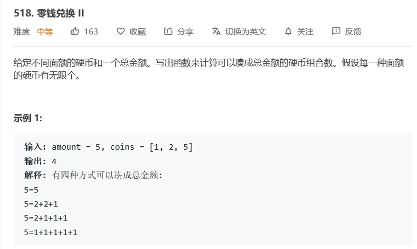

需要分别枚举每个硬币的方案数，否则可能会包含重复的情况。

```cpp
class Solution {
public:
    int change(int amount, vector<int>& coins) {
        vector<int> dp(amount+1);
        dp[0] = 1;
        for (int i = 0; i < coins.size(); ++i) {
            for (int j = coins[i]; j <= amount; ++j) {
                dp[j] += dp[j-coins[i]];
            }
        }
        return dp[amount];
    }
};
```


## 最长有效括号

[题目连接](https://leetcode-cn.com/problems/longest-valid-parentheses/)


**动态规划**

```cpp
class Solution {
public:
    int longestValidParentheses(string s) {
        int maxans = 0, n = s.length();
        vector<int> dp(n, 0);
        for (int i = 1; i < n; i++) {
            if (s[i] == ')') {
                if (s[i - 1] == '(') {
                    dp[i] = (i >= 2 ? dp[i - 2] : 0) + 2;
                } else if (i - dp[i - 1] > 0 && s[i - dp[i - 1] - 1] == '(') {
                    dp[i] = dp[i - 1] + ((i - dp[i - 1]) >= 2 ? dp[i - dp[i - 1] - 2] : 0) + 2;
                }
                maxans = max(maxans, dp[i]);
            }
        }
        return maxans;
    }
};
```

```cpp
class Solution {
public:
    int longestValidParentheses(string s) {
        if (s.empty()) return 0;
        int ans = 0;
        vector<int> dp(s.size());
        dp[0] = 0;
        for (int i = 1; i < s.size(); ++i) {
            int idx = i - dp[i-1] - 1;
            if (s[i] == '(' || idx < 0 || s[idx] != '(') dp[i] = 0;
            else dp[i] = idx-1 >= 0 ? dp[idx-1] + i-idx+1 : i-idx+1; 
            ans = max(ans, dp[i]);
        }
        return ans;
    }
};
```

**栈**

```cpp
class Solution {
public:
    int longestValidParentheses(string s) {
        stack<int> sta;
        sta.push(-1);
        int ans = 0;
        for (int i = 0; i < s.size(); ++i) {
            if (s[i] == '(') sta.push(i);
            else {
                sta.pop();
                if (sta.empty()) sta.push(i);
                else ans = max(ans, i - sta.top());
            }
        }
        return ans;
    }
};
```


## 统计全1子矩阵

[题目链接](https://leetcode-cn.com/problems/count-submatrices-with-all-ones/)


- 方法1：枚举矩阵的右下角，统计每个1最左连续的个数，然后枚举向上扩充的个数。
- 方法2：如果只有一行规律为$1+2+\cdots+n$，如果有多行只有上下都为1才对答案有贡献，所以取$\&$之后按照只有一行的情况求解。

```cpp
class Solution {
public:
    int numSubmat(vector<vector<int>>& mat) {
        // 枚举右下角
        int r = mat.size();
        int c = mat[0].size();
        vector<vector<int> > left(r, vector<int>(c, 0));
        for (int i = 0; i < r; ++i) {
            int cnt = 0;
            for (int j = 0; j < c; ++j) {
                if (mat[i][j] == 1) cnt++;
                else cnt = 0;
                left[i][j] = cnt;
            }
        }
        int ans = 0;
        for (int i = 0; i < r; ++i) {
            for (int j = 0; j < c; ++j) {
                if (!mat[i][j]) continue;
                int mi = 1000;
                for (int k = i; k >= 0; --k) {
                    mi = min(mi, left[k][j]);
                    ans += mi;
                }
            }
        }
        return ans;
    }
};
```

```cpp
class Solution {
public:
    int numSubmat(vector<vector<int>>& mat) {
        int r = mat.size();
        int c = mat[0].size();
        int ans = 0;
        for (int i = 0; i < r; ++i) {
            vector<int> tmp(c, 1);
            for (int j = i; j < r; ++j) {
                for (int k = 0; k < c; ++k) {
                    tmp[k] &= mat[j][k];
                }
                ans += getCnt(tmp, c);
            }
        }
        return ans;
    }
    
    int getCnt(vector<int>& tmp, int c) {
        int now = 0;
        int cnt = 0;
        for (int i = 0; i < c; ++i) {
            if (tmp[i] == 0) {
                cnt += now * (now+1) / 2;
                now = 0;
            }else {
                now++;
            }
        }
        cnt += now * (now+1) / 2;
        return cnt;
    }
};
```


## 队列的最大值

[题目链接](https://leetcode-cn.com/problems/dui-lie-de-zui-da-zhi-lcof/)

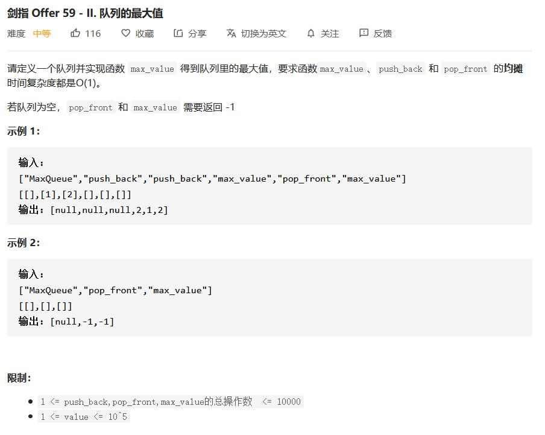

单调队列

```cpp
class MaxQueue {
private:
    deque<int> mque;
    queue<int> que;

public:
    MaxQueue() {
        mque.clear();
        while (!que.empty()) que.pop();
    }
    
    int max_value() {
        if (que.empty()) return -1;
        return mque.front();
    }
    
    void push_back(int value) {
        que.push(value);
        while (!mque.empty() && mque.back() < value) {
            mque.pop_back();
        }
        mque.push_back(value);
    }
    
    int pop_front() {
        if (que.empty()) return -1;
        int ret = que.front();
        que.pop();
        if (ret == mque.front()) mque.pop_front();
        return ret;
    }
};
```


## 地下城游戏

[题目链接](https://leetcode-cn.com/problems/dungeon-game/)

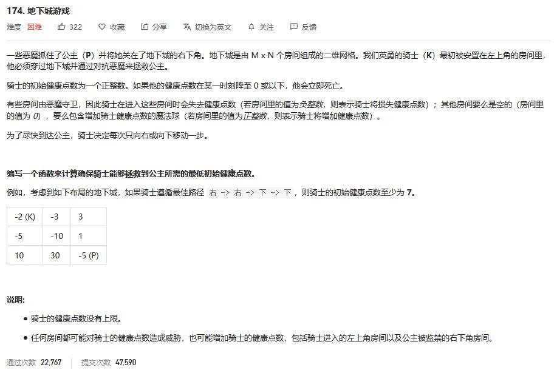

动态规划。

不能从左上角开始，因为这样只能得到当前点到起点的最小值，不满足动态规划的无后效性。


最好的办法是从右下角开始，这样就避免对后续结果的影响。


```cpp
class Solution {
public:
    int calculateMinimumHP(vector<vector<int>>& dungeon) {
        int r = dungeon.size(), c = dungeon[0].size();
        vector<vector<int>> dp(2, vector<int>(c+1, INT_MAX));
        dp[1][c-1] = max(1, 1 - dungeon[r-1][c-1]);
        int now = 0;
        for (int i= r-1; i >= 0; --i) {
            now ^= 1;
            for (int j = c-1; j >= 0; --j) {
                if (i == r-1 && j == c-1) continue;
                dp[now][j] = max(1, min(dp[now^1][j], dp[now][j+1]) - dungeon[i][j]);
            }
        }
        return dp[now][0];
    }
};
```


## 不同的二叉搜索树 

[题目链接](https://leetcode-cn.com/problems/unique-binary-search-trees/)


- 卡特兰树

  $C_n=\frac{C_{2n}^n}{n+1}$

  $C_0 = 1$，$C_{n+1}=\frac{2(2n+1)}{n+2}C_n$

- 动态规划

```cpp
class Solution {
public:
    int numTrees(int n) {
        long long ret = 1;
        for (int i = 0; i < n; ++i) {
            ret = ret * 2 * (2*i + 1) / (i + 2);
        }
        return ret;
    }
};
```


```cpp
class Solution {
public:
    int numTrees(int n) {
        if (n == 0) return 0;
        if (n == 1) return 1;
        vector<int> dp(n+1, 0);
        dp[0] = dp[1] = 1;
        for (int i = 2; i <= n; ++i) {
            for (int j = 0; j < i; ++j) {
                dp[i] += dp[j] * dp[i-1-j];
            }
        }
        
        return dp[n];
    }
};
```


## 三数之和

[题目链接](https://leetcode-cn.com/problems/3sum/)

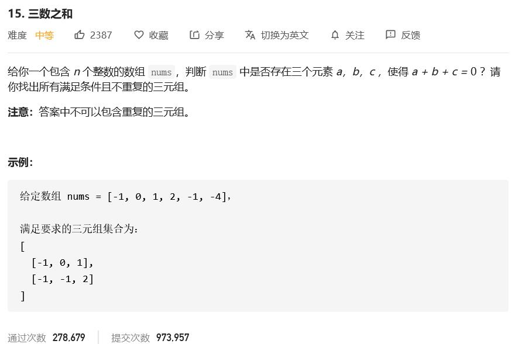

- 排序+哈希表+枚举

  2层循环，然后哈希找另一个数在不在。

  $O(n^2),O(n)$

- 排序+枚举

  首先排序，然后固定一个数，两个指针指向后面的头和尾，找剩下两个数。

  $O(n^2),O(1)$

```cpp
class Solution {
public:
    vector<vector<int>> threeSum(vector<int>& nums) {
        vector<vector<int>> ans;
        if (nums.empty()) return ans;
        sort(nums.begin(), nums.end());

        unordered_map<int, int> mp;
        for (int &it : nums) {
            mp[it]++;
        }
        for (int i = 0; i < nums.size(); ++i) {
            if (i > 0 && nums[i] == nums[i-1]) continue;
            for (int j = i+1; j < nums.size(); ++j) {
                int d = -nums[i] - nums[j];
                if (d < nums[j]) continue;
                if (mp.find(d) == mp.end()) continue;
                if (nums[i] == nums[j] && nums[i] == d && mp[d] < 3) continue;
                if (nums[j] == d && mp[d] < 2) continue;
                if (!ans.empty() && ans.back()[0] == nums[i] &&
                         ans.back()[1] == nums[j] && 
                         ans.back()[2] == d) continue;
                ans.push_back({nums[i], nums[j], d});  
            }
        }
        return ans;
    }
};
```

```cpp
class Solution {
public:
    vector<vector<int>> threeSum(vector<int>& nums) {
        vector<vector<int>> ans;
        sort(nums.begin(), nums.end());
        for (int i = 0; i < nums.size(); ++i) {
            if (i && nums[i] == nums[i-1]) continue;
            int l = i+1, r = nums.size() - 1;
            int d = -nums[i];
            while (l < r) {
                int sum = nums[l] + nums[r];
                if (sum == d) {
                    ans.push_back({nums[i], nums[l], nums[r]});
                    ++l; --r;
                    while (l <= r) {
                        if (nums[l] == nums[l-1]) ++l;
                        else if (nums[r] == nums[r+1]) --r;
                        else break;
                    }
                } else if (sum > d) --r;
                else ++l;
            }
        }
        return ans;
    }
};
```


## N皇后问题

在枚举每一行放的列数时：

- 放过的列不能再放一次
- 不能和已经放的列在一个直线上
  - 撇：**i+j** 是定值
  - 捺：**i-j** 是定值

另外一种神仙做法是**位运算**

撇、捺、列都用一个数字表示，其中的二进制就代表对应的位置上放上皇后。

- 首先获取所有可以放的状态(数字)，通过撇、捺、列进行位运算得到。
- 然后在可放的状态中，每次枚举二进制的1，继续递归，看是否可行。
- 列更新位置的时候，就是直接与上新数，撇和捺在与运算之后，还有对应左移和右移维护斜着的方向的状态。

```cpp
void dfs(row, col, pie, na) {
    if (row >= N) {
        count++; return;
    }
    // 获取可以放的状态
    bits = (~(pie|na|col)) & ((1 << N) - 1);
	// 枚举每一个个状态
    while(bits > 0) {
        p = bits & -bits;
        dfs(row+1, col|p, (pie|p)<<1, (na|p)>>1);
        bits &= bits - 1;
    }
}
```


**输出方案数**

[题目链接](https://leetcode-cn.com/problems/n-queens-ii/)

```cpp
class Solution {
private:
    vector<bool> c, pie, na;
public:
    int totalNQueens(int n) {
        c.resize(n, 0);
        pie.resize(n+n, 0);
        na.resize(n+n, 0);
        
        int cnt = 0;
        dfs(0, n, cnt);
        return cnt;
    }
    
    void dfs(int i, int n, int &cnt) {
        if (i == n) {
            ++cnt;
            return;
        }
        
        for (int j = 0; j < n; ++j) {
            if (c[j] || pie[i+j] || na[j-i+n]) continue;
            c[j] = pie[i+j] = na[j-i+n] = true;
            dfs(i+1, n, cnt);
            c[j] = pie[i+j] = na[j-i+n] = false;
        }
    }
};
```

```cpp
class Solution {
public:
    int totalNQueens(int n) {
        int c = 0, pie = 0, na = 0;
        int cnt = 0;
        dfs(0, n, c, pie, na, cnt);
        return cnt;
    }

    void dfs(int r, int n, int c, int pie, int na, int &cnt) {
        if (r == n) {
            cnt++;
            return;
        }
        int bits = (~(pie|na|c)) & ((1<<n) - 1);
        while (bits > 0) {
            int p = bits & -bits;
            dfs(r+1, n, c|p, (pie|p)<<1, (na|p)>>1, cnt);
            bits &= bits - 1;
        }
    }
};
```

**输出方案**

[题目链接](https://leetcode-cn.com/problems/n-queens/)

```cpp
class Solution {
private:
    vector<bool> c, pie, na;
public:
    vector<vector<string>> solveNQueens(int n) {
        c.resize(n, 0);
        pie.resize(n+n, 0);
        na.resize(n+n, 0);
        vector<string> mp(n, string(n, '.'));
        vector<vector<string>> ret;
        dfs(0, n, mp, ret);
        return ret;
    }

        
    void dfs(int i, int n, vector<string> &mp, vector<vector<string>> &ret) {
        if (i == n) {
            ret.push_back(mp);
            return;
        }
        
        for (int j = 0; j < n; ++j) {
            if (c[j] || pie[i+j] || na[j-i+n]) continue;
            c[j] = pie[i+j] = na[j-i+n] = true;
            mp[i][j] = 'Q';
            dfs(i+1, n, mp, ret);
            mp[i][j] = '.';
            c[j] = pie[i+j] = na[j-i+n] = false;
        }
    }
};
```


## 数独

[题目链接](https://leetcode-cn.com/problems/sudoku-solver/)

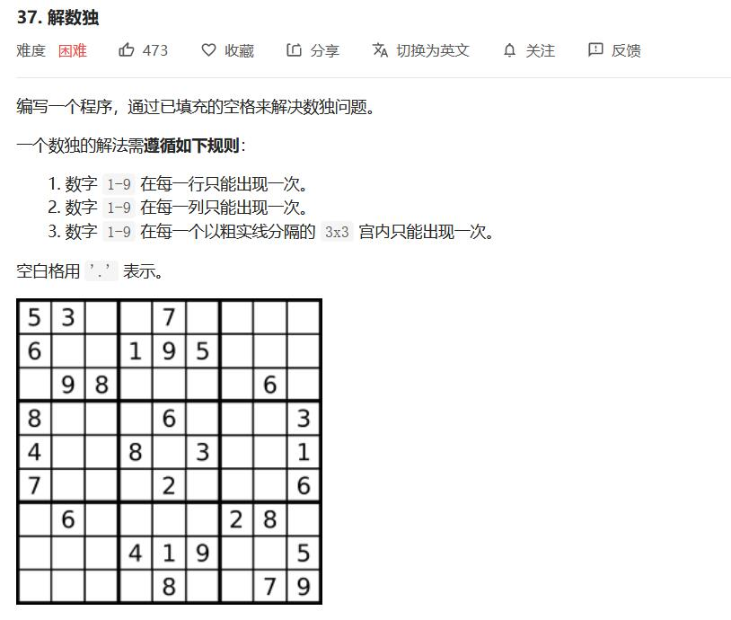

搜索剪枝

```
class Solution {
public:

    void solveSudoku(vector<vector<char>>& board) {
        dfs(0, 0, board);
    }

    bool dfs(int i, int j, vector<vector<char>>& board) {
        if (j == 9) return dfs(i+1, 0, board);
        if (i == 9) return true;
        if (board[i][j] != '.') return dfs(i, j+1, board);
        for (char k = '1'; k <= '9'; ++k) {
            if (!isValid(board, i, j, k)) continue;
            board[i][j] = k;
            if (dfs(i, j+1, board)) return true;
            board[i][j] = '.';
        }
        return false;
    }

    bool isValid(vector<vector<char>>& board, int r ,int c, char k) {
        for (int i = 0; i < 9; ++i) {
            if (board[r][i] == k) return false;
            if (board[i][c] == k) return false;
            int x = r/3*3+ i/3;
            int y = c/3*3 + i%3;
            if (board[x][y] == k) return false; 
        }
        return true;
    }
};
```


## 最长公共子序列

[题目链接](https://leetcode-cn.com/problems/longest-common-subsequence/)

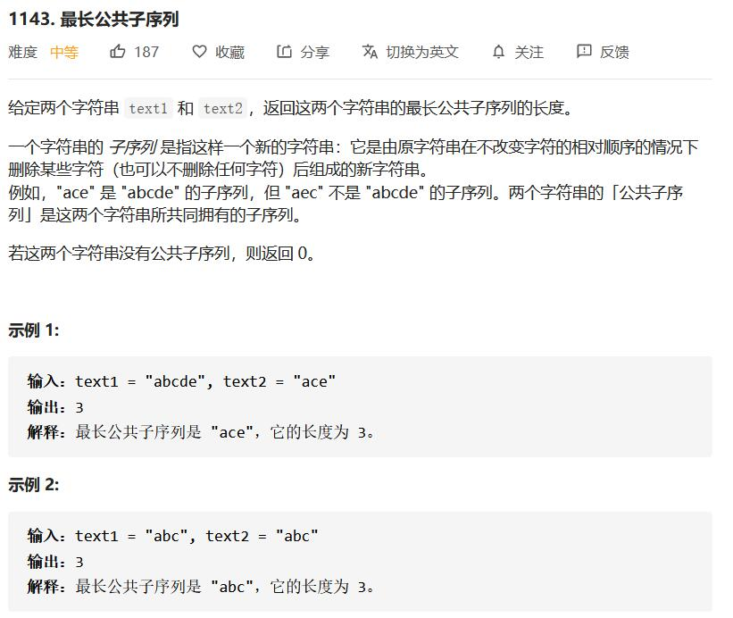

动态规划。

```c
class Solution {
public:
    int longestCommonSubsequence(string text1, string text2) {
        int n1 = text1.size();
        int n2 = text2.size();
        vector<vector<int>> dp(n1+1, vector<int> (n2+1, 0));
        for (int i = 1; i <= n1; ++i) {
            for (int j = 1; j <= n2; ++j) {
                if (text1[i-1] == text2[j-1]) {
                    dp[i][j] = dp[i-1][j-1] + 1;
                }else {
                    dp[i][j] = max(dp[i-1][j], dp[i][j-1]);
                }
            }
        }
        return dp[n1][n2];
    }
};
```


## 乘积最大子数组

[题目链接](https://leetcode-cn.com/problems/maximum-product-subarray/)

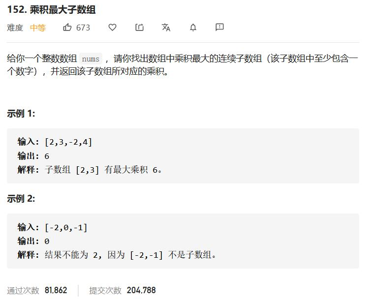

因为数字有正负，所以要分别记录最大和最小值。

dp[i]\[0]表示以i结尾的最小值，dp[i]\[1]表示以i结尾的最大值。

```c
class Solution {
public:
    int maxProduct(vector<int>& nums) {
        if (nums.empty()) return 0;
        int n = nums.size();
        vector<vector<int>> dp(n, vector<int>(2, 0));
        dp[0][0] = dp[0][1] = nums[0];
        // 0:min 1:max
        int ret = dp[0][1];
        for (int i = 1; i < n; ++i) {
            dp[i][0] = min(nums[i], dp[i-1][nums[i] < 0] * nums[i]);
            dp[i][1] = max(nums[i], dp[i-1][nums[i] >= 0] * nums[i]);
            ret = max(ret, dp[i][1]);
        }
        return ret;
    }
};
```


```c
class Solution {
public:
    int maxProduct(vector<int>& nums) {
        if (nums.empty()) return 0;
        int n = nums.size();
        int mx = 1, mi = 1, ret = INT_MIN;
        for (int it : nums) {
            if (it < 0) swap(mx, mi);
            mx = max(it, mx*it);
            mi = min(it, mi*it);
            ret = max(ret, mx);
        }
        return ret;
    }
};
```


## 剪绳子

[题目链接](https://www.nowcoder.com/practice/57d85990ba5b440ab888fc72b0751bf8?tpId=13&rp=1&ru=%2Fta%2Fcoding-interviews&qru=%2Fta%2Fcoding-interviews%2Fquestion-ranking)

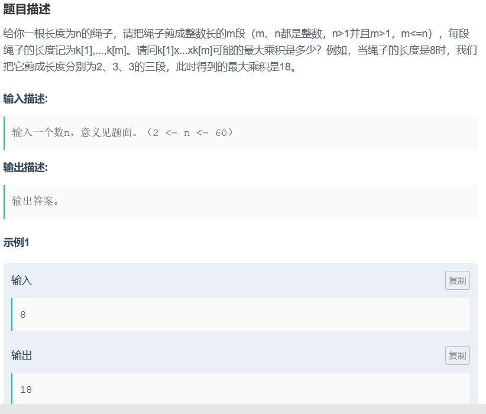

- 记忆化搜索
- 动态规划

对于当前长度N的绳子来说，我需要求$max(i\times f[N-i])$即可。

```c
class Solution {
public:
    int cutRope(int number) {
        if (number == 2) return 1;
        if (number == 3) return 2;
        vector<int> dp(number+1, -1);
        return dfs(number, dp);
    }
     
    int dfs(int number, vector<int> &dp) {
        if (number <= 4) return number;
        if (dp[number] != -1) return dp[number];
        int mx = -1;
        for (int i = 1; i <= number/2; ++i) {
            mx = max(i * dfs(number-i, dp), mx);
        }
        dp[number] = mx;
        return mx;
    }
};
```


```c
class Solution {
public:
    int cutRope(int number) {
        if (number == 2) return 1;
        if (number == 3) return 2;
        vector<int> dp(number+1, 0);
        dp[1] = 1; dp[2] = 2; dp[3] = 3; dp[4] = 4;
        for (int i = 5; i <= number; ++i) {
            for (int j = 1; j <= i/2; ++j) {
                dp[i] = max(dp[i], dp[j]*dp[i-j]);
            }         
        }
        return dp[number];        
    }
    
};
```


## 数据流中的中位数

[题目链接](https://www.nowcoder.com/practice/9be0172896bd43948f8a32fb954e1be1?tpId=13&tags=&title=&diffculty=0&judgeStatus=0&rp=1&ru=%2Fta%2Fcoding-interviews&qru=%2Fta%2Fcoding-interviews%2Fquestion-ranking)

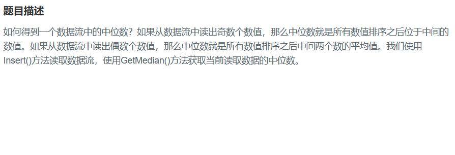

- 每次查询排序，插入$O(1)$，查询$O(nlogn)$
- 插入排序，插入$O(n)$，查询$O(1)$
- 维护左右两个堆，插入$O(logn)$，查询$O(1)$

```c
class Solution {
public:
 
    vector<int> arr;
    int len = 0;
    void Insert(int num)
    {
        len++;
        arr.push_back(num);   
    }
 
    double GetMedian()
    {
        sort(arr.begin(), arr.end());
        double tmp = arr[len/2];
        if (len % 2 == 0) tmp = (tmp + arr[len/2-1]) / 2;
        return tmp;
    }
 
};
```


```c
class Solution {
public:
 
    vector<int> arr;
    void Insert(int num)
    {
        if (arr.empty()) arr.push_back(num);
        else {
            auto it = lower_bound(arr.begin(), arr.end(), num);
            arr.insert(it, num);
        }
    }
 
    double GetMedian()
    {
        int len = arr.size();
        if (len & 1) return arr[len/2];
        else return (arr[len/2] + arr[len/2-1]) / 2.0;
    }
 
};
```


```c
class Solution {
public:

    priority_queue<int> l_que;
    priority_queue<int, vector<int>, greater<int> >r_que;
    void Insert(int num)
    {
        // 维护队列值，左小右大
        l_que.push(num);
        r_que.push(l_que.top());
        l_que.pop();
        
        // 维护队列左右长度相差1
        if (l_que.size() < r_que.size()-1) {
            l_que.push(r_que.top());
            r_que.pop();
        }
    }

    double GetMedian()
    { 
        if (l_que.size() != r_que.size()) return r_que.top();
        else return (l_que.top() + r_que.top()) / 2.0;
    }

};
```


## 不用加减乘除做加法

[题目链接](https://www.nowcoder.com/practice/59ac416b4b944300b617d4f7f111b215?tpId=13&tags=&title=&diffculty=0&judgeStatus=0&rp=1&ru=/ta/coding-interviews&qru=/ta/coding-interviews/question-ranking)


数字在计算机是以补码形式存在，补码可以将减法当作加法做。

使用^可以得到两个数没有进位的加法结果，使用&可以的到哪些位存在进位。

循环加，知道进位为0。

```c
class Solution {
public:
    int Add(int num1, int num2)
    {
        while (num2) {
            int t = num1 ^ num2; // 没有进位的加法
            num2 = (num1 & num2) << 1; // 获得进位
            num1 = t;
        }
        return num1;
    }
};
```

```c
// 从低位模拟每一位的加法
class Solution {
public:
    int Add(int num1, int num2)
    {
        long long t = 1;
        int sum = 0;
        int ret = 0;
        while (t <= (1ll << 31)) {
            int l = (num1 & t) ? 1 : 0;
            int r = (num2 & t) ? 1 : 0;
            if (!sum) {
                if (l && r) sum = 1;
                else if (l || r) ret |= t;
            }elsce {
                if (l && r) ret |= t;
                else if (!l && !r) ret |= t, sum = 0;
            }
            t <<= 1;
        }
        return ret;
    }
};
```


## 圆圈中最后剩下的数字

[题目链接](https://www.nowcoder.com/practice/f78a359491e64a50bce2d89cff857eb6?tpId=13&tags=&title=&diffculty=0&judgeStatus=0&rp=1&ru=/ta/coding-interviews&qru=/ta/coding-interviews/question-ranking)

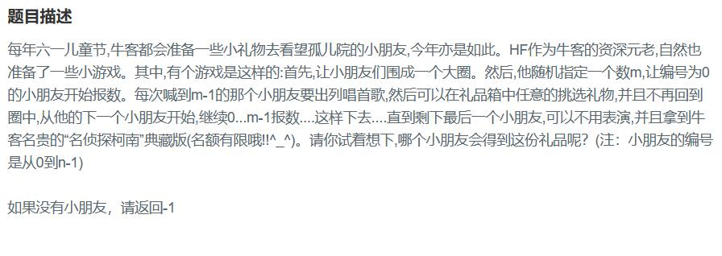

- 链表模拟

- 递归求解 $f(n) = (f(n-1,m)+m) \% n)$

  可以这样理解，如果知道$f(n-1，m)$的结果，因为n-1是在n的基础上删除了$m\%n$之后求得的编号，所以要加上偏移位置。

```c
class Solution {
public:
    int LastRemaining_Solution(int n, int m)
    {
        if (n == 0) return -1;
        vector<int> all(n);
        for (int i = 0; i < n; ++i) all[i] = i;
        int now = 0;
        while (n != 1) {
            for (int i = 0; i < m-1; ++i) now = (now + 1) % n;
            all.erase(all.begin()+now, all.begin()+now+1);
            n--;
        }
        return all[0];
    }
};


class Solution {
public:
    int LastRemaining_Solution(int n, int m)
    {
        if (n <= 0) return -1;
        list<int> lt;
        for (int i = 0; i < n; ++i) lt.push_back(i);
        int now = 0;
        while (n > 1) {
            now = (now + m-1) % n;
            auto it = lt.begin();
            advance(it, now);
            lt.erase(it);
            --n;
        }        
        return lt.back();
    }
};
```

```c
class Solution {
public:
    int LastRemaining_Solution(int n, int m)
    {
        if (n <= 0) return -1;
        return dfs(n, m);
    }
    int dfs(int n, int m) {
        if (n == 1) return 0;
        int x = dfs(n-1, m);
        return (x + m) % n;
    }
};
```


## 数组中只出现一次的数字

[题目链接](https://www.nowcoder.com/practice/e02fdb54d7524710a7d664d082bb7811?tpId=13&tags=&title=&diffculty=0&judgeStatus=0&rp=1&ru=/ta/coding-interviews&qru=/ta/coding-interviews/question-ranking)


- 哈希表

- 异或

  只有两个数出现一次，其他都是两次，最终异或的结果就是出现一次的数字，异或的结果中，二进制为1的，一定是0^1的结果，所以可以获取结果中的一个二进制位，然后对所有的数字判断是否在这个位置上为1，再次进行异或。

```c
class Solution {
public:
    void FindNumsAppearOnce(vector<int> data,int* num1,int *num2) {
        unordered_map<int,int> mp;
        for (int it : data) {
            mp[it]++;
        }
        int cnt = 1;
        for (auto it : mp) {
            if (it.second > 1) continue;
            if (cnt--) *num1 = it.first;
            else  *num2 = it.first;
        }
    }
};
```


```c
class Solution {
public:
    void FindNumsAppearOnce(vector<int> data,int* num1,int *num2) {
        int ret = 0;
        for (int it : data) ret ^= it;
        ret &= (-ret); // 获得低位1
        *num1 = *num2 = 0;
        for (int it : data) {
            if (it & ret) *num1 ^= it;
            else *num2 ^= it;
        }
    }
};
```


## 链表中公共节点

[题目链接](https://www.nowcoder.com/practice/6ab1d9a29e88450685099d45c9e31e46?tpId=13&tags=&title=&diffculty=0&judgeStatus=0&rp=1&ru=/ta/coding-interviews&qru=/ta/coding-interviews/question-ranking)

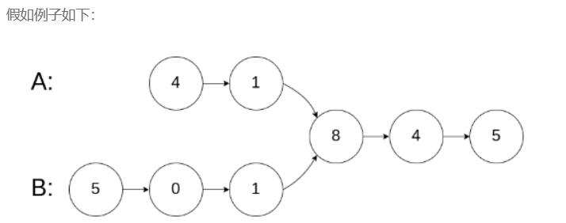

- 哈希表

- 双指针

  双指针同时前进，当走到尽头换到另一个链表，这样可以把长的部分删除。


```c
/*
struct ListNode {
	int val;
	struct ListNode *next;
	ListNode(int x) :
			val(x), next(NULL) {
	}
};*/
class Solution {
public:
    ListNode* FindFirstCommonNode( ListNode* pHead1, ListNode* pHead2) {
        unordered_set<ListNode*> st;
        while (pHead1) {
            st.insert(pHead1);
            pHead1 = pHead1->next;
        }
        while (pHead2) {
            if (st.count(pHead2)) {
                return pHead2;
            }
            pHead2 = pHead2->next;
        }
        return NULL;        
    }
};
```

```c
class Solution {
public:
    ListNode* FindFirstCommonNode( ListNode* pHead1, ListNode* pHead2) {
       ListNode* ta = pHead1;
       ListNode* tb = pHead2;
       while (ta != tb) {
           ta = ta ? ta->next : pHead2;
           tb = tb ? tb->next : pHead1;
       }
       return ta;
    }
};
```


## 二叉树转双向链表

```cpp
/*
// Definition for a Node.
class Node {
public:
    int val;
    Node* left;
    Node* right;

    Node() {}

    Node(int _val) {
        val = _val;
        left = NULL;
        right = NULL;
    }

    Node(int _val, Node* _left, Node* _right) {
        val = _val;
        left = _left;
        right = _right;
    }
};
*/
class Solution {
public:
    Node* pre;
    Node* first;
    Node* treeToDoublyList(Node* root) {
        first = pre = NULL;
        postOrder(root);
        if (first) {
            pre->right = first;
            first->left = pre;
        }
        return first;
    }
    
    void postOrder(Node* rt) {
        if (!rt) return;
        postOrder(rt->left);
        if (!first) {
            first = rt;
        }else {
            pre->right = rt;
            rt->left = pre;
        }
        pre = rt;
        postOrder(rt->right);
    }
};
```


## 旋转数组的最小值

[题目链接](https://leetcode-cn.com/problems/xuan-zhuan-shu-zu-de-zui-xiao-shu-zi-lcof/)


二分

没有明确的target，可以和右端点进行对比。

不能把左端点当做target：

情况1 ：1 2 3 4 5 ， arr[mid] = 3. target = 1, arr[mid] > target, 答案在mid 的左侧
情况2 ：3 4 5 1 2 ， arr[mid] = 5, target = 3, arr[mid] > target, 答案却在mid 的右侧

```c
class Solution {
public:
    int minArray(vector<int>& nums) {
        int l = 0, r = nums.size() - 1;
        while (l < r) {
            int mid = (l + r) >> 1;
            if (nums[mid] > nums[r]) {
                l = mid + 1;
            }else if (nums[mid] < nums[r]) {
                r = mid; // 3 1 3
            }else {
                r--;
            }
        }
        return nums[l];
    }
};
```


## 二叉搜索树的后续遍历序列

[题目链接](https://leetcode-cn.com/problems/er-cha-sou-suo-shu-de-hou-xu-bian-li-xu-lie-lcof/)

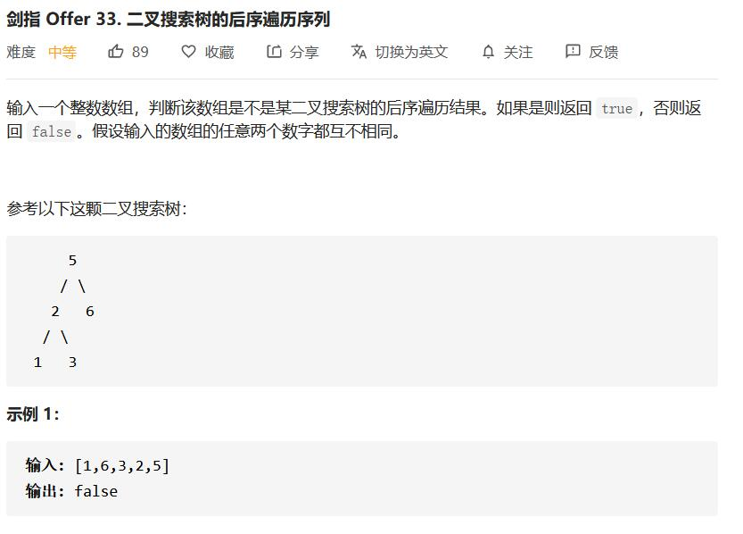

根据性质找到左右的分界点，判断是否满足左小右大。然后递归检查。

```c
class Solution {
public:
    bool verifyPostorder(vector<int>& sequence) {
        return check(0, sequence.size()-1, sequence);
    }

    bool check(int l, int r, vector<int> &arr) {
        if (l >= r) return true;
        int i;
        for (i = r; i >= l; --i) { // 左右分界点
            if (arr[i] < arr[r]) break;
        }

        if (low(l, i, arr[r], arr)) return false;
        
        return check(l,i, arr) && check(i+1, r-1, arr);
    }
    
    bool low(int l, int r, int x, vector<int> &arr) {
        for (int i = l; i <= r; ++i) {
            if (arr[i] > x) return true;
        }
        return false;
    }
};
```


## 重建二叉树

[题目链接](https://leetcode-cn.com/problems/zhong-jian-er-cha-shu-lcof/)

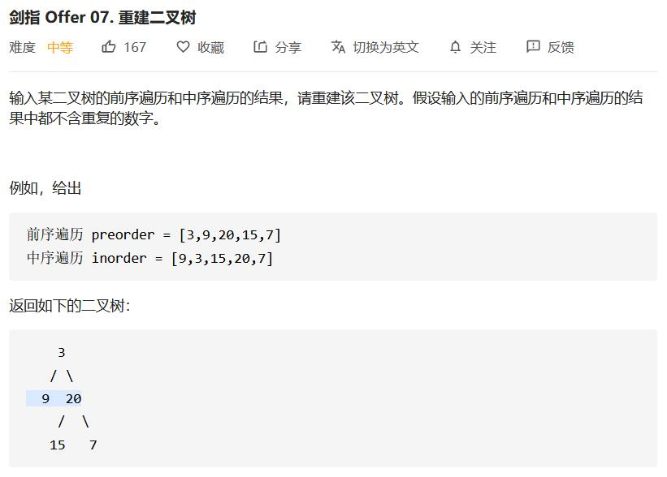


```c
/**
 * Definition for a binary tree node.
 * struct TreeNode {
 *     int val;
 *     TreeNode *left;
 *     TreeNode *right;
 *     TreeNode(int x) : val(x), left(NULL), right(NULL) {}
 * };
 */
class Solution {
public:
    unordered_map<int,int> mp;
    TreeNode* buildTree(vector<int>& pre, vector<int>& vin) {
        for (int i = 0; i < vin.size(); ++i) {
            mp[vin[i]] = i;
        }
        return build(pre, 0, pre.size()-1, vin, 0, vin.size()-1);
    }
    TreeNode* build(vector<int> &pre, int pl, int pr, vector<int> &vin, int vl, int vr) {
        if (pl > pr) return NULL;
        TreeNode *rt = new TreeNode(pre[pl]);
        if (pl == pr) return rt;
        int mid = mp[pre[pl]];
        int l = mid - vl;
        rt->left = build(pre, pl+1, pl+l, vin, vl, mid-1);
        rt->right = build(pre, pl+l+1, pr, vin, mid+1, vr);
        return rt;
    }
};
```


## 数组中的逆序数

[题目链接](https://leetcode-cn.com/problems/shu-zu-zhong-de-ni-xu-dui-lcof/)

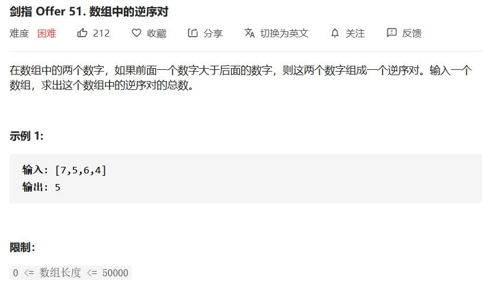

- 树状数组

- 合并排序

  在合并数组的时候计算逆序数

```c
class Solution {
public:
    vector<int> c, arr;
    int len;
    int reversePairs(vector<int> data) {
        vector<int> arr(data.begin(), data.end());
        sort(arr.begin(), arr.end());
        arr.erase(unique(arr.begin(), arr.end()), arr.end());
        auto find = [&](int x) {
            return lower_bound(arr.begin(), arr.end(), x) - arr.begin() + 1;
        };
        len = arr.size();
        c.resize(len+1, 0);
        
        int ret = 0;
        for (int it : data) {
            int num = find(it);
            ret += get(len) - get(num);
            insert(num);
        }
        return ret;
    }
    int lowbit(int x) {
        return x & (-x);
    }
    int get(int x) {
        int sum = 0;
        while (x > 0) {
            sum += c[x];
            x -= lowbit(x);
        }
        return sum;
    }
    
    void insert(int x) {
        while (x <= len) {
            c[x]++;
            x += lowbit(x);
        }
    }
};
```

```c
class Solution {
public:
    vector<int> arr;
    int ret;
    int reversePairs(vector<int> data) {
        arr.resize(data.size());
        ret = 0;
        mergeSort(0, data.size()-1, data);
        return ret;
    }
    
    void mergeSort(int l, int r, vector<int> &data) {
        if (l >= r) return;
        int mid = (l + r) >> 1;
        mergeSort(l, mid, data);
        mergeSort(mid+1, r, data);
        merge(l, mid, r, data);
    }

    void merge(int l, int mid, int r, vector<int> &data) {
        int i = l, j = mid+1;
        int now = 0;
        while (i <= mid && j <= r) {
            if (data[i] > data[j]) {
                arr[now++] = data[j++];
                ret += mid-i+1;
            }else {
                arr[now++] = data[i++];
            }
        }
        while (i <= mid) arr[now++] = data[i++];
        while (j <= r) arr[now++] = data[j++];
        now = 0;
        for (int i = l; i <= r; ++i) {
            data[i] = arr[now++];
        }
    }
};
```


## 数组排成最小的数

[题目链接](https://leetcode-cn.com/problems/ba-shu-zu-pai-cheng-zui-xiao-de-shu-lcof/)


自定义排序

```c
class Solution {
public:
    string minNumber(vector<int> nums) {
        vector<string> arr;
        for (int it : nums) {
            arr.push_back(to_string(it));
        }
        sort(arr.begin(), arr.end(), [](string &x, string &y){
            return x+y < y+x;
        });
        string ret;
        for (int it : arr) {
            ret += it;
        }
        return ret;
    }
};
```


## 正则表达式

[题目链接](https://leetcode-cn.com/problems/zheng-ze-biao-da-shi-pi-pei-lcof/)


动态规划，详细解题思路[参考这里](https://leetcode-cn.com/problems/zheng-ze-biao-da-shi-pi-pei-lcof/solution/zhu-xing-xiang-xi-jiang-jie-you-qian-ru-shen-by-je/)

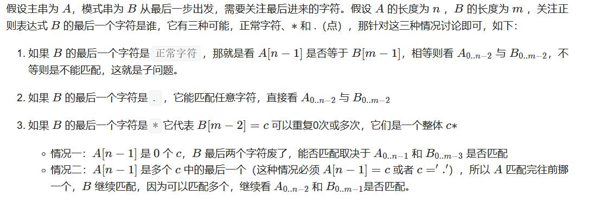


```c
class Solution {
public:
    bool isMatch(string s, string p) {
        int n = s.size();
        int m = p.size();
        vector<vector<char>> dp(n+1, vector<char>(m+1, 0));
        for (int i = 0; i <= n; ++i) {
            for (int j = 0; j <= m; ++j) {
                if (j == 0) { // 空正则
                    dp[i][j] = i == 0;
                }else { // 非空正则
                    if (p[j-1] == '*') { // *
                        // 不用* 
                        if (j > 1) dp[i][j] |= dp[i][j-2];
                        // 用*
                        if (i > 0 && j > 1 && (s[i-1] == p[j-2] || p[j-2] == '.'))
                            dp[i][j] |= dp[i-1][j];
                    }else { // 非*
                        if (i && (s[i-1] == p[j-1] || p[j-1] == '.')) 
                            dp[i][j] |= dp[i-1][j-1];
                    }
                }
               // cout << (int)dp[i][j] << " ";
            }
            // cout << endl;
        }

        return dp[n][m];
    }
};
```


## 计算二进制子串

[题目链接](https://leetcode-cn.com/problems/count-binary-substrings/)

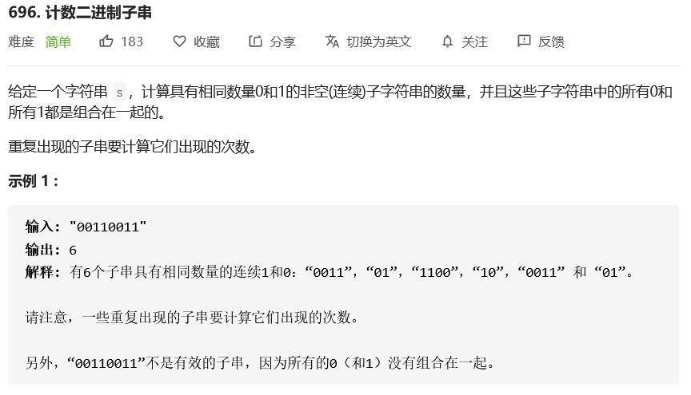

首先计算连续的0和1的个数，然后相邻的数字取min即可。


```c
class Solution {
public:
    int countBinarySubstrings(string s) {
        vector<int> cnt;
        int pre = 0, cur = 0, ret = 0;
        char c = s[0];
        for (int i = 0; i < s.size(); ++i) {
            if (s[i] == c) ++cur;
            else {
                pre = cur;
                c = s[i];
                cur = 1;
            }
            if (pre >= cur) ret++;
        }
        return ret;
    }
};
```


## 数字序列中某一位的数字

[题目链接](https://leetcode-cn.com/problems/shu-zi-xu-lie-zhong-mou-yi-wei-de-shu-zi-lcof/)


- 确定n所在数字的位数 ，记为 digit
- 确定 n 所在的 数字 ，记为 num
- 确定 n 是 num 中的哪一数位，并返回结果。


```c
class Solution {
public:
    int findNthDigit(int n) {
        int digit = 1;
        long long start = 1, num = 9;
        while (n > num) {
            n -= num;
            start *= 10;
            digit++;
            num = digit * start * 9;
        }

        int m = start + (n - 1) / digit;
        string s = to_string(m);
        return s[(n - 1) % digit] - '0';
    }
};
```


## 字符串相乘

[题目链接](https://leetcode-cn.com/problems/multiply-strings/)


- 记录乘法结果中每一位权上的数字，最后在统一处理
- 可以定义一个字符串相加的函数，把乘法转换为加法

```c
class Solution {
public:
    string multiply(string num1, string num2) {
        if (num1 == "0" || num2 == "0") return "0";

        vector<int> a, b, c(num1.size()+num2.size()-1, 0);
        for (int i = num1.size()-1; i >= 0; --i) {
            a.push_back(num1[i] - '0');
        }
        for (int i = num2.size()-1; i >= 0; --i) {
            b.push_back(num2[i] - '0');
        }

        for (int i = 0; i < num1.size(); ++i) {
            for (int j = 0; j < num2.size(); ++j) {
                c[i+j] += a[i] * b[j];
            }
        }
        string ret;
        int k = 0;
        for (int i = 0; i < c.size(); ++i) {
            c[i] += k;
            char ch = (c[i] % 10) + '0';
            ret += ch;
            k = c[i] / 10;
        }
        while (k) {
            char ch = k % 10 + '0';
            k /= 10;
            ret += ch; 
        }c
        reverse(ret.begin(), ret.end());
        return ret;
    }

};
```

```c
class Solution {
public:
    string multiply(string num1, string num2) {
        if (num1 == "0" || num2 == "0") return "0";
        string ret = "0";

        for (int i = num2.size()-1; i >= 0; --i) {
            int num = num2[i] - '0';
            string tmp = num1;
            while (num) {
                if (num & 1) ret = add(ret, tmp);
                num >>= 1;
                tmp = add(tmp, tmp);
            }
            num1 += '0';
        }
        return ret;
    }

    string add(string s, string t) {
        reverse(s.begin(), s.end());
        reverse(t.begin(), t.end());
        int i = 0, j = 0, tmp = 0;
        string ret;

        while (i < s.size() && j < t.size()) {
            int sum = s[i++] + t[j++] - '0'*2;
            sum += tmp;
            tmp = sum / 10;
            sum %= 10;
            ret += sum + '0';
        }
        while (i < s.size()) {
            int sum = s[i++] - '0';
            sum += tmp;
            tmp = sum / 10;
            sum %= 10;
            ret += sum + '0';
        }
        while (j < t.size()) {
            int sum = t[j++] - '0';
            sum += tmp;
            tmp = sum / 10;
            sum %= 10;
            ret += sum + '0';
        }
        if (tmp != 0) ret += tmp + '0';
        reverse(ret.begin(), ret.end());
        //cout << s << " " << t << " " << ret << endl;

        return ret;
    }
};
```


## 两个链表的第一个公共节点

[题目链接](https://leetcode-cn.com/problems/liang-ge-lian-biao-de-di-yi-ge-gong-gong-jie-dian-lcof/)


双指针，当一个指针走到末尾就跳到另一个指针起始位置，这样可以将两个链表对齐。

```c
class Solution {
public:
    ListNode *getIntersectionNode(ListNode *headA, ListNode *headB) {
        ListNode* p1 = headA;
        ListNode* p2 = headB;

        while (p1 != p2) {
            p1 = p1 ? p1->next : headB;
            p2 = p2 ? p2->next : headA;
        }

        return p1;
    }
};
```


## 接雨水

[题目链接](https://leetcode-cn.com/problems/trapping-rain-water/)


- 贪心

  每个柱子的积水，等于左右最高柱子的最小值减去当前的高度

- 栈模拟

  栈中存放柱子的下标，整体高度递减的，如果遇到一个高的柱子，求出左面与他形成的积水。

- 双指针

  如果左面的柱子高，求右边柱子的积水，反之亦然。

```c
class Solution {
public:
    int trap(vector<int>& height) {
        vector<int> L(height.begin(), height.end());
        vector<int> R(height.begin(), height.end());
        for (int i = 1; i < height.size(); ++i) {
            L[i] = max(L[i], L[i-1]);
        }
        for (int i = height.size()-2; i >= 0; --i) {
            R[i] = max(R[i], R[i+1]);
        }
        int ret = 0;
        for (int i = 0; i < height.size(); ++i) {
            ret += min(L[i], R[i]) - height[i];
        }
        return ret;
    }
};
```


```c
class Solution {
public:
    int trap(vector<int>& height) {
        stack<int> sta;
        int ret = 0;
        for (int i = 0; i < height.size(); ++i) {
            while (!sta.empty() && height[sta.top()] < height[i]) {
                int t = sta.top();
                sta.pop();
                if (sta.empty()) break;
                int mi = min(height[sta.top()], height[i]);
                int dis = i - sta.top() - 1;
                ret +=  (mi - height[t]) * dis;
            }
            sta.push(i);
        }
        return ret;
    }
};
```

```c
class Solution {
public:
    int trap(vector<int>& height) {
        if (height.empty()) return 0;
        int i = 0, j = height.size()-1;
        int ml = height[i], mr = height[j];
        int ret = 0;
        while (i < j) {
            if (height[i] < height[j]) {
                if (height[i] > ml) ml = height[i];
                else ret += ml - height[i];
                ++i;
            }else {
                if (height[j] > mr) mr = height[j];
                else ret += mr - height[j];
                --j;
            }
        }
        return ret;
    }
};
```


## 编辑距离

[题目链接](https://leetcode-cn.com/problems/edit-distance/)


```c
class Solution {
public:
    int minDistance(string word1, string word2) {
        int n = word1.size();
        int m = word2.size();
        if (word1.empty() || word2.empty()) return max(m, n);
        vector<vector<int>> dp(n+1, vector<int>(m+1, 0));
        for (int i = 0; i <= m; ++i) dp[0][i] = i;
        for (int i = 0; i <= n; ++i) dp[i][0] = i;
        for (int i = 1; i <= n; ++i) {
            for (int j = 1; j <= m; ++j) {
                if (word1[i-1] == word2[j-1]) dp[i][j] = dp[i-1][j-1];
                else dp[i][j] = min({dp[i-1][j-1], dp[i-1][j], dp[i][j-1]}) + 1;
            }
        }
        return dp[n][m];
    }
};
```


## 累加数

[题目链接](https://leetcode-cn.com/problems/additive-number/)

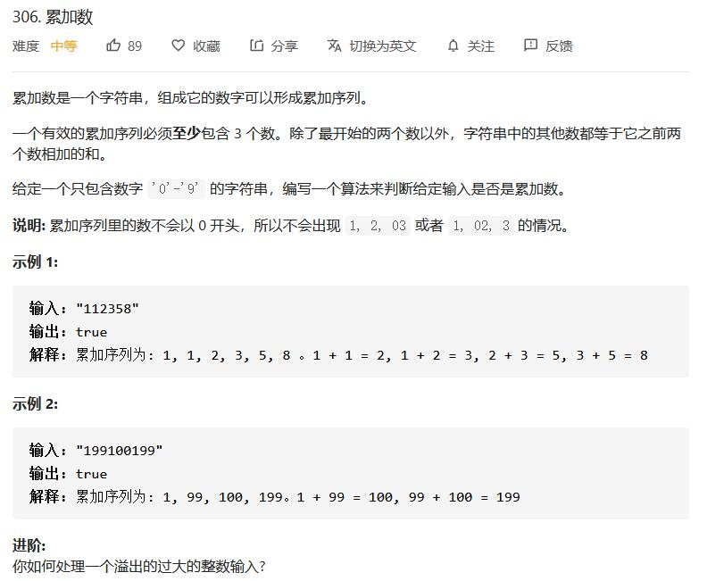

递归的枚举每个区间

```c
class Solution {
public:
    bool isAdditiveNumber(string num) {
        for (int i = 1; i < num.size(); ++i) {
            for (int j = i+1; j < num.size(); ++j) {
                if (dfs(num, 0, i, j)) return true;
            }
        }
        return false;
    }

    bool dfs(string &num, int i, int j, int k) {
        if (num[i] == '0' && j-i > 1) return false;
        if (num[j] == '0' && k-j > 1) return false;
        string s = num.substr(i, j-i);
        string t = num.substr(j, k-j);
        string sum = add(s, t);
        int len = sum.size();
        if (k+len > num.size() || num.substr(k, len) != sum) return false;
        if (k+len == num.size()) return true;
        return dfs(num, j, k, k+sum.size());
    }

    string add(string &s, string &t) {
        string ret;
        int i = s.size()-1, j = t.size()-1, tmp = 0;
        while (i >= 0 || j >= 0 || tmp) {
            int t1 = i >= 0 ? s[i]-'0' : 0;
            int t2 = j >= 0 ? t[j]-'0' : 0;
            int t = t1 + t2 + tmp;
            tmp = t / 10;
            t %= 10;
            ret += '0' + t;
            --i; --j;
        }
        reverse(ret.begin(), ret.end());
        return ret;
    }
};
```


## 恢复二叉搜索树

[题目链接](https://leetcode-cn.com/problems/recover-binary-search-tree/)


根二叉搜索树的特性，中序遍历有序。找到两个乱序的节点进行交换。

- 显示遍历
- 隐式遍历

```c
/**
 * Definition for a binary tree node.
 * struct TreeNode {
 *     int val;
 *     TreeNode *left;
 *     TreeNode *right;
 *     TreeNode() : val(0), left(nullptr), right(nullptr) {}
 *     TreeNode(int x) : val(x), left(nullptr), right(nullptr) {}
 *     TreeNode(int x, TreeNode *left, TreeNode *right) : val(x), left(left), right(right) {}
 * };
 */

class Solution {
public:
    vector<TreeNode*> vec;
    
    void recoverTree(TreeNode* root) {
        if (!root) return;
        inOrder(root);
        
        TreeNode *x = NULL, *y = NULL;
        for (int i = 0;i < vec.size()-1; ++i) {
            if (vec[i]->val > vec[i+1]->val) {
                y = vec[i+1];
                if (!x) x = vec[i];
                else break;
            }
        }
        swap(x->val, y->val);
    }

    void inOrder(TreeNode* rt) {
        if (!rt) return;
        inOrder(rt->left);
        vec.push_back(rt);
        inOrder(rt->right);
    }
};
```

```c
class Solution {
public:
    void recoverTree(TreeNode* root) {
        if (!root) return;
        TreeNode *x = NULL, *y = NULL;
        stack<TreeNode*> sta;
        TreeNode* pre = NULL;
        while (root || !sta.empty()) {
            while (root) {
                sta.push(root);
                root = root->left;
            }

            root = sta.top();
            sta.pop();
            if (pre && pre->val > root->val) {
                y = root;
                if (!x) x = pre;
                else break;
            }
            pre = root;
            root = root->right;
        }

        swap(x->val, y->val);
    }
};
```


## 最长不含重复字符的子字符串

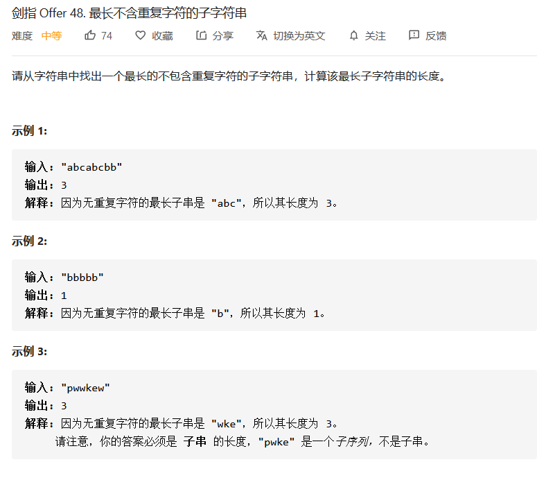

- 滑动窗口，记录每个字符最后一次出现的位置
- 简化滑动窗口

```c
class Solution {
public:
    int lengthOfLongestSubstring(string s) {
        vector<int> pos(256, -1);
        int i = 0, j = 0, ret = 0;
        while (j < s.size()) {
            if (pos[s[j]] != -1) {
                ret = max(ret, j-i);
                int tmp = pos[s[j]];
                while (i <= tmp) {
                    pos[s[i]] = -1;
                    ++i;
                }
            }
            pos[s[j]] = j;
            ++j;
        }
        ret = max(ret, j-i);
        return ret;
    }
};
```


```c
class Solution {
public:
    int lengthOfLongestSubstring(string s) {
        vector<int> pos(256, -1);
        int i = -1, j = 0, ret = 0;
        while (j < s.size()) {
            i = max(i, pos[s[j]]);
            ret = max(ret, j-i);
            pos[s[j]] = j;
            ++j;
        }
        return ret;
    }
};
```


## 二叉树中的最大路径和

[题目链接](https://leetcode-cn.com/problems/binary-tree-maximum-path-sum/)


递归

```c
class Solution {
public:
    int mx = INT_MIN;
    int maxPathSum(TreeNode* root) {
        dfs(root);
        return mx;
    }
    int dfs(TreeNode* rt) {
        if (!rt) return 0;
        int l = max(dfs(rt->left), 0);
        int r = max(dfs(rt->right), 0);
        mx = max(mx, l+r+rt->val);
        return max(l, r)+rt->val;
    }
};
```


## 整数反转

[题目链接](https://leetcode-cn.com/problems/reverse-integer/)


判断溢出

```c
class Solution {
public:
    int reverse(int x) {
        int ret = 0;
        while (x) {
            if (ret > INT_MAX/10 || ret == INT_MAX && x%10 > 7) return 0;
            if (ret < INT_MIN/10 || ret == INT_MIN && x%10 < -8) return 0;
            ret = ret*10 + x%10;
            x /= 10;
        }
        return ret;
    }
};
```


## 二叉树中的最长交错路径

[题目链接](https://leetcode-cn.com/problems/longest-zigzag-path-in-a-binary-tree/)

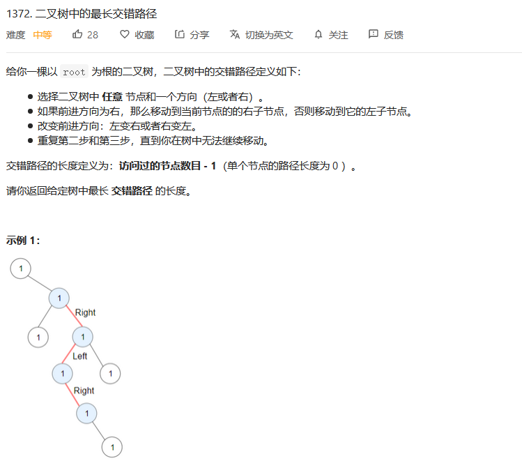

- 递归，从上到下
- 递归，从下到上


```c
class Solution {
public:
    int mx;
    int longestZigZag(TreeNode* root) {
        mx = 0;
        dfs(root, 0, 0);
        dfs(root, 1, 0);
        return mx;
    }

    void dfs(TreeNode*rt, int flag, int len) {
        mx = max(mx, len);
        if (!flag) { // left
            if (rt->left) dfs(rt->left, 1, len+1);
            if (rt->right) dfs(rt->right, 0, 1);
        }else { // right
            if (rt->right) dfs(rt->right, 0, len+1);
            if (rt->left) dfs(rt->left, 1, 1);
        }
    }
};
```


```c
class Solution {
public:
    int mx = 1;
    int longestZigZag(TreeNode* root) {
        int l = 0, r = 0;
        dfs(root, l, r);
        return mx - 1;
    }

    void dfs(TreeNode*rt, int &l, int &r) {
        if (!rt) return;
        int l1 = 0, l2 = 0;
        int r1 = 0, r2 = 0;
        dfs(rt->left, l1, l2);
        dfs(rt->right, r1, r2);
        l = l2 + 1;
        r = r1 + 1;
        mx =  max(mx, max(l, r));
    }

};
```


