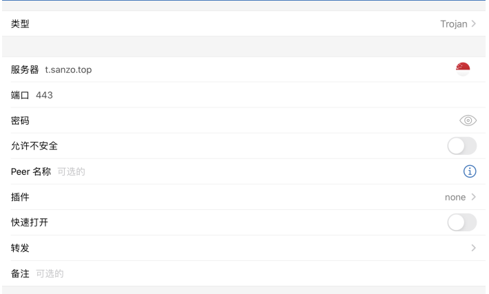

# Trojan

## 一键安装脚本

```shell
wget https://github.com/V2RaySSR/Trojan/raw/master/Trojan.sh


wget https://raw.githubusercontent.com/atrandys/trojan/master/trojan_mult.sh && chmod +x trojan_mult.sh
```

## Windwos端
启动trojan-cli下的`start.bat`

### 方法一

[SwitchyOmega安装地址](https://chrome.google.com/webstore/detail/proxy-switchyomega/padekgcemlokbadohgkifijomclgjgif)

如果浏览器中安装有SwitchyOmega插件，可以添加`socks5`代理服务器，地址是`127.0.0.1:1080`


### 方法二

在v2rayN中添加`Socks`服务器。

```shell
服务器地址: 127.0.0.1
端口: 1080
密码: your passwrod
别名: 自定义
```


添加成功之后，设置为活动服务器即可。


## Android端

[安装包下载地址](https://github.com/trojan-gfw/igniter/releases)

安装成功之后，添加配置即可。


## 苹果端

添加节点，类型选择`Trojan`，填入对用的服务器、端口和密码即可。


